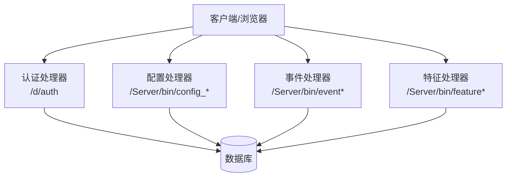
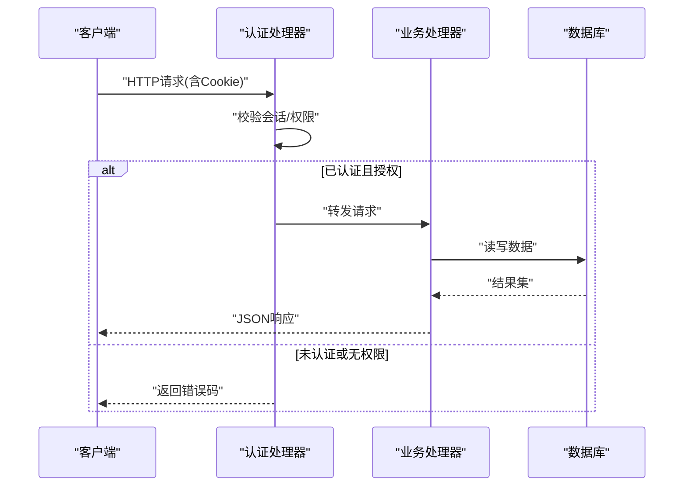
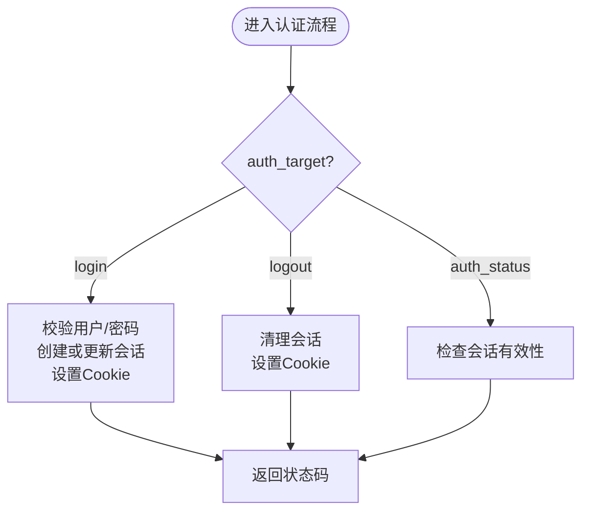
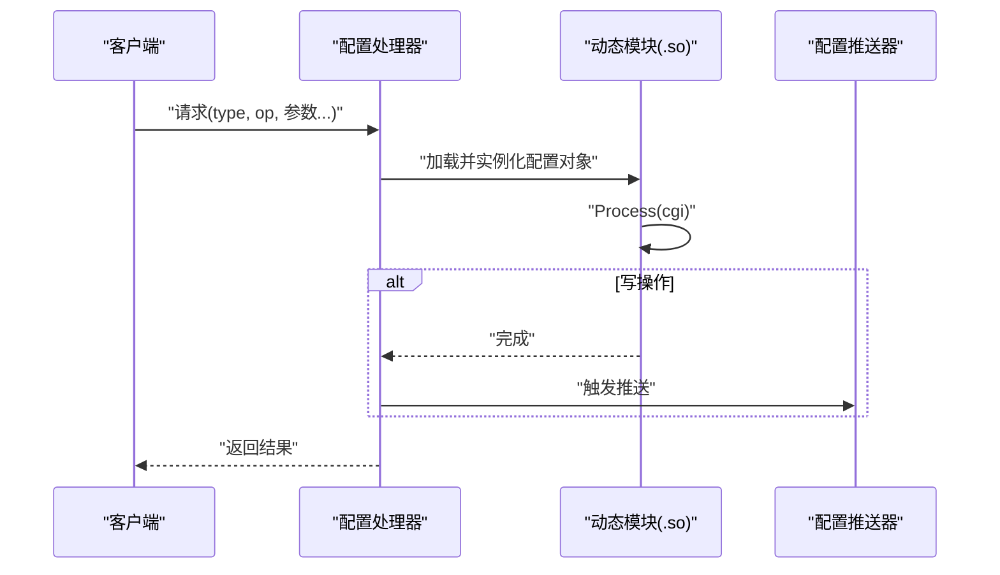
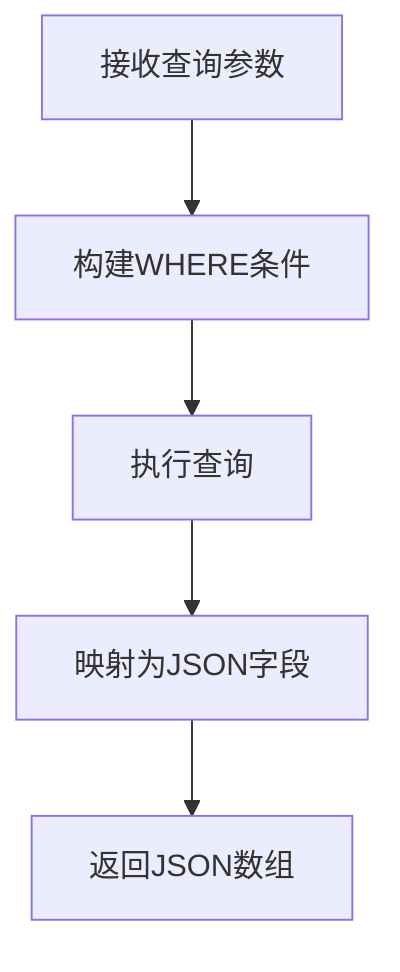
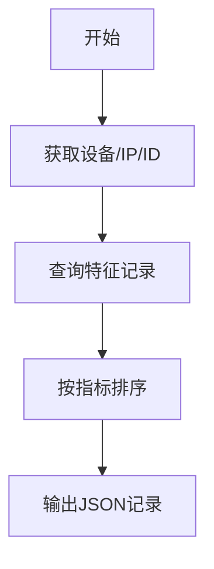
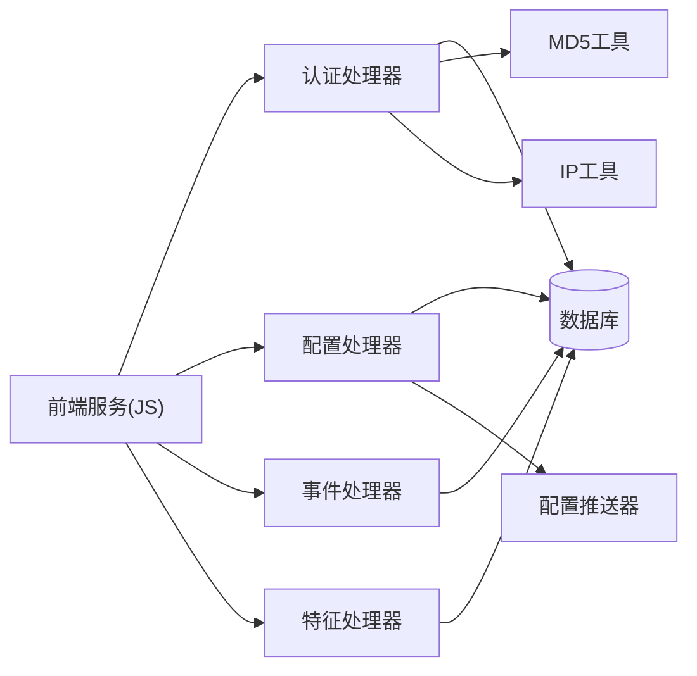

# API接口文档

<cite>
**本文引用的文件**
- [auth.cpp](file://ly_server/src/server/auth.cpp)
- [http.h](file://ly_server/src/common/http.h)
- [http.cpp](file://ly_server/src/common/http.cpp)
- [define.h](file://ly_server/src/common/define.h)
- [event.cpp](file://ly_server/src/server/event.cpp)
- [feature.cpp](file://ly_server/src/server/feature.cpp)
- [config.cpp](file://ly_server/src/server/config.cpp)
- [index.js](file://ly_vis/packages/std/src/service/index.js)
</cite>

## 目录
1. [简介](#简介)
2. [项目结构](#项目结构)
3. [核心组件](#核心组件)
4. [架构总览](#架构总览)
5. [详细组件分析](#详细组件分析)
6. [依赖关系分析](#依赖关系分析)
7. [性能考虑](#性能考虑)
8. [故障排查指南](#故障排查指南)
9. [结论](#结论)
10. [附录](#附录)

## 简介
本文件为SOC系统的API接口参考文档，覆盖RESTful设计规范、HTTP方法与URL约定、请求与响应格式、错误码定义、身份认证与权限控制、速率限制策略、WebSocket连接与事件说明（如适用）、版本管理与向后兼容、迁移指南以及测试与调试方法。内容基于代码库中的服务端实现与前端服务调用进行归纳总结，确保与实际行为一致。

## 项目结构
- 服务端（C++）：提供CGI风格的HTTP处理器，负责认证、配置下发、事件与特征查询等能力；通过数据库访问与动态加载模块扩展功能。
- 公共库：封装HTTP客户端（curl）、日志、时间、IP工具等通用能力。
- 前端服务（JS）：统一导出对后端的各类API调用函数，包括认证、事件、资产、配置、TopN、威胁情报等。

**图示来源**
- [auth.cpp:483-555](file://ly_server/src/server/auth.cpp#L483-L555)
- [config.cpp:21-80](file://ly_server/src/server/config.cpp#L21-L80)
- [event.cpp:192-200](file://ly_server/src/server/event.cpp#L192-L200)
- [feature.cpp:38-69](file://ly_server/src/server/feature.cpp#L38-L69)

**章节来源**
- [auth.cpp:483-555](file://ly_server/src/server/auth.cpp#L483-L555)
- [config.cpp:21-80](file://ly_server/src/server/config.cpp#L21-L80)
- [event.cpp:192-200](file://ly_server/src/server/event.cpp#L192-L200)
- [feature.cpp:38-69](file://ly_server/src/server/feature.cpp#L38-L69)

## 核心组件
- 认证与会话管理：基于Cookie的会话机制，支持登录、登出、状态检查；包含失败重试与锁定策略。
- 配置管理：通过动态加载SO模块处理不同配置类型（设备、代理、用户、黑白名单等），并在增删改后触发推送器。
- 事件与特征查询：提供聚合与明细查询，支持多维度过滤条件与排序输出。
- HTTP客户端：统一的GET/POST/PUT请求封装，便于内部服务间通信。

**章节来源**
- [auth.cpp:51-229](file://ly_server/src/server/auth.cpp#L51-L229)
- [config.cpp:21-80](file://ly_server/src/server/config.cpp#L21-L80)
- [event.cpp:40-189](file://ly_server/src/server/event.cpp#L40-L189)
- [feature.cpp:38-200](file://ly_server/src/server/feature.cpp#L38-L200)
- [http.cpp:23-87](file://ly_server/src/common/http.cpp#L23-L87)

## 架构总览
系统采用“认证网关 + 业务处理器”的模式。所有外部请求先经认证处理器校验会话与权限，再转发至具体业务处理器（配置、事件、特征等）。业务处理器通过数据库持久化数据，并可能触发后台任务（如配置推送）。

**图示来源**
- [auth.cpp:483-555](file://ly_server/src/server/auth.cpp#L483-L555)
- [config.cpp:21-80](file://ly_server/src/server/config.cpp#L21-L80)
- [event.cpp:192-200](file://ly_server/src/server/event.cpp#L192-L200)
- [feature.cpp:38-69](file://ly_server/src/server/feature.cpp#L38-L69)

## 详细组件分析

### 认证与会话（/d/auth）
- 入口与路由：通过环境变量SCRIPT_NAME识别路径，仅允许/d/auth。
- 操作目标：
  - login：登录，参数包含用户名、密码、会话有效期；成功设置SESSION_ID Cookie。
  - logout：登出，清理会话并延长Cookie过期时间。
  - auth_status：检查当前会话是否有效。
- 会话与权限：
  - 会话ID长度固定，存储于数据库表；支持过期清理与历史记录。
  - 角色分级：SYSADMIN、ANALYSER、VIEWER；按资源与操作进行细粒度授权。
  - 失败重试与锁定：连续多次登录失败将触发账户锁定。
- 错误码：
  - 200：成功
  - 300：失败
  - 301：认证失败
  - 302：密码错误
  - 303：已登录
  - 304：重试锁定
  - 305：超时
  - 306：无权限

**图示来源**
- [auth.cpp:244-348](file://ly_server/src/server/auth.cpp#L244-L348)
- [auth.cpp:483-555](file://ly_server/src/server/auth.cpp#L483-L555)

**章节来源**
- [auth.cpp:13-31](file://ly_server/src/server/auth.cpp#L13-L31)
- [auth.cpp:51-229](file://ly_server/src/server/auth.cpp#L51-L229)
- [auth.cpp:244-348](file://ly_server/src/server/auth.cpp#L244-L348)
- [auth.cpp:483-555](file://ly_server/src/server/auth.cpp#L483-L555)

### 配置管理（/Server/bin/config_*）
- 路由与动态加载：根据type参数拼接SO文件名，动态加载对应模块并调用CreateConfigInstance/Process/FreeConfigInstance。
- 写操作触发推送：当op为add/mod/del时，执行配置推送器以同步到相关节点。
- 典型类型：agent、device、user、bwlist、internalip、internalsrv等。

**图示来源**
- [config.cpp:21-80](file://ly_server/src/server/config.cpp#L21-L80)

**章节来源**
- [config.cpp:21-80](file://ly_server/src/server/config.cpp#L21-L80)

### 事件查询（/Server/bin/event*）
- 聚合查询：从聚合表读取，支持按时间、类型、模型、设备、级别、存活状态、处理状态等多维过滤，并按starttime排序。
- 明细查询：从明细表读取，支持时间范围、事件ID、类型、模型、设备、级别等过滤。
- 输出格式：JSON数组，字段包括id、event_id、devid、obj、type、model、level、alarm_peak、sub_events、alarm_avg、value_type、desc、duration、starttime、endtime、is_alive、proc_status、proc_comment等。

**图示来源**
- [event.cpp:40-189](file://ly_server/src/server/event.cpp#L40-L189)

**章节来源**
- [event.cpp:40-189](file://ly_server/src/server/event.cpp#L40-L189)
- [event.cpp:192-200](file://ly_server/src/server/event.cpp#L192-L200)

### 特征查询（/Server/bin/feature*）
- 设备信息获取：根据devid或全量查询设备与代理IP，用于后续特征统计。
- 记录输出：包含devid、time、duration、moid、ip/sip/dip、port/sport/dport、protocol、type、bwclass、ti_mark、srv_name等字段。
- 过滤与排序：支持按字节数、包数、对端数、流数等维度排序。

**图示来源**
- [feature.cpp:38-69](file://ly_server/src/server/feature.cpp#L38-L69)
- [feature.cpp:114-200](file://ly_server/src/server/feature.cpp#L114-L200)

**章节来源**
- [feature.cpp:38-69](file://ly_server/src/server/feature.cpp#L38-L69)
- [feature.cpp:114-200](file://ly_server/src/server/feature.cpp#L114-L200)

### HTTP客户端（内部调用）
- 提供GET/POST/PUT封装，使用curl发起请求，支持流式写入与重定向跟随。
- 错误处理：记录curl执行错误日志。

**章节来源**
- [http.h:6-11](file://ly_server/src/common/http.h#L6-L11)
- [http.cpp:23-87](file://ly_server/src/common/http.cpp#L23-L87)

### 前端服务调用（JS）
- 统一导出各业务API函数，涵盖认证、事件、MO、TopN、特征、资产、配置、黑名单/白名单、威胁情报、系统控制等。
- 便于前端页面集中调用后端接口，保持调用风格一致。

**章节来源**
- [index.js:1-74](file://ly_vis/packages/std/src/service/index.js#L1-L74)

## 依赖关系分析
- 认证处理器依赖数据库会话、MD5哈希、IP工具、CGI解析与HTTP头封装。
- 配置处理器依赖动态加载机制与数据库会话，并在写操作后触发配置推送器。
- 事件与特征处理器依赖数据库会话、Protobuf消息、字符串与IP工具。
- 前端服务依赖后端提供的HTTP接口，通过统一的服务层封装调用。

**图示来源**
- [auth.cpp:1-11](file://ly_server/src/server/auth.cpp#L1-L11)
- [config.cpp:1-80](file://ly_server/src/server/config.cpp#L1-L80)
- [event.cpp:1-15](file://ly_server/src/server/event.cpp#L1-L15)
- [feature.cpp:1-15](file://ly_server/src/server/feature.cpp#L1-L15)
- [index.js:1-74](file://ly_vis/packages/std/src/service/index.js#L1-L74)

**章节来源**
- [auth.cpp:1-11](file://ly_server/src/server/auth.cpp#L1-L11)
- [config.cpp:1-80](file://ly_server/src/server/config.cpp#L1-L80)
- [event.cpp:1-15](file://ly_server/src/server/event.cpp#L1-L15)
- [feature.cpp:1-15](file://ly_server/src/server/feature.cpp#L1-L15)
- [index.js:1-74](file://ly_vis/packages/std/src/service/index.js#L1-L74)

## 性能考虑
- 数据库查询优化：事件与特征查询均使用WHERE条件过滤，建议结合索引提升查询效率。
- 会话清理：定期清理过期会话，避免数据库膨胀。
- 动态加载：配置模块按需加载，减少启动开销。
- HTTP客户端：复用curl句柄与合理设置超时，降低网络开销。

[本节为通用指导，不直接分析具体文件]

## 故障排查指南
- 认证失败：
  - 检查Cookie中SESSION_ID是否存在且长度正确。
  - 查看登录失败次数是否达到锁定阈值。
  - 确认用户未被禁用且密码匹配。
- 配置修改无效：
  - 确认动态模块加载成功，日志中无dlopen/dlsym错误。
  - 检查写操作后是否触发了配置推送器。
- 事件/特征查询无结果：
  - 核对查询参数（时间范围、设备ID、类型等）是否正确。
  - 检查数据库连接与权限。

**章节来源**
- [auth.cpp:170-229](file://ly_server/src/server/auth.cpp#L170-L229)
- [config.cpp:41-68](file://ly_server/src/server/config.cpp#L41-L68)
- [event.cpp:40-189](file://ly_server/src/server/event.cpp#L40-L189)
- [feature.cpp:38-69](file://ly_server/src/server/feature.cpp#L38-L69)

## 结论
本系统通过认证网关统一鉴权，配合动态加载的配置处理器与稳定的事件/特征查询接口，提供了完整的SOC管理能力。建议在部署时关注数据库索引、会话清理与动态模块加载稳定性，并结合前端服务进行端到端验证。

[本节为总结性内容，不直接分析具体文件]

## 附录

### RESTful API设计规范
- 基础路径：
  - 认证：/d/auth
  - 配置：/Server/bin/config_<type>
  - 事件：/Server/bin/event*
  - 特征：/Server/bin/feature*
- HTTP方法：
  - GET：查询（事件、特征、资产、TopN等）
  - POST：提交数据（登录、配置新增/修改）
  - PUT：更新资源（部分配置更新）
- URL约定：
  - 使用下划线分隔类型，如config_agent、config_user等。
  - 查询参数通过表单或URL参数传递，如type、op、devid等。

**章节来源**
- [auth.cpp:483-555](file://ly_server/src/server/auth.cpp#L483-L555)
- [config.cpp:21-80](file://ly_server/src/server/config.cpp#L21-L80)
- [index.js:1-74](file://ly_vis/packages/std/src/service/index.js#L1-L74)

### 身份认证与权限控制
- 会话机制：基于Cookie的SESSION_ID，存储在数据库中，支持过期与历史追踪。
- 角色与资源：
  - SYSADMIN：全部权限
  - ANALYSER：受限写操作，读操作开放
  - VIEWER：仅读操作，特定资源可访问
- 安全策略：
  - 失败重试与锁定：连续失败超过阈值将锁定账户一段时间。
  - 会话有效期：默认4小时，最大30天。

**章节来源**
- [auth.cpp:13-31](file://ly_server/src/server/auth.cpp#L13-L31)
- [auth.cpp:51-229](file://ly_server/src/server/auth.cpp#L51-L229)
- [auth.cpp:350-477](file://ly_server/src/server/auth.cpp#L350-L477)

### 错误码定义
- 200：成功
- 300：失败
- 301：认证失败
- 302：密码错误
- 303：已登录
- 304：重试锁定
- 305：超时
- 306：无权限

**章节来源**
- [auth.cpp:13-31](file://ly_server/src/server/auth.cpp#L13-L31)

### WebSocket接口说明
- 当前代码库未发现WebSocket服务端实现。如需实时推送，可在现有HTTP接口基础上扩展WebSocket通道，复用认证与会鉴权逻辑。

[本节为概念性说明，不直接分析具体文件]

### API版本管理与向后兼容
- 版本策略：通过URL路径或参数区分版本（例如在type或op中加入版本号）。
- 兼容性保证：
  - 新增字段不影响旧客户端解析。
  - 废弃字段保留但标记为弃用，逐步移除。
- 迁移指南：
  - 提供并行接口过渡期。
  - 发布迁移脚本与示例代码。

[本节为通用指导，不直接分析具体文件]

### 测试与调试方法
- 使用HTTP客户端工具（如curl）调用/d/auth进行登录与状态检查。
- 通过前端服务层函数（JS）进行集成测试，覆盖认证、事件、特征、配置等场景。
- 启用日志输出，定位数据库连接、动态模块加载与网络请求问题。

**章节来源**
- [http.cpp:23-87](file://ly_server/src/common/http.cpp#L23-L87)
- [index.js:1-74](file://ly_vis/packages/std/src/service/index.js#L1-L74)