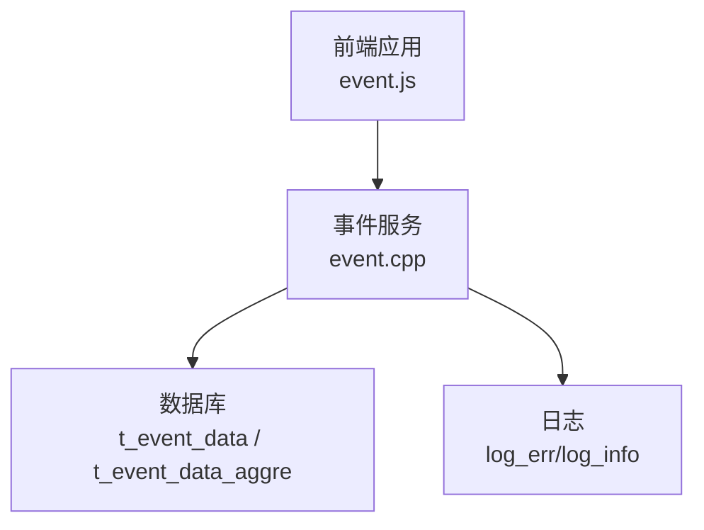
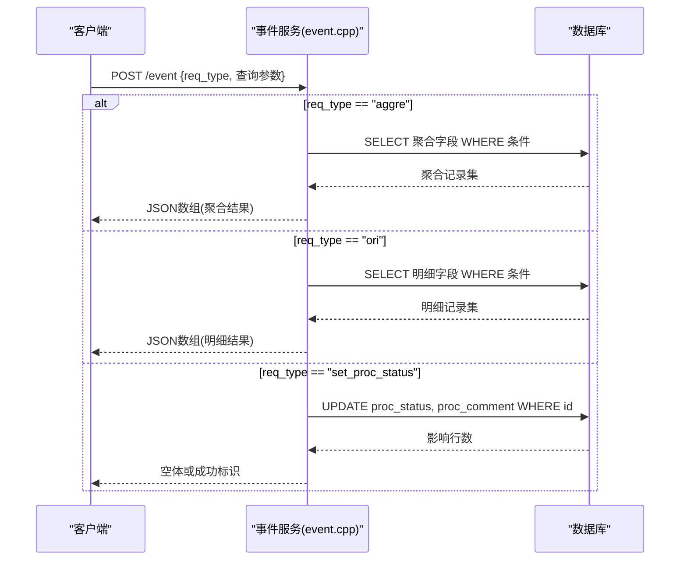
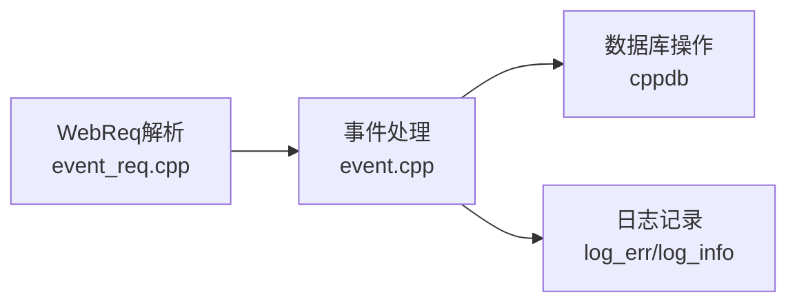

# 事件管理API

<cite>
**本文引用的文件**
- [ly_server/src/server/event.cpp](file://ly_server/src/server/event.cpp)
- [ly_server/src/common/event_req.h](file://ly_server/src/common/event_req.h)
- [ly_server/src/common/event_req.cpp](file://ly_server/src/common/event_req.cpp)
- [ly_vis/packages/std/src/service/api/event.js](file://ly_vis/packages/std/src/service/api/event.js)
</cite>

## 目录
1. [简介](#简介)
2. [项目结构](#项目结构)
3. [核心组件](#核心组件)
4. [架构总览](#架构总览)
5. [详细组件分析](#详细组件分析)
6. [依赖关系分析](#依赖关系分析)
7. [性能考虑](#性能考虑)
8. [故障排查指南](#故障排查指南)
9. [结论](#结论)
10. [附录：接口规范与示例](#附录接口规范与示例)

## 简介
本文件为“事件管理API”的完整接口文档，覆盖以下能力：
- 事件查询接口：支持时间范围过滤、事件类型筛选、设备ID过滤等条件查询。
- 事件聚合查询接口：返回聚合后的事件统计维度（如峰值、平均值、持续时间、活跃状态、处理状态等）。
- 事件处理状态更新接口：用于更新事件的处置状态与备注。
文档包含请求方法、URL路径、参数说明、响应结构、错误码及异常处理建议，并提供典型使用示例（如查询特定时间段的安全事件、按级别筛选告警、获取事件详细信息等）。

## 项目结构
后端服务通过CGI方式暴露HTTP接口，前端通过统一的POST调用事件服务。关键文件职责如下：
- ly_server/src/server/event.cpp：事件服务的入口与路由分发，负责解析请求、执行查询/聚合/状态更新并输出结果。
- ly_server/src/common/event_req.cpp/.h：WebReq解析与校验，定义请求参数与默认值策略。
- ly_vis/packages/std/src/service/api/event.js：前端封装的事件查询与状态更新调用。

图表来源
- [ly_server/src/server/event.cpp:324-356](file://ly_server/src/server/event.cpp#L324-L356)
- [ly_vis/packages/std/src/service/api/event.js:7-46](file://ly_vis/packages/std/src/service/api/event.js#L7-L46)

章节来源
- [ly_server/src/server/event.cpp:324-356](file://ly_server/src/server/event.cpp#L324-L356)
- [ly_vis/packages/std/src/service/api/event.js:7-46](file://ly_vis/packages/std/src/service/api/event.js#L7-L46)

## 核心组件
- WebReq 解析与校验：统一从URL参数或命令行解析请求参数，并进行合法性校验与默认值填充。
- 原始事件查询：基于 t_event_data 表进行条件过滤与排序，支持时间范围、类型、模型、设备ID、事件ID、对象、级别等。
- 聚合事件查询：基于 t_event_data_aggre 表进行条件过滤与排序，返回聚合字段（峰值、平均值、子事件数、持续时长、活跃状态、处理状态等）。
- 处理状态更新：更新 t_event_data_aggre 的处理状态与备注。

章节来源
- [ly_server/src/common/event_req.cpp:60-123](file://ly_server/src/common/event_req.cpp#L60-L123)
- [ly_server/src/server/event.cpp:40-189](file://ly_server/src/server/event.cpp#L40-L189)
- [ly_server/src/server/event.cpp:192-310](file://ly_server/src/server/event.cpp#L192-L310)
- [ly_server/src/server/event.cpp:312-321](file://ly_server/src/server/event.cpp#L312-L321)

## 架构总览
事件服务采用CGI模式，接收HTTP请求后根据 req_type 路由到不同处理逻辑：
- ORI：原始事件明细查询
- AGGRE：聚合事件查询
- SET_PROC_STATUS：更新事件处理状态

图表来源
- [ly_server/src/server/event.cpp:324-356](file://ly_server/src/server/event.cpp#L324-L356)
- [ly_server/src/server/event.cpp:40-189](file://ly_server/src/server/event.cpp#L40-L189)
- [ly_server/src/server/event.cpp:192-310](file://ly_server/src/server/event.cpp#L192-L310)
- [ly_server/src/server/event.cpp:312-321](file://ly_server/src/server/event.cpp#L312-L321)

## 详细组件分析

### 事件查询接口（原始明细）
- HTTP方法与路径
  - 方法：POST
  - 路径：/event
- 请求参数（WebReq）
  - starttime：起始时间戳（秒），可选；未提供时默认最近300秒窗口
  - endtime：结束时间戳（秒），可选；未提供时默认当前时间
  - step：步长（秒），可选；默认对齐到300秒且最小300
  - type：事件类型，可选
  - model：模型ID，可选
  - devid：设备ID，可选
  - event_id：事件ID，可选
  - obj：对象标识，可选
  - level：事件级别，可选
  - is_alive：活跃状态（0/1），可选
  - req_type：请求类型，固定为 ori
- 数据源与过滤
  - 数据表：t_event_data
  - 过滤条件：时间范围、type/model/devid/event_id/obj/level/is_alive
  - 排序：按 time 升序
- 响应结构（JSON数组，每项字段）
  - id：主键
  - time：事件时间（若设置step，会对齐到步长时间点）
  - event_id：事件ID
  - type：事件类型
  - model：模型ID
  - devid：设备ID
  - level：事件级别
  - obj：对象标识
  - thres_value：阈值
  - alarm_value：告警值
  - value_type：数值类型
  - desc：描述
- 典型用法
  - 查询某时间段内的安全事件：设置 starttime、endtime、type=安全相关类型
  - 按事件级别筛选告警：设置 level=高/中/低等
  - 获取事件详细信息：结合 event_id 或 id 精确查询

章节来源
- [ly_server/src/server/event.cpp:192-310](file://ly_server/src/server/event.cpp#L192-L310)
- [ly_server/src/common/event_req.cpp:60-123](file://ly_server/src/common/event_req.cpp#L60-L123)

### 事件聚合查询接口
- HTTP方法与路径
  - 方法：POST
  - 路径：/event
- 请求参数（WebReq）
  - starttime：起始时间戳（秒），可选
  - endtime：结束时间戳（秒），可选
  - type：事件类型，可选
  - model：模型ID，可选
  - devid：设备ID，可选
  - event_id：事件ID，可选
  - obj：对象标识，可选
  - level：事件级别，可选
  - is_alive：活跃状态（0/1），可选
  - proc_status：处理状态，可选
  - proc_comment：处理备注，可选
  - req_type：请求类型，固定为 aggre
- 数据源与聚合维度
  - 数据表：t_event_data_aggre
  - 聚合维度：id、event_id、devid、obj、type、model、level、alarm_peak（峰值）、sub_events（子事件数）、alarm_avg（平均值）、value_type、desc、duration（持续时长）、starttime、endtime、is_alive、proc_status、proc_comment
  - 排序：按 starttime 升序
- 响应结构（JSON数组，每项字段）
  - 同上述聚合维度字段
- 典型用法
  - 获取某时间段内各设备的告警峰值与平均值：设置 starttime、endtime、devid
  - 按事件级别筛选告警：设置 level
  - 查看事件是否仍在活跃：设置 is_alive=1

章节来源
- [ly_server/src/server/event.cpp:40-189](file://ly_server/src/server/event.cpp#L40-L189)
- [ly_server/src/common/event_req.cpp:60-123](file://ly_server/src/common/event_req.cpp#L60-L123)

### 事件处理状态更新接口
- HTTP方法与路径
  - 方法：POST
  - 路径：/event
- 请求参数（WebReq）
  - req_type：固定为 set_proc_status
  - id：要更新的事件聚合记录ID（必填）
  - proc_status：处理状态，取值限定为 processed、assigned、unprocessed（必填）
  - proc_comment：处理备注，可选（传 null 表示清空）
- 数据源与更新
  - 数据表：t_event_data_aggre
  - 更新字段：proc_status、proc_comment
- 响应结构
  - 无具体业务字段，通常为空体或仅返回HTTP状态码
- 典型用法
  - 将事件标记为已处理：proc_status=processed
  - 将事件分配给某人：proc_status=assigned，并填写 proc_comment

章节来源
- [ly_server/src/server/event.cpp:312-321](file://ly_server/src/server/event.cpp#L312-L321)
- [ly_server/src/common/event_req.cpp:83-92](file://ly_server/src/common/event_req.cpp#L83-L92)

### 前端调用封装
- 事件聚合查询：POST /event，req_type=aggre
- 事件状态更新：POST /event，req_type=set_proc_status
- 事件明细查询：前端封装了 scatter 类型（服务端当前实现为 ori/aggre/set_proc_status）

章节来源
- [ly_vis/packages/std/src/service/api/event.js:7-46](file://ly_vis/packages/std/src/service/api/event.js#L7-L46)

## 依赖关系分析
- 事件服务依赖数据库访问层（cppdb）进行SQL查询与更新。
- 请求解析依赖 WebReq 与 Protobuf 定义（event.pb.h），以及CGI库解析URL参数。
- 日志系统用于记录错误与调试信息。

图表来源
- [ly_server/src/common/event_req.cpp:98-123](file://ly_server/src/common/event_req.cpp#L98-L123)
- [ly_server/src/server/event.cpp:324-356](file://ly_server/src/server/event.cpp#L324-L356)

章节来源
- [ly_server/src/common/event_req.cpp:98-123](file://ly_server/src/common/event_req.cpp#L98-L123)
- [ly_server/src/server/event.cpp:324-356](file://ly_server/src/server/event.cpp#L324-L356)

## 性能考虑
- 时间窗口与步长：默认300秒窗口并对齐到300秒，有助于减少查询粒度与提升聚合效率。
- 索引建议：对 t_event_data 与 t_event_data_aggre 的 time/starttime/endtime、type、devid、event_id、level 建立合适索引以提升查询性能。
- 分页与限制：当前实现未内置limit/pagination，建议在应用层控制查询范围以避免大结果集。
- 连接池：数据库会话在每次请求中创建与释放，生产环境可考虑连接池优化。

[本节为通用性能建议，不直接分析具体代码文件]

## 故障排查指南
- 参数无效
  - 现象：返回HTTP 400 Invalid Params
  - 原因：URL参数解析失败或校验不通过（如 is_alive>1、proc_status非法）
  - 处理：检查请求参数格式与取值范围
- 数据库异常
  - 现象：服务端日志出现 cppdb_error
  - 原因：SQL执行错误或连接问题
  - 处理：检查数据库连接、表结构与权限
- 状态更新失败
  - 现象：更新后状态未变化
  - 原因：id不存在或事务异常
  - 处理：确认id有效性，重试并查看日志

章节来源
- [ly_server/src/server/event.cpp:328-337](file://ly_server/src/server/event.cpp#L328-L337)
- [ly_server/src/server/event.cpp:184-186](file://ly_server/src/server/event.cpp#L184-L186)
- [ly_server/src/server/event.cpp:305-307](file://ly_server/src/server/event.cpp#L305-L307)
- [ly_server/src/server/event.cpp:316-320](file://ly_server/src/server/event.cpp#L316-L320)
- [ly_server/src/common/event_req.cpp:78-92](file://ly_server/src/common/event_req.cpp#L78-L92)

## 结论
事件管理API提供了灵活的事件查询、聚合与状态管理能力，支持多维度过滤与默认时间窗口策略。通过合理设置查询参数与利用聚合维度，可满足常见安全事件分析与处置需求。生产环境中建议关注数据库索引与连接池配置，以提升稳定性与性能。

[本节为总结性内容，不直接分析具体代码文件]

## 附录：接口规范与示例

### 接口一：事件聚合查询
- 方法：POST
- 路径：/event
- 请求体（JSON）
  - req_type: "aggre"
  - starttime: 整数（秒）
  - endtime: 整数（秒）
  - type: 字符串（可选）
  - devid: 整数（可选）
  - event_id: 整数（可选）
  - level: 字符串（可选）
  - is_alive: 整数 0/1（可选）
  - proc_status: 字符串（可选）
  - proc_comment: 字符串或null（可选）
- 响应体（JSON数组）
  - 元素字段：id、event_id、devid、obj、type、model、level、alarm_peak、sub_events、alarm_avg、value_type、desc、duration、starttime、endtime、is_alive、proc_status、proc_comment
- 示例
  - 查询近5分钟的安全事件聚合：
    - 请求体：{"req_type":"aggre","starttime":当前时间-300,"endtime":当前时间,"type":"安全"}
  - 按级别筛选告警：
    - 请求体：{"req_type":"aggre","level":"高"}

章节来源
- [ly_server/src/server/event.cpp:40-189](file://ly_server/src/server/event.cpp#L40-L189)
- [ly_server/src/common/event_req.cpp:98-123](file://ly_server/src/common/event_req.cpp#L98-L123)

### 接口二：事件明细查询
- 方法：POST
- 路径：/event
- 请求体（JSON）
  - req_type: "ori"
  - starttime: 整数（秒）
  - endtime: 整数（秒）
  - step: 整数（秒，默认对齐到300且最小300）
  - type: 字符串（可选）
  - devid: 整数（可选）
  - event_id: 整数（可选）
  - level: 字符串（可选）
  - obj: 字符串（可选）
  - is_alive: 整数 0/1（可选）
- 响应体（JSON数组）
  - 元素字段：id、time、event_id、type、model、devid、level、obj、thres_value、alarm_value、value_type、desc
- 示例
  - 查询特定时间段的安全事件：
    - 请求体：{"req_type":"ori","starttime":开始时间,"endtime":结束时间,"type":"安全"}
  - 按级别筛选告警：
    - 请求体：{"req_type":"ori","level":"高"}

章节来源
- [ly_server/src/server/event.cpp:192-310](file://ly_server/src/server/event.cpp#L192-L310)
- [ly_server/src/common/event_req.cpp:60-123](file://ly_server/src/common/event_req.cpp#L60-L123)

### 接口三：事件处理状态更新
- 方法：POST
- 路径：/event
- 请求体（JSON）
  - req_type: "set_proc_status"
  - id: 整数（必填）
  - proc_status: "processed" | "assigned" | "unprocessed"（必填）
  - proc_comment: 字符串或null（可选）
- 响应体
  - 无具体业务字段
- 示例
  - 标记为已处理：
    - 请求体：{"req_type":"set_proc_status","id":12345,"proc_status":"processed","proc_comment":"已核查无误"}

章节来源
- [ly_server/src/server/event.cpp:312-321](file://ly_server/src/server/event.cpp#L312-L321)
- [ly_server/src/common/event_req.cpp:83-92](file://ly_server/src/common/event_req.cpp#L83-L92)

### 错误码与异常处理
- HTTP 400 Invalid Params
  - 触发条件：参数解析失败或校验不通过（如 is_alive>1、proc_status非法）
  - 处理建议：检查请求参数格式与取值范围
- 数据库异常
  - 触发条件：SQL执行错误或连接问题
  - 处理建议：检查数据库连接、表结构与权限，并查看服务端日志
- 状态更新失败
  - 触发条件：id不存在或事务异常
  - 处理建议：确认id有效性，重试并查看日志

章节来源
- [ly_server/src/server/event.cpp:328-337](file://ly_server/src/server/event.cpp#L328-L337)
- [ly_server/src/server/event.cpp:184-186](file://ly_server/src/server/event.cpp#L184-L186)
- [ly_server/src/server/event.cpp:305-307](file://ly_server/src/server/event.cpp#L305-L307)
- [ly_server/src/server/event.cpp:316-320](file://ly_server/src/server/event.cpp#L316-L320)
- [ly_server/src/common/event_req.cpp:78-92](file://ly_server/src/common/event_req.cpp#L78-L92)