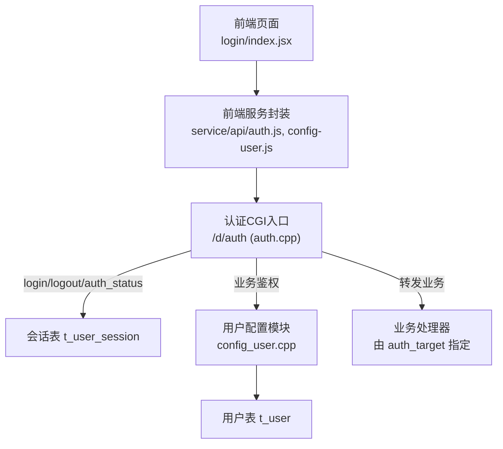
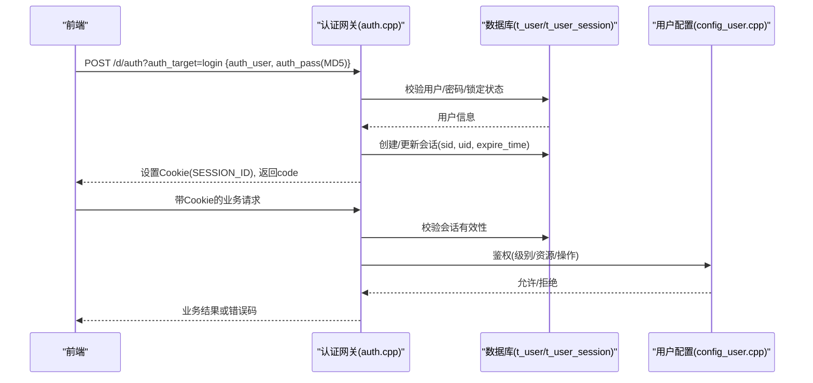
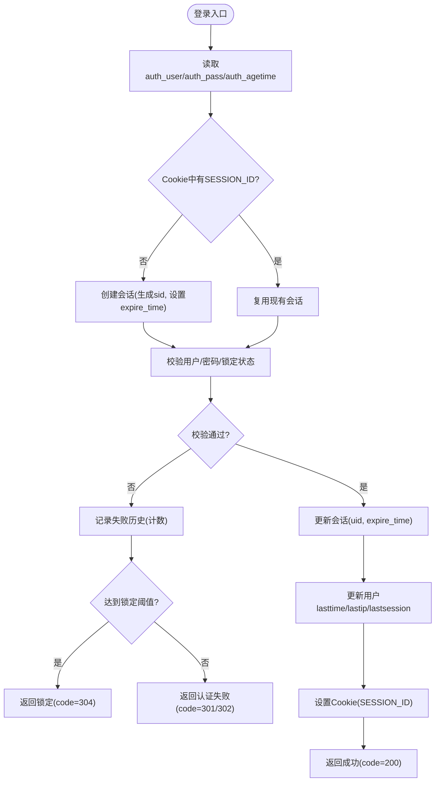
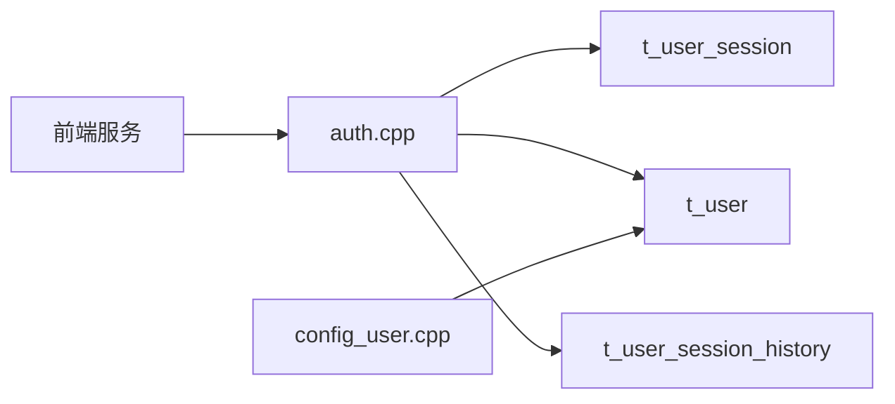

# 用户认证API

<cite>
**本文引用的文件**
- [ly_server/src/server/auth.cpp](file://ly_server/src/server/auth.cpp)
- [ly_server/src/lib/config_user.h](file://ly_server/src/lib/config_user.h)
- [ly_server/src/lib/config_user.cpp](file://ly_server/src/lib/config_user.cpp)
- [ly_vis/packages/std/src/service/api/auth.js](file://ly_vis/packages/std/src/service/api/auth.js)
- [ly_vis/packages/std/src/service/api/config-user.js](file://ly_vis/packages/std/src/service/api/config-user.js)
- [ly_vis/packages/components/utils/business/methods-auth.js](file://ly_vis/packages/components/utils/business/methods-auth.js)
- [ly_vis/packages/std/src/page/login/index.jsx](file://ly_vis/packages/std/src/page/login/index.jsx)
</cite>

## 目录
1. [简介](#简介)
2. [项目结构](#项目结构)
3. [核心组件](#核心组件)
4. [架构总览](#架构总览)
5. [详细组件分析](#详细组件分析)
6. [依赖关系分析](#依赖关系分析)
7. [性能与安全考虑](#性能与安全考虑)
8. [故障排查指南](#故障排查指南)
9. [结论](#结论)
10. [附录：接口规范与调用示例](#附录接口规范与调用示例)

## 简介
本文件面向后端与前端开发者，系统化说明本项目中“用户认证”相关API的完整实现与使用方式。内容覆盖：
- 登录、登出、会话状态检查流程
- 用户名/密码校验机制与会话管理（基于Cookie+服务端Session）
- 角色权限模型（SYSADMIN、ANALYSER、VIEWER）与访问控制策略
- 用户信息管理（增删改查）、密码修改、资源授权等接口
- 错误码定义与统一响应格式
- 安全最佳实践与防暴力破解措施

注意：当前系统未使用JWT令牌；认证采用服务端Session（Cookie中的SESSION_ID）进行会话管理。

## 项目结构
认证与用户管理涉及前后端协作：
- 后端C++服务提供统一的认证入口 /d/auth，处理 login、logout、auth_status，并转发其他业务目标到对应处理器，同时执行鉴权。
- 用户配置模块通过 config 目标（type=user）暴露用户CRUD能力。
- 前端通过 service 层封装 API 调用，并在登录页完成密码MD5加密后提交。

图表来源
- [ly_server/src/server/auth.cpp:244-320](file://ly_server/src/server/auth.cpp#L244-L320)
- [ly_server/src/lib/config_user.cpp:94-127](file://ly_server/src/lib/config_user.cpp#L94-L127)
- [ly_vis/packages/std/src/service/api/auth.js:1-10](file://ly_vis/packages/std/src/service/api/auth.js#L1-L10)
- [ly_vis/packages/std/src/service/api/config-user.js:1-10](file://ly_vis/packages/std/src/service/api/config-user.js#L1-L10)

章节来源
- [ly_server/src/server/auth.cpp:1-578](file://ly_server/src/server/auth.cpp#L1-L578)
- [ly_server/src/lib/config_user.cpp:1-443](file://ly_server/src/lib/config_user.cpp#L1-L443)
- [ly_vis/packages/std/src/service/api/auth.js:1-10](file://ly_vis/packages/std/src/service/api/auth.js#L1-L10)
- [ly_vis/packages/std/src/service/api/config-user.js:1-10](file://ly_vis/packages/std/src/service/api/config-user.js#L1-L10)

## 核心组件
- 认证网关（auth.cpp）
  - 统一入口：/d/auth，根据 auth_target 路由到 login、logout、auth_status 或转发到具体业务处理器。
  - 会话管理：创建/更新/校验 SESSION_ID（Cookie），维护过期时间，清理过期会话。
  - 登录校验：从 t_user 读取用户信息，校验密码（MD5），支持锁定时间与重试次数限制。
  - 鉴权控制：按角色（SYSADMIN/ANALYSER/VIEWER）与资源维度控制操作权限。
- 用户配置模块（config_user.cpp/.h）
  - 提供 type=user 的 CRUD 接口，支持新增用户、删除用户、修改用户属性（含密码、级别、资源、锁定时间等）。
  - 请求解析与校验，默认值填充，SQL 参数化写入。
- 前端服务封装（auth.js、config-user.js）
  - 将登录、登出、用户查询等封装为HTTP调用，统一通过 fetch.post 发送。
  - 登录时对密码进行MD5后再提交。
- 错误消息映射（methods-auth.js）
  - 将后端返回的 code 映射为用户可读的错误提示。

章节来源
- [ly_server/src/server/auth.cpp:244-320](file://ly_server/src/server/auth.cpp#L244-L320)
- [ly_server/src/lib/config_user.cpp:94-127](file://ly_server/src/lib/config_user.cpp#L94-L127)
- [ly_vis/packages/std/src/service/api/auth.js:1-10](file://ly_vis/packages/std/src/service/api/auth.js#L1-L10)
- [ly_vis/packages/std/src/service/api/config-user.js:1-10](file://ly_vis/packages/std/src/service/api/config-user.js#L1-L10)
- [ly_vis/packages/components/utils/business/methods-auth.js:1-31](file://ly_vis/packages/components/utils/business/methods-auth.js#L1-L31)

## 架构总览
认证与鉴权的关键路径如下：
- 登录：前端提交用户名与MD5后的密码至 /d/auth?auth_target=login，后端校验用户、创建/更新会话、设置Cookie。
- 鉴权：后续请求携带 Cookie(SESSION_ID)，后端校验会话有效性，并根据用户级别与资源进行细粒度控制。
- 登出：清空会话关联的用户ID，保持会话存在但失效。
- 状态检查：/d/auth?auth_target=auth_status 用于检测当前会话是否有效。

图表来源
- [ly_server/src/server/auth.cpp:244-320](file://ly_server/src/server/auth.cpp#L244-L320)
- [ly_server/src/server/auth.cpp:479-555](file://ly_server/src/server/auth.cpp#L479-L555)
- [ly_server/src/lib/config_user.cpp:94-127](file://ly_server/src/lib/config_user.cpp#L94-L127)

## 详细组件分析

### 登录流程与会话管理
- 输入参数
  - auth_user：用户名
  - auth_pass：客户端先对明文密码做MD5后再提交
  - auth_agetime：可选，会话有效期（秒），有上下限约束
- 处理逻辑
  - 若Cookie无SESSION_ID则创建新会话；否则复用现有会话
  - 校验用户是否存在、是否禁用、是否处于锁定冷却期
  - 校验密码（MD5比对）
  - 成功则更新会话uid与expire_time，并记录最后登录时间/IP/会话ID
  - 失败则记录历史尝试次数，超过阈值则锁定用户一段时间
- 输出
  - 设置Cookie: SESSION_ID，Max-Age=auth_agetime
  - 返回JSON数组包含code字段

图表来源
- [ly_server/src/server/auth.cpp:244-293](file://ly_server/src/server/auth.cpp#L244-L293)
- [ly_server/src/server/auth.cpp:170-204](file://ly_server/src/server/auth.cpp#L170-L204)

章节来源
- [ly_server/src/server/auth.cpp:244-293](file://ly_server/src/server/auth.cpp#L244-L293)
- [ly_server/src/server/auth.cpp:170-204](file://ly_server/src/server/auth.cpp#L170-L204)
- [ly_vis/packages/std/src/page/login/index.jsx:25-39](file://ly_vis/packages/std/src/page/login/index.jsx#L25-L39)

### 登出流程
- 行为
  - 清理过期会话
  - 若当前会话已登录，则将uid置空（使会话失效）
  - 保留会话sid并延长其过期时间以便清理
- 输出
  - 设置Cookie(SESSION_ID)
  - 返回code=200表示成功

章节来源
- [ly_server/src/server/auth.cpp:295-320](file://ly_server/src/server/auth.cpp#L295-L320)

### 会话状态检查
- 行为
  - 若无Cookie则创建临时会话并返回失败
  - 若有Cookie但uid为空或会话已过期，返回超时
  - 否则返回成功
- 用途
  - 前端定时刷新或路由守卫时判断是否仍登录

章节来源
- [ly_server/src/server/auth.cpp:322-348](file://ly_server/src/server/auth.cpp#L322-L348)

### 角色权限模型与访问控制
- 角色定义
  - SYSADMIN：超级管理员，拥有全部权限
  - ANALYSER：分析员，受限操作（如配置类部分MOD/GET/GGET）
  - VIEWER：只读，仅允许GET/GGET等操作
- 控制点
  - 针对 auth_target=config 且 type=user/agent/device 等场景，结合 op(ADD/DEL/MOD/GET/GGET) 与资源维度（devid/resource）进行细粒度控制
  - 非登录态或无权限时返回 CODE_FAIL_NO_AUTH(306)

章节来源
- [ly_server/src/server/auth.cpp:38-46](file://ly_server/src/server/auth.cpp#L38-L46)
- [ly_server/src/server/auth.cpp:362-477](file://ly_server/src/server/auth.cpp#L362-L477)
- [ly_server/src/server/auth.cpp:525-541](file://ly_server/src/server/auth.cpp#L525-L541)

### 用户信息管理接口（type=user）
- 入口
  - 通过业务目标 config，参数 type=user，op 指定 ADD/DEL/MOD/GET
- 能力
  - 新增用户：name、pass（可为空）、level（默认viewer）、resource、comment、disabled、lockedtime
  - 删除用户：uid
  - 修改用户：uid必填，可更新 pass/level/resource/disabled/comment/lockedtime
  - 查询用户：支持按uid/name/level/comment/disabled/lockedtime/resource过滤；sysadmin可全量查询，普通用户仅能查自身
- 数据流
  - 解析请求 -> 校验参数 -> 构建SQL -> 执行 -> 输出JSON

章节来源
- [ly_server/src/lib/config_user.cpp:94-127](file://ly_server/src/lib/config_user.cpp#L94-L127)
- [ly_server/src/lib/config_user.cpp:129-170](file://ly_server/src/lib/config_user.cpp#L129-L170)
- [ly_server/src/lib/config_user.cpp:172-215](file://ly_server/src/lib/config_user.cpp#L172-L215)
- [ly_server/src/lib/config_user.cpp:217-308](file://ly_server/src/lib/config_user.cpp#L217-L308)
- [ly_server/src/lib/config_user.cpp:310-439](file://ly_server/src/lib/config_user.cpp#L310-L439)

### 前端调用示例（参考）
- 登录
  - 调用 service/api/auth.js 的 login，传入 {auth_user, auth_pass}，其中 auth_pass 需在前端用MD5加密
  - 成功后保存用户名并跳转
- 登出
  - 调用 logout
- 用户列表
  - 调用 userApi()，内部封装为 POST config，{op:'get', type:'user'}

章节来源
- [ly_vis/packages/std/src/service/api/auth.js:1-10](file://ly_vis/packages/std/src/service/api/auth.js#L1-L10)
- [ly_vis/packages/std/src/service/api/config-user.js:1-10](file://ly_vis/packages/std/src/service/api/config-user.js#L1-L10)
- [ly_vis/packages/std/src/page/login/index.jsx:25-39](file://ly_vis/packages/std/src/page/login/index.jsx#L25-L39)

## 依赖关系分析
- 认证网关依赖
  - 数据库：t_user（用户信息、级别、资源、锁定时间等）、t_user_session（会话）、t_user_session_history（登录历史）
  - 工具：MD5哈希、IP转换、日志
- 用户配置模块依赖
  - 数据库：t_user（读写）
  - 输入：CGI参数（op/type/字段）
- 前端依赖
  - 服务封装：auth.js、config-user.js
  - 错误提示：methods-auth.js 将code映射为中文提示

图表来源
- [ly_server/src/server/auth.cpp:54-93](file://ly_server/src/server/auth.cpp#L54-L93)
- [ly_server/src/server/auth.cpp:111-168](file://ly_server/src/server/auth.cpp#L111-L168)
- [ly_server/src/lib/config_user.cpp:217-308](file://ly_server/src/lib/config_user.cpp#L217-L308)

章节来源
- [ly_server/src/server/auth.cpp:54-93](file://ly_server/src/server/auth.cpp#L54-L93)
- [ly_server/src/server/auth.cpp:111-168](file://ly_server/src/server/auth.cpp#L111-L168)
- [ly_server/src/lib/config_user.cpp:217-308](file://ly_server/src/lib/config_user.cpp#L217-L308)

## 性能与安全考虑
- 性能
  - 会话过期清理：在登出时批量删除过期会话，减少脏数据
  - 数据库查询使用参数化语句，避免注入与提升执行计划稳定性
  - 登录失败计数窗口固定（DEFAULT_RETRY_TIME），避免频繁统计开销
- 安全
  - 密码存储：服务端以MD5密文存储，前端提交前也进行MD5（建议升级至更强哈希算法）
  - 会话安全：SESSION_ID长度固定（32字符），通过UUID生成并去除分隔符
  - 防暴力破解：
    - 登录失败累计计数，超过阈值（DEFAULT_RETRY_COUNT）则在 DEFAULT_LOCK_TIME 内锁定用户
    - 锁定期间直接返回锁定码
  - 最小权限原则：VIEWER仅读，ANALYSER受限，SYSADMIN全量
  - 资源隔离：通过 resource/devid 限制用户可访问的资源范围
  - 命令注入防护：仅放行白名单内的 auth_target

章节来源
- [ly_server/src/server/auth.cpp:13-18](file://ly_server/src/server/auth.cpp#L13-L18)
- [ly_server/src/server/auth.cpp:170-204](file://ly_server/src/server/auth.cpp#L170-L204)
- [ly_server/src/server/auth.cpp:44-46](file://ly_server/src/server/auth.cpp#L44-L46)
- [ly_server/src/server/auth.cpp:557-566](file://ly_server/src/server/auth.cpp#L557-L566)

## 故障排查指南
- 常见错误码与含义
  - 200：成功
  - 300：通用失败
  - 301：用户名或密码错误
  - 302：用户名或密码错误（不同分支）
  - 303：已登录（重复登录）
  - 304：账号被锁定（触发重试上限）
  - 305：连接超时/会话失效
  - 306：暂无权限
- 前端提示
  - methods-auth.js 已将上述code映射为中文提示，便于用户理解
- 定位步骤
  - 检查Cookie是否携带SESSION_ID
  - 查看 t_user_session 中 sid 是否存在且未过期
  - 查看 t_user_session_history 中最近登录失败次数与时间
  - 检查 t_user 中 lockedtime 与当前时间差
  - 确认请求的 auth_target 是否在白名单内

章节来源
- [ly_server/src/server/auth.cpp:20-31](file://ly_server/src/server/auth.cpp#L20-L31)
- [ly_server/src/server/auth.cpp:170-204](file://ly_server/src/server/auth.cpp#L170-L204)
- [ly_vis/packages/components/utils/business/methods-auth.js:6-15](file://ly_vis/packages/components/utils/business/methods-auth.js#L6-L15)

## 结论
本系统的认证与鉴权采用“服务端Session + Cookie”的方案，具备完善的登录校验、会话生命周期管理、角色权限控制与防暴力破解机制。用户管理模块提供了完整的CRUD能力，满足多角色、多资源的访问控制需求。建议在后续迭代中：
- 升级密码哈希算法（如bcrypt/argon2）
- 引入更严格的CSRF/XSS防护
- 增加审计日志与告警
- 对敏感操作增加二次确认与MFA

## 附录：接口规范与调用示例

### 认证接口
- 登录
  - URL: /d/auth?auth_target=login
  - Method: POST
  - Body: {auth_user, auth_pass(MD5), auth_agetime(可选)}
  - 响应: [{"code": 200|301|302|303|304|305}]
  - 说明: 成功会设置Cookie(SESSION_ID)
- 登出
  - URL: /d/auth?auth_target=logout
  - Method: POST
  - 响应: [{"code": 200|300}]
- 会话状态
  - URL: /d/auth?auth_target=auth_status
  - Method: POST
  - 响应: [{"code": 200|300|305}]

章节来源
- [ly_server/src/server/auth.cpp:244-320](file://ly_server/src/server/auth.cpp#L244-L320)
- [ly_server/src/server/auth.cpp:322-348](file://ly_server/src/server/auth.cpp#L322-L348)
- [ly_vis/packages/std/src/service/api/auth.js:1-10](file://ly_vis/packages/std/src/service/api/auth.js#L1-L10)

### 用户管理接口（type=user）
- 新增用户
  - URL: /d/auth?auth_target=config
  - Method: POST
  - Body: {type:"user", op:"ADD", name, pass(可选), level(默认viewer), resource, comment, disabled(默认N), lockedtime(默认0)}
  - 响应: [{"id": 新用户的id}, ...]
- 删除用户
  - URL: /d/auth?auth_target=config
  - Method: POST
  - Body: {type:"user", op:"DEL", uid}
  - 响应: [{"..."}, ...]
- 修改用户
  - URL: /d/auth?auth_target=config
  - Method: POST
  - Body: {type:"user", op:"MOD", uid, pass(可选), level(可选), resource(可选), disabled(可选), comment(可选), lockedtime(可选)}
  - 响应: [{"..."}, ...]
- 查询用户
  - URL: /d/auth?auth_target=config
  - Method: POST
  - Body: {type:"user", op:"GET", 可选过滤条件: uid/name/level/comment/disabled/lockedtime/resource}
  - 响应: 用户列表数组

章节来源
- [ly_server/src/lib/config_user.cpp:94-127](file://ly_server/src/lib/config_user.cpp#L94-L127)
- [ly_server/src/lib/config_user.cpp:129-170](file://ly_server/src/lib/config_user.cpp#L129-L170)
- [ly_server/src/lib/config_user.cpp:172-215](file://ly_server/src/lib/config_user.cpp#L172-L215)
- [ly_server/src/lib/config_user.cpp:217-308](file://ly_server/src/lib/config_user.cpp#L217-L308)
- [ly_server/src/lib/config_user.cpp:310-439](file://ly_server/src/lib/config_user.cpp#L310-L439)
- [ly_vis/packages/std/src/service/api/config-user.js:1-10](file://ly_vis/packages/std/src/service/api/config-user.js#L1-L10)

### 前端调用示例（参考）
- 登录
  - 调用 login({auth_user, auth_pass})，其中 auth_pass 需在前端用MD5加密
  - 成功后保存用户名并跳转
- 登出
  - 调用 logout()
- 获取用户列表
  - 调用 userApi()，内部封装为 POST config {op:'get', type:'user'}

章节来源
- [ly_vis/packages/std/src/page/login/index.jsx:25-39](file://ly_vis/packages/std/src/page/login/index.jsx#L25-L39)
- [ly_vis/packages/std/src/service/api/auth.js:1-10](file://ly_vis/packages/std/src/service/api/auth.js#L1-L10)
- [ly_vis/packages/std/src/service/api/config-user.js:1-10](file://ly_vis/packages/std/src/service/api/config-user.js#L1-L10)