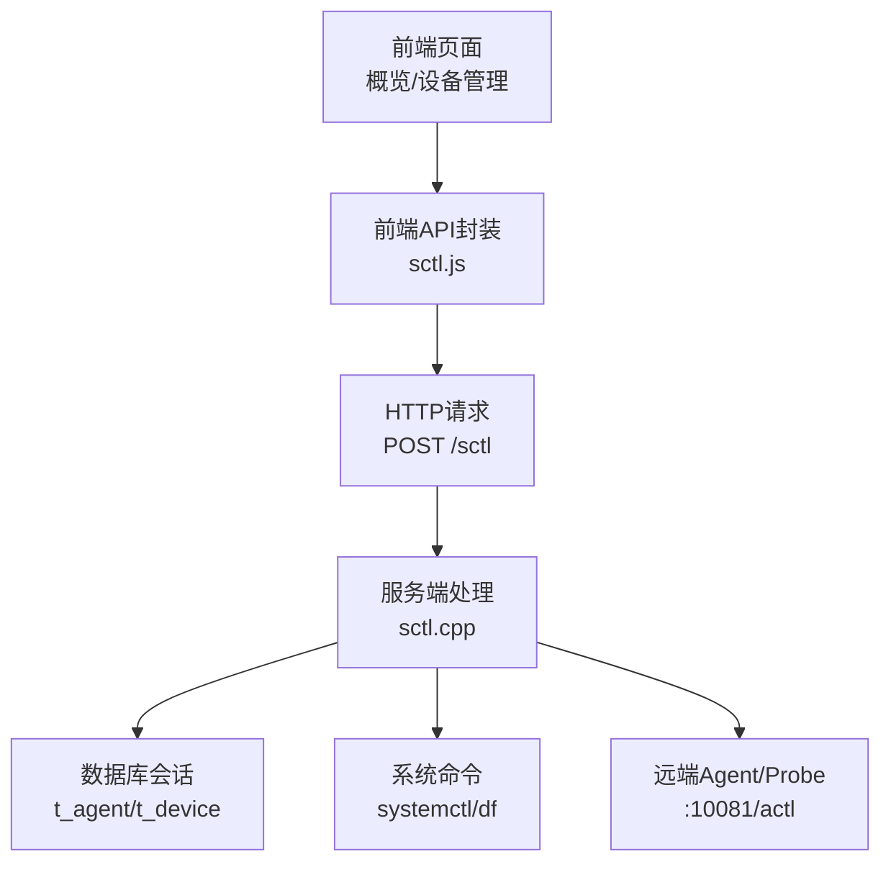
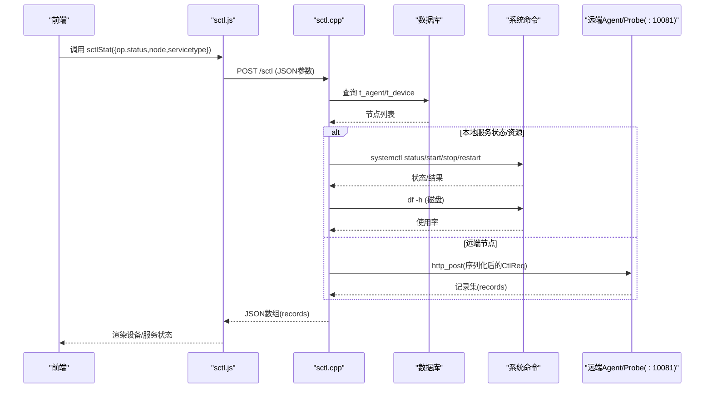
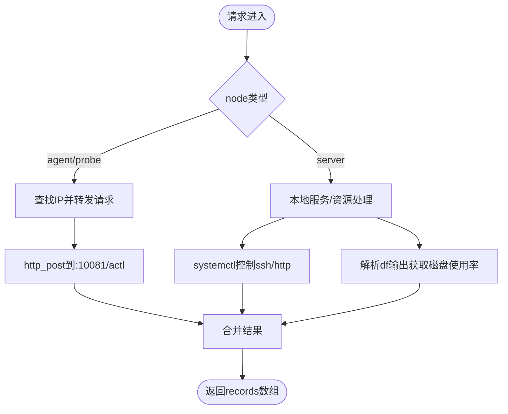
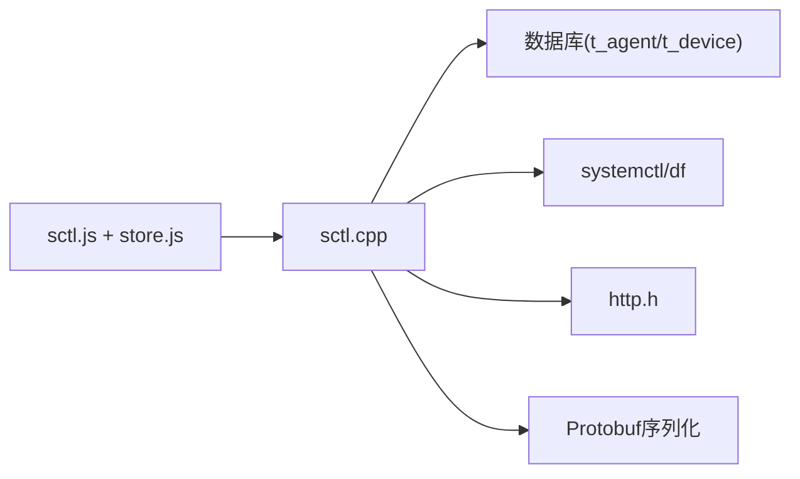
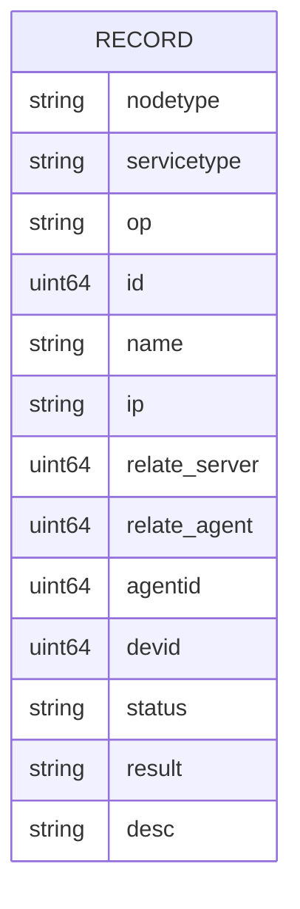

# 系统监控API

<cite>
**本文引用的文件**
- [sctl.cpp](file://ly_server/src/server/sctl.cpp)
- [sctl.js](file://ly_vis/packages/std/src/service/api/sctl.js)
- [store.js](file://ly_vis/packages/std/src/page/overview/page-child/overview-ma/store.js)
- [log.h](file://ly_server/src/common/log.h)
- [config.proto](file://ly_server/src/common/config.proto)
- [ctl_req.h](file://ly_server/src/common/ctl_req.h)
- [http.h](file://ly_server/src/common/http.h)
</cite>

## 目录
1. [简介](#简介)
2. [项目结构](#项目结构)
3. [核心组件](#核心组件)
4. [架构总览](#架构总览)
5. [详细组件分析](#详细组件分析)
6. [依赖关系分析](#依赖关系分析)
7. [性能考虑](#性能考虑)
8. [故障排查指南](#故障排查指南)
9. [结论](#结论)
10. [附录](#附录)

## 简介
本文件为系统监控API的接口文档，覆盖以下能力：
- 服务健康检查：查询节点与服务的运行状态、基础信息。
- 资源使用率：获取磁盘使用率等系统资源指标。
- 日志收集：说明日志级别、输出方式与调试开关。
- 性能指标采集：提供CPU、内存、磁盘、网络等指标的扩展接入点与示例（当前实现包含磁盘；其他指标可通过统一控制协议扩展）。
- 告警通知：基于事件配置与阈值进行告警触发与处置（前端展示与后端配置入口）。
- 运维诊断：通过控制接口对SSH、HTTP等服务进行启停与状态查询，辅助排障。

## 项目结构
系统监控相关代码主要分布在服务端与前端两部分：
- 服务端：C++实现的统一控制接口，负责节点发现、服务状态查询、资源信息采集、远程代理转发等。
- 前端：JavaScript封装了监控API调用，并在概览页中聚合展示设备与服务状态。

图表来源
- [sctl.cpp:336-506](file://ly_server/src/server/sctl.cpp#L336-L506)
- [sctl.js:1-29](file://ly_vis/packages/std/src/service/api/sctl.js#L1-L29)
- [store.js:155-195](file://ly_vis/packages/std/src/page/overview/page-child/overview-ma/store.js#L155-L195)

章节来源
- [sctl.cpp:336-506](file://ly_server/src/server/sctl.cpp#L336-L506)
- [sctl.js:1-29](file://ly_vis/packages/std/src/service/api/sctl.js#L1-L29)
- [store.js:155-195](file://ly_vis/packages/std/src/page/overview/page-child/overview-ma/store.js#L155-L195)

## 核心组件
- 统一控制接口（sctl）：对外暴露单一入口，根据node/srv/op参数路由到不同处理逻辑，支持本地与远端节点的状态查询与操作。
- 节点与服务发现：从数据库读取agent/probe列表，结合server自身信息构建节点拓扑。
- 资源采集：通过系统命令获取磁盘使用率等信息。
- 服务控制：通过systemctl对ssh/http等服务进行start/stop/restart/status操作。
- 远端代理：将请求转发至agent/probe的10081端口统一接口，聚合结果返回。

章节来源
- [sctl.cpp:119-183](file://ly_server/src/server/sctl.cpp#L119-L183)
- [sctl.cpp:185-308](file://ly_server/src/server/sctl.cpp#L185-L308)
- [sctl.cpp:336-506](file://ly_server/src/server/sctl.cpp#L336-L506)

## 架构总览
下图展示了从前端发起监控请求到服务端处理并返回结果的完整流程，包括本地与远端节点的交互。

图表来源
- [sctl.cpp:336-506](file://ly_server/src/server/sctl.cpp#L336-L506)
- [sctl.js:1-29](file://ly_vis/packages/std/src/service/api/sctl.js#L1-L29)
- [store.js:155-195](file://ly_vis/packages/std/src/page/overview/page-child/overview-ma/store.js#L155-L195)

## 详细组件分析

### 健康检查与服务状态监控
- 功能概述
  - 查询服务器、Agent、Probe节点的基础信息与运行状态。
  - 针对特定服务（如ssh、http）执行status/start/stop/restart并返回结果。
- 关键参数
  - node: server/agent/probe/all
  - servicetype: basic/all/disk/ssh/http
  - op: status/start/stop/restart
- 返回字段（records）
  - nodetype, servicetype, op, id, name, ip, relate-server, relate-agent, agentid, devid, status, result, desc
- 行为说明
  - 当node=all且servicetype=basic时，仅允许op=status。
  - 当servicetype=all时，会同时查询本地服务状态与磁盘，并遍历远端节点拉取状态。
  - 对于agent/probe节点，会将请求转发至其10081端口的统一接口。

图表来源
- [sctl.cpp:185-308](file://ly_server/src/server/sctl.cpp#L185-L308)
- [sctl.cpp:336-506](file://ly_server/src/server/sctl.cpp#L336-L506)

章节来源
- [sctl.cpp:119-183](file://ly_server/src/server/sctl.cpp#L119-L183)
- [sctl.cpp:185-308](file://ly_server/src/server/sctl.cpp#L185-L308)
- [sctl.cpp:336-506](file://ly_server/src/server/sctl.cpp#L336-L506)

### 资源使用率查询（磁盘）
- 功能概述
  - 通过系统命令获取各挂载点的磁盘使用率，过滤出关键路径（如/、/home、/data）并返回百分比。
- 输入参数
  - node=server或agent/probe（由上层决定），servicetype=disk
- 输出字段
  - status: 使用率百分比字符串（例如“73%”）
  - desc: 挂载点路径
  - result: succeed/failed
- 注意事项
  - 仅返回受关注的挂载点，避免无关数据。

章节来源
- [sctl.cpp:266-302](file://ly_server/src/server/sctl.cpp#L266-L302)

### 日志收集与级别配置
- 日志级别
  - 错误：log_err
  - 警告：log_warning
  - 信息：log_info
- 输出方式
  - 通过系统日志接口输出（vsyslog），便于集中管理与轮转。
- 调试开关
  - 环境变量DEBUG可启用调试模式，ALL或匹配源文件名时开启详细日志。
  - CGI模式下可通过dbg参数开启调试输出。
- 建议策略
  - 生产环境关闭DEBUG，使用系统日志轮转工具（如logrotate）管理日志大小与保留周期。

章节来源
- [log.h:6-40](file://ly_server/src/common/log.h#L6-L40)
- [sctl.cpp:508-526](file://ly_server/src/server/sctl.cpp#L508-L526)

### 性能指标采集（CPU/内存/磁盘/网络）
- 现状
  - 已实现磁盘使用率采集。
- 扩展方法
  - 在统一控制接口中新增servicetype分支，通过系统命令或内核接口采集CPU、内存、网络等指标，并以相同records格式返回。
  - 通过http.h提供的http_post能力，可在远端节点上执行采集并汇总。
- 建议
  - 采用轻量级命令或只读接口，避免影响业务性能。
  - 对高频指标进行采样与缓存，降低系统开销。

章节来源
- [sctl.cpp:336-506](file://ly_server/src/server/sctl.cpp#L336-L506)
- [http.h](file://ly_server/src/common/http.h)

### 告警通知（规则、渠道、升级）
- 规则配置
  - 前端提供事件类型、动作、忽略规则、级别等配置入口，用于定义告警条件与阈值。
  - 阈值单位包括字节量/秒、会话量/秒、包数量/秒等。
- 通知渠道
  - 通过通讯目标（MO）配置接收方，支持分组管理。
- 升级机制
  - 可根据事件级别与时间窗口设置升级策略（例如未处置自动升级）。
- 数据来源
  - 流量统计（bytes/pkts/flows）与速率（Bps/fps/pps）作为阈值判断依据。

章节来源
- [store.js:155-195](file://ly_vis/packages/std/src/page/overview/page-child/overview-ma/store.js#L155-L195)
- [methods-traffic.jsx:41-54](file://ly_vis/packages/components/utils/universal/methods-traffic.jsx#L41-L54)

### 运维诊断与故障排查接口
- 服务控制
  - 对ssh/http服务执行start/stop/restart/status，返回状态与结果。
- 节点连通性
  - 通过数据库中的agent/probe IP进行HTTP转发，验证远端可达性与响应。
- 常见排障步骤
  - 确认节点状态是否为active。
  - 检查服务是否running。
  - 查看磁盘使用率是否过高。
  - 启用DEBUG观察详细日志定位问题。

章节来源
- [sctl.cpp:185-308](file://ly_server/src/server/sctl.cpp#L185-L308)
- [sctl.cpp:336-506](file://ly_server/src/server/sctl.cpp#L336-L506)

## 依赖关系分析
- 模块耦合
  - sctl.cpp依赖数据库访问、系统命令、HTTP客户端与Protobuf序列化。
  - 前端通过sctl.js封装HTTP请求，并在概览页聚合展示。
- 外部依赖
  - 数据库表：t_agent、t_device
  - 系统命令：systemctl、df
  - 远端接口：agent/probe的10081/actl
- 潜在循环依赖
  - 当前未发现循环依赖；注意在扩展新servicetype时保持单向调用。

图表来源
- [sctl.cpp:336-506](file://ly_server/src/server/sctl.cpp#L336-L506)
- [sctl.js:1-29](file://ly_vis/packages/std/src/service/api/sctl.js#L1-L29)
- [store.js:155-195](file://ly_vis/packages/std/src/page/overview/page-child/overview-ma/store.js#L155-L195)

章节来源
- [sctl.cpp:336-506](file://ly_server/src/server/sctl.cpp#L336-L506)
- [sctl.js:1-29](file://ly_vis/packages/std/src/service/api/sctl.js#L1-L29)
- [store.js:155-195](file://ly_vis/packages/std/src/page/overview/page-child/overview-ma/store.js#L155-L195)

## 性能考虑
- 减少系统调用频率：对磁盘等资源指标进行定时采样与缓存。
- 批量聚合：在服务端合并多节点结果，减少前端渲染压力。
- 选择性字段：仅返回必要字段，降低网络传输开销。
- 远端转发优化：对不可达节点快速失败，避免阻塞整体响应。

## 故障排查指南
- 常见问题
  - 参数无效：检查node/servicetype/op组合是否符合限制。
  - 远端不可达：确认agent/probe的IP配置与网络连通性。
  - 服务状态异常：通过status查看具体原因，必要时重启服务。
  - 磁盘空间不足：关注关键挂载点的使用率，及时清理或扩容。
- 调试手段
  - 启用DEBUG环境变量或CGI dbg参数，查看详细日志。
  - 检查系统日志（vsyslog）以定位底层错误。
- 恢复步骤
  - 修正配置后重试请求。
  - 重启相关服务并验证状态。

章节来源
- [log.h:6-40](file://ly_server/src/common/log.h#L6-L40)
- [sctl.cpp:508-526](file://ly_server/src/server/sctl.cpp#L508-L526)

## 结论
本监控API通过统一控制接口实现了节点与服务状态查询、资源使用率采集、日志输出与调试、以及运维诊断能力。当前已实现磁盘使用率与服务控制，其他性能指标可按统一协议扩展。前端提供了便捷的调用与展示能力，便于运维人员快速掌握系统健康状况。

## 附录

### 接口定义与参数说明
- 端点：POST /sctl
- 请求体字段
  - node: server/agent/probe/all
  - servicetype: basic/all/disk/ssh/http
  - op: status/start/stop/restart
  - id: 节点标识（agent/probe时使用）
- 响应体
  - records: 数组，每条记录包含nodetype、servicetype、op、id、name、ip、relate-server、relate-agent、agentid、devid、status、result、desc等字段。

章节来源
- [sctl.cpp:336-506](file://ly_server/src/server/sctl.cpp#L336-L506)
- [sctl.js:1-29](file://ly_vis/packages/std/src/service/api/sctl.js#L1-L29)

### 数据模型（Records）

图表来源
- [sctl.cpp:40-99](file://ly_server/src/server/sctl.cpp#L40-L99)