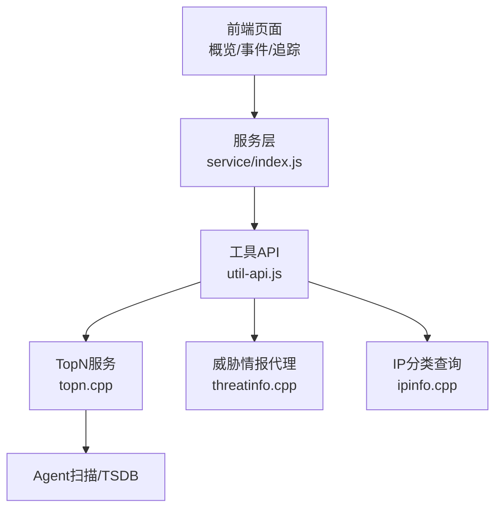
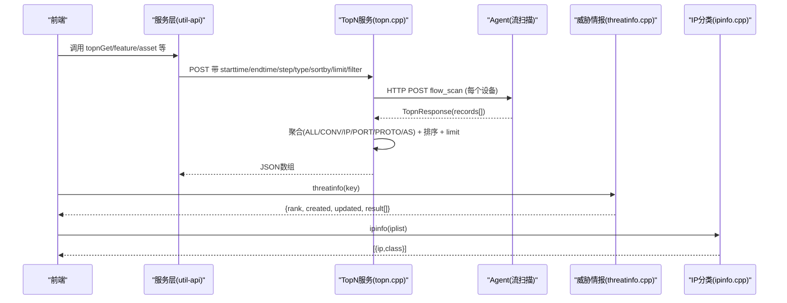
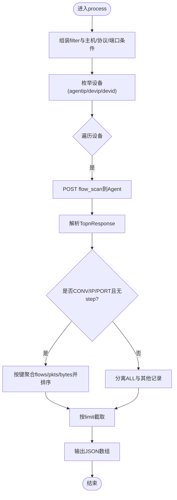
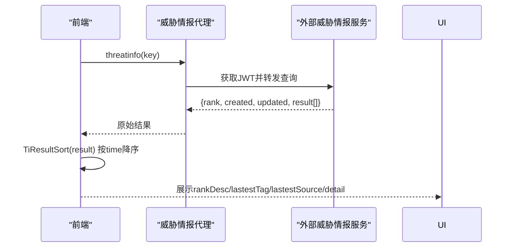
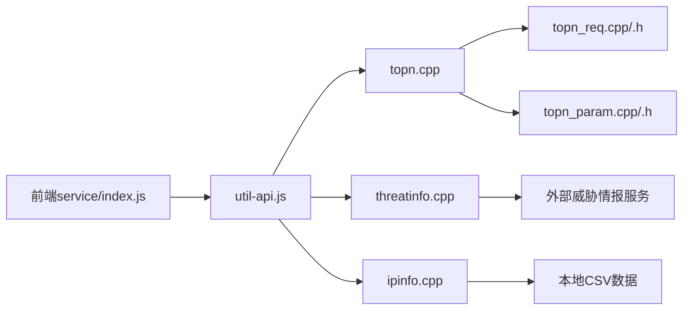

# 统计分析API

<cite>
**本文引用的文件**
- [ly_server/src/server/topn.cpp](file://ly_server/src/server/topn.cpp)
- [ly_server/src/common/topn_req.h](file://ly_server/src/common/topn_req.h)
- [ly_server/src/common/topn_req.cpp](file://ly_server/src/common/topn_req.cpp)
- [ly_server/src/common/topn_param.h](file://ly_server/src/common/topn_param.h)
- [ly_server/src/common/topn_param.cpp](file://ly_server/src/common/topn_param.cpp)
- [ly_server/src/server/threatinfo.cpp](file://ly_server/src/server/threatinfo.cpp)
- [ly_server/src/server/ipinfo.cpp](file://ly_server/src/server/ipinfo.cpp)
- [ly_vis/packages/std/src/service/index.js](file://ly_vis/packages/std/src/service/index.js)
- [ly_vis/packages/std/src/service/api/util-api.js](file://ly_vis/packages/std/src/service/api/util-api.js)
- [ly_vis/packages/std/src/utils/methods-data.jsx](file://ly_vis/packages/std/src/utils/methods-data.jsx)
- [ly_vis/packages/std/src/page/overview/page-child/overview-om/components/rank-attackdevice/index.jsx](file://ly_vis/packages/std/src/page/overview/page-child/overview-om/components/rank-attackdevice/index.jsx)
- [ly_vis/packages/std/src/page/result/data-processor.js](file://ly_vis/packages/std/src/page/result/data-processor.js)
</cite>

## 目录
1. [简介](#简介)
2. [项目结构](#项目结构)
3. [核心组件](#核心组件)
4. [架构总览](#架构总览)
5. [详细组件分析](#详细组件分析)
6. [依赖关系分析](#依赖关系分析)
7. [性能考虑](#性能考虑)
8. [故障排查指南](#故障排查指南)
9. [结论](#结论)
10. [附录：接口与示例](#附录接口与示例)

## 简介
本文件面向“统计分析API”，聚焦TopN统计、时间序列查询、多维度交叉分析与钻取能力，覆盖威胁排行、资产排行、攻击源排行等维度；说明实时与历史统计的差异，并提供大数据量下的优化策略与完整调用示例。

## 项目结构
- 服务端（C++）
  - TopN 统计入口与聚合：topn.cpp
  - 请求解析与参数校验：topn_req.cpp / topn_req.h
  - 策略与MO过滤：topn_param.cpp / topn_param.h
  - 威胁情报代理：threatinfo.cpp
  - IP分类查询：ipinfo.cpp
- 前端（JSX/JS）
  - 统一服务导出：service/index.js
  - 工具类API封装：service/api/util-api.js
  - 威胁情报结果排序与展示：utils/methods-data.jsx
  - 概览页排名组件：rank-attackdevice/index.jsx
  - 结果数据加工与指标计算：result/data-processor.js

图表来源
- [ly_server/src/server/topn.cpp:466-549](file://ly_server/src/server/topn.cpp#L466-L549)
- [ly_vis/packages/std/src/service/index.js:15-17](file://ly_vis/packages/std/src/service/index.js#L15-L17)
- [ly_vis/packages/std/src/service/api/util-api.js:21-33](file://ly_vis/packages/std/src/service/api/util-api.js#L21-L33)

章节来源
- [ly_server/src/server/topn.cpp:466-549](file://ly_server/src/server/topn.cpp#L466-L549)
- [ly_vis/packages/std/src/service/index.js:15-17](file://ly_vis/packages/std/src/service/index.js#L15-L17)

## 核心组件
- TopN 统计服务
  - 负责按设备/时间范围/过滤条件进行流量与事件聚合，支持多类型（ALL/CONV/IP/PORT/PROTO/AS等）排序与限制输出数量。
  - 支持时间步长 step（默认300秒），用于生成时间序列切片。
- 威胁情报代理
  - 通过配置获取JWT并转发到外部威胁情报服务，返回威胁等级、更新时间、来源单位及明细列表。
- IP分类查询
  - 基于本地CSV数据批量查询IP类别，用于资产/威胁上下文增强。
- 前端工具与服务
  - 统一导出各模块API；对威胁情报结果按更新时间排序；在概览页渲染TopN排名表格。

章节来源
- [ly_server/src/server/topn.cpp:237-427](file://ly_server/src/server/topn.cpp#L237-L427)
- [ly_server/src/server/threatinfo.cpp:79-139](file://ly_server/src/server/threatinfo.cpp#L79-L139)
- [ly_server/src/server/ipinfo.cpp:54-109](file://ly_server/src/server/ipinfo.cpp#L54-L109)
- [ly_vis/packages/std/src/service/index.js:15-17](file://ly_vis/packages/std/src/service/index.js#L15-L17)
- [ly_vis/packages/std/src/service/api/util-api.js:21-33](file://ly_vis/packages/std/src/service/api/util-api.js#L21-L33)
- [ly_vis/packages/std/src/utils/methods-data.jsx:355-377](file://ly_vis/packages/std/src/utils/methods-data.jsx#L355-L377)

## 架构总览
TopN统计由Web服务接收HTTP请求，解析参数后向多个Agent发起流扫描请求，汇总响应并按指定维度聚合、排序，最终输出JSON数组。威胁情报与IP分类作为辅助信息，在前端或后端组合展示。

图表来源
- [ly_server/src/server/topn.cpp:466-549](file://ly_server/src/server/topn.cpp#L466-L549)
- [ly_server/src/server/threatinfo.cpp:79-139](file://ly_server/src/server/threatinfo.cpp#L79-L139)
- [ly_server/src/server/ipinfo.cpp:54-109](file://ly_server/src/server/ipinfo.cpp#L54-L109)
- [ly_vis/packages/std/src/service/api/util-api.js:21-33](file://ly_vis/packages/std/src/service/api/util-api.js#L21-L33)

## 详细组件分析

### TopN 统计接口
- 功能
  - 支持按设备、时间范围、协议/端口/IP过滤，按类型（ALL/CONV/IP/PORT/PROTO/AS）排序，限制返回条数。
  - 支持时间步长 step（默认300秒），用于生成时间序列切片。
- 关键逻辑
  - 请求组装：将filter、host、proto、port等合并为查询表达式。
  - 设备枚举：根据devid或全量设备，构造agent/dev地址列表。
  - 远程扫描：向每个Agent的flow_scan发送TopnReq，解析TopnResponse。
  - 聚合与排序：
    - 当sortby为CONV/IP/PORT且无step时，进行二次聚合（按SIP+SPORT+PROTO+DIP+DPORT或SIP/SPORT/DIP/DPORT分组），累加flows/pkts/bytes，再按bytes降序取前N。
    - ALL记录单独收集用于总量展示。
  - 输出：拼接为JSON数组，包含每条记录的字段（如devid/time/type/IP/SIP/DIP/protocol/port/.../flows/pkts/bytes）。
- 参数要点
  - devid/starttime/endtime/step/limit/type(sortby)/srcdst/filter/proto/port等。
  - orderby可设为BYTES/PKTS/FLOWS控制排序指标。
  - include/exclude支持策略名与MO组展开。
- 错误处理
  - 非法filter/参数校验失败会拒绝请求；网络异常或解析失败会记录日志。

图表来源
- [ly_server/src/server/topn.cpp:466-549](file://ly_server/src/server/topn.cpp#L466-L549)
- [ly_server/src/server/topn.cpp:237-427](file://ly_server/src/server/topn.cpp#L237-L427)
- [ly_server/src/common/topn_req.cpp:101-125](file://ly_server/src/common/topn_req.cpp#L101-L125)

章节来源
- [ly_server/src/server/topn.cpp:237-427](file://ly_server/src/server/topn.cpp#L237-L427)
- [ly_server/src/server/topn.cpp:466-549](file://ly_server/src/server/topn.cpp#L466-L549)
- [ly_server/src/common/topn_req.cpp:101-125](file://ly_server/src/common/topn_req.cpp#L101-L125)
- [ly_server/src/common/topn_req.cpp:181-272](file://ly_server/src/common/topn_req.cpp#L181-L272)

### 威胁排行（威胁情报）
- 功能
  - 根据key（IP/域名/URL等）查询威胁情报，返回威胁等级、收录/更新时间、来源单位与明细列表。
- 流程
  - 从配置文件读取KEY/HOST/PORT/URL，先请求JWT签名，再携带jwt转发到外部威胁情报服务。
  - 返回结果在前端按更新时间排序，展示最新标签与来源。
- 前端处理
  - 使用TiResultSort对result按time降序排列，提取最新tag与source。

图表来源
- [ly_server/src/server/threatinfo.cpp:79-139](file://ly_server/src/server/threatinfo.cpp#L79-L139)
- [ly_vis/packages/std/src/utils/methods-data.jsx:355-377](file://ly_vis/packages/std/src/utils/methods-data.jsx#L355-L377)

章节来源
- [ly_server/src/server/threatinfo.cpp:79-139](file://ly_server/src/server/threatinfo.cpp#L79-L139)
- [ly_vis/packages/std/src/utils/methods-data.jsx:355-377](file://ly_vis/packages/std/src/utils/methods-data.jsx#L355-L377)

### 资产排行与攻击源排行
- 资产排行
  - 通过TopN的type=IP/PORT/PROTO/AS等维度聚合，结合IP分类（ipinfo）得到资产类别，形成资产排行。
- 攻击源排行
  - 以SIP维度聚合，结合威胁情报与资产信息，展示攻击源TopN。
- 前端展示
  - 概览页RankAttackDevice组件渲染Top5表格，数据来源来自store中的rankAttackDevice/rankVictimDevice/rankAssetDesc。

章节来源
- [ly_vis/packages/std/src/page/overview/page-child/overview-om/components/rank-attackdevice/index.jsx:75-109](file://ly_vis/packages/std/src/page/overview/page-child/overview-om/components/rank-attackdevice/index.jsx#L75-L109)
- [ly_server/src/server/topn.cpp:237-427](file://ly_server/src/server/topn.cpp#L237-L427)
- [ly_server/src/server/ipinfo.cpp:54-109](file://ly_server/src/server/ipinfo.cpp#L54-L109)

### 时间序列数据查询
- 粒度控制
  - 通过step参数控制时间切片大小（默认300秒），用于生成小时/天/周/月等不同粒度的时间序列。
  - 前端可根据starttime/endtime计算gap，生成时间点数组，并将事件按5分钟对齐归桶。
- 典型用法
  - 事件散点图：req_type='scatter'，按type分桶统计频次。
  - TopN时序：设置step，后端按步长聚合输出多条记录，前端绘制趋势。

章节来源
- [ly_server/src/server/topn.cpp:488-490](file://ly_server/src/server/topn.cpp#L488-L490)
- [ly_vis/packages/std/src/page/event/page-child/event-detail/components/feature-timing/components/feature-desc/index.jsx:13-25](file://ly_vis/packages/std/src/page/event/page-child/event-detail/components/feature-timing/components/feature-desc/index.jsx#L13-L25)
- [ly_vis/packages/std/src/page/result/page-child/info-event/store.js:23-37](file://ly_vis/packages/std/src/page/result/page-child/info-event/store.js#L23-L37)

### 多维度分析与数据钻取
- 多维聚合
  - 支持按CONV（五元组）、IP（SIP/DIP）、PORT（SPORT/DPORT）、PROTO、AS等多维度聚合，按bytes/flows/pkts排序。
- 钻取能力
  - 前端可对TopN条目进一步查询威胁情报、IP分类、资产详情，实现从宏观排行到微观细节的钻取。
- 指标计算
  - 连接类型识别（tToV/vToT/loop）、Bps/pps/fps速率、累计字节/包/流等。

章节来源
- [ly_server/src/server/topn.cpp:298-405](file://ly_server/src/server/topn.cpp#L298-L405)
- [ly_vis/packages/std/src/page/result/data-processor.js:330-360](file://ly_vis/packages/std/src/page/result/data-processor.js#L330-L360)
- [ly_vis/packages/std/src/page/result/data-processor.js:362-493](file://ly_vis/packages/std/src/page/result/data-processor.js#L362-L493)

### 实时统计与历史统计差异
- 实时统计
  - 通常starttime接近当前时间，step较小，关注近实时趋势与告警。
- 历史统计
  - 大范围starttime/endtime，可通过增大step减少数据量；必要时结合include/exclude与过滤条件缩小扫描面。
- 建议
  - 历史大跨度查询优先使用较大step与严格过滤；实时场景使用默认step或更小步长以获得更高精度。

章节来源
- [ly_server/src/server/topn.cpp:488-490](file://ly_server/src/server/topn.cpp#L488-L490)
- [ly_server/src/common/topn_req.cpp:181-272](file://ly_server/src/common/topn_req.cpp#L181-L272)

## 依赖关系分析
- 模块耦合
  - topn.cpp依赖topn_req.*进行参数解析与过滤组装；依赖topn_param.*进行MO与策略展开。
  - threatinfo.cpp依赖配置文件与外部服务；ipinfo.cpp依赖本地CSV数据。
- 外部集成
  - Agent的flow_scan接口；外部威胁情报服务；本地IP分类数据。

图表来源
- [ly_server/src/server/topn.cpp:1-19](file://ly_server/src/server/topn.cpp#L1-L19)
- [ly_server/src/common/topn_req.h:1-17](file://ly_server/src/common/topn_req.h#L1-L17)
- [ly_server/src/common/topn_param.h:1-20](file://ly_server/src/common/topn_param.h#L1-L20)
- [ly_vis/packages/std/src/service/index.js:15-17](file://ly_vis/packages/std/src/service/index.js#L15-L17)
- [ly_vis/packages/std/src/service/api/util-api.js:21-33](file://ly_vis/packages/std/src/service/api/util-api.js#L21-L33)

章节来源
- [ly_server/src/server/topn.cpp:1-19](file://ly_server/src/server/topn.cpp#L1-L19)
- [ly_server/src/common/topn_req.h:1-17](file://ly_server/src/common/topn_req.h#L1-L17)
- [ly_server/src/common/topn_param.h:1-20](file://ly_server/src/common/topn_param.h#L1-L20)
- [ly_vis/packages/std/src/service/index.js:15-17](file://ly_vis/packages/std/src/service/index.js#L15-L17)
- [ly_vis/packages/std/src/service/api/util-api.js:21-33](file://ly_vis/packages/std/src/service/api/util-api.js#L21-L33)

## 性能考虑
- 后端优化
  - 合理设置step：大跨度查询增大step以减少数据量；实时查询保持较小step。
  - 使用limit限制返回条数，避免前端渲染压力。
  - 利用include/exclude与filter精准过滤，减少扫描范围。
  - 对CONV/IP/PORT在无step时进行内存聚合，注意内存占用。
- 前端优化
  - 对威胁情报结果按时间排序仅取最近项，减少展示数据量。
  - 使用分页与虚拟滚动（如AntdTableSuper）提升渲染性能。
  - 对时间序列数据进行归桶与采样，降低图表数据点数量。

[本节为通用指导，不直接分析具体文件]

## 故障排查指南
- 常见错误
  - 非法filter或参数：检查filter字符集与必填参数；确认IP格式正确。
  - 威胁情报获取失败：检查配置文件KEY/HOST/PORT/URL与网络连通性；查看JWT获取状态码。
  - IP分类为空：确认本地CSV路径与权限；检查iplist传参格式。
- 定位方法
  - 开启debug模式（如topn的dbg参数）查看请求与响应。
  - 检查日志输出（log_err/log_info）定位异常位置。

章节来源
- [ly_server/src/server/topn.cpp:572-588](file://ly_server/src/server/topn.cpp#L572-L588)
- [ly_server/src/server/threatinfo.cpp:65-77](file://ly_server/src/server/threatinfo.cpp#L65-L77)
- [ly_server/src/server/ipinfo.cpp:27-51](file://ly_server/src/server/ipinfo.cpp#L27-L51)

## 结论
TopN统计API提供了灵活的多维度聚合与排序能力，配合威胁情报与IP分类，可实现威胁排行、资产排行、攻击源排行等关键视图。通过step控制时间粒度，满足实时与历史两种场景。建议在大数据量下采用合理过滤、限制返回与前端采样策略，确保系统稳定与用户体验。

[本节为总结，不直接分析具体文件]

## 附录：接口与示例

### TopN 统计
- 请求方式
  - POST /topn（或对应路由）
- 关键参数
  - devid: 设备ID（可选，默认1）
  - starttime/endtime: 起止时间戳（秒）
  - step: 时间步长（秒，默认300）
  - type: 排序维度（ALL/CONV/IP/PORT/PROTO/AS）
  - sortby: 排序字段（BYTE/PKT/FLOW）
  - limit: 返回条数上限
  - filter: 过滤表达式（支持host/proto/port等）
  - srcdst: 方向筛选（src/dst/srcdst）
  - include/exclude: 策略与MO展开
- 返回结构（节选）
  - 数组元素包含：devid、time、type、IP/SIP/DIP、protocol、port/ports、flags/tos、app_proto、context、popular_service/service/scanner/whitelist/blacklist、moid、service_type/service_name/service_info*、flows/pkts/bytes等
- 示例
  - 查询某设备近1小时TOP10连接（按bytes）：
    - 参数：devid=1, starttime=now-3600, endtime=now, step=300, type=CONV, sortby=BYTE, limit=10
  - 查询协议分布TOP5：
    - 参数：devid=1, starttime=now-3600, endtime=now, step=300, type=PROTO, sortby=FLOW, limit=5

章节来源
- [ly_server/src/server/topn.cpp:466-549](file://ly_server/src/server/topn.cpp#L466-L549)
- [ly_server/src/common/topn_req.cpp:181-272](file://ly_server/src/common/topn_req.cpp#L181-L272)
- [ly_server/src/server/topn.cpp:90-230](file://ly_server/src/server/topn.cpp#L90-L230)

### 威胁情报
- 请求方式
  - POST /threatinfo
- 参数
  - key: 查询键（IP/域名/URL）
  - op: 操作（get等）
- 返回结构（节选）
  - rank: 威胁等级
  - created/updated: 收录/更新时间
  - result: 明细列表（含src/tag/time等）
- 示例
  - 查询IP威胁：{key:"1.2.3.4", op:"get"}

章节来源
- [ly_server/src/server/threatinfo.cpp:79-139](file://ly_server/src/server/threatinfo.cpp#L79-L139)
- [ly_vis/packages/std/src/service/api/util-api.js:21-33](file://ly_vis/packages/std/src/service/api/util-api.js#L21-L33)
- [ly_vis/packages/std/src/utils/methods-data.jsx:355-377](file://ly_vis/packages/std/src/utils/methods-data.jsx#L355-L377)

### IP分类
- 请求方式
  - POST /ipinfo
- 参数
  - iplist: 逗号分隔的IP列表
- 返回结构（节选）
  - [{ip, class}, ...]
- 示例
  - 批量查询：{iplist:"1.2.3.4,5.6.7.8"}

章节来源
- [ly_server/src/server/ipinfo.cpp:54-109](file://ly_server/src/server/ipinfo.cpp#L54-L109)
- [ly_vis/packages/std/src/service/api/util-api.js:15-19](file://ly_vis/packages/std/src/service/api/util-api.js#L15-L19)

### 前端调用与服务导出
- 服务导出
  - service/index.js统一导出topnGet、threatinfo、ipinfo等接口
- 使用示例
  - 调用topnGet获取TopN数据，传入devid/starttime/endtime/step/type/sortby/limit等
  - 调用threatinfo获取威胁情报，并在前端排序展示
  - 调用ipinfo批量查询IP分类，用于资产/威胁上下文

章节来源
- [ly_vis/packages/std/src/service/index.js:15-17](file://ly_vis/packages/std/src/service/index.js#L15-L17)
- [ly_vis/packages/std/src/service/api/util-api.js:21-33](file://ly_vis/packages/std/src/service/api/util-api.js#L21-L33)