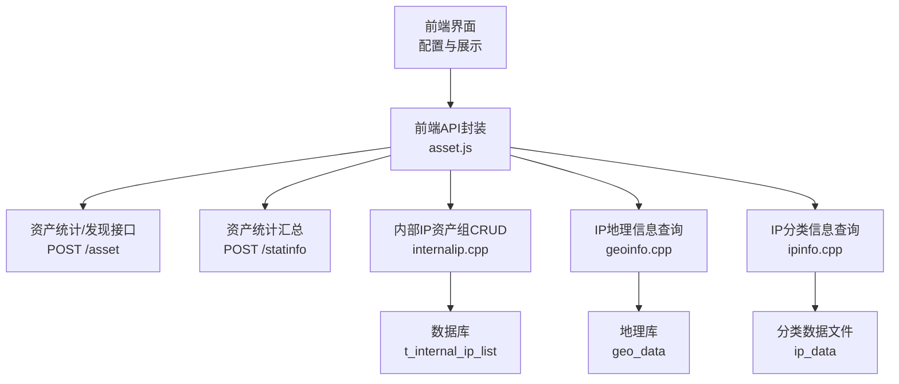
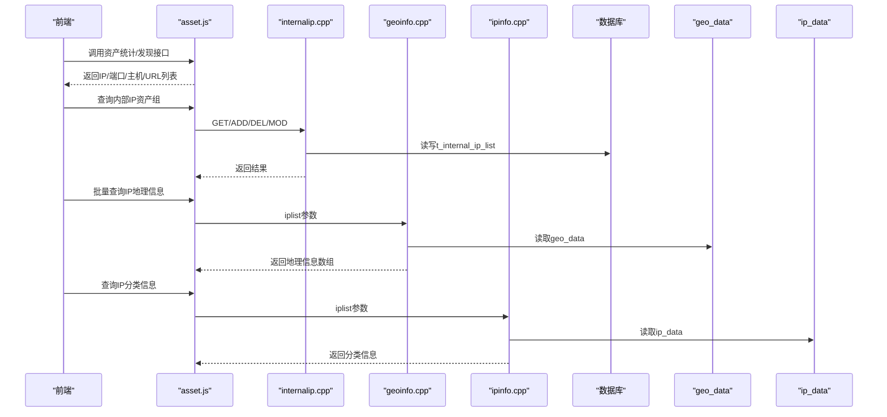
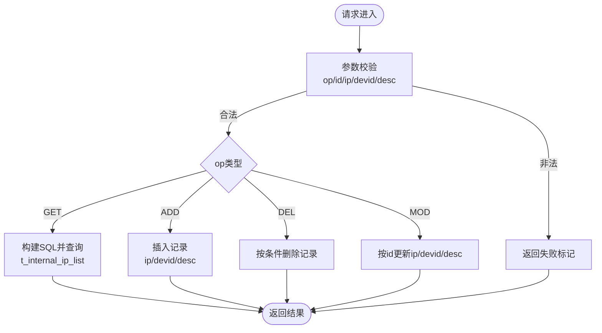
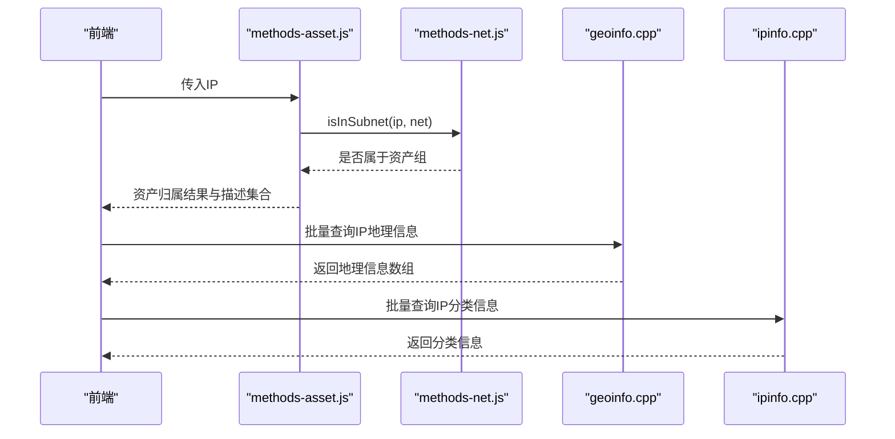
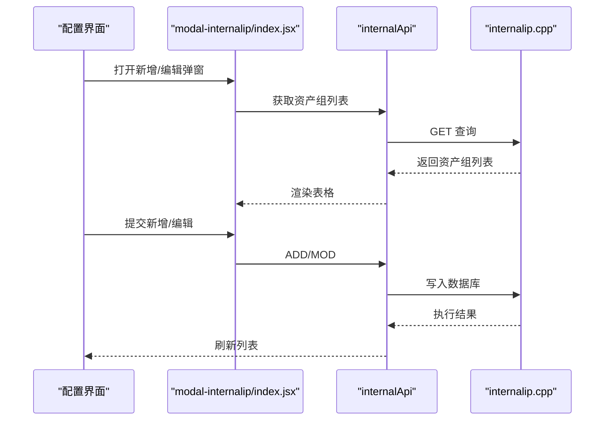
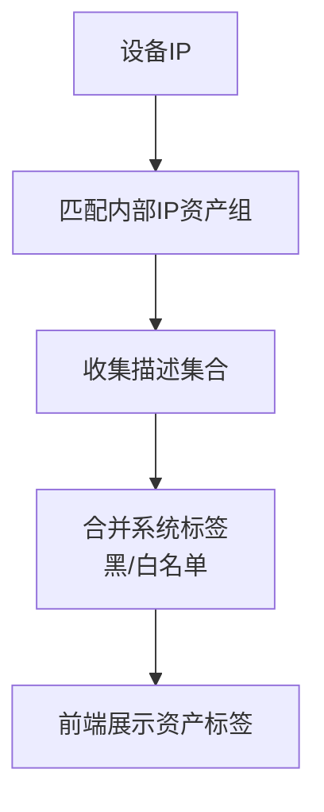
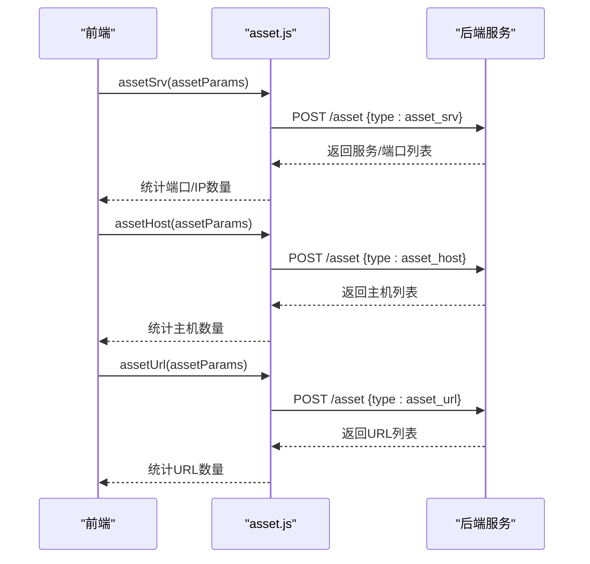
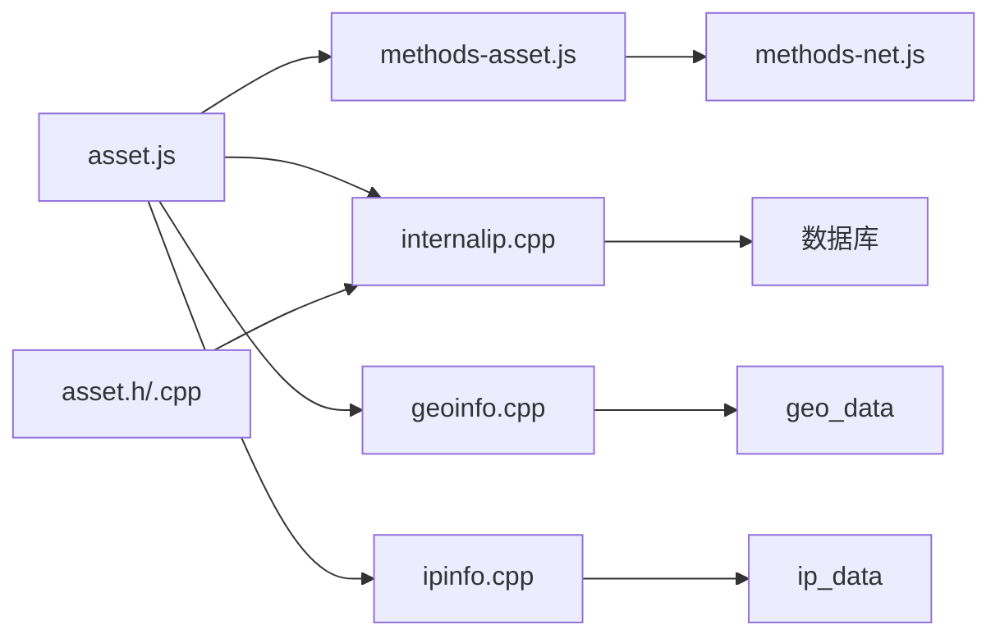

# 资产管理API

<cite>
**本文引用的文件**
- [ly_server/src/server/internalip.cpp](file://ly_server/src/server/internalip.cpp)
- [ly_server/src/server/geoinfo.cpp](file://ly_server/src/server/geoinfo.cpp)
- [ly_server/src/server/ipinfo.cpp](file://ly_server/src/server/ipinfo.cpp)
- [ly_server/src/common/asset.h](file://ly_server/src/common/asset.h)
- [ly_server/src/common/asset.cpp](file://ly_server/src/common/asset.cpp)
- [ly_vis/packages/std/src/service/api/asset.js](file://ly_vis/packages/std/src/service/api/asset.js)
- [ly_vis/packages/components/utils/business/methods-asset.js](file://ly_vis/packages/components/utils/business/methods-asset.js)
- [ly_vis/packages/components/utils/universal/methods-net.js](file://ly_vis/packages/components/utils/universal/methods-net.js)
- [ly_vis/packages/std/src/page/config/page-child/config-asset/index.jsx](file://ly_vis/packages/std/src/page/config/page-child/config-asset/index.jsx)
- [ly_vis/packages/components/ui/modal/modal-internalip/index.jsx](file://ly_vis/packages/components/ui/modal/modal-internalip/index.jsx)
- [ly_vis/packages/std/src/utils/methods-data.jsx](file://ly_vis/packages/std/src/utils/methods-data.jsx)
</cite>

## 目录
1. [简介](#简介)
2. [项目结构](#项目结构)
3. [核心组件](#核心组件)
4. [架构总览](#架构总览)
5. [详细组件分析](#详细组件分析)
6. [依赖关系分析](#依赖关系分析)
7. [性能考虑](#性能考虑)
8. [故障排查指南](#故障排查指南)
9. [结论](#结论)
10. [附录](#附录)

## 简介
本接口文档面向资产管理能力，覆盖资产信息的增删改查、IP地址信息管理（网段划分、资产归属与地理位置查询）、资产分组管理（层级结构与批量操作）、资产标签系统与自定义属性扩展机制，以及资产发现、关联与生命周期管理等高级功能。文档基于仓库中的前端服务调用与后端CGI实现进行梳理，确保与实际代码一致。

## 项目结构
- 后端服务（C++ CGI）：
  - 内部IP资产组管理：internalip.cpp
  - IP地理信息查询：geoinfo.cpp
  - IP分类信息（类型/类别）查询：ipinfo.cpp
  - 通用资产加载工具：asset.h / asset.cpp
- 前端服务（JavaScript）：
  - 资产相关API封装：service/api/asset.js
  - 资产归属判定与计算：components/utils/business/methods-asset.js
  - IP网段判断工具：components/utils/universal/methods-net.js
  - 资产配置页面与弹窗：page/config/page-child/config-asset/index.jsx、modal-internalip/index.jsx
  - 设备维度数据聚合（含资产、威胁、地理等）：utils/methods-data.jsx

图表来源
- [ly_vis/packages/std/src/service/api/asset.js:1-41](file://ly_vis/packages/std/src/service/api/asset.js#L1-L41)
- [ly_server/src/server/internalip.cpp:1-338](file://ly_server/src/server/internalip.cpp#L1-L338)
- [ly_server/src/server/geoinfo.cpp:1-91](file://ly_server/src/server/geoinfo.cpp#L1-L91)
- [ly_server/src/server/ipinfo.cpp:1-122](file://ly_server/src/server/ipinfo.cpp#L1-L122)

章节来源
- [ly_vis/packages/std/src/service/api/asset.js:1-41](file://ly_vis/packages/std/src/service/api/asset.js#L1-L41)
- [ly_server/src/server/internalip.cpp:1-338](file://ly_server/src/server/internalip.cpp#L1-L338)
- [ly_server/src/server/geoinfo.cpp:1-91](file://ly_server/src/server/geoinfo.cpp#L1-L91)
- [ly_server/src/server/ipinfo.cpp:1-122](file://ly_server/src/server/ipinfo.cpp#L1-L122)

## 核心组件
- 内部IP资产组管理（CRUD）
  - 支持新增、删除、修改、查询内部IP网段及描述、数据源绑定；自动补全掩码为/32；参数校验严格（ID、网段格式、数据源ID）。
  - 关键路径：internalip.cpp
- IP地理信息查询
  - 支持批量IP查询国家、省份、城市、运营商、经纬度、时区、邮编等信息；语言可选CN/EN。
  - 关键路径：geoinfo.cpp
- IP分类信息查询
  - 从本地CSV文件中按IP查询分类信息（如资产类型/类别），用于快速识别。
  - 关键路径：ipinfo.cpp
- 资产统计与发现
  - 通过统一入口POST /asset，支持type=asset_ip/asset_srv/asset_host/asset_url等，返回IP、端口、主机名、URL等资产发现结果。
  - 关键路径：asset.js
- 资产归属与标签
  - 前端根据配置的“内部IP资产组”判断IP是否属于资产，并生成资产标签；支持白名单/黑名单系统标签叠加。
  - 关键路径：methods-asset.js、methods-net.js、device-op/index.jsx（前端展示逻辑）

章节来源
- [ly_server/src/server/internalip.cpp:1-338](file://ly_server/src/server/internalip.cpp#L1-L338)
- [ly_server/src/server/geoinfo.cpp:1-91](file://ly_server/src/server/geoinfo.cpp#L1-L91)
- [ly_server/src/server/ipinfo.cpp:1-122](file://ly_server/src/server/ipinfo.cpp#L1-L122)
- [ly_vis/packages/std/src/service/api/asset.js:1-41](file://ly_vis/packages/std/src/service/api/asset.js#L1-L41)
- [ly_vis/packages/components/utils/business/methods-asset.js:1-38](file://ly_vis/packages/components/utils/business/methods-asset.js#L1-L38)
- [ly_vis/packages/components/utils/universal/methods-net.js:1-54](file://ly_vis/packages/components/utils/universal/methods-net.js#L1-L54)

## 架构总览
系统采用前后端分离的CGI服务模式：前端通过统一的HTTP请求访问后端CGI程序，完成资产数据的增删改查与查询；同时结合本地文件/数据库资源提供地理信息与分类信息。

图表来源
- [ly_vis/packages/std/src/service/api/asset.js:1-41](file://ly_vis/packages/std/src/service/api/asset.js#L1-L41)
- [ly_server/src/server/internalip.cpp:1-338](file://ly_server/src/server/internalip.cpp#L1-L338)
- [ly_server/src/server/geoinfo.cpp:1-91](file://ly_server/src/server/geoinfo.cpp#L1-L91)
- [ly_server/src/server/ipinfo.cpp:1-122](file://ly_server/src/server/ipinfo.cpp#L1-L122)

## 详细组件分析

### 内部IP资产组管理接口（CRUD）
- 功能说明
  - 新增：添加IP网段（自动补全/32）、可选绑定数据源ID、描述字段。
  - 删除：支持按id、ip、devid、desc组合条件删除。
  - 修改：支持更新ip、devid、desc，需指定id。
  - 查询：支持按id、ip、devid、desc过滤，返回id、ip、devid、desc。
- 参数校验
  - op必须为GET/ADD/DEL/MOD之一。
  - id、devid需符合数字格式；ip需符合CIDR格式；ADD要求ip非空；DEL要求id或ip至少一个；MOD要求id且至少更新ip或desc之一。
- 数据模型
  - 表：t_internal_ip_list
  - 字段：id、ip、devid、desc
- 错误处理
  - 参数不合法返回失败标记；数据库异常记录日志并返回失败。

图表来源
- [ly_server/src/server/internalip.cpp:68-87](file://ly_server/src/server/internalip.cpp#L68-L87)
- [ly_server/src/server/internalip.cpp:100-167](file://ly_server/src/server/internalip.cpp#L100-L167)
- [ly_server/src/server/internalip.cpp:170-190](file://ly_server/src/server/internalip.cpp#L170-L190)
- [ly_server/src/server/internalip.cpp:193-227](file://ly_server/src/server/internalip.cpp#L193-L227)
- [ly_server/src/server/internalip.cpp:241-273](file://ly_server/src/server/internalip.cpp#L241-L273)

章节来源
- [ly_server/src/server/internalip.cpp:1-338](file://ly_server/src/server/internalip.cpp#L1-L338)

### IP地址信息管理接口（网段划分、资产归属、地理位置）
- 网段划分与资产归属
  - 前端通过“内部IP资产组”配置，使用网段匹配算法判断某IP是否属于资产，并收集所属网段的描述集合，形成资产标签。
  - 支持IPv4/IPv6类型检测与子网匹配。
- 地理位置查询
  - 后端CGI读取geo_data库，按IP批量查询国家、省份、城市、运营商、经纬度、时区、邮编等信息，支持中文/英文输出。
- 分类信息查询
  - 后端CGI读取ip_data文件，按IP查询分类信息（如资产类别），用于快速识别。

图表来源
- [ly_vis/packages/components/utils/business/methods-asset.js:15-36](file://ly_vis/packages/components/utils/business/methods-asset.js#L15-L36)
- [ly_vis/packages/components/utils/universal/methods-net.js:28-54](file://ly_vis/packages/components/utils/universal/methods-net.js#L28-L54)
- [ly_server/src/server/geoinfo.cpp:21-42](file://ly_server/src/server/geoinfo.cpp#L21-L42)
- [ly_server/src/server/ipinfo.cpp:54-109](file://ly_server/src/server/ipinfo.cpp#L54-L109)

章节来源
- [ly_vis/packages/components/utils/business/methods-asset.js:1-38](file://ly_vis/packages/components/utils/business/methods-asset.js#L1-L38)
- [ly_vis/packages/components/utils/universal/methods-net.js:1-54](file://ly_vis/packages/components/utils/universal/methods-net.js#L1-L54)
- [ly_server/src/server/geoinfo.cpp:1-91](file://ly_server/src/server/geoinfo.cpp#L1-L91)
- [ly_server/src/server/ipinfo.cpp:1-122](file://ly_server/src/server/ipinfo.cpp#L1-L122)

### 资产分组管理（层级结构与批量操作）
- 层级结构
  - 当前实现以“内部IP资产组”为主，支持将IP网段与描述、数据源绑定，形成扁平化的资产分组；可通过前端配置页面进行新增、修改、删除。
- 批量操作
  - 前端支持对多个对象（如MO项）批量更新分组（groupid），通过循环调用mod接口完成批量修改。
- 配置界面
  - 提供资产组配置页与弹窗表单，包含IP输入、描述、数据源选择等字段，支持初始化与提交确认。

图表来源
- [ly_vis/packages/std/src/page/config/page-child/config-asset/index.jsx:32-69](file://ly_vis/packages/std/src/page/config/page-child/config-asset/index.jsx#L32-L69)
- [ly_vis/packages/components/ui/modal/modal-internalip/index.jsx:12-99](file://ly_vis/packages/components/ui/modal/modal-internalip/index.jsx#L12-L99)
- [ly_server/src/server/internalip.cpp:100-190](file://ly_server/src/server/internalip.cpp#L100-L190)

章节来源
- [ly_vis/packages/std/src/page/config/page-child/config-asset/index.jsx:1-73](file://ly_vis/packages/std/src/page/config/page-child/config-asset/index.jsx#L1-L73)
- [ly_vis/packages/components/ui/modal/modal-internalip/index.jsx:1-100](file://ly_vis/packages/components/ui/modal/modal-internalip/index.jsx#L1-L100)
- [ly_server/src/server/internalip.cpp:1-338](file://ly_server/src/server/internalip.cpp#L1-L338)

### 资产标签系统与自定义属性扩展机制
- 资产标签
  - 系统标签包括黑名单、白名单；资产标签来源于“内部IP资产组”的描述集合；前端在设备详情中统一展示。
- 自定义属性扩展
  - 通过“内部IP资产组”的desc字段承载业务自定义属性；前端将其作为资产标签显示，便于分类与检索。
- 展示逻辑
  - 在设备操作面板中，根据IP匹配资产组，合并系统标签与资产标签进行展示。

图表来源
- [ly_vis/packages/components/utils/business/methods-asset.js:15-36](file://ly_vis/packages/components/utils/business/methods-asset.js#L15-L36)
- [ly_vis/packages/std/src/components/device-op/index.jsx:423-447](file://ly_vis/packages/std/src/components/device-op/index.jsx#L423-L447)

章节来源
- [ly_vis/packages/components/utils/business/methods-asset.js:1-38](file://ly_vis/packages/components/utils/business/methods-asset.js#L1-L38)
- [ly_vis/packages/std/src/components/device-op/index.jsx:423-447](file://ly_vis/packages/std/src/components/device-op/index.jsx#L423-L447)

### 资产发现、关联与生命周期管理
- 资产发现
  - 通过POST /asset，type分别为asset_ip、asset_srv、asset_host、asset_url，返回对应维度的资产发现结果。
- 资产关联
  - 前端在追踪目标端展开卡片中，并行调用上述接口，统计IP、端口、主机、URL数量，形成资产关联视图。
- 生命周期管理
  - 资产的生命周期由事件与追踪流程驱动；资产标签与分组在生命周期各阶段持续生效，辅助分析与处置。

图表来源
- [ly_vis/packages/std/src/service/api/asset.js:7-34](file://ly_vis/packages/std/src/service/api/asset.js#L7-L34)
- [ly_vis/packages/std/src/page/track/components/expand-card/components/info-assetstatistic/index.jsx:46-74](file://ly_vis/packages/std/src/page/track/components/expand-card/components/info-assetstatistic/index.jsx#L46-L74)

章节来源
- [ly_vis/packages/std/src/service/api/asset.js:1-41](file://ly_vis/packages/std/src/service/api/asset.js#L1-L41)
- [ly_vis/packages/std/src/page/track/components/expand-card/components/info-assetstatistic/index.jsx:1-84](file://ly_vis/packages/std/src/page/track/components/expand-card/components/info-assetstatistic/index.jsx#L1-L84)

## 依赖关系分析
- 前端依赖
  - asset.js依赖统一fetch封装，调用后端CGI。
  - methods-asset.js依赖methods-net.js进行网段匹配。
  - 配置页面依赖modal弹窗与internalApi进行资产组管理。
- 后端依赖
  - internalip.cpp依赖数据库会话与SQL语句。
  - geoinfo.cpp依赖geo_data库。
  - ipinfo.cpp依赖ip_data文件。
  - asset.h/asset.cpp提供从文件加载资产IP集合的工具方法。

图表来源
- [ly_vis/packages/std/src/service/api/asset.js:1-41](file://ly_vis/packages/std/src/service/api/asset.js#L1-L41)
- [ly_vis/packages/components/utils/business/methods-asset.js:1-38](file://ly_vis/packages/components/utils/business/methods-asset.js#L1-L38)
- [ly_vis/packages/components/utils/universal/methods-net.js:1-54](file://ly_vis/packages/components/utils/universal/methods-net.js#L1-L54)
- [ly_server/src/server/internalip.cpp:1-338](file://ly_server/src/server/internalip.cpp#L1-L338)
- [ly_server/src/server/geoinfo.cpp:1-91](file://ly_server/src/server/geoinfo.cpp#L1-L91)
- [ly_server/src/server/ipinfo.cpp:1-122](file://ly_server/src/server/ipinfo.cpp#L1-L122)
- [ly_server/src/common/asset.h:1-12](file://ly_server/src/common/asset.h#L1-L12)
- [ly_server/src/common/asset.cpp:1-21](file://ly_server/src/common/asset.cpp#L1-L21)

章节来源
- [ly_vis/packages/std/src/service/api/asset.js:1-41](file://ly_vis/packages/std/src/service/api/asset.js#L1-L41)
- [ly_vis/packages/components/utils/business/methods-asset.js:1-38](file://ly_vis/packages/components/utils/business/methods-asset.js#L1-L38)
- [ly_vis/packages/components/utils/universal/methods-net.js:1-54](file://ly_vis/packages/components/utils/universal/methods-net.js#L1-L54)
- [ly_server/src/server/internalip.cpp:1-338](file://ly_server/src/server/internalip.cpp#L1-L338)
- [ly_server/src/server/geoinfo.cpp:1-91](file://ly_server/src/server/geoinfo.cpp#L1-L91)
- [ly_server/src/server/ipinfo.cpp:1-122](file://ly_server/src/server/ipinfo.cpp#L1-L122)
- [ly_server/src/common/asset.h:1-12](file://ly_server/src/common/asset.h#L1-L12)
- [ly_server/src/common/asset.cpp:1-21](file://ly_server/src/common/asset.cpp#L1-L21)

## 性能考虑
- 批量查询优化
  - 地理信息与分类信息均支持批量IP查询，减少网络往返与解析开销。
- 缓存策略
  - 网段匹配在前端使用缓存字典降低重复计算成本。
- 文件/数据库访问
  - 分类信息通过内存映射或一次性加载文件提升查询速度；数据库操作使用预编译语句避免注入与提升执行效率。

[本节为通用性能建议，无需特定文件引用]

## 故障排查指南
- 参数校验失败
  - 检查op、id、ip、devid是否符合规则；确保ADD时ip非空，DEL时id或ip至少一个，MOD时id必填且至少更新一项。
- 数据库异常
  - 查看日志输出，确认数据库连接与SQL执行是否正确；必要时检查表结构与权限。
- 地理/分类数据缺失
  - 确认geo_data与ip_data文件存在且可读；检查IP格式与范围是否在库内。
- 前端展示异常
  - 检查资产组配置是否正确；确认资产标签合并逻辑是否生效。

章节来源
- [ly_server/src/server/internalip.cpp:68-87](file://ly_server/src/server/internalip.cpp#L68-L87)
- [ly_server/src/server/internalip.cpp:161-167](file://ly_server/src/server/internalip.cpp#L161-L167)
- [ly_server/src/server/geoinfo.cpp:51-55](file://ly_server/src/server/geoinfo.cpp#L51-L55)
- [ly_server/src/server/ipinfo.cpp:27-51](file://ly_server/src/server/ipinfo.cpp#L27-L51)

## 结论
本资产管理API通过前后端协作，提供了完整的资产信息增删改查、IP网段划分与归属判定、地理位置与分类信息查询、资产分组管理与标签系统，以及资产发现与关联能力。建议在大规模部署时关注批量查询与缓存策略，确保性能与稳定性。

[本节为总结性内容，无需特定文件引用]

## 附录
- 常用接口速查
  - 资产统计/发现：POST /asset，type=asset_ip/asset_srv/asset_host/asset_url
  - 资产统计汇总：POST /statinfo，type=asset
  - 内部IP资产组CRUD：internalip.cpp，op=GET/ADD/DEL/MOD
  - IP地理信息查询：geoinfo.cpp，参数iplist
  - IP分类信息查询：ipinfo.cpp，参数iplist

章节来源
- [ly_vis/packages/std/src/service/api/asset.js:1-41](file://ly_vis/packages/std/src/service/api/asset.js#L1-L41)
- [ly_server/src/server/internalip.cpp:1-338](file://ly_server/src/server/internalip.cpp#L1-L338)
- [ly_server/src/server/geoinfo.cpp:1-91](file://ly_server/src/server/geoinfo.cpp#L1-L91)
- [ly_server/src/server/ipinfo.cpp:1-122](file://ly_server/src/server/ipinfo.cpp#L1-L122)