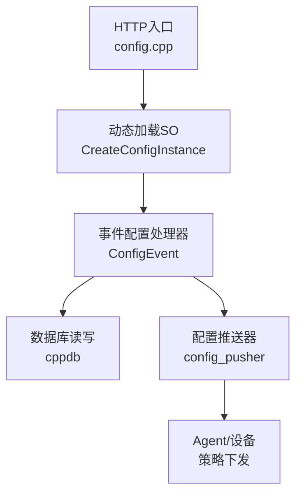
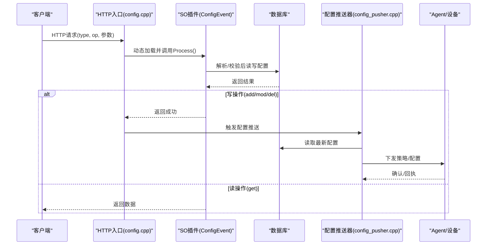
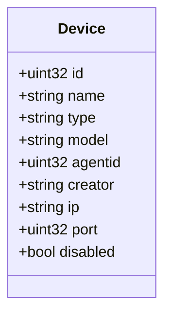
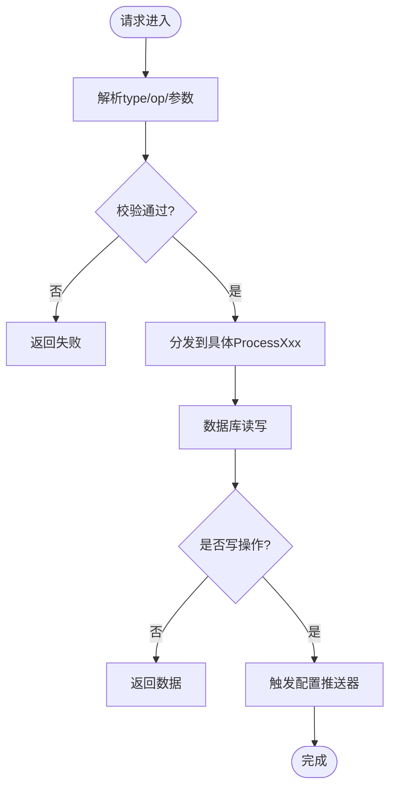
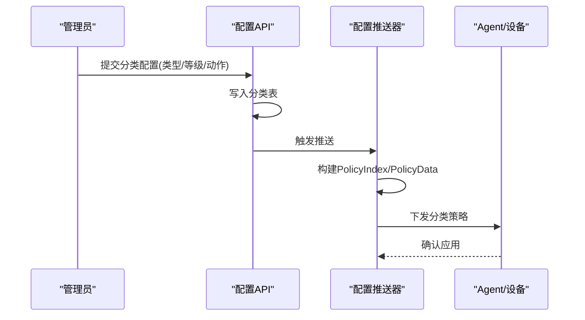
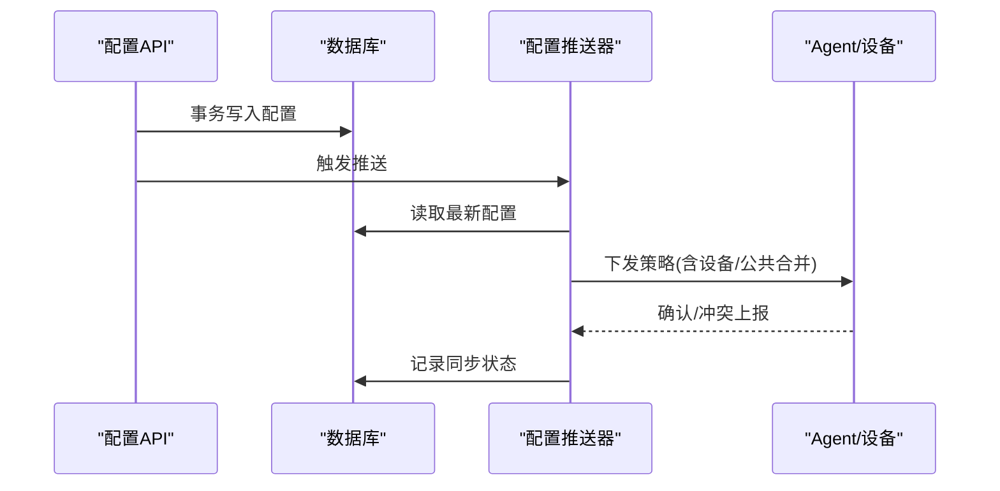
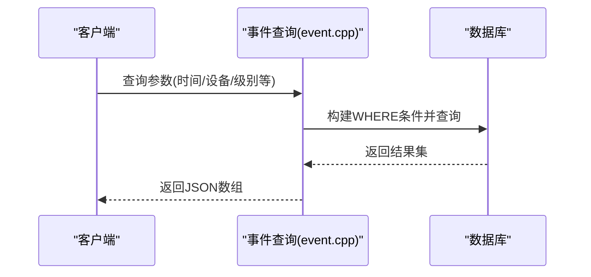
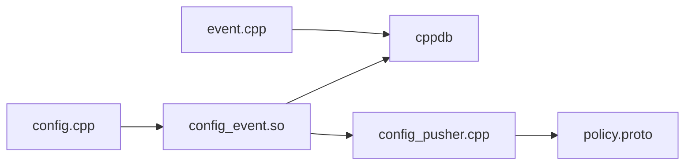

# 配置管理API

<cite>
**本文引用的文件**
- [ly_server/src/server/config.cpp](file://ly_server/src/server/config.cpp)
- [ly_server/src/lib/config_class.h](file://ly_server/src/lib/config_class.h)
- [ly_server/src/lib/config_event.h](file://ly_server/src/lib/config_event.h)
- [ly_server/src/lib/config_event.cpp](file://ly_server/src/lib/config_event.cpp)
- [ly_server/src/lib/config_device.proto](file://ly_server/src/lib/config_device.proto)
- [ly_server/src/lib/config_event.proto](file://ly_server/src/lib/config_event.proto)
- [ly_server/src/common/config.proto](file://ly_server/src/common/config.proto)
- [ly_server/src/server/config_pusher.cpp](file://ly_server/src/server/config_pusher.cpp)
- [ly_server/src/server/event.cpp](file://ly_server/src/server/event.cpp)
</cite>

## 目录
1. [简介](#简介)
2. [项目结构](#项目结构)
3. [核心组件](#核心组件)
4. [架构总览](#架构总览)
5. [详细组件分析](#详细组件分析)
6. [依赖关系分析](#依赖关系分析)
7. [性能考虑](#性能考虑)
8. [故障排查指南](#故障排查指南)
9. [结论](#结论)
10. [附录](#附录)

## 简介
本文件为“配置管理API”的完整接口与实现说明，覆盖设备配置、事件规则配置、分类配置、版本与回滚、批量更新以及配置同步与冲突处理等高级能力。文档面向不同技术背景的读者，提供从高层到代码级的逐步深入说明，并辅以架构图、时序图、流程图和类图帮助理解。

## 项目结构
本项目采用“统一入口 + 动态插件”的配置管理架构：
- 统一HTTP入口负责解析请求参数、动态加载对应SO模块（如config_event），并将请求分派给具体处理器。
- 各SO模块实现具体的增删改查逻辑，操作数据库后触发配置推送器进行下发。
- 配置推送器将数据库中的配置聚合为统一的配置对象，按设备/代理维度生成策略并下发。

图表来源
- [ly_server/src/server/config.cpp:20-80](file://ly_server/src/server/config.cpp#L20-L80)
- [ly_server/src/lib/config_event.h:10-42](file://ly_server/src/lib/config_event.h#L10-L42)
- [ly_server/src/server/config_pusher.cpp:172-800](file://ly_server/src/server/config_pusher.cpp#L172-L800)

章节来源
- [ly_server/src/server/config.cpp:20-80](file://ly_server/src/server/config.cpp#L20-L80)

## 核心组件
- 配置基类与工具方法：提供通用校验（CIDR、端口）、SQL拼接辅助、JSON输出封装等。
- 事件配置处理器：统一处理事件类型、阈值、扫描、黑名单、DNS、URL内容等多类规则的CRUD。
- 设备配置模型：定义设备元数据（名称、类型、型号、IP、端口、禁用状态等）。
- 配置推送器：从数据库读取各类配置，组装为统一配置对象，按设备/代理维度生成策略并下发。
- 事件查询服务：提供事件原始数据与聚合数据的查询接口，支持时间范围、设备、级别等过滤。

章节来源
- [ly_server/src/lib/config_class.h:12-66](file://ly_server/src/lib/config_class.h#L12-L66)
- [ly_server/src/lib/config_event.h:10-122](file://ly_server/src/lib/config_event.h#L10-L122)
- [ly_server/src/lib/config_device.proto:4-15](file://ly_server/src/lib/config_device.proto#L4-L15)
- [ly_server/src/server/config_pusher.cpp:172-800](file://ly_server/src/server/config_pusher.cpp#L172-L800)
- [ly_server/src/server/event.cpp:192-357](file://ly_server/src/server/event.cpp#L192-L357)

## 架构总览
配置管理API通过HTTP入口接收请求，动态加载对应SO模块执行具体业务逻辑；写操作成功后调用配置推送器，将变更推送到Agent/设备侧，形成闭环。

图表来源
- [ly_server/src/server/config.cpp:20-80](file://ly_server/src/server/config.cpp#L20-L80)
- [ly_server/src/lib/config_event.cpp:401-484](file://ly_server/src/lib/config_event.cpp#L401-L484)
- [ly_server/src/server/config_pusher.cpp:172-800](file://ly_server/src/server/config_pusher.cpp#L172-L800)

## 详细组件分析

### 设备配置接口
- 数据模型：设备包含ID、名称、类型、型号、代理ID、创建者、备注、IP、端口、禁用标志等字段。
- 典型操作：
  - 注册设备：新增设备记录，分配唯一标识，设置默认启用状态。
  - 更新设备：修改IP、端口、类型、禁用状态等。
  - 删除设备：移除设备记录，解除关联策略。
  - 查询设备：按条件筛选设备列表或详情。
- 策略下发：设备变更后，配置推送器会重新构建设备相关策略并下发。

图表来源
- [ly_server/src/lib/config_device.proto:4-15](file://ly_server/src/lib/config_device.proto#L4-L15)

章节来源
- [ly_server/src/lib/config_device.proto:4-15](file://ly_server/src/lib/config_device.proto#L4-L15)

### 事件规则配置接口
- 目标与操作：
  - 目标类型包括：事件、事件类型、URL类型、忽略规则、阈值、端口扫描、IP扫描、服务、可疑流量、黑名单、等级、动作、全部配置、数据聚合、DGA、DNS、DNS隧道、AI检测、URL内容、指纹旅行、ICMP隧道等。
  - 操作类型包括：ADD（新增）、DEL（删除）、MOD（修改）、GET（查询）、DEL_EVENT（删除事件）。
- 请求解析与校验：
  - 根据type与op解析目标与操作，调用对应的ParseReq与ValidateRequest。
  - 校验通过后进入具体ProcessXxx方法执行数据库操作。
- 阈值与时间窗口：
  - 支持按星期、起止时间、覆盖范围（within/without）进行规则生效控制。
  - 支持最小/最大阈值、协议、端口、IP段等匹配条件。

图表来源
- [ly_server/src/lib/config_event.cpp:401-484](file://ly_server/src/lib/config_event.cpp#L401-L484)
- [ly_server/src/lib/config_event.cpp:486-633](file://ly_server/src/lib/config_event.cpp#L486-L633)
- [ly_server/src/lib/config_event.cpp:635-702](file://ly_server/src/lib/config_event.cpp#L635-L702)

章节来源
- [ly_server/src/lib/config_event.h:10-122](file://ly_server/src/lib/config_event.h#L10-L122)
- [ly_server/src/lib/config_event.cpp:401-702](file://ly_server/src/lib/config_event.cpp#L401-L702)

### 分类配置接口（业务分类管理与策略下发）
- 分类维度：
  - 事件类型、URL类型、等级、动作等作为分类基础数据，用于规则组织与策略映射。
- 策略下发机制：
  - 配置推送器在构造配置时，会为每个策略项添加标签（label），并按设备/代理维度合并公共策略与设备专属策略。
  - 通过PolicyIndex与PolicyData描述策略索引与数据，确保Agent端可高效匹配与执行。

图表来源
- [ly_server/src/server/config_pusher.cpp:22-113](file://ly_server/src/server/config_pusher.cpp#L22-L113)
- [ly_server/src/common/config.proto:6-13](file://ly_server/src/common/config.proto#L6-L13)

章节来源
- [ly_server/src/server/config_pusher.cpp:22-113](file://ly_server/src/server/config_pusher.cpp#L22-L113)
- [ly_server/src/common/config.proto:6-13](file://ly_server/src/common/config.proto#L6-L13)

### 配置版本管理、回滚与批量更新
- 版本管理：
  - 当前实现以“状态字段”控制规则启用/禁用（status='ON'/'OFF'），通过状态切换实现逻辑上的版本切换。
  - 建议在外部引入版本号字段与快照机制，以便支持更严格的版本追踪与回滚。
- 回滚机制：
  - 基于状态切换的回滚：将旧版本的规则恢复为ON，新规则设为OFF。
  - 建议增加“版本快照表”，保存每次变更前的完整配置快照，支持快速回滚。
- 批量更新：
  - 通过一次请求携带多条规则变更，后端事务化写入，成功后统一触发推送器。
  - 推送器按设备/代理维度聚合策略，避免重复下发。

章节来源
- [ly_server/src/server/config_pusher.cpp:172-800](file://ly_server/src/server/config_pusher.cpp#L172-L800)

### 配置同步流程与冲突处理
- 同步流程：
  - 写操作完成后，HTTP入口调用配置推送器进程，读取数据库最新配置，构建统一配置对象，按设备/代理维度下发。
- 冲突处理：
  - 设备级与全局策略合并：推送器为每个设备维护独立策略索引，并与公共策略合并，避免冲突。
  - 状态一致性：通过数据库事务与幂等写入保证最终一致性；Agent侧需支持增量更新与冲突解决（如优先级、覆盖规则）。

图表来源
- [ly_server/src/server/config.cpp:70-73](file://ly_server/src/server/config.cpp#L70-L73)
- [ly_server/src/server/config_pusher.cpp:172-800](file://ly_server/src/server/config_pusher.cpp#L172-L800)

章节来源
- [ly_server/src/server/config.cpp:70-73](file://ly_server/src/server/config.cpp#L70-L73)
- [ly_server/src/server/config_pusher.cpp:172-800](file://ly_server/src/server/config_pusher.cpp#L172-L800)

### 事件查询接口（状态监控）
- 功能：
  - 查询原始事件数据与聚合事件数据，支持时间范围、设备、事件ID、对象、级别等过滤。
  - 支持设置处理状态与评论，便于事件跟踪与闭环。
- 使用场景：
  - 实时监控告警、统计峰值/均值、定位问题根因。

图表来源
- [ly_server/src/server/event.cpp:192-357](file://ly_server/src/server/event.cpp#L192-L357)

章节来源
- [ly_server/src/server/event.cpp:192-357](file://ly_server/src/server/event.cpp#L192-L357)

## 依赖关系分析
- HTTP入口依赖动态库加载机制，按type选择对应SO模块。
- 事件处理器依赖数据库访问层（cppdb）与Protobuf消息。
- 配置推送器依赖数据库与策略模型（PolicyIndex/PolicyData），按设备/代理维度构建配置。
- 事件查询服务依赖数据库与Web请求解析。

图表来源
- [ly_server/src/server/config.cpp:20-80](file://ly_server/src/server/config.cpp#L20-L80)
- [ly_server/src/lib/config_event.cpp:401-484](file://ly_server/src/lib/config_event.cpp#L401-L484)
- [ly_server/src/server/config_pusher.cpp:172-800](file://ly_server/src/server/config_pusher.cpp#L172-L800)
- [ly_server/src/server/event.cpp:192-357](file://ly_server/src/server/event.cpp#L192-L357)

章节来源
- [ly_server/src/server/config.cpp:20-80](file://ly_server/src/server/config.cpp#L20-L80)
- [ly_server/src/lib/config_event.cpp:401-484](file://ly_server/src/lib/config_event.cpp#L401-L484)
- [ly_server/src/server/config_pusher.cpp:172-800](file://ly_server/src/server/config_pusher.cpp#L172-L800)
- [ly_server/src/server/event.cpp:192-357](file://ly_server/src/server/event.cpp#L192-L357)

## 性能考虑
- 数据库查询优化：
  - 合理使用索引（如devid、type_id、status_id、starttime/endtime）提升查询效率。
  - 对高频查询（事件聚合）考虑缓存或物化视图。
- 配置下发优化：
  - 推送器按设备/代理维度合并策略，减少重复下发。
  - 支持增量更新与幂等写入，降低网络与处理开销。
- 并发与锁：
  - 写操作建议使用事务与行级锁，避免并发冲突。
  - 推送器与API解耦，避免阻塞HTTP响应。

## 故障排查指南
- 常见错误：
  - 动态库加载失败：检查SO路径与符号导出（CreateConfigInstance/FreeConfigInstance）。
  - 数据库连接异常：检查连接串与权限，查看日志中的SQL错误。
  - 参数校验失败：检查type/op及必填字段，参考校验函数。
- 日志定位：
  - HTTP入口与SO模块均输出详细日志，结合错误信息定位问题。
  - 配置推送器在构建策略时记录异常，便于排查配置缺失或类型不匹配。

章节来源
- [ly_server/src/server/config.cpp:42-67](file://ly_server/src/server/config.cpp#L42-L67)
- [ly_server/src/lib/config_event.cpp:716-755](file://ly_server/src/lib/config_event.cpp#L716-L755)
- [ly_server/src/server/config_pusher.cpp:106-113](file://ly_server/src/server/config_pusher.cpp#L106-L113)

## 结论
本配置管理API通过“统一入口 + 动态插件 + 配置推送器”的架构，实现了设备配置、事件规则配置、分类配置的统一管理，并支持状态监控、版本切换、批量更新与冲突处理。建议在现有基础上引入显式版本管理与快照机制，进一步提升可追溯性与回滚能力。

## 附录
- 关键数据结构：
  - 设备：ID、名称、类型、型号、代理ID、IP、端口、禁用状态等。
  - 事件：类型、配置ID、阈值、时间窗口、协议、端口、IP等。
  - 策略：策略索引与数据，支持设备/公共合并。
- 接口规范：
  - 统一通过type与op指定目标与操作，参数由具体处理器解析与校验。
  - 写操作成功后自动触发配置推送，确保Agent侧一致。