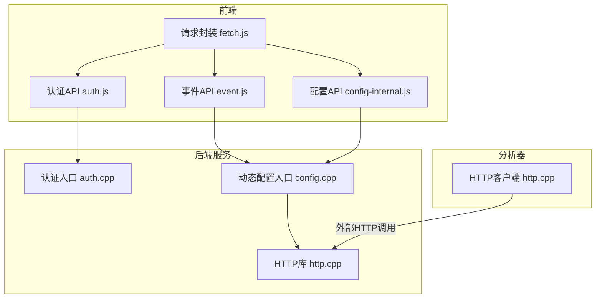
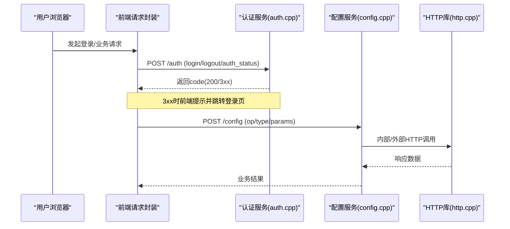
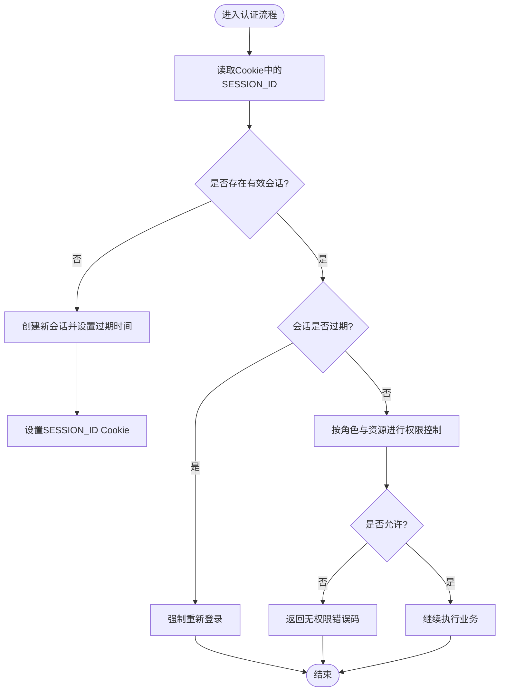
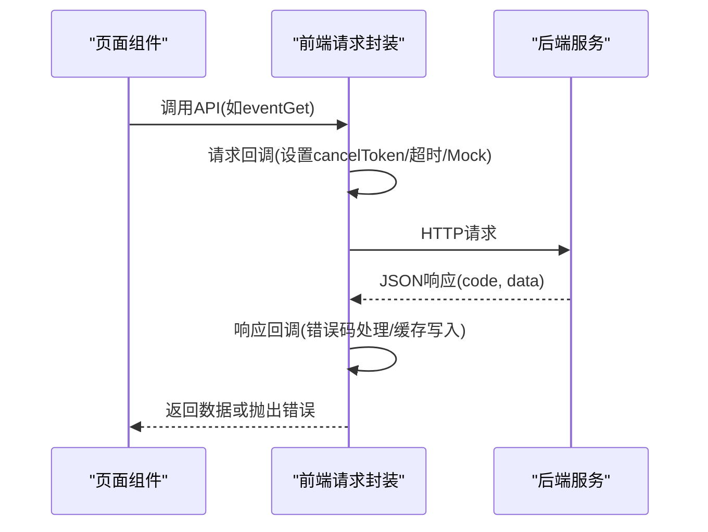
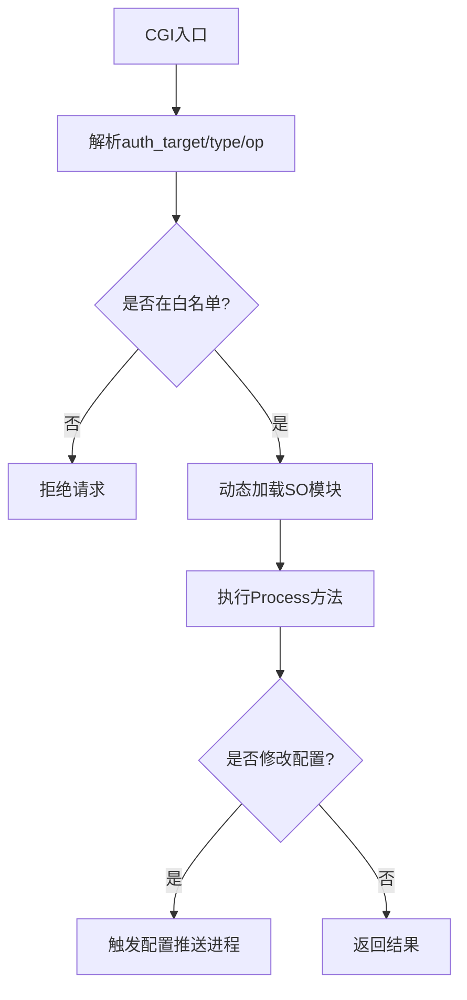
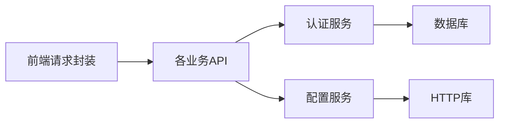

# API集成

<cite>
**本文引用的文件**
- [ly_server/src/common/http.h](file://ly_server/src/common/http.h)
- [ly_server/src/common/http.cpp](file://ly_server/src/common/http.cpp)
- [ly_analyser/src/common/http.h](file://ly_analyser/src/common/http.h)
- [ly_analyser/src/common/http.cpp](file://ly_analyser/src/common/http.cpp)
- [ly_server/src/server/auth.cpp](file://ly_server/src/server/auth.cpp)
- [ly_server/src/server/config.cpp](file://ly_server/src/server/config.cpp)
- [ly_vis/packages/std/src/service/fetch.js](file://ly_vis/packages/std/src/service/fetch.js)
- [ly_vis/packages/std/src/service/api/auth.js](file://ly_vis/packages/std/src/service/api/auth.js)
- [ly_vis/packages/std/src/service/api/event.js](file://ly_vis/packages/std/src/service/api/event.js)
- [ly_vis/packages/std/src/service/index.js](file://ly_vis/packages/std/src/service/index.js)
- [ly_vis/packages/std/src/service/api/config-internal.js](file://ly_vis/packages/std/src/service/api/config-internal.js)
</cite>

## 目录
1. [简介](#简介)
2. [项目结构](#项目结构)
3. [核心组件](#核心组件)
4. [架构总览](#架构总览)
5. [详细组件分析](#详细组件分析)
6. [依赖关系分析](#依赖关系分析)
7. [性能与优化](#性能与优化)
8. [故障排查指南](#故障排查指南)
9. [结论](#结论)
10. [附录：API调用示例与调试技巧](#附录api调用示例与调试技巧)

## 简介
本文件面向API集成开发者，系统化说明本项目中RESTful API的设计规范、请求封装机制、认证授权流程、Token/会话管理、错误处理策略、重试与超时控制、版本管理、接口文档生成与Mock支持、网络请求优化、缓存策略与性能监控方案，并提供具体调用示例与调试技巧。

## 项目结构
本项目由后端服务（C++）、分析器（C++）和前端（React/JS）组成：
- 后端服务提供HTTP接口，负责认证、配置下发、事件查询等；通过CGI方式将请求路由到具体处理器。
- 分析器模块包含通用HTTP客户端能力，用于对外发起HTTP请求。
- 前端基于axios封装统一请求层，实现鉴权拦截、错误处理、取消请求、缓存与Mock。

图表来源
- [ly_vis/packages/std/src/service/fetch.js:1-101](file://ly_vis/packages/std/src/service/fetch.js#L1-L101)
- [ly_vis/packages/std/src/service/api/auth.js:1-10](file://ly_vis/packages/std/src/service/api/auth.js#L1-L10)
- [ly_vis/packages/std/src/service/api/event.js:42-74](file://ly_vis/packages/std/src/service/api/event.js#L42-L74)
- [ly_vis/packages/std/src/service/api/config-internal.js:1-9](file://ly_vis/packages/std/src/service/api/config-internal.js#L1-L9)
- [ly_server/src/server/auth.cpp:483-555](file://ly_server/src/server/auth.cpp#L483-L555)
- [ly_server/src/server/config.cpp:21-81](file://ly_server/src/server/config.cpp#L21-L81)
- [ly_server/src/common/http.cpp:49-87](file://ly_server/src/common/http.cpp#L49-L87)
- [ly_analyser/src/common/http.cpp:49-87](file://ly_analyser/src/common/http.cpp#L49-L87)

章节来源
- [ly_server/src/server/auth.cpp:483-555](file://ly_server/src/server/auth.cpp#L483-L555)
- [ly_server/src/server/config.cpp:21-81](file://ly_server/src/server/config.cpp#L21-L81)
- [ly_vis/packages/std/src/service/fetch.js:1-101](file://ly_vis/packages/std/src/service/fetch.js#L1-L101)

## 核心组件
- 认证与会话管理：基于Cookie的SESSION_ID进行会话维护，服务端校验会话有效性并记录登录历史，支持失败重试计数与锁定。
- 统一HTTP客户端：后端与分析器均使用基于libcurl的HTTP封装，支持GET/POST/PUT，可输出流式响应。
- 前端请求封装：基于axios的统一请求层，提供Mock开关、取消令牌、超时控制、错误码拦截、跳转登录、缓存写入等。
- 动态配置加载：服务端通过CGI参数type动态加载SO模块，执行对应配置处理逻辑。

章节来源
- [ly_server/src/server/auth.cpp:51-204](file://ly_server/src/server/auth.cpp#L51-L204)
- [ly_server/src/common/http.cpp:49-87](file://ly_server/src/common/http.cpp#L49-L87)
- [ly_analyser/src/common/http.cpp:49-87](file://ly_analyser/src/common/http.cpp#L49-L87)
- [ly_vis/packages/std/src/service/fetch.js:15-91](file://ly_vis/packages/std/src/service/fetch.js#L15-L91)
- [ly_server/src/server/config.cpp:21-81](file://ly_server/src/server/config.cpp#L21-L81)

## 架构总览
整体采用前后端分离架构：前端通过统一fetch发起请求，后端以CGI形式接收请求，认证模块校验会话后，将目标操作转发至具体处理器（如配置、事件、资产等），并通过HTTP库完成内部或外部网络交互。

图表来源
- [ly_vis/packages/std/src/service/api/auth.js:1-10](file://ly_vis/packages/std/src/service/api/auth.js#L1-L10)
- [ly_vis/packages/std/src/service/fetch.js:15-91](file://ly_vis/packages/std/src/service/fetch.js#L15-L91)
- [ly_server/src/server/auth.cpp:483-555](file://ly_server/src/server/auth.cpp#L483-L555)
- [ly_server/src/server/config.cpp:21-81](file://ly_server/src/server/config.cpp#L21-L81)
- [ly_server/src/common/http.cpp:49-87](file://ly_server/src/common/http.cpp#L49-L87)

## 详细组件分析

### 认证与授权流程
- 会话创建与校验：从Cookie读取SESSION_ID，若不存在则创建新会话并设置过期时间；校验会话是否有效且未过期。
- 登录流程：校验用户名密码，更新用户最后登录信息，设置会话有效期，返回统一JSON格式code。
- 登出流程：清理或更新会话状态，保持Cookie存在以便后续鉴权判断。
- 权限控制：根据用户级别（SYSADMIN/ANALYSER/VIEWER）与资源范围进行细粒度访问控制。

图表来源
- [ly_server/src/server/auth.cpp:51-204](file://ly_server/src/server/auth.cpp#L51-L204)
- [ly_server/src/server/auth.cpp:244-320](file://ly_server/src/server/auth.cpp#L244-L320)
- [ly_server/src/server/auth.cpp:322-348](file://ly_server/src/server/auth.cpp#L322-L348)
- [ly_server/src/server/auth.cpp:444-477](file://ly_server/src/server/auth.cpp#L444-L477)

章节来源
- [ly_server/src/server/auth.cpp:51-204](file://ly_server/src/server/auth.cpp#L51-L204)
- [ly_server/src/server/auth.cpp:244-320](file://ly_server/src/server/auth.cpp#L244-L320)
- [ly_server/src/server/auth.cpp:322-348](file://ly_server/src/server/auth.cpp#L322-L348)
- [ly_server/src/server/auth.cpp:444-477](file://ly_server/src/server/auth.cpp#L444-L477)

### 请求封装与错误处理
- 统一请求封装：基于axios，支持baseUrl、请求回调、响应回调、取消令牌、Mock模式。
- 错误处理：对3xx错误码进行统一提示与跳转登录；对特定接口（如threatinfo）设置超时；对操作失败进行提示。
- 缓存策略：对部分接口（asset/evidence）进行请求级缓存，避免重复请求。
- Mock支持：在mock环境下重写URL，走本地模拟数据。

图表来源
- [ly_vis/packages/std/src/service/fetch.js:15-91](file://ly_vis/packages/std/src/service/fetch.js#L15-L91)
- [ly_vis/packages/std/src/service/api/event.js:42-74](file://ly_vis/packages/std/src/service/api/event.js#L42-L74)

章节来源
- [ly_vis/packages/std/src/service/fetch.js:15-91](file://ly_vis/packages/std/src/service/fetch.js#L15-L91)
- [ly_vis/packages/std/src/service/api/event.js:42-74](file://ly_vis/packages/std/src/service/api/event.js#L42-L74)

### 动态配置加载与接口路由
- CGI路由：通过环境变量识别HTTP请求，解析CGI参数，动态加载SO模块执行对应配置处理。
- 安全限制：仅允许白名单内的目标（如mo、feature、topn、login、logout、event、config等）被调用，防止命令注入。
- 配置推送：当执行增删改操作后，触发配置推送进程以同步配置。

图表来源
- [ly_server/src/server/config.cpp:21-81](file://ly_server/src/server/config.cpp#L21-L81)
- [ly_server/src/server/auth.cpp:44-46](file://ly_server/src/server/auth.cpp#L44-L46)

章节来源
- [ly_server/src/server/config.cpp:21-81](file://ly_server/src/server/config.cpp#L21-L81)
- [ly_server/src/server/auth.cpp:44-46](file://ly_server/src/server/auth.cpp#L44-L46)

### HTTP客户端实现
- 后端与分析器共享相同风格的HTTP封装，基于libcurl实现GET/POST/PUT，支持流式响应输出。
- 错误日志：请求失败时记录错误信息，便于问题定位。

章节来源
- [ly_server/src/common/http.cpp:49-87](file://ly_server/src/common/http.cpp#L49-L87)
- [ly_analyser/src/common/http.cpp:49-87](file://ly_analyser/src/common/http.cpp#L49-L87)

## 依赖关系分析
- 前端依赖axios与统一request-config，集中管理请求行为。
- 后端依赖CGI框架与数据库连接，认证与配置模块通过SQL会话访问持久化数据。
- HTTP库作为底层网络抽象，被多个模块复用。

图表来源
- [ly_vis/packages/std/src/service/fetch.js:1-101](file://ly_vis/packages/std/src/service/fetch.js#L1-L101)
- [ly_server/src/server/auth.cpp:483-555](file://ly_server/src/server/auth.cpp#L483-L555)
- [ly_server/src/server/config.cpp:21-81](file://ly_server/src/server/config.cpp#L21-L81)
- [ly_server/src/common/http.cpp:49-87](file://ly_server/src/common/http.cpp#L49-L87)

章节来源
- [ly_vis/packages/std/src/service/fetch.js:1-101](file://ly_vis/packages/std/src/service/fetch.js#L1-L101)
- [ly_server/src/server/auth.cpp:483-555](file://ly_server/src/server/auth.cpp#L483-L555)
- [ly_server/src/server/config.cpp:21-81](file://ly_server/src/server/config.cpp#L21-L81)
- [ly_server/src/common/http.cpp:49-87](file://ly_server/src/common/http.cpp#L49-L87)

## 性能与优化
- 请求取消：为高频接口（portinfo/geoinfo/threatinfo/feature）注册取消令牌，减少无效请求。
- 超时控制：针对受限外网场景的threatinfo接口设置合理超时，避免阻塞。
- 缓存策略：对部分接口进行请求级缓存，降低重复请求压力。
- 流式响应：后端HTTP库支持流式写入，适合大响应体场景。
- 动态加载：配置模块按需加载SO，减少启动开销。

章节来源
- [ly_vis/packages/std/src/service/fetch.js:23-32](file://ly_vis/packages/std/src/service/fetch.js#L23-L32)
- [ly_vis/packages/std/src/service/fetch.js:19-22](file://ly_vis/packages/std/src/service/fetch.js#L19-L22)
- [ly_vis/packages/std/src/service/fetch.js:85-90](file://ly_vis/packages/std/src/service/fetch.js#L85-L90)
- [ly_server/src/common/http.cpp:71-74](file://ly_server/src/common/http.cpp#L71-L74)
- [ly_server/src/server/config.cpp:37-67](file://ly_server/src/server/config.cpp#L37-L67)

## 故障排查指南
- 认证失败：检查SESSION_ID是否正确传递，确认会话是否过期；查看服务端登录历史与失败次数是否达到锁定阈值。
- 权限不足：确认用户级别与资源范围是否匹配；检查auth_target与op参数是否符合预期。
- 请求超时：关注threatinfo等特殊接口的超时配置；检查网络连通性与代理设置。
- 错误码处理：前端对3xx错误进行统一提示与跳转；对特定错误码（如306）进行权限提示。
- 日志定位：后端HTTP库在请求失败时记录错误信息；认证模块在异常时记录详细日志。

章节来源
- [ly_server/src/server/auth.cpp:170-204](file://ly_server/src/server/auth.cpp#L170-L204)
- [ly_server/src/common/http.cpp:79-87](file://ly_server/src/common/http.cpp#L79-L87)
- [ly_vis/packages/std/src/service/fetch.js:35-68](file://ly_vis/packages/std/src/service/fetch.js#L35-L68)

## 结论
本项目提供了完整的API集成能力：统一的请求封装、完善的认证与会话管理、灵活的动态配置加载、健壮的错误处理与性能优化措施。开发者可基于现有封装快速接入业务接口，同时利用Mock与缓存提升开发与运行效率。

## 附录：API调用示例与调试技巧
- 登录接口
  - 路径：POST login
  - 参数：auth_user、auth_pass、auth_agetime（可选）
  - 说明：成功后返回code=200，并设置SESSION_ID Cookie；失败返回3xx错误码。
  - 参考：[ly_vis/packages/std/src/service/api/auth.js:3-8](file://ly_vis/packages/std/src/service/api/auth.js#L3-L8)

- 登出接口
  - 路径：POST logout
  - 说明：清除或更新会话状态，保持Cookie存在。
  - 参考：[ly_vis/packages/std/src/service/api/auth.js:7-8](file://ly_vis/packages/std/src/service/api/auth.js#L7-L8)

- 事件查询接口
  - 路径：POST event
  - 参数：req_type、starttime、endtime、obj等
  - 说明：用于获取事件列表或聚合数据。
  - 参考：[ly_vis/packages/std/src/service/api/event.js:42-46](file://ly_vis/packages/std/src/service/api/event.js#L42-L46)

- 事件特征接口
  - 路径：POST event_feature
  - 参数：starttime、endtime、obj等
  - 说明：用于获取事件特征详情。
  - 参考：[ly_vis/packages/std/src/service/api/event.js:56-60](file://ly_vis/packages/std/src/service/api/event.js#L56-L60)

- 数据包证据接口
  - 路径：POST evidence
  - 参数：time、endtime、obj等
  - 说明：用于获取原始数据包证据。
  - 参考：[ly_vis/packages/std/src/service/api/event.js:70-74](file://ly_vis/packages/std/src/service/api/event.js#L70-L74)

- 内部IP配置接口
  - 路径：POST config
  - 参数：op=get、type=internalip
  - 说明：用于获取内部IP配置。
  - 参考：[ly_vis/packages/std/src/service/api/config-internal.js:3-8](file://ly_vis/packages/std/src/service/api/config-internal.js#L3-L8)

- 调试技巧
  - 启用Mock：设置REACT_APP_ENV为mock，请求将被重写到本地模拟数据。
  - 观察错误码：前端对3xx错误进行统一提示与跳转，重点关注306权限错误。
  - 检查会话：确保SESSION_ID正确传递，必要时清除Cookie后重新登录。
  - 网络诊断：关注threatinfo等接口的超时设置，检查代理与网络连通性。

章节来源
- [ly_vis/packages/std/src/service/api/auth.js:3-8](file://ly_vis/packages/std/src/service/api/auth.js#L3-L8)
- [ly_vis/packages/std/src/service/api/event.js:42-74](file://ly_vis/packages/std/src/service/api/event.js#L42-L74)
- [ly_vis/packages/std/src/service/api/config-internal.js:3-8](file://ly_vis/packages/std/src/service/api/config-internal.js#L3-L8)
- [ly_vis/packages/std/src/service/fetch.js:15-22](file://ly_vis/packages/std/src/service/fetch.js#L15-L22)
- [ly_vis/packages/std/src/service/fetch.js:35-68](file://ly_vis/packages/std/src/service/fetch.js#L35-L68)