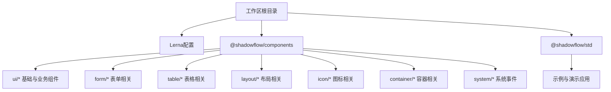
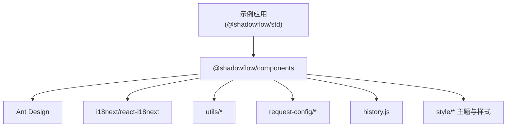
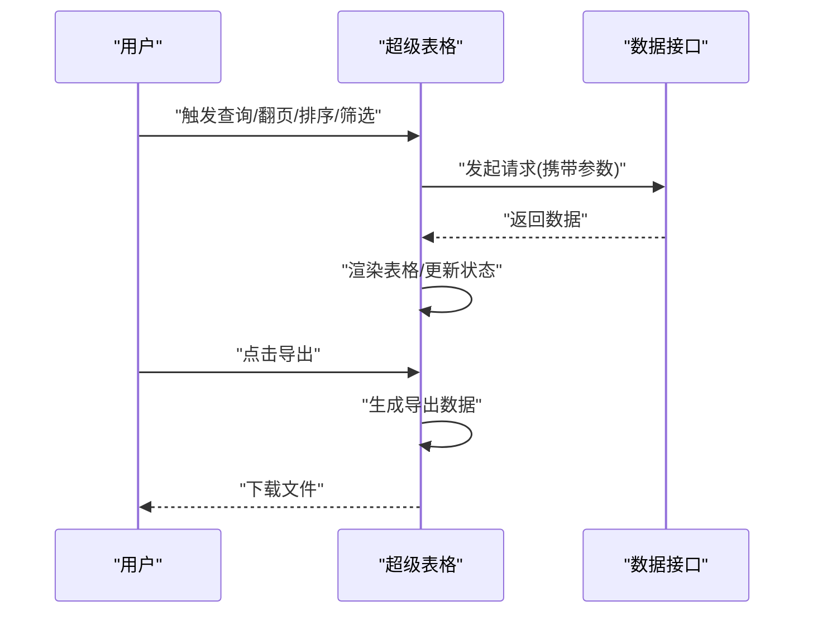
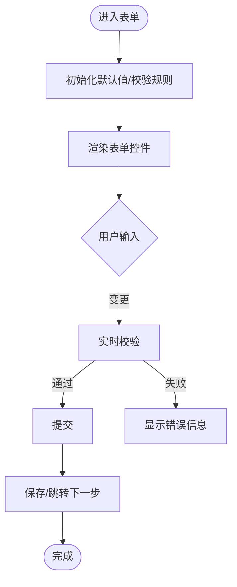
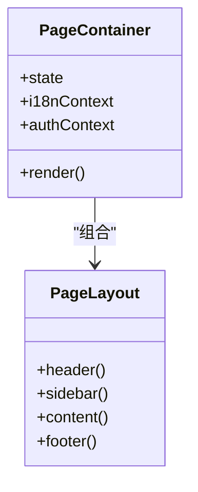
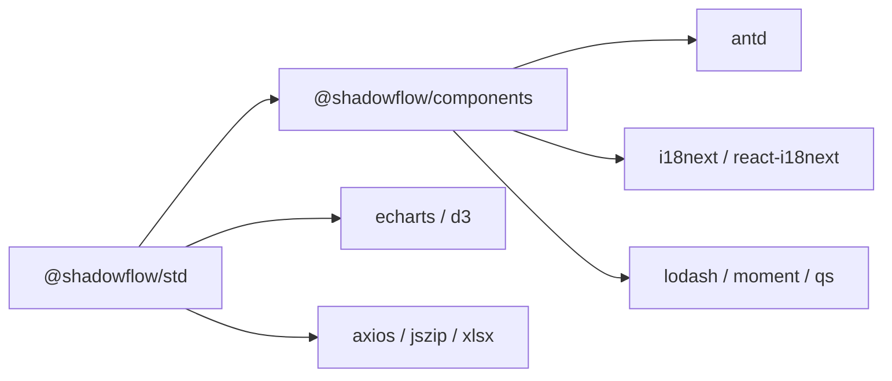

# UI组件库

<cite>
**本文引用的文件**
- [ly_vis/package.json](file://ly_vis/package.json)
- [ly_vis/lerna.json](file://ly_vis/lerna.json)
- [ly_vis/packages/components/package.json](file://ly_vis/packages/components/package.json)
- [ly_vis/packages/components/index.js](file://ly_vis/packages/components/index.js)
- [ly_vis/packages/components/ui/antd-components-super/index.jsx](file://ly_vis/packages/components/ui/antd-components-super/index.jsx)
- [ly_vis/packages/std/package.json](file://ly_vis/packages/std/package.json)
</cite>

## 目录
1. [简介](#简介)
2. [项目结构](#项目结构)
3. [核心组件](#核心组件)
4. [架构总览](#架构总览)
5. [详细组件分析](#详细组件分析)
6. [依赖关系分析](#依赖关系分析)
7. [性能考虑](#性能考虑)
8. [故障排查指南](#故障排查指南)
9. [结论](#结论)
10. [附录](#附录)

## 简介
本UI组件库基于React与Ant Design构建，采用Monorepo（Lerna + Yarn Workspaces）组织代码，提供统一的基础组件、业务化封装组件、主题与国际化能力，以及标准化的开发、测试与发布流程。目标是提升多业务线的前端一致性、复用性与可维护性。

## 项目结构
- 根工作区：使用Yarn Workspaces与Lerna管理多个子包，版本独立发布。
- components包：组件库主体，包含基础UI、表单、表格、布局、图标、容器、系统事件等模块，并提供统一入口导出。
- std包：示例/演示应用，依赖components包，用于验证组件行为、主题与国际化效果。
- 工具链：ESLint、Prettier、Stylelint、Husky、Commitlint、Standard-version等保障代码质量与规范。

图表来源
- [ly_vis/lerna.json:1-9](file://ly_vis/lerna.json#L1-L9)
- [ly_vis/packages/components/package.json:1-8](file://ly_vis/packages/components/package.json#L1-L8)
- [ly_vis/packages/std/package.json:1-45](file://ly_vis/packages/std/package.json#L1-L45)

章节来源
- [ly_vis/lerna.json:1-9](file://ly_vis/lerna.json#L1-L9)
- [ly_vis/package.json:1-127](file://ly_vis/package.json#L1-L127)
- [ly_vis/packages/components/package.json:1-8](file://ly_vis/packages/components/package.json#L1-L8)
- [ly_vis/packages/std/package.json:1-45](file://ly_vis/packages/std/package.json#L1-L45)

## 核心组件
- 基础组件
  - 按钮、标签、提示等：通过Ant Design扩展与二次封装，统一交互与样式语义。
  - 空状态：统一的空态展示与引导操作。
- 表格组件
  - 超级表格：在Antd Table基础上增强列配置、行操作、导出等能力。
  - 导出：支持将表格数据导出为常用格式。
  - 行操作：统一的操作菜单与权限控制。
- 表单组件
  - 表单控件：对输入、选择、日期等控件进行统一校验与展示。
  - 筛选表单：快速构建查询条件面板。
  - 分步表单：复杂流程的向导式录入。
  - 顶部工具箱：常用操作快捷入口。
- 布局与容器
  - 页面骨架、侧边栏、头部、内容区等组合。
  - 通用容器：承载业务页面的布局与状态。
- 图标与提示
  - 统一图标资源与命名。
  - 全局提示与消息通知。
- 系统事件
  - 跨组件通信的事件总线或上下文，解耦业务逻辑。

章节来源
- [ly_vis/packages/components/ui/antd-components-super/index.jsx:1-200](file://ly_vis/packages/components/ui/antd-components-super/index.jsx#L1-L200)
- [ly_vis/packages/components/ui/table/export-table/index.js:1-200](file://ly_vis/packages/components/ui/table/export-table/index.js#L1-L200)
- [ly_vis/packages/components/ui/form/form-filter/index.js:1-200](file://ly_vis/packages/components/ui/form/form-filter/index.js#L1-L200)
- [ly_vis/packages/components/ui/form/form-step/index.js:1-200](file://ly_vis/packages/components/ui/form/form-step/index.js#L1-L200)
- [ly_vis/packages/components/ui/layout/index.js:1-200](file://ly_vis/packages/components/ui/layout/index.js#L1-L200)
- [ly_vis/packages/components/ui/container/index.js:1-200](file://ly_vis/packages/components/ui/container/index.js#L1-L200)
- [ly_vis/packages/components/ui/icon/index.js:1-200](file://ly_vis/packages/components/ui/icon/index.js#L1-L200)
- [ly_vis/packages/components/ui/tooltips/index.js:1-200](file://ly_vis/packages/components/ui/tooltips/index.js#L1-L200)
- [ly_vis/packages/components/system/event-system/index.js:1-200](file://ly_vis/packages/components/system/event-system/index.js#L1-L200)

## 架构总览
组件库采用分层设计：
- 表现层：Ant Design作为基础UI，结合Less/CSS变量实现主题定制。
- 组件层：基础组件与业务组件封装，暴露稳定API。
- 能力层：国际化、请求配置、历史管理、工具函数等横切能力。
- 应用层：std示例应用集成并验证组件。

图表来源
- [ly_vis/packages/std/package.json:1-45](file://ly_vis/packages/std/package.json#L1-L45)
- [ly_vis/packages/components/index.js:1-1](file://ly_vis/packages/components/index.js#L1-L1)
- [ly_vis/package.json:36-79](file://ly_vis/package.json#L36-L79)

## 详细组件分析

### 超级表格（Table Super）
- 目标：在Antd Table之上提供一致的列定义、分页、排序、筛选、导出、行操作等能力。
- 关键能力
  - 列配置：类型、渲染器、宽度、对齐、可排序/筛选开关。
  - 数据源：支持本地数组与远程接口。
  - 导出：将当前视图数据导出为Excel/CSV。
  - 行操作：统一菜单项与权限控制。
- 使用建议
  - 集中维护列定义，避免重复配置。
  - 大数据量场景启用虚拟滚动或分页。
  - 导出前做数据脱敏与字段映射。

图表来源
- [ly_vis/packages/components/ui/antd-components-super/index.jsx:1-200](file://ly_vis/packages/components/ui/antd-components-super/index.jsx#L1-L200)
- [ly_vis/packages/components/ui/table/export-table/index.js:1-200](file://ly_vis/packages/components/ui/table/export-table/index.js#L1-L200)

章节来源
- [ly_vis/packages/components/ui/antd-components-super/index.jsx:1-200](file://ly_vis/packages/components/ui/antd-components-super/index.jsx#L1-L200)
- [ly_vis/packages/components/ui/table/export-table/index.js:1-200](file://ly_vis/packages/components/ui/table/export-table/index.js#L1-L200)

### 表单组件族
- 表单控件：统一校验规则、错误提示、禁用/只读状态。
- 筛选表单：快速构建查询条件，支持重置与保存预设。
- 分步表单：步骤导航、进度指示、数据持久化。
- 顶部工具箱：常用操作聚合，支持快捷键与权限。

图表来源
- [ly_vis/packages/components/ui/form/form-filter/index.js:1-200](file://ly_vis/packages/components/ui/form/form-filter/index.js#L1-L200)
- [ly_vis/packages/components/ui/form/form-step/index.js:1-200](file://ly_vis/packages/components/ui/form/form-step/index.js#L1-L200)

章节来源
- [ly_vis/packages/components/ui/form/form-filter/index.js:1-200](file://ly_vis/packages/components/ui/form/form-filter/index.js#L1-L200)
- [ly_vis/packages/components/ui/form/form-step/index.js:1-200](file://ly_vis/packages/components/ui/form/form-step/index.js#L1-L200)

### 布局与容器
- 布局：提供标准页面骨架（头部、侧边、内容、底部），适配响应式。
- 容器：承载页面级状态、路由、权限与国际化上下文。

图表来源
- [ly_vis/packages/components/ui/layout/index.js:1-200](file://ly_vis/packages/components/ui/layout/index.js#L1-L200)
- [ly_vis/packages/components/ui/container/index.js:1-200](file://ly_vis/packages/components/ui/container/index.js#L1-L200)

章节来源
- [ly_vis/packages/components/ui/layout/index.js:1-200](file://ly_vis/packages/components/ui/layout/index.js#L1-L200)
- [ly_vis/packages/components/ui/container/index.js:1-200](file://ly_vis/packages/components/ui/container/index.js#L1-L200)

### 图标与提示
- 图标：统一命名与尺寸，支持SVG与字体图标。
- 提示：全局消息、通知、确认对话框，支持主题色与文案国际化。

章节来源
- [ly_vis/packages/components/ui/icon/index.js:1-200](file://ly_vis/packages/components/ui/icon/index.js#L1-L200)
- [ly_vis/packages/components/ui/tooltips/index.js:1-200](file://ly_vis/packages/components/ui/tooltips/index.js#L1-L200)

### 系统事件
- 作用：跨组件通信，解耦业务逻辑，如全局搜索、主题切换、语言切换等。
- 模式：发布/订阅或上下文事件，保证低耦合与高内聚。

章节来源
- [ly_vis/packages/components/system/event-system/index.js:1-200](file://ly_vis/packages/components/system/event-system/index.js#L1-L200)

## 依赖关系分析
- 运行时依赖
  - React生态：react、react-dom、react-router-dom、mobx/mobx-react（状态管理）。
  - UI基础：antd、@ant-design/icons、@ant-design/pro-table。
  - 可视化：d3系列、echarts（在std中引入）。
  - 网络与工具：axios、lodash、moment、jszip、xlsx等。
  - 国际化：i18next、react-i18next。
- 开发依赖
  - 代码质量：eslint、prettier、stylelint、husky、commitlint。
  - 构建与发布：lerna、standard-version、react-app-rewired。
- 工作区与包管理
  - Lerna统一管理多包，yarn workspaces协同开发。

图表来源
- [ly_vis/packages/std/package.json:1-45](file://ly_vis/packages/std/package.json#L1-L45)
- [ly_vis/package.json:36-79](file://ly_vis/package.json#L36-L79)
- [ly_vis/lerna.json:1-9](file://ly_vis/lerna.json#L1-L9)

章节来源
- [ly_vis/package.json:1-127](file://ly_vis/package.json#L1-L127)
- [ly_vis/lerna.json:1-9](file://ly_vis/lerna.json#L1-L9)
- [ly_vis/packages/std/package.json:1-45](file://ly_vis/packages/std/package.json#L1-L45)

## 性能考虑
- 表格
  - 大数据量使用分页、虚拟滚动；按需加载列与数据。
  - 导出时异步处理，避免阻塞主线程。
- 表单
  - 延迟校验与防抖输入；拆分大表单为多步。
- 国际化
  - 按需加载语言包；避免全量导入。
- 打包体积
  - 使用babel-plugin-import按需引入Antd组件。
  - 使用source-map-explorer分析构建产物。
- 渲染优化
  - 合理使用memo/useMemo/useCallback；避免不必要的重渲染。

## 故障排查指南
- 构建与依赖
  - 检查Node与Yarn版本；确保workspaces安装完整。
  - 若出现模块未找到，确认lerna link与工作区路径正确。
- 样式与主题
  - Less变量未生效时，检查主题覆盖顺序与编译配置。
  - 使用浏览器开发者工具定位样式冲突。
- 国际化
  - 文案不显示时，检查语言包是否加载、key是否正确、命名空间是否匹配。
- 表格导出
  - 导出失败时，检查数据格式与依赖库（jszip/xlsx）版本兼容性。
- 表单校验
  - 校验不触发时，确认字段绑定与rules配置；查看控制台错误堆栈。

章节来源
- [ly_vis/package.json:17-30](file://ly_vis/package.json#L17-L30)
- [ly_vis/packages/std/package.json:18-30](file://ly_vis/packages/std/package.json#L18-L30)

## 结论
本组件库以Ant Design为基础，结合业务场景进行二次封装，形成一致、可复用、易扩展的UI体系。通过Monorepo与标准化工程实践，保障了多团队协作效率与交付质量。建议在业务中优先使用组件库提供的统一能力，减少重复建设，提升整体体验与可维护性。

## 附录

### 主题定制与样式覆盖
- 方式
  - 通过Less变量覆盖Antd主题色、字号、圆角等。
  - 在应用层注入全局样式，覆盖组件默认样式。
- 建议
  - 将主题变量集中管理，便于多套主题切换。
  - 避免直接修改第三方样式文件，使用覆盖策略。

### 国际化支持
- 方案
  - 使用i18next与react-i18next进行文案管理。
  - 按模块拆分语言包，按需加载。
- 最佳实践
  - 所有用户可见文案走i18n key。
  - 动态文案（如时间、数字）使用格式化函数。

### 组件开发规范
- 命名
  - 组件目录与文件名使用小驼峰；对外导出统一命名。
- API设计
  - Props尽量保持最小必要集合；提供默认值与类型约束。
  - 事件回调命名清晰，参数结构稳定。
- 样式
  - 使用Less模块化；避免全局样式污染。
- 可访问性
  - 提供aria属性与键盘导航支持。

### 测试方法
- 单元与集成
  - 使用@testing-library/react进行组件测试。
  - 模拟网络请求与用户交互，断言渲染结果。
- 覆盖率
  - 设置最低覆盖率阈值，纳入CI流程。

### 发布流程
- 版本管理
  - 使用standard-version自动生成CHANGELOG与版本号。
- Monorepo发布
  - 使用Lerna独立版本管理各包；按需发布。
- 质量门禁
  - Husky+Commitlint保证提交规范；ESLint/Stylelint保证代码风格。

章节来源
- [ly_vis/package.json:11-30](file://ly_vis/package.json#L11-L30)
- [ly_vis/packages/std/package.json:18-30](file://ly_vis/packages/std/package.json#L18-L30)
- [ly_vis/lerna.json:1-9](file://ly_vis/lerna.json#L1-L9)