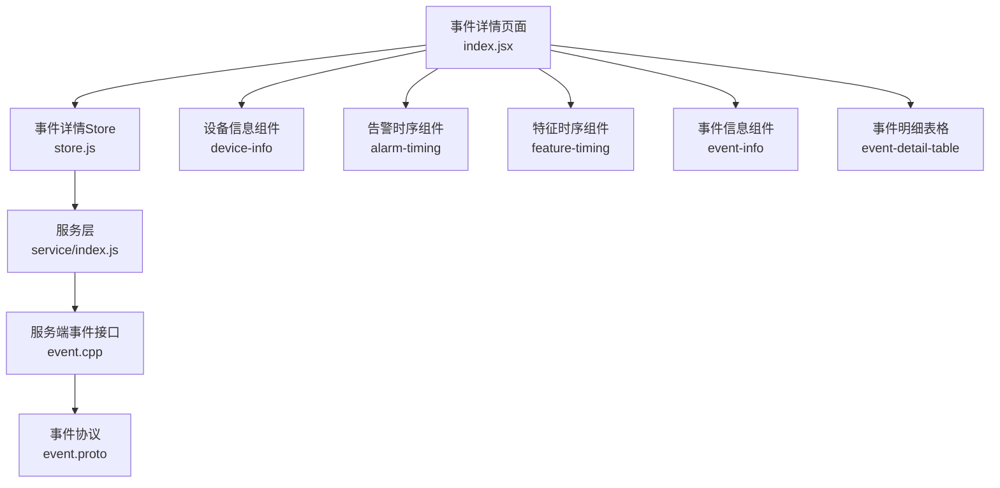
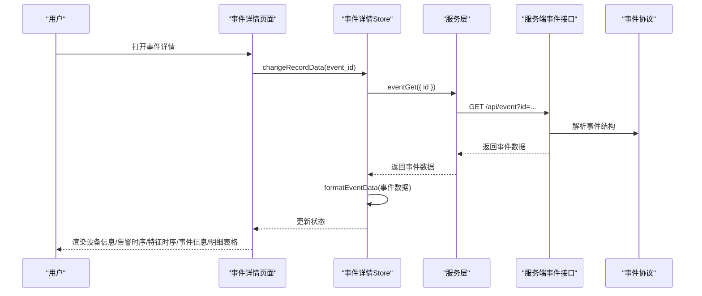
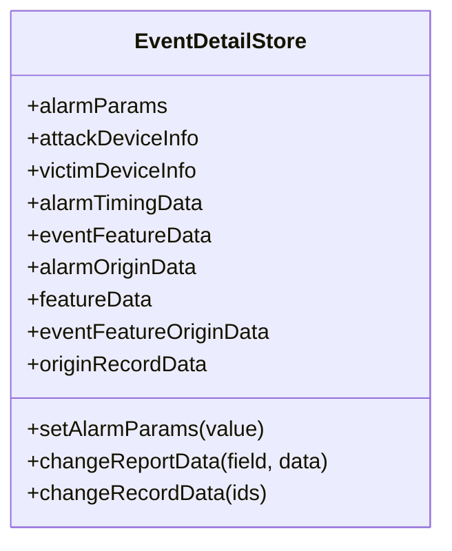
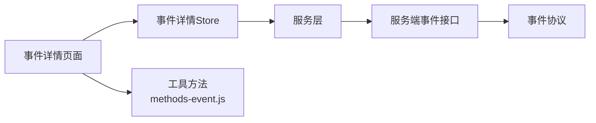

# 事件管理界面

<cite>
**本文引用的文件**
- [ly_vis/packages/std/src/page/event/page-child/event-detail/index.jsx](file://ly_vis/packages/std/src/page/event/page-child/event-detail/index.jsx)
- [ly_vis/packages/std/src/page/event/page-child/event-detail/store.js](file://ly_vis/packages/std/src/page/event/page-child/event-detail/store.js)
- [ly_vis/packages/std/src/page/event/page-child/event-detail/components/device-info/index.jsx](file://ly_vis/packages/std/src/page/event/page-child/event-detail/components/device-info/index.jsx)
- [ly_vis/packages/std/src/page/event/page-child/event-detail/components/alarm-timing/index.jsx](file://ly_vis/packages/std/src/page/event/page-child/event-detail/components/alarm-timing/index.jsx)
- [ly_vis/packages/std/src/page/event/page-child/event-detail/components/feature-timing/index.jsx](file://ly_vis/packages/std/src/page/event/page-child/event-detail/components/feature-timing/index.jsx)
- [ly_vis/packages/std/src/page/event/page-child/event-detail/components/event-detail-table/index.jsx](file://ly_vis/packages/std/src/page/event/page-child/event-detail/components/event-detail-table/index.jsx)
- [ly_vis/packages/std/src/page/event/page-child/event-detail/components/event-info/index.jsx](file://ly_vis/packages/std/src/page/event/page-child/event-detail/components/event-info/index.jsx)
- [ly_vis/packages/std/src/utils/methods-event.js](file://ly_vis/packages/std/src/utils/methods-event.js)
- [ly_vis/packages/std/src/service/index.js](file://ly_vis/packages/std/src/service/index.js)
- [ly_server/src/server/event.cpp](file://ly_server/src/server/event.cpp)
- [ly_server/src/common/event_req.h](file://ly_server/src/common/event_req.h)
- [ly_analyser/src/common/event.proto](file://ly_analyser/src/common/event.proto)
</cite>

## 目录
1. [简介](#简介)
2. [项目结构](#项目结构)
3. [核心组件](#核心组件)
4. [架构总览](#架构总览)
5. [详细组件分析](#详细组件分析)
6. [依赖关系分析](#依赖关系分析)
7. [性能考虑](#性能考虑)
8. [故障排查指南](#故障排查指南)
9. [结论](#结论)
10. [附录](#附录)

## 简介
本文件面向事件管理界面的前端与后端协作实现，聚焦以下目标：
- 事件列表页面的数据获取、筛选与分页（以通用方案说明）
- 事件详情页面的信息展示与关联分析
- 事件搜索功能：关键词搜索、高级筛选、结果排序
- 事件状态管理与批量操作、用户交互反馈
- API 调用示例、错误处理机制与性能优化策略

说明：当前仓库中可直接定位到“事件详情”页面及其 Store、子组件；事件列表页的具体实现未在当前上下文中提供。本文将基于现有代码进行精确分析，并对缺失部分给出可落地的实现建议与接口约定。

## 项目结构
事件管理相关的前端代码位于 ly_vis 的 std 包下，采用按页面划分的目录组织方式：
- 事件详情页面：ly_vis/packages/std/src/page/event/page-child/event-detail
- 事件详情子组件：alarm-timing、device-info、event-info、event-detail-table、feature-timing 等
- 事件详情状态管理：store.js（MobX）
- 工具方法：methods-event.js（用于格式化事件数据、监听更新等）
- 服务层：service/index.js（封装 HTTP 请求，如 eventGet）
- 服务端：ly_server/src/server/event.cpp（事件查询/处理逻辑）
- 协议定义：ly_analyser/src/common/event.proto（事件数据结构）

图表来源
- [ly_vis/packages/std/src/page/event/page-child/event-detail/index.jsx:1-42](file://ly_vis/packages/std/src/page/event/page-child/event-detail/index.jsx#L1-L42)
- [ly_vis/packages/std/src/page/event/page-child/event-detail/store.js:1-46](file://ly_vis/packages/std/src/page/event/page-child/event-detail/store.js#L1-L46)
- [ly_vis/packages/std/src/service/index.js](file://ly_vis/packages/std/src/service/index.js)
- [ly_server/src/server/event.cpp](file://ly_server/src/server/event.cpp)
- [ly_analyser/src/common/event.proto](file://ly_analyser/src/common/event.proto)

章节来源
- [ly_vis/packages/std/src/page/event/page-child/event-detail/index.jsx:1-42](file://ly_vis/packages/std/src/page/event/page-child/event-detail/index.jsx#L1-L42)
- [ly_vis/packages/std/src/page/event/page-child/event-detail/store.js:1-46](file://ly_vis/packages/std/src/page/event/page-child/event-detail/store.js#L1-L46)

## 核心组件
- 事件详情页面容器：负责初始化 Store、读取路由参数中的事件 ID、订阅实时更新、渲染各子组件与表格。
- 事件详情 Store：使用 MobX 管理事件原始数据、设备信息、告警时序、特征时序等状态；通过 service 层调用后端接口获取并格式化数据。
- 设备信息组件：展示攻击方/受害方设备信息。
- 告警时序组件：展示告警时间线或趋势。
- 特征时序组件：展示事件相关特征的时序变化。
- 事件信息组件：展示事件元信息与关键属性。
- 事件明细表格：展示事件包含的明细记录（如流量条目、日志行等）。

章节来源
- [ly_vis/packages/std/src/page/event/page-child/event-detail/index.jsx:1-42](file://ly_vis/packages/std/src/page/event/page-child/event-detail/index.jsx#L1-L42)
- [ly_vis/packages/std/src/page/event/page-child/event-detail/store.js:1-46](file://ly_vis/packages/std/src/page/event/page-child/event-detail/store.js#L1-L46)
- [ly_vis/packages/std/src/page/event/page-child/event-detail/components/device-info/index.jsx](file://ly_vis/packages/std/src/page/event/page-child/event-detail/components/device-info/index.jsx)
- [ly_vis/packages/std/src/page/event/page-child/event-detail/components/alarm-timing/index.jsx](file://ly_vis/packages/std/src/page/event/page-child/event-detail/components/alarm-timing/index.jsx)
- [ly_vis/packages/std/src/page/event/page-child/event-detail/components/feature-timing/index.jsx](file://ly_vis/packages/std/src/page/event/page-child/event-detail/components/feature-timing/index.jsx)
- [ly_vis/packages/std/src/page/event/page-child/event-detail/components/event-info/index.jsx](file://ly_vis/packages/std/src/page/event/page-child/event-detail/components/event-info/index.jsx)
- [ly_vis/packages/std/src/page/event/page-child/event-detail/components/event-detail-table/index.jsx](file://ly_vis/packages/std/src/page/event/page-child/event-detail/components/event-detail-table/index.jsx)

## 架构总览
事件详情页面通过 Store 发起事件查询，服务层封装 HTTP 请求，服务端根据事件 ID 返回事件数据，前端将数据格式化后驱动视图渲染。同时，页面订阅实时更新，确保事件状态变更时界面同步刷新。

图表来源
- [ly_vis/packages/std/src/page/event/page-child/event-detail/store.js:34-44](file://ly_vis/packages/std/src/page/event/page-child/event-detail/store.js#L34-L44)
- [ly_vis/packages/std/src/page/event/page-child/event-detail/index.jsx:16-20](file://ly_vis/packages/std/src/page/event/page-child/event-detail/index.jsx#L16-L20)
- [ly_server/src/server/event.cpp](file://ly_server/src/server/event.cpp)
- [ly_analyser/src/common/event.proto](file://ly_analyser/src/common/event.proto)

## 详细组件分析

### 事件详情页面（容器）
- 职责：创建并注入 Store，从 URL 参数中获取事件 ID，触发数据加载；订阅实时更新；组合渲染各子组件与明细表格。
- 关键点：
  - 使用 useMemo 创建 Store 实例，避免重复创建。
  - useEffect 中读取路由参数并调用 Store 的数据加载方法。
  - 使用 useEventUpdate 钩子订阅事件更新，保持界面与后端状态一致。

章节来源
- [ly_vis/packages/std/src/page/event/page-child/event-detail/index.jsx:1-42](file://ly_vis/packages/std/src/page/event/page-child/event-detail/index.jsx#L1-L42)
- [ly_vis/packages/std/src/utils/methods-event.js](file://ly_vis/packages/std/src/utils/methods-event.js)

### 事件详情 Store（状态管理）
- 职责：维护事件原始数据、设备信息、告警时序、特征时序等状态；提供 action 更新状态；调用 service 层获取数据并进行格式化。
- 关键点：
  - 使用 @observable/@action.bound 管理状态与更新。
  - changeRecordData 接收事件 ID，调用 eventGet 获取数据，若为空则提示用户并清空状态。
  - 使用 formatEventData 对后端数据进行统一格式化，便于组件消费。

图表来源
- [ly_vis/packages/std/src/page/event/page-child/event-detail/store.js:7-44](file://ly_vis/packages/std/src/page/event/page-child/event-detail/store.js#L7-L44)

章节来源
- [ly_vis/packages/std/src/page/event/page-child/event-detail/store.js:1-46](file://ly_vis/packages/std/src/page/event/page-child/event-detail/store.js#L1-L46)

### 设备信息组件
- 职责：展示攻击方与受害方设备信息，通常包括 IP、主机名、地理位置等。
- 数据来源：由 Store 中的 attackDeviceInfo/victimDeviceInfo 提供。

章节来源
- [ly_vis/packages/std/src/page/event/page-child/event-detail/components/device-info/index.jsx](file://ly_vis/packages/std/src/page/event/page-child/event-detail/components/device-info/index.jsx)

### 告警时序组件
- 职责：以时间轴或折线图形式展示告警数量随时间的变化，帮助快速定位高峰时段。
- 数据来源：由 Store 中的 alarmTimingData 提供。

章节来源
- [ly_vis/packages/std/src/page/event/page-child/event-detail/components/alarm-timing/index.jsx](file://ly_vis/packages/std/src/page/event/page-child/event-detail/components/alarm-timing/index.jsx)

### 特征时序组件
- 职责：展示事件相关特征（如连接数、带宽、DNS 查询量等）的时序变化，辅助关联分析。
- 数据来源：由 Store 中的 featureTimingData/featureData 提供。

章节来源
- [ly_vis/packages/std/src/page/event/page-child/event-detail/components/feature-timing/index.jsx](file://ly_vis/packages/std/src/page/event/page-child/event-detail/components/feature-timing/index.jsx)

### 事件信息组件
- 职责：展示事件元信息（如事件类型、严重等级、时间戳、描述等），支持快速概览。
- 数据来源：由 Store 中的 originRecordData 或其他派生字段提供。

章节来源
- [ly_vis/packages/std/src/page/event/page-child/event-detail/components/event-info/index.jsx](file://ly_vis/packages/std/src/page/event/page-child/event-detail/components/event-info/index.jsx)

### 事件明细表格
- 职责：展示事件包含的明细记录（如流量条目、日志行），支持分页、排序、筛选等交互。
- 数据来源：由 Store 中的 featureData 或明细数组提供。

章节来源
- [ly_vis/packages/std/src/page/event/page-child/event-detail/components/event-detail-table/index.jsx](file://ly_vis/packages/std/src/page/event/page-child/event-detail/components/event-detail-table/index.jsx)

## 依赖关系分析
- 页面依赖 Store，Store 依赖服务层，服务层依赖服务端事件接口。
- 服务端依据事件协议解析请求与响应结构。
- 工具方法 methods-event.js 提供事件数据格式化与实时更新订阅能力。

图表来源
- [ly_vis/packages/std/src/page/event/page-child/event-detail/index.jsx:1-42](file://ly_vis/packages/std/src/page/event/page-child/event-detail/index.jsx#L1-L42)
- [ly_vis/packages/std/src/page/event/page-child/event-detail/store.js:1-46](file://ly_vis/packages/std/src/page/event/page-child/event-detail/store.js#L1-L46)
- [ly_vis/packages/std/src/utils/methods-event.js](file://ly_vis/packages/std/src/utils/methods-event.js)
- [ly_server/src/server/event.cpp](file://ly_server/src/server/event.cpp)
- [ly_analyser/src/common/event.proto](file://ly_analyser/src/common/event.proto)

章节来源
- [ly_vis/packages/std/src/page/event/page-child/event-detail/index.jsx:1-42](file://ly_vis/packages/std/src/page/event/page-child/event-detail/index.jsx#L1-L42)
- [ly_vis/packages/std/src/page/event/page-child/event-detail/store.js:1-46](file://ly_vis/packages/std/src/page/event/page-child/event-detail/store.js#L1-L46)
- [ly_server/src/common/event_req.h](file://ly_server/src/common/event_req.h)

## 性能考虑
- 前端缓存：对频繁访问的事件详情数据可在 Store 或本地缓存中进行短期缓存，减少重复请求。
- 增量更新：利用 useEventUpdate 订阅机制，仅拉取变更数据，降低网络与渲染开销。
- 分页与懒加载：事件明细表格应实现分页与按需加载，避免一次性加载大量数据导致卡顿。
- 图表渲染优化：时序图可采用数据采样、虚拟滚动等技术提升渲染性能。
- 服务端优化：事件查询接口应支持索引、分页、过滤与排序，减少不必要的数据传输。

[本节为通用性能建议，不直接分析具体文件]

## 故障排查指南
- 事件数据为空：当 eventGet 返回空数组时，Store 会提示“未查询到事件信息”，请检查事件 ID 是否正确、后端接口是否可用。
- 实时更新失败：确认 useEventUpdate 订阅是否正常建立，检查 WebSocket 或轮询配置与服务端推送通道。
- 组件渲染异常：检查 Store 中对应字段是否已正确赋值，确认 formatEventData 的输出结构与组件期望一致。
- 网络错误：在服务层或 Store 中添加统一的错误捕获与重试机制，向用户展示友好提示。

章节来源
- [ly_vis/packages/std/src/page/event/page-child/event-detail/store.js:34-44](file://ly_vis/packages/std/src/page/event/page-child/event-detail/store.js#L34-L44)

## 结论
事件详情页面通过 Store 与服务层协同完成数据获取与状态管理，结合多个子组件实现丰富的信息展示与关联分析。建议进一步完善事件列表页的筛选、分页与搜索能力，并在前后端统一错误处理与性能优化策略，以提升整体用户体验与系统稳定性。

[本节为总结性内容，不直接分析具体文件]

## 附录

### API 调用示例（事件详情）
- 请求
  - 方法：GET
  - 路径：/api/event
  - 参数：id（事件标识）
- 响应
  - 成功：返回事件对象或数组，包含设备信息、告警时序、特征时序、明细记录等字段
  - 失败：返回错误码与提示信息

章节来源
- [ly_vis/packages/std/src/page/event/page-child/event-detail/store.js:34-44](file://ly_vis/packages/std/src/page/event/page-child/event-detail/store.js#L34-L44)
- [ly_server/src/server/event.cpp](file://ly_server/src/server/event.cpp)
- [ly_server/src/common/event_req.h](file://ly_server/src/common/event_req.h)
- [ly_analyser/src/common/event.proto](file://ly_analyser/src/common/event.proto)

### 事件列表页实现建议（数据获取、筛选、分页）
- 数据获取：通过 service 层封装列表查询接口，支持时间范围、事件类型、严重等级等筛选条件。
- 筛选：前端表单收集筛选条件，拼接为查询参数；后端根据条件构建查询语句。
- 分页：前端传递 page、pageSize；后端返回 total、list；表格组件实现翻页与每页条数切换。
- 排序：支持按时间、严重等级等字段排序，前端传递 sortField、sortOrder，后端执行排序。

[本节为通用实现建议，不直接分析具体文件]

### 事件搜索功能（关键词、高级筛选、排序）
- 关键词搜索：对事件标题、描述、IP、域名等字段进行模糊匹配。
- 高级筛选：组合多条件（时间范围、事件类型、来源/目的 IP、端口等）。
- 结果排序：默认按时间倒序，支持自定义排序字段与顺序。

[本节为通用实现建议，不直接分析具体文件]

### 事件状态管理与批量操作
- 状态管理：在 Store 中维护选中项、批量操作上下文、操作进度与结果。
- 批量操作：支持批量标记、批量导出、批量关闭等；提交前进行二次确认，完成后统一反馈结果。
- 用户交互反馈：使用消息提示、进度条、禁用按钮等方式提供即时反馈。

[本节为通用实现建议，不直接分析具体文件]

### 错误处理机制
- 前端：统一捕获网络错误、业务错误，显示友好提示；对超时与重试进行控制。
- 后端：对非法参数、权限不足、数据不存在等情况返回明确错误码与信息。
- 日志：记录关键错误堆栈与请求上下文，便于问题定位。

[本节为通用实现建议，不直接分析具体文件]