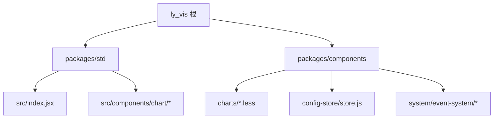
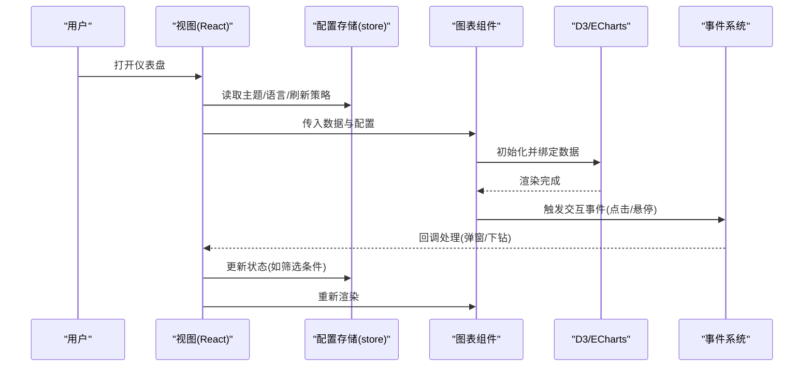
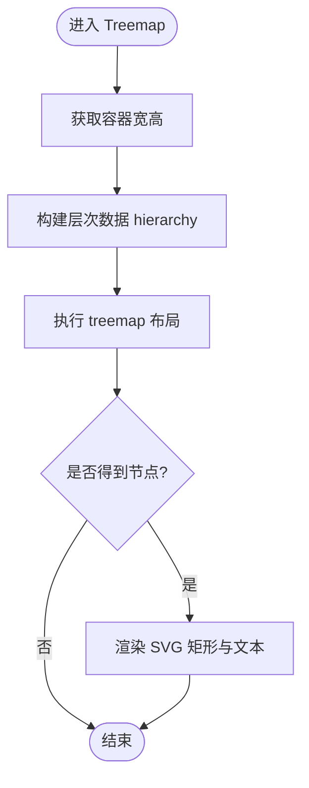
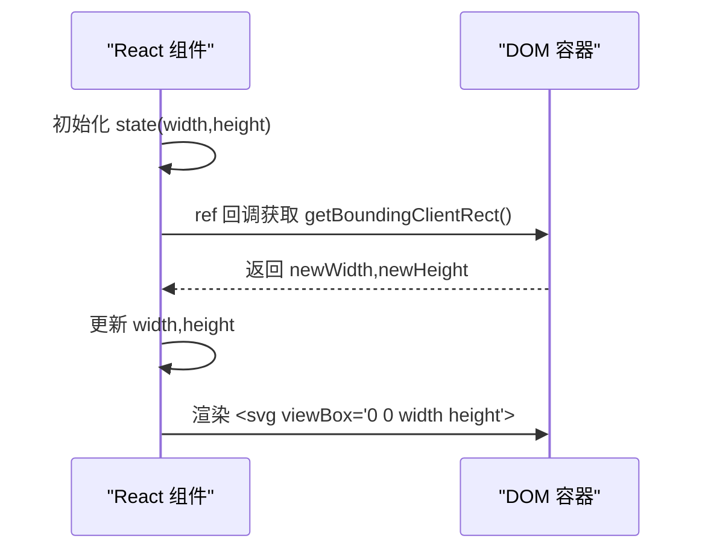
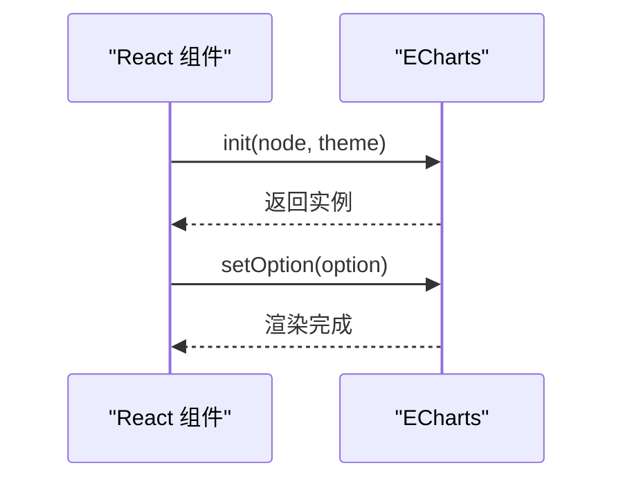
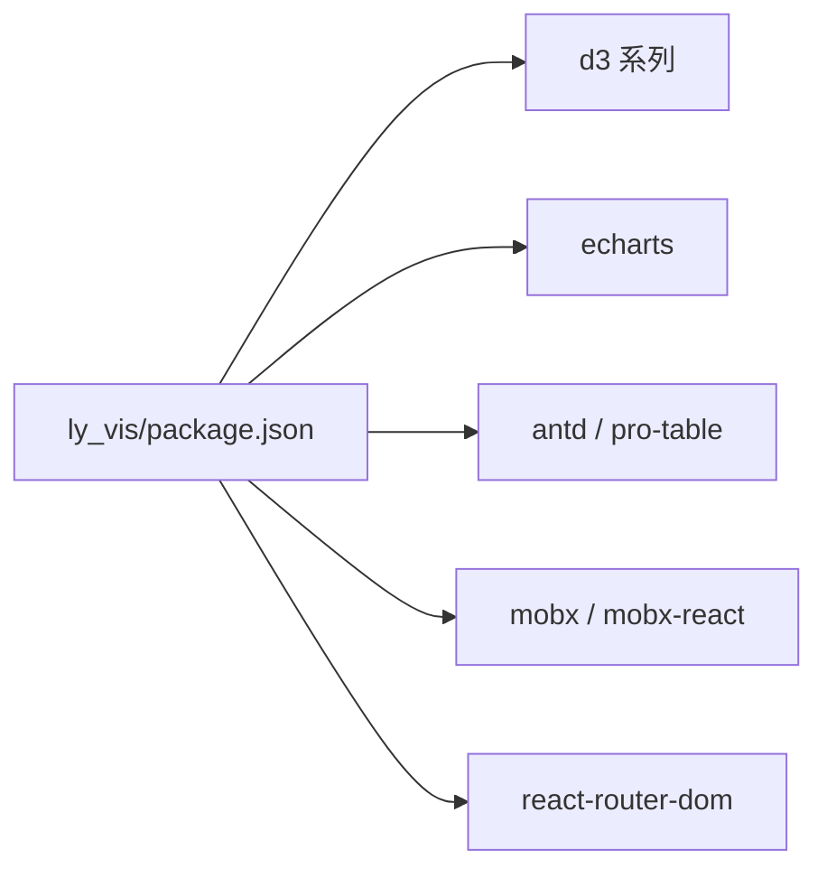

# 仪表盘组件

<cite>
**本文引用的文件**
- [package.json](file://ly_vis/package.json)
- [index.jsx](file://ly_vis/packages/std/src/index.jsx)
- [chart-treemap/index.jsx](file://ly_vis/packages/std/src/components/chart/chart-treemap/index.jsx)
- [index_d3.jsx](file://ly_vis/packages/std/src/components/chart/a_eg/index_d3.jsx)
- [index_echart.jsx](file://ly_vis/packages/std/src/components/chart/a_eg/index_echart.jsx)
- [charts.less](file://ly_vis/packages/components/charts/charts.less)
- [store.js](file://ly_vis/packages/components/config-store/store.js)
- [event-system/config/event/black/index.js](file://ly_vis/packages/components/system/event-system/config/event/black/index.js)
</cite>

## 目录
1. [简介](#简介)
2. [项目结构](#项目结构)
3. [核心组件](#核心组件)
4. [架构总览](#架构总览)
5. [详细组件分析](#详细组件分析)
6. [依赖关系分析](#依赖关系分析)
7. [性能考虑](#性能考虑)
8. [故障排查指南](#故障排查指南)
9. [结论](#结论)
10. [附录](#附录)

## 简介
本文件面向安全态势仪表盘的前端可视化组件，重点说明：
- 整体布局与数据展示逻辑
- 威胁地图组件的实现要点（地理信息、标记点、交互）
- 统计图表组件的使用方式（D3.js 集成、数据绑定、动态更新）
- 实时数据刷新、性能优化与响应式适配方案
- 具体使用示例与自定义扩展方法

本项目采用 React + D3/ECharts 的可视化技术栈，通过 monorepo 组织多个包，其中 ly_vis 提供可视化能力，std 包封装常用图表与页面模板，components 包提供可复用 UI/系统能力。

## 项目结构
- ly_vis：可视化工程根目录，包含多工作区 packages
  - packages/std：标准应用壳，内置路由、服务层、通用组件与页面模板
  - packages/components：通用组件库（含图表样式、配置存储、事件系统等）
- 依赖管理：顶层 package.json 声明 d3、echarts、antd、mobx 等依赖；std 包引入 d3-voronoi-treemap、echarts 等

图示来源
- [package.json:36-79](file://ly_vis/package.json#L36-L79)
- [index.jsx:1-200](file://ly_vis/packages/std/src/index.jsx#L1-L200)

章节来源
- [package.json:1-127](file://ly_vis/package.json#L1-L127)
- [index.jsx:1-200](file://ly_vis/packages/std/src/index.jsx#L1-L200)

## 核心组件
- 树图（Treemap）：基于 D3 的层次化矩形树图，用于展示层级指标或分类占比
- D3 基础容器：提供尺寸自适应与 SVG 容器的最小实现，便于扩展各类图表
- ECharts 容器：提供 ECharts 初始化与 setOption 的最小封装
- 图表样式：统一的图表容器与主题样式
- 配置存储：集中管理全局配置（如主题、语言、刷新策略）
- 事件系统：统一的事件订阅/发布机制，支撑跨组件通信

章节来源
- [chart-treemap/index.jsx:1-72](file://ly_vis/packages/std/src/components/chart/chart-treemap/index.jsx#L1-L72)
- [index_d3.jsx:1-31](file://ly_vis/packages/std/src/components/chart/a_eg/index_d3.jsx#L1-L31)
- [index_echart.jsx:1-18](file://ly_vis/packages/std/src/components/chart/a_eg/index_echart.jsx#L1-L18)
- [charts.less:1-200](file://ly_vis/packages/components/charts/charts.less#L1-L200)
- [store.js:1-200](file://ly_vis/packages/components/config-store/store.js#L1-L200)
- [event-system/config/event/black/index.js:1-200](file://ly_vis/packages/components/system/event-system/config/event/black/index.js#L1-L200)

## 架构总览
仪表盘由“数据源 → 状态/配置 → 图表渲染 → 交互反馈”构成闭环。D3 负责数据到 SVG 的映射，ECharts 提供开箱即用的统计图表；配置存储与事件系统贯穿各组件，保证一致的主题、语言与刷新行为。

图示来源
- [store.js:1-200](file://ly_vis/packages/components/config-store/store.js#L1-L200)
- [index_d3.jsx:1-31](file://ly_vis/packages/std/src/components/chart/a_eg/index_d3.jsx#L1-L31)
- [index_echart.jsx:1-18](file://ly_vis/packages/std/src/components/chart/a_eg/index_echart.jsx#L1-L18)
- [event-system/config/event/black/index.js:1-200](file://ly_vis/packages/components/system/event-system/config/event/black/index.js#L1-L200)

## 详细组件分析

### 树图组件（Treemap）
- 功能：将层级数据转换为嵌套矩形，支持不同深度的内边距与顶部标签高度
- 数据绑定：通过 D3 的 hierarchy 构建层次结构，treemap 布局计算节点位置
- 颜色与图例：使用比例尺分配颜色，图例区域预留固定高度
- 响应式：通过容器 ref 获取宽高，动态设置 viewBox，确保缩放不失真

图示来源
- [chart-treemap/index.jsx:1-72](file://ly_vis/packages/std/src/components/chart/chart-treemap/index.jsx#L1-L72)

章节来源
- [chart-treemap/index.jsx:1-72](file://ly_vis/packages/std/src/components/chart/chart-treemap/index.jsx#L1-L72)

### D3 基础容器（BarChart 示例）
- 功能：提供最小化的 D3 图表容器，记录容器尺寸，输出空白 SVG 以便扩展
- 响应式：使用 useCallback 绑定 ref，监听容器尺寸变化并更新 state
- 扩展点：在 g 元素内追加坐标轴、网格、系列图形等

图示来源
- [index_d3.jsx:1-31](file://ly_vis/packages/std/src/components/chart/a_eg/index_d3.jsx#L1-L31)

章节来源
- [index_d3.jsx:1-31](file://ly_vis/packages/std/src/components/chart/a_eg/index_d3.jsx#L1-L31)

### ECharts 容器（Calendar 示例）
- 功能：初始化 ECharts 实例并设置 option，适合快速集成统计图表
- 生命周期：在 ref 回调中创建实例，后续通过 setOption 更新
- 主题：支持传入主题名（如 light），便于统一风格

图示来源
- [index_echart.jsx:1-18](file://ly_vis/packages/std/src/components/chart/a_eg/index_echart.jsx#L1-L18)

章节来源
- [index_echart.jsx:1-18](file://ly_vis/packages/std/src/components/chart/a_eg/index_echart.jsx#L1-L18)

### 威胁地图组件（概念与落地建议）
- 目标：在地图上展示威胁事件的位置、强度与类型，支持点击下钻与筛选
- 数据模型：经纬度、时间戳、威胁等级、来源/目标 IP、事件类型
- 渲染策略：
  - 底图：使用地图瓦片或矢量地图（如 GeoJSON）
  - 标记：按等级着色、大小映射强度，支持聚合减少渲染压力
  - 交互：悬停显示详情、点击展开事件列表或关联图谱
- 性能优化：
  - 大数据量时启用聚合/抽样/分片加载
  - 使用 requestAnimationFrame 或 Web Worker 处理重计算
  - 限制同时可见标记数量，按需懒加载
- 与现有组件集成：
  - 复用 D3 基础容器进行 SVG 绘制，或使用 ECharts GL 渲染三维地图
  - 通过事件系统上报点击/筛选事件，联动其他图表

[本节为概念性说明，不直接对应具体源码文件]

### 统计图表组件（D3/ECharts 集成）
- D3 集成：
  - 数据绑定：将数组/对象映射为 SVG 元素，使用 scale 映射数值到像素
  - 动画过渡：利用 transition 实现平滑更新
  - 响应式：根据容器尺寸重算比例尺与布局
- ECharts 集成：
  - 配置驱动：通过 option 描述系列、坐标轴、提示框等
  - 动态更新：setOption 增量更新，避免重建实例
- 数据流：
  - 上游服务/接口提供时序或聚合数据
  - 组件内部做归一化与格式化
  - 渲染后通过事件回调向父级或全局状态同步

章节来源
- [index_d3.jsx:1-31](file://ly_vis/packages/std/src/components/chart/a_eg/index_d3.jsx#L1-L31)
- [index_echart.jsx:1-18](file://ly_vis/packages/std/src/components/chart/a_eg/index_echart.jsx#L1-L18)

### 实时数据刷新
- 刷新策略：
  - 轮询：定时拉取最新数据，注意节流与去抖
  - 长连接：WebSocket/SSE 推送，降低延迟
- 更新机制：
  - 增量更新：仅变更的数据段触发 re-render
  - 虚拟滚动/分页：大数据集分批渲染
- 与配置存储联动：
  - 从 store 读取刷新间隔、缓存策略
  - 切换主题/语言时自动刷新图表

章节来源
- [store.js:1-200](file://ly_vis/packages/components/config-store/store.js#L1-L200)

### 响应式适配
- 容器尺寸监听：通过 ref + getBoundingClientRect 获取真实尺寸
- 视口适配：SVG 使用 viewBox，图表按比例缩放
- 断点策略：在小屏设备上隐藏次要信息或切换为纵向布局

章节来源
- [chart-treemap/index.jsx:1-72](file://ly_vis/packages/std/src/components/chart/chart-treemap/index.jsx#L1-L72)
- [index_d3.jsx:1-31](file://ly_vis/packages/std/src/components/chart/a_eg/index_d3.jsx#L1-L31)

### 使用示例与自定义扩展
- 基本用法：
  - 引入图表组件，传入 data 与可选 legends
  - 在容器中指定宽高，组件自动适配
- 自定义扩展：
  - 在 D3 容器基础上添加坐标轴、图例、工具提示
  - 在 ECharts 容器中扩展 tooltip、legend、dataZoom
  - 通过事件系统注册自定义事件，实现跨组件联动

章节来源
- [chart-treemap/index.jsx:1-72](file://ly_vis/packages/std/src/components/chart/chart-treemap/index.jsx#L1-L72)
- [index_d3.jsx:1-31](file://ly_vis/packages/std/src/components/chart/a_eg/index_d3.jsx#L1-L31)
- [index_echart.jsx:1-18](file://ly_vis/packages/std/src/components/chart/a_eg/index_echart.jsx#L1-L18)

## 依赖关系分析
- 运行时依赖：
  - d3、d3-array、d3-sankey、dagre-d3：用于高级图表与布局
  - echarts：用于统计图表
  - antd、@ant-design/pro-table：UI 表格与交互
  - mobx/mobx-react：状态管理
  - react-router-dom：页面路由
- 开发依赖：
  - eslint/prettier/stylelint：代码规范
  - lerna：monorepo 管理

图示来源
- [package.json:36-79](file://ly_vis/package.json#L36-L79)

章节来源
- [package.json:1-127](file://ly_vis/package.json#L1-L127)

## 性能考虑
- 渲染优化
  - 使用 useMemo/useCallback 缓存布局与回调，减少重复计算
  - 大数据集采用聚合、抽样、分页与虚拟滚动
  - 避免频繁重建实例，优先使用 setOption 增量更新
- 内存与 GC
  - 及时销毁图表实例与定时器
  - 避免闭包持有大对象引用
- 网络与缓存
  - 合理设置请求频率与缓存策略
  - 使用 WebSocket/SSE 替代高频轮询
- 主题与样式
  - 统一样式入口 charts.less，减少重复样式定义
  - 按需加载字体与图标资源

章节来源
- [charts.less:1-200](file://ly_vis/packages/components/charts/charts.less#L1-L200)

## 故障排查指南
- 图表不渲染
  - 检查容器是否有宽高，ref 是否正确绑定
  - 确认数据格式是否符合组件期望
- 更新卡顿
  - 检查是否存在全量重绘，改为增量更新
  - 评估数据量，启用聚合/分页
- 主题/语言不一致
  - 确认 store 中的配置已正确注入
  - 检查事件系统是否触发了主题切换
- 事件未触发
  - 检查事件系统注册与订阅是否成对出现
  - 确认事件命名空间与作用域

章节来源
- [store.js:1-200](file://ly_vis/packages/components/config-store/store.js#L1-L200)
- [event-system/config/event/black/index.js:1-200](file://ly_vis/packages/components/system/event-system/config/event/black/index.js#L1-L200)

## 结论
本仪表盘以 React 为视图层，结合 D3 与 ECharts 提供灵活的可视化能力。通过统一的配置存储与事件系统，实现了主题、语言与刷新策略的一致性。针对威胁地图与统计图表，提供了可扩展的容器与最佳实践，满足实时、高性能与响应式需求。建议在大规模数据场景下优先采用聚合与增量更新，并结合事件系统实现跨组件联动。

## 附录
- 快速开始
  - 安装依赖：yarn install
  - 启动开发环境：cd ly_vis && yarn workspace @shadowflow/std start
  - 构建产物：yarn workspace @shadowflow/std build
- 相关脚本与命令参考
  - lint/format/test/deploy 等脚本见 std 包 scripts

章节来源
- [package.json:1-127](file://ly_vis/package.json#L1-L127)
- [packages/std/package.json:1-45](file://ly_vis/packages/std/package.json#L1-L45)