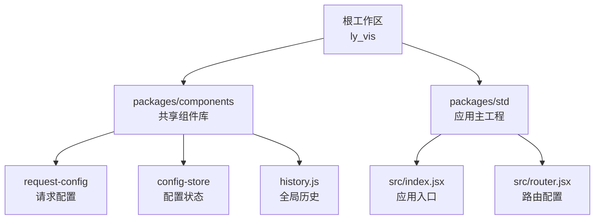
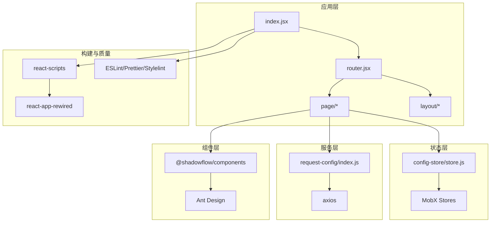
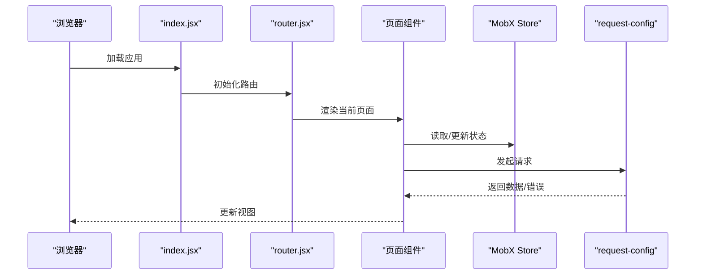
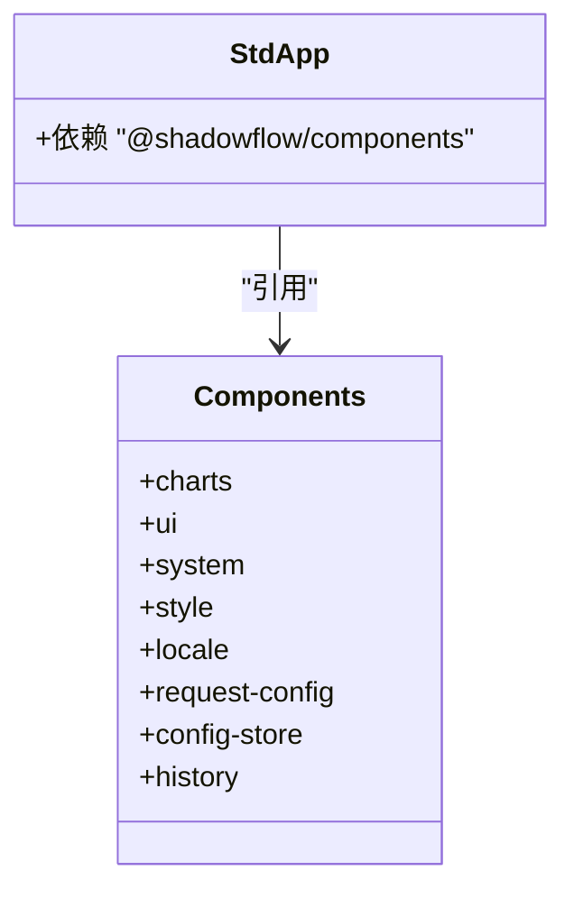
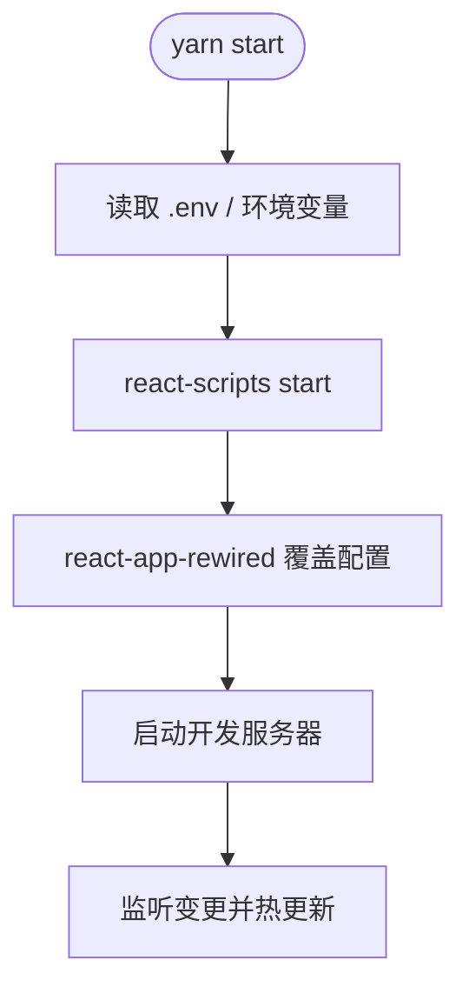
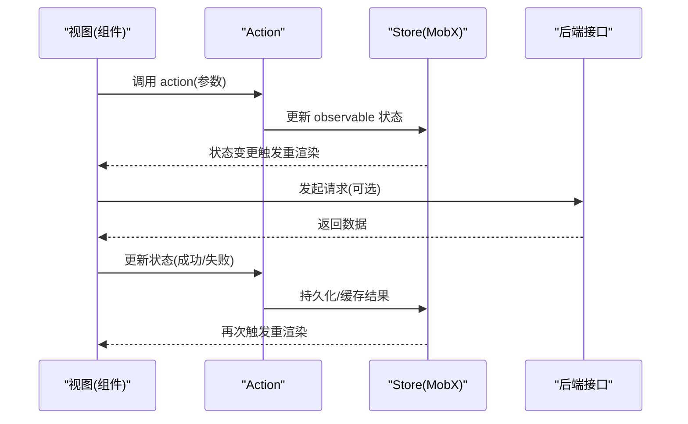
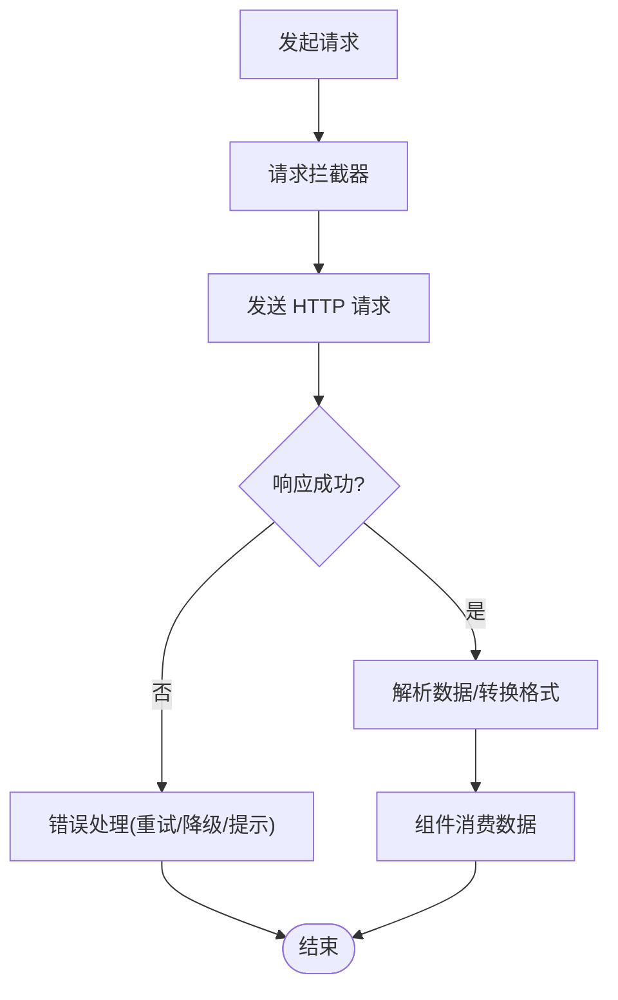
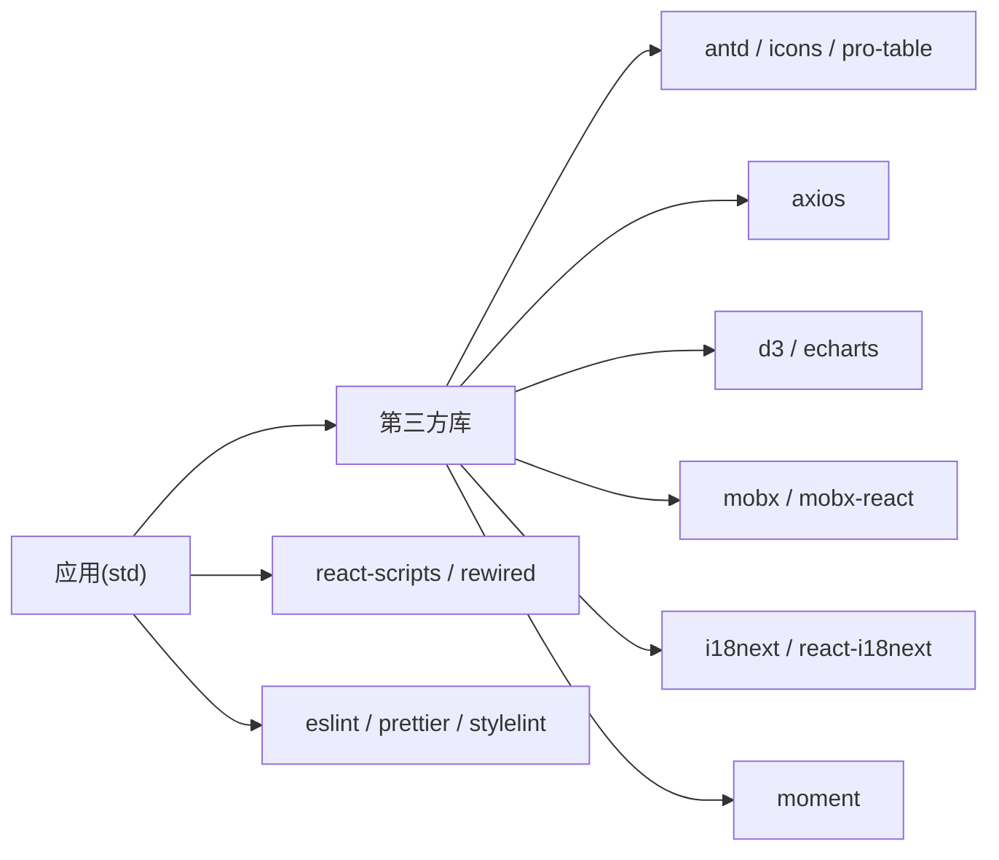

# 前端架构设计

<cite>
**本文引用的文件**
- [package.json](file://ly_vis/package.json)
- [lerna.json](file://ly_vis/lerna.json)
- [.eslintrc.js](file://ly_vis/.eslintrc.js)
- [.prettierrc.js](file://ly_vis/.prettierrc.js)
- [packages/components/package.json](file://ly_vis/packages/components/package.json)
- [packages/std/package.json](file://ly_vis/packages/std/package.json)
- [packages/std/config-overrides.js](file://ly_vis/packages/std/config-overrides.js)
- [packages/std/src/router.jsx](file://ly_vis/packages/std/src/router.jsx)
- [packages/std/src/index.jsx](file://ly_vis/packages/std/src/index.jsx)
- [packages/components/history.js](file://ly_vis/packages/components/history.js)
- [packages/components/request-config/index.js](file://ly_vis/packages/components/request-config/index.js)
- [packages/components/config-store/store.js](file://ly_vis/packages/components/config-store/store.js)
</cite>

## 目录
1. [简介](#简介)
2. [项目结构](#项目结构)
3. [核心组件](#核心组件)
4. [架构总览](#架构总览)
5. [详细组件分析](#详细组件分析)
6. [依赖分析](#依赖分析)
7. [性能考虑](#性能考虑)
8. [故障排查指南](#故障排查指南)
9. [结论](#结论)
10. [附录](#附录)

## 简介
本技术文档面向 ly_vis 前端工程，基于 React + TypeScript（通过 react-scripts 与 typescript 支持）构建，采用 Monorepo（Lerna + Yarn Workspaces）组织代码，使用 MobX 进行状态管理，结合 Ant Design、ECharts/D3 等生态完成可视化与分析平台的前端实现。文档从架构模式、目录结构、模块划分、数据流、构建工具链、依赖管理、开发环境搭建、代码规范与最佳实践等方面进行全面说明，并提供可操作的配置示例与初始化步骤。

## 项目结构
ly_vis 采用 Monorepo 结构：
- 根目录：统一脚本、工作区与质量门禁（ESLint、Prettier、Stylelint、Husky、Commitlint）。
- packages/components：共享 UI 与业务组件库（图表、系统、样式、请求配置、国际化、历史管理等），对外暴露统一入口 index.js。
- packages/std：应用主工程（React 应用），包含路由、页面、服务、布局、样式、工具、本地化等，基于 create-react-app 并通过 react-app-rewired 扩展构建配置。

**图示来源**
- [packages/std/package.json:18-30](file://ly_vis/packages/std/package.json#L18-L30)
- [packages/components/package.json:1-8](file://ly_vis/packages/components/package.json#L1-L8)
- [packages/components/history.js](file://ly_vis/packages/components/history.js)
- [packages/components/request-config/index.js](file://ly_vis/packages/components/request-config/index.js)
- [packages/components/config-store/store.js](file://ly_vis/packages/components/config-store/store.js)

**章节来源**
- [package.json:1-127](file://ly_vis/package.json#L1-L127)
- [lerna.json:1-9](file://ly_vis/lerna.json#L1-L9)
- [packages/std/package.json:1-45](file://ly_vis/packages/std/package.json#L1-L45)
- [packages/components/package.json:1-8](file://ly_vis/packages/components/package.json#L1-L8)

## 核心组件
- 应用入口与启动流程
  - 应用入口位于 packages/std/src/index.jsx，负责挂载根组件、初始化全局配置与服务。
  - 路由定义在 packages/std/src/router.jsx，集中管理页面级路由与权限/守卫逻辑。
- 共享组件库
  - packages/components 提供图表、UI、系统、样式、请求配置、国际化、历史管理等能力，作为 @shadowflow/components 被 std 应用引用。
- 状态管理与数据流
  - 使用 MobX（mobx + mobx-react）进行响应式状态管理；config-store 用于集中管理应用配置与运行时状态。
- 网络请求
  - request-config 封装统一的请求配置（如 baseURL、拦截器、错误处理），供各页面与服务调用。

**章节来源**
- [packages/std/src/index.jsx](file://ly_vis/packages/std/src/index.jsx)
- [packages/std/src/router.jsx](file://ly_vis/packages/std/src/router.jsx)
- [packages/components/request-config/index.js](file://ly_vis/packages/components/request-config/index.js)
- [packages/components/config-store/store.js](file://ly_vis/packages/components/config-store/store.js)

## 架构总览
整体采用“Monorepo + 组件库 + 应用”的分层架构：
- 表现层：React 组件（Ant Design 基础组件 + 自定义业务组件）。
- 状态层：MobX Store（配置、用户、会话、图表数据等）。
- 服务层：HTTP 客户端（Axios）+ 统一请求配置与拦截器。
- 路由层：react-router-dom 管理页面导航与嵌套路由。
- 构建层：create-react-app + react-app-rewired + customize-cra，支持 TS、Less、按需加载与源码分析。
- 质量门禁：ESLint + Prettier + Stylelint + Husky + Commitlint。

**图示来源**
- [packages/std/src/index.jsx](file://ly_vis/packages/std/src/index.jsx)
- [packages/std/src/router.jsx](file://ly_vis/packages/std/src/router.jsx)
- [packages/components/request-config/index.js](file://ly_vis/packages/components/request-config/index.js)
- [packages/components/config-store/store.js](file://ly_vis/packages/components/config-store/store.js)
- [package.json:36-79](file://ly_vis/package.json#L36-L79)
- [packages/std/package.json:18-30](file://ly_vis/packages/std/package.json#L18-L30)

## 详细组件分析

### 应用入口与路由
- 入口职责
  - 初始化全局配置、语言、主题、日志等。
  - 挂载根组件到 DOM，并注册 Service Worker（可选）。
- 路由职责
  - 定义页面路由、嵌套路由、懒加载与路由守卫。
  - 与权限、菜单、国际化联动。

**图示来源**
- [packages/std/src/index.jsx](file://ly_vis/packages/std/src/index.jsx)
- [packages/std/src/router.jsx](file://ly_vis/packages/std/src/router.jsx)
- [packages/components/request-config/index.js](file://ly_vis/packages/components/request-config/index.js)
- [packages/components/config-store/store.js](file://ly_vis/packages/components/config-store/store.js)

**章节来源**
- [packages/std/src/index.jsx](file://ly_vis/packages/std/src/index.jsx)
- [packages/std/src/router.jsx](file://ly_vis/packages/std/src/router.jsx)

### 共享组件库（@shadowflow/components）
- 模块划分
  - charts：图表相关组件（基于 ECharts/D3）。
  - ui：通用 UI 组件（表格、表单、弹窗等）。
  - system：系统级组件（通知、消息、全局提示等）。
  - style：主题与样式变量、混入。
  - locale：多语言资源与 i18n 工具。
  - request-config：统一请求配置与拦截器。
  - config-store：配置状态存储（MobX）。
  - history：全局历史对象，便于跨组件访问路由历史。
- 发布与引用
  - 通过 package.json 的 main 指定入口 index.js，std 应用以 workspace 引用。

**图示来源**
- [packages/components/package.json:1-8](file://ly_vis/packages/components/package.json#L1-L8)
- [packages/std/package.json:6-17](file://ly_vis/packages/std/package.json#L6-L17)

**章节来源**
- [packages/components/package.json:1-8](file://ly_vis/packages/components/package.json#L1-L8)
- [packages/components/history.js](file://ly_vis/packages/components/history.js)
- [packages/components/request-config/index.js](file://ly_vis/packages/components/request-config/index.js)
- [packages/components/config-store/store.js](file://ly_vis/packages/components/config-store/store.js)

### 构建与开发工具链
- 构建工具
  - create-react-app 提供默认构建与开发服务器。
  - react-app-rewired + customize-cra 用于覆盖默认配置（如 Less、Babel、插件等）。
- 脚本命令
  - start/start:mock：启动开发服务器（区分 dev/mock 环境）。
  - build：生产构建。
  - analyze：体积分析（source-map-explorer）。
  - lint/style/format：代码检查与格式化。
- 环境变量
  - REACT_APP_ENV：控制运行环境（dev/mock/prod）。

**图示来源**
- [packages/std/package.json:18-30](file://ly_vis/packages/std/package.json#L18-L30)
- [packages/std/config-overrides.js](file://ly_vis/packages/std/config-overrides.js)

**章节来源**
- [packages/std/package.json:18-30](file://ly_vis/packages/std/package.json#L18-L30)
- [packages/std/config-overrides.js](file://ly_vis/packages/std/config-overrides.js)

### 状态管理与数据流（MobX）
- 设计要点
  - 将应用配置、用户信息、会话、图表数据等抽象为 Store。
  - 通过 observable/state 声明响应式数据，action 修改状态，computed 派生计算值。
  - 组件通过 observer 订阅 Store 变化，自动重渲染。
- 典型数据流
  - 页面触发 action -> Store 更新 -> 组件响应式更新 -> 必要时发起网络请求 -> 更新 Store -> 视图刷新。

**图示来源**
- [packages/components/config-store/store.js](file://ly_vis/packages/components/config-store/store.js)

**章节来源**
- [packages/components/config-store/store.js](file://ly_vis/packages/components/config-store/store.js)

### 网络请求与错误处理
- 统一配置
  - 通过 request-config 设置 baseURL、超时、请求头、鉴权 token 等。
  - 拦截器统一处理请求/响应错误、重试、取消等。
- 错误策略
  - 网络异常：提示用户并重试或降级。
  - 业务错误：根据 code/message 展示友好提示。
  - 安全：敏感信息不记录日志，避免泄露。

**图示来源**
- [packages/components/request-config/index.js](file://ly_vis/packages/components/request-config/index.js)

**章节来源**
- [packages/components/request-config/index.js](file://ly_vis/packages/components/request-config/index.js)

## 依赖分析
- 核心依赖
  - React、react-dom、react-router-dom：UI 框架与路由。
  - antd、@ant-design/icons、@ant-design/pro-table：企业级 UI 与表格。
  - axios：HTTP 客户端。
  - d3、echarts：数据可视化。
  - mobx、mobx-react：状态管理。
  - i18next、react-i18next：国际化。
  - moment：时间处理。
  - less、less-loader：样式预处理。
- 开发依赖
  - react-scripts、react-app-rewired、customize-cra：构建与配置覆盖。
  - eslint、prettier、stylelint：代码质量与风格。
  - husky、commitlint、lint-staged：提交前检查。
  - lerna、workspaces：Monorepo 管理。

**图示来源**
- [package.json:36-106](file://ly_vis/package.json#L36-L106)
- [packages/std/package.json:6-17](file://ly_vis/packages/std/package.json#L6-L17)

**章节来源**
- [package.json:36-106](file://ly_vis/package.json#L36-L106)
- [packages/std/package.json:6-17](file://ly_vis/packages/std/package.json#L6-L17)

## 性能考虑
- 构建优化
  - 使用 react-app-rewired 按需引入与 Tree Shaking，减少包体积。
  - 使用 source-map-explorer 分析打包产物，定位大依赖。
- 运行时优化
  - 路由懒加载与代码分割，降低首屏时间。
  - 合理使用 MobX computed 与 memoization，避免不必要的重渲染。
  - 大数据列表虚拟化（如虚拟滚动）与分页加载。
  - 图片与静态资源压缩与 CDN 加速。
- 监控与诊断
  - 埋点与错误上报，收集性能指标（FCP、LCP、TBT）。
  - 定期回归测试与性能基线对比。

[本节为通用指导，无需特定文件来源]

## 故障排查指南
- 常见问题
  - 构建失败：检查 babel/eslint 配置与语法兼容性；确认依赖版本一致。
  - 路由跳转无效：检查 router 配置与 history 对象是否正确注入。
  - 请求失败：查看 request-config 拦截器与后端返回码；检查鉴权与跨域。
  - 状态未更新：确认 MobX store 是否被 observer 包裹；避免直接修改只读属性。
- 调试建议
  - 使用浏览器开发者工具 Network/Console 定位问题。
  - 使用 source-map 映射源码，快速定位错误位置。
  - 开启详细日志（仅开发环境），避免生产泄露敏感信息。

**章节来源**
- [packages/components/request-config/index.js](file://ly_vis/packages/components/request-config/index.js)
- [packages/components/history.js](file://ly_vis/packages/components/history.js)
- [packages/components/config-store/store.js](file://ly_vis/packages/components/config-store/store.js)

## 结论
本项目采用 React + TypeScript（通过 react-scripts 与 typescript）构建，配合 Monorepo（Lerna + Workspaces）实现组件与应用解耦与复用；以 MobX 为核心的状态管理确保数据流清晰、可预测；通过 react-app-rewired 扩展构建能力，满足复杂可视化与分析场景需求；借助完善的代码质量门禁与脚本体系，保障团队协作效率与交付质量。建议在后续迭代中持续优化包体积、提升首屏性能，并完善监控与自动化测试。

[本节为总结性内容，无需特定文件来源]

## 附录

### 技术栈选择原因
- React + TypeScript：类型安全、生态成熟、组件化开发，利于大型项目管理与维护。
- MobX：轻量、直观、响应式，适合复杂状态与频繁更新的可视化场景。
- Ant Design：企业级 UI 组件丰富，开箱即用，降低重复造轮子成本。
- ECharts/D3：强大的可视化能力，满足多维数据分析与图表展示需求。
- Monorepo：统一管理共享组件与多应用，提高复用率与一致性。

[本节为概念性说明，无需特定文件来源]

### 目录结构与模块划分原则
- 按功能分层：页面、布局、组件、服务、工具、样式、国际化。
- 共享优先：通用能力下沉至 components 库，避免重复实现。
- 单一职责：每个模块聚焦一个领域，便于测试与维护。
- 约定优于配置：统一命名、目录结构与导入导出约定。

**章节来源**
- [packages/std/src/index.jsx](file://ly_vis/packages/std/src/index.jsx)
- [packages/std/src/router.jsx](file://ly_vis/packages/std/src/router.jsx)
- [packages/components/package.json:1-8](file://ly_vis/packages/components/package.json#L1-L8)

### 代码规范与命名约定
- ESLint：遵循 react-app、airbnb 与 prettier/recommended 规则，统一 JS/TS/JSX 风格。
- Prettier：单引号、无分号、4 空格缩进、箭头函数括号省略。
- Stylelint：CSS/LESS 规范，保证样式一致性。
- 命名约定：组件 PascalCase，文件小写短横线，常量 UPPER_SNAKE_CASE，函数 camelCase。

**章节来源**
- [.eslintrc.js:1-57](file://ly_vis/.eslintrc.js#L1-L57)
- [.prettierrc.js:1-10](file://ly_vis/.prettierrc.js#L1-L10)

### 构建工具链配置与依赖管理
- 构建工具：react-scripts + react-app-rewired + customize-cra。
- 脚本命令：start/start:mock/build/test/lint/style/format/deploy/release/analyze。
- 依赖管理：Yarn Workspaces + Lerna，独立版本管理。
- 环境变量：REACT_APP_ENV 控制不同环境行为。

**章节来源**
- [packages/std/package.json:18-30](file://ly_vis/packages/std/package.json#L18-L30)
- [lerna.json:1-9](file://ly_vis/lerna.json#L1-L9)
- [package.json:108-127](file://ly_vis/package.json#L108-L127)

### 开发环境搭建指南
- 前置要求：Node.js（推荐 LTS）、Yarn。
- 安装依赖：在项目根目录执行 yarn install。
- 启动开发：进入 packages/std，执行 yarn start 或 yarn start:mock。
- 构建与部署：执行 yarn build，按需执行 yarn deploy。
- 代码质量：执行 yarn lint、yarn style、yarn format。

**章节来源**
- [packages/std/package.json:18-30](file://ly_vis/packages/std/package.json#L18-L30)
- [package.json:108-127](file://ly_vis/package.json#L108-L127)

### 配置文件示例与项目初始化步骤
- 工作区与 Lerna
  - 使用 workspaces 与 lerna 管理多包。
  - 参考 lerna.json 与根 package.json 的 scripts。
- 应用配置
  - 通过 config-overrides.js 覆盖 CRA 默认配置（如 Less、Babel 插件等）。
  - 通过 .env 与环境变量控制行为。
- 初始化步骤
  - 克隆仓库，安装依赖，初始化子包（如需），启动开发服务器。

**章节来源**
- [lerna.json:1-9](file://ly_vis/lerna.json#L1-L9)
- [packages/std/config-overrides.js](file://ly_vis/packages/std/config-overrides.js)
- [packages/std/package.json:18-30](file://ly_vis/packages/std/package.json#L18-L30)