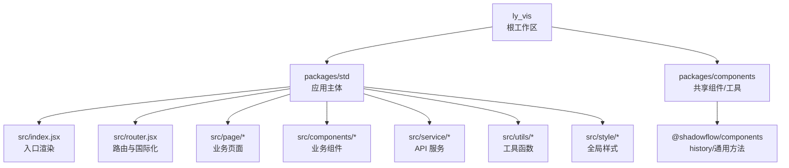
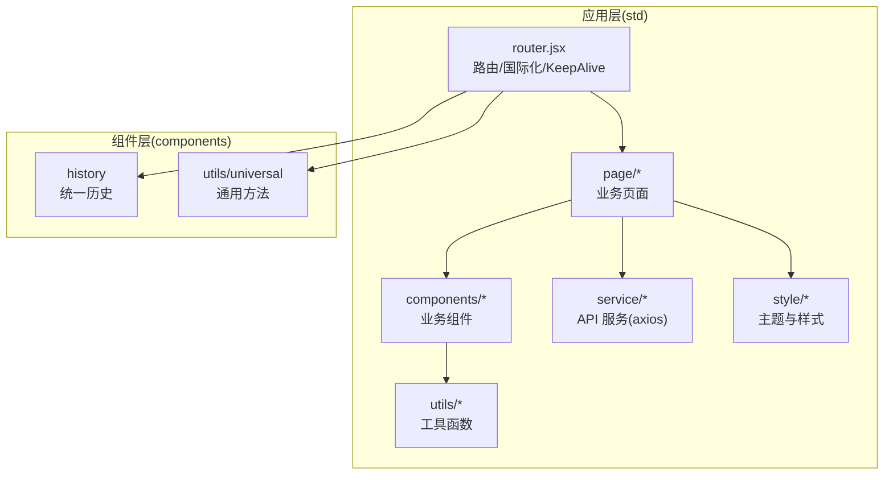
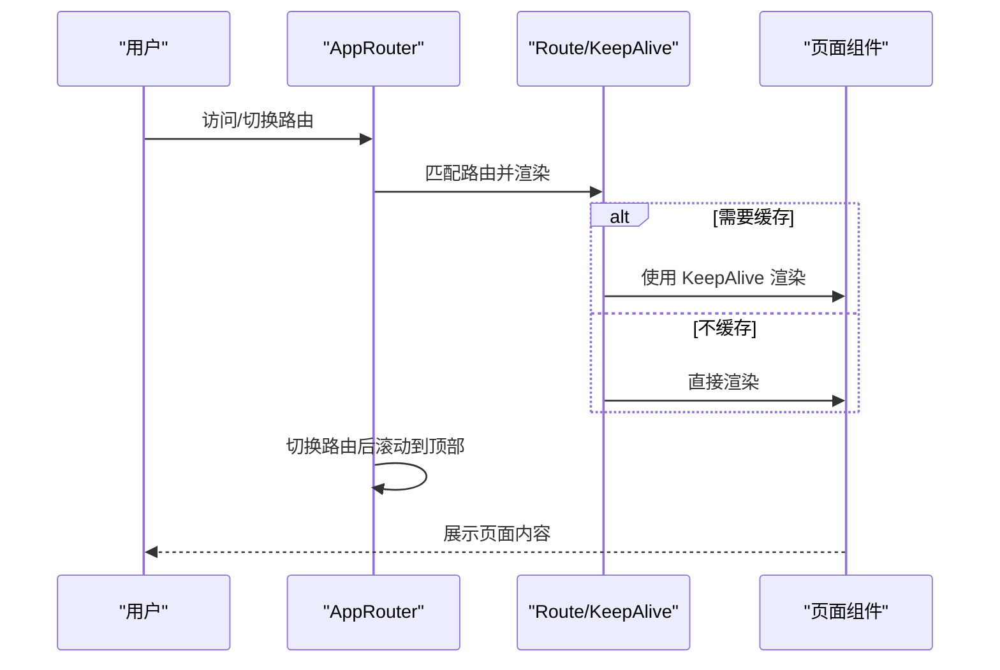
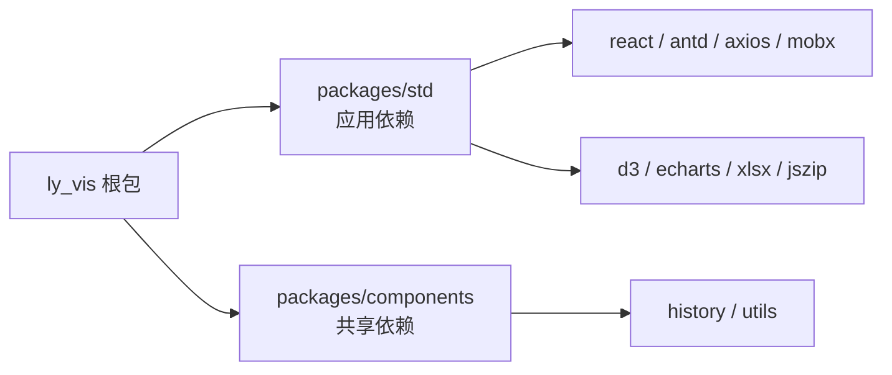

# 可视化前端

<cite>
**本文引用的文件**
- [ly_vis/package.json](file://ly_vis/package.json)
- [ly_vis/lerna.json](file://ly_vis/lerna.json)
- [ly_vis/packages/std/package.json](file://ly_vis/packages/std/package.json)
- [ly_vis/packages/components/package.json](file://ly_vis/packages/components/package.json)
- [ly_vis/packages/std/src/index.jsx](file://ly_vis/packages/std/src/index.jsx)
- [ly_vis/packages/std/src/router.jsx](file://ly_vis/packages/std/src/router.jsx)
</cite>

## 目录
1. [简介](#简介)
2. [项目结构](#项目结构)
3. [核心组件](#核心组件)
4. [架构总览](#架构总览)
5. [详细组件分析](#详细组件分析)
6. [依赖分析](#依赖分析)
7. [性能考虑](#性能考虑)
8. [故障排查指南](#故障排查指南)
9. [结论](#结论)
10. [附录](#附录)

## 简介
本文件为 SOC 可视化前端（ly_vis）的开发文档，聚焦 React + TypeScript 工程、MobX 状态管理、API 服务封装与图表集成。文档覆盖安全态势仪表盘、事件管理界面、配置管理界面的功能与实现要点，并提供 UI 组件使用、样式定制、响应式设计与构建部署流程等最佳实践。

## 项目结构
本项目采用 Lerna + Yarn Workspaces 的多包架构：
- 根包 ly_vis：统一脚本、工作区配置与公共依赖
- packages/std：应用主体（React 16 + antd + d3/echarts + mobx），包含路由、页面、组件、服务、样式与工具
- packages/components：共享组件库与工具（如 history、通用方法）

图示来源
- [ly_vis/lerna.json:1-9](file://ly_vis/lerna.json#L1-L9)
- [ly_vis/packages/std/package.json:1-45](file://ly_vis/packages/std/package.json#L1-L45)
- [ly_vis/packages/components/package.json:1-8](file://ly_vis/packages/components/package.json#L1-L8)

章节来源
- [ly_vis/lerna.json:1-9](file://ly_vis/lerna.json#L1-L9)
- [ly_vis/package.json:1-127](file://ly_vis/package.json#L1-L127)
- [ly_vis/packages/std/package.json:1-45](file://ly_vis/packages/std/package.json#L1-L45)
- [ly_vis/packages/components/package.json:1-8](file://ly_vis/packages/components/package.json#L1-L8)

## 核心组件
- 应用入口与初始化
  - 入口文件负责挂载 React 应用、配置消息提示上限、引入国际化与全局样式，并启动路由。
- 路由与国际化
  - 基于 react-router-dom 的 Switch/Route 组合，支持嵌套路由、重定向与滚动置顶。
  - 通过 antd ConfigProvider 注入语言包，支持从 URL 参数切换语言。
  - 使用 react-activation 的 KeepAlive 对页面进行缓存，提升交互体验。
- 共享历史与工具
  - 使用 @shadowflow/components/history 作为统一 history 实例，便于跨包复用。
  - 通过 @shadowflow/components/utils 提供通用方法（如 URL 参数解析）。

章节来源
- [ly_vis/packages/std/src/index.jsx:1-20](file://ly_vis/packages/std/src/index.jsx#L1-L20)
- [ly_vis/packages/std/src/router.jsx:1-137](file://ly_vis/packages/std/src/router.jsx#L1-L137)

## 架构总览
整体采用“多包 + 单应用”模式：
- 应用层（std）：React 16 + antd 4 + d3/echarts + mobx + i18n + axios
- 组件层（components）：可复用的 UI 组件、history、通用工具
- 数据层：MobX Store 管理全局状态；axios 封装 API 调用；图表使用 d3/echarts
- 路由层：react-router-dom + KeepAlive 页面缓存 + 国际化动态切换

图示来源
- [ly_vis/packages/std/src/router.jsx:1-137](file://ly_vis/packages/std/src/router.jsx#L1-L137)
- [ly_vis/packages/std/src/index.jsx:1-20](file://ly_vis/packages/std/src/index.jsx#L1-L20)
- [ly_vis/packages/components/package.json:1-8](file://ly_vis/packages/components/package.json#L1-L8)

## 详细组件分析

### 路由与页面缓存（AppRouter）
- 功能要点
  - 基于 react-router-dom 的 Router/Switch/Route 组合，支持嵌套路由与重定向。
  - 通过 KeepAlive 对页面进行缓存，避免重复渲染，提升性能。
  - 每次路由切换后自动滚动到顶部，改善用户体验。
  - 通过 URL 参数 language 切换 antd 语言包，实现国际化。
- 关键流程
  - 入口渲染 AppRouter -> 创建路由树 -> 根据 notKeepAlive 决定是否缓存 -> 切换路由时滚动置顶。

图示来源
- [ly_vis/packages/std/src/router.jsx:50-107](file://ly_vis/packages/std/src/router.jsx#L50-L107)
- [ly_vis/packages/std/src/router.jsx:115-133](file://ly_vis/packages/std/src/router.jsx#L115-L133)

章节来源
- [ly_vis/packages/std/src/router.jsx:1-137](file://ly_vis/packages/std/src/router.jsx#L1-L137)

### 国际化与主题
- 通过 antd ConfigProvider 注入语言包，支持 zh/en。
- 语言来源：URL 参数 language，默认中文。
- 配合 antd 组件库实现一致的国际化文案与日期格式。

章节来源
- [ly_vis/packages/std/src/router.jsx:21-34](file://ly_vis/packages/std/src/router.jsx#L21-L34)

### 页面组织与核心页面
- 页面目录结构
  - page/overview：安全态势仪表盘（聚合指标、趋势图、告警分布等）
  - page/event：事件管理（列表、筛选、详情、导出）
  - page/config：配置管理（策略、规则、白名单等）
  - page/login：登录页
  - page/search：高级搜索
  - page/track：追踪溯源
  - page/result：结果页
  - page/404：未找到页
- 建议实现要点
  - 使用 antd ProTable/Ant Design Table 承载表格数据，结合 MobX Store 驱动刷新。
  - 使用 d3/echarts 绘制图表，按需懒加载以减少首屏体积。
  - 表单统一使用 antd Form，结合校验规则与提交回调。

章节来源
- [ly_vis/packages/std/src/page/**](file://ly_vis/packages/std/src/page)

### 组件库与业务组件
- 共享组件（@shadowflow/components）
  - 提供 history、通用方法等基础能力，供 std 应用引用。
- 业务组件（std/src/components）
  - chart：图表封装（折线、柱状、桑基图等）
  - table-event：事件表格封装（分页、筛选、导出）
  - form-*：各类表单封装（事件、搜索、配置等）
  - modals：通用弹窗
  - tree-matrix：树形矩阵视图（资产/拓扑）
- 使用建议
  - 优先复用共享组件，减少重复代码。
  - 业务组件内部状态尽量下沉至 Store，保持组件纯展示。

章节来源
- [ly_vis/packages/components/package.json:1-8](file://ly_vis/packages/components/package.json#L1-L8)
- [ly_vis/packages/std/src/components/**](file://ly_vis/packages/std/src/components)

### 状态管理（MobX）
- 使用模式
  - 将页面级或模块级数据放入 Store，使用 observable 声明状态，action 修改状态，computed 派生数据。
  - 在组件中使用 observer 包裹，自动订阅 Store 变化并触发重渲染。
  - 结合路由切换与 KeepAlive，合理释放与重建 Store，避免内存泄漏。
- 典型场景
  - 仪表盘：聚合指标、时间范围、筛选条件
  - 事件管理：列表数据、分页、排序、筛选、选中项
  - 配置管理：配置项、校验结果、保存状态
- 最佳实践
  - 单一职责：每个 Store 对应一个业务域
  - 不可变更新：使用 immer 或结构化更新，避免深层对象拷贝
  - 异步处理：在 action 中发起请求，成功后再更新状态
  - 错误处理：统一捕获异常，设置错误态并提示用户

章节来源
- [ly_vis/package.json:62-63](file://ly_vis/package.json#L62-L63)

### API 服务封装
- 技术选型
  - axios 作为 HTTP 客户端，统一拦截器处理鉴权、错误码、重试与超时。
- 设计要点
  - 按模块划分 service 文件（如 eventService、configService、overviewService）
  - 定义统一的请求/响应类型，便于 TypeScript 类型推导
  - 封装分页、查询参数序列化、文件下载等通用逻辑
- 与状态联动
  - Store 中调用 service，更新 loading、data、error 等状态
  - 失败时通过 antd message 提示，成功时触发必要副作用（如刷新列表）

章节来源
- [ly_vis/package.json:44-45](file://ly_vis/package.json#L44-L45)
- [ly_vis/packages/std/src/service/**](file://ly_vis/packages/std/src/service)

### 图表组件集成
- 技术选型
  - d3：灵活的数据可视化（力导向图、桑基图、自定义图形）
  - echarts：开箱即用的统计图表（折线、柱状、地图、热力图）
- 集成方式
  - 在业务组件中按需引入图表库，避免首屏过大
  - 使用 ref 获取容器尺寸，监听窗口 resize 自适应
  - 将 Store 中的数据映射为图表所需数据结构
- 性能优化
  - 大数据量时使用虚拟滚动或采样
  - 图表实例复用，避免频繁销毁重建
  - 使用 requestAnimationFrame 或节流优化渲染

章节来源
- [ly_vis/package.json:47-50](file://ly_vis/package.json#L47-L50)
- [ly_vis/packages/std/package.json:10-11](file://ly_vis/packages/std/package.json#L10-L11)
- [ly_vis/packages/std/src/components/chart/**](file://ly_vis/packages/std/src/components/chart)

### UI 组件使用指南与样式定制
- 组件库
  - antd 4：按钮、表单、表格、抽屉、Modal、Tabs 等
  - @ant-design/pro-table：高级表格（列配置、筛选、分页、导出）
- 样式定制
  - 使用 Less 变量覆盖 antd 主题色、字号、圆角等
  - 通过 CSS Modules 或 styled-components 隔离局部样式
  - 全局样式集中在 style/index.less，组件样式就近维护
- 响应式设计
  - 使用 antd Grid 栅格与断点适配不同屏幕
  - 图表与表格在小屏下启用横向滚动或折叠列
  - 移动端优先的交互设计（触摸友好、简化操作）

章节来源
- [ly_vis/package.json:37-44](file://ly_vis/package.json#L37-L44)
- [ly_vis/packages/std/src/style/**](file://ly_vis/packages/std/src/style)

### 构建与部署
- 开发脚本
  - start：本地开发（dev 环境）
  - start:mock：本地开发（mock 环境）
  - build：生产构建
  - test：单元测试
  - lint/format/style：代码规范检查与格式化
  - deploy：部署脚本
  - analyze：打包体积分析
- 构建工具
  - react-scripts + react-app-rewired 扩展 CRA 配置
  - lerna + yarn workspaces 管理多包
- 部署建议
  - 产物静态化，CDN 加速
  - 环境变量区分 dev/staging/prod
  - 开启 gzip 与浏览器缓存策略

章节来源
- [ly_vis/packages/std/package.json:18-30](file://ly_vis/packages/std/package.json#L18-L30)
- [ly_vis/lerna.json:1-9](file://ly_vis/lerna.json#L1-L9)

## 依赖分析
- 运行时依赖
  - React 16、antd 4、axios、mobx/mobx-react、i18next/react-i18next、moment、d3/echarts、xlsx/jszip/html2canvas 等
- 开发依赖
  - typescript、eslint、prettier、stylelint、husky、commitlint、lerna、standard-version 等
- 工作区与版本
  - 使用 yarn workspaces 与 lerna 独立版本管理

图示来源
- [ly_vis/package.json:36-79](file://ly_vis/package.json#L36-L79)
- [ly_vis/packages/std/package.json:6-16](file://ly_vis/packages/std/package.json#L6-L16)
- [ly_vis/lerna.json:1-9](file://ly_vis/lerna.json#L1-L9)

章节来源
- [ly_vis/package.json:36-107](file://ly_vis/package.json#L36-L107)
- [ly_vis/packages/std/package.json:6-43](file://ly_vis/packages/std/package.json#L6-L43)
- [ly_vis/lerna.json:1-9](file://ly_vis/lerna.json#L1-L9)

## 性能考虑
- 首屏优化
  - 按需引入大体积库（d3/echarts）
  - 路由级代码分割与懒加载
  - 图片与资源压缩与 CDN 分发
- 运行时优化
  - 合理使用 KeepAlive 缓存页面，减少重复渲染
  - 表格虚拟化与分页，避免一次性渲染大量数据
  - 图表数据采样与增量更新
- 网络优化
  - 请求合并与去抖
  - 错误重试与超时控制
  - 接口缓存与预取

[本节为通用指导，无需具体文件来源]

## 故障排查指南
- 常见问题
  - 路由跳转后未滚动到顶部：确认 ScrollToTop 是否生效
  - 页面切换丢失状态：检查 KeepAlive 的 id/name 是否正确
  - 国际化未生效：确认 URL 参数 language 与 ConfigProvider locale 映射
  - 图表不显示：检查容器尺寸与 ref 获取时机
  - 请求失败：检查拦截器错误处理与后端返回码
- 调试建议
  - 使用浏览器开发者工具 Network/Performance 面板定位问题
  - 使用 source-map-explorer 分析包体积
  - 通过 console.log 与断点逐步排查

章节来源
- [ly_vis/packages/std/src/router.jsx:115-123](file://ly_vis/packages/std/src/router.jsx#L115-L123)
- [ly_vis/packages/std/src/router.jsx:21-34](file://ly_vis/packages/std/src/router.jsx#L21-L34)
- [ly_vis/package.json:77](file://ly_vis/package.json#L77)

## 结论
本项目以 Lerna + Workspaces 构建多包架构，std 应用基于 React 16 + antd + MobX + d3/echarts，实现了安全态势仪表盘、事件管理与配置管理等核心页面。通过 KeepAlive 与路由优化提升体验，借助统一的服务封装与状态管理保证可维护性。建议持续完善组件库与工具链，强化测试与监控，保障长期演进质量。

[本节为总结性内容，无需具体文件来源]

## 附录
- 快速开始
  - 安装依赖：yarn install
  - 启动开发：cd packages/std && yarn start
  - 构建产物：cd packages/std && yarn build
- 代码规范
  - ESLint + Prettier + Stylelint 统一风格
  - Husky + Commitlint 规范提交信息
- 发布流程
  - standard-version 管理版本与变更日志
  - 部署脚本自动化发布

章节来源
- [ly_vis/packages/std/package.json:18-30](file://ly_vis/packages/std/package.json#L18-L30)
- [ly_vis/package.json:11-35](file://ly_vis/package.json#L11-L35)