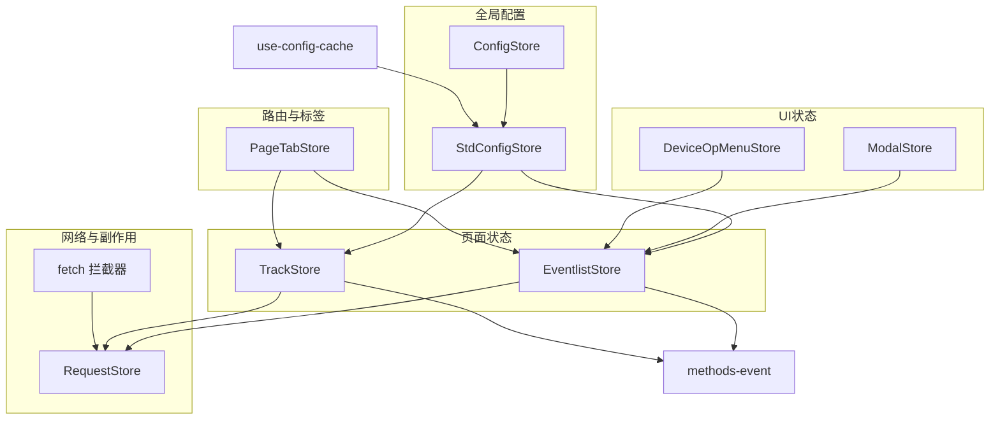
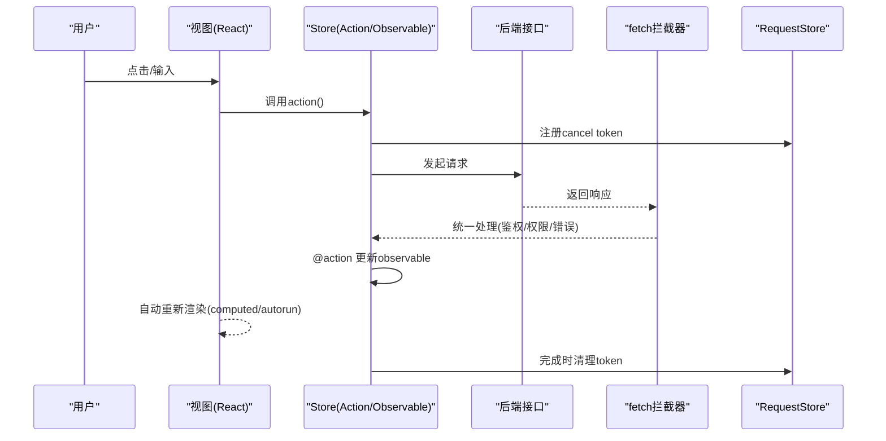
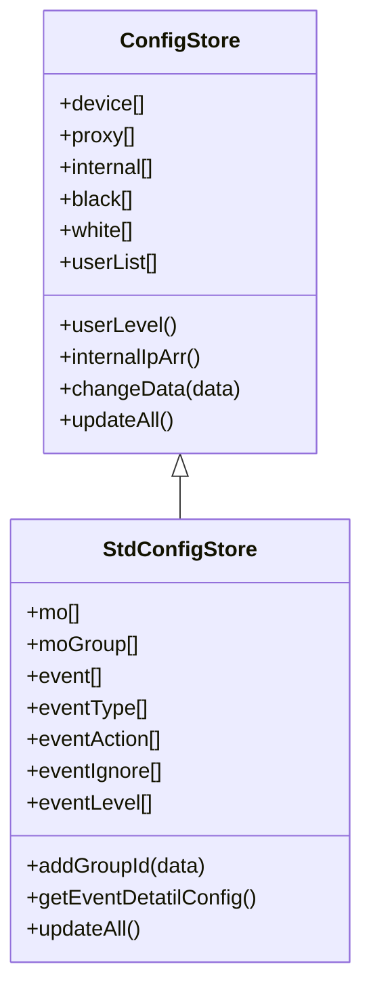
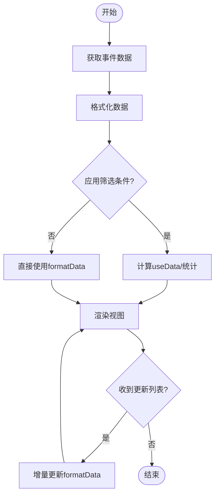
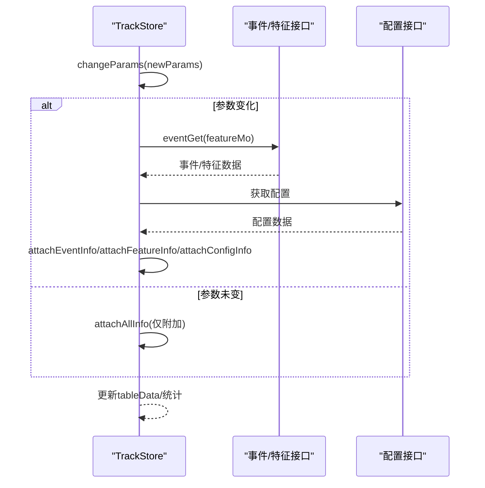
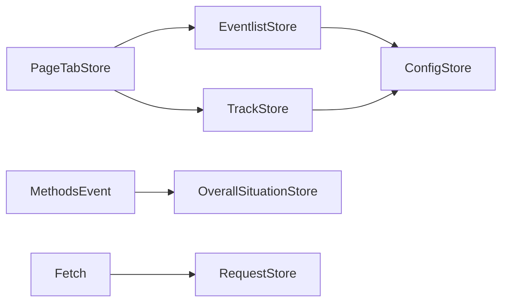

# 状态管理

<cite>
**本文引用的文件**
- [config-store/store.js](file://ly_vis/packages/components/config-store/store.js)
- [std/layout/components/config/store.js](file://ly_vis/packages/std/src/layout/components/config/store.js)
- [std/service/store.js](file://ly_vis/packages/std/src/service/store.js)
- [std/page/event/page-child/event-list/store.js](file://ly_vis/packages/std/src/page/event/page-child/event-list/store.js)
- [std/page/track/store.js](file://ly_vis/packages/std/src/page/track/store.js)
- [std/layout/components/page-tab/store.js](file://ly_vis/packages/std/src/layout/components/page-tab/store.js)
- [std/layout/components/overall-situation/store.js](file://ly_vis/packages/std/src/layout/components/overall-situation/store.js)
- [components/ui/modal/modal-user-edit/store.js](file://ly_vis/packages/components/ui/modal/modal-user-edit/store.js)
- [components/ui/table/device-op-menu-template/store.js](file://ly_vis/packages/components/ui/table/device-op-menu-template/store.js)
- [components/form/hooks/use-config-cache.js](file://ly_vis/packages/components/ui/form/form-components/hooks/use-config-cache.js)
- [std/utils/methods-event.js](file://ly_vis/packages/std/src/utils/methods-event.js)
- [std/service/fetch.js](file://ly_vis/packages/std/src/service/fetch.js)
</cite>

## 目录
1. [简介](#简介)
2. [项目结构](#项目结构)
3. [核心组件](#核心组件)
4. [架构总览](#架构总览)
5. [详细组件分析](#详细组件分析)
6. [依赖关系分析](#依赖关系分析)
7. [性能与优化](#性能与优化)
8. [故障排查指南](#故障排查指南)
9. [结论](#结论)
10. [附录：最佳实践与示例](#附录最佳实践与示例)

## 简介
本文件面向 MobX 状态管理，系统化梳理 ly_vis 前端的状态组织、数据流模式、异步处理、缓存与持久化、调试与监控、内存优化、错误处理与单元测试方法，并给出可操作的实践建议与常见问题解决方案。整体采用“领域 Store + 全局配置 Store + 请求/副作用集中管理”的分层设计，通过 observable/action/computed/reaction 实现响应式更新与副作用解耦。

## 项目结构
- 全局配置与权限：基于 ConfigStore（基础）与 StdConfigStore（业务扩展），统一管理设备、代理、黑白名单、用户、MO/MOGroup、事件配置等。
- 页面级 Store：event-list、track 等页面各自维护查询参数、筛选条件、本地计算结果与视图数据。
- 路由与标签页：PageTabStore 管理多标签页状态与导航行为。
- 通用 UI Store：Modal、DeviceOpMenu 等组件级 Store 管理弹窗、菜单等交互态。
- 请求与副作用：RequestStore 统一取消重复请求；fetch 拦截器集中处理鉴权、权限与跳转。
- 工具与缓存：use-config-cache 提供基于 MobXProviderContext 的缓存访问能力。

图表来源
- [config-store/store.js:1-72](file://ly_vis/packages/components/config-store/store.js#L1-L72)
- [std/layout/components/config/store.js:1-150](file://ly_vis/packages/std/src/layout/components/config/store.js#L1-L150)
- [std/page/event/page-child/event-list/store.js:1-156](file://ly_vis/packages/std/src/page/event/page-child/event-list/store.js#L1-L156)
- [std/page/track/store.js:1-332](file://ly_vis/packages/std/src/page/track/store.js#L1-L332)
- [std/layout/components/page-tab/store.js:1-272](file://ly_vis/packages/std/src/layout/components/page-tab/store.js#L1-L272)
- [components/ui/modal/modal-user-edit/store.js:1-25](file://ly_vis/packages/components/ui/modal/modal-user-edit/store.js#L1-L25)
- [components/ui/table/device-op-menu-template/store.js:34-53](file://ly_vis/packages/components/ui/table/device-op-menu-template/store.js#L34-L53)
- [components/form/hooks/use-config-cache.js:1-13](file://ly_vis/packages/components/ui/form/form-components/hooks/use-config-cache.js#L1-L13)
- [std/service/store.js:1-21](file://ly_vis/packages/std/src/service/store.js#L1-L21)
- [std/service/fetch.js:32-73](file://ly_vis/packages/std/src/service/fetch.js#L32-L73)
- [std/utils/methods-event.js:179-223](file://ly_vis/packages/std/src/utils/methods-event.js#L179-L223)

章节来源
- [config-store/store.js:1-72](file://ly_vis/packages/components/config-store/store.js#L1-L72)
- [std/layout/components/config/store.js:1-150](file://ly_vis/packages/std/src/layout/components/config/store.js#L1-L150)
- [std/page/event/page-child/event-list/store.js:1-156](file://ly_vis/packages/std/src/page/event/page-child/event-list/store.js#L1-L156)
- [std/page/track/store.js:1-332](file://ly_vis/packages/std/src/page/track/store.js#L1-L332)
- [std/layout/components/page-tab/store.js:1-272](file://ly_vis/packages/std/src/layout/components/page-tab/store.js#L1-L272)
- [components/ui/modal/modal-user-edit/store.js:1-25](file://ly_vis/packages/components/ui/modal/modal-user-edit/store.js#L1-L25)
- [components/ui/table/device-op-menu-template/store.js:34-53](file://ly_vis/packages/components/ui/table/device-op-menu-template/store.js#L34-L53)
- [components/form/hooks/use-config-cache.js:1-13](file://ly_vis/packages/components/ui/form/form-components/hooks/use-config-cache.js#L1-L13)
- [std/service/store.js:1-21](file://ly_vis/packages/std/src/service/store.js#L1-L21)
- [std/service/fetch.js:32-73](file://ly_vis/packages/std/src/service/fetch.js#L32-L73)
- [std/utils/methods-event.js:179-223](file://ly_vis/packages/std/src/utils/methods-event.js#L179-L223)

## 核心组件
- 全局配置 Store（ConfigStore/StdConfigStore）
  - 职责：聚合系统配置数据（设备、代理、内网、黑白名单、用户、MO/MOGroup、事件配置等），提供排序、派生属性（如 userLevel）、跨域副作用（window.internalIp/window.device）。
  - 关键机制：@observable/@computed/@action.bound/@reaction；updateAll 并发拉取配置；changeData 对数据进行标准化与排序。
- 页面 Store（EventlistStore/TrackStore）
  - 职责：封装查询参数、筛选条件、数据获取、数据格式化与统计计算；通过 computed 派生视图数据；通过 action 触发副作用（如批量处理事件）。
- 路由与标签页 Store（PageTabStore）
  - 职责：维护多标签页列表、激活态、新增/删除/选择逻辑；与路由跳转联动。
- UI 组件 Store（ModalStore/DeviceOpMenuStore）
  - 职责：管理弹窗可见性、加载态、菜单位置与生命周期；使用 autorun 绑定 DOM 事件。
- 请求与副作用（RequestStore/fetch）
  - 职责：统一取消未完成的请求；集中处理鉴权、权限、错误提示与路由跳转。
- 缓存 Hook（use-config-cache）
  - 职责：从 MobXProviderContext 中读取 configStore 指定缓存项，供表单等组件复用。

章节来源
- [config-store/store.js:1-72](file://ly_vis/packages/components/config-store/store.js#L1-L72)
- [std/layout/components/config/store.js:1-150](file://ly_vis/packages/std/src/layout/components/config/store.js#L1-L150)
- [std/page/event/page-child/event-list/store.js:1-156](file://ly_vis/packages/std/src/page/event/page-child/event-list/store.js#L1-L156)
- [std/page/track/store.js:1-332](file://ly_vis/packages/std/src/page/track/store.js#L1-L332)
- [std/layout/components/page-tab/store.js:1-272](file://ly_vis/packages/std/src/layout/components/page-tab/store.js#L1-L272)
- [components/ui/modal/modal-user-edit/store.js:1-25](file://ly_vis/packages/components/ui/modal/modal-user-edit/store.js#L1-L25)
- [components/ui/table/device-op-menu-template/store.js:34-53](file://ly_vis/packages/components/ui/table/device-op-menu-template/store.js#L34-L53)
- [std/service/store.js:1-21](file://ly_vis/packages/std/src/service/store.js#L1-L21)
- [std/service/fetch.js:32-73](file://ly-vis/packages/std/src/service/fetch.js#L32-L73)
- [components/form/hooks/use-config-cache.js:1-13](file://ly_vis/packages/components/ui/form/form-components/hooks/use-config-cache.js#L1-L13)

## 架构总览
MobX 驱动的数据流遵循“单向数据流 + 响应式更新”的模式：
- 视图订阅 observable 状态，自动重渲染。
- 用户操作触发 action，修改状态或发起副作用。
- 通过 computed 派生只读视图数据，避免重复计算。
- 通过 reaction 监听状态变化执行副作用（如同步到 window、刷新关联数据）。
- 网络请求在 Store 或工具函数中发起，统一由 fetch 拦截器处理错误与鉴权。

图表来源
- [std/page/event/page-child/event-list/store.js:21-27](file://ly_vis/packages/std/src/page/event/page-child/event-list/store.js#L21-L27)
- [std/page/track/store.js:32-47](file://ly_vis/packages/std/src/page/track/store.js#L32-L47)
- [std/service/fetch.js:32-73](file://ly_vis/packages/std/src/service/fetch.js#L32-L73)
- [std/service/store.js:1-21](file://ly_vis/packages/std/src/service/store.js#L1-L21)

## 详细组件分析

### 全局配置 Store（ConfigStore / StdConfigStore）
- 设计要点
  - 继承关系：StdConfigStore 扩展 ConfigStore，增加 mo/moGroup/event 相关字段与联动逻辑。
  - 数据标准化：changeData 对所有数组进行排序，保证稳定渲染顺序。
  - 派生属性：userLevel 根据 userList 计算当前用户权限，并写入全局存储。
  - 副作用：reaction 将 internal/device 同步到 window，便于非 React 环境使用。
  - 并发拉取：updateAll 并行请求所有配置项，合并后一次性写入 store。
  - 联动更新：moGroup 变化时自动拉取 mo 并更新，保持数据一致性。

图表来源
- [config-store/store.js:1-72](file://ly_vis/packages/components/config-store/store.js#L1-L72)
- [std/layout/components/config/store.js:1-150](file://ly_vis/packages/std/src/layout/components/config/store.js#L1-L150)

章节来源
- [config-store/store.js:1-72](file://ly_vis/packages/components/config-store/store.js#L1-L72)
- [std/layout/components/config/store.js:1-150](file://ly_vis/packages/std/src/layout/components/config/store.js#L1-L150)

### 事件列表 Store（EventlistStore）
- 职责
  - 数据获取：start/getEventData 获取事件数据并格式化。
  - 筛选：filterCondition 与 useData computed 组合实现复杂过滤（IP/端口/协议/设备匹配）。
  - 统计：attackDeviceData/victimDeviceData/classifyData 派生图表数据。
  - 批处理：changeProcessed 接收后端更新列表，增量更新本地格式数据。

图表来源
- [std/page/event/page-child/event-list/store.js:21-27](file://ly_vis/packages/std/src/page/event/page-child/event-list/store.js#L21-L27)
- [std/page/event/page-child/event-list/store.js:52-115](file://ly_vis/packages/std/src/page/event/page-child/event-list/store.js#L52-L115)
- [std/page/event/page-child/event-list/store.js:129-141](file://ly_vis/packages/std/src/page/event/page-child/event-list/store.js#L129-L141)
- [std/page/event/page-child/event-list/store.js:152-154](file://ly_vis/packages/std/src/page/event/page-child/event-list/store.js#L152-L154)

章节来源
- [std/page/event/page-child/event-list/store.js:1-156](file://ly_vis/packages/std/src/page/event/page-child/event-list/store.js#L1-L156)

### 追踪 Store（TrackStore）
- 职责
  - 参数管理：params/isParamsChange 控制是否重新拉取数据。
  - 数据聚合：并行获取事件与特征数据，附加配置信息，生成统计指标。
  - 视图派生：tableData 基于 filterCondition 过滤与排序。
  - 副作用：attachEventInfo/attachFeatureInfo/attachConfigInfo 将原始数据组装为展示友好结构。

图表来源
- [std/page/track/store.js:115-135](file://ly_vis/packages/std/src/page/track/store.js#L115-L135)
- [std/page/track/store.js:168-245](file://ly_vis/packages/std/src/page/track/store.js#L168-L245)
- [std/page/track/store.js:296-324](file://ly_vis/packages/std/src/page/track/store.js#L296-L324)

章节来源
- [std/page/track/store.js:1-332](file://ly_vis/packages/std/src/page/track/store.js#L1-L332)

### 路由与标签页 Store（PageTabStore）
- 职责
  - 维护 pageTagList 层级结构与 active 状态。
  - 支持 POP/PUSH/REPLACE 多种导航场景，处理重复跳转与快速导航。
  - 提供增删改查方法，并与 skipPage 路由跳转联动。

章节来源
- [std/layout/components/page-tab/store.js:1-272](file://ly_vis/packages/std/src/layout/components/page-tab/store.js#L1-L272)

### UI 组件 Store（ModalStore / DeviceOpMenuStore）
- ModalStore：管理弹窗可见性与 loading 状态，提供 onOpen/onClose/openLoading/closeLoading。
- DeviceOpMenuStore：管理菜单可见性与位置，使用 autorun 动态绑定/解绑 document click 事件。

章节来源
- [components/ui/modal/modal-user-edit/store.js:1-25](file://ly_vis/packages/components/ui/modal/modal-user-edit/store.js#L1-L25)
- [components/ui/table/device-op-menu-template/store.js:34-53](file://ly_vis/packages/components/ui/table/device-op-menu-template/store.js#L34-L53)

### 请求与副作用（RequestStore / fetch）
- RequestStore：集中管理 cancel token，支持批量取消与 tooltip 相关取消。
- fetch 拦截器：统一处理 3xx/306 权限码、登录态丢失跳转、失败提示，并在特定操作后触发状态更新。

章节来源
- [std/service/store.js:1-21](file://ly_vis/packages/std/src/service/store.js#L1-L21)
- [std/service/fetch.js:32-73](file://ly_vis/packages/std/src/service/fetch.js#L32-L73)

### 缓存 Hook（use-config-cache）
- 从 MobXProviderContext 中读取 configStore 指定缓存项，供表单等组件复用配置数据，减少重复请求与耦合。

章节来源
- [components/form/hooks/use-config-cache.js:1-13](file://ly_vis/packages/components/ui/form/form-components/hooks/use-config-cache.js#L1-L13)

## 依赖关系分析
- 低耦合高内聚：每个 Store 聚焦单一领域，通过 observable/action/computed 暴露最小接口。
- 依赖方向：
  - 页面 Store 依赖全局配置 Store（读取 mo/moGroup 等）。
  - 工具函数 methods-event 依赖全局状态（如 overallSituationStore）以触发界面更新。
  - fetch 拦截器依赖 RequestStore 做请求生命周期管理。
- 潜在循环依赖：目前未见直接循环引用；注意避免在 reaction 中再次触发同一 observable 导致无限循环。

图表来源
- [std/page/event/page-child/event-list/store.js:1-156](file://ly_vis/packages/std/src/page/event/page-child/event-list/store.js#L1-L156)
- [std/page/track/store.js:1-332](file://ly_vis/packages/std/src/page/track/store.js#L1-L332)
- [std/utils/methods-event.js:179-223](file://ly_vis/packages/std/src/utils/methods-event.js#L179-L223)
- [std/service/store.js:1-21](file://ly_vis/packages/std/src/service/store.js#L1-L21)
- [std/layout/components/page-tab/store.js:1-272](file://ly_vis/packages/std/src/layout/components/page-tab/store.js#L1-L272)

章节来源
- [std/page/event/page-child/event-list/store.js:1-156](file://ly_vis/packages/std/src/page/event/page-child/event-list/store.js#L1-L156)
- [std/page/track/store.js:1-332](file://ly_vis/packages/std/src/page/track/store.js#L1-L332)
- [std/utils/methods-event.js:179-223](file://ly_vis/packages/std/src/utils/methods-event.js#L179-L223)
- [std/service/store.js:1-21](file://ly_vis/packages/std/src/service/store.js#L1-L21)
- [std/layout/components/page-tab/store.js:1-272](file://ly_vis/packages/std/src/layout/components/page-tab/store.js#L1-L272)

## 性能与优化
- 计算优化
  - 使用 @computed 派生视图数据（如 useData、tableData、统计指标），避免重复计算。
  - 对大数据集进行分片/分页与按需渲染（例如 track 表格排序与过滤）。
- 副作用优化
  - 使用 reaction 仅在依赖变化时执行副作用（如 moGroup 变化时刷新 mo）。
  - 使用 autorun 管理 DOM 事件绑定/解绑，防止内存泄漏。
- 网络优化
  - 并发请求：updateAll 使用 Promise.all 并行拉取配置，缩短首屏时间。
  - 请求去抖/节流：在频繁筛选场景下对 start/changeFilterCondition 做防抖。
  - 取消重复请求：利用 RequestStore 在路由切换或组件卸载时取消未完成请求。
- 渲染优化
  - 拆分大组件，减少不必要的 re-render。
  - 使用 useMemo/useCallback 缓存计算结果与回调（结合 Store 的 computed 使用）。
- 内存优化
  - 及时移除事件监听（如 device-op-menu 的 document click）。
  - 避免在 observable 中保存超大对象，必要时使用不可变更新策略。

[本节为通用指导，不直接分析具体文件]

## 故障排查指南
- 鉴权与权限
  - 现象：登录后仍被重定向至登录页或提示无权限。
  - 定位：检查 fetch 拦截器对 3xx/306 的处理逻辑与 RequestStore 取消行为。
  - 参考路径：[std/service/fetch.js:32-73](file://ly_vis/packages/std/src/service/fetch.js#L32-L73)
- 状态不同步
  - 现象：配置变更后界面未更新。
  - 定位：确认是否通过 action 修改 observable；检查 reaction 是否正确监听依赖。
  - 参考路径：[std/layout/components/config/store.js:133-146](file://ly_vis/packages/std/src/layout/components/config/store.js#L133-L146)
- 批量操作失败
  - 现象：批量处理事件部分成功部分失败。
  - 定位：查看 methods-event 中的 Promise.allSettled 处理与消息提示逻辑。
  - 参考路径：[std/utils/methods-event.js:200-223](file://ly_vis/packages/std/src/utils/methods-event.js#L200-L223)
- 弹窗/菜单异常
  - 现象：弹窗无法关闭或菜单点击无效。
  - 定位：检查 ModalStore/DeviceOpMenuStore 的 action 与 autorun 事件绑定。
  - 参考路径：[components/ui/modal/modal-user-edit/store.js:1-25](file://ly_vis/packages/components/ui/modal/modal-user-edit/store.js#L1-L25), [components/ui/table/device-op-menu-template/store.js:34-53](file://ly_vis/packages/components/ui/table/device-op-menu-template/store.js#L34-L53)

章节来源
- [std/service/fetch.js:32-73](file://ly_vis/packages/std/src/service/fetch.js#L32-L73)
- [std/layout/components/config/store.js:133-146](file://ly_vis/packages/std/src/layout/components/config/store.js#L133-L146)
- [std/utils/methods-event.js:200-223](file://ly_vis/packages/std/src/utils/methods-event.js#L200-L223)
- [components/ui/modal/modal-user-edit/store.js:1-25](file://ly_vis/packages/components/ui/modal/modal-user-edit/store.js#L1-L25)
- [components/ui/table/device-op-menu-template/store.js:34-53](file://ly_vis/packages/components/ui/table/device-op-menu-template/store.js#L34-L53)

## 结论
本项目采用 MobX 构建清晰、可扩展的前端状态管理方案：以全局配置 Store 为中心，页面 Store 负责领域数据与计算，UI Store 管理交互态，RequestStore 与 fetch 拦截器统一网络与副作用。通过 observable/action/computed/reaction 的组合，实现了高效、可维护且易于测试的状态流。配合合理的性能优化与错误处理策略，能够支撑复杂的安全运营可视化场景。

[本节为总结，不直接分析具体文件]

## 附录：最佳实践与示例

- 状态变更最佳实践
  - 始终通过 @action.bound 修改 observable，确保 MobX 能正确追踪变更。
  - 使用 @computed 派生只读数据，避免在组件中进行昂贵计算。
  - 使用 reaction 处理副作用，避免在 action 中直接操作 DOM 或发起过多网络请求。
  - 对大型列表使用分页与虚拟滚动，减少渲染压力。

- 异步数据处理
  - 在 Store 中封装 get* 方法，统一处理参数校验、请求与错误。
  - 使用 Promise.all 并发拉取无关数据，提升加载速度。
  - 在组件卸载或路由切换时取消未完成请求（RequestStore）。

- 缓存策略
  - 使用 use-config-cache 从全局 configStore 读取缓存，避免重复请求。
  - 对热点配置（如 mo/moGroup）进行本地缓存，必要时设置过期策略。

- 状态持久化
  - 将关键状态（如用户权限、语言、主题）持久化到 localStorage/sessionStorage。
  - 在应用启动时恢复状态，保证用户体验一致性。

- 状态调试工具
  - 使用 MobX DevTools 观察 observable 变化与 action 调用链。
  - 在开发环境开启 MobX 严格模式，捕获非法状态变更。

- 性能监控
  - 使用浏览器 Performance 面板分析重渲染与长任务。
  - 对关键 Store 添加计时埋点，评估 compute/action 耗时。

- 内存优化
  - 及时移除事件监听与定时器。
  - 避免在 observable 中持有大对象引用，必要时使用弱引用或分片存储。

- 错误处理
  - 在 fetch 拦截器统一处理鉴权、权限与失败提示。
  - 在 Store 中使用 try/catch 包裹异步操作，提供降级与回退逻辑。

- 单元测试方法
  - 使用 Jest + Testing Library 测试组件与 Store。
  - Mock 网络请求与外部依赖，验证 action 与 computed 的正确性。
  - 针对 reaction/autorun 编写断言，确保副作用按预期触发。

- 常见示例
  - 事件列表筛选与统计：见 EventlistStore 的 useData 与统计 computed。
  - 追踪数据聚合：见 TrackStore 的 attach* 方法与 tableData。
  - 配置联动更新：见 StdConfigStore 的 moGroup 变化时刷新 mo。

章节来源
- [std/page/event/page-child/event-list/store.js:52-115](file://ly_vis/packages/std/src/page/event/page-child/event-list/store.js#L52-L115)
- [std/page/track/store.js:168-245](file://ly_vis/packages/std/src/page/track/store.js#L168-L245)
- [std/layout/components/config/store.js:133-146](file://ly_vis/packages/std/src/layout/components/config/store.js#L133-L146)
- [components/form/hooks/use-config-cache.js:1-13](file://ly_vis/packages/components/ui/form/form-components/hooks/use-config-cache.js#L1-L13)
- [std/service/fetch.js:32-73](file://ly_vis/packages/std/src/service/fetch.js#L32-L73)