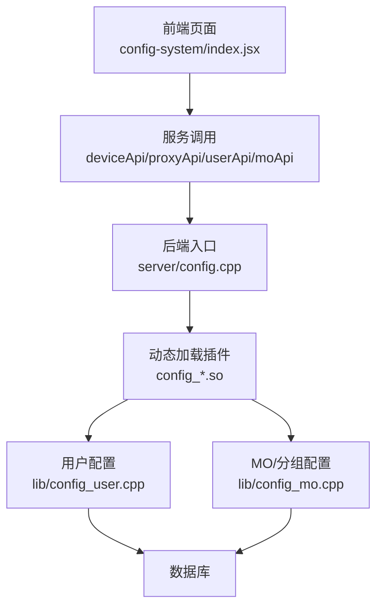
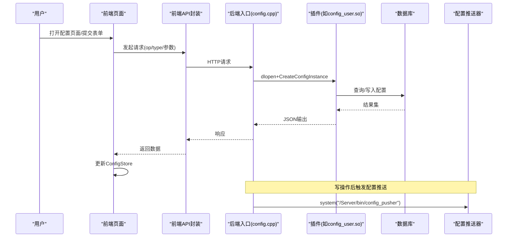
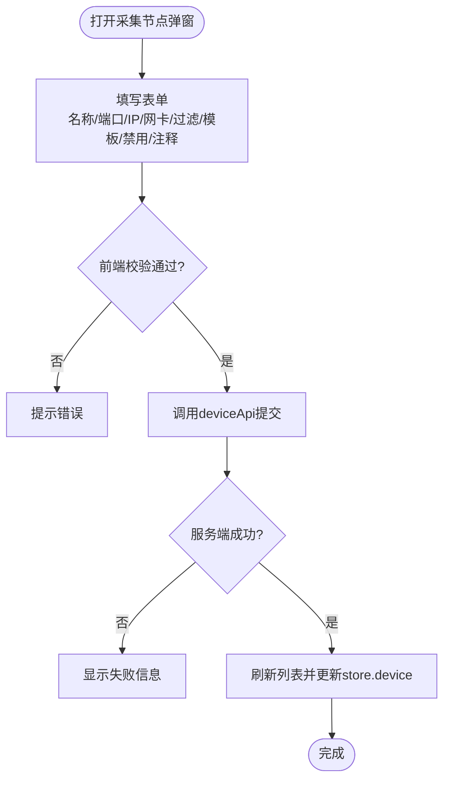
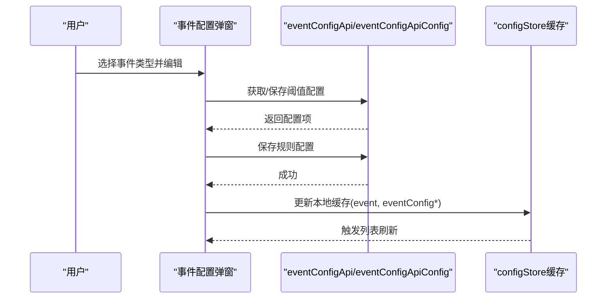
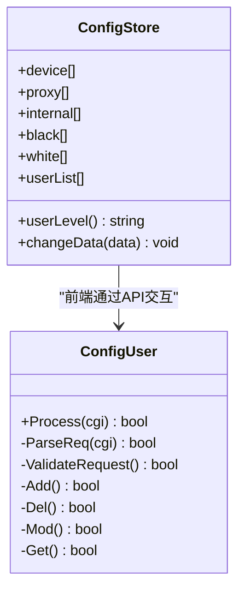
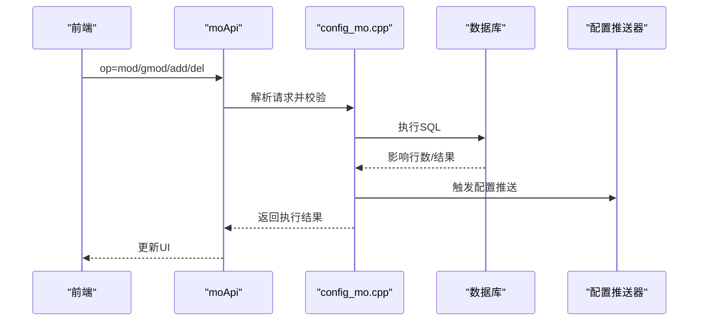
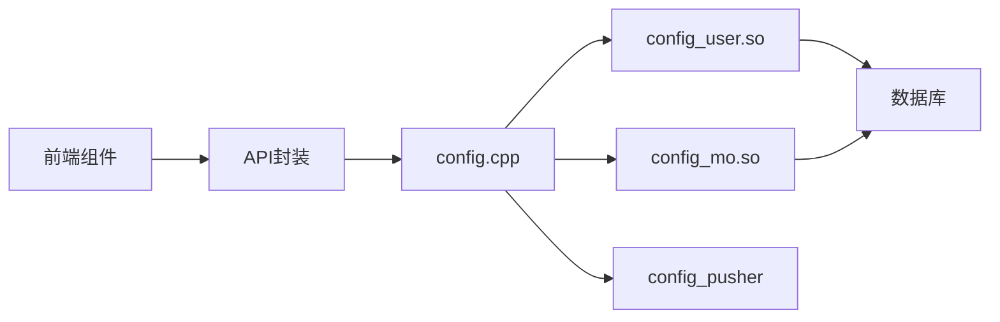

# 配置管理界面

<cite>
**本文引用的文件**
- [ly_server/src/server/config.cpp](file://ly_server/src/server/config.cpp)
- [ly_server/src/lib/config_user.cpp](file://ly_server/src/lib/config_user.cpp)
- [ly_server/src/lib/config_mo.cpp](file://ly_server/src/lib/config_mo.cpp)
- [ly_server/src/lib/config_device.proto](file://ly_server/src/lib/config_device.proto)
- [ly_vis/packages/components/ui/modal/modal-device/index.jsx](file://ly_vis/packages/components/ui/modal/modal-device/index.jsx)
- [ly_vis/packages/components/ui/modal/modal-config/index.jsx](file://ly_vis/packages/components/ui/modal/modal-config/index.jsx)
- [ly_vis/packages/components/ui/form/form-components/index.jsx](file://ly_vis/packages/components/ui/form/form-components/index.jsx)
- [ly_vis/packages/components/config-store/store.js](file://ly_vis/packages/components/config-store/store.js)
- [ly_vis/packages/std/src/page/config/page-child/config-system/index.jsx](file://ly_vis/packages/std/src/page/config/page-child/config-system/index.jsx)
- [ly_vis/packages/std/src/service/api/config-mo.js](file://ly_vis/packages/std/src/service/api/config-mo.js)
- [ly_vis/packages/std/doc/exportAndImport.md](file://ly_vis/packages/std/doc/exportAndImport.md)
</cite>

## 目录
1. [简介](#简介)
2. [项目结构](#项目结构)
3. [核心组件](#核心组件)
4. [架构总览](#架构总览)
5. [详细组件分析](#详细组件分析)
6. [依赖关系分析](#依赖关系分析)
7. [性能考虑](#性能考虑)
8. [故障排查指南](#故障排查指南)
9. [结论](#结论)
10. [附录](#附录)

## 简介
本文件面向“配置管理界面”的开发与维护，覆盖整体架构、数据管理模式、设备配置页面的表单验证与数据同步、策略配置（规则）的编辑与模板化、用户权限控制、配置审计与操作日志、以及配置的导入导出、备份恢复与冲突解决等。文档以代码为依据，提供可追溯的文件路径与行号，帮助读者快速定位实现细节。

## 项目结构
前端采用 React + MobX 的状态管理，通过统一的 Modal 表单封装与通用表单项组件完成配置录入；后端基于 Cgicc 动态加载 .so 插件处理不同配置类型，统一入口为 config.cpp，具体逻辑在 lib 下的各配置模块中实现。

图表来源
- [ly_vis/packages/std/src/page/config/page-child/config-system/index.jsx:290-386](file://ly_vis/packages/std/src/page/config/page-child/config-system/index.jsx#L290-L386)
- [ly_server/src/server/config.cpp:21-80](file://ly_server/src/server/config.cpp#L21-L80)
- [ly_server/src/lib/config_user.cpp:94-127](file://ly_server/src/lib/config_user.cpp#L94-L127)
- [ly_server/src/lib/config_mo.cpp:528-542](file://ly_server/src/lib/config_mo.cpp#L528-L542)

章节来源
- [ly_vis/packages/std/src/page/config/page-child/config-system/index.jsx:290-386](file://ly_vis/packages/std/src/page/config/page-child/config-system/index.jsx#L290-L386)
- [ly_server/src/server/config.cpp:21-80](file://ly_server/src/server/config.cpp#L21-L80)

## 核心组件
- 配置存储层：ConfigStore 集中维护 device、proxy、internal、userList 等全局状态，并提供 changeData 更新与 userLevel 计算。
- 表单与弹窗：AddConfigModal 统一封装多步骤表单，modal-device 定义采集节点字段与校验规则，form-components 提供通用输入控件。
- 后端路由与插件：config.cpp 根据 type 动态加载对应 .so，并分发到 ConfigUser/ConfigMo 等处理器。
- 数据模型：config_device.proto 定义设备消息结构；其他配置使用各自 proto 或内联结构。

章节来源
- [ly_vis/packages/components/config-store/store.js:6-72](file://ly_vis/packages/components/config-store/store.js#L6-L72)
- [ly_vis/packages/components/ui/modal/modal-config/index.jsx:1-41](file://ly_vis/packages/components/ui/modal/modal-config/index.jsx#L1-L41)
- [ly_vis/packages/components/ui/modal/modal-device/index.jsx:18-103](file://ly_vis/packages/components/ui/modal/modal-device/index.jsx#L18-L103)
- [ly_server/src/server/config.cpp:21-80](file://ly_server/src/server/config.cpp#L21-L80)
- [ly_server/src/lib/config_device.proto:1-16](file://ly_server/src/lib/config_device.proto#L1-L16)

## 架构总览
系统采用前后端分离，前端通过统一 API 调用后端配置接口；后端通过动态库机制按配置类型分派到具体处理器，执行增删改查后触发配置推送器进行下发。

图表来源
- [ly_server/src/server/config.cpp:21-80](file://ly_server/src/server/config.cpp#L21-L80)
- [ly_server/src/lib/config_user.cpp:94-127](file://ly_server/src/lib/config_user.cpp#L94-L127)
- [ly_server/src/lib/config_mo.cpp:479-516](file://ly_server/src/lib/config_mo.cpp#L479-L516)

## 详细组件分析

### 设备配置页面（采集节点）
- 表单字段与校验：名称必填、端口必填、IP可选、采集网卡/过滤/模板/禁用开关/注释等。
- 数据同步：提交成功后刷新列表并更新 ConfigStore 中的 device 数据。
- 版本控制：当前未实现显式版本字段；可通过外部流程（如变更单）配合配置推送器进行灰度/回滚。

图表来源
- [ly_vis/packages/components/ui/modal/modal-device/index.jsx:18-103](file://ly_vis/packages/components/ui/modal/modal-device/index.jsx#L18-L103)
- [ly_vis/packages/std/src/page/config/page-child/config-system/index.jsx:20-56](file://ly_vis/packages/std/src/page/config/page-child/config-system/index.jsx#L20-L56)

章节来源
- [ly_vis/packages/components/ui/modal/modal-device/index.jsx:18-103](file://ly_vis/packages/components/ui/modal/modal-device/index.jsx#L18-L103)
- [ly_vis/packages/std/src/page/config/page-child/config-system/index.jsx:20-56](file://ly_vis/packages/std/src/page/config/page-child/config-system/index.jsx#L20-L56)

### 策略配置页面（规则编辑、模板管理与批量部署）
- 规则编辑：事件类配置通过模态框组合“阈值配置”和“规则配置”，支持按事件类型动态组装表单。
- 模板管理：事件类型对应的详情表单由系统配置驱动，便于复用与扩展。
- 批量部署：对 MO（监控对象）支持批量修改分组，内部循环调用 mod 接口完成批量更新。

图表来源
- [ly_vis/packages/std/src/components/modals/modal-event-add/store.js:50-97](file://ly_vis/packages/std/src/components/modals/modal-event-add/store.js#L50-L97)
- [ly_vis/packages/std/src/components/modals/modal-event-add/index.jsx:38-83](file://ly_vis/packages/std/src/components/modals/modal-event-add/index.jsx#L38-L83)

章节来源
- [ly_vis/packages/std/src/components/modals/modal-event-add/store.js:50-97](file://ly_vis/packages/std/src/components/modals/modal-event-add/store.js#L50-L97)
- [ly_vis/packages/std/src/components/modals/modal-event-add/index.jsx:38-83](file://ly_vis/packages/std/src/components/modals/modal-event-add/index.jsx#L38-L83)

### 用户权限控制
- 前端：ConfigStore.userLevel 根据 userList 计算当前用户级别，并持久化到存储，用于按钮级权限控制。
- 后端：用户模块支持新增、修改、删除、查询，包含密码哈希、资源隔离、锁定时间等字段；GET 时根据 level 限制可见范围。

图表来源
- [ly_vis/packages/components/config-store/store.js:6-72](file://ly_vis/packages/components/config-store/store.js#L6-L72)
- [ly_server/src/lib/config_user.cpp:94-127](file://ly_server/src/lib/config_user.cpp#L94-L127)

章节来源
- [ly_vis/packages/components/config-store/store.js:6-72](file://ly_vis/packages/components/config-store/store.js#L6-L72)
- [ly_server/src/lib/config_user.cpp:94-127](file://ly_server/src/lib/config_user.cpp#L94-L127)

### 配置审计与操作日志
- 审计字段：用户创建者 creator、最后登录 IP lastip、时间 lasttime、锁定时间 lockedtime 等可用于追踪。
- 日志记录：后端在异常与关键路径使用 log_err 记录错误；建议在业务关键操作处增加审计日志（如配置变更人、时间、变更内容摘要）。

章节来源
- [ly_server/src/lib/config_user.cpp:217-252](file://ly_server/src/lib/config_user.cpp#L217-L252)
- [ly_server/src/lib/config_user.cpp:310-439](file://ly_server/src/lib/config_user.cpp#L310-L439)

### 配置导入导出、备份恢复与冲突解决
- 导出规范：遵循“原始数据→格式化数据→过滤数据”的分层设计，导出表格展示数据与原始数据两种模式。
- 导入兼容：导出的原始数据应尽量支持直接导入，便于迁移与回滚。
- 备份恢复：建议定期导出原始配置（如 t_mo、t_mogroup、t_user 等），结合版本标签进行归档；恢复时先校验再批量导入。
- 冲突解决：批量更新前进行存在性检查（如 MO 分组删除前检查引用计数），避免误删；并发场景下建议加锁或版本号控制。

章节来源
- [ly_vis/packages/std/doc/exportAndImport.md:1-69](file://ly_vis/packages/std/doc/exportAndImport.md#L1-L69)
- [ly_server/src/lib/config_mo.cpp:330-369](file://ly_server/src/lib/config_mo.cpp#L330-L369)

### MO（监控对象）与分组管理
- 功能：支持 MO 的增删改查、分组增删改查、过滤条件生成与更新。
- 数据流：写操作后触发配置推送器，确保配置实时生效。

图表来源
- [ly_vis/packages/std/src/service/api/config-mo.js:1-17](file://ly_vis/packages/std/src/service/api/config-mo.js#L1-L17)
- [ly_server/src/lib/config_mo.cpp:41-72](file://ly_server/src/lib/config_mo.cpp#L41-L72)
- [ly_server/src/lib/config_mo.cpp:121-212](file://ly_server/src/lib/config_mo.cpp#L121-L212)
- [ly_server/src/lib/config_mo.cpp:479-516](file://ly_server/src/lib/config_mo.cpp#L479-L516)

章节来源
- [ly_vis/packages/std/src/service/api/config-mo.js:1-17](file://ly_vis/packages/std/src/service/api/config-mo.js#L1-L17)
- [ly_server/src/lib/config_mo.cpp:41-72](file://ly_server/src/lib/config_mo.cpp#L41-L72)
- [ly_server/src/lib/config_mo.cpp:121-212](file://ly_server/src/lib/config_mo.cpp#L121-L212)
- [ly_server/src/lib/config_mo.cpp:479-516](file://ly_server/src/lib/config_mo.cpp#L479-L516)

## 依赖关系分析
- 前端依赖：Ant Design 表单与弹窗、MobX 状态管理、通用表单项与步骤表单。
- 后端依赖：Cgicc 接收请求、cppdb 访问数据库、dlopen 动态加载插件、system 调用配置推送器。
- 耦合点：config.cpp 作为统一入口，按 type 映射到具体 .so；各 .so 通过统一接口 CreateConfigInstance/FreeConfigInstance 与框架解耦。

图表来源
- [ly_server/src/server/config.cpp:21-80](file://ly_server/src/server/config.cpp#L21-L80)

章节来源
- [ly_server/src/server/config.cpp:21-80](file://ly_server/src/server/config.cpp#L21-L80)

## 性能考虑
- 前端：
  - 使用 Form.useForm 与受控组件减少重渲染。
  - 列表分页与懒加载提升大列表性能。
  - 导出时优先使用格式化后的 UseFormatData，避免重复计算。
- 后端：
  - SQL 使用预处理语句与绑定参数，减少注入风险与解析开销。
  - 批量操作合并 SQL 或分批提交，降低网络往返。
  - 配置推送器异步化，避免阻塞主流程。

## 故障排查指南
- 常见问题：
  - 表单校验失败：检查必填字段与格式（如端口、IP）。
  - 后端返回空数组：检查 type 是否正确、插件是否加载成功、数据库连接是否正常。
  - 配置未生效：确认写操作后是否触发了配置推送器。
- 定位方法：
  - 查看后端日志（log_err）定位异常堆栈。
  - 检查数据库记录是否按预期写入。
  - 核对前端 store 数据是否与后端一致。

章节来源
- [ly_server/src/lib/config_user.cpp:246-262](file://ly_server/src/lib/config_user.cpp#L246-L262)
- [ly_server/src/lib/config_mo.cpp:63-71](file://ly_server/src/lib/config_mo.cpp#L63-L71)
- [ly_server/src/lib/config_mo.cpp:108-117](file://ly_server/src/lib/config_mo.cpp#L108-L117)

## 结论
该配置管理界面通过统一的前端表单与后端插件化架构，实现了设备、用户、MO/分组等核心配置的便捷管理。结合权限控制、审计字段与配置推送机制，满足日常运维需求。后续可在版本控制、冲突检测与审计日志方面进一步增强，以提升系统的可观测性与可回滚能力。

## 附录
- 表单字段参考：
  - 采集节点：名称、IP、分析节点、端口、数据包留存级别、采集网卡、流量采集过滤、流量元数据模板、禁用、注释。
  - 用户：用户名、密码、级别、资源、锁定时间、禁用、创建者、注释。
  - MO：IP、端口、协议、目的IP/端口、描述、标签、分组、过滤、设备ID、方向。
- 相关实现路径：
  - 设备表单与校验：[ly_vis/packages/components/ui/modal/modal-device/index.jsx:18-103](file://ly_vis/packages/components/ui/modal/modal-device/index.jsx#L18-L103)
  - 用户管理页面：[ly_vis/packages/std/src/page/config/page-child/config-system/index.jsx:290-386](file://ly_vis/packages/std/src/page/config/page-child/config-system/index.jsx#L290-L386)
  - 后端用户处理：[ly_server/src/lib/config_user.cpp:94-127](file://ly_server/src/lib/config_user.cpp#L94-L127)
  - MO/分组处理：[ly_server/src/lib/config_mo.cpp:479-516](file://ly_server/src/lib/config_mo.cpp#L479-L516)
  - 统一入口：[ly_server/src/server/config.cpp:21-80](file://ly_server/src/server/config.cpp#L21-L80)