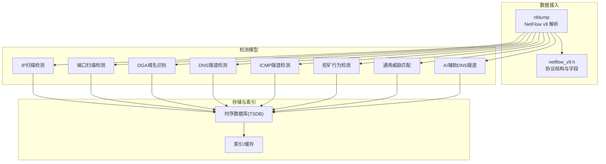
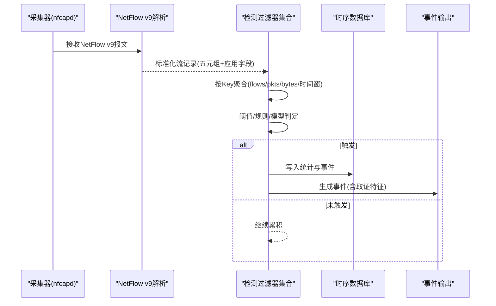
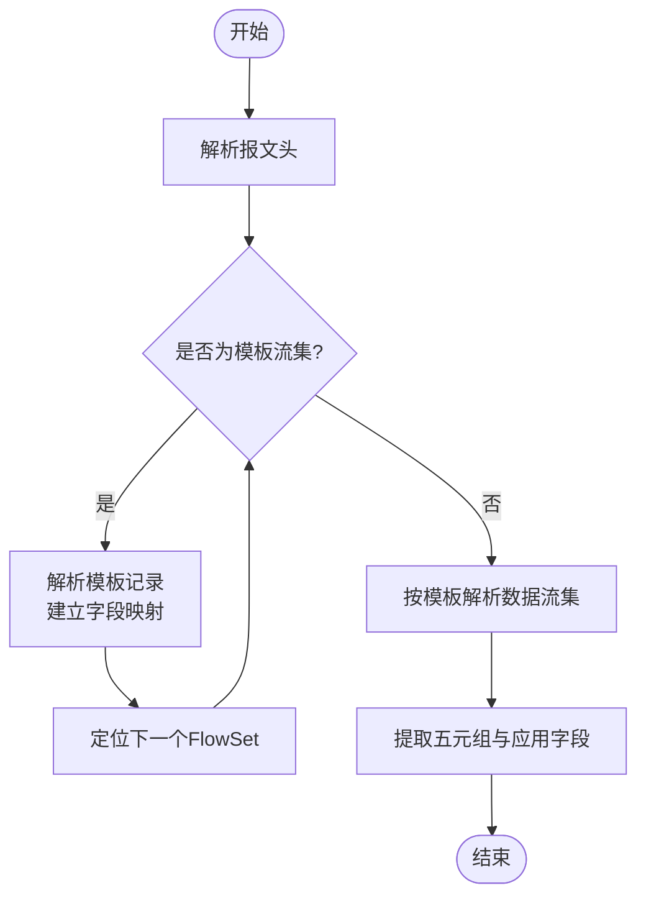
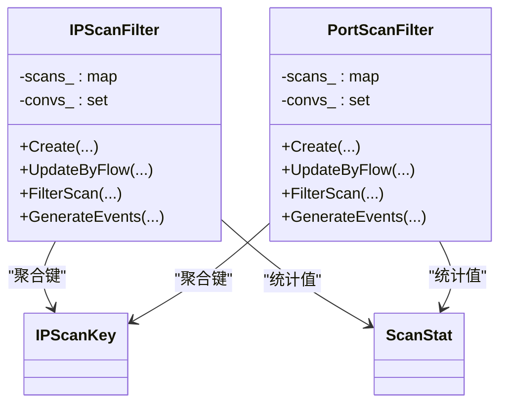
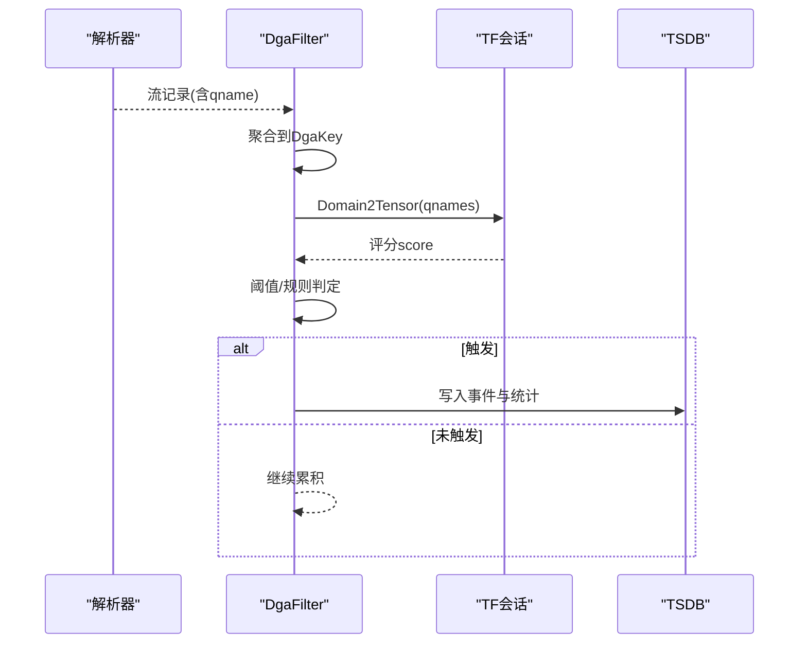
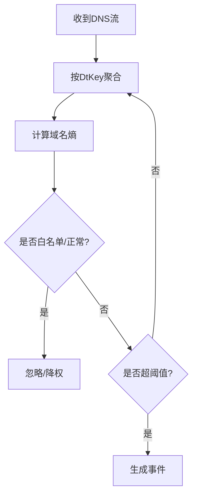
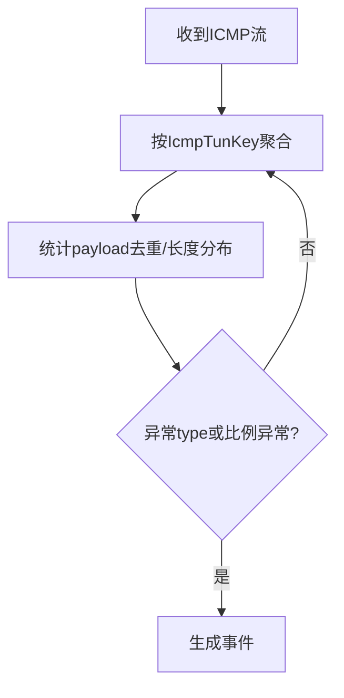
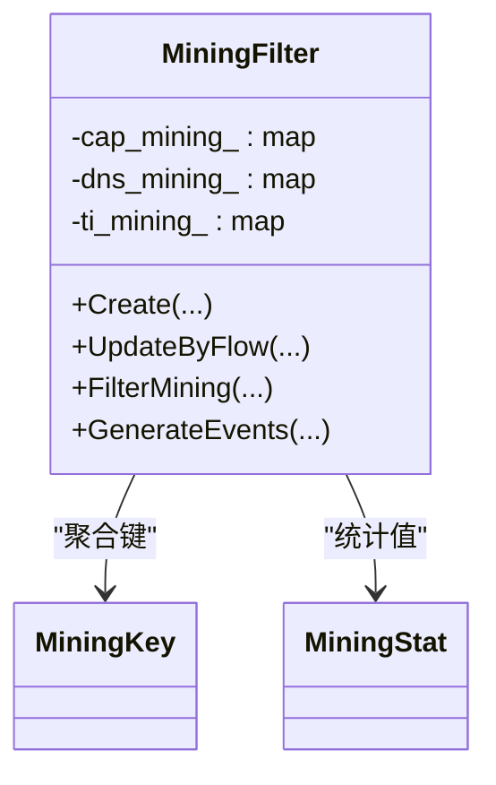
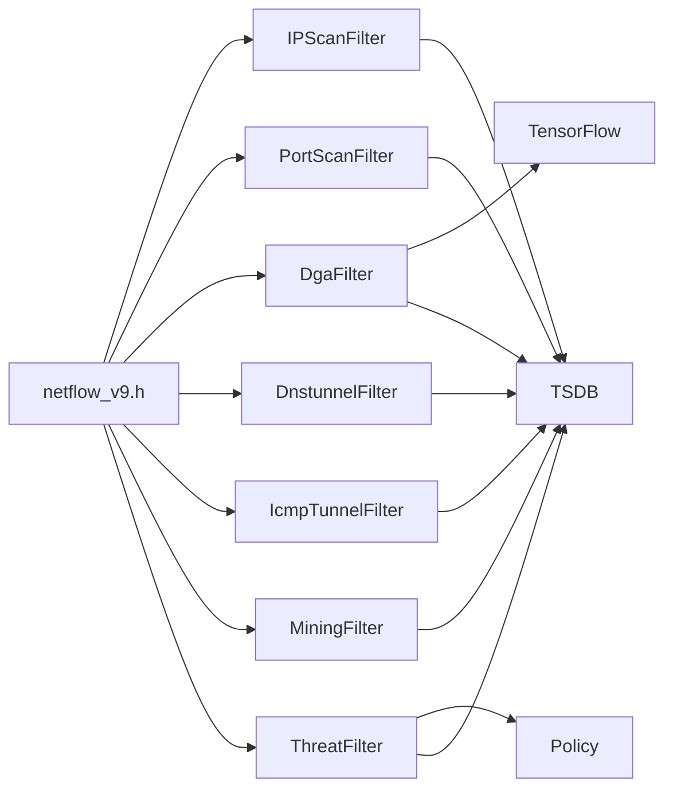

# 威胁分析引擎

<cite>
**本文引用的文件**
- [README.md](file://ly_analyser/README.md)
- [netflow_v9.h](file://ly_analyser/src/agent/dump/netflow_v9.h)
- [nf_scanner.h](file://ly_analyser/src/agent/flow/nf_scanner.h)
- [threat_filter.h](file://ly_analyser/src/agent/flow/threat_filter.h)
- [dga_filter.h](file://ly_analyser/src/agent/flow/dga_filter.h)
- [dns_tunnel.h](file://ly_analyser/src/agent/flow/dns_tunnel.h)
- [icmp_tunnel.h](file://ly_analyser/src/agent/flow/icmp_tunnel.h)
- [mining_filter.h](file://ly_analyser/src/agent/flow/mining_filter.h)
- [ip_scan_filter.h](file://ly_analyser/src/agent/flow/ip_scan_filter.h)
- [port_scan_filter.h](file://ly_analyser/src/agent/flow/port_scan_filter.h)
- [dnstun_ai_filter.h](file://ly_analyser/src/agent/flow/dnstun_ai_filter.h)
- [feature_key.h](file://ly_analyser/src/agent/model/feature_key.h)
- [policy.h](file://ly_analyser/src/agent/model/policy.h)
</cite>

## 目录
1. [简介](#简介)
2. [项目结构](#项目结构)
3. [核心组件](#核心组件)
4. [架构总览](#架构总览)
5. [详细组件分析](#详细组件分析)
6. [依赖关系分析](#依赖关系分析)
7. [性能考虑](#性能考虑)
8. [故障排查指南](#故障排查指南)
9. [结论](#结论)
10. [附录](#附录)

## 简介
本技术文档面向威胁分析引擎 ly_analyser，围绕 NetFlow v9 数据解析、流量特征提取与威胁检测算法实现进行系统化说明。引擎以 NetFlow v9 为输入，运行扫描检测、DGA域名识别、DNS隧道检测、ICMP隧道检测、挖矿行为检测等模型，结合机器学习与规则引擎产出威胁事件并留存取证特征。文档同时给出检测阈值配置思路、性能优化策略与误报率控制方法，并提供代码级参考路径以便扩展。

## 项目结构
- 数据接入与解析：基于 nfdump 的 NetFlow v9 解析头定义与处理流程，提供模板流集与数据流集的字段映射。
- 检测模型层：按威胁类型划分的过滤器（Filter）模块，统一继承 FlowFilter 接口，具备增量更新、统计聚合与事件生成能力。
- 特征与键空间：通过 feature_key.h 定义各检测模型的 Key/Stat/EventKey/EventValue 结构，支撑高效聚合与去重。
- 策略与配置：Policy 抽象用于加载策略索引与数据，支持按标签或类型创建策略实例。
- 扫描与查询：NFScanner 提供对历史流文件的批量扫描与 TopN 查询能力。

图表来源
- [netflow_v9.h:74-137](file://ly_analyser/src/agent/dump/netflow_v9.h#L74-L137)
- [ip_scan_filter.h:32-141](file://ly_analyser/src/agent/flow/ip_scan_filter.h#L32-L141)
- [port_scan_filter.h:31-140](file://ly_analyser/src/agent/flow/port_scan_filter.h#L31-L140)
- [dga_filter.h:38-146](file://ly_analyser/src/agent/flow/dga_filter.h#L38-L146)
- [dns_tunnel.h:33-119](file://ly_analyser/src/agent/flow/dns_tunnel.h#L33-L119)
- [icmp_tunnel.h:35-124](file://ly_analyser/src/agent/flow/icmp_tunnel.h#L35-L124)
- [mining_filter.h:37-143](file://ly_analyser/src/agent/flow/mining_filter.h#L37-L143)
- [threat_filter.h:26-111](file://ly_analyser/src/agent/flow/threat_filter.h#L26-L111)
- [dnstun_ai_filter.h:38-145](file://ly_analyser/src/agent/flow/dnstun_ai_filter.h#L38-L145)

章节来源
- [README.md:1-212](file://ly_analyser/README.md#L1-L212)

## 核心组件
- NetFlow v9 解析器：定义报文头、模板流集与数据流集结构，以及常用字段常量（如源/目的IP、端口、协议、DNS字段、HTTP字段、ICMP载荷等），支撑上层模型抽取五元组与应用层上下文。
- 检测过滤器族：每个威胁类型对应一个 Filter，提供统一的 Create/UpdateByFlow/Check* 接口，内部维护 Key->Stat 的聚合表，并在阈值触发时生成事件。
- 特征键空间：feature_key.h 中定义了各类 Key（如 IPScanKey、PortScanKey、DgaKey、DtKey、IcmpTunKey、ThreatKey 等），确保不同维度下的精确聚合与去重。
- 策略系统：Policy 抽象封装策略索引与数据，支持按标签或类型创建，便于动态加载检测规则与阈值。
- 扫描器：NFScanner 提供对历史流文件的批量扫描与 TopN 结果返回，支持缓存以提升重复查询效率。

章节来源
- [netflow_v9.h:74-314](file://ly_analyser/src/agent/dump/netflow_v9.h#L74-L314)
- [feature_key.h:17-228](file://ly_analyser/src/agent/model/feature_key.h#L17-L228)
- [policy.h:7-27](file://ly_analyser/src/agent/model/policy.h#L7-L27)
- [nf_scanner.h:16-28](file://ly_analyser/src/agent/flow/nf_scanner.h#L16-L28)

## 架构总览
引擎整体采用“解析-聚合-检测-事件”流水线：
- 解析阶段：nfdump 读取 NetFlow v9 报文，依据模板解析出五元组与应用层字段（DNS/HTTP/ICMP等）。
- 聚合阶段：各 Filter 将流记录按 Key 聚合为 Stat（包含 flows/pkts/bytes/首次/末次时间等）。
- 检测阶段：根据阈值与规则（含机器学习评分）判定是否触发事件。
- 事件阶段：生成事件并写入事件TSDB，同时保留明细以供取证。

图表来源
- [netflow_v9.h:74-137](file://ly_analyser/src/agent/dump/netflow_v9.h#L74-L137)
- [ip_scan_filter.h:32-141](file://ly_analyser/src/agent/flow/ip_scan_filter.h#L32-L141)
- [port_scan_filter.h:31-140](file://ly_analyser/src/agent/flow/port_scan_filter.h#L31-L140)
- [dga_filter.h:38-146](file://ly_analyser/src/agent/flow/dga_filter.h#L38-L146)
- [dns_tunnel.h:33-119](file://ly_analyser/src/agent/flow/dns_tunnel.h#L33-L119)
- [icmp_tunnel.h:35-124](file://ly_analyser/src/agent/flow/icmp_tunnel.h#L35-L124)
- [mining_filter.h:37-143](file://ly_analyser/src/agent/flow/mining_filter.h#L37-L143)
- [threat_filter.h:26-111](file://ly_analyser/src/agent/flow/threat_filter.h#L26-L111)
- [dnstun_ai_filter.h:38-145](file://ly_analyser/src/agent/flow/dnstun_ai_filter.h#L38-L145)

## 详细组件分析

### NetFlow v9 数据解析机制
- 报文头与流集：包含版本、计数、时间戳、序列号、源ID；模板流集描述字段类型与长度；数据流集承载实际记录。
- 关键字段：支持IPv4/IPv6地址、端口、协议、TCP标志、方向、MPLS标签、服务/设备/操作系统信息、HTTP/DNS/ICMP扩展字段等。
- 解析流程：先解析模板流集建立字段映射，再按模板解析数据流集，提取五元组与应用层上下文供下游模型使用。

图表来源
- [netflow_v9.h:74-137](file://ly_analyser/src/agent/dump/netflow_v9.h#L74-L137)
- [netflow_v9.h:169-303](file://ly_analyser/src/agent/dump/netflow_v9.h#L169-L303)

章节来源
- [netflow_v9.h:74-314](file://ly_analyser/src/agent/dump/netflow_v9.h#L74-L314)

### 扫描检测（IP扫描/端口扫描）
- 关键聚合键：IPScanKey 以源/目的IP与协议为维度；PortScanKey 以IP、协议、端口为维度。
- 统计指标：flows/pkts/bytes、首次/末次时间、目标端口/IP数量、应用协议标记等。
- 检测逻辑：在滑动窗口内统计扫描规模（如目标数、连接数），超过阈值即触发事件；支持模式划分与多模式匹配。
- 事件输出：记录五元组、时间窗、扫描规模与指纹信息，便于溯源。

图表来源
- [ip_scan_filter.h:32-141](file://ly_analyser/src/agent/flow/ip_scan_filter.h#L32-L141)
- [port_scan_filter.h:31-140](file://ly_analyser/src/agent/flow/port_scan_filter.h#L31-L140)
- [feature_key.h:17-41](file://ly_analyser/src/agent/model/feature_key.h#L17-L41)

章节来源
- [ip_scan_filter.h:32-141](file://ly_analyser/src/agent/flow/ip_scan_filter.h#L32-L141)
- [port_scan_filter.h:31-140](file://ly_analyser/src/agent/flow/port_scan_filter.h#L31-L140)
- [feature_key.h:17-41](file://ly_analyser/src/agent/model/feature_key.h#L17-L41)

### DGA域名识别
- 关键聚合键：DgaKey 以源IP、目的IP与查询域名为维度。
- 统计指标：flows/pkts/bytes、首次/末次时间、域名评分 score、DGA计数 dga_cnt。
- 检测逻辑：结合机器学习模型（TensorFlow Session）对域名序列进行打分，结合白名单/非TLD过滤与特殊字符判断，综合判定是否为DGA。
- 事件输出：记录域名、评分、计数与五元组详情。

图表来源
- [dga_filter.h:38-146](file://ly_analyser/src/agent/flow/dga_filter.h#L38-L146)
- [feature_key.h:192-205](file://ly_analyser/src/agent/model/feature_key.h#L192-L205)

章节来源
- [dga_filter.h:38-146](file://ly_analyser/src/agent/flow/dga_filter.h#L38-L146)
- [feature_key.h:192-205](file://ly_analyser/src/agent/model/feature_key.h#L192-L205)

### DNS隧道检测
- 关键聚合键：DtKey 以源/目的IP与完整域名为维度。
- 统计指标：flows/pkts/bytes、首次/末次时间。
- 检测逻辑：计算域名熵、结合白名单与全量域名集合，统计异常查询类型与频率，达到阈值即判定为隧道。
- 事件输出：记录域名、qtype、五元组与时间窗。

图表来源
- [dns_tunnel.h:33-119](file://ly_analyser/src/agent/flow/dns_tunnel.h#L33-L119)
- [feature_key.h:144-157](file://ly_analyser/src/agent/model/feature_key.h#L144-L157)

章节来源
- [dns_tunnel.h:33-119](file://ly_analyser/src/agent/flow/dns_tunnel.h#L33-L119)
- [feature_key.h:144-157](file://ly_analyser/src/agent/model/feature_key.h#L144-L157)

### ICMP隧道检测
- 关键聚合键：IcmpTunKey 以源/目的IP为维度。
- 统计指标：flows/pkts/bytes、首次/末次时间、异常type集合、payload长度分布、请求/响应配对统计。
- 检测逻辑：统计payload去重个数、异常ICMP类型、同一seq下请求/响应数量与payload一致性，发现异常即判定为隧道。
- 事件输出：记录ICMP类型、payload片段、五元组与时间窗。

图表来源
- [icmp_tunnel.h:35-124](file://ly_analyser/src/agent/flow/icmp_tunnel.h#L35-L124)
- [feature_key.h:178-189](file://ly_analyser/src/agent/model/feature_key.h#L178-L189)

章节来源
- [icmp_tunnel.h:35-124](file://ly_analyser/src/agent/flow/icmp_tunnel.h#L35-L124)
- [feature_key.h:178-189](file://ly_analyser/src/agent/model/feature_key.h#L178-L189)

### 挖矿行为检测
- 关键聚合键：MiningKey 以源/目的IP、协议、模型标识、域名、币种名称为维度。
- 统计指标：flows/pkts/bytes、首次/末次时间。
- 检测逻辑：结合数据包指纹匹配、DNS查询特征与威胁情报，区分多种挖矿渠道（DNS/直连/情报命中），聚合后触发事件。
- 事件输出：记录域名、币种名、五元组与时间窗。

图表来源
- [mining_filter.h:37-143](file://ly_analyser/src/agent/flow/mining_filter.h#L37-L143)
- [feature_key.h:207-225](file://ly_analyser/src/agent/model/feature_key.h#L207-L225)

章节来源
- [mining_filter.h:37-143](file://ly_analyser/src/agent/flow/mining_filter.h#L37-L143)
- [feature_key.h:207-225](file://ly_analyser/src/agent/model/feature_key.h#L207-L225)

### 通用威胁匹配（包指纹/情报）
- 关键聚合键：ThreatKey 以源/目的IP、协议、端口、指纹类型与名称为维度。
- 统计指标：flows/pkts/bytes、首次/末次时间。
- 检测逻辑：基于数据包指纹与威胁情报匹配，聚合后生成事件，并支持事件特征提取与TSDB落盘。
- 事件输出：记录威胁类型、名称、版本、时间与五元组详情。

章节来源
- [threat_filter.h:26-111](file://ly_analyser/src/agent/flow/threat_filter.h#L26-L111)
- [feature_key.h:207-225](file://ly_analyser/src/agent/model/feature_key.h#L207-L225)

### AI辅助DNS隧道检测
- 关键聚合键：DtKey（同DNS隧道），额外维护域名评分与计数。
- 检测逻辑：使用 TensorFlow Session 对域名序列建模打分，结合阈值与白名单，提升对新型隧道的检出能力。
- 事件输出：记录评分、计数与五元组详情。

章节来源
- [dnstun_ai_filter.h:38-145](file://ly_analyser/src/agent/flow/dnstun_ai_filter.h#L38-L145)

## 依赖关系分析
- 解析依赖：所有 Filter 均依赖 libnfdump 提供的 master_record_t 与解析后的字段，用于构建 Key 与统计。
- 存储依赖：各 Filter 使用 TSDB 持久化统计与事件，支持后续查询与取证。
- 模型依赖：DGA与AI-DNS隧道使用 TensorFlow 会话进行推理；其他模型主要依赖规则与阈值。
- 策略依赖：Policy 提供策略索引与数据，使阈值与规则可配置化。

图表来源
- [netflow_v9.h:74-314](file://ly_analyser/src/agent/dump/netflow_v9.h#L74-L314)
- [ip_scan_filter.h:32-141](file://ly_analyser/src/agent/flow/ip_scan_filter.h#L32-L141)
- [port_scan_filter.h:31-140](file://ly_analyser/src/agent/flow/port_scan_filter.h#L31-L140)
- [dga_filter.h:38-146](file://ly_analyser/src/agent/flow/dga_filter.h#L38-L146)
- [dns_tunnel.h:33-119](file://ly_analyser/src/agent/flow/dns_tunnel.h#L33-L119)
- [icmp_tunnel.h:35-124](file://ly_analyser/src/agent/flow/icmp_tunnel.h#L35-L124)
- [mining_filter.h:37-143](file://ly_analyser/src/agent/flow/mining_filter.h#L37-L143)
- [threat_filter.h:26-111](file://ly_analyser/src/agent/flow/threat_filter.h#L26-L111)
- [policy.h:7-27](file://ly_analyser/src/agent/model/policy.h#L7-L27)

章节来源
- [policy.h:7-27](file://ly_analyser/src/agent/model/policy.h#L7-L27)

## 性能考虑
- 聚合粒度与内存占用：合理设计 Key 维度（如仅聚合必要字段），避免过细导致内存膨胀；利用 set/map 的去重特性减少冗余。
- 阈值与时间窗：通过滑动窗口与阈值调优平衡实时性与资源消耗；对高频场景（如扫描）采用更粗粒度聚合降低开销。
- 模型推理：对 TensorFlow 会话复用与批量化推理，减少频繁建销毁带来的开销；对低置信度样本进行快速过滤。
- I/O与存储：事件与统计写入TSDB采用批量提交；热点Key设置过期策略，防止长期累积。
- 扫描与TopN：使用 NFScanner 的缓存机制加速重复查询；限制扫描范围与字段投影以减少CPU与内存压力。

[本节为通用指导，不直接分析具体文件]

## 故障排查指南
- 解析失败：检查 NetFlow v9 模板是否正确下发，确认模板流集与数据流集匹配；核对字段类型与长度是否与模板一致。
- 模型未触发：核查阈值配置与时间窗是否过小；确认白名单/非TLD列表是否误拦截；对AI模型检查输入特征与评分阈值。
- 事件缺失：确认 TSDB 写入链路是否正常；检查事件生成条件与聚合Key是否正确；验证事件查询参数与时间范围。
- 性能问题：监控内存与CPU使用，调整聚合粒度与阈值；对高QPS场景启用批处理与缓存；必要时拆分检测任务。

章节来源
- [netflow_v9.h:74-314](file://ly_analyser/src/agent/dump/netflow_v9.h#L74-L314)
- [dga_filter.h:38-146](file://ly_analyser/src/agent/flow/dga_filter.h#L38-L146)
- [dnstun_ai_filter.h:38-145](file://ly_analyser/src/agent/flow/dnstun_ai_filter.h#L38-L145)
- [threat_filter.h:26-111](file://ly_analyser/src/agent/flow/threat_filter.h#L26-L111)

## 结论
本引擎以 NetFlow v9 为基础，构建了覆盖扫描、DGA、DNS/ICMP隧道、挖矿与通用威胁匹配的完整检测体系。通过统一的过滤器框架、精细的特征键设计与可扩展的策略系统，实现了高吞吐、低延迟的威胁检测与事件输出。结合机器学习与规则引擎，可在保证性能的同时提升检出率并控制误报。建议在生产环境中持续校准阈值与白名单，并结合业务基线优化模型与规则。

[本节为总结性内容，不直接分析具体文件]

## 附录
- 检测阈值配置建议
  - 扫描类：基于单位时间内目标IP/端口数量、连接数设定阈值；结合应用协议标记降低误报。
  - DGA/AI-DNS：基于域名熵、评分与查询频次设定阈值；维护白名单与非TLD集合。
  - ICMP隧道：基于payload去重数、异常type比例与seq配对异常度设定阈值。
  - 挖矿：基于指纹匹配命中、DNS特征与情报命中组合判定。
- 性能优化要点
  - 聚合Key最小化、批量写入TSDB、复用模型会话、热点Key过期策略。
- 误报率控制方法
  - 白名单/黑名单、业务基线对比、多模型融合与投票、阈值自适应调整。
- 代码示例路径（用于定位实现）
  - NetFlow v9 解析：[netflow_v9.h:74-314](file://ly_analyser/src/agent/dump/netflow_v9.h#L74-L314)
  - 扫描检测：[ip_scan_filter.h:32-141](file://ly_analyser/src/agent/flow/ip_scan_filter.h#L32-L141)、[port_scan_filter.h:31-140](file://ly_analyser/src/agent/flow/port_scan_filter.h#L31-L140)
  - DGA识别：[dga_filter.h:38-146](file://ly_analyser/src/agent/flow/dga_filter.h#L38-L146)
  - DNS隧道：[dns_tunnel.h:33-119](file://ly_analyser/src/agent/flow/dns_tunnel.h#L33-L119)
  - ICMP隧道：[icmp_tunnel.h:35-124](file://ly_analyser/src/agent/flow/icmp_tunnel.h#L35-L124)
  - 挖矿检测：[mining_filter.h:37-143](file://ly_analyser/src/agent/flow/mining_filter.h#L37-L143)
  - 通用威胁：[threat_filter.h:26-111](file://ly_analyser/src/agent/flow/threat_filter.h#L26-L111)
  - AI辅助DNS隧道：[dnstun_ai_filter.h:38-145](file://ly_analyser/src/agent/flow/dnstun_ai_filter.h#L38-L145)
  - 策略系统：[policy.h:7-27](file://ly_analyser/src/agent/model/policy.h#L7-L27)
  - 特征键空间：[feature_key.h:17-228](file://ly_analyser/src/agent/model/feature_key.h#L17-L228)
  - 扫描器：[nf_scanner.h:16-28](file://ly_analyser/src/agent/flow/nf_scanner.h#L16-L28)