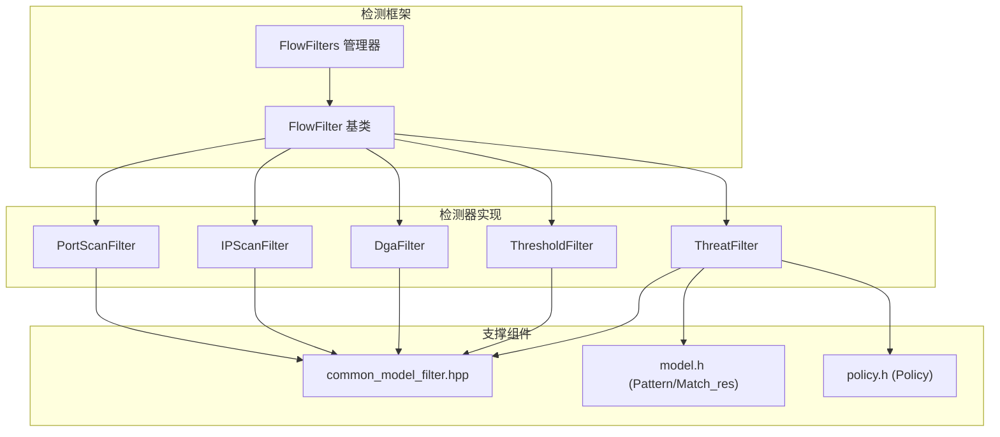
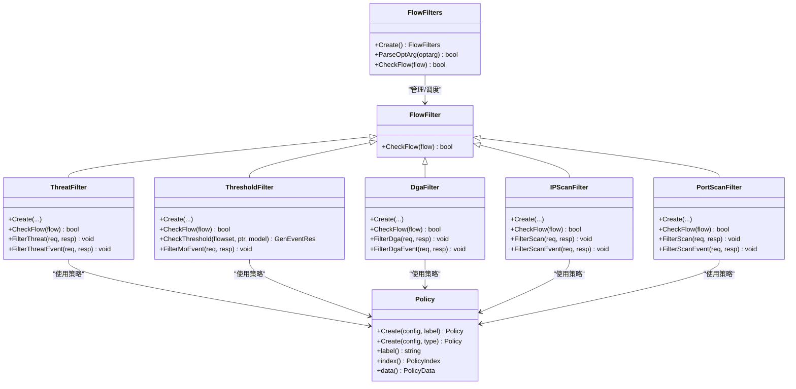
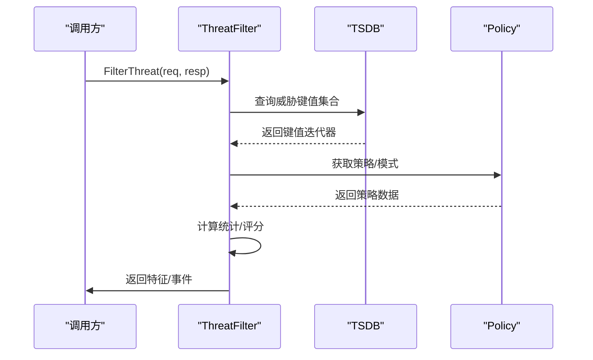
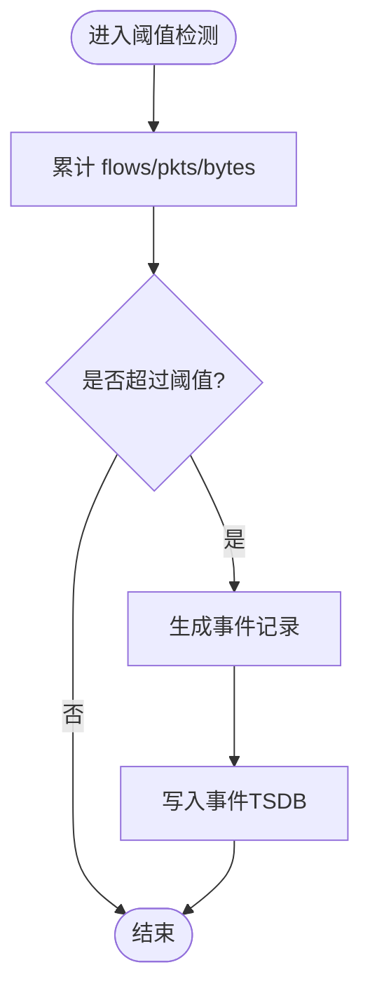
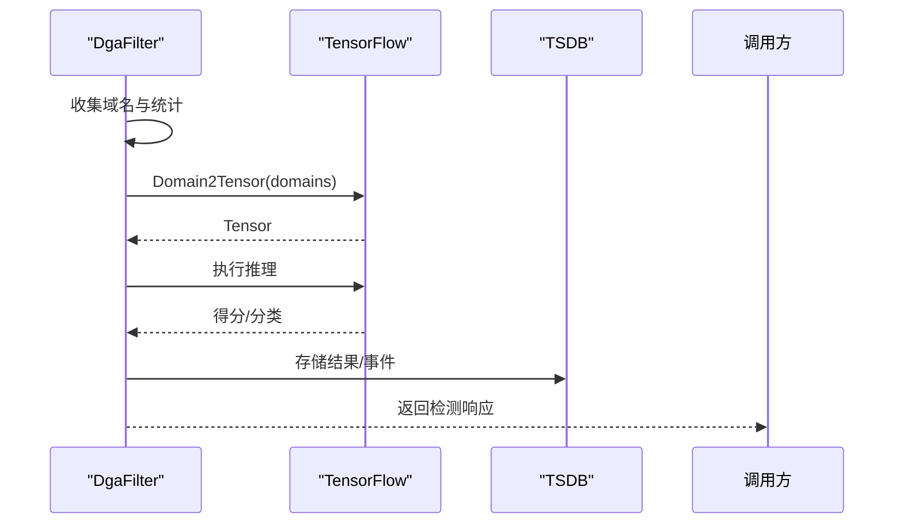
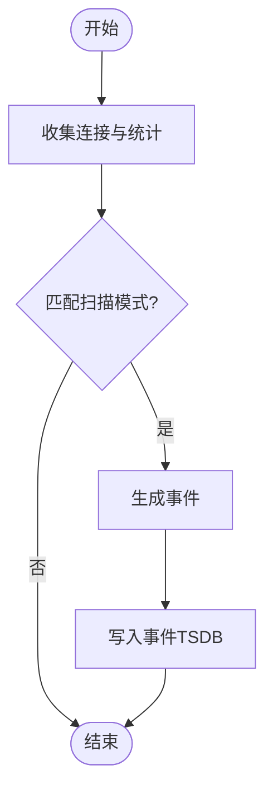
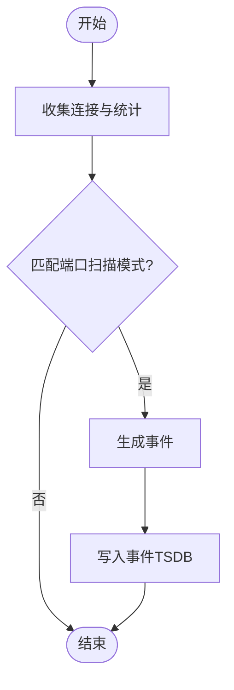
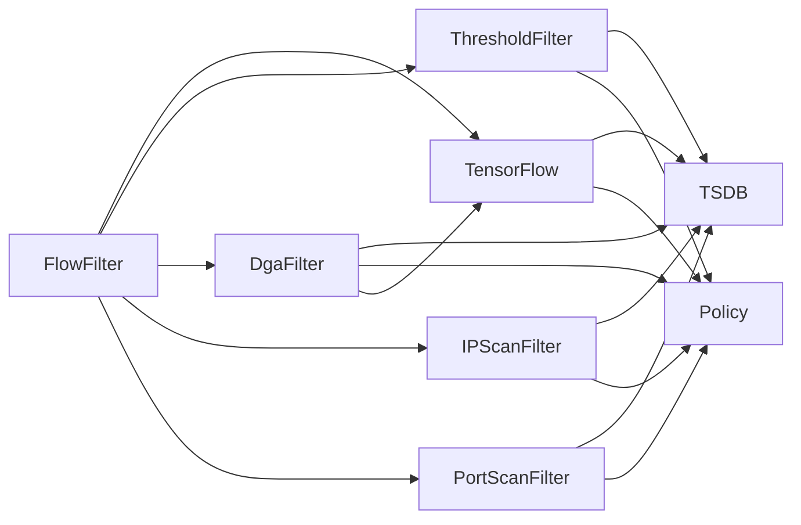

# 威胁检测模型

<cite>
**本文引用的文件**
- [flow_filter.h](file://ly_analyser/src/agent/flow/flow_filter.h)
- [threat_filter.h](file://ly_analyser/src/agent/flow/threat_filter.h)
- [threshold_filter.h](file://ly_analyser/src/agent/flow/threshold_filter.h)
- [dga_filter.h](file://ly_analyser/src/agent/flow/dga_filter.h)
- [ip_scan_filter.h](file://ly_analyser/src/agent/flow/ip_scan_filter.h)
- [port_scan_filter.h](file://ly_analyser/src/agent/flow/port_scan_filter.h)
- [common_model_filter.hpp](file://ly_analyser/src/agent/flow/common_model_filter.hpp)
- [model.h](file://ly_analyser/src/agent/model/model.h)
- [policy.h](file://ly_analyser/src/agent/model/policy.h)
</cite>

## 目录
1. [简介](#简介)
2. [项目结构](#项目结构)
3. [核心组件](#核心组件)
4. [架构总览](#架构总览)
5. [详细组件分析](#详细组件分析)
6. [依赖关系分析](#依赖关系分析)
7. [性能考虑](#性能考虑)
8. [故障排查指南](#故障排查指南)
9. [结论](#结论)
10. [附录：扩展新检测模型的指南](#附录：扩展新检测模型的指南)

## 简介
本技术文档面向威胁检测子系统，系统性说明检测模型的架构设计、插件化机制与模型注册方式，覆盖基于规则的检测、统计分析与机器学习方法。文档还阐述检测阈值的配置与管理、误报率控制策略以及性能优化方法，并提供扩展新检测模型的完整指导（接口实现、参数配置与测试验证）。

## 项目结构
威胁检测能力集中在 ly_analyser 的 agent/flow 模块中，采用“基类抽象 + 多实现”的插件式架构：
- 基类定义统一入口 FlowFilter，所有检测器均继承该基类并实现 CheckFlow。
- 具体检测器包括：威胁聚合（ThreatFilter）、阈值告警（ThresholdFilter）、DGA 域名检测（DgaFilter）、IP 扫描（IPScanFilter）、端口扫描（PortScanFilter）等。
- 通用工具与模式匹配：common_model_filter 提供时间窗口过滤；model.h 定义 Pattern/Match_res 等模式匹配数据结构；policy.h 提供策略加载与选择。

图表来源
- [flow_filter.h:8-29](file://ly_analyser/src/agent/flow/flow_filter.h#L8-L29)
- [threat_filter.h:26-45](file://ly_analyser/src/agent/flow/threat_filter.h#L26-L45)
- [threshold_filter.h:20-33](file://ly_analyser/src/agent/flow/threshold_filter.h#L20-L33)
- [dga_filter.h:38-58](file://ly_analyser/src/agent/flow/dga_filter.h#L38-L58)
- [ip_scan_filter.h:32-52](file://ly_analyser/src/agent/flow/ip_scan_filter.h#L32-L52)
- [port_scan_filter.h:31-51](file://ly_analyser/src/agent/flow/port_scan_filter.h#L31-L51)
- [common_model_filter.hpp:11-42](file://ly_analyser/src/agent/flow/common_model_filter.hpp#L11-L42)
- [model.h:16-64](file://ly_analyser/src/agent/model/model.h#L16-L64)
- [policy.h:7-27](file://ly_analyser/src/agent/model/policy.h#L7-L27)

章节来源
- [flow_filter.h:8-29](file://ly_analyser/src/agent/flow/flow_filter.h#L8-L29)
- [threat_filter.h:26-45](file://ly_analyser/src/agent/flow/threat_filter.h#L26-L45)
- [threshold_filter.h:20-33](file://ly_analyser/src/agent/flow/threshold_filter.h#L20-L33)
- [dga_filter.h:38-58](file://ly_analyser/src/agent/flow/dga_filter.h#L38-L58)
- [ip_scan_filter.h:32-52](file://ly_analyser/src/agent/flow/ip_scan_filter.h#L32-L52)
- [port_scan_filter.h:31-51](file://ly_analyser/src/agent/flow/port_scan_filter.h#L31-L51)
- [common_model_filter.hpp:11-42](file://ly_analyser/src/agent/flow/common_model_filter.hpp#L11-L42)
- [model.h:16-64](file://ly_analyser/src/agent/model/model.h#L16-L64)
- [policy.h:7-27](file://ly_analyser/src/agent/model/policy.h#L7-L27)

## 核心组件
- FlowFilter 基类：定义统一的流量检查接口 CheckFlow，作为所有检测器的抽象入口。
- FlowFilters 管理器：负责解析参数、调度多个检测器对同一流量进行流水线处理。
- 各检测器：
  - ThreatFilter：基于规则与统计的威胁聚合，支持事件生成与特征查询。
  - ThresholdFilter：基于阈值触发的事件生成，支持方向、时间窗口与 MO 事件过滤。
  - DgaFilter：结合机器学习（TensorFlow）与启发式规则识别 DGA 域名。
  - IPScanFilter / PortScanFilter：基于连接数、端口/IP 访问分布的扫描行为检测。
- 模式与策略：
  - common_model_filter.hpp：按星期与时间段进行覆盖范围判断。
  - model.h：Pattern/Match_res 用于规则匹配的结构体。
  - policy.h：通过标签或类型创建策略实例，供检测器使用。

章节来源
- [flow_filter.h:8-29](file://ly_analyser/src/agent/flow/flow_filter.h#L8-L29)
- [threat_filter.h:26-45](file://ly_analyser/src/agent/flow/threat_filter.h#L26-L45)
- [threshold_filter.h:20-33](file://ly_analyser/src/agent/flow/threshold_filter.h#L20-L33)
- [dga_filter.h:38-58](file://ly_analyser/src/agent/flow/dga_filter.h#L38-L58)
- [ip_scan_filter.h:32-52](file://ly_analyser/src/agent/flow/ip_scan_filter.h#L32-L52)
- [port_scan_filter.h:31-51](file://ly_analyser/src/agent/flow/port_scan_filter.h#L31-L51)
- [common_model_filter.hpp:11-42](file://ly_analyser/src/agent/flow/common_model_filter.hpp#L11-L42)
- [model.h:16-64](file://ly_analyser/src/agent/model/model.h#L16-L64)
- [policy.h:7-27](file://ly_analyser/src/agent/model/policy.h#L7-L27)

## 架构总览
检测系统以插件化为核心，遵循“统一接口 + 可插拔实现”的设计：
- 统一接口：FlowFilter::CheckFlow 是所有检测器的入口。
- 插件机制：每个检测器独立维护自身状态（如 map/set），在 UpdateByFlow/UpdateFinished 阶段聚合统计，并在 Filter*Event 阶段生成事件或响应。
- 模型注册：通过工厂方法 Create 在各检测器内部完成初始化与依赖注入（DBBuilder、TSDB、MOFilter 等）。
- 策略与模式：Policy 提供策略索引与数据；Pattern/Match_res 用于规则匹配；common_model_filter 提供时间窗口过滤。

图表来源
- [flow_filter.h:8-29](file://ly_analyser/src/agent/flow/flow_filter.h#L8-L29)
- [threat_filter.h:26-45](file://ly_analyser/src/agent/flow/threat_filter.h#L26-L45)
- [threshold_filter.h:20-33](file://ly_analyser/src/agent/flow/threshold_filter.h#L20-L33)
- [dga_filter.h:38-58](file://ly_analyser/src/agent/flow/dga_filter.h#L38-L58)
- [ip_scan_filter.h:32-52](file://ly_analyser/src/agent/flow/ip_scan_filter.h#L32-L52)
- [port_scan_filter.h:31-51](file://ly_analyser/src/agent/flow/port_scan_filter.h#L31-L51)
- [policy.h:7-27](file://ly_analyser/src/agent/model/policy.h#L7-L27)

## 详细组件分析

### 基类与插件化机制
- FlowFilter 定义了统一的 CheckFlow 接口，所有检测器必须实现该方法以接入流水线。
- FlowFilters 提供 Create、ParseOptArg、CheckFlow，用于解析参数与调度多个检测器。
- 插件化优势：新增检测器只需继承 FlowFilter 并实现接口，即可无缝集成到现有流程。

章节来源
- [flow_filter.h:8-29](file://ly_analyser/src/agent/flow/flow_filter.h#L8-L29)

### 威胁聚合检测（ThreatFilter）
- 职责：聚合多种威胁信号，维护威胁键值与统计信息，支持特征查询与事件生成。
- 关键成员：
  - EventGenerator：封装事件生成配置（设备ID、时间窗口）。
  - ThreatStat/EventKey/EventValue：统计与事件维度键值。
  - TSDB：时序数据库用于持久化与查询。
- 主要流程：
  - UpdateByFlow/UpdateByFlowV6：增量更新威胁统计。
  - FilterThreat/FilterThreatEvent：根据请求返回特征或事件。
  - GenerateEvents：按配置生成事件记录。

图表来源
- [threat_filter.h:26-45](file://ly_analyser/src/agent/flow/threat_filter.h#L26-L45)
- [policy.h:7-27](file://ly_analyser/src/agent/model/policy.h#L7-L27)

章节来源
- [threat_filter.h:26-45](file://ly_analyser/src/agent/flow/threat_filter.h#L26-L45)

### 阈值告警检测（ThresholdFilter）
- 职责：基于阈值触发事件，支持方向（上行/下行）、时间窗口与 MO 事件过滤。
- 关键成员：
  - TiKey/TiStat：阈值统计键值与计数。
  - EventKey/EventValue：事件维度键值与统计。
  - MOFilter：用于 MO（可能是恶意对象）事件过滤。
- 主要流程：
  - UpdateByFlow/UpdateThreshold/UpdateThresholdV6：累计包数/字节数/流数。
  - ExceedThreshold：判断是否超过阈值。
  - FilterMoEvent：生成或过滤事件。

图表来源
- [threshold_filter.h:20-33](file://ly_analyser/src/agent/flow/threshold_filter.h#L20-L33)
- [threshold_filter.h:81-108](file://ly_analyser/src/agent/flow/threshold_filter.h#L81-L108)

章节来源
- [threshold_filter.h:20-33](file://ly_analyser/src/agent/flow/threshold_filter.h#L20-L33)
- [threshold_filter.h:81-108](file://ly_analyser/src/agent/flow/threshold_filter.h#L81-L108)

### DGA 域名检测（DgaFilter）
- 职责：结合机器学习（TensorFlow）与启发式规则识别 DGA 域名。
- 关键成员：
  - DgaStat/EventKey/EventValue：统计与事件维度。
  - Session：TensorFlow 会话用于模型推理。
  - domains_/not_tld_：域名白名单与 TLD 排除集。
- 主要流程：
  - UpdateByFlow/UpdateByFlowV6：收集域名与统计。
  - Domain2Tensor/CreateSession：构建输入张量与加载模型。
  - FilterDga/FilterDgaEvent：返回检测结果或事件。

图表来源
- [dga_filter.h:38-58](file://ly_analyser/src/agent/flow/dga_filter.h#L38-L58)
- [dga_filter.h:115-130](file://ly_analyser/src/agent/flow/dga_filter.h#L115-L130)

章节来源
- [dga_filter.h:38-58](file://ly_analyser/src/agent/flow/dga_filter.h#L38-L58)
- [dga_filter.h:115-130](file://ly_analyser/src/agent/flow/dga_filter.h#L115-L130)

### IP 扫描检测（IPScanFilter）
- 职责：基于目标 IP/协议/端口的访问分布识别扫描行为。
- 关键成员：
  - Conv：连接元组（源IP、协议、目的端口、目的IP）。
  - IPScanStat：扫描统计（首次/末次时间、端口数、流/包/字节）。
  - Pattern/Match_res：规则匹配。
- 主要流程：
  - UpdateByFlow/UpdateByFlowV6：累积连接与统计。
  - FilterScan/FilterScanEvent：返回特征或事件。
  - LoadPatternFromFile/DividePatterns：加载并拆分规则。

图表来源
- [ip_scan_filter.h:32-52](file://ly_analyser/src/agent/flow/ip_scan_filter.h#L32-L52)
- [ip_scan_filter.h:100-119](file://ly_analyser/src/agent/flow/ip_scan_filter.h#L100-L119)

章节来源
- [ip_scan_filter.h:32-52](file://ly_analyser/src/agent/flow/ip_scan_filter.h#L32-L52)
- [ip_scan_filter.h:100-119](file://ly_analyser/src/agent/flow/ip_scan_filter.h#L100-L119)

### 端口扫描检测（PortScanFilter）
- 职责：基于目的端口访问分布识别端口扫描。
- 关键成员：
  - ScanStat：扫描统计（首次/末次时间、目的IP数、流/包/字节）。
  - Pattern/Match_res：规则匹配。
- 主要流程：
  - UpdateByFlow/UpdateByFlowV6：累积连接与统计。
  - FilterScan/FilterScanEvent：返回特征或事件。
  - LoadPatternFromFile/DividePatterns：加载并拆分规则。

图表来源
- [port_scan_filter.h:31-51](file://ly_analyser/src/agent/flow/port_scan_filter.h#L31-L51)
- [port_scan_filter.h:100-118](file://ly_analyser/src/agent/flow/port_scan_filter.h#L100-L118)

章节来源
- [port_scan_filter.h:31-51](file://ly_analyser/src/agent/flow/port_scan_filter.h#L31-L51)
- [port_scan_filter.h:100-118](file://ly_analyser/src/agent/flow/port_scan_filter.h#L100-L118)

### 模式匹配与时间窗口过滤
- common_model_filter.hpp：filter_time_range 根据星期与时间段判断是否在覆盖范围内，支持 WITHIN/WITHOUT 两种覆盖策略。
- model.h：Pattern/Match_res 用于描述匹配模式与结果。
- policy.h：Policy 提供策略索引与数据，供检测器在匹配时参考。

章节来源
- [common_model_filter.hpp:11-42](file://ly_analyser/src/agent/flow/common_model_filter.hpp#L11-L42)
- [model.h:16-64](file://ly_analyser/src/agent/model/model.h#L16-L64)
- [policy.h:7-27](file://ly_analyser/src/agent/model/policy.h#L7-L27)

## 依赖关系分析
- 检测器均依赖 FlowFilter 基类，并通过 FlowFilters 管理器进行编排。
- 各检测器依赖 TSDB 进行统计与事件持久化。
- 规则匹配依赖 model.h 中的 Pattern/Match_res。
- 策略加载依赖 policy.h 中的 Policy。
- DgaFilter 额外依赖 TensorFlow 进行机器学习推理。

图表来源
- [flow_filter.h:8-29](file://ly_analyser/src/agent/flow/flow_filter.h#L8-L29)
- [threat_filter.h:26-45](file://ly_analyser/src/agent/flow/threat_filter.h#L26-L45)
- [threshold_filter.h:20-33](file://ly_analyser/src/agent/flow/threshold_filter.h#L20-L33)
- [dga_filter.h:38-58](file://ly_analyser/src/agent/flow/dga_filter.h#L38-L58)
- [ip_scan_filter.h:32-52](file://ly_analyser/src/agent/flow/ip_scan_filter.h#L32-L52)
- [port_scan_filter.h:31-51](file://ly_analyser/src/agent/flow/port_scan_filter.h#L31-L51)
- [policy.h:7-27](file://ly_analyser/src/agent/model/policy.h#L7-L27)

章节来源
- [flow_filter.h:8-29](file://ly_analyser/src/agent/flow/flow_filter.h#L8-L29)
- [threat_filter.h:26-45](file://ly_analyser/src/agent/flow/threat_filter.h#L26-L45)
- [threshold_filter.h:20-33](file://ly_analyser/src/agent/flow/threshold_filter.h#L20-L33)
- [dga_filter.h:38-58](file://ly_analyser/src/agent/flow/dga_filter.h#L38-L58)
- [ip_scan_filter.h:32-52](file://ly_analyser/src/agent/flow/ip_scan_filter.h#L32-L52)
- [port_scan_filter.h:31-51](file://ly_analyser/src/agent/flow/port_scan_filter.h#L31-L51)
- [policy.h:7-27](file://ly_analyser/src/agent/model/policy.h#L7-L27)

## 性能考虑
- 增量聚合：各检测器在 UpdateByFlow/UpdateByFlowV6 中进行增量统计，避免全量重算。
- 缓存与去重：使用 set/map 维护连接与键值，减少重复计算。
- 时间窗口过滤：common_model_filter 提前过滤不在时间范围内的流量，降低后续处理开销。
- 批量处理：UpdateFinished 阶段集中生成事件，减少频繁 I/O。
- 模型推理：DgaFilter 使用 TensorFlow 会话，建议预热模型与批处理输入以降低延迟。

[本节为通用性能建议，不直接分析具体文件]

## 故障排查指南
- 事件未生成：
  - 检查阈值配置与时间窗口是否正确（ThresholdFilter）。
  - 确认策略/模式已正确加载（Policy/Pattern）。
  - 验证 TSDB 连接与写入权限。
- 误报过多：
  - 调整阈值与覆盖范围（WITHIN/WITHOUT）。
  - 增加白名单或排除集（如 not_tld_）。
  - 细化规则匹配（Pattern 拆分与组合）。
- 性能瓶颈：
  - 检查内存占用（map/set 规模）。
  - 评估模型推理耗时（TensorFlow 会话与输入批次）。
  - 优化 I/O 频率（批量写入事件）。

章节来源
- [threshold_filter.h:20-33](file://ly_analyser/src/agent/flow/threshold_filter.h#L20-L33)
- [common_model_filter.hpp:11-42](file://ly_analyser/src/agent/flow/common_model_filter.hpp#L11-L42)
- [dga_filter.h:38-58](file://ly_analyser/src/agent/flow/dga_filter.h#L38-L58)

## 结论
威胁检测子系统采用插件化架构，通过统一基类与策略/模式机制，实现了可扩展、可配置的检测能力。各检测器聚焦特定威胁场景，结合规则、统计与机器学习方法，形成多层次防护体系。通过合理的阈值配置与性能优化，可在保证检测精度的同时提升系统吞吐与稳定性。

[本节为总结性内容，不直接分析具体文件]

## 附录：扩展新检测模型的指南
- 接口实现：
  - 新建类继承 FlowFilter，实现 CheckFlow 与必要的 UpdateByFlow/UpdateByFlowV6。
  - 如需事件生成，实现 Filter*Event 与 GenerateEvents。
- 参数配置：
  - 使用 Policy 加载策略，Pattern 定义匹配规则。
  - 通过 EventGenerator 配置时间窗口与设备 ID。
- 测试验证：
  - 构造典型流量样本，验证 CheckFlow 与事件生成逻辑。
  - 使用 TSDB 查询与比对，确保统计与事件一致性。
  - 针对误报场景，调整阈值与规则，进行回归测试。

章节来源
- [flow_filter.h:8-29](file://ly_analyser/src/agent/flow/flow_filter.h#L8-L29)
- [threat_filter.h:26-45](file://ly_analyser/src/agent/flow/threat_filter.h#L26-L45)
- [threshold_filter.h:20-33](file://ly_analyser/src/agent/flow/threshold_filter.h#L20-L33)
- [policy.h:7-27](file://ly_analyser/src/agent/model/policy.h#L7-L27)
- [model.h:16-64](file://ly_analyser/src/agent/model/model.h#L16-L64)