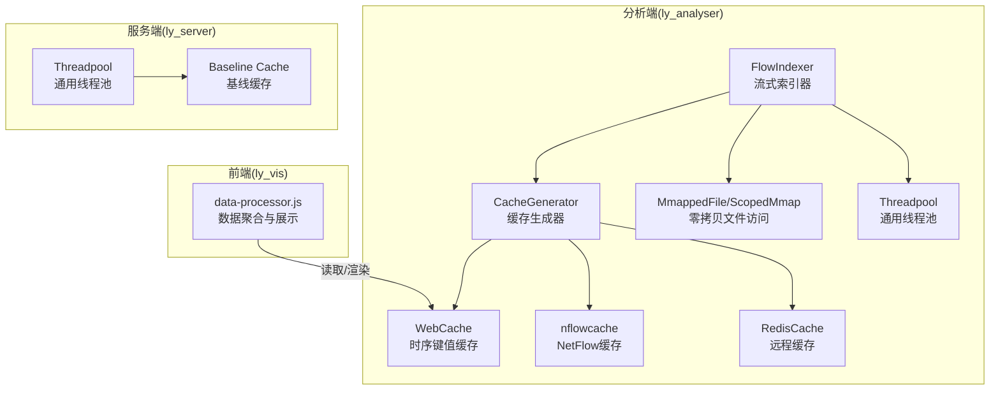
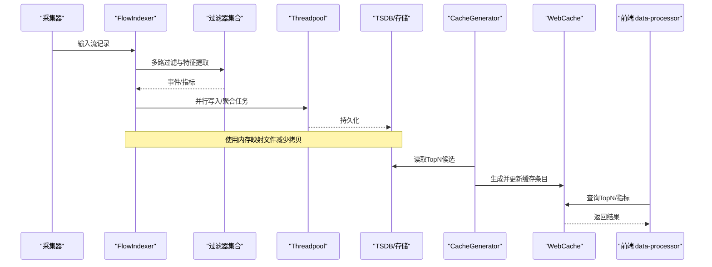
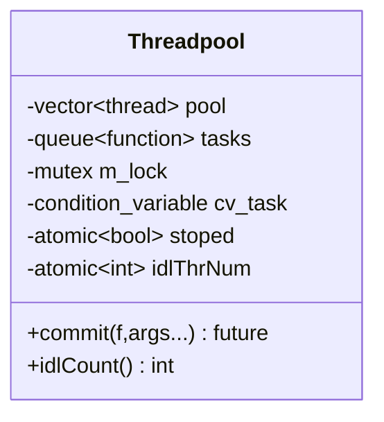
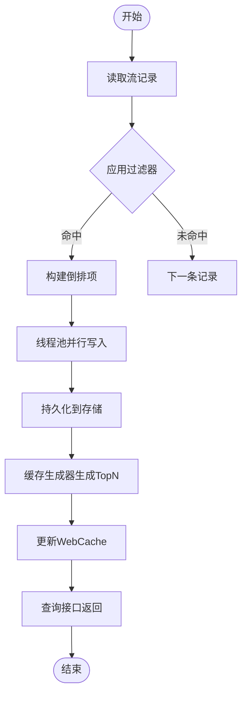
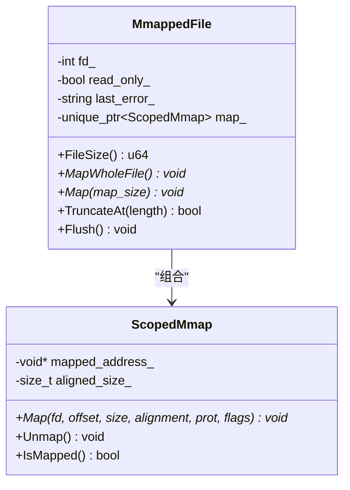
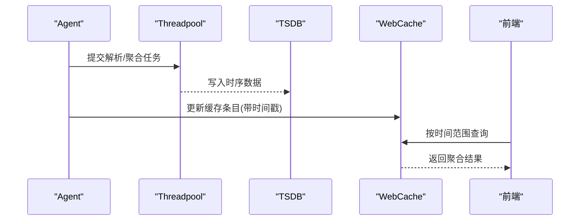
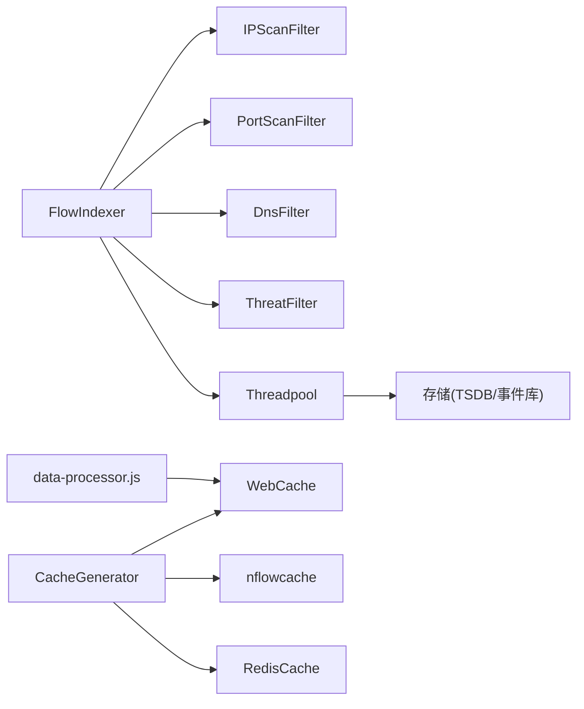

# 性能优化策略

<cite>
**本文引用的文件**
- [ly_analyser/src/agent/indexing/cache_generator.h](file://ly_analyser/src/agent/indexing/cache_generator.h)
- [ly_analyser/src/agent/indexing/flow_indexer.h](file://ly_analyser/src/agent/indexing/flow_indexer.h)
- [ly_analyser/src/common/threadpool.hpp](file://ly_analyser/src/common/threadpool.hpp)
- [ly_server/src/common/threadpool.hpp](file://ly_server/src/common/threadpool.hpp)
- [ly_analyser/src/agent/data/web_cache.h](file://ly_analyser/src/agent/data/web_cache.h)
- [ly_analyser/src/common/mmapped_file.h](file://ly_analyser/src/common/mmapped_file.h)
- [ly_analyser/src/common/scoped_mmap.h](file://ly_analyser/src/common/scoped_mmap.h)
- [ly_analyser/src/agent/dump/nflowcache.h](file://ly_analyser/src/agent/dump/nflowcache.h)
- [ly_analyser/src/agent/handlers/redis_cache.h](file://ly_analyser/src/agent/handlers/redis_cache.h)
- [ly_analyser/src/common/baseline/cache.h](file://ly_analyser/src/common/baseline/cache.h)
- [ly_server/src/common/baseline/cache.h](file://ly_server/src/common/baseline/cache.h)
- [ly_vis/packages/std/src/page/result/data-processor.js](file://ly_vis/packages/std/src/page/result/data-processor.js)
</cite>

## 目录
1. [简介](#简介)
2. [项目结构](#项目结构)
3. [核心组件](#核心组件)
4. [架构总览](#架构总览)
5. [详细组件分析](#详细组件分析)
6. [依赖关系分析](#依赖关系分析)
7. [性能考量与调优](#性能考量与调优)
8. [故障排查指南](#故障排查指南)
9. [结论](#结论)
10. [附录](#附录)

## 简介
本技术文档聚焦于高并发流量处理、索引构建与查询加速、时间精度与实时性提升，以及性能监控与调优实践。基于代码库中的线程池、内存映射文件、缓存生成器、流式索引器与前端数据聚合等关键实现，系统性地阐述多线程处理、内存池管理、零拷贝技术、倒排索引构建、缓存生成与查询加速机制，并提供可操作的监控指标与调优建议。

## 项目结构
本项目由多个子系统构成：
- ly_analyser：负责流量采集、解析、过滤、索引构建与缓存生成，包含 agent、common、dump、indexing 等模块。
- ly_server：提供服务端能力，复用 common 工具（如线程池、基线缓存）。
- ly_vis：前端可视化与数据处理，包含结果页的数据聚合与展示逻辑。

图表来源
- [ly_analyser/src/agent/indexing/flow_indexer.h:1-66](file://ly_analyser/src/agent/indexing/flow_indexer.h#L1-L66)
- [ly_analyser/src/agent/indexing/cache_generator.h:1-41](file://ly_analyser/src/agent/indexing/cache_generator.h#L1-L41)
- [ly_analyser/src/agent/data/web_cache.h:1-56](file://ly_analyser/src/agent/data/web_cache.h#L1-L56)
- [ly_analyser/src/common/mmapped_file.h:1-43](file://ly_analyser/src/common/mmapped_file.h#L1-L43)
- [ly_analyser/src/common/scoped_mmap.h:1-25](file://ly_analyser/src/common/scoped_mmap.h#L1-L25)
- [ly_analyser/src/agent/dump/nflowcache.h](file://ly_analyser/src/agent/dump/nflowcache.h)
- [ly_analyser/src/agent/handlers/redis_cache.h](file://ly_analyser/src/agent/handlers/redis_cache.h)
- [ly_analyser/src/common/threadpool.hpp:1-111](file://ly_analyser/src/common/threadpool.hpp#L1-L111)
- [ly_server/src/common/threadpool.hpp:1-111](file://ly_server/src/common/threadpool.hpp#L1-L111)
- [ly_vis/packages/std/src/page/result/data-processor.js:1-186](file://ly_vis/packages/std/src/page/result/data-processor.js#L1-L186)

章节来源
- [ly_analyser/src/agent/indexing/flow_indexer.h:1-66](file://ly_analyser/src/agent/indexing/flow_indexer.h#L1-L66)
- [ly_analyser/src/agent/indexing/cache_generator.h:1-41](file://ly_analyser/src/agent/indexing/cache_generator.h#L1-L41)
- [ly_analyser/src/common/threadpool.hpp:1-111](file://ly_analyser/src/common/threadpool.hpp#L1-L111)
- [ly_analyser/src/common/mmapped_file.h:1-43](file://ly_analyser/src/common/mmapped_file.h#L1-L43)
- [ly_analyser/src/common/scoped_mmap.h:1-25](file://ly_analyser/src/common/scoped_mmap.h#L1-L25)
- [ly_analyser/src/agent/data/web_cache.h:1-56](file://ly_analyser/src/agent/data/web_cache.h#L1-L56)
- [ly_vis/packages/std/src/page/result/data-processor.js:1-186](file://ly_vis/packages/std/src/page/result/data-processor.js#L1-L186)

## 核心组件
- 线程池（Threadpool）：提供任务提交、执行与返回值获取，支持条件变量唤醒与原子状态控制，用于高并发任务调度。
- 流式索引器（FlowIndexer）：对 NetFlow 数据进行多路过滤与特征提取，产出事件与指标并写入存储。
- 缓存生成器（CacheGenerator）：根据 TopN 请求生成预计算缓存条目，降低查询时延。
- WebCache：面向时序的键值缓存封装，支持按时间戳存取 Protobuf 消息。
- 零拷贝文件访问（MmappedFile/ScopedMmap）：通过内存映射避免内核态与用户态之间的多次拷贝，提升大文件读取效率。
- 前端数据处理器（data-processor.js）：在浏览器侧进行数据聚合、排序与展示优化，减少后端压力。

章节来源
- [ly_analyser/src/common/threadpool.hpp:1-111](file://ly_analyser/src/common/threadpool.hpp#L1-L111)
- [ly_analyser/src/agent/indexing/flow_indexer.h:1-66](file://ly_analyser/src/agent/indexing/flow_indexer.h#L1-L66)
- [ly_analyser/src/agent/indexing/cache_generator.h:1-41](file://ly_analyser/src/agent/indexing/cache_generator.h#L1-L41)
- [ly_analyser/src/agent/data/web_cache.h:1-56](file://ly_analyser/src/agent/data/web_cache.h#L1-L56)
- [ly_analyser/src/common/mmapped_file.h:1-43](file://ly_analyser/src/common/mmapped_file.h#L1-L43)
- [ly_analyser/src/common/scoped_mmap.h:1-25](file://ly_analyser/src/common/scoped_mmap.h#L1-L25)
- [ly_vis/packages/std/src/page/result/data-processor.js:1-186](file://ly_vis/packages/std/src/page/result/data-processor.js#L1-L186)

## 架构总览
下图展示了从流量采集到索引构建、缓存生成与查询的全链路流程，涵盖多线程、零拷贝与缓存加速的关键路径。

图表来源
- [ly_analyser/src/agent/indexing/flow_indexer.h:1-66](file://ly_analyser/src/agent/indexing/flow_indexer.h#L1-L66)
- [ly_analyser/src/agent/indexing/cache_generator.h:1-41](file://ly_analyser/src/agent/indexing/cache_generator.h#L1-L41)
- [ly_analyser/src/agent/data/web_cache.h:1-56](file://ly_analyser/src/agent/data/web_cache.h#L1-L56)
- [ly_analyser/src/common/threadpool.hpp:1-111](file://ly_analyser/src/common/threadpool.hpp#L1-L111)
- [ly_analyser/src/common/mmapped_file.h:1-43](file://ly_analyser/src/common/mmapped_file.h#L1-L43)
- [ly_vis/packages/std/src/page/result/data-processor.js:1-186](file://ly_vis/packages/std/src/page/result/data-processor.js#L1-L186)

## 详细组件分析

### 多线程处理：线程池（Threadpool）
- 设计要点
  - 固定大小线程池，任务队列 + 条件变量唤醒，避免忙轮询。
  - 使用原子变量控制停止标志与空闲线程计数，保证线程安全。
  - 支持提交任意可调用对象并返回 future，便于异步结果收集。
- 适用场景
  - 流式索引过程中的批量写入、聚合计算。
  - 缓存生成阶段的并行扫描与合并。
- 复杂度与性能
  - 任务入队/出队为 O(1)，整体吞吐受限于线程数与任务粒度。
  - 合理设置线程池大小以匹配 CPU 核数与 I/O 特性。

图表来源
- [ly_analyser/src/common/threadpool.hpp:1-111](file://ly_analyser/src/common/threadpool.hpp#L1-L111)
- [ly_server/src/common/threadpool.hpp:1-111](file://ly_server/src/common/threadpool.hpp#L1-L111)

章节来源
- [ly_analyser/src/common/threadpool.hpp:1-111](file://ly_analyser/src/common/threadpool.hpp#L1-L111)
- [ly_server/src/common/threadpool.hpp:1-111](file://ly_server/src/common/threadpool.hpp#L1-L111)

### 索引优化：倒排索引构建与查询加速
- 倒排索引构建
  - FlowIndexer 维护多种过滤器（IP 扫描、端口扫描、DNS、威胁检测等），将原始流记录转换为结构化事件与指标。
  - 通过并行任务将事件写入事件数据库，指标写入时序存储，形成“字段→记录”的倒排结构。
- 缓存生成器
  - CacheGenerator 依据 TopN 请求生成预计算缓存条目，减少在线查询时的聚合开销。
  - 结合 WebCache 的时序键值接口，按时间窗口快速定位热点数据。
- 查询加速
  - 前端 data-processor 对结果进行本地聚合与排序，降低网络与后端压力。
  - 使用内存映射文件直接访问底层数据文件，减少拷贝与上下文切换。

图表来源
- [ly_analyser/src/agent/indexing/flow_indexer.h:1-66](file://ly_analyser/src/agent/indexing/flow_indexer.h#L1-L66)
- [ly_analyser/src/agent/indexing/cache_generator.h:1-41](file://ly_analyser/src/agent/indexing/cache_generator.h#L1-L41)
- [ly_analyser/src/agent/data/web_cache.h:1-56](file://ly_analyser/src/agent/data/web_cache.h#L1-L56)
- [ly_analyser/src/common/threadpool.hpp:1-111](file://ly_analyser/src/common/threadpool.hpp#L1-L111)

章节来源
- [ly_analyser/src/agent/indexing/flow_indexer.h:1-66](file://ly_analyser/src/agent/indexing/flow_indexer.h#L1-L66)
- [ly_analyser/src/agent/indexing/cache_generator.h:1-41](file://ly_analyser/src/agent/indexing/cache_generator.h#L1-L41)
- [ly_analyser/src/agent/data/web_cache.h:1-56](file://ly_analyser/src/agent/data/web_cache.h#L1-L56)
- [ly_analyser/src/common/threadpool.hpp:1-111](file://ly_analyser/src/common/threadpool.hpp#L1-L111)

### 零拷贝技术：内存映射文件（MmappedFile/ScopedMmap）
- 设计要点
  - 通过操作系统内存映射将文件地址空间直接暴露给用户态，避免 read/write 的系统调用与多次拷贝。
  - ScopedMmap 封装映射生命周期，确保自动释放；MmappedFile 提供统一 API（MapWholeFile、TruncateAt、Flush）。
- 适用场景
  - 大文件顺序读取（如 NetFlow 文件）、日志文件高效访问。
  - 配合 TSDB/存储层，实现低延迟的数据访问。
- 注意事项
  - 截断后需重新映射；写操作需谨慎处理并发与一致性。

图表来源
- [ly_analyser/src/common/mmapped_file.h:1-43](file://ly_analyser/src/common/mmapped_file.h#L1-L43)
- [ly_analyser/src/common/scoped_mmap.h:1-25](file://ly_analyser/src/common/scoped_mmap.h#L1-L25)

章节来源
- [ly_analyser/src/common/mmapped_file.h:1-43](file://ly_analyser/src/common/mmapped_file.h#L1-L43)
- [ly_analyser/src/common/scoped_mmap.h:1-25](file://ly_analyser/src/common/scoped_mmap.h#L1-L25)

### 时间精度优化与实时处理能力
- 时间维度缓存
  - WebCache 支持按时间戳存取 Protobuf 消息，便于按时间窗口快速检索与聚合。
- 实时处理
  - 使用线程池并行处理流记录，缩短端到端时延。
  - 结合 nflowcache 与 RedisCache，实现热点数据的近实时缓存与跨进程共享。
- 前端优化
  - data-processor 在浏览器侧完成聚合与排序，减少往返次数与后端负载。

图表来源
- [ly_analyser/src/agent/data/web_cache.h:1-56](file://ly_analyser/src/agent/data/web_cache.h#L1-L56)
- [ly_analyser/src/common/threadpool.hpp:1-111](file://ly_analyser/src/common/threadpool.hpp#L1-L111)
- [ly_analyser/src/agent/dump/nflowcache.h](file://ly_analyser/src/agent/dump/nflowcache.h)
- [ly_analyser/src/agent/handlers/redis_cache.h](file://ly_analyser/src/agent/handlers/redis_cache.h)
- [ly_vis/packages/std/src/page/result/data-processor.js:1-186](file://ly_vis/packages/std/src/page/result/data-processor.js#L1-L186)

章节来源
- [ly_analyser/src/agent/data/web_cache.h:1-56](file://ly_analyser/src/agent/data/web_cache.h#L1-L56)
- [ly_analyser/src/common/threadpool.hpp:1-111](file://ly_analyser/src/common/threadpool.hpp#L1-L111)
- [ly_analyser/src/agent/dump/nflowcache.h](file://ly_analyser/src/agent/dump/nflowcache.h)
- [ly_analyser/src/agent/handlers/redis_cache.h](file://ly_analyser/src/agent/handlers/redis_cache.h)
- [ly_vis/packages/std/src/page/result/data-processor.js:1-186](file://ly_vis/packages/std/src/page/result/data-processor.js#L1-L186)

### 基准测试与最佳实践建议
- 线程池
  - 建议线程数 ≈ CPU 核数；I/O 密集型可适当增加。
  - 任务粒度应足够大以降低调度开销。
- 零拷贝
  - 优先使用 MapWholeFile 进行顺序读取；写操作注意并发与 flush 时机。
- 缓存
  - 热点 TopN 预计算，按时间窗口分片存储；定期刷新避免过期。
- 前端
  - 尽量在浏览器侧完成聚合与排序，减少后端压力；分页与增量加载。

[本节为通用指导，不直接分析具体文件]

## 依赖关系分析
- 组件耦合
  - FlowIndexer 依赖多种过滤器与存储抽象，职责清晰但耦合较多，可通过接口抽象进一步解耦。
  - CacheGenerator 依赖配置与存储，输出到 WebCache，形成“生成—消费”的单向依赖。
  - Threadpool 被多处复用，作为基础设施提供并发能力。
- 外部依赖
  - Protobuf 序列化用于缓存键值；NetFlow 解析依赖 dump 模块。
  - 前端依赖 lodash 进行数据链式处理。

图表来源
- [ly_analyser/src/agent/indexing/flow_indexer.h:1-66](file://ly_analyser/src/agent/indexing/flow_indexer.h#L1-L66)
- [ly_analyser/src/agent/indexing/cache_generator.h:1-41](file://ly_analyser/src/agent/indexing/cache_generator.h#L1-L41)
- [ly_analyser/src/agent/data/web_cache.h:1-56](file://ly_analyser/src/agent/data/web_cache.h#L1-L56)
- [ly_analyser/src/common/threadpool.hpp:1-111](file://ly_analyser/src/common/threadpool.hpp#L1-L111)
- [ly_analyser/src/agent/dump/nflowcache.h](file://ly_analyser/src/agent/dump/nflowcache.h)
- [ly_analyser/src/agent/handlers/redis_cache.h](file://ly_analyser/src/agent/handlers/redis_cache.h)
- [ly_vis/packages/std/src/page/result/data-processor.js:1-186](file://ly_vis/packages/std/src/page/result/data-processor.js#L1-L186)

章节来源
- [ly_analyser/src/agent/indexing/flow_indexer.h:1-66](file://ly_analyser/src/agent/indexing/flow_indexer.h#L1-L66)
- [ly_analyser/src/agent/indexing/cache_generator.h:1-41](file://ly_analyser/src/agent/indexing/cache_generator.h#L1-L41)
- [ly_analyser/src/agent/data/web_cache.h:1-56](file://ly_analyser/src/agent/data/web_cache.h#L1-L56)
- [ly_analyser/src/common/threadpool.hpp:1-111](file://ly_analyser/src/common/threadpool.hpp#L1-L111)
- [ly_vis/packages/std/src/page/result/data-processor.js:1-186](file://ly_vis/packages/std/src/page/result/data-processor.js#L1-L186)

## 性能考量与调优
- 高并发流量处理
  - 使用线程池并行处理流记录与聚合任务，合理设置线程数以匹配硬件资源。
  - 将 I/O 密集与 CPU 密集任务分离，避免阻塞。
- 内存池管理与零拷贝
  - 使用内存映射文件减少拷贝与系统调用开销；对频繁分配的场景考虑对象池或内存池。
  - 注意内存占用与页面失效的影响，避免过度映射导致缺页中断。
- 索引优化
  - 构建倒排索引时，按热点字段建立索引；对冷数据采用分层存储。
  - 缓存生成器针对 TopN 与常用聚合预计算，降低查询时延。
- 时间精度与实时性
  - 按时间窗口分片缓存，提高局部性；前端增量加载与分页减少一次性传输量。
- 监控指标与工具
  - 线程池：空闲线程数、任务队列长度、任务耗时分布。
  - 缓存：命中率、过期率、读写延迟。
  - 存储：写入吞吐、查询延迟、磁盘 I/O 利用率。
  - 前端：首屏时间、聚合耗时、网络往返次数。

[本节为通用指导，不直接分析具体文件]

## 故障排查指南
- 线程池相关问题
  - 任务堆积：检查队列长度与消费者速度；调整线程池大小或任务粒度。
  - 死锁/饥饿：避免长时间持有锁；确保任务无阻塞等待。
- 零拷贝问题
  - 映射失败：检查文件大小与权限；确认 TruncateAt 后重新映射。
  - 数据不一致：写操作需同步 flush；读多写少场景更稳定。
- 缓存问题
  - 命中率低：优化缓存键设计与预热策略；关注热点变化。
  - 过期策略：按业务需求调整 TTL 与刷新频率。
- 前端性能
  - 大数据集渲染：使用分页与虚拟列表；减少不必要的重绘。
  - 聚合逻辑：尽量在浏览器侧完成，避免重复计算。

章节来源
- [ly_analyser/src/common/threadpool.hpp:1-111](file://ly_analyser/src/common/threadpool.hpp#L1-L111)
- [ly_analyser/src/common/mmapped_file.h:1-43](file://ly_analyser/src/common/mmapped_file.h#L1-L43)
- [ly_analyser/src/agent/data/web_cache.h:1-56](file://ly_analyser/src/agent/data/web_cache.h#L1-L56)
- [ly_vis/packages/std/src/page/result/data-processor.js:1-186](file://ly_vis/packages/std/src/page/result/data-processor.js#L1-L186)

## 结论
本方案通过线程池实现高并发任务调度，利用内存映射文件达成零拷贝以提升 I/O 效率，结合倒排索引与缓存生成器实现查询加速，并在前端进行数据聚合优化。整体架构兼顾实时性与可扩展性，适用于大规模流量分析与可视化场景。建议在部署中结合监控指标持续调优，确保系统在峰值流量下保持稳定与高效。

[本节为总结性内容，不直接分析具体文件]

## 附录
- 相关组件文件路径
  - 线程池：[ly_analyser/src/common/threadpool.hpp](file://ly_analyser/src/common/threadpool.hpp)、[ly_server/src/common/threadpool.hpp](file://ly_server/src/common/threadpool.hpp)
  - 索引与缓存：[ly_analyser/src/agent/indexing/flow_indexer.h](file://ly_analyser/src/agent/indexing/flow_indexer.h)、[ly_analyser/src/agent/indexing/cache_generator.h](file://ly_analyser/src/agent/indexing/cache_generator.h)、[ly_analyser/src/agent/data/web_cache.h](file://ly_analyser/src/agent/data/web_cache.h)
  - 零拷贝：[ly_analyser/src/common/mmapped_file.h](file://ly_analyser/src/common/mmapped_file.h)、[ly_analyser/src/common/scoped_mmap.h](file://ly_analyser/src/common/scoped_mmap.h)
  - 其他缓存：[ly_analyser/src/agent/dump/nflowcache.h](file://ly_analyser/src/agent/dump/nflowcache.h)、[ly_analyser/src/agent/handlers/redis_cache.h](file://ly_analyser/src/agent/handlers/redis_cache.h)、[ly_analyser/src/common/baseline/cache.h](file://ly_analyser/src/common/baseline/cache.h)、[ly_server/src/common/baseline/cache.h](file://ly_server/src/common/baseline/cache.h)
  - 前端处理：[ly_vis/packages/std/src/page/result/data-processor.js](file://ly_vis/packages/std/src/page/result/data-processor.js)

[本节为参考信息，不直接分析具体文件]