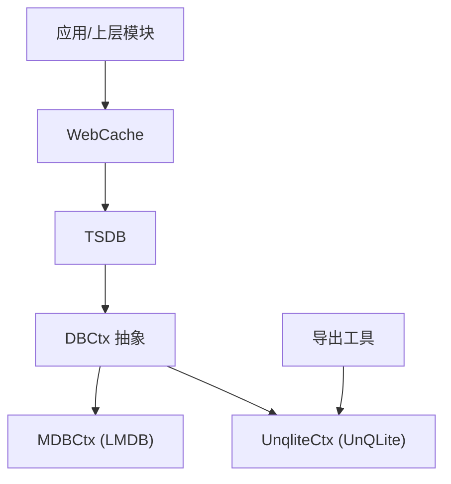
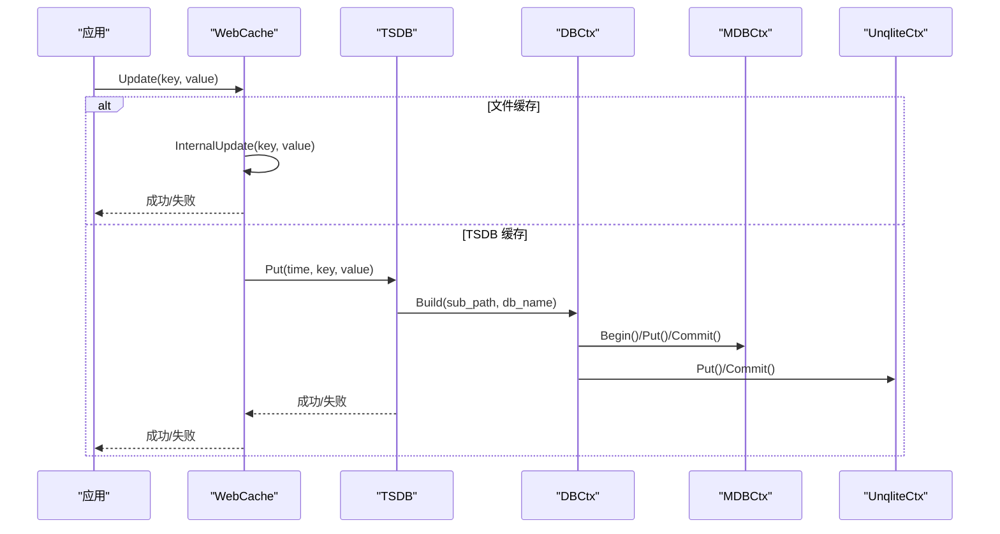
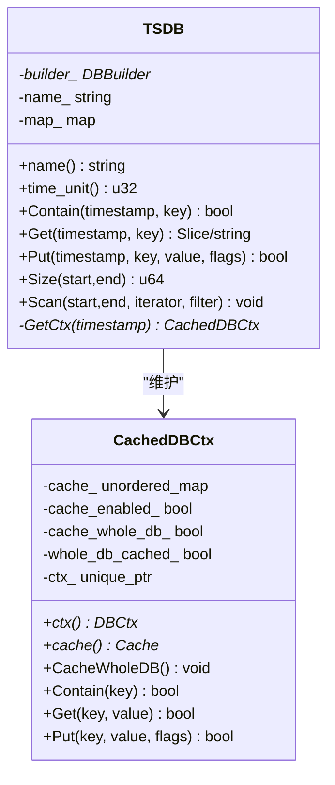
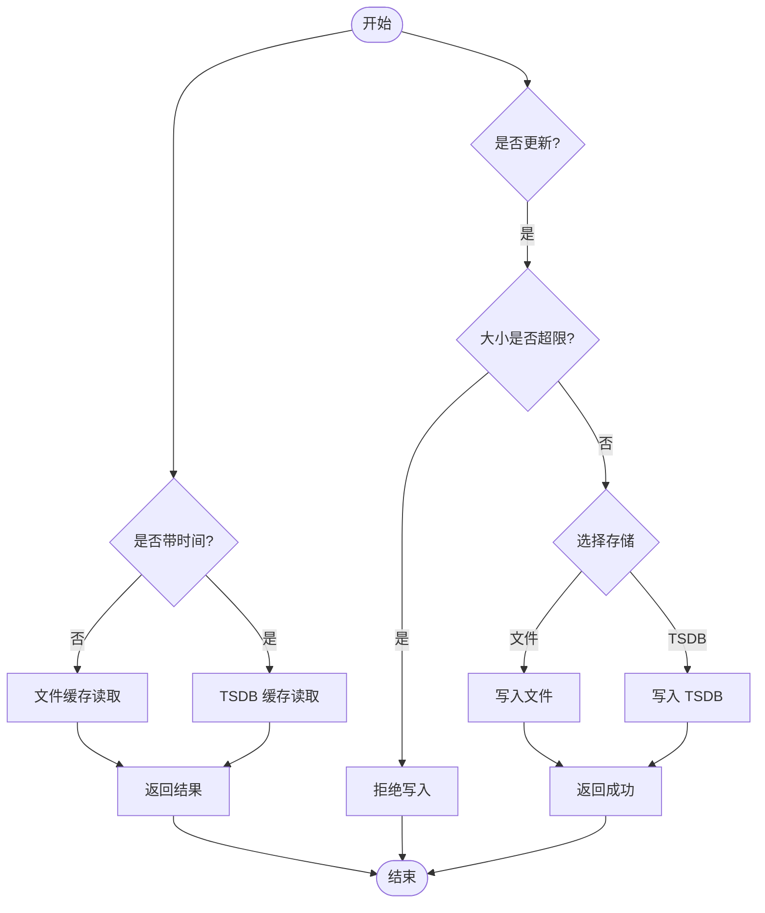
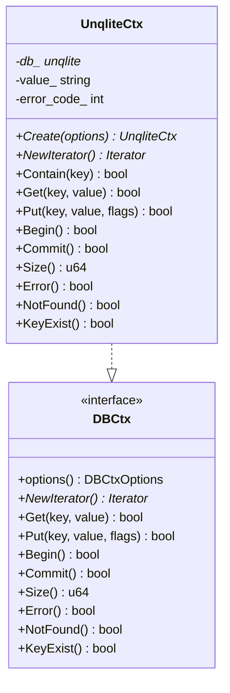
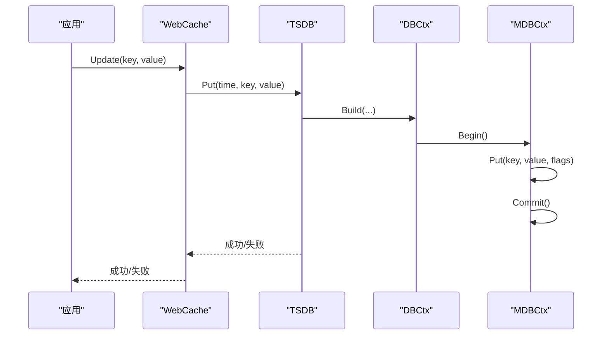
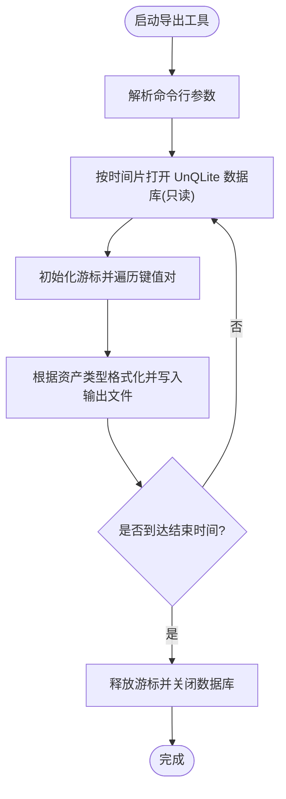
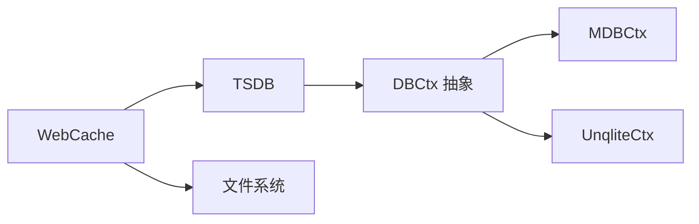

# 数据存储层

<cite>
**本文引用的文件**
- [tsdb.h](file://ly_analyser/src/agent/data/tsdb.h)
- [tsdb.cpp](file://ly_analyser/src/agent/data/tsdb.cpp)
- [web_cache.h](file://ly_analyser/src/agent/data/web_cache.h)
- [web_cache.cpp](file://ly_analyser/src/agent/data/web_cache.cpp)
- [unqlite_db.h](file://ly_analyser/src/agent/data/unqlite_db.h)
- [unqlite_db.cpp](file://ly_analyser/src/agent/data/unqlite_db.cpp)
- [mdb.h](file://ly_analyser/src/agent/data/mdb.h)
- [mdb.cpp](file://ly_analyser/src/agent/data/mdb.cpp)
- [dbctx.h](file://ly_analyser/src/agent/data/dbctx.h)
- [output_unqlite.cpp](file://ly_analyser/src/agent/handlers/output_unqlite.cpp)
</cite>

## 目录
1. [简介](#简介)
2. [项目结构](#项目结构)
3. [核心组件](#核心组件)
4. [架构总览](#架构总览)
5. [详细组件分析](#详细组件分析)
6. [依赖关系分析](#依赖关系分析)
7. [性能考量](#性能考量)
8. [故障排查指南](#故障排查指南)
9. [结论](#结论)
10. [附录](#附录)

## 简介
本技术文档聚焦于数据存储层的设计与实现，覆盖以下关键主题：
- 时序数据库（TSDB）：时间序列数据的存储结构、索引策略与查询优化。
- Web 缓存系统：缓存策略、失效机制与性能优化。
- UnQLite 嵌入式数据库：使用场景与配置方法。
- 数据持久化流程：写入、批量操作与事务管理。
- 备份恢复与数据迁移：导出工具与使用方法。

## 项目结构
数据存储层位于 ly_analyser/src/agent/data 目录下，主要包含：
- TSDB：按时间分片键值存储的时序数据库抽象，提供 Put/Get/Scan/Size 等接口。
- WebCache：面向 Web 请求的缓存层，支持基于文件的缓存与基于 TSDB 的时间维度缓存。
- DBCtx 抽象与实现：统一 KV 存储接口，具体实现包括 MDB（LMDB）与 UnQLite。
- DBBuilder：根据选项构建具体 DBCtx 实例。
- 导出工具：用于从 UnQLite 数据库中导出资产数据到 CSV/JSON。

图表来源
- [web_cache.h:15-53](file://ly_analyser/src/agent/data/web_cache.h#L15-L53)
- [tsdb.h:11-76](file://ly_analyser/src/agent/data/tsdb.h#L11-L76)
- [dbctx.h:9-85](file://ly_analyser/src/agent/data/dbctx.h#L9-L85)
- [mdb.h:8-34](file://ly_analyser/src/agent/data/mdb.h#L8-L34)
- [unqlite_db.h:11-36](file://ly_analyser/src/agent/data/unqlite_db.h#L11-L36)
- [output_unqlite.cpp:181-309](file://ly_analyser/src/agent/handlers/output_unqlite.cpp#L181-L309)

章节来源
- [web_cache.h:15-53](file://ly_analyser/src/agent/data/web_cache.h#L15-L53)
- [tsdb.h:11-76](file://ly_analyser/src/agent/data/tsdb.h#L11-L76)
- [dbctx.h:9-85](file://ly_analyser/src/agent/data/dbctx.h#L9-L85)
- [mdb.h:8-34](file://ly_analyser/src/agent/data/mdb.h#L8-L34)
- [unqlite_db.h:11-36](file://ly_analyser/src/agent/data/unqlite_db.h#L11-L36)
- [output_unqlite.cpp:181-309](file://ly_analyser/src/agent/handlers/output_unqlite.cpp#L181-L309)

## 核心组件
- TSDB：以时间为单位进行分片，每个时间片对应一个底层 KV 存储上下文；内部维护每时间片的缓存上下文，支持可选的全库缓存。
- WebCache：对外提供带时间或不带时间的 Get/Update 接口；内部可选择文件缓存或 TSDB 缓存；对 Protobuf 消息提供序列化/反序列化支持。
- DBCtx 抽象：定义统一的 KV 接口（Get/Put/Iterator/Begin/Commit/Size/Error/NotFound/KeyExist），屏蔽底层差异。
- MDBCtx：基于 LMDB 的高性能 KV 存储实现，支持事务、游标迭代、重复值排序等特性。
- UnqliteCtx：基于 UnQLite 的轻量 KV 存储实现，适合嵌入式场景与简单 KV 需求。
- DBBuilder：根据 DBCtxOptions 创建具体 DBCtx 实例，并支持子路径与数据库名组合。

章节来源
- [tsdb.h:11-76](file://ly_analyser/src/agent/data/tsdb.h#L11-L76)
- [tsdb.cpp:61-73](file://ly_analyser/src/agent/data/tsdb.cpp#L61-L73)
- [web_cache.h:15-53](file://ly_analyser/src/agent/data/web_cache.h#L15-L53)
- [web_cache.cpp:82-102](file://ly_analyser/src/agent/data/web_cache.cpp#L82-L102)
- [dbctx.h:9-85](file://ly_analyser/src/agent/data/dbctx.h#L9-L85)
- [mdb.h:8-34](file://ly_analyser/src/agent/data/mdb.h#L8-L34)
- [unqlite_db.h:11-36](file://ly_analyser/src/agent/data/unqlite_db.h#L11-L36)

## 架构总览
下图展示了从上层调用到具体存储后端的完整链路，以及 TSDB 的分片与缓存机制。

图表来源
- [web_cache.cpp:129-160](file://ly_analyser/src/agent/data/web_cache.cpp#L129-L160)
- [tsdb.cpp:111-120](file://ly_analyser/src/agent/data/tsdb.cpp#L111-L120)
- [mdb.cpp:196-240](file://ly_analyser/src/agent/data/mdb.cpp#L196-L240)
- [unqlite_db.cpp:168-172](file://ly_analyser/src/agent/data/unqlite_db.cpp#L168-L172)

章节来源
- [web_cache.cpp:129-160](file://ly_analyser/src/agent/data/web_cache.cpp#L129-L160)
- [tsdb.cpp:111-120](file://ly_analyser/src/agent/data/tsdb.cpp#L111-L120)
- [mdb.cpp:196-240](file://ly_analyser/src/agent/data/mdb.cpp#L196-L240)
- [unqlite_db.cpp:168-172](file://ly_analyser/src/agent/data/unqlite_db.cpp#L168-L172)

## 详细组件分析

### 时序数据库（TSDB）设计与实现
- 时间分片与索引策略
  - 通过 time_unit 将时间戳对齐到固定步长，作为分片键；每个分片对应一个 DBCtx 实例，由 DBBuilder 根据日期与名称构建。
  - 扫描时按步长遍历各分片，保证查询范围不遗漏。
- 查询优化
  - 每时间片维护 CachedDBCtx，支持可选的全库缓存（一次性加载到内存哈希表）与按需缓存（读时填充）。
  - Size/Scan 在过滤条件下采用迭代器回调，避免不必要的对象构造。
- 数据结构与复杂度
  - map_ 为 u32 -> CachedDBCtx 的映射，查找复杂度 O(1)。
  - 全库缓存空间复杂度 O(N)，N 为单时间片条目数；按需缓存空间复杂度取决于访问模式。
- 错误处理
  - 构造失败返回空指针；析构时根据 auto_commit 选项提交事务。

图表来源
- [tsdb.h:11-76](file://ly_analyser/src/agent/data/tsdb.h#L11-L76)
- [tsdb.cpp:17-57](file://ly_analyser/src/agent/data/tsdb.cpp#L17-L57)
- [tsdb.cpp:61-73](file://ly_analyser/src/agent/data/tsdb.cpp#L61-L73)

章节来源
- [tsdb.h:11-76](file://ly_analyser/src/agent/data/tsdb.h#L11-L76)
- [tsdb.cpp:17-73](file://ly_analyser/src/agent/data/tsdb.cpp#L17-L73)
- [tsdb.cpp:122-175](file://ly_analyser/src/agent/data/tsdb.cpp#L122-L175)

### Web 缓存系统
- 缓存策略
  - 文件缓存：将 key 经 SHA256 后生成两级目录结构，落盘为文件；适用于静态或低频更新内容。
  - TSDB 缓存：基于 TSDB 的时间维度存储，支持按时间获取与更新；适合需要历史版本或时间序列的缓存。
- 失效机制
  - 文件缓存：通过覆盖写实现更新；无显式过期策略，需外部清理。
  - TSDB 缓存：按时间分片存储，可通过删除时间片或滚动策略实现“软过期”。
- 性能优化
  - 条目大小限制：超过阈值直接拒绝写入，防止大对象影响性能。
  - Protobuf 支持：通过 TextFormat 序列化/反序列化，便于调试与跨语言交换。

图表来源
- [web_cache.cpp:25-53](file://ly_analyser/src/agent/data/web_cache.cpp#L25-L53)
- [web_cache.cpp:82-102](file://ly_analyser/src/agent/data/web_cache.cpp#L82-L102)
- [web_cache.cpp:105-160](file://ly_analyser/src/agent/data/web_cache.cpp#L105-L160)

章节来源
- [web_cache.h:15-53](file://ly_analyser/src/agent/data/web_cache.h#L15-L53)
- [web_cache.cpp:25-53](file://ly_analyser/src/agent/data/web_cache.cpp#L25-L53)
- [web_cache.cpp:82-102](file://ly_analyser/src/agent/data/web_cache.cpp#L82-L102)
- [web_cache.cpp:105-160](file://ly_analyser/src/agent/data/web_cache.cpp#L105-L160)

### UnQLite 嵌入式数据库
- 使用场景
  - 轻量级 KV 存储，适合嵌入式环境或不需要复杂事务的场景。
  - 与 TSDB 结合，作为后端存储之一。
- 配置方法
  - 通过 DBCtxOptions 指定 db_path、db_name、read_only 等参数。
  - 打开模式支持只读与创建；支持游标迭代与基本 KV 操作。
- 事务与一致性
  - Commit 封装底层提交；只读模式下提交视为成功。

图表来源
- [unqlite_db.h:11-36](file://ly_analyser/src/agent/data/unqlite_db.h#L11-L36)
- [unqlite_db.cpp:123-187](file://ly_analyser/src/agent/data/unqlite_db.cpp#L123-L187)
- [dbctx.h:9-85](file://ly_analyser/src/agent/data/dbctx.h#L9-L85)

章节来源
- [unqlite_db.h:11-36](file://ly_analyser/src/agent/data/unqlite_db.h#L11-L36)
- [unqlite_db.cpp:123-187](file://ly_analyser/src/agent/data/unqlite_db.cpp#L123-L187)
- [dbctx.h:9-85](file://ly_analyser/src/agent/data/dbctx.h#L9-L85)

### 数据持久化流程
- 写入流程
  - WebCache.Update 可路由至文件缓存或 TSDB 缓存；TSDB.Put 最终调用 DBCtx.Put。
  - MDBCtx.Put 支持多种标志位（如 NODUPDATA、NOOVERWRITE、APPEND、APPENDDUP），适配不同写入语义。
  - UnqliteCtx.Put 直接调用底层 KV 存储。
- 批量操作
  - 通过迭代器与循环进行批量扫描与写入；注意在 MDB 中开启事务以减少同步开销。
- 事务管理
  - MDBCtx 使用 Begin/Commit 包裹一组操作；UnqliteCtx 的 Commit 封装底层提交。
  - TSDB::CachedDBCtx 析构时根据 auto_commit 自动提交，确保数据落盘。

图表来源
- [web_cache.cpp:129-160](file://ly_analyser/src/agent/data/web_cache.cpp#L129-L160)
- [tsdb.cpp:111-120](file://ly_analyser/src/agent/data/tsdb.cpp#L111-L120)
- [mdb.cpp:250-297](file://ly_analyser/src/agent/data/mdb.cpp#L250-L297)

章节来源
- [web_cache.cpp:129-160](file://ly_analyser/src/agent/data/web_cache.cpp#L129-L160)
- [tsdb.cpp:111-120](file://ly_analyser/src/agent/data/tsdb.cpp#L111-L120)
- [mdb.cpp:250-297](file://ly_analyser/src/agent/data/mdb.cpp#L250-L297)
- [unqlite_db.cpp:168-187](file://ly_analyser/src/agent/data/unqlite_db.cpp#L168-L187)

### 备份恢复与数据迁移
- 导出工具
  - output_unqlite.cpp 提供命令行工具，按时间范围与资产类型从 UnQLite 数据库导出为 CSV/JSON。
  - 支持多类型资产（IP、URL、Host、Srv），输出字段根据类型动态生成。
- 使用方法
  - 通过命令行参数指定输入设备 ID、起止时间、资产类型与输出文件路径。
  - 程序按小时步进遍历时间片，打开只读数据库并迭代键值对，写入输出文件。

图表来源
- [output_unqlite.cpp:181-309](file://ly_analyser/src/agent/handlers/output_unqlite.cpp#L181-L309)

章节来源
- [output_unqlite.cpp:181-309](file://ly_analyser/src/agent/handlers/output_unqlite.cpp#L181-L309)

## 依赖关系分析
- 组件耦合
  - WebCache 依赖 TSDB 与文件 IO；TSDB 依赖 DBCtx 抽象与 DBBuilder。
  - DBCtx 抽象解耦了 MDB 与 UnQLite 的具体实现，降低耦合度。
- 外部依赖
  - LMDB（MDB）：高性能 KV 存储，支持事务与游标。
  - UnQLite：轻量 KV 存储，适合嵌入式场景。
- 潜在循环依赖
  - 当前设计通过抽象与组合避免循环依赖；TSDB 仅依赖 DBCtx 接口。

图表来源
- [web_cache.h:15-53](file://ly_analyser/src/agent/data/web_cache.h#L15-L53)
- [tsdb.h:11-76](file://ly_analyser/src/agent/data/tsdb.h#L11-L76)
- [dbctx.h:9-85](file://ly_analyser/src/agent/data/dbctx.h#L9-L85)
- [mdb.h:8-34](file://ly_analyser/src/agent/data/mdb.h#L8-L34)
- [unqlite_db.h:11-36](file://ly_analyser/src/agent/data/unqlite_db.h#L11-L36)

章节来源
- [web_cache.h:15-53](file://ly_analyser/src/agent/data/web_cache.h#L15-L53)
- [tsdb.h:11-76](file://ly_analyser/src/agent/data/tsdb.h#L11-L76)
- [dbctx.h:9-85](file://ly_analyser/src/agent/data/dbctx.h#L9-L85)
- [mdb.h:8-34](file://ly_analyser/src/agent/data/mdb.h#L8-L34)
- [unqlite_db.h:11-36](file://ly_analyser/src/agent/data/unqlite_db.h#L11-L36)

## 性能考量
- TSDB
  - 时间分片减少单次查询范围；全库缓存提升热点读性能，但增加内存占用。
  - 扫描时按步长遍历，避免重复计算；过滤器在迭代阶段应用，减少中间对象。
- WebCache
  - 文件缓存适合静态内容；TSDB 缓存支持时间维度查询，适合动态内容。
  - 条目大小限制防止大对象阻塞 I/O。
- MDB
  - 事务批量提交减少磁盘同步次数；游标迭代高效。
  - 合理设置 mapsize 与 maxdbs 以适应数据规模。
- UnQLite
  - 轻量且易于集成；适合小数据集与嵌入式场景。

[本节为通用性能讨论，不直接分析具体文件]

## 故障排查指南
- 常见问题
  - 数据库打开失败：检查路径权限与只读/创建模式；查看日志中的错误码。
  - 事务提交失败：确认未处于只读模式；检查底层错误码。
  - 缓存未命中：确认缓存开关与全库缓存标记；检查 Key 是否一致。
- 调试建议
  - 启用 DEBUG 日志，观察 Get/Put/Commit 调用链。
  - 使用导出工具验证数据完整性与格式。

章节来源
- [mdb.cpp:107-149](file://ly_analyser/src/agent/data/mdb.cpp#L107-L149)
- [unqlite_db.cpp:130-146](file://ly_analyser/src/agent/data/unqlite_db.cpp#L130-L146)
- [tsdb.cpp:13-15](file://ly_analyser/src/agent/data/tsdb.cpp#L13-L15)

## 结论
本数据存储层通过 TSDB 的时间分片与缓存机制、WebCache 的多策略缓存、以及 DBCtx 抽象下的 MDB/UnQLite 双后端，实现了高内聚、低耦合的数据持久化方案。配合导出工具，可满足备份恢复与数据迁移需求。在实际部署中，应根据数据规模与访问模式选择合适的缓存策略与后端存储，并合理配置事务与资源参数以获得最佳性能。

[本节为总结性内容，不直接分析具体文件]

## 附录
- 术语
  - 时间分片：按固定时间步长将数据切分为多个独立存储单元。
  - 游标：用于顺序或定位访问 KV 存储的迭代器。
  - 事务：一组操作的原子执行单元，确保一致性。
- 参考
  - LMDB：高性能嵌入式键值数据库。
  - UnQLite：轻量级嵌入式键值数据库。

[本节为补充说明，不直接分析具体文件]