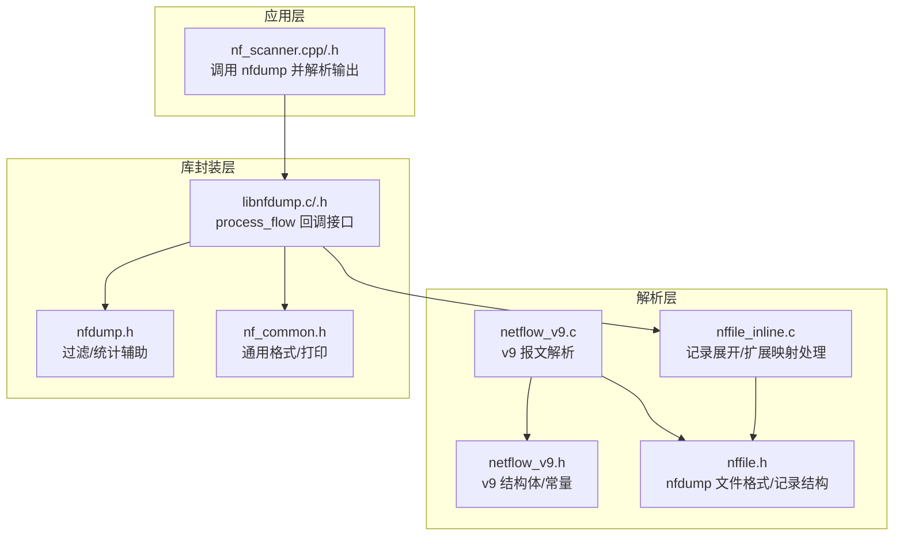
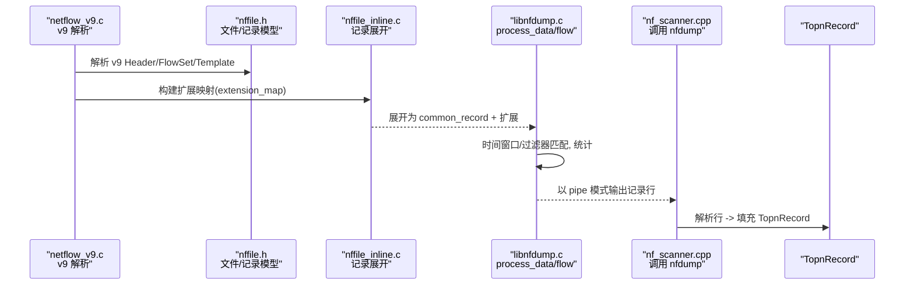
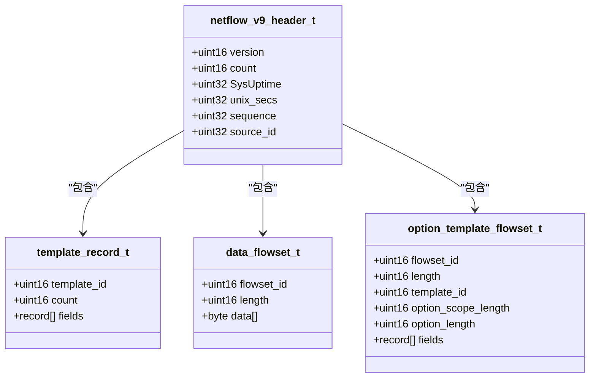
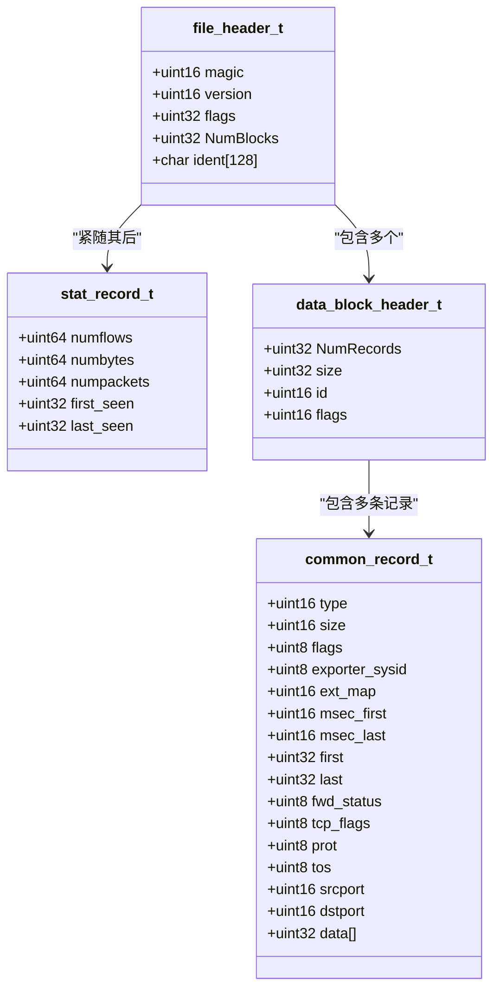
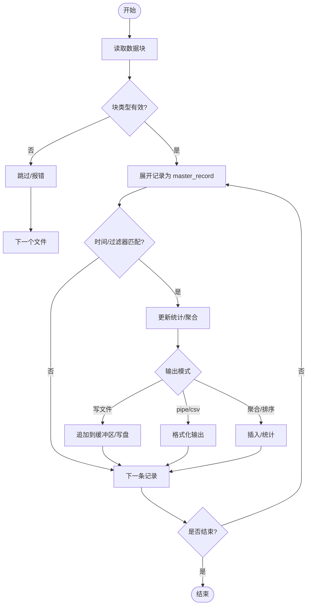
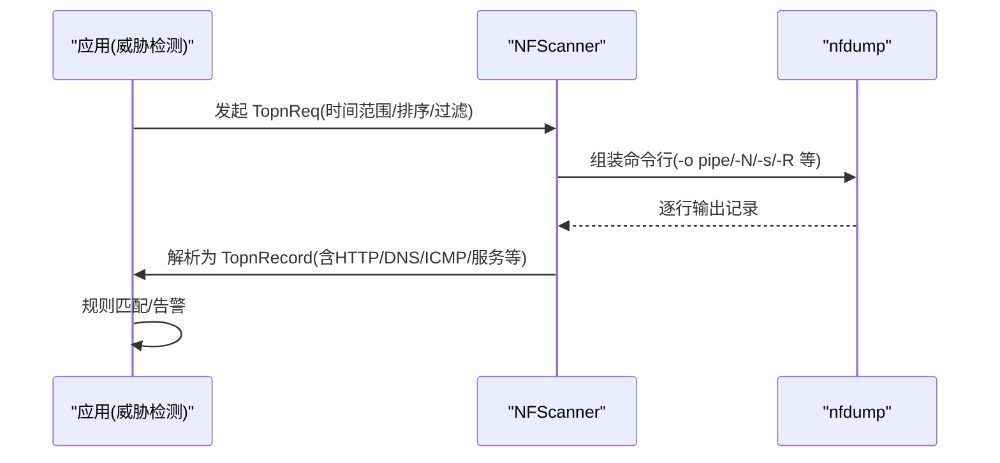
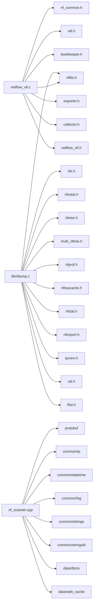

# 流量解析引擎

<cite>
**本文引用的文件**
- [netflow_v9.h](file://ly_analyser/src/agent/dump/netflow_v9.h)
- [nfdump.h](file://ly_analyser/src/agent/dump/nfdump.h)
- [nffile.h](file://ly_analyser/src/agent/dump/nffile.h)
- [libnfdump.h](file://ly_analyser/src/agent/dump/libnfdump.h)
- [libnfdump.c](file://ly_analyser/src/agent/dump/libnfdump.c)
- [nffile_inline.c](file://ly_analyser/src/agent/dump/nffile_inline.c)
- [nf_common.h](file://ly_analyser/src/agent/dump/nf_common.h)
- [nf_scanner.h](file://ly_analyser/src/agent/flow/nf_scanner.h)
- [nf_scanner.cpp](file://ly_analyser/src/agent/flow/nf_scanner.cpp)
- [netflow_v9.c](file://ly_analyser/src/nfdump/bin/netflow_v9.c)
</cite>

## 目录
1. [简介](#简介)
2. [项目结构](#项目结构)
3. [核心组件](#核心组件)
4. [架构总览](#架构总览)
5. [详细组件分析](#详细组件分析)
6. [依赖关系分析](#依赖关系分析)
7. [性能考虑](#性能考虑)
8. [故障排查指南](#故障排查指南)
9. [结论](#结论)
10. [附录](#附录)

## 简介
本技术文档面向“流量解析引擎”，聚焦 NetFlow v9 协议解析机制与 nfdump 库的集成使用。文档从数据包结构、字段含义、解析流程入手，详细说明数据流记录的结构定义、原始流量数据的提取与处理过程，并给出性能优化策略、内存管理方案与错误处理机制。同时提供具体代码路径示例，展示如何解析不同类型的 NetFlow 记录，以及如何从原始数据包中提取关键信息用于后续威胁检测。

## 项目结构
本项目在 ly_analyser 下包含 agent、common、data、handlers、indexing、model、utils 等模块；其中与流量解析相关的关键子目录为：
- agent/dump：nfdump 库头文件与内联实现，NetFlow v9 结构体定义，以及 nfdump 主流程入口
- agent/flow：基于 nfdump 的流量扫描器（NFScanner），负责调用 nfdump 二进制并解析其输出
- nfdump/bin：NetFlow v9 协议解析的核心实现（模板与数据 FlowSet 解析、扩展映射构建）

**图表来源**
- [netflow_v9.c:1-200](file://ly_analyser/src/nfdump/bin/netflow_v9.c#L1-L200)
- [netflow_v9.h:74-171](file://ly_analyser/src/agent/dump/netflow_v9.h#L74-L171)
- [nffile.h:117-389](file://ly_analyser/src/agent/dump/nffile.h#L117-L389)
- [nffile_inline.c:45-200](file://ly_analyser/src/agent/dump/nffile_inline.c#L45-L200)
- [libnfdump.c:356-746](file://ly_analyser/src/agent/dump/libnfdump.c#L356-L746)
- [libnfdump.h:10-21](file://ly_analyser/src/agent/dump/libnfdump.h#L10-L21)
- [nfdump.h:41-80](file://ly_analyser/src/agent/dump/nfdump.h#L41-L80)
- [nf_common.h:43-94](file://ly_analyser/src/agent/dump/nf_common.h#L43-L94)
- [nf_scanner.cpp:187-553](file://ly_analyser/src/agent/flow/nf_scanner.cpp#L187-L553)

**章节来源**
- [netflow_v9.h:74-171](file://ly_analyser/src/agent/dump/netflow_v9.h#L74-L171)
- [nffile.h:117-389](file://ly_analyser/src/agent/dump/nffile.h#L117-L389)
- [libnfdump.c:356-746](file://ly_analyser/src/agent/dump/libnfdump.c#L356-L746)
- [nf_scanner.cpp:187-553](file://ly_analyser/src/agent/flow/nf_scanner.cpp#L187-L553)

## 核心组件
- NetFlow v9 协议结构与常量：定义 v9 报文头、FlowSet、Template、Options 及常用字段类型
- nfdump 文件与记录模型：定义 nfdump 二进制文件布局、数据块、公共记录与扩展记录
- nfdump 解析流程：读取文件/块、展开记录、时间窗口过滤、用户过滤器匹配、统计与输出
- NFScanner 扫描器：通过命令行调用 nfdump，解析其 pipe 输出，构造 TopnRecord 供上层使用
- 通用工具：打印格式、CSV/管道输出、协议名转换、数字格式化等

**章节来源**
- [netflow_v9.h:74-171](file://ly_analyser/src/agent/dump/netflow_v9.h#L74-L171)
- [nffile.h:117-389](file://ly_analyser/src/agent/dump/nffile.h#L117-L389)
- [libnfdump.c:356-746](file://ly_analyser/src/agent/dump/libnfdump.c#L356-L746)
- [nf_scanner.cpp:187-553](file://ly_analyser/src/agent/flow/nf_scanner.cpp#L187-L553)
- [nf_common.h:43-94](file://ly_analyser/src/agent/dump/nf_common.h#L43-L94)

## 架构总览
下图展示了从 NetFlow v9 原始报文到可查询记录的完整链路：v9 解析生成扩展映射与公共记录，nfdump 将其展开为标准 master_record，再由 NFScanner 调用 nfdump 输出并解析为 TopnRecord。

**图表来源**
- [netflow_v9.c:1-200](file://ly_analyser/src/nfdump/bin/netflow_v9.c#L1-L200)
- [nffile.h:117-389](file://ly_analyser/src/agent/dump/nffile.h#L117-L389)
- [nffile_inline.c:45-200](file://ly_analyser/src/agent/dump/nffile_inline.c#L45-L200)
- [libnfdump.c:356-746](file://ly_analyser/src/agent/dump/libnfdump.c#L356-L746)
- [nf_scanner.cpp:187-553](file://ly_analyser/src/agent/flow/nf_scanner.cpp#L187-L553)

## 详细组件分析

### NetFlow v9 协议解析机制
- 报文头：版本、记录数、系统启动时间、UNIX 秒、序列号、源标识
- FlowSet：模板 FlowSet（ID=0）、选项 FlowSet（ID=1）、数据 FlowSet（ID≥256）
- Template Record：字段类型与长度定义，用于描述数据 FlowSet 中每条记录的布局
- 常用字段：入/出字节、包数、协议、端口、IP 地址、VLAN、MPLS、方向、BGP 下一跳、HTTP/DNS/ICMP 扩展等

**图表来源**
- [netflow_v9.h:74-171](file://ly_analyser/src/agent/dump/netflow_v9.h#L74-L171)

**章节来源**
- [netflow_v9.h:74-171](file://ly_analyser/src/agent/dump/netflow_v9.h#L74-L171)

### nfdump 库集成与数据流记录结构
- 文件布局：文件头、统计记录、数据块（Block Type 2 为主）
- 记录模型：公共记录（common_record_t）+ 扩展记录（IP、包/字节计数、AS、接口、VLAN、MAC、下一跳等）
- 记录展开：根据扩展映射将 v9 扩展字段拷贝至 master_record，支持 IPv4/IPv6、32/64 位计数器
- 回调接口：process_flow 暴露回调函数，便于上层对每条记录进行处理

**图表来源**
- [nffile.h:117-389](file://ly_analyser/src/agent/dump/nffile.h#L117-L389)

**章节来源**
- [nffile.h:117-389](file://ly_analyser/src/agent/dump/nffile.h#L117-L389)
- [libnfdump.h:10-21](file://ly_analyser/src/agent/dump/libnfdump.h#L10-L21)

### 解析流程与数据处理
- 读取数据块：循环读取 Block，处理错误/EOF，切换文件
- 记录展开：将 common_record 与扩展映射结合，展开为 master_record
- 过滤与统计：时间窗口过滤、用户过滤器匹配、更新统计
- 输出：支持写入文件、CSV、pipe 等模式；支持聚合、排序、TopN

**图表来源**
- [libnfdump.c:356-746](file://ly_analyser/src/agent/dump/libnfdump.c#L356-L746)
- [nffile_inline.c:45-200](file://ly_analyser/src/agent/dump/nffile_inline.c#L45-L200)

**章节来源**
- [libnfdump.c:356-746](file://ly_analyser/src/agent/dump/libnfdump.c#L356-L746)
- [nffile_inline.c:45-200](file://ly_analyser/src/agent/dump/nffile_inline.c#L45-L200)

### 原始流量数据提取与威胁检测用例
- 提取关键信息：源/目的 IP、端口、协议、TCP Flags、TOS、输入/输出接口、VLAN、MPLS、HTTP URL/Host/Method/MIME/User-Agent/Cookie/返回码、DNS QNAME/QTYPE/QCLASS、ICMP Data/Seq/PayloadLen、服务/设备/操作系统/中间件/威胁信息等
- 威胁检测示例：
  - DNS 隧道：关注 DNS QNAME/QTYPE，结合高频长域名或异常 QTYPE
  - HTTP 恶意请求：关注 HTTP URL/Host/Method/MIME/User-Agent/Cookie/返回码
  - ICMP 隧道：关注 ICMP Data/Seq/PayloadLen 异常增长
  - 端口/IP 扫描：关注短时间内大量不同端口/目标 IP 的连接
  - 服务识别：关注 Service/Device/OS/Middleware 字段进行资产画像

**图表来源**
- [nf_scanner.cpp:187-553](file://ly_analyser/src/agent/flow/nf_scanner.cpp#L187-L553)
- [libnfdump.c:356-746](file://ly_analyser/src/agent/dump/libnfdump.c#L356-L746)

**章节来源**
- [nf_scanner.cpp:187-553](file://ly_analyser/src/agent/flow/nf_scanner.cpp#L187-L553)

## 依赖关系分析
- netflow_v9.c 依赖 nffile.h、nf_common.h、util.h、bookkeeper.h、exporter.h、collector.h、netflow_v9.h
- libnfdump.c 依赖 nffile.h、nfx.h、bookkeeper.h、nfxstat.h、collector.h、exporter.h、nf_common.h、rbtree.h、multi_nftree.h、nfprof.h、nflowcache.h、nfstat.h、nfexport.h、ipconv.h、util.h、flist.h
- nf_scanner.cpp 依赖 protobuf 消息、common/ip、datetime、log、strings、stringutil、data/dbctx、data/web_cache、define、utils/time_util

**图表来源**
- [netflow_v9.c:38-65](file://ly_analyser/src/nfdump/bin/netflow_v9.c#L38-L65)
- [libnfdump.c:61-76](file://ly_analyser/src/agent/dump/libnfdump.c#L61-L76)
- [nf_scanner.cpp:1-15](file://ly_analyser/src/agent/flow/nf_scanner.cpp#L1-L15)

**章节来源**
- [netflow_v9.c:38-65](file://ly_analyser/src/nfdump/bin/netflow_v9.c#L38-L65)
- [libnfdump.c:61-76](file://ly_analyser/src/agent/dump/libnfdump.c#L61-L76)
- [nf_scanner.cpp:1-15](file://ly_analyser/src/agent/flow/nf_scanner.cpp#L1-L15)

## 性能考虑
- 缓冲与写盘：使用 WRITE_BUFFSIZE 控制输出缓冲大小，避免频繁 I/O；当缓冲接近上限时自动写盘
- 记录展开优化：按扩展映射顺序拷贝必要字段，减少不必要拷贝；区分 IPv4/IPv6、32/64 位计数器分支
- 过滤前置：先进行时间窗口过滤，再进行用户过滤器匹配，减少后续处理开销
- 批量输出：pipe/csv 模式下累积输出，降低系统调用次数
- 缓存与去重：扩展映射表复用，减少重复分配；TopN 结果可按时间步长缓存

**章节来源**
- [nffile.h:83-99](file://ly_analyser/src/agent/dump/nffile.h#L83-L99)
- [nffile_inline.c:53-74](file://ly_analyser/src/agent/dump/nffile_inline.c#L53-L74)
- [libnfdump.c:356-746](file://ly_analyser/src/agent/dump/libnfdump.c#L356-L746)

## 故障排查指南
- 文件损坏/读错：遇到 NF_CORRUPT/NF_ERROR 时记录日志并跳过当前文件，继续处理下一个
- 未知块类型：记录日志并跳过该块，避免阻塞整体流程
- 扩展映射缺失：若扩展映射 ID 无效或缺失，记录日志并跳过对应记录
- 输出失败：写盘失败时记录错误并终止当前输出流程
- 进程调用失败：NFScanner 调用 nfdump 失败时返回错误信息

**章节来源**
- [libnfdump.c:470-480](file://ly_analyser/src/agent/dump/libnfdump.c#L470-L480)
- [libnfdump.c:566-574](file://ly_analyser/src/agent/dump/libnfdump.c#L566-L574)
- [libnfdump.c:586-593](file://ly_analyser/src/agent/dump/libnfdump.c#L586-L593)
- [libnfdump.c:718-728](file://ly_analyser/src/agent/dump/libnfdump.c#L718-L728)
- [nf_scanner.cpp:226-230](file://ly_analyser/src/agent/flow/nf_scanner.cpp#L226-L230)

## 结论
本引擎基于 nfdump 实现了高效的 NetFlow v9 解析与处理流水线：从 v9 报文到标准记录，再到可查询的 TopnRecord，支持多种扩展字段与灵活过滤。通过缓冲写盘、扩展映射复用、前置过滤等手段保障性能；完善的错误处理确保稳定性。结合 HTTP/DNS/ICMP 等七层扩展，可为威胁检测提供丰富上下文。

## 附录
- 典型用法路径参考：
  - v9 报文头与 FlowSet 定义：[netflow_v9.h:74-171](file://ly_analyser/src/agent/dump/netflow_v9.h#L74-L171)
  - nfdump 文件与记录结构：[nffile.h:117-389](file://ly_analyser/src/agent/dump/nffile.h#L117-L389)
  - 记录展开与扩展映射：[nffile_inline.c:45-200](file://ly_analyser/src/agent/dump/nffile_inline.c#L45-L200)
  - 解析主流程与回调：[libnfdump.c:356-746](file://ly_analyser/src/agent/dump/libnfdump.c#L356-L746)
  - 扫描器调用与输出解析：[nf_scanner.cpp:187-553](file://ly_analyser/src/agent/flow/nf_scanner.cpp#L187-L553)
  - v9 解析核心逻辑：[netflow_v9.c:1-200](file://ly_analyser/src/nfdump/bin/netflow_v9.c#L1-L200)