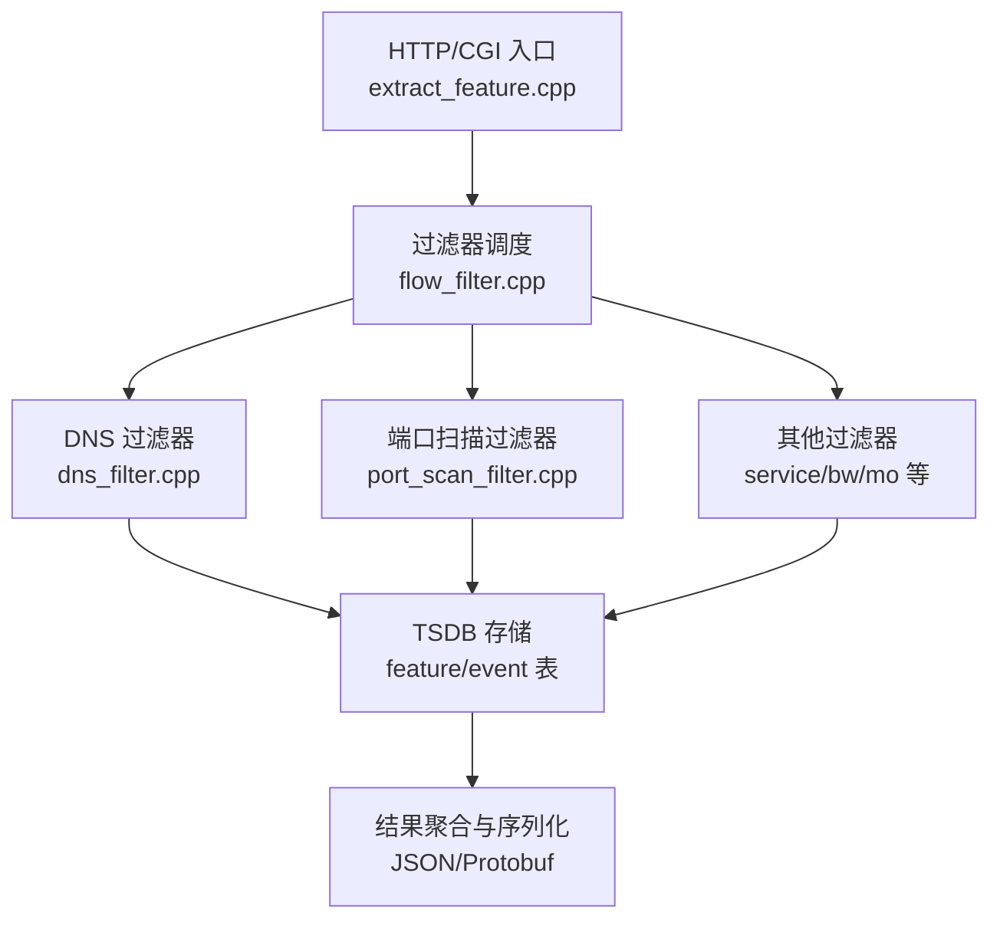
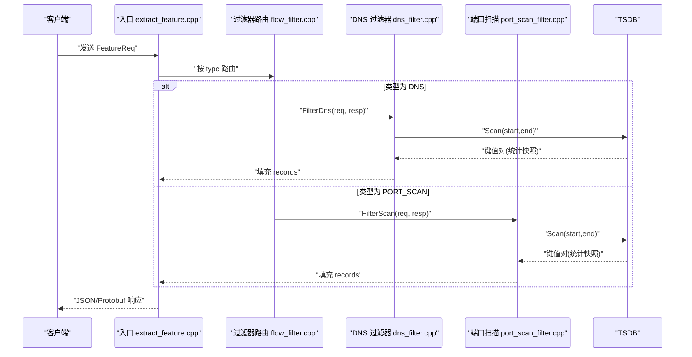
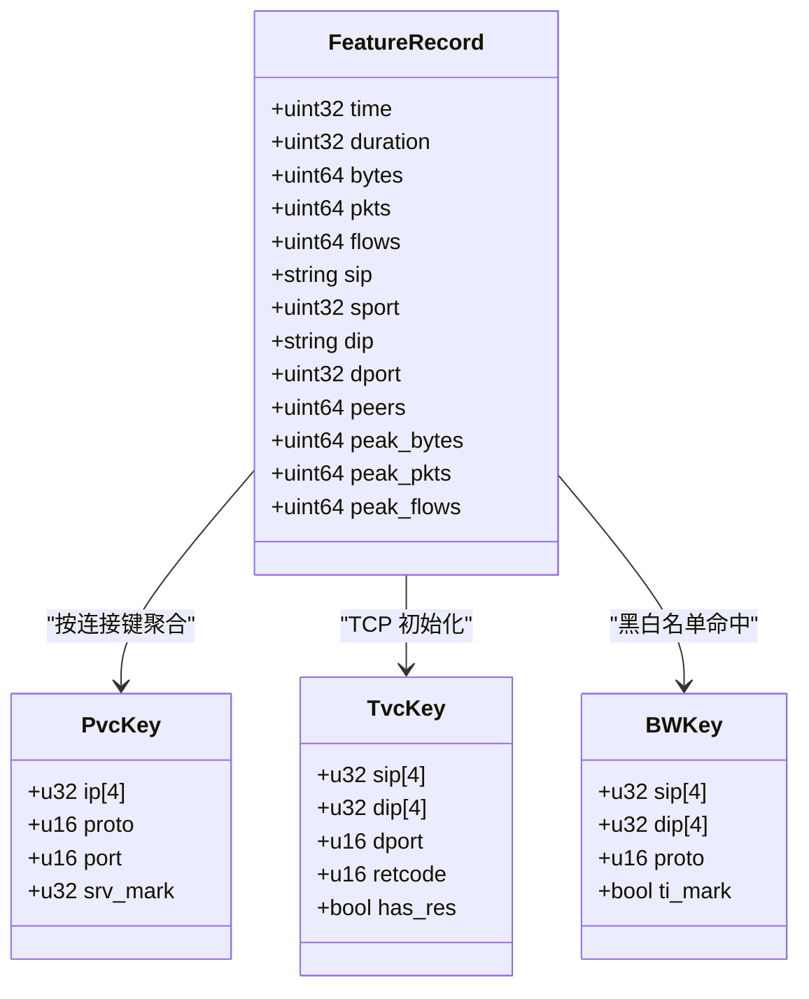
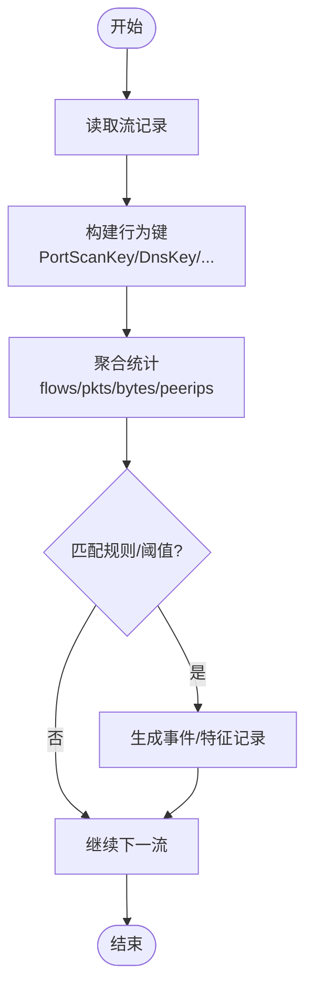
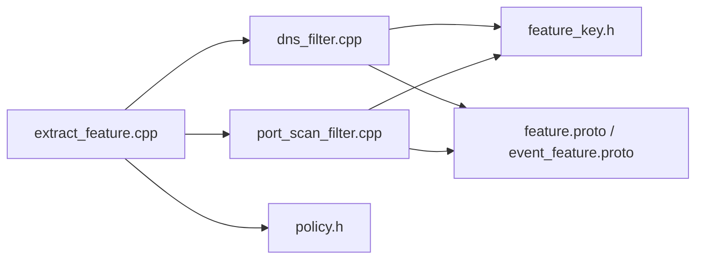

# 特征提取系统

<cite>
**本文引用的文件**
- [extract_feature.cpp](file://ly_analyser/src/agent/handlers/extract_feature.cpp)
- [flow_filter.cpp](file://ly_analyser/src/agent/flow/flow_filter.cpp)
- [dns_filter.cpp](file://ly_analyser/src/agent/flow/dns_filter.cpp)
- [port_scan_filter.cpp](file://ly_analyser/src/agent/flow/port_scan_filter.cpp)
- [feature.proto](file://ly_analyser/src/common/feature.proto)
- [event_feature.proto](file://ly_analyser/src/common/event_feature.proto)
- [feature_key.h](file://ly_analyser/src/agent/model/feature_key.h)
- [policy.h](file://ly_analyser/src/agent/model/policy.h)
</cite>

## 目录
1. [简介](#简介)
2. [项目结构](#项目结构)
3. [核心组件](#核心组件)
4. [架构总览](#架构总览)
5. [详细组件分析](#详细组件分析)
6. [依赖关系分析](#依赖关系分析)
7. [性能考虑](#性能考虑)
8. [故障排查指南](#故障排查指南)
9. [结论](#结论)
10. [附录](#附录)

## 简介
本技术文档面向“特征提取系统”，聚焦网络流量特征的提取过程与工程实现，覆盖连接级、行为级和内容级三类特征的定义与计算方法；阐述特征数据结构设计、标准化处理与选择策略；说明机器学习模型所需的特征工程方法（重要性评估、组合策略）；并提供配置选项与性能调优指南，帮助开发者理解并优化特征提取效果。

## 项目结构
- 入口与调度：HTTP/CGI 入口解析请求参数，按类型路由到具体过滤器，聚合结果输出为 JSON 或 Protobuf。
- 过滤器层：针对不同类型特征（DNS、端口扫描、服务识别、黑白名单、MO 等）提供专用过滤器，负责流式统计、阈值判定与事件生成。
- 数据层：基于时间序列数据库（TSDB）持久化中间统计结果，支持范围扫描与增量合并。
- 协议与模型：使用 Protobuf 定义请求/响应与记录结构；通过策略（Policy）将标签映射到具体过滤器实例。

图表来源
- [extract_feature.cpp:294-481](file://ly_analyser/src/agent/handlers/extract_feature.cpp#L294-L481)
- [flow_filter.cpp:99-196](file://ly_analyser/src/agent/flow/flow_filter.cpp#L99-L196)
- [dns_filter.cpp:270-279](file://ly_analyser/src/agent/flow/dns_filter.cpp#L270-L279)
- [port_scan_filter.cpp:302-312](file://ly_analyser/src/agent/flow/port_scan_filter.cpp#L302-L312)

章节来源
- [extract_feature.cpp:294-481](file://ly_analyser/src/agent/handlers/extract_feature.cpp#L294-L481)
- [flow_filter.cpp:99-196](file://ly_analyser/src/agent/flow/flow_filter.cpp#L99-L196)

## 核心组件
- 请求/响应协议：FeatureReq/FeatureResponse 定义查询条件与返回字段；EventFeatureReq/EventFeatureResponse 用于事件级特征。
- 过滤器基类与组合：FlowFilters 管理包含/排除过滤器集合，统一 CheckFlow 流程。
- 特征键空间：feature_key.h 定义了各类特征的分组键（如 DNSKey、PortScanKey），用于聚合统计。
- 策略映射：Policy 根据标签创建对应过滤器实例，解耦配置与实现。

章节来源
- [feature.proto:4-69](file://ly_analyser/src/common/feature.proto#L4-L69)
- [feature.proto:71-128](file://ly_analyser/src/common/feature.proto#L71-L128)
- [event_feature.proto:4-41](file://ly_analyser/src/common/event_feature.proto#L4-L41)
- [event_feature.proto:43-71](file://ly_analyser/src/common/event_feature.proto#L43-L71)
- [flow_filter.cpp:39-60](file://ly_analyser/src/agent/flow/flow_filter.cpp#L39-L60)
- [feature_key.h:17-225](file://ly_analyser/src/agent/model/feature_key.h#L17-L225)
- [policy.h:7-27](file://ly_analyser/src/agent/model/policy.h#L7-L27)

## 架构总览
特征提取采用“入口路由 + 多过滤器并行 + TSDB 持久化”的架构。入口根据 FeatureReq.type 分发至相应过滤器；各过滤器维护本地缓存与 TSDB 索引，完成流式聚合、阈值匹配与事件生成；最终由入口聚合输出。

图表来源
- [extract_feature.cpp:312-471](file://ly_analyser/src/agent/handlers/extract_feature.cpp#L312-L471)
- [dns_filter.cpp:270-279](file://ly_analyser/src/agent/flow/dns_filter.cpp#L270-L279)
- [port_scan_filter.cpp:302-312](file://ly_analyser/src/agent/flow/port_scan_filter.cpp#L302-L312)

## 详细组件分析

### 连接级特征（Connection-level Features）
- 定义：以五元组/七元组为基础的连接维度统计，包括源/目的 IP、端口、协议、字节数、包数、流数、峰值指标等。
- 计算方式：
  - 在过滤器中按 Key（如 PvcKey、AssetsrvKey、TvcKey、BWKey）聚合 flows/pkts/bytes，并维护首次/最后时间戳。
  - 峰值指标（peak_bytes/pkts/flows）在记录写入时更新。
- 输出字段：见 FeatureRecord 中的 bytes/pkts/flows/protocol/sip/dip/sport/dport/peers/peak_* 等。

图表来源
- [feature.proto:71-128](file://ly_analyser/src/common/feature.proto#L71-L128)
- [feature_key.h:43-115](file://ly_analyser/src/agent/model/feature_key.h#L43-L115)

章节来源
- [feature.proto:71-128](file://ly_analyser/src/common/feature.proto#L71-L128)
- [feature_key.h:43-115](file://ly_analyser/src/agent/model/feature_key.h#L43-L115)

### 行为级特征（Behavioral Features）
- 定义：反映主机或服务的异常行为模式，如端口扫描、IP 扫描、DNS 隧道、DGA、挖矿、威胁情报命中等。
- 计算方式：
  - 端口扫描：按 PortScanKey（ip/proto/port）聚合 peerip_count、flows、pkts、bytes，并与规则集（Pattern）匹配阈值。
  - DNS 行为：按 DnsKey（sip/dip/qname/qtype）聚合 flows/pkts/bytes，结合域名白/黑名单与阈值触发事件。
  - 其他行为：如 DGA、ICMP 隧道等，均基于各自 Key 进行聚合与规则匹配。
- 输出字段：除基础连接字段外，还包括 qname/qtype/fratio/score/app_proto 等行为相关字段。

图表来源
- [port_scan_filter.cpp:106-180](file://ly_analyser/src/agent/flow/port_scan_filter.cpp#L106-L180)
- [port_scan_filter.cpp:246-269](file://ly_analyser/src/agent/flow/port_scan_filter.cpp#L246-L269)
- [dns_filter.cpp:101-172](file://ly_analyser/src/agent/flow/dns_filter.cpp#L101-L172)
- [dns_filter.cpp:174-249](file://ly_analyser/src/agent/flow/dns_filter.cpp#L174-L249)

章节来源
- [port_scan_filter.cpp:106-180](file://ly_analyser/src/agent/flow/port_scan_filter.cpp#L106-L180)
- [port_scan_filter.cpp:246-269](file://ly_analyser/src/agent/flow/port_scan_filter.cpp#L246-L269)
- [dns_filter.cpp:101-172](file://ly_analyser/src/agent/flow/dns_filter.cpp#L101-L172)
- [dns_filter.cpp:174-249](file://ly_analyser/src/agent/flow/dns_filter.cpp#L174-L249)

### 内容级特征（Content-level Features）
- 定义：从应用层载荷中提取的内容信息，如 URL、Host、QName、FQDN、应用协议、服务器版本等。
- 计算方式：
  - 在过滤器中解析并校验内容字段（如非法字符过滤），将其写入 FeatureRecord。
  - 结合上下文（如 DNS 查询）将内容与连接/行为关联。
- 输出字段：url/host/qname/fqname/app_proto/srv_version 等。

章节来源
- [extract_feature.cpp:207-238](file://ly_analyser/src/agent/handlers/extract_feature.cpp#L207-L238)
- [feature.proto:71-128](file://ly_analyser/src/common/feature.proto#L71-L128)

### 特征数据结构与标准化
- 数据结构：
  - 请求：FeatureReq 支持多维度过滤（时间、协议、IP/端口、域名、威胁标记等）。
  - 记录：FeatureRecord 承载连接/行为/内容的综合特征。
  - 事件：EventFeatureRecord 用于事件级特征（含 payload/captype 等）。
- 标准化处理：
  - 数值型：bytes/pkts/flows/peak_* 等可直接用于模型；fratio/score 已归一化或评分化。
  - 文本型：url/host/qname 等需做清洗（非法字符替换）、哈希或分词后再入模。
  - 类别型：protocol/app_proto/srv_type 等建议 One-Hot 或 Embedding。
- 缺失值与异常：
  - 对于可选字段，若不存在则不输出；在下游建模前需补齐默认值或丢弃。

章节来源
- [feature.proto:4-69](file://ly_analyser/src/common/feature.proto#L4-L69)
- [feature.proto:71-128](file://ly_analyser/src/common/feature.proto#L71-L128)
- [event_feature.proto:43-71](file://ly_analyser/src/common/event_feature.proto#L43-L71)
- [extract_feature.cpp:207-238](file://ly_analyser/src/agent/handlers/extract_feature.cpp#L207-L238)

### 特征选择策略
- 基于业务场景：
  - 威胁检测：优先保留 ti_mark、score、threat_*、qname、url 等强判别字段。
  - 资产发现：侧重 app_proto、srv_name、srv_version、dev_*、os_* 等指纹字段。
  - 异常行为：关注 peers、peak_*、flows、pkts、duration 等时序与强度指标。
- 基于统计与模型：
  - 相关性分析：剔除高度共线性字段（如 bytes 与 pkts 在某些场景下强相关）。
  - 重要性评估：使用树模型（XGBoost/LightGBM）的特征重要性排序，迭代裁剪。
  - 组合策略：构造比率特征（如 fratio=bytes/pkts）、滑动窗口统计（均值/方差/峰值比）等。

章节来源
- [feature.proto:71-128](file://ly_analyser/src/common/feature.proto#L71-L128)
- [event_feature.proto:43-71](file://ly_analyser/src/common/event_feature.proto#L43-L71)

### 机器学习特征工程方法
- 特征重要性评估：
  - 训练阶段：使用树模型获取特征重要性，结合 SHAP 值解释关键驱动因素。
  - 验证阶段：逐步剔除低重要性特征，观察 AUC/F1 变化，稳定后固化特征集。
- 特征组合策略：
  - 交互特征：如 sip-dip 对、domain-port 组合、协议-端口组合。
  - 时序特征：5 分钟粒度下的 flows/pkts/bytes 的均值、方差、最大值、斜率。
  - 上下文特征：结合资产库/威胁情报，生成是否命中、命中等级等布尔/枚举特征。

章节来源
- [dns_filter.cpp:174-249](file://ly_analyser/src/agent/flow/dns_filter.cpp#L174-L249)
- [port_scan_filter.cpp:246-269](file://ly_analyser/src/agent/flow/port_scan_filter.cpp#L246-L269)

### 配置选项与运行时控制
- 过滤器启用：
  - 通过 Policy 标签（POP/SUS/I_PORT_SCAN/I_SRV/MO/WHITE/BLACK 等）动态加载过滤器。
  - include/exclude 列表控制过滤器的包含与排除。
- 阈值与规则：
  - 端口扫描：Pattern 文件定义不同粒度的匹配规则（ip/port/protocol/flows/peers）。
  - DNS：域名白/黑名单文件与阈值（qcount）控制事件触发。
- 设备与环境：
  - DEVID 环境变量指定设备标识；model 区分 V4/V6 处理路径。

章节来源
- [flow_filter.cpp:99-196](file://ly_analyser/src/agent/flow/flow_filter.cpp#L99-L196)
- [port_scan_filter.cpp:182-224](file://ly_analyser/src/agent/flow/port_scan_filter.cpp#L182-L224)
- [dns_filter.cpp:18-37](file://ly_analyser/src/agent/flow/dns_filter.cpp#L18-L37)
- [dns_filter.cpp:174-249](file://ly_analyser/src/agent/flow/dns_filter.cpp#L174-L249)

## 依赖关系分析
- 入口依赖：extract_feature.cpp 依赖各过滤器与配置缓存，负责请求解析与结果序列化。
- 过滤器依赖：dns_filter.cpp、port_scan_filter.cpp 依赖 TSDB、策略与工具函数（IP/字符串/时间）。
- 数据依赖：feature_key.h 定义聚合键；feature.proto 与 event_feature.proto 定义通信契约。
- 策略依赖：policy.h 将标签映射到具体过滤器，降低耦合度。

图表来源
- [extract_feature.cpp:312-471](file://ly_analyser/src/agent/handlers/extract_feature.cpp#L312-L471)
- [dns_filter.cpp:270-279](file://ly_analyser/src/agent/flow/dns_filter.cpp#L270-L279)
- [port_scan_filter.cpp:302-312](file://ly_analyser/src/agent/flow/port_scan_filter.cpp#L302-L312)
- [feature_key.h:17-225](file://ly_analyser/src/agent/model/feature_key.h#L17-L225)
- [feature.proto:4-69](file://ly_analyser/src/common/feature.proto#L4-L69)
- [event_feature.proto:4-41](file://ly_analyser/src/common/event_feature.proto#L4-L41)
- [policy.h:7-27](file://ly_analyser/src/agent/model/policy.h#L7-L27)

章节来源
- [extract_feature.cpp:312-471](file://ly_analyser/src/agent/handlers/extract_feature.cpp#L312-L471)
- [dns_filter.cpp:270-279](file://ly_analyser/src/agent/flow/dns_filter.cpp#L270-L279)
- [port_scan_filter.cpp:302-312](file://ly_analyser/src/agent/flow/port_scan_filter.cpp#L302-L312)
- [feature_key.h:17-225](file://ly_analyser/src/agent/model/feature_key.h#L17-L225)
- [feature.proto:4-69](file://ly_analyser/src/common/feature.proto#L4-L69)
- [event_feature.proto:4-41](file://ly_analyser/src/common/event_feature.proto#L4-L41)
- [policy.h:7-27](file://ly_analyser/src/agent/model/policy.h#L7-L27)

## 性能考虑
- 聚合与缓存：
  - 使用内存缓存（如端口扫描的时间片缓存）减少重复 TSDB 扫描。
  - 合理设置时间粒度（time_unit）平衡精度与 IO。
- I/O 优化：
  - 批量写入 TSDB，合并相邻时间窗口的统计。
  - 只扫描必要字段，避免全量读取。
- 计算复杂度：
  - 聚合键设计紧凑（IPv4 数组+端口+协议），降低哈希/比较开销。
  - 规则匹配分层（按 ip/port/protocol 组合）减少匹配次数。
- 可扩展性：
  - 过滤器独立扩展，新增特征无需改动入口逻辑。
  - 通过 Policy 标签热插拔过滤器。

章节来源
- [port_scan_filter.cpp:32-60](file://ly_analyser/src/agent/flow/port_scan_filter.cpp#L32-L60)
- [port_scan_filter.cpp:272-299](file://ly_analyser/src/agent/flow/port_scan_filter.cpp#L272-L299)
- [dns_filter.cpp:252-268](file://ly_analyser/src/agent/flow/dns_filter.cpp#L252-L268)

## 故障排查指南
- 常见问题定位：
  - 初始化失败：检查设备 ID、模型（V4/V6）、配置文件路径是否正确。
  - 规则未生效：确认 Pattern 文件与事件配置（qcount、weekdays、coverrange）是否加载成功。
  - 字段异常：检查内容字段清洗逻辑（非法字符替换）与 Protobuf 序列化。
- 日志与调试：
  - 开启 DEBUG 模式打印过滤器初始化与关键路径。
  - 查看 TSDB 中键值对的写入与扫描结果，确认聚合正确性。
- 恢复措施：
  - 清理过期缓存与 TSDB 分区，重建索引。
  - 回滚规则配置，逐步验证。

章节来源
- [extract_feature.cpp:312-471](file://ly_analyser/src/agent/handlers/extract_feature.cpp#L312-L471)
- [port_scan_filter.cpp:182-224](file://ly_analyser/src/agent/flow/port_scan_filter.cpp#L182-L224)
- [dns_filter.cpp:18-37](file://ly_analyser/src/agent/flow/dns_filter.cpp#L18-L37)

## 结论
本系统通过清晰的入口路由、模块化过滤器与 TSDB 持久化，实现了连接级、行为级与内容级特征的全面提取。配合策略配置与规则引擎，可灵活适配不同安全场景。在机器学习侧，建议结合业务先验与模型反馈持续优化特征集，并通过标准化与组合策略提升模型泛化能力。

## 附录
- 配置示例要点：
  - include/exclude 列表：控制过滤器启用范围。
  - Pattern 文件：定义端口扫描等多粒度规则。
  - 域名白/黑名单：影响 DNS 事件触发。
- 推荐实践：
  - 小步快跑：先上线基础连接特征，再逐步加入行为与内容特征。
  - 监控指标：关注延迟、吞吐、命中率与误报率，持续调优阈值与规则。