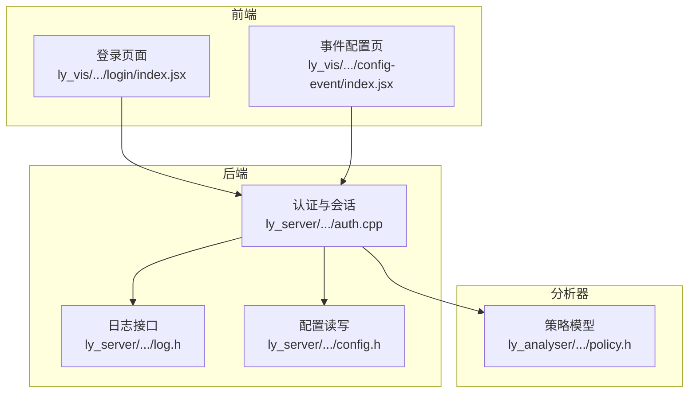
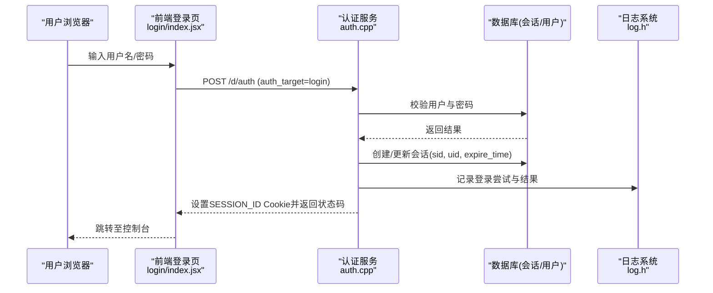
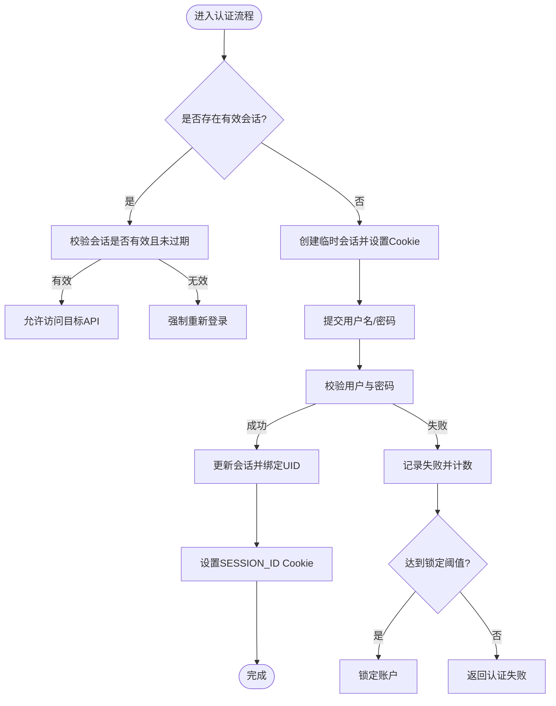
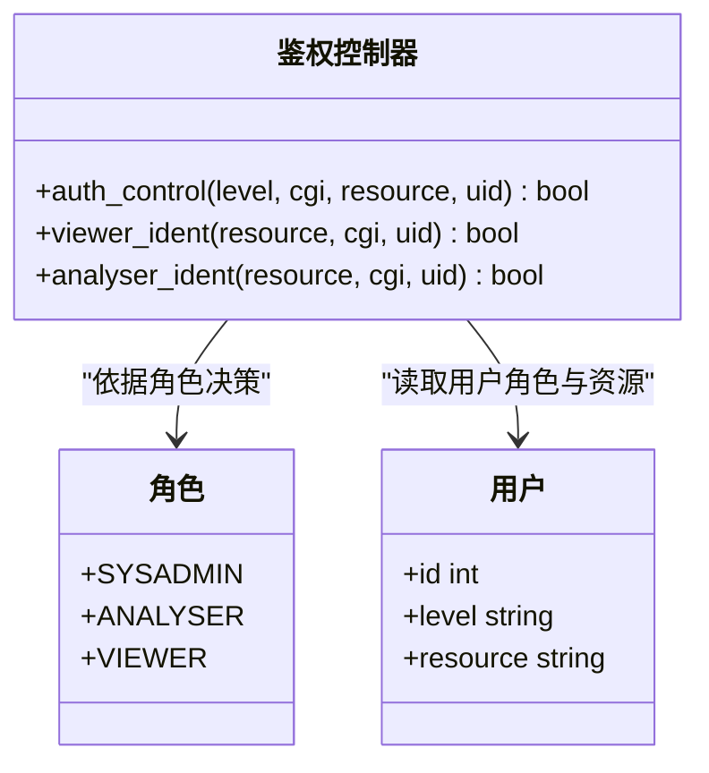
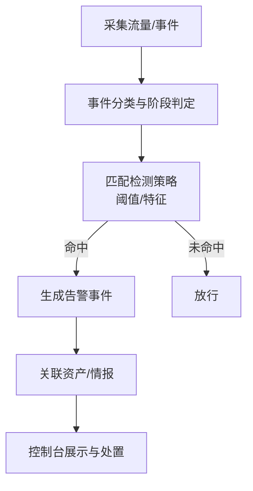
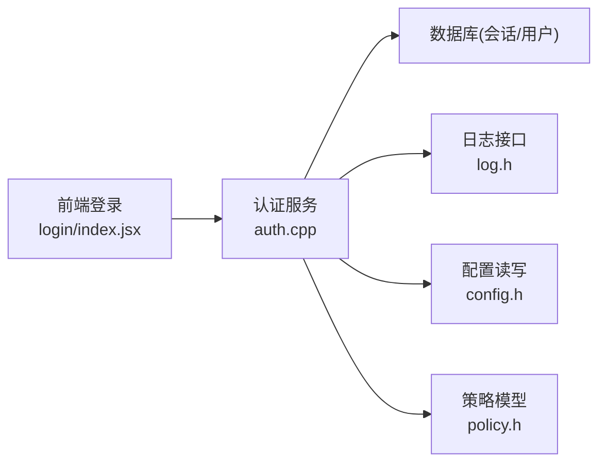

# 安全设计

<cite>
**本文引用的文件**
- [ly_server/src/server/auth.cpp](file://ly_server/src/server/auth.cpp)
- [ly_server/src/common/log.h](file://ly_server/src/common/log.h)
- [ly_analyser/src/agent/model/policy.h](file://ly_analyser/src/agent/model/policy.h)
- [ly_server/src/common/config.h](file://ly_server/src/common/config.h)
- [ly_vis/packages/std/src/page/login/index.jsx](file://ly_vis/packages/std/src/page/login/index.jsx)
- [ly_vis/packages/components/system/event-system/config/event/dns_tun/index.js](file://ly_vis/packages/components/system/event-system/config/event/dns_tun/index.js)
- [ly_vis/packages/components/system/event-system/config/event/icmp_tun/index.js](file://ly_vis/packages/components/system/event-system/config/event/icmp_tun/index.js)
- [ly_vis/packages/std/src/utils/methods-event.js](file://ly_vis/packages/std/src/utils/methods-event.js)
- [ly_vis/packages/std/src/page/config/page-child/config-event/index.jsx](file://ly_vis/packages/std/src/page/config/page-child/config-event/index.jsx)
</cite>

## 目录
1. [简介](#简介)
2. [项目结构](#项目结构)
3. [核心组件](#核心组件)
4. [架构总览](#架构总览)
5. [详细组件分析](#详细组件分析)
6. [依赖关系分析](#依赖关系分析)
7. [性能考虑](#性能考虑)
8. [故障排查指南](#故障排查指南)
9. [结论](#结论)
10. [附录](#附录)

## 简介
本技术文档围绕系统的安全设计展开，覆盖身份认证、基于角色的访问控制（RBAC）与权限模型、数据传输加密与敏感信息保护、会话管理、安全审计日志、安全事件检测与响应流程、网络安全防护（含防火墙规则与入侵检测）、漏洞扫描与渗透测试方法，以及安全加固指南与最佳实践检查清单。内容基于代码仓库中的服务端认证授权实现、前端登录与安全配置、事件检测策略与告警分类等实际实现进行说明。

## 项目结构
本项目由多个子系统构成：
- ly_server：后端服务，包含认证、会话、用户与资源权限控制、日志输出等能力。
- ly_analyser：流量分析与检测引擎，提供策略加载与执行框架。
- ly_vis：前端可视化与控制台，包含登录、事件配置、黑白名单、隧道检测等界面与逻辑。
- ly_docs：文档站点。

图表来源
- [ly_vis/packages/std/src/page/login/index.jsx:1-39](file://ly_vis/packages/std/src/page/login/index.jsx#L1-L39)
- [ly_server/src/server/auth.cpp:244-293](file://ly_server/src/server/auth.cpp#L244-L293)
- [ly_server/src/common/log.h:6-32](file://ly_server/src/common/log.h#L6-L32)
- [ly_server/src/common/config.h:6-24](file://ly_server/src/common/config.h#L6-L24)
- [ly_analyser/src/agent/model/policy.h:7-27](file://ly_analyser/src/agent/model/policy.h#L7-L27)

章节来源
- [ly_server/src/server/auth.cpp:1-578](file://ly_server/src/server/auth.cpp#L1-L578)
- [ly_vis/packages/std/src/page/login/index.jsx:1-39](file://ly_vis/packages/std/src/page/login/index.jsx#L1-L39)

## 核心组件
- 身份认证与会话管理：基于Cookie的会话ID、数据库持久化会话、过期清理、失败重试与账户锁定机制。
- RBAC与权限控制：角色分级（SYSADMIN、ANALYSER、VIEWER），按目标类型与操作粒度进行鉴权。
- 安全审计日志：通过系统日志接口记录错误、警告、信息等级别日志；登录失败次数统计与锁定。
- 事件检测与策略：支持DNS隧道、ICMP隧道、端口扫描、异常服务等检测策略的配置与执行。
- 配置管理：统一的配置读取与写入接口，支撑策略下发与运行时参数调整。

章节来源
- [ly_server/src/server/auth.cpp:38-46](file://ly_server/src/server/auth.cpp#L38-L46)
- [ly_server/src/server/auth.cpp:51-168](file://ly_server/src/server/auth.cpp#L51-L168)
- [ly_server/src/server/auth.cpp:206-229](file://ly_server/src/server/auth.cpp#L206-L229)
- [ly_server/src/server/auth.cpp:350-477](file://ly_server/src/server/auth.cpp#L350-L477)
- [ly_server/src/common/log.h:6-32](file://ly_server/src/common/log.h#L6-L32)
- [ly_analyser/src/agent/model/policy.h:7-27](file://ly_analyser/src/agent/model/policy.h#L7-L27)
- [ly_server/src/common/config.h:6-24](file://ly_server/src/common/config.h#L6-L24)

## 架构总览
系统采用前后端分离架构，前端负责用户交互与展示，后端提供认证、鉴权、事件处理与策略管理，分析器负责流量检测与策略执行。

图表来源
- [ly_vis/packages/std/src/page/login/index.jsx:23-39](file://ly_vis/packages/std/src/page/login/index.jsx#L23-L39)
- [ly_server/src/server/auth.cpp:244-293](file://ly_server/src/server/auth.cpp#L244-L293)
- [ly_server/src/common/log.h:6-32](file://ly_server/src/common/log.h#L6-L32)

## 详细组件分析

### 身份认证与会话管理
- 会话生命周期：
  - 首次访问或无会话时创建临时会话并设置Cookie有效期。
  - 登录成功后绑定用户ID并刷新过期时间。
  - 定期清理过期会话，防止会话堆积。
- 安全策略：
  - 密码以MD5存储与比对（需评估升级哈希算法）。
  - 登录失败计数与账户锁定：在默认时间内超过阈值将锁定账户。
  - 会话校验：每次请求验证会话有效性及超时。
- 退出与状态查询：
  - 登出清空会话并重置Cookie。
  - 提供认证状态查询接口用于前端保持登录态。

图表来源
- [ly_server/src/server/auth.cpp:51-168](file://ly_server/src/server/auth.cpp#L51-L168)
- [ly_server/src/server/auth.cpp:206-229](file://ly_server/src/server/auth.cpp#L206-L229)
- [ly_server/src/server/auth.cpp:244-293](file://ly_server/src/server/auth.cpp#L244-L293)
- [ly_server/src/server/auth.cpp:295-348](file://ly_server/src/server/auth.cpp#L295-L348)

章节来源
- [ly_server/src/server/auth.cpp:51-168](file://ly_server/src/server/auth.cpp#L51-L168)
- [ly_server/src/server/auth.cpp:206-229](file://ly_server/src/server/auth.cpp#L206-L229)
- [ly_server/src/server/auth.cpp:244-293](file://ly_server/src/server/auth.cpp#L244-L293)
- [ly_server/src/server/auth.cpp:295-348](file://ly_server/src/server/auth.cpp#L295-L348)

### 基于角色的访问控制（RBAC）与权限模型
- 角色定义：
  - SYSADMIN：系统管理员，拥有全部权限。
  - ANALYSER：分析员，受限的增删改查权限。
  - VIEWER：查看者，仅允许读取类操作。
- 资源与操作控制：
  - 根据目标类型（如配置、用户、设备）与操作（GET、MOD、ADD、DEL）进行细粒度鉴权。
  - 对敏感操作（如修改用户密码）进行额外校验（例如仅允许本人修改）。
- 统一鉴权入口：
  - 所有非登录/登出/状态查询的请求均经过鉴权控制，未通过则拒绝访问。

图表来源
- [ly_server/src/server/auth.cpp:38-46](file://ly_server/src/server/auth.cpp#L38-L46)
- [ly_server/src/server/auth.cpp:350-477](file://ly_server/src/server/auth.cpp#L350-L477)
- [ly_server/src/server/auth.cpp:525-536](file://ly_server/src/server/auth.cpp#L525-L536)

章节来源
- [ly_server/src/server/auth.cpp:350-477](file://ly_server/src/server/auth.cpp#L350-L477)
- [ly_server/src/server/auth.cpp:525-536](file://ly_server/src/server/auth.cpp#L525-L536)

### 数据传输加密与敏感信息保护
- 传输层：
  - 建议在生产环境启用HTTPS，确保前端到后端的通信加密。当前认证模块通过Cookie传递会话标识，需配合TLS使用。
- 敏感数据：
  - 密码以MD5存储与比对，建议升级为更安全的哈希算法（如bcrypt/argon2）。
  - 会话ID通过Cookie下发，应设置HttpOnly、Secure、SameSite属性以防止XSS与CSRF风险。
- 前端安全：
  - 登录表单对密码进行本地摘要后再发送，减少明文传输风险。

章节来源
- [ly_vis/packages/std/src/page/login/index.jsx:23-39](file://ly_vis/packages/std/src/page/login/index.jsx#L23-L39)
- [ly_server/src/server/auth.cpp:206-229](file://ly_server/src/server/auth.cpp#L206-L229)

### 安全审计日志记录策略
- 日志级别：
  - 错误、警告、信息三级日志，统一通过系统日志接口输出。
- 登录审计：
  - 记录登录动作、结果码、时间与用户上下文，用于后续审计与风控。
- 调试开关：
  - 支持通过环境变量控制调试日志输出范围，便于问题定位。

章节来源
- [ly_server/src/common/log.h:6-32](file://ly_server/src/common/log.h#L6-L32)
- [ly_server/src/server/auth.cpp:170-204](file://ly_server/src/server/auth.cpp#L170-L204)

### 安全事件检测与响应流程
- 事件类型与阶段：
  - 探测阶段：IP/端口扫描、协议试探等。
  - 渗透阶段：DGA、Web攻击（SQL/XSS/Webshell）等。
  - 沦陷阶段：外连、挖矿、DNS/ICMP隧道、僵尸网络等。
- 策略配置：
  - 支持DNS隧道、ICMP隧道等检测策略的参数配置，包括阈值与特征匹配。
- 响应流程：
  - 检测到事件后生成告警，结合资产信息与威胁情报进行风险评估，并在控制台展示与处置。

图表来源
- [ly_vis/packages/std/src/utils/methods-event.js:43-89](file://ly_vis/packages/std/src/utils/methods-event.js#L43-L89)
- [ly_vis/packages/components/system/event-system/config/event/dns_tun/index.js:1-35](file://ly_vis/packages/components/system/event-system/config/event/dns_tun/index.js#L1-L35)
- [ly_vis/packages/components/system/event-system/config/event/icmp_tun/index.js:1-40](file://ly_vis/packages/components/system/event-system/config/event/icmp_tun/index.js#L1-L40)
- [ly_vis/packages/std/src/page/config/page-child/config-event/index.jsx:453-477](file://ly_vis/packages/std/src/page/config/page-child/config-event/index.jsx#L453-L477)

章节来源
- [ly_vis/packages/std/src/utils/methods-event.js:43-89](file://ly_vis/packages/std/src/utils/methods-event.js#L43-L89)
- [ly_vis/packages/components/system/event-system/config/event/dns_tun/index.js:1-35](file://ly_vis/packages/components/system/event-system/config/event/dns_tun/index.js#L1-L35)
- [ly_vis/packages/components/system/event-system/config/event/icmp_tun/index.js:1-40](file://ly_vis/packages/components/system/event-system/config/event/icmp_tun/index.js#L1-L40)
- [ly_vis/packages/std/src/page/config/page-child/config-event/index.jsx:453-477](file://ly_vis/packages/std/src/page/config/page-child/config-event/index.jsx#L453-L477)

### 网络安全防护措施、防火墙规则与入侵检测配置
- 防火墙规则建议：
  - 仅开放必要端口与服务，限制管理面访问来源。
  - 对公网暴露的服务启用WAF与速率限制。
- 入侵检测：
  - 启用扫描与隧道检测策略，结合黑白名单提升准确性。
  - 对异常服务与高频连接进行阈值告警。
- 策略下发：
  - 通过配置模块统一管理检测策略与阈值，支持热更新。

章节来源
- [ly_vis/packages/std/src/page/config/page-child/config-event/index.jsx:453-477](file://ly_vis/packages/std/src/page/config/page-child/config-event/index.jsx#L453-L477)
- [ly_server/src/common/config.h:6-24](file://ly_server/src/common/config.h#L6-L24)

### 安全漏洞扫描、渗透测试与安全评估方法
- 漏洞扫描：
  - 定期对前端与后端组件进行依赖漏洞扫描与容器镜像扫描。
- 渗透测试：
  - 针对认证与会话、权限控制、输入校验进行黑盒与白盒测试。
- 安全评估：
  - 结合事件检测与日志审计，评估检测覆盖率与误报率，持续优化策略。

[本节为通用指导，不直接分析具体文件]

### 安全加固指南、最佳实践与安全检查清单
- 认证与会话：
  - 启用HTTPS，设置Cookie安全属性（HttpOnly、Secure、SameSite）。
  - 升级密码哈希算法，增加盐值与迭代次数。
  - 实施多因素认证与强密码策略。
- 权限控制：
  - 最小权限原则，细化资源与操作维度。
  - 对敏感操作进行二次确认与审计。
- 日志与监控：
  - 集中收集日志，建立告警规则与响应流程。
  - 定期审计登录失败与锁定事件。
- 数据安全：
  - 传输加密、存储加密、密钥管理。
- 检测与响应：
  - 完善黑白名单与策略阈值，降低误报与漏报。
  - 建立事件处置SOP与演练机制。

[本节为通用指导，不直接分析具体文件]

## 依赖关系分析
- 前端登录依赖后端认证接口，认证成功后设置会话Cookie。
- 认证服务依赖数据库进行用户与会话管理，并通过日志接口记录审计信息。
- 策略模型与分析器依赖配置模块进行策略加载与更新。

图表来源
- [ly_vis/packages/std/src/page/login/index.jsx:23-39](file://ly_vis/packages/std/src/page/login/index.jsx#L23-L39)
- [ly_server/src/server/auth.cpp:244-293](file://ly_server/src/server/auth.cpp#L244-L293)
- [ly_server/src/common/log.h:6-32](file://ly_server/src/common/log.h#L6-L32)
- [ly_server/src/common/config.h:6-24](file://ly_server/src/common/config.h#L6-L24)
- [ly_analyser/src/agent/model/policy.h:7-27](file://ly_analyser/src/agent/model/policy.h#L7-L27)

章节来源
- [ly_server/src/server/auth.cpp:244-293](file://ly_server/src/server/auth.cpp#L244-L293)
- [ly_vis/packages/std/src/page/login/index.jsx:23-39](file://ly_vis/packages/std/src/page/login/index.jsx#L23-L39)

## 性能考虑
- 会话清理：定期清理过期会话，避免数据库膨胀与查询延迟。
- 日志写入：在高并发场景下，建议使用异步日志与缓冲机制，降低I/O阻塞。
- 策略匹配：对高频事件（如扫描）进行预过滤与聚合，减少计算开销。

[本节为通用指导，不直接分析具体文件]

## 故障排查指南
- 登录失败：
  - 检查用户是否存在、是否被禁用、是否处于锁定状态。
  - 查看登录失败次数与锁定时间，必要时解锁账户。
- 会话失效：
  - 检查Cookie是否携带SESSION_ID，服务端是否校验通过。
  - 确认会话过期时间与清理策略。
- 权限不足：
  - 核对用户角色与目标资源的操作权限，确认鉴权逻辑是否符合预期。
- 日志定位：
  - 通过系统日志接口查看错误与警告信息，结合调试开关定位问题。

章节来源
- [ly_server/src/server/auth.cpp:170-204](file://ly_server/src/server/auth.cpp#L170-L204)
- [ly_server/src/server/auth.cpp:206-229](file://ly_server/src/server/auth.cpp#L206-L229)
- [ly_server/src/server/auth.cpp:495-552](file://ly_server/src/server/auth.cpp#L495-L552)
- [ly_server/src/common/log.h:6-32](file://ly_server/src/common/log.h#L6-L32)

## 结论
本系统在后端实现了较为完善的身份认证、会话管理与RBAC权限控制，并结合前端的事件配置与检测策略形成闭环的安全运营能力。建议在现有基础上进一步强化传输加密、密码哈希算法升级、Cookie安全属性配置与日志审计体系，以提升整体安全性与可运维性。

[本节为总结性内容，不直接分析具体文件]

## 附录
- 术语表：
  - 会话：用户登录后在服务端生成的唯一标识，用于维持登录状态。
  - RBAC：基于角色的访问控制，通过角色分配资源与操作权限。
  - 事件：网络流量或行为中触发的告警项，包含类型、阶段与详情。
- 参考实现路径：
  - 认证与会话：[ly_server/src/server/auth.cpp](file://ly_server/src/server/auth.cpp)
  - 日志接口：[ly_server/src/common/log.h](file://ly_server/src/common/log.h)
  - 策略模型：[ly_analyser/src/agent/model/policy.h](file://ly_analyser/src/agent/model/policy.h)
  - 配置读写：[ly_server/src/common/config.h](file://ly_server/src/common/config.h)
  - 前端登录：[ly_vis/packages/std/src/page/login/index.jsx](file://ly_vis/packages/std/src/page/login/index.jsx)
  - 事件策略配置：[ly_vis/packages/components/system/event-system/config/event/dns_tun/index.js](file://ly_vis/packages/components/system/event-system/config/event/dns_tun/index.js), [ly_vis/packages/components/system/event-system/config/event/icmp_tun/index.js](file://ly_vis/packages/components/system/event-system/config/event/icmp_tun/index.js)

[本节为补充信息，不直接分析具体文件]