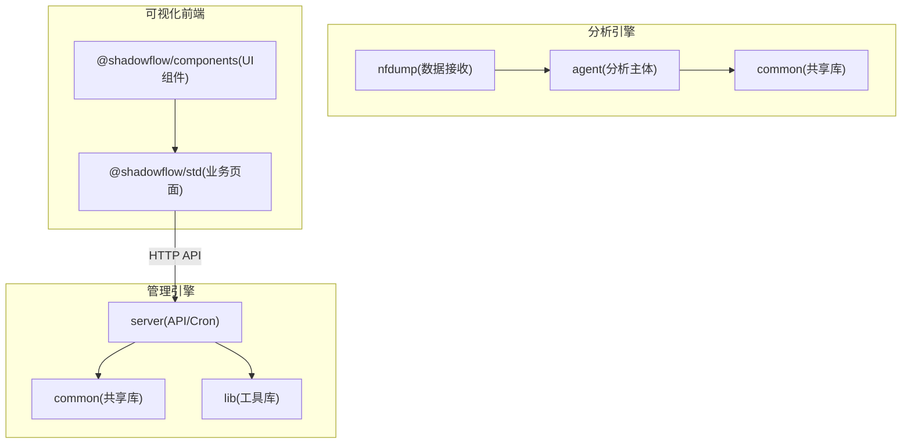
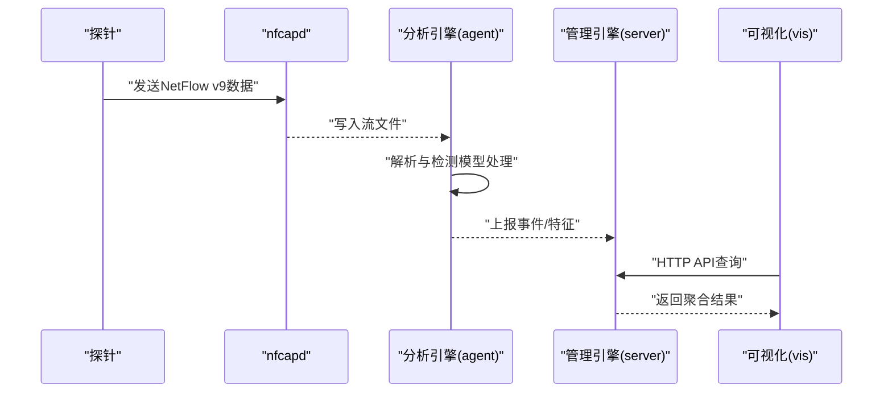
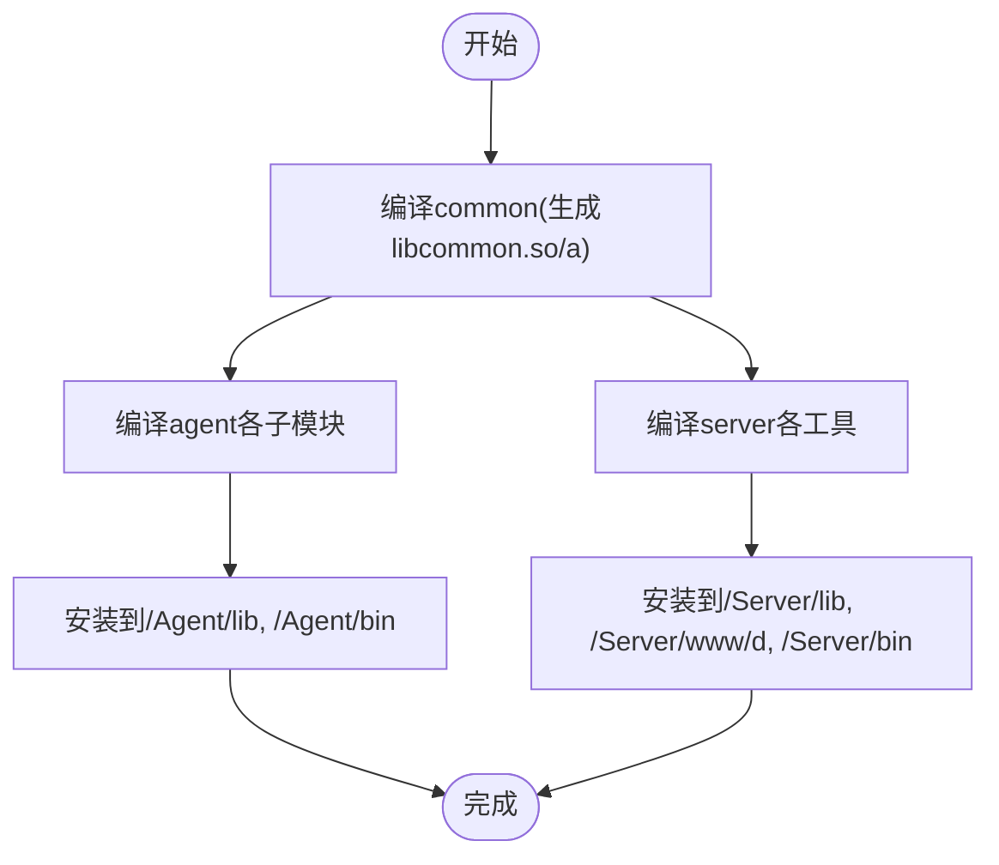
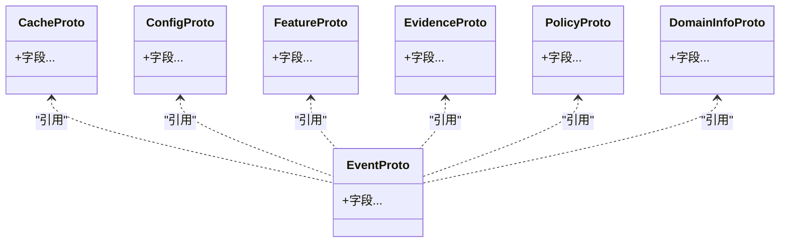
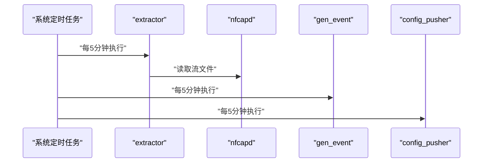
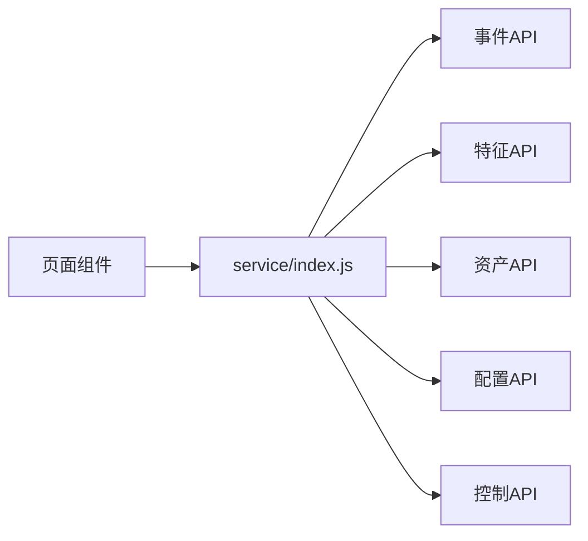
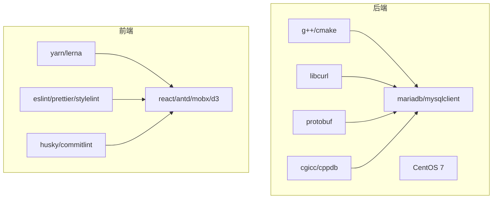

# 开发指南

<cite>
**本文引用的文件**
- [ly_analyser/README.md](file://ly_analyser/README.md)
- [ly_server/README.md](file://ly_server/README.md)
- [ly_analyser/src/common/Makefile](file://ly_analyser/src/common/Makefile)
- [ly_server/src/common/Makefile](file://ly_server/src/common/Makefile)
- [ly_analyser/src/agent/Makefile](file://ly_analyser/src/agent/Makefile)
- [ly_server/src/server/Makefile](file://ly_server/src/server/Makefile)
- [ly_vis/package.json](file://ly_vis/package.json)
- [ly_vis/packages/std/src/service/index.js](file://ly_vis/packages/std/src/service/index.js)
</cite>

## 目录
1. [简介](#简介)
2. [项目结构](#项目结构)
3. [核心组件](#核心组件)
4. [架构总览](#架构总览)
5. [详细组件分析](#详细组件分析)
6. [依赖分析](#依赖分析)
7. [性能考虑](#性能考虑)
8. [故障排查指南](#故障排查指南)
9. [结论](#结论)
10. [附录](#附录)

## 简介
本指南面向SOC项目的开发者，覆盖开发环境搭建、代码规范与编程标准、项目架构与模块划分、接口设计规范、测试与持续集成、代码审查与版本发布、调试与性能分析、第三方库集成与许可证合规、贡献流程与社区参与等主题。内容基于仓库中的构建脚本、安装说明与前端工程配置进行提炼，确保可操作且与现有实现一致。

## 项目结构
SOC由三个主要子系统构成：
- ly_analyser：威胁行为分析引擎，负责接收并解析NetFlow数据，运行检测模型，产出威胁事件与特征数据。
- ly_server：管理引擎，聚合分析结果，提供配置、用户、资产、查询等能力。
- ly_vis：可视化前端，基于React与Ant Design，通过API与后端交互，提供运维与运营界面。

图表来源
- [ly_analyser/README.md:9-25](file://ly_analyser/README.md#L9-L25)
- [ly_server/README.md:7-17](file://ly_server/README.md#L7-L17)
- [ly_vis/package.json:108-110](file://ly_vis/package.json#L108-L110)

章节来源
- [ly_analyser/README.md:9-25](file://ly_analyser/README.md#L9-L25)
- [ly_server/README.md:7-17](file://ly_server/README.md#L7-L17)
- [ly_vis/package.json:108-110](file://ly_vis/package.json#L108-L110)

## 核心组件
- 分析引擎（ly_analyser）
  - common：数据结构与通用工具函数，包含日志、时间、IP、HTTP、INI、配置、事件/特征请求等；通过Protobuf定义跨进程通信协议。
  - agent：引擎主体，包含配置、数据持久化、NetFlow解析、检测模型、索引、处理器等子模块。
  - nfdump：第三方NetFlow采集工具，用于接收探针数据。
- 管理引擎（ly_server）
  - common：与分析引擎共享的公共库，便于前后端与多组件复用。
  - lib：配置类工具库（如黑白名单、设备、事件、用户等配置）。
  - server：服务端程序与CGI/命令行工具，提供认证、事件、特征、资产、配置、控制等API与定时任务。
- 可视化前端（ly_vis）
  - 使用Yarn工作区与Lerna管理多包；通过ESLint、Prettier、Stylelint进行代码质量检查；通过Husky+Commitlint规范提交信息；通过标准化工具链进行构建与发布。

章节来源
- [ly_analyser/README.md:29-95](file://ly_analyser/README.md#L29-L95)
- [ly_server/README.md:21-77](file://ly_server/README.md#L21-L77)
- [ly_vis/package.json:11-35](file://ly_vis/package.json#L11-L35)
- [ly_vis/package.json:36-107](file://ly_vis/package.json#L36-L107)

## 架构总览
整体采用“采集-分析-管理-展示”的分层架构：
- 数据采集：nfcapd接收NetFlow v9数据，落盘至指定目录。
- 数据分析：extractor定时拉取并解析，调用agent的检测模型，输出事件与特征。
- 管理服务：server提供REST/CGI接口，统一汇聚事件、配置、资产、用户等数据，并提供查询与管控能力。
- 前端展示：vis通过服务层API获取数据，渲染可视化视图。

图表来源
- [ly_analyser/README.md:175-184](file://ly_analyser/README.md#L175-L184)
- [ly_server/README.md:197-204](file://ly_server/README.md#L197-L204)
- [ly_vis/packages/std/src/service/index.js:1-74](file://ly_vis/packages/std/src/service/index.js#L1-L74)

## 详细组件分析

### 构建系统与编译部署
- 分析引擎
  - common子模块通过Makefile生成静态库与动态库，并使用protoc将.proto转换为C++源文件，链接protobuf、cppdb、cgicc、curl、boost_regex等依赖。
  - agent顶层Makefile按子目录并行构建dump、utils、config、model、data、flow、indexing、handlers等模块。
- 管理引擎
  - common子模块同样生成共享库供server与agent复用。
  - server子模块编译多个CGI/命令行工具（如event、feature、auth、config_pusher、gen_event等），链接数据库客户端与公共库。
- 前端
  - package.json定义了workspaces与scripts，集成husky、commitlint、lint-staged、eslint、prettier、stylelint等工具链。

图表来源
- [ly_analyser/src/common/Makefile:1-52](file://ly_analyser/src/common/Makefile#L1-L52)
- [ly_server/src/common/Makefile:1-52](file://ly_server/src/common/Makefile#L1-L52)
- [ly_analyser/src/agent/Makefile:1-14](file://ly_analyser/src/agent/Makefile#L1-L14)
- [ly_server/src/server/Makefile:1-122](file://ly_server/src/server/Makefile#L1-L122)

章节来源
- [ly_analyser/src/common/Makefile:1-52](file://ly_analyser/src/common/Makefile#L1-L52)
- [ly_server/src/common/Makefile:1-52](file://ly_server/src/common/Makefile#L1-L52)
- [ly_analyser/src/agent/Makefile:1-14](file://ly_analyser/src/agent/Makefile#L1-L14)
- [ly_server/src/server/Makefile:1-122](file://ly_server/src/server/Makefile#L1-L122)

### 数据与协议
- Protobuf定义：在common目录下集中定义缓存、配置、事件、特征、证据、策略、域信息等消息格式，保证分析引擎与管理引擎之间的数据一致性。
- 构建时自动将.proto生成C++源文件，并在链接阶段纳入目标产物。

图表来源
- [ly_analyser/src/common/Makefile:18-23](file://ly_analyser/src/common/Makefile#L18-L23)
- [ly_server/src/common/Makefile:18-23](file://ly_server/src/common/Makefile#L18-L23)

章节来源
- [ly_analyser/src/common/Makefile:18-23](file://ly_analyser/src/common/Makefile#L18-L23)
- [ly_server/src/common/Makefile:18-23](file://ly_server/src/common/Makefile#L18-L23)

### 运行时与调度
- 分析引擎
  - 通过cron定时执行extractor，从nfcapd落盘目录读取流文件并处理。
  - nfcapd监听端口接收探针数据。
- 管理引擎
  - cron定时执行config_pusher与gen_event，推送配置与生成事件。
  - HTTPD作为CGI容器暴露server工具为Web接口。

图表来源
- [ly_analyser/README.md:175-184](file://ly_analyser/README.md#L175-L184)
- [ly_server/README.md:197-204](file://ly_server/README.md#L197-L204)

章节来源
- [ly_analyser/README.md:175-184](file://ly_analyser/README.md#L175-L184)
- [ly_server/README.md:197-204](file://ly_server/README.md#L197-L204)

### 前端工程与服务接口
- 前端通过packages/std/src/service/index.js统一导出API调用方法，涵盖认证、事件、特征、资产、配置、控制等。
- 使用MobX进行状态管理，结合Ant Design与D3等库实现可视化。

图表来源
- [ly_vis/packages/std/src/service/index.js:1-74](file://ly_vis/packages/std/src/service/index.js#L1-L74)

章节来源
- [ly_vis/packages/std/src/service/index.js:1-74](file://ly_vis/packages/std/src/service/index.js#L1-L74)

## 依赖分析
- 后端依赖
  - 编译器与工具链：gcc/g++、cmake、bison、flex。
  - 网络与序列化：libcurl、protobuf。
  - 数据库：mariadb/mariadb-devel、mysqlclient。
  - Web与CGI：httpd、cgicc、cppdb。
  - 其他：boost_regex、json-c、pthread等。
- 前端依赖
  - 包管理与工作区：yarn、lerna。
  - 代码质量：eslint、prettier、stylelint、husky、commitlint、lint-staged。
  - 运行时：react、antd、mobx、d3等。

图表来源
- [ly_analyser/README.md:29-95](file://ly_analyser/README.md#L29-L95)
- [ly_server/README.md:21-77](file://ly_server/README.md#L21-L77)
- [ly_vis/package.json:36-107](file://ly_vis/package.json#L36-L107)

章节来源
- [ly_analyser/README.md:29-95](file://ly_analyser/README.md#L29-L95)
- [ly_server/README.md:21-77](file://ly_server/README.md#L21-L77)
- [ly_vis/package.json:36-107](file://ly_vis/package.json#L36-L107)

## 性能考虑
- 编译优化
  - 使用-O2优化级别与-fPIC生成位置无关代码，提升运行效率与共享库兼容性。
  - 合理链接顺序与静态/动态库选择，减少启动开销。
- I/O与并发
  - nfcapd与extractor分离，避免阻塞；建议根据磁盘吞吐调整批处理大小与线程数。
  - 数据库连接池与查询优化，避免热点表全表扫描。
- 前端性能
  - 合理使用MobX状态管理，避免过度重渲染。
  - 大图表数据按需加载与分页，结合D3虚拟化技术降低内存占用。

[本节为通用指导，不直接分析具体文件]

## 故障排查指南
- 常见问题定位
  - 编译失败：检查依赖是否安装完整（gcc、cmake、bison、flex、protobuf、mariadb等），确认路径与符号链接正确。
  - 运行时错误：查看日志输出与HTTPD错误日志，确认端口开放与SELinux/防火墙设置。
  - 数据未入库：检查cron任务是否生效、nfcapd是否监听端口、extractor是否定时执行。
- 调试技巧
  - 使用g++ -g开启调试符号，配合gdb进行断点调试。
  - 通过HTTPD访问CGI接口，观察返回码与响应体，定位参数或权限问题。
  - 前端使用浏览器开发者工具与Network面板，核对API请求与响应。

章节来源
- [ly_analyser/README.md:130-171](file://ly_analyser/README.md#L130-L171)
- [ly_server/README.md:107-193](file://ly_server/README.md#L107-L193)

## 结论
本项目采用清晰的三层架构与模块化设计，通过统一的Protobuf协议与共享库实现前后端解耦。构建系统完善，前端工程化程度高，具备持续集成与代码质量保障的基础。建议在后续迭代中补充单元测试与集成测试用例，完善CI流水线，并建立规范的版本发布流程。

[本节为总结性内容，不直接分析具体文件]

## 附录

### 开发环境搭建步骤
- 分析引擎
  - 安装操作系统与编译依赖（CentOS 7，gcc/g++/cmake/bison/flex/json-c-devel/boost-devel/libcurl-devel/libpcap-devel/mariadb-devel/httpd/ntp/cgicc/cppdb/protobuf/tensorflow相关头文件与库）。
  - 编译common、agent、nfdump，并按说明创建目录与软链接。
  - 配置语言与时区，关闭SELinux，开放防火墙端口，配置HTTPD虚拟主机。
  - 配置cron与启动nfcapd。
- 管理引擎
  - 安装依赖（CentOS 7，gcc/g++/cmake/bison/flex/json-c-devel/boost-devel/libcurl-devel/mariadb-server/mariadb-devel/httpd/ntp/cgicc/cppdb/protobuf）。
  - 编译common、lib、server，创建目录与软链接。
  - 配置语言与时区，关闭SELinux，开放防火墙端口，配置HTTPD与MariaDB，初始化数据库与导入脚本。
  - 配置cron任务。
- 前端
  - 安装Node.js与Yarn，进入ly_vis目录执行依赖安装。
  - 使用提供的脚本进行构建与本地开发。

章节来源
- [ly_analyser/README.md:29-184](file://ly_analyser/README.md#L29-L184)
- [ly_server/README.md:21-204](file://ly_server/README.md#L21-L204)
- [ly_vis/package.json:1-35](file://ly_vis/package.json#L1-L35)

### 代码规范与编程标准
- C++后端
  - 使用g++编译，开启Wall与调试符号，遵循C++11/14语法。
  - 通过Protobuf定义接口，保持前后端契约一致。
  - 使用cppdb与cgicc进行数据库与Web交互，注意资源释放与异常处理。
- 前端
  - 使用ESLint与Prettier统一JS/TS/JSX风格，Stylelint统一CSS/Less风格。
  - 通过Husky与Commitlint强制提交信息规范，结合lint-staged在提交前自动修复。
  - 使用MobX进行状态管理，组件尽量无副作用，逻辑抽离到store或hooks。

章节来源
- [ly_analyser/src/common/Makefile:1-52](file://ly_analyser/src/common/Makefile#L1-L52)
- [ly_server/src/common/Makefile:1-52](file://ly_server/src/common/Makefile#L1-L52)
- [ly_vis/package.json:11-35](file://ly_vis/package.json#L11-L35)

### 接口设计规范
- 协议与数据
  - 所有跨进程/跨模块数据交换使用Protobuf定义，确保类型安全与向后兼容。
  - 事件、特征、证据、策略、配置等消息集中管理，变更需同步更新前后端。
- API组织
  - 前端通过统一的服务层导出API，按功能域划分（认证、事件、特征、资产、配置、控制等）。
  - 后端以CGI/命令行工具形式暴露能力，HTTPD作为网关进行路由与鉴权。

章节来源
- [ly_analyser/src/common/Makefile:18-23](file://ly_analyser/src/common/Makefile#L18-L23)
- [ly_server/src/common/Makefile:18-23](file://ly_server/src/common/Makefile#L18-L23)
- [ly_vis/packages/std/src/service/index.js:1-74](file://ly_vis/packages/std/src/service/index.js#L1-L74)

### 测试与持续集成
- 单元测试
  - 后端：对关键算法与数据处理逻辑编写单测，建议使用Google Test或自定义框架，覆盖边界条件与异常分支。
  - 前端：使用@testing-library/react与Jest进行组件与逻辑测试，验证状态变化与交互行为。
- 集成测试
  - 搭建最小可用环境，模拟探针数据输入，端到端验证事件生成与查询。
- 持续集成
  - 利用Husky+Commitlint+lint-staged在本地预提交阶段拦截不规范提交。
  - 在CI中执行构建、测试与代码质量检查，通过后生成制品并发布。

[本节为通用指导，不直接分析具体文件]

### 代码审查流程、版本管理与发布策略
- 代码审查
  - 采用Pull Request机制，至少一名维护者审查后合并。
  - 审查重点：接口契约、错误处理、性能影响、安全性与可维护性。
- 版本管理
  - 使用语义化版本（主版本.次版本.修订号），通过standard-version自动生成变更日志与标签。
  - 分支策略：main为稳定分支，develop为开发分支，特性分支命名规范为feature/*。
- 发布策略
  - 发布前执行完整构建与测试，生成二进制与文档，归档制品。
  - 发布说明包含新增功能、缺陷修复、已知问题与升级注意事项。

章节来源
- [ly_vis/package.json:103-106](file://ly_vis/package.json#L103-L106)

### 调试技巧、性能分析与问题定位
- 调试
  - 后端：启用调试符号，使用gdb进行堆栈跟踪；关注日志输出与HTTPD错误日志。
  - 前端：使用浏览器开发者工具与Network面板，定位API与状态问题。
- 性能分析
  - 后端：使用perf或gprof分析热点函数，优化I/O与计算密集路径。
  - 前端：使用Performance面板与Source Map分析渲染瓶颈，优化数据加载与渲染。

[本节为通用指导，不直接分析具体文件]

### 第三方库集成、依赖管理与许可证合规
- 依赖管理
  - 后端：通过系统包管理器与源码编译安装依赖，记录版本与补丁。
  - 前端：通过yarn.lock锁定依赖版本，定期审计与安全更新。
- 许可证合规
  - 收集所有第三方库的许可证信息，确保与项目许可兼容。
  - 在文档中声明使用的开源组件及其许可证，避免法律风险。

[本节为通用指导，不直接分析具体文件]

### 贡献代码流程、提交规范与社区参与
- 贡献流程
  - Fork仓库，创建特性分支，提交PR，等待审查与合并。
- 提交规范
  - 使用Conventional Commits格式，通过commitlint校验。
  - 提交前执行lint与格式化，确保代码质量。
- 社区参与
  - 通过邮件或微信群参与讨论，反馈问题与建议。
  - 参与文档完善与示例改进，提升易用性。

章节来源
- [ly_vis/package.json:11-35](file://ly_vis/package.json#L11-L35)
- [ly_analyser/README.md:190-212](file://ly_analyser/README.md#L190-L212)
- [ly_server/README.md:210-233](file://ly_server/README.md#L210-L233)