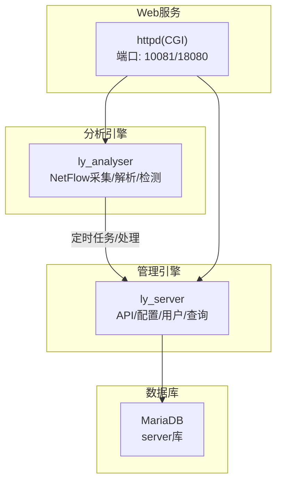
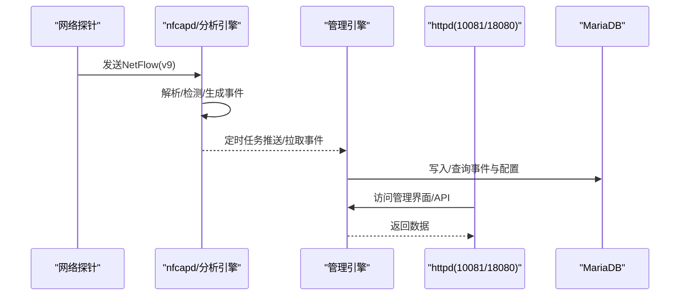
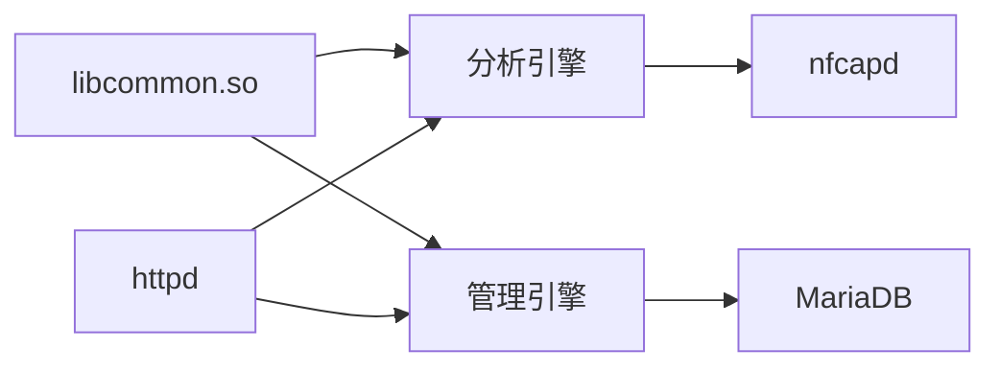

# 快速开始

<cite>
**本文引用的文件**
- [ly_analyser/README.md](file://ly_analyser/README.md)
- [ly_analyser/INSTALL.md](file://ly_analyser/INSTALL.md)
- [ly_server/README.md](file://ly_server/README.md)
- [ly_server/INSTALL.md](file://ly_server/INSTALL.md)
- [ly_docs/content/zh/installation/ly_analyser.md](file://ly_docs/content/zh/installation/ly_analyser.md)
- [ly_docs/content/zh/installation/ly_server.md](file://ly_docs/content/zh/installation/ly_server.md)
- [ly_analyser/src/common/Makefile](file://ly_analyser/src/common/Makefile)
- [ly_server/src/common/Makefile](file://ly_server/src/common/Makefile)
</cite>

## 目录
1. [简介](#简介)
2. [项目结构](#项目结构)
3. [核心组件](#核心组件)
4. [架构总览](#架构总览)
5. [详细组件分析](#详细组件分析)
6. [依赖关系分析](#依赖关系分析)
7. [性能注意事项](#性能注意事项)
8. [故障排除指南](#故障排除指南)
9. [结论](#结论)
10. [附录：验证清单与命令速查](#附录验证清单与命令速查)

## 简介
本快速开始指南面向SOC安全运营中心的初次使用者，提供从开发环境搭建、源码编译到服务启动的完整流程。文档基于仓库内各模块的说明与构建脚本整理而成，确保初学者能够按步骤成功运行系统。

## 项目结构
本项目由多个子系统组成，主要包括：
- ly_analyser：威胁行为分析引擎，负责接收并解析NetFlow数据，运行检测模型，产出威胁事件与特征数据。
- ly_server：管理引擎，聚合分析结果，提供用户、配置、节点管理与数据查询等能力。
- ly_vis：可视化前端（本指南聚焦后端部署与运行）。
- ly_docs：项目文档站点（Hugo），用于发布安装与使用文档。

图表来源
- [ly_analyser/README.md:29-47](file://ly_analyser/README.md#L29-L47)
- [ly_server/README.md:21-39](file://ly_server/README.md#L21-L39)

章节来源
- [ly_analyser/README.md:1-212](file://ly_analyser/README.md#L1-L212)
- [ly_server/README.md:1-233](file://ly_server/README.md#L1-L233)

## 核心组件
- 分析引擎（ly_analyser）
  - 功能：读取NetFlow v9数据，执行扫描、DGA、DNS隧道、ICMP隧道、外联、挖矿、注入等检测模型，输出威胁事件与取证特征。
  - 关键组件：nfdump（数据采集）、agent（主体逻辑）、flow（检测模型）、handlers（数据处理）、indexing（索引）、data（存储）。
- 管理引擎（ly_server）
  - 功能：聚合分析结果，提供用户、配置、设备、策略、事件查询等API与管理界面。
  - 关键组件：common（公共库）、lib（工具库）、server（API实现）。

章节来源
- [ly_analyser/README.md:1-26](file://ly_analyser/README.md#L1-L26)
- [ly_server/README.md:1-17](file://ly_server/README.md#L1-L17)

## 架构总览
整体数据流：探针发送NetFlow至分析引擎，分析引擎解析并运行检测模型，产出事件；管理引擎通过定时任务拉取或接收事件，进行聚合与展示；Web服务通过httpd暴露CGI接口供操作。

图表来源
- [ly_analyser/README.md:130-184](file://ly_analyser/README.md#L130-L184)
- [ly_server/README.md:107-193](file://ly_server/README.md#L107-L193)

## 详细组件分析

### 分析引擎（ly_analyser）部署与运行
- 操作系统要求
  - CentOS-7-x86_64-Minimal-2009
- 依赖软件
  - 编译器与工具：gcc、gcc-c++、cmake、bison、flex
  - 库与开发包：json-c-devel、boost-devel、libcurl-devel、libpcap-devel、mariadb-devel、httpd、ntp
  - 第三方组件：cgicc-3.2.16、cppdb-0.3.1、protobuf-3.8.0、tensorflow-2.0.4（头文件与库）
- 编译与安装
  - 创建目录与软链接：/home/Agent -> /Agent，/home/data/flow -> /data/flow -> /Agent/flow
  - 编译顺序：common -> agent -> nfdump（复制nfcapd/nfdump至/Agent/bin）
  - 安装产物：libcommon.so安装至/Agent/lib与/Server/lib，以及系统库路径
- 运行环境配置
  - 语言与时区：设置LANG为en_US.UTF-8，时区指向Asia/Shanghai，同步时间
  - 安全与防火墙：关闭SELinux，开放端口10081/tcp
  - httpd配置：监听10081，DocumentRoot指向/Agent/cmd，启用CGI
- 运行配置
  - 定时任务：每5分钟执行/Agent/bin/extractor
  - 启动nfcapd：监听UDP端口9995，将NetFlow写入/data/flow/3

章节来源
- [ly_analyser/README.md:29-184](file://ly_analyser/README.md#L29-L184)
- [ly_analyser/INSTALL.md:7-94](file://ly_analyser/INSTALL.md#L7-L94)
- [ly_docs/content/zh/installation/ly_analyser.md:44-196](file://ly_docs/content/zh/installation/ly_analyser.md#L44-L196)
- [ly_analyser/src/common/Makefile:1-52](file://ly_analyser/src/common/Makefile#L1-L52)

### 管理引擎（ly_server）部署与运行
- 操作系统要求
  - CentOS-7-x86_64-Minimal-2009
- 依赖软件
  - 编译器与工具：gcc、gcc-c++、cmake、bison、flex
  - 库与开发包：json-c-devel、boost-devel、libcurl-devel、mariadb-server、mariadb-devel、httpd、ntp
  - 第三方组件：cgicc-3.2.16、cppdb-0.3.1、protobuf-3.8.0
- 编译与安装
  - 创建目录与软链接：/home/Server -> /Server
  - 编译顺序：common -> lib -> server
  - 安装产物：libcommon.so安装至/Server/lib与/Agent/lib，以及系统库路径
- 运行环境配置
  - 语言与时区：设置LANG为en_US.UTF-8，时区指向Asia/Shanghai，同步时间
  - 安全与防火墙：关闭SELinux，开放端口18080/tcp
  - httpd配置：监听18080，DocumentRoot指向/Server/www，启用CGI与重写规则
  - MariaDB配置：创建配置文件gl.server.cnf，启动数据库，初始化server库并导入SQL
- 运行配置
  - 定时任务：每5分钟执行/Server/bin/config_pusher与/Server/bin/gen_event

章节来源
- [ly_server/README.md:21-204](file://ly_server/README.md#L21-L204)
- [ly_server/INSTALL.md:7-138](file://ly_server/INSTALL.md#L7-L138)
- [ly_docs/content/zh/installation/ly_server.md:39-217](file://ly_docs/content/zh/installation/ly_server.md#L39-L217)
- [ly_server/src/common/Makefile:1-52](file://ly_server/src/common/Makefile#L1-L52)

### 构建系统与依赖
- 构建工具链
  - C++标准：c++1y，优化级别O2，开启调试符号-g
  - 动态库：libcommon.so，静态库：libcommon.a
  - Protobuf：.proto文件编译为.pb.cc/.pb.h
- 依赖库
  - protobuf、cppdb、cgicc、curl、boost_regex
- 安装路径
  - SERVER_INSTALL_DIR=/Server/lib
  - AGENT_INSTALL_DIR=/Agent/lib
  - 同时复制到/lib64以便系统加载

章节来源
- [ly_analyser/src/common/Makefile:1-52](file://ly_analyser/src/common/Makefile#L1-L52)
- [ly_server/src/common/Makefile:1-52](file://ly_server/src/common/Makefile#L1-L52)

## 依赖关系分析
- 组件耦合
  - 分析引擎与管理引擎通过定时任务交互，解耦程度较高。
  - 两者共享公共库libcommon.so，降低重复实现。
- 外部依赖
  - httpd提供CGI接口，分别暴露10081（分析引擎）与18080（管理引擎）。
  - MariaDB作为管理引擎的数据存储。
  - nfcapd负责NetFlow采集与落盘。
- 潜在循环依赖
  - 无直接代码级循环依赖；通过文件系统与定时任务协作。

图表来源
- [ly_analyser/src/common/Makefile:40-45](file://ly_analyser/src/common/Makefile#L40-L45)
- [ly_server/src/common/Makefile:40-45](file://ly_server/src/common/Makefile#L40-L45)

章节来源
- [ly_analyser/src/common/Makefile:1-52](file://ly_analyser/src/common/Makefile#L1-L52)
- [ly_server/src/common/Makefile:1-52](file://ly_server/src/common/Makefile#L1-L52)

## 性能注意事项
- NetFlow采集与解析
  - 合理设置nfcapd缓冲区与日志轮转，避免磁盘IO瓶颈。
- 检测模型
  - 机器学习与规则混合模型对CPU敏感，建议根据流量规模调整线程与资源限制。
- 数据库
  - MariaDB需调优连接数、缓冲池大小，定期维护表与索引。
- Web服务
  - httpd并发与CGI进程数需根据负载调整，必要时引入反向代理与缓存。

[本节为通用指导，不直接分析具体文件]

## 故障排除指南
- SELinux阻止服务访问
  - 现象：httpd无法执行CGI或访问目录
  - 解决：确认已关闭SELinux并重启firewalld，开放对应端口
- 端口冲突
  - 现象：服务启动失败
  - 解决：检查10081与18080是否被占用，修改配置或释放端口
- 数据库连接失败
  - 现象：管理引擎无法读写数据
  - 解决：确认MariaDB已启动，配置文件正确，数据库server存在且已导入SQL
- Protobuf/C++库缺失
  - 现象：编译或运行时找不到库
  - 解决：安装依赖并建立软链接，确保lib路径包含/usr/local/lib与/usr/lib64
- 定时任务未执行
  - 现象：事件未更新或配置未推送
  - 解决：检查cron配置与权限，确认可执行文件路径正确

章节来源
- [ly_analyser/README.md:130-184](file://ly_analyser/README.md#L130-L184)
- [ly_server/README.md:107-204](file://ly_server/README.md#L107-L204)

## 结论
按照本指南完成环境准备、依赖安装、源码编译与服务配置后，即可运行SOC安全运营中心的核心组件。建议在生产环境中结合监控与告警机制，持续评估性能与安全基线。

[本节为总结性内容，不直接分析具体文件]

## 附录：验证清单与命令速查
- 环境准备
  - 操作系统：CentOS-7-x86_64-Minimal-2009
  - 语言与时区：LANG=en_US.UTF-8，时区Asia/Shanghai，时间同步
- 依赖安装
  - 编译器与工具：gcc、gcc-c++、cmake、bison、flex
  - 库与开发包：json-c-devel、boost-devel、libcurl-devel、libpcap-devel、mariadb-devel、httpd、ntp
  - 第三方组件：cgicc-3.2.16、cppdb-0.3.1、protobuf-3.8.0、tensorflow-2.0.4（头文件与库）
- 编译与安装
  - 分析引擎：common -> agent -> nfdump（复制nfcapd/nfdump至/Agent/bin）
  - 管理引擎：common -> lib -> server
- 运行配置
  - 分析引擎：httpd监听10081，CGI目录/Agent/cmd，定时任务/Agent/bin/extractor，启动nfcapd监听9995
  - 管理引擎：httpd监听18080，CGI目录/Server/www，MariaDB配置与初始化，定时任务config_pusher与gen_event
- 验证步骤
  - 访问http://<IP>:10081与http://<IP>:18080确认页面可达
  - 检查nfcapd进程与日志，确认NetFlow数据流入
  - 登录管理界面，查看事件与配置是否正常

章节来源
- [ly_analyser/README.md:29-184](file://ly_analyser/README.md#L29-L184)
- [ly_server/README.md:21-204](file://ly_server/README.md#L21-L204)
- [ly_docs/content/zh/installation/ly_analyser.md:44-196](file://ly_docs/content/zh/installation/ly_analyser.md#L44-L196)
- [ly_docs/content/zh/installation/ly_server.md:39-217](file://ly_docs/content/zh/installation/ly_server.md#L39-L217)