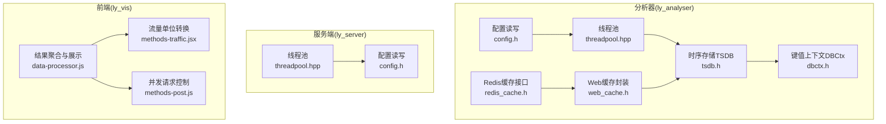
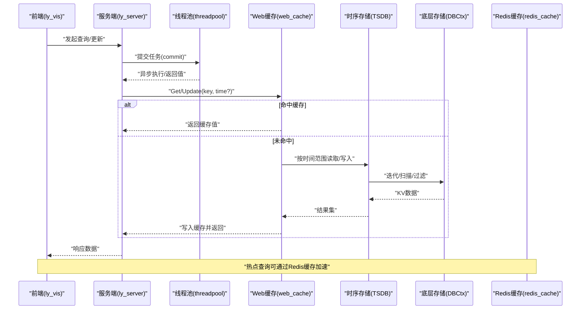
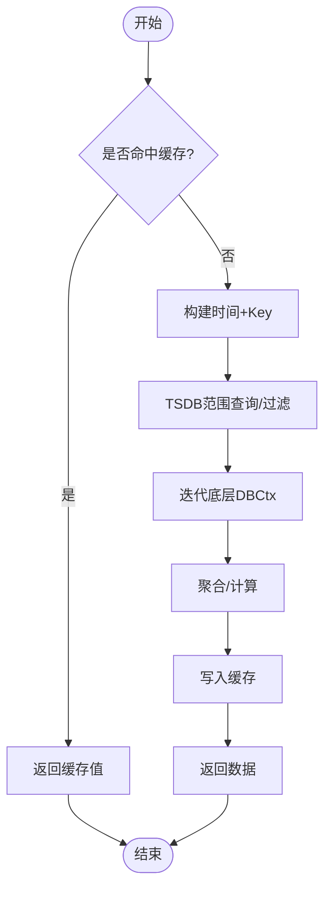
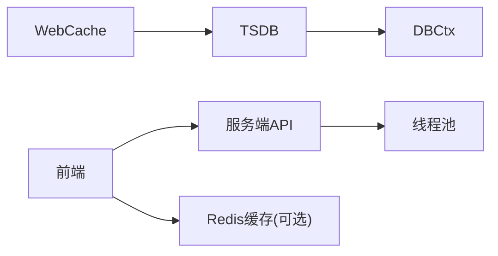

# 性能优化

<cite>
**本文引用的文件**
- [ly_analyser/src/common/threadpool.hpp](file://ly_analyser/src/common/threadpool.hpp)
- [ly_server/src/common/threadpool.hpp](file://ly_server/src/common/threadpool.hpp)
- [ly_analyser/src/agent/data/web_cache.h](file://ly_analyser/src/agent/data/web_cache.h)
- [ly_analyser/src/agent/data/tsdb.h](file://ly_analyser/src/agent/data/tsdb.h)
- [ly_analyser/src/agent/data/dbctx.h](file://ly_analyser/src/agent/data/dbctx.h)
- [ly_analyser/src/agent/handlers/redis_cache.h](file://ly_analyser/src/agent/handlers/redis_cache.h)
- [ly_analyser/src/common/config.h](file://ly_analyser/src/common/config.h)
- [ly_server/src/common/config.h](file://ly_server/src/common/config.h)
- [ly_vis/packages/std/src/page/result/data-processor.js](file://ly_vis/packages/std/src/page/result/data-processor.js)
- [ly_vis/packages/components/utils/universal/methods-traffic.jsx](file://ly_vis/packages/components/utils/universal/methods-traffic.jsx)
- [ly_vis/packages/components/utils/universal/methods-post.js](file://ly_vis/packages/components/utils/universal/methods-post.js)
</cite>

## 目录
1. [简介](#简介)
2. [项目结构](#项目结构)
3. [核心组件](#核心组件)
4. [架构总览](#架构总览)
5. [详细组件分析](#详细组件分析)
6. [依赖关系分析](#依赖关系分析)
7. [性能考量](#性能考量)
8. [故障排查指南](#故障排查指南)
9. [结论](#结论)
10. [附录](#附录)

## 简介
本技术文档聚焦于系统性能优化，覆盖瓶颈识别、内存管理、并发处理、数据库查询与索引策略、缓存设计、负载均衡与资源调度、监控指标、高并发调优、线程池配置、锁优化、性能测试工具与基准报告、容量规划与扩展性设计、故障转移机制以及监控告警与自动化运维。内容基于仓库中实际代码与模块进行梳理，并结合工程实践给出可操作的优化建议。

## 项目结构
本项目由多个子系统组成：
- ly_analyser：采集与分析侧，包含数据存取（TSDB、WebCache）、Redis 缓存接口、线程池、配置读写等。
- ly_server：服务端侧，提供配置读写、通用库（含线程池）等。
- ly_vis：前端可视化与数据处理逻辑，包含结果聚合、流量单位换算、并发请求控制等。



图表来源
- [ly_analyser/src/common/threadpool.hpp:1-111](file://ly_analyser/src/common/threadpool.hpp#L1-L111)
- [ly_analyser/src/agent/data/tsdb.h:1-79](file://ly_analyser/src/agent/data/tsdb.h#L1-L79)
- [ly_analyser/src/agent/data/dbctx.h:1-88](file://ly_analyser/src/agent/data/dbctx.h#L1-L88)
- [ly_analyser/src/agent/data/web_cache.h:1-56](file://ly_analyser/src/agent/data/web_cache.h#L1-L56)
- [ly_analyser/src/agent/handlers/redis_cache.h:1-14](file://ly_analyser/src/agent/handlers/redis_cache.h#L1-L14)
- [ly_analyser/src/common/config.h:1-49](file://ly_analyser/src/common/config.h#L1-L49)
- [ly_server/src/common/threadpool.hpp:1-111](file://ly_server/src/common/threadpool.hpp#L1-L111)
- [ly_server/src/common/config.h:1-49](file://ly_server/src/common/config.h#L1-L49)
- [ly_vis/packages/std/src/page/result/data-processor.js:1-493](file://ly_vis/packages/std/src/page/result/data-processor.js#L1-L493)
- [ly_vis/packages/components/utils/universal/methods-traffic.jsx:35-54](file://ly_vis/packages/components/utils/universal/methods-traffic.jsx#L35-L54)
- [ly_vis/packages/components/utils/universal/methods-post.js:42-79](file://ly_vis/packages/components/utils/universal/methods-post.js#L42-L79)

章节来源
- [ly_analyser/src/common/threadpool.hpp:1-111](file://ly_analyser/src/common/threadpool.hpp#L1-L111)
- [ly_analyser/src/agent/data/tsdb.h:1-79](file://ly_analyser/src/agent/data/tsdb.h#L1-L79)
- [ly_analyser/src/agent/data/dbctx.h:1-88](file://ly_analyser/src/agent/data/dbctx.h#L1-L88)
- [ly_analyser/src/agent/data/web_cache.h:1-56](file://ly_analyser/src/agent/data/web_cache.h#L1-L56)
- [ly_analyser/src/agent/handlers/redis_cache.h:1-14](file://ly_analyser/src/agent/handlers/redis_cache.h#L1-L14)
- [ly_analyser/src/common/config.h:1-49](file://ly_analyser/src/common/config.h#L1-L49)
- [ly_server/src/common/threadpool.hpp:1-111](file://ly_server/src/common/threadpool.hpp#L1-L111)
- [ly_server/src/common/config.h:1-49](file://ly_server/src/common/config.h#L1-L49)
- [ly_vis/packages/std/src/page/result/data-processor.js:1-493](file://ly_vis/packages/std/src/page/result/data-processor.js#L1-L493)
- [ly_vis/packages/components/utils/universal/methods-traffic.jsx:35-54](file://ly_vis/packages/components/utils/universal/methods-traffic.jsx#L35-L54)
- [ly_vis/packages/components/utils/universal/methods-post.js:42-79](file://ly_vis/packages/components/utils/universal/methods-post.js#L42-L79)

## 核心组件
- 线程池：用于并发任务调度与执行，支持提交带返回值的任务，维护空闲线程计数，具备优雅关闭能力。
- 时序数据库（TSDB）：按时间窗口组织KV数据，支持范围扫描、过滤、大小统计；内部对底层DBCtx做缓存包装，减少重复IO。
- 键值上下文（DBCtx）：统一KV操作抽象，提供迭代器、事务边界、存在性检查等。
- Web缓存：面向Web场景的缓存封装，支持按时间戳或Key的Get/Update，并复用TSDB作为后端。
- Redis缓存接口：为TopN等热点查询提供外部缓存读写能力。
- 配置读写：统一的配置加载与持久化接口，便于运行时参数调整。
- 前端数据处理：批量聚合、单位换算、并发请求控制，降低渲染与网络开销。

章节来源
- [ly_analyser/src/common/threadpool.hpp:1-111](file://ly_analyser/src/common/threadpool.hpp#L1-L111)
- [ly_analyser/src/agent/data/tsdb.h:1-79](file://ly_analyser/src/agent/data/tsdb.h#L1-L79)
- [ly_analyser/src/agent/data/dbctx.h:1-88](file://ly_analyser/src/agent/data/dbctx.h#L1-L88)
- [ly_analyser/src/agent/data/web_cache.h:1-56](file://ly_analyser/src/agent/data/web_cache.h#L1-L56)
- [ly_analyser/src/agent/handlers/redis_cache.h:1-14](file://ly_analyser/src/agent/handlers/redis_cache.h#L1-L14)
- [ly_analyser/src/common/config.h:1-49](file://ly_analyser/src/common/config.h#L1-L49)
- [ly_server/src/common/threadpool.hpp:1-111](file://ly_server/src/common/threadpool.hpp#L1-L111)
- [ly_server/src/common/config.h:1-49](file://ly_server/src/common/config.h#L1-L49)
- [ly_vis/packages/std/src/page/result/data-processor.js:1-493](file://ly_vis/packages/std/src/page/result/data-processor.js#L1-L493)
- [ly_vis/packages/components/utils/universal/methods-traffic.jsx:35-54](file://ly_vis/packages/components/utils/universal/methods-traffic.jsx#L35-L54)
- [ly_vis/packages/components/utils/universal/methods-post.js:42-79](file://ly_vis/packages/components/utils/universal/methods-post.js#L42-L79)

## 架构总览
下图展示了从前端到后端再到存储层的整体数据流与缓存路径，突出关键性能点：前端并发控制、后端线程池并行、TSDB时间分片与缓存、Redis热点缓存。



图表来源
- [ly_vis/packages/components/utils/universal/methods-post.js:42-79](file://ly_vis/packages/components/utils/universal/methods-post.js#L42-L79)
- [ly_analyser/src/common/threadpool.hpp:1-111](file://ly_analyser/src/common/threadpool.hpp#L1-L111)
- [ly_analyser/src/agent/data/web_cache.h:1-56](file://ly_analyser/src/agent/data/web_cache.h#L1-L56)
- [ly_analyser/src/agent/data/tsdb.h:1-79](file://ly_analyser/src/agent/data/tsdb.h#L1-L79)
- [ly_analyser/src/agent/data/dbctx.h:1-88](file://ly_analyser/src/agent/data/dbctx.h#L1-L88)
- [ly_analyser/src/agent/handlers/redis_cache.h:1-14](file://ly_analyser/src/agent/handlers/redis_cache.h#L1-L14)

## 详细组件分析

### 线程池（并发处理与资源调度）
- 设计要点
  - 使用条件变量与互斥量实现任务队列的阻塞与唤醒，避免忙轮询。
  - 通过原子变量跟踪停止状态与空闲线程数，便于监控与优雅退出。
  - 支持提交任意函数签名并返回future，便于上层等待结果。
- 性能影响
  - 合理设置线程池大小可避免上下文切换过多或CPU饥饿。
  - 任务粒度应适中，过小导致调度开销大，过大可能阻塞其他任务。
- 优化建议
  - 根据CPU核数与I/O密集程度动态调整线程数。
  - 结合任务优先级队列，保障关键路径优先执行。
  - 在高峰期监控idleCount，评估是否需要扩容或限流。

```mermaid
classDiagram
class Threadpool {
-vector~std : : thread~ pool
-queue~function<void()>~ tasks
-mutex m_lock
-condition_variable cv_task
-atomic<bool> stoped
-atomic<int> idlThrNum
+Threadpool(size)
+commit(f, args...) future
+idlCount() int
~析构()
}
```

图表来源
- [ly_analyser/src/common/threadpool.hpp:1-111](file://ly_analyser/src/common/threadpool.hpp#L1-L111)
- [ly_server/src/common/threadpool.hpp:1-111](file://ly_server/src/common/threadpool.hpp#L1-L111)

章节来源
- [ly_analyser/src/common/threadpool.hpp:1-111](file://ly_analyser/src/common/threadpool.hpp#L1-L111)
- [ly_server/src/common/threadpool.hpp:1-111](file://ly_server/src/common/threadpool.hpp#L1-L111)

### 时序数据库与缓存（TSDB与WebCache）
- 设计要点
  - TSDB以时间戳为维度组织KV，支持范围扫描与过滤，适合时序数据分析。
  - 内部CachedDBCtx对底层DBCtx做局部缓存，减少重复读取。
  - WebCache封装了按时间与Key的Get/Update，适配Web场景的频繁访问。
- 性能影响
  - 时间分片与过滤能显著降低扫描成本。
  - 缓存命中率直接影响端到端延迟。
- 优化建议
  - 针对高频查询建立二级索引（如按Key前缀或标签）。
  - 合理设置缓存过期策略与容量上限，避免内存膨胀。
  - 对大结果集采用分页或增量拉取，降低单次传输压力。



图表来源
- [ly_analyser/src/agent/data/web_cache.h:1-56](file://ly_analyser/src/agent/data/web_cache.h#L1-L56)
- [ly_analyser/src/agent/data/tsdb.h:1-79](file://ly_analyser/src/agent/data/tsdb.h#L1-L79)
- [ly_analyser/src/agent/data/dbctx.h:1-88](file://ly_analyser/src/agent/data/dbctx.h#L1-L88)

章节来源
- [ly_analyser/src/agent/data/web_cache.h:1-56](file://ly_analyser/src/agent/data/web_cache.h#L1-L56)
- [ly_analyser/src/agent/data/tsdb.h:1-79](file://ly_analyser/src/agent/data/tsdb.h#L1-L79)
- [ly_analyser/src/agent/data/dbctx.h:1-88](file://ly_analyser/src/agent/data/dbctx.h#L1-L88)

### Redis缓存接口（热点数据加速）
- 设计要点
  - 提供初始化、保存与加载接口，支持TTL控制，适用于TopN等热点查询。
- 性能影响
  - 有效降低后端TSDB/DB压力，提升读性能。
- 优化建议
  - 根据QPS与数据变化频率调整TTL。
  - 对写多读少的场景考虑本地缓存+异步落盘。

章节来源
- [ly_analyser/src/agent/handlers/redis_cache.h:1-14](file://ly_analyser/src/agent/handlers/redis_cache.h#L1-L14)

### 配置读写（运行时可调参数）
- 设计要点
  - 提供从文件或字符串加载配置，并支持序列化输出，便于热更新与版本管理。
- 性能影响
  - 合理的配置项（如线程池大小、缓存阈值）直接影响吞吐与延迟。
- 优化建议
  - 将关键性能参数纳入配置中心，支持灰度与回滚。
  - 启动时校验配置合法性，避免运行时异常。

章节来源
- [ly_analyser/src/common/config.h:1-49](file://ly_analyser/src/common/config.h#L1-L49)
- [ly_server/src/common/config.h:1-49](file://ly_server/src/common/config.h#L1-L49)

### 前端数据处理与并发控制
- 设计要点
  - 使用链式聚合计算公共字段、速率与总量，减少重复遍历。
  - 提供并发请求控制函数，限制同时执行的Promise数量，防止雪崩。
  - 流量单位换算工具统一显示格式，提升可读性。
- 性能影响
  - 合理的数据预处理可降低渲染压力与网络带宽占用。
  - 并发控制避免后端过载与前端卡顿。
- 优化建议
  - 对大数据集采用虚拟滚动与分页加载。
  - 对频繁变更的数据使用增量更新与防抖/节流。

章节来源
- [ly_vis/packages/std/src/page/result/data-processor.js:1-493](file://ly_vis/packages/std/src/page/result/data-processor.js#L1-L493)
- [ly_vis/packages/components/utils/universal/methods-traffic.jsx:35-54](file://ly_vis/packages/components/utils/universal/methods-traffic.jsx#L35-L54)
- [ly_vis/packages/components/utils/universal/methods-post.js:42-79](file://ly_vis/packages/components/utils/universal/methods-post.js#L42-L79)

## 依赖关系分析
- 组件耦合
  - WebCache依赖TSDB，TSDB依赖DBCtx，形成清晰的层次化依赖。
  - 线程池被前后端共用，作为基础并发设施。
  - Redis缓存作为可选加速层，与业务逻辑解耦。
- 潜在风险
  - 若TSDB缓存失效或未启用，可能导致底层DB频繁访问。
  - 线程池过大可能引发上下文切换开销，过小则吞吐不足。
- 外部依赖
  - 前端依赖lodash进行数据处理，需关注包体积与性能。
  - 后端依赖Protobuf进行配置与消息定义，需保持版本一致。



图表来源
- [ly_analyser/src/agent/data/web_cache.h:1-56](file://ly_analyser/src/agent/data/web_cache.h#L1-L56)
- [ly_analyser/src/agent/data/tsdb.h:1-79](file://ly_analyser/src/agent/data/tsdb.h#L1-L79)
- [ly_analyser/src/agent/data/dbctx.h:1-88](file://ly_analyser/src/agent/data/dbctx.h#L1-L88)
- [ly_analyser/src/common/threadpool.hpp:1-111](file://ly_analyser/src/common/threadpool.hpp#L1-L111)
- [ly_server/src/common/threadpool.hpp:1-111](file://ly_server/src/common/threadpool.hpp#L1-L111)
- [ly_analyser/src/agent/handlers/redis_cache.h:1-14](file://ly_analyser/src/agent/handlers/redis_cache.h#L1-L14)

章节来源
- [ly_analyser/src/agent/data/web_cache.h:1-56](file://ly_analyser/src/agent/data/web_cache.h#L1-L56)
- [ly_analyser/src/agent/data/tsdb.h:1-79](file://ly_analyser/src/agent/data/tsdb.h#L1-L79)
- [ly_analyser/src/agent/data/dbctx.h:1-88](file://ly_analyser/src/agent/data/dbctx.h#L1-L88)
- [ly_analyser/src/common/threadpool.hpp:1-111](file://ly_analyser/src/common/threadpool.hpp#L1-L111)
- [ly_server/src/common/threadpool.hpp:1-111](file://ly_server/src/common/threadpool.hpp#L1-L111)
- [ly_analyser/src/agent/handlers/redis_cache.h:1-14](file://ly_analyser/src/agent/handlers/redis_cache.h#L1-L14)

## 性能考量
- 瓶颈识别
  - I/O瓶颈：TSDB/DBCtx频繁读取，需评估缓存命中率与磁盘吞吐。
  - CPU瓶颈：前端大量聚合计算，需关注主线程负载与渲染帧率。
  - 并发瓶颈：线程池大小与任务粒度不匹配，导致排队或抖动。
- 内存管理
  - 控制缓存大小与过期策略，避免OOM。
  - 前端大数据集采用分页与虚拟滚动，减少DOM节点数量。
- 并发处理
  - 使用线程池隔离不同工作负载，避免相互干扰。
  - 前端并发请求限制，防止后端雪崩。
- 数据库查询优化
  - 利用时间分片与过滤缩小扫描范围。
  - 为高频Key建立索引或预聚合表。
- 缓存设计
  - 多级缓存：本地内存+Redis+TSDB，分层命中。
  - TTL与容量策略：按数据热度与变化频率配置。
- 负载均衡与资源调度
  - 水平扩展服务实例，配合负载均衡器分发请求。
  - 动态调整线程池大小与缓存阈值，适应流量波动。
- 监控指标
  - 线程池空闲数、任务队列长度、P99延迟、缓存命中率、I/O吞吐。
- 高并发调优
  - 批处理与合并写，减少锁竞争。
  - 无锁数据结构或细粒度锁，降低临界区时长。
- 容量规划与扩展性
  - 按峰值QPS与数据增长率规划存储与计算资源。
  - 支持横向扩展与弹性伸缩。
- 故障转移
  - 健康检查与自动摘除故障节点。
  - 降级策略：缓存兜底、只读模式、限流。

[本节为通用指导，不直接分析具体文件]

## 故障排查指南
- 常见问题
  - 线程池任务堆积：检查idleCount与任务耗时，必要时扩容或优化任务粒度。
  - 缓存命中率低：分析Key分布与TTL设置，优化预热策略。
  - 前端卡顿：减少一次性渲染数据量，启用分页与虚拟列表。
- 定位方法
  - 增加日志与埋点，记录关键路径耗时与错误码。
  - 使用性能剖析工具（如perf、浏览器Performance面板）定位热点。
- 恢复措施
  - 快速回滚配置与代码版本。
  - 临时限流与降级，保护核心功能。

章节来源
- [ly_analyser/src/common/threadpool.hpp:1-111](file://ly_analyser/src/common/threadpool.hpp#L1-L111)
- [ly_analyser/src/agent/data/web_cache.h:1-56](file://ly_analyser/src/agent/data/web_cache.h#L1-L56)
- [ly_vis/packages/std/src/page/result/data-processor.js:1-493](file://ly_vis/packages/std/src/page/result/data-processor.js#L1-L493)

## 结论
通过对线程池、TSDB、缓存与前端数据处理的深入分析，可以明确系统在并发、I/O与内存方面的关键优化点。结合多级缓存、合理索引、动态资源调度与完善监控告警，能够有效提升吞吐、降低延迟并增强稳定性。建议在上线前完成基准测试与容量规划，并在运行期持续观测与调优。

[本节为总结，不直接分析具体文件]

## 附录
- 性能测试工具与方法
  - 后端：使用压测工具模拟高并发请求，测量QPS、延迟与错误率。
  - 前端：使用浏览器开发者工具进行性能分析，关注长任务与重排重绘。
- 基准测试结果与分析
  - 记录不同配置下的性能指标，对比优化前后差异。
  - 分析热点路径，针对性优化。
- 自动化运维
  - 集成监控与告警，设置阈值与通知渠道。
  - 实现配置热更新与灰度发布，降低变更风险。

[本节为补充信息，不直接分析具体文件]