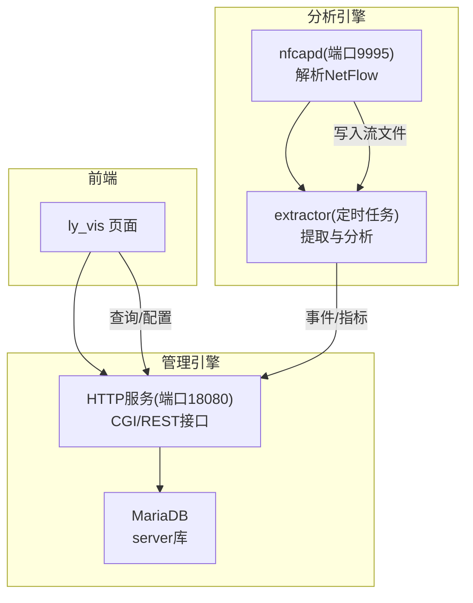
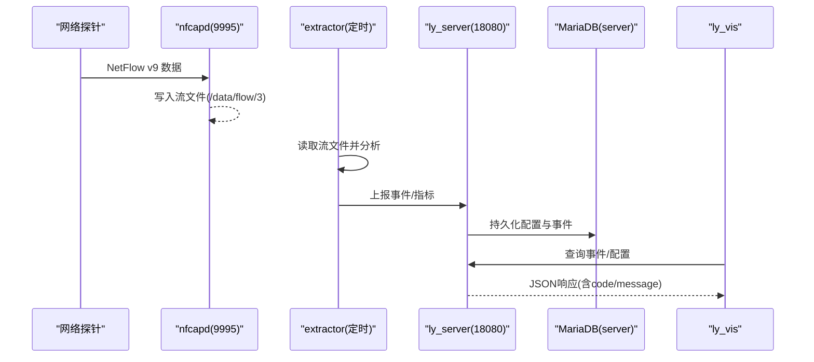
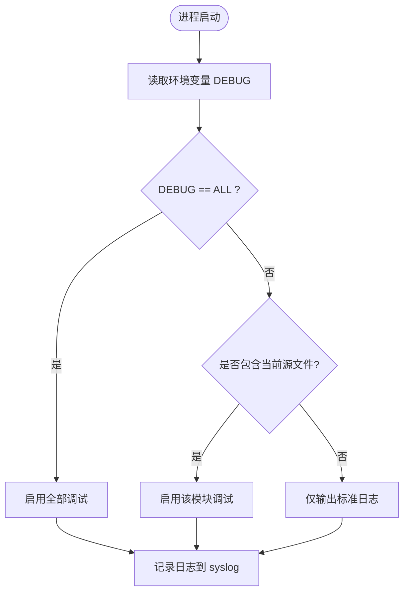
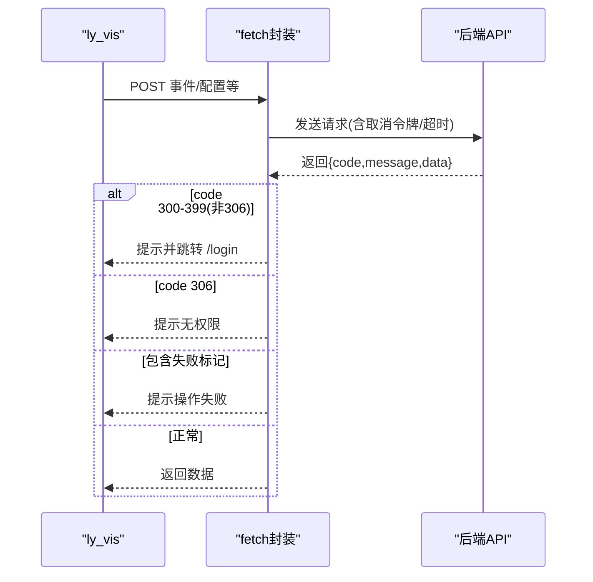
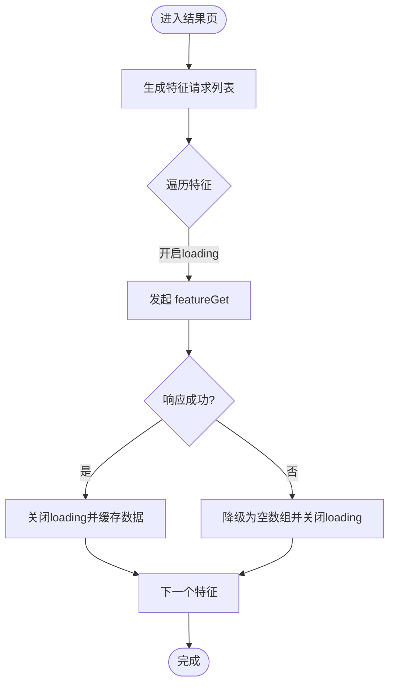

# 故障排除

<cite>
**本文引用的文件**
- [ly_analyser/README.md](file://ly_analyser/README.md)
- [ly_analyser/INSTALL.md](file://ly_analyser/INSTALL.md)
- [ly_server/README.md](file://ly_server/README.md)
- [ly_server/INSTALL.md](file://ly_server/INSTALL.md)
- [ly_analyser/src/common/log.h](file://ly_analyser/src/common/log.h)
- [ly_server/src/common/log.h](file://ly_server/src/common/log.h)
- [ly_server/src/server/dbc.cpp](file://ly_server/src/server/dbc.cpp)
- [ly_vis/packages/std/src/service/fetch.js](file://ly_vis/packages/std/src/service/fetch.js)
- [ly_vis/packages/std/src/service/api/event.js](file://ly_vis/packages/std/src/service/api/event.js)
- [ly_vis/packages/std/src/page/result/store.js](file://ly_vis/packages/std/src/page/result/store.js)
</cite>

## 目录
1. [简介](#简介)
2. [项目结构](#项目结构)
3. [核心组件](#核心组件)
4. [架构总览](#架构总览)
5. [详细组件分析](#详细组件分析)
6. [依赖关系分析](#依赖关系分析)
7. [性能注意事项](#性能注意事项)
8. [故障排查指南](#故障排查指南)
9. [结论](#结论)
10. [附录](#附录)

## 简介
本指南面向SOC系统的安装部署、运行期错误与性能问题的诊断与恢复。内容覆盖日志分析方法、错误码含义、调试工具使用，以及网络连接、数据库连接异常、内存泄漏排查；同时提供性能瓶颈定位、CPU占用过高与磁盘空间不足的诊断方法，并给出系统资源监控、服务状态检查、依赖验证、故障恢复流程、数据修复与系统重建建议，以及在线支持与社区资源链接。

## 项目结构
本项目由三大子系统构成：
- ly_analyser：威胁行为分析引擎，接收NetFlow v9数据，执行检测模型，产出威胁事件与特征数据。
- ly_server：管理引擎，聚合事件、管理配置与用户、提供查询API。
- ly_vis：前端可视化与配置界面，调用后端API进行展示与交互。



图表来源
- [ly_analyser/README.md:130-184](file://ly_analyser/README.md#L130-L184)
- [ly_server/README.md:107-193](file://ly_server/README.md#L107-L193)

章节来源
- [ly_analyser/README.md:1-212](file://ly_analyser/README.md#L1-L212)
- [ly_server/README.md:1-233](file://ly_server/README.md#L1-L233)

## 核心组件
- 数据接入与处理
  - nfcapd：监听端口9995，接收探针的NetFlow v9数据并落盘。
  - extractor：定时任务（每5分钟）从流文件中提取并触发分析。
- 管理与查询
  - HTTP服务：监听端口18080，提供配置、事件、资产等API。
  - MariaDB：存储server库及配置数据。
- 前端
  - ly_vis：通过统一请求封装与后端交互，处理登录态、权限与错误提示。

章节来源
- [ly_analyser/README.md:175-184](file://ly_analyser/README.md#L175-L184)
- [ly_server/README.md:197-204](file://ly_server/README.md#L197-L204)
- [ly_vis/packages/std/src/service/fetch.js:1-73](file://ly_vis/packages/std/src/service/fetch.js#L1-L73)

## 架构总览


图表来源
- [ly_analyser/README.md:175-184](file://ly_analyser/README.md#L175-L184)
- [ly_server/README.md:197-204](file://ly_server/README.md#L197-L204)
- [ly_vis/packages/std/src/service/fetch.js:1-73](file://ly_vis/packages/std/src/service/fetch.js#L1-L73)

## 详细组件分析

### 日志系统与调试开关
- 日志输出
  - 分析引擎与管理引擎均通过syslog输出错误、警告、信息级别日志。
  - 可通过系统日志查看器或集中式日志平台检索。
- 调试开关
  - 通过环境变量DEBUG控制细粒度调试：设置为ALL或包含源文件名时启用对应模块调试。



图表来源
- [ly_analyser/src/common/log.h:6-40](file://ly_analyser/src/common/log.h#L6-L40)
- [ly_server/src/common/log.h:6-40](file://ly_server/src/common/log.h#L6-L40)

章节来源
- [ly_analyser/src/common/log.h:1-43](file://ly_analyser/src/common/log.h#L1-L43)
- [ly_server/src/common/log.h:1-43](file://ly_server/src/common/log.h#L1-L43)

### 数据库连接与初始化
- 连接参数
  - 从配置文件读取数据库组名、用户名、密码与数据库名，构建连接串。
- 常见问题
  - 配置文件路径或权限错误导致无法读取。
  - 数据库服务未启动或认证失败。
  - 字符集与编码不一致导致乱码或导入失败。

```mermaid
sequenceDiagram
participant Svc as "ly_server"
participant Conf as "DB配置文件"
participant DB as "MariaDB"
Svc->>Conf : 读取 user/database/passwd/group
Svc->>DB : 建立会话(mysql : database=...;read_default_group=...)
DB-->>Svc : 连接成功/失败
Note over Svc,DB : 失败时检查配置、服务状态、权限与字符集
```

图表来源
- [ly_server/src/server/dbc.cpp:1-27](file://ly_server/src/server/dbc.cpp#L1-L27)

章节来源
- [ly_server/src/server/dbc.cpp:1-27](file://ly_server/src/server/dbc.cpp#L1-L27)
- [ly_server/README.md:159-193](file://ly_server/README.md#L159-L193)
- [ly_server/INSTALL.md:94-127](file://ly_server/INSTALL.md#L94-L127)

### 前端请求与错误处理
- 统一请求封装
  - 基于axios封装，支持取消令牌、超时控制与重试策略。
  - 对特定接口（如threatinfo）设置更短超时以适配外网受限场景。
- 错误码与跳转
  - 当返回code在300-399范围且非306时，视为未登录，自动跳转到登录页并提示。
  - code为306表示无权限，提示“本角色暂无此项操作权限”。
  - 特殊字符串标记失败时提示“操作失败”。



图表来源
- [ly_vis/packages/std/src/service/fetch.js:1-73](file://ly_vis/packages/std/src/service/fetch.js#L1-L73)
- [ly_vis/packages/std/src/service/api/event.js:1-50](file://ly_vis/packages/std/src/service/api/event.js#L1-L50)

章节来源
- [ly_vis/packages/std/src/service/fetch.js:1-73](file://ly_vis/packages/std/src/service/fetch.js#L1-L73)
- [ly_vis/packages/std/src/service/api/event.js:1-50](file://ly_vis/packages/std/src/service/api/event.js#L1-L50)

### 结果页加载与并发控制
- 多类型特征并行请求
  - 根据特征列表发起多个featureGet请求，逐个开启loading，完成后关闭。
  - 失败时降级为空数组，保证页面可继续渲染。
- 资源优化
  - 通过取消令牌避免不必要的请求开销。



图表来源
- [ly_vis/packages/std/src/page/result/store.js:224-272](file://ly_vis/packages/std/src/page/result/store.js#L224-L272)

章节来源
- [ly_vis/packages/std/src/page/result/store.js:224-272](file://ly_vis/packages/std/src/page/result/store.js#L224-L272)

## 依赖关系分析
- 外部依赖
  - 操作系统：CentOS 7 x86_64 Minimal。
  - 编译与运行时：gcc/g++、cmake、bison/flex、boost、libcurl、libpcap、httpd、ntp、mariadb、protobuf、tensorflow（分析引擎）。
- 关键端口与服务
  - 分析引擎：HTTP 10081（CGI）、nfcapd 9995（NetFlow接收）。
  - 管理引擎：HTTP 18080（CGI/REST）、MariaDB默认端口。
- 依赖校验清单
  - 确认各服务已安装并处于运行状态。
  - 防火墙放行必要端口。
  - SELinux已禁用或正确配置。
  - 时区与NTP同步正确。

章节来源
- [ly_analyser/README.md:29-95](file://ly_analyser/README.md#L29-L95)
- [ly_server/README.md:21-77](file://ly_server/README.md#L21-L77)
- [ly_analyser/INSTALL.md:7-34](file://ly_analyser/INSTALL.md#L7-L34)
- [ly_server/INSTALL.md:7-35](file://ly_server/INSTALL.md#L7-L35)

## 性能注意事项
- 流量峰值与吞吐
  - 关注Bps/Pps/Fps指标，合理评估nfcapd与extractor的处理能力。
- 数据库压力
  - 高并发查询时注意MariaDB连接数与慢查询，必要时调整缓冲与索引。
- 前端请求优化
  - 合理使用取消令牌与超时，避免重复请求与阻塞。
- 资源监控
  - 使用系统工具监控CPU、内存、磁盘IO与网络带宽，结合日志定位瓶颈。

[本节为通用指导，不直接分析具体文件]

## 故障排查指南

### 安装与部署问题
- 依赖缺失或版本不匹配
  - 按安装文档逐项安装依赖，确保编译器、库与运行时一致。
- 编译失败
  - 检查cmake与Makefile目标是否正确，确认头文件与库路径。
- 部署脚本执行失败
  - 检查脚本权限与目录结构，确认依赖包已解压至正确位置。

章节来源
- [ly_analyser/README.md:50-126](file://ly_analyser/README.md#L50-L126)
- [ly_server/README.md:45-103](file://ly_server/README.md#L45-L103)
- [ly_analyser/INSTALL.md:7-34](file://ly_analyser/INSTALL.md#L7-L34)
- [ly_server/INSTALL.md:7-35](file://ly_server/INSTALL.md#L7-L35)

### 运行环境与配置问题
- 语言与时区
  - 设置LANG为UTF-8，配置时区为Asia/Shanghai，同步NTP时间。
- SELinux与防火墙
  - 关闭SELinux或配置相应规则；开放端口10081与18080。
- HTTP服务配置
  - 检查VirtualHost监听端口与DocumentRoot路径，重启httpd生效。

章节来源
- [ly_analyser/README.md:130-171](file://ly_analyser/README.md#L130-L171)
- [ly_server/README.md:107-159](file://ly_server/README.md#L107-L159)
- [ly_analyser/INSTALL.md:40-81](file://ly_analyser/INSTALL.md#L40-L81)
- [ly_server/INSTALL.md:41-93](file://ly_server/INSTALL.md#L41-L93)

### 数据接入与处理问题
- nfcapd未接收数据
  - 检查端口9995是否监听，探针是否指向正确IP与端口。
  - 查看流文件目录是否存在与写入权限。
- extractor未执行
  - 检查cron任务是否创建并生效，命令路径是否正确。
  - 查看日志中是否有解析错误或权限问题。

章节来源
- [ly_analyser/README.md:175-184](file://ly_analyser/README.md#L175-L184)
- [ly_analyser/INSTALL.md:85-94](file://ly_analyser/INSTALL.md#L85-L94)

### 数据库连接异常
- 连接失败
  - 检查配置文件路径与权限，确认user/database/passwd/group正确。
  - 验证MariaDB服务状态与监听端口。
- 导入失败
  - 确认字符集为utf8，数据库存在且权限足够。
  - 重新执行导入脚本并观察错误输出。

章节来源
- [ly_server/src/server/dbc.cpp:1-27](file://ly_server/src/server/dbc.cpp#L1-L27)
- [ly_server/README.md:159-193](file://ly_server/README.md#L159-L193)
- [ly_server/INSTALL.md:94-127](file://ly_server/INSTALL.md#L94-L127)

### 前端访问与权限问题
- 未登录或权限不足
  - 当返回code在300-399范围时，自动跳转登录页；306表示无权限。
  - 检查会话与角色配置，确认用户具备所需权限。
- 接口超时或失败
  - 针对受限外网环境，特定接口已设置较短超时；可调整或重试。
  - 出现失败标记时提示“操作失败”，检查后端日志与输入参数。

章节来源
- [ly_vis/packages/std/src/service/fetch.js:1-73](file://ly_vis/packages/std/src/service/fetch.js#L1-L73)
- [ly_vis/packages/std/src/service/api/event.js:1-50](file://ly_vis/packages/std/src/service/api/event.js#L1-L50)

### 网络连接问题
- 探针到分析引擎
  - 确认防火墙放行9995端口，路由可达，协议为UDP/TCP（依据探针配置）。
  - 使用抓包工具验证数据包是否到达。
- 前端到管理引擎
  - 确认18080端口开放，HTTPS/代理配置正确。
  - 浏览器控制台查看请求状态码与响应体。

[本节为通用指导，不直接分析具体文件]

### 日志分析方法
- 系统日志
  - 通过syslog查看错误、警告与信息日志，过滤关键字定位问题。
- 调试模式
  - 设置DEBUG=ALL或指定源文件，获取更详细的调试输出。
- 前端日志
  - 浏览器控制台查看网络请求与错误堆栈，结合后端日志交叉分析。

章节来源
- [ly_analyser/src/common/log.h:6-40](file://ly_analyser/src/common/log.h#L6-L40)
- [ly_server/src/common/log.h:6-40](file://ly_server/src/common/log.h#L6-L40)
- [ly_vis/packages/std/src/service/fetch.js:1-73](file://ly_vis/packages/std/src/service/fetch.js#L1-L73)

### 错误码含义
- 前端统一错误码
  - 300-399（非306）：未登录，跳转登录页。
  - 306：无权限，提示“本角色暂无此项操作权限”。
  - 包含失败标记：提示“操作失败”。
- 网络ICMP错误
  - 前端定义了常见ICMP类型与代码的描述，便于网络层问题定位。

章节来源
- [ly_vis/packages/std/src/service/fetch.js:1-73](file://ly_vis/packages/std/src/service/fetch.js#L1-L73)
- [ly_vis/packages/std/src/utils/methods-event.js:312-418](file://ly_vis/packages/std/src/utils/methods-event.js#L312-L418)

### 性能瓶颈分析
- CPU占用过高
  - 使用top/htop定位高CPU进程，结合日志判断是否为extractor或数据库查询。
  - 优化查询条件与索引，减少全表扫描。
- 内存泄漏排查
  - 使用valgrind或gdb分析C/C++进程内存分配与释放。
  - 前端使用浏览器性能面板检查长时间运行的任务与内存增长。
- 磁盘空间不足
  - 清理历史流文件与日志归档，调整保留策略。
  - 监控磁盘使用率与IO等待，必要时扩容或迁移数据。

[本节为通用指导，不直接分析具体文件]

### 系统资源监控与服务状态检查
- 服务状态
  - httpd、nfcapd、extractor、MariaDB服务是否运行。
- 资源监控
  - 使用systemd、ps、netstat/ss、iostat、vmstat等工具。
- 依赖验证
  - 端口监听、库文件可用性、环境变量与配置文件完整性。

[本节为通用指导，不直接分析具体文件]

### 故障恢复流程、数据修复与系统重建
- 故障恢复
  - 停止相关服务，修复配置或依赖后重启。
  - 清理临时文件与锁文件，确保状态一致。
- 数据修复
  - 重新导入数据库脚本，校验表结构与数据完整性。
  - 重放历史流文件进行分析，验证结果一致性。
- 系统重建
  - 备份配置与重要数据，重装依赖与程序，逐步恢复服务。

[本节为通用指导，不直接分析具体文件]

### 在线支持与社区资源
- 开源沟通邮箱：opensource@abyssalfish.com.cn
- 商务合作邮箱：sales@abyssalfish.com.cn
- 微信公众号：深海鱼科技有限公司

章节来源
- [ly_analyser/README.md:190-212](file://ly_analyser/README.md#L190-L212)
- [ly_server/README.md:210-233](file://ly_server/README.md#L210-L233)

## 结论
通过系统化地检查安装环境、服务状态、日志与错误码，并结合性能监控与资源分析，可以快速定位并解决SOC系统的常见问题。建议在生产环境中建立完善的监控与告警机制，定期演练故障恢复流程，保障系统稳定运行。

## 附录
- 常用命令参考
  - 检查服务：systemctl status httpd/mariadb
  - 查看端口：ss -tlnp | grep -E '9995|10081|18080'
  - 查看日志：tail -f /var/log/messages 或使用journalctl
  - 调试模式：export DEBUG=ALL 或 export DEBUG=source_file
- 参考文档路径
  - 安装与部署：见各子项目README与INSTALL文档
  - 配置示例：见各子项目配置片段与脚本

[本节为通用指导，不直接分析具体文件]