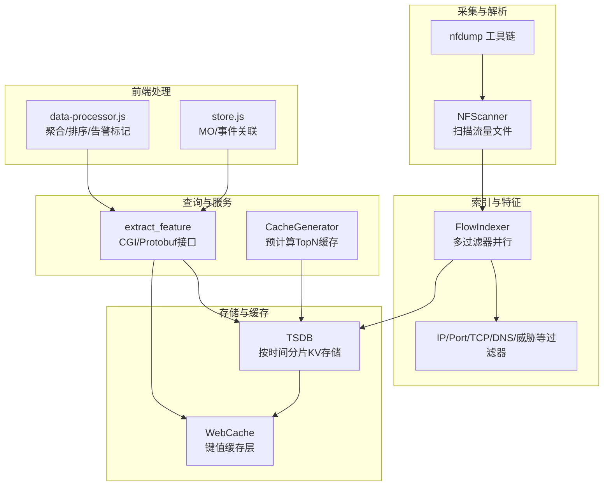
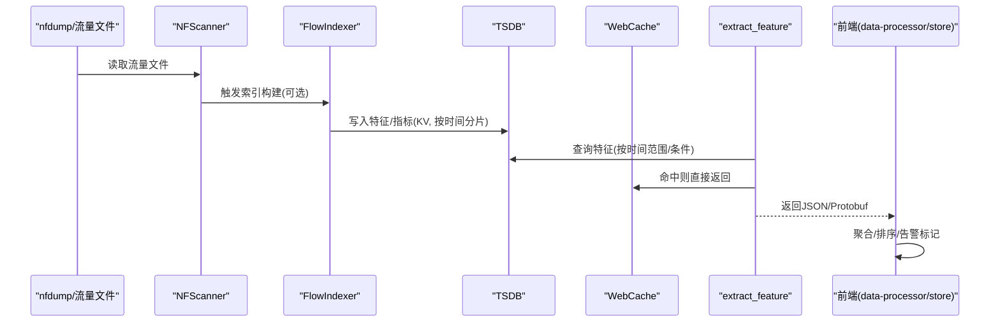
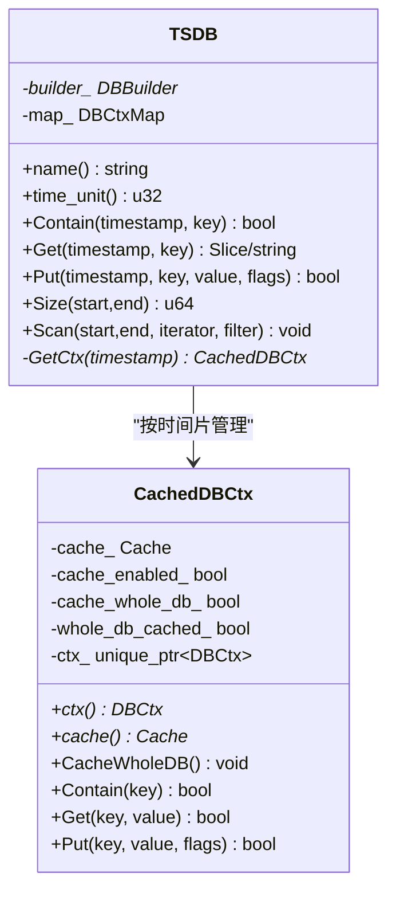
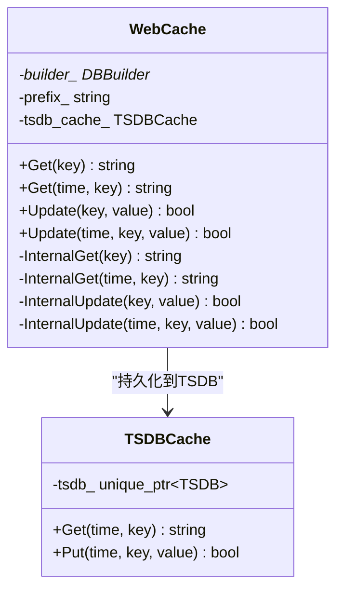
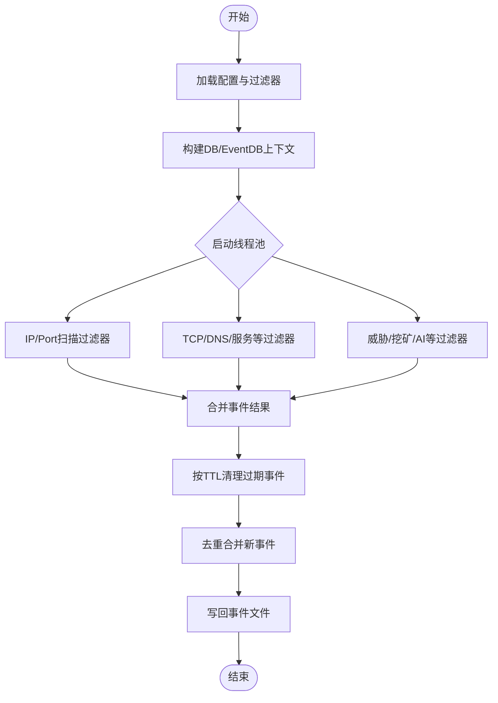
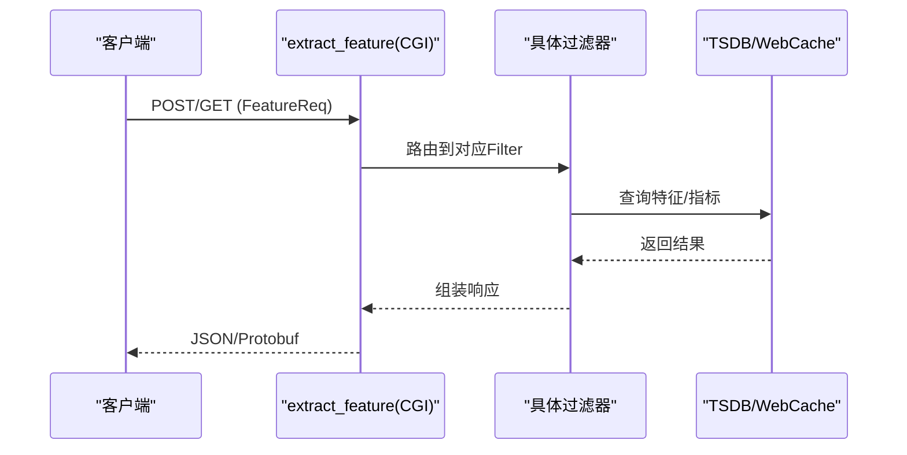
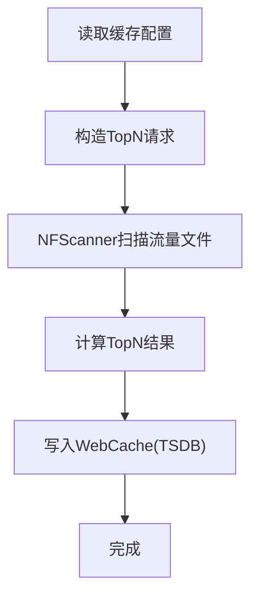
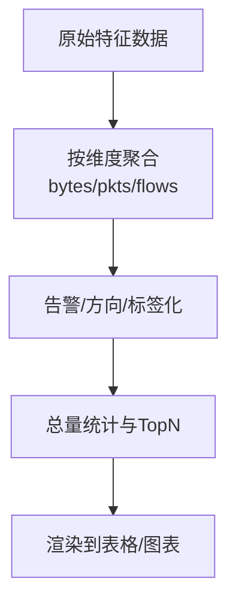
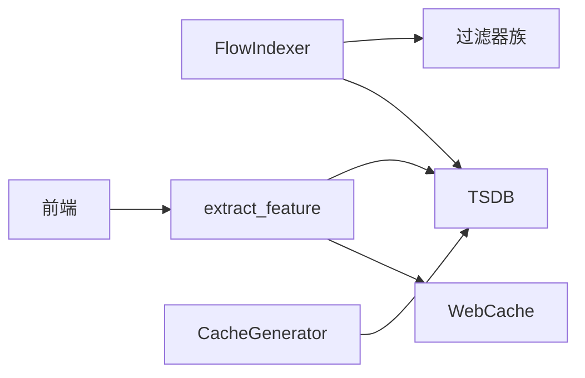

# 数据处理流程

<cite>
**本文引用的文件**
- [tsdb.h](file://ly_analyser/src/agent/data/tsdb.h)
- [tsdb.cpp](file://ly_analyser/src/agent/data/tsdb.cpp)
- [web_cache.h](file://ly_analyser/src/agent/data/web_cache.h)
- [flow_indexer.h](file://ly_analyser/src/agent/indexing/flow_indexer.h)
- [flow_indexer.cpp](file://ly_analyser/src/agent/indexing/flow_indexer.cpp)
- [extract_feature.cpp](file://ly_analyser/src/agent/handlers/extract_feature.cpp)
- [nf_scanner.h](file://ly_analyser/src/agent/flow/nf_scanner.h)
- [cache_generator.h](file://ly_analyser/src/agent/indexing/cache_generator.h)
- [data-processor.js](file://ly_vis/packages/std/src/page/result/data-processor.js)
- [store.js](file://ly_vis/packages/std/src/page/track/store.js)
</cite>

## 目录
1. [简介](#简介)
2. [项目结构](#项目结构)
3. [核心组件](#核心组件)
4. [架构总览](#架构总览)
5. [详细组件分析](#详细组件分析)
6. [依赖关系分析](#依赖关系分析)
7. [性能考量](#性能考量)
8. [故障排查指南](#故障排查指南)
9. [结论](#结论)
10. [附录](#附录)

## 简介
本技术文档围绕 SOC 项目的数据处理流水线，系统性阐述从 NetFlow 数据采集、解析、特征提取到存储与查询的完整流程。重点覆盖：
- NetFlow 数据的接收与处理机制（基于 nfdump 生态）
- 时序数据库设计与缓存策略（TSDB + WebCache）
- 索引构建过程（多过滤器并行扫描与事件聚合）
- 数据查询优化与批量处理能力
- 数据质量保证、错误处理与性能监控方案
- 实时处理与离线处理的差异及适用场景
- 数据流架构图与关键算法实现细节

## 项目结构
本项目由多个子系统构成：
- ly_analyser：采集与分析核心，包含 NetFlow 扫描、特征过滤、索引构建、TSDB 存储与缓存、HTTP/CGI 特征查询接口等
- ly_server：服务端逻辑（配置下发、事件与特征服务、安全策略等）
- ly_vis：前端可视化与交互（结果页、追踪页、数据预处理与展示）

下图给出与本流程相关的关键模块与文件映射关系。

图表来源
- [nf_scanner.h:16-28](file://ly_analyser/src/agent/flow/nf_scanner.h#L16-L28)
- [flow_indexer.h:32-63](file://ly_analyser/src/agent/indexing/flow_indexer.h#L32-L63)
- [flow_indexer.cpp:145-301](file://ly_analyser/src/agent/indexing/flow_indexer.cpp#L145-L301)
- [tsdb.h:11-76](file://ly_analyser/src/agent/data/tsdb.h#L11-L76)
- [web_cache.h:15-53](file://ly_analyser/src/agent/data/web_cache.h#L15-L53)
- [extract_feature.cpp:295-481](file://ly_analyser/src/agent/handlers/extract_feature.cpp#L295-L481)
- [cache_generator.h:21-38](file://ly_analyser/src/agent/indexing/cache_generator.h#L21-L38)
- [data-processor.js:1-76](file://ly_vis/packages/std/src/page/result/data-processor.js#L1-L76)
- [store.js:199-230](file://ly_vis/packages/std/src/page/track/store.js#L199-L230)

章节来源
- [nf_scanner.h:16-28](file://ly_analyser/src/agent/flow/nf_scanner.h#L16-L28)
- [flow_indexer.h:32-63](file://ly_analyser/src/agent/indexing/flow_indexer.h#L32-L63)
- [flow_indexer.cpp:145-301](file://ly_analyser/src/agent/indexing/flow_indexer.cpp#L145-L301)
- [tsdb.h:11-76](file://ly_analyser/src/agent/data/tsdb.h#L11-L76)
- [web_cache.h:15-53](file://ly_analyser/src/agent/data/web_cache.h#L15-L53)
- [extract_feature.cpp:295-481](file://ly_analyser/src/agent/handlers/extract_feature.cpp#L295-L481)
- [cache_generator.h:21-38](file://ly_analyser/src/agent/indexing/cache_generator.h#L21-L38)
- [data-processor.js:1-76](file://ly_vis/packages/std/src/page/result/data-processor.js#L1-L76)
- [store.js:199-230](file://ly_vis/packages/std/src/page/track/store.js#L199-L230)

## 核心组件
- NFScanner：负责扫描 nfdump 格式的流量文件，支持 TopN 查询与缓存封装
- FlowIndexer：加载并初始化多种过滤器（IP/端口扫描、TCP 握手、DNS、威胁情报等），并行执行扫描与事件生成，最终写入事件文件
- TSDB：按时间单位分片的 KV 存储，提供 Put/Get/Scan/Size 等操作，内置每时间片上下文缓存
- WebCache：面向查询的键值缓存层，底层使用 TSDB 持久化，支持带时间戳的读写
- extract_feature：CGI/Protobuf 入口，根据请求类型路由到对应过滤器进行特征查询与聚合输出
- CacheGenerator：预计算 TopN 缓存条目，降低在线查询延迟
- 前端 data-processor/store：对后端返回的特征数据进行聚合、排序、告警标记与展示

章节来源
- [nf_scanner.h:16-28](file://ly_analyser/src/agent/flow/nf_scanner.h#L16-L28)
- [flow_indexer.cpp:145-301](file://ly_analyser/src/agent/indexing/flow_indexer.cpp#L145-L301)
- [tsdb.h:11-76](file://ly_analyser/src/agent/data/tsdb.h#L11-L76)
- [web_cache.h:15-53](file://ly_analyser/src/agent/data/web_cache.h#L15-L53)
- [extract_feature.cpp:295-481](file://ly_analyser/src/agent/handlers/extract_feature.cpp#L295-L481)
- [cache_generator.h:21-38](file://ly_analyser/src/agent/indexing/cache_generator.h#L21-L38)
- [data-processor.js:1-76](file://ly_vis/packages/std/src/page/result/data-processor.js#L1-L76)
- [store.js:199-230](file://ly_vis/packages/std/src/page/track/store.js#L199-L230)

## 架构总览
下图展示了从 NetFlow 文件扫描到特征查询的前后端整体数据流，包括索引构建、TSDB 存储、缓存与前端处理。

图表来源
- [nf_scanner.h:16-28](file://ly_analyser/src/agent/flow/nf_scanner.h#L16-L28)
- [flow_indexer.cpp:145-301](file://ly_analyser/src/agent/indexing/flow_indexer.cpp#L145-L301)
- [tsdb.h:11-76](file://ly_analyser/src/agent/data/tsdb.h#L11-L76)
- [web_cache.h:15-53](file://ly_analyser/src/agent/data/web_cache.h#L15-L53)
- [extract_feature.cpp:295-481](file://ly_analyser/src/agent/handlers/extract_feature.cpp#L295-L481)
- [data-processor.js:1-76](file://ly_vis/packages/std/src/page/result/data-processor.js#L1-L76)
- [store.js:199-230](file://ly_vis/packages/std/src/page/track/store.js#L199-L230)

## 详细组件分析

### 时序数据库 TSDB 设计与缓存策略
- 设计要点
  - 按时间单位分片：通过 time_unit 对齐起止时间，避免跨片漏读
  - 每个时间片维护一个 DBCtx 上下文，支持自动提交
  - 提供 Contain/Get/Put/Scan/Size 等基础操作，支持键值与字符串过滤
- 缓存策略
  - 每时间片上下文内维护内存缓存（unordered_map），可开启全库缓存或按需缓存
  - Get 时优先命中内存缓存，未命中再回源底层存储并回填缓存
  - Put 时同步更新内存缓存，保证一致性
- 复杂度与性能
  - 单片内查找 O(1)，扫描按片迭代，时间复杂度 O(N+M)（N为片数，M为匹配记录）
  - 全库缓存适合小数据集或热点查询；大集合适按需缓存

图表来源
- [tsdb.h:11-76](file://ly_analyser/src/agent/data/tsdb.h#L11-L76)
- [tsdb.cpp:11-176](file://ly_analyser/src/agent/data/tsdb.cpp#L11-L176)

章节来源
- [tsdb.h:11-76](file://ly_analyser/src/agent/data/tsdb.h#L11-L76)
- [tsdb.cpp:11-176](file://ly_analyser/src/agent/data/tsdb.cpp#L11-L176)

### WebCache 键值缓存层
- 职责
  - 对外暴露统一 Get/Update 接口，支持普通键与带时间戳的键
  - 内部将请求委托给 TSDBCache（以“web_cache”命名空间）进行持久化
- 优势
  - 屏蔽底层 TSDB 的时间分片细节
  - 便于扩展更多缓存策略（如多级缓存、过期策略）

图表来源
- [web_cache.h:15-53](file://ly_analyser/src/agent/data/web_cache.h#L15-L53)

章节来源
- [web_cache.h:15-53](file://ly_analyser/src/agent/data/web_cache.h#L15-L53)

### 索引构建与过滤器并行处理
- 初始化
  - 根据设备ID与模型加载资产IP集合
  - 从配置文件动态启用各类过滤器（IP/端口扫描、TCP、DNS、威胁、挖矿等）
  - 为启用的过滤器创建实例，并注入 DBBuilder/EventDBBuilder
- 并行执行
  - 析构阶段使用线程池并发调用各过滤器的 UpdateFinished/CheckThreshold
  - 汇总所有过滤器产生的事件，去重、合并后写入事件文件
- 事件生命周期
  - 事件文件支持 TTL（默认24小时），清理过期事件
  - 新增事件去重合并，避免重复

图表来源
- [flow_indexer.cpp:145-301](file://ly_analyser/src/agent/indexing/flow_indexer.cpp#L145-L301)
- [flow_indexer.cpp:303-369](file://ly_analyser/src/agent/indexing/flow_indexer.cpp#L303-L369)

章节来源
- [flow_indexer.h:32-63](file://ly_analyser/src/agent/indexing/flow_indexer.h#L32-L63)
- [flow_indexer.cpp:145-301](file://ly_analyser/src/agent/indexing/flow_indexer.cpp#L145-L301)
- [flow_indexer.cpp:303-369](file://ly_analyser/src/agent/indexing/flow_indexer.cpp#L303-L369)

### 特征查询接口 extract_feature
- 协议与入口
  - 支持 CGI 与 Protobuf 两种输入方式
  - 根据 FeatureReq.type 路由至具体过滤器（POP/SUS/IP_SCAN/PORT_SCAN/SERVICE/ASSET_SRV/TCPINIT/BW/MO/DNS/DNSTUN/DGA 等）
- 输出
  - 非 HTTP 模式输出 JSON 数组；HTTP 模式输出 Protobuf 序列化结果
- 错误处理
  - 参数解析失败返回 400
  - 异常捕获并记录日志

图表来源
- [extract_feature.cpp:295-481](file://ly_analyser/src/agent/handlers/extract_feature.cpp#L295-L481)

章节来源
- [extract_feature.cpp:295-481](file://ly_analyser/src/agent/handlers/extract_feature.cpp#L295-L481)

### 流量扫描与缓存生成
- NFScanner
  - 扫描指定目录下的流量文件，支持 TopN 查询与缓存封装
- CacheGenerator
  - 读取缓存配置，生成 TopN 缓存条目，降低在线查询延迟
  - 结合线程池与 TSDB 进行批量写入

图表来源
- [nf_scanner.h:16-28](file://ly_analyser/src/agent/flow/nf_scanner.h#L16-L28)
- [cache_generator.h:21-38](file://ly_analyser/src/agent/indexing/cache_generator.h#L21-L38)

章节来源
- [nf_scanner.h:16-28](file://ly_analyser/src/agent/flow/nf_scanner.h#L16-L28)
- [cache_generator.h:21-38](file://ly_analyser/src/agent/indexing/cache_generator.h#L21-L38)

### 前端数据处理与展示
- data-processor.js
  - 对原始特征数据进行聚合、时长/带宽/告警标记、方向判断、Qtype/带宽分类标签化
  - 计算总量统计（bytes/pkts/flows）与 TopN 方向
- store.js
  - 将 MO 数据与事件、特征信息关联，计算平均速率等衍生字段，用于列表排序与展示

图表来源
- [data-processor.js:1-76](file://ly_vis/packages/std/src/page/result/data-processor.js#L1-L76)
- [store.js:199-230](file://ly_vis/packages/std/src/page/track/store.js#L199-L230)

章节来源
- [data-processor.js:1-76](file://ly_vis/packages/std/src/page/result/data-processor.js#L1-L76)
- [store.js:199-230](file://ly_vis/packages/std/src/page/track/store.js#L199-L230)

## 依赖关系分析
- 组件耦合
  - FlowIndexer 强依赖多种过滤器与 DBBuilder/EventDBBuilder
  - TSDB 作为通用存储抽象，被 WebCache、extract_feature、CacheGenerator 复用
  - 前端依赖后端 extract_feature 提供的稳定接口
- 外部依赖
  - nfdump 生态用于流量文件解析
  - Protobuf 用于结构化数据传输
  - 线程池用于并行处理

图表来源
- [flow_indexer.cpp:145-301](file://ly_analyser/src/agent/indexing/flow_indexer.cpp#L145-L301)
- [extract_feature.cpp:295-481](file://ly_analyser/src/agent/handlers/extract_feature.cpp#L295-L481)
- [web_cache.h:15-53](file://ly_analyser/src/agent/data/web_cache.h#L15-L53)
- [cache_generator.h:21-38](file://ly_analyser/src/agent/indexing/cache_generator.h#L21-L38)

章节来源
- [flow_indexer.cpp:145-301](file://ly_analyser/src/agent/indexing/flow_indexer.cpp#L145-L301)
- [extract_feature.cpp:295-481](file://ly_analyser/src/agent/handlers/extract_feature.cpp#L295-L481)
- [web_cache.h:15-53](file://ly_analyser/src/agent/data/web_cache.h#L15-L53)
- [cache_generator.h:21-38](file://ly_analyser/src/agent/indexing/cache_generator.h#L21-L38)

## 性能考量
- 索引构建
  - 多线程并行执行各过滤器，充分利用CPU核数
  - 事件文件写入前进行去重与过期清理，减少冗余
- 存储与查询
  - TSDB 按时间分片，缩小扫描范围；内存缓存加速热点访问
  - WebCache 屏蔽时间分片细节，简化上层调用
- 前端处理
  - 在浏览器端进行轻量聚合与排序，减轻服务器压力
  - 合理分页与增量更新，提升交互体验

[本节为通用指导，不直接分析具体文件]

## 故障排查指南
- 参数解析失败
  - extract_feature 在 CGI 模式下若参数解析失败，返回 400 并终止处理
- 异常捕获
  - main 函数包裹 try/catch，记录异常信息
- 事件文件读写
  - 无法读取现有事件文件时记录警告；TTL 清理与去重合并失败需检查磁盘与权限
- 过滤器初始化失败
  - 各过滤器 Create 失败时记录错误日志，跳过该过滤器继续执行

章节来源
- [extract_feature.cpp:484-513](file://ly_analyser/src/agent/handlers/extract_feature.cpp#L484-L513)
- [flow_indexer.cpp:353-369](file://ly_analyser/src/agent/indexing/flow_indexer.cpp#L353-L369)

## 结论
本系统通过 nfdump 生态完成 NetFlow 数据采集与解析，借助 FlowIndexer 的多过滤器并行机制高效构建索引与事件，利用 TSDB 的时序分片与缓存策略保障高吞吐与低延迟查询，并通过 WebCache 进一步简化上层调用。前端对数据进行二次聚合与可视化，形成端到端的闭环。针对大规模数据场景，建议：
- 合理设置 time_unit 与缓存策略，平衡内存与命中率
- 控制过滤器数量与复杂度，避免过度计算
- 在前端采用分页与增量更新，提升用户体验
- 建立完善的监控与告警，关注线程池利用率、缓存命中率与查询延迟

[本节为总结性内容，不直接分析具体文件]

## 附录
- 实时处理 vs 离线处理
  - 实时处理：适用于在线特征查询（extract_feature）、热数据快速检索，强调低延迟与高可用
  - 离线处理：适用于批量索引构建（FlowIndexer 析构阶段的并行任务）、历史数据分析与缓存预热（CacheGenerator），强调吞吐与资源利用率
- 数据质量保证
  - 输入校验（CGI/URL参数解析）
  - 输出清洗（特殊字符过滤、转义）
  - 事件去重与TTL清理，确保一致性与时效性
- 性能监控建议
  - 线程池大小与队列长度
  - TSDB 缓存命中率与扫描耗时
  - 前端聚合与排序耗时

[本节为补充说明，不直接分析具体文件]