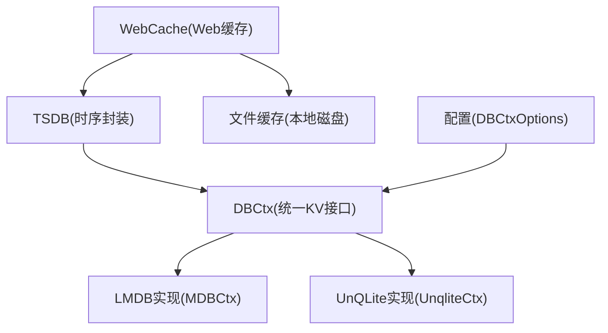
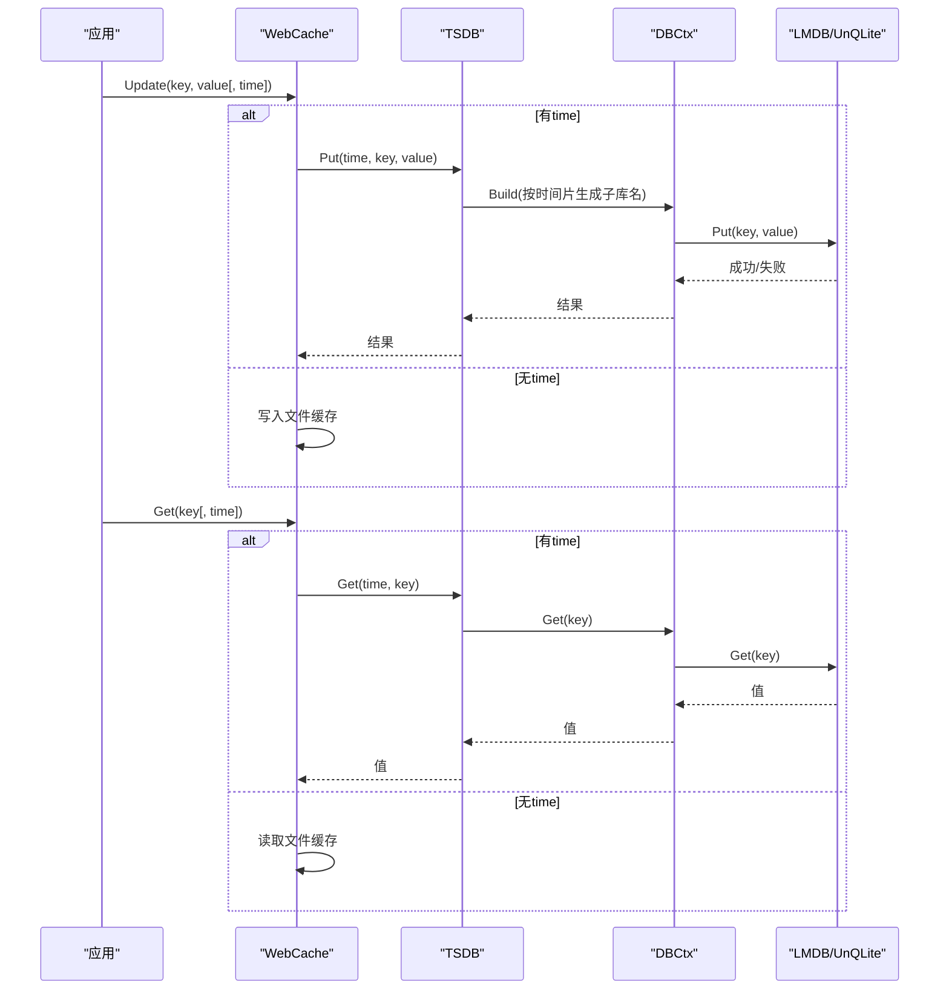
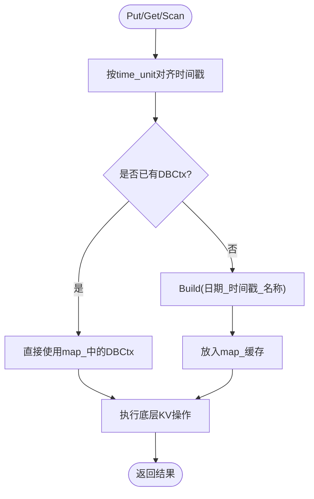
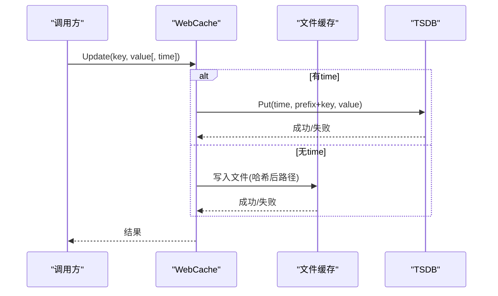
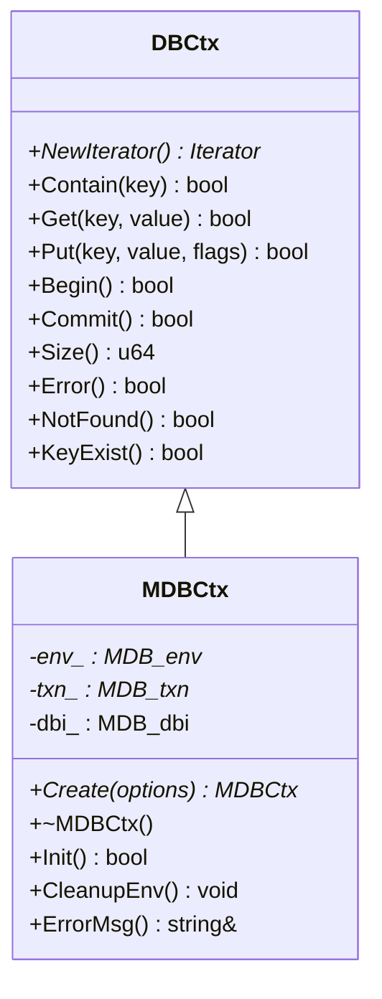
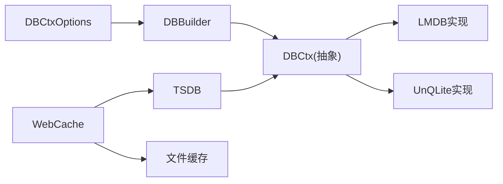

# 数据存储与管理

<cite>
**本文引用的文件**
- [tsdb.h](file://ly_analyser/src/agent/data/tsdb.h)
- [tsdb.cpp](file://ly_analyser/src/agent/data/tsdb.cpp)
- [web_cache.h](file://ly_analyser/src/agent/data/web_cache.h)
- [web_cache.cpp](file://ly_analyser/src/agent/data/web_cache.cpp)
- [dbctx.h](file://ly_analyser/src/agent/data/dbctx.h)
- [mdb.h](file://ly_analyser/src/agent/data/mdb.h)
- [mdb.cpp](file://ly_analyser/src/agent/data/mdb.cpp)
- [unqlite_db.h](file://ly_analyser/src/agent/data/unqlite_db.h)
- [unqlite_db.cpp](file://ly_analyser/src/agent/data/unqlite_db.cpp)
- [dbctx.proto](file://ly_analyser/src/agent/data/dbctx.proto)
</cite>

## 目录
1. [简介](#简介)
2. [项目结构](#项目结构)
3. [核心组件](#核心组件)
4. [架构总览](#架构总览)
5. [详细组件分析](#详细组件分析)
6. [依赖关系分析](#依赖关系分析)
7. [性能与容量规划](#性能与容量规划)
8. [故障排查指南](#故障排查指南)
9. [结论](#结论)
10. [附录](#附录)

## 简介
本模块提供面向时序数据的存储与管理能力，包含：
- 时序数据库（TSDB）抽象层：按时间片分桶、统一读写接口、扫描聚合。
- Web 缓存：支持基于文件的轻量缓存与基于 TSDB 的带时间维度的缓存，支持 Protobuf 序列化存取。
- 存储后端：通过统一 DBCtx 接口适配多种 KV 引擎（当前实现 LMDB 与 UnQLite），并支持配置化选择。
- 配置项：时间对齐单位、回退窗口、引擎类型、LMDB 映射大小等，用于控制存储行为与性能。

该设计将“业务语义”（如按时间分片、Web 缓存键前缀）与“底层存储”解耦，便于替换或扩展存储引擎。

## 项目结构
数据相关代码集中在 ly_analyser/src/agent/data 目录下，关键文件如下：
- tsdb.*：时序数据库封装，按时间片组织子库，提供 Put/Get/Scan/Size 等接口。
- web_cache.*：Web 缓存层，支持文件缓存与 TSDB 缓存两种路径。
- dbctx.*：存储上下文抽象与构建器，定义统一 KV 接口与迭代器。
- mdb.*：LMDB 引擎实现。
- unqlite_db.*：UnQLite 引擎实现。
- dbctx.proto：存储选项配置（时间单位、回退限制、引擎类型、LMDB 参数等）。

图表来源
- [tsdb.h:11-76](file://ly_analyser/src/agent/data/tsdb.h#L11-L76)
- [dbctx.h:9-85](file://ly_analyser/src/agent/data/dbctx.h#L9-L85)
- [mdb.h:8-34](file://ly_analyser/src/agent/data/mdb.h#L8-L34)
- [unqlite_db.h:11-36](file://ly_analyser/src/agent/data/unqlite_db.h#L11-L36)
- [dbctx.proto:2-28](file://ly_analyser/src/agent/data/dbctx.proto#L2-L28)

章节来源
- [tsdb.h:11-76](file://ly_analyser/src/agent/data/tsdb.h#L11-L76)
- [web_cache.h:15-53](file://ly_analyser/src/agent/data/web_cache.h#L15-L53)
- [dbctx.h:9-85](file://ly_analyser/src/agent/data/dbctx.h#L9-L85)
- [mdb.h:8-34](file://ly_analyser/src/agent/data/mdb.h#L8-L34)
- [unqlite_db.h:11-36](file://ly_analyser/src/agent/data/unqlite_db.h#L11-L36)
- [dbctx.proto:2-28](file://ly_analyser/src/agent/data/dbctx.proto#L2-L28)

## 核心组件
- TSDB：以时间片为单位管理多个子库，对外暴露统一的 Put/Get/Contain/Scan/Size 接口；内部维护每个时间片的 DBCtx 上下文，并提供可选的全量缓存策略。
- WebCache：提供字符串与 Protobuf 消息的 Get/Update 接口；无时间维度时走文件缓存，有时间维度时走 TSDB 缓存。
- DBCtx 抽象：定义统一的 KV 操作、事务 Begin/Commit、迭代器、错误状态等；DBBuilder 负责根据配置创建具体实现。
- LMDB/UnQLite 实现：分别封装对应引擎的打开、事务、游标、Put/Get、统计等能力。

章节来源
- [tsdb.cpp:11-176](file://ly_analyser/src/agent/data/tsdb.cpp#L11-L176)
- [web_cache.cpp:17-161](file://ly_analyser/src/agent/data/web_cache.cpp#L17-L161)
- [dbctx.h:9-85](file://ly_analyser/src/agent/data/dbctx.h#L9-L85)
- [mdb.cpp:94-305](file://ly_analyser/src/agent/data/mdb.cpp#L94-L305)
- [unqlite_db.cpp:123-187](file://ly_analyser/src/agent/data/unqlite_db.cpp#L123-L187)

## 架构总览
下图展示从上层调用到具体存储引擎的数据流与控制流。

图表来源
- [web_cache.cpp:82-102](file://ly_analyser/src/agent/data/web_cache.cpp#L82-L102)
- [tsdb.cpp:61-119](file://ly_analyser/src/agent/data/tsdb.cpp#L61-L119)
- [mdb.cpp:171-240](file://ly_analyser/src/agent/data/mdb.cpp#L171-L240)
- [unqlite_db.cpp:158-172](file://ly_analyser/src/agent/data/unqlite_db.cpp#L158-L172)

## 详细组件分析

### TSDB 时序数据库
- 时间分片：通过 time_unit 对时间戳取整，作为子库键；每次访问先计算所属时间片，再获取或创建对应的 DBCtx。
- 子库命名：使用日期与时间戳拼接名称，确保不同时间片隔离。
- 扫描与聚合：按时间步长遍历各时间片，构造迭代器并执行回调；支持键值过滤与字符串过滤。
- 内存缓存：CachedDBCtx 支持可选的全量缓存或按需缓存，减少重复 IO。
- 自动提交：析构时若启用 auto_commit，则自动 Commit。

图表来源
- [tsdb.cpp:61-73](file://ly_analyser/src/agent/data/tsdb.cpp#L61-L73)
- [tsdb.cpp:122-175](file://ly_analyser/src/agent/data/tsdb.cpp#L122-L175)

章节来源
- [tsdb.h:11-76](file://ly_analyser/src/agent/data/tsdb.h#L11-L76)
- [tsdb.cpp:11-176](file://ly_analyser/src/agent/data/tsdb.cpp#L11-L176)

### WebCache 缓存层
- 双路径：无时间维度时写入本地文件缓存；有时间维度时通过 TSDB 持久化。
- 键处理：对输入 key 进行 SHA256 哈希，并按两级目录组织文件，避免单目录文件过多。
- 大小限制：单个条目超过阈值时拒绝写入，防止大对象影响性能。
- Protobuf 支持：提供 Message 类型的 Get/Update 重载，内部使用文本格式序列化。

图表来源
- [web_cache.cpp:25-53](file://ly_analyser/src/agent/data/web_cache.cpp#L25-L53)
- [web_cache.cpp:82-102](file://ly_analyser/src/agent/data/web_cache.cpp#L82-L102)
- [web_cache.cpp:129-161](file://ly_analyser/src/agent/data/web_cache.cpp#L129-L161)

章节来源
- [web_cache.h:15-53](file://ly_analyser/src/agent/data/web_cache.h#L15-L53)
- [web_cache.cpp:17-161](file://ly_analyser/src/agent/data/web_cache.cpp#L17-L161)

### DBCtx 抽象与 DBBuilder
- 统一接口：Get/Put/Contain/Begin/Commit/Size/NewIterator 等，屏蔽底层差异。
- 迭代器：First/NextKey/Seek/Replace/Key/Value/DupValueCount 等，支持键值对遍历与定位。
- 构建器：根据 DBCtxOptions 与 base_path 构建具体 DBCtx 实例（LMDB/UnQLite）。

章节来源
- [dbctx.h:9-85](file://ly_analyser/src/agent/data/dbctx.h#L9-L85)

### LMDB 实现（MDBCtx）
- 环境初始化：设置最大映射大小、最大 DB 数量、只读标志等。
- 事务与 DBI：Begin 时开启事务并打开 DBI，支持 DUPSORT/DUPFIXED 等选项。
- 迭代器：基于 MDB_cursor 实现 First/NextKey/Seek/Replace。
- 错误处理：集中记录错误码与消息，区分 NotFound/KeyExist 等状态。

图表来源
- [dbctx.h:9-85](file://ly_analyser/src/agent/data/dbctx.h#L9-L85)
- [mdb.h:8-34](file://ly_analyser/src/agent/data/mdb.h#L8-L34)
- [mdb.cpp:94-305](file://ly_analyser/src/agent/data/mdb.cpp#L94-L305)

章节来源
- [mdb.h:8-34](file://ly_analyser/src/agent/data/mdb.h#L8-L34)
- [mdb.cpp:94-305](file://ly_analyser/src/agent/data/mdb.cpp#L94-L305)

### UnQLite 实现（UnqliteCtx）
- 打开/关闭：根据 read_only 选择只读或创建模式。
- 迭代器：基于 unqlite_kv_cursor 实现 First/NextKey/Seek。
- 事务：Commit 仅在不为只读时生效。
- 错误与状态：封装 UNQLITE_* 错误码，提供 NotFound/Error 判断。

章节来源
- [unqlite_db.h:11-36](file://ly_analyser/src/agent/data/unqlite_db.h#L11-L36)
- [unqlite_db.cpp:123-187](file://ly_analyser/src/agent/data/unqlite_db.cpp#L123-L187)

## 依赖关系分析
- TSDB 依赖 DBCtx 抽象与 DBBuilder，按时间片动态创建子库。
- WebCache 依赖 TSDB 与文件系统，提供两种缓存路径。
- LMDB/UnQLite 均实现 DBCtx 接口，被 TSDB/WebCache 透明使用。
- 配置项 DBCtxOptions 决定引擎类型、时间对齐、回退限制、LMDB 映射大小等。

图表来源
- [dbctx.proto:2-28](file://ly_analyser/src/agent/data/dbctx.proto#L2-L28)
- [dbctx.h:76-85](file://ly_analyser/src/agent/data/dbctx.h#L76-L85)
- [tsdb.h:11-76](file://ly_analyser/src/agent/data/tsdb.h#L11-L76)
- [web_cache.h:15-53](file://ly_analyser/src/agent/data/web_cache.h#L15-L53)

章节来源
- [dbctx.proto:2-28](file://ly_analyser/src/agent/data/dbctx.proto#L2-L28)
- [dbctx.h:76-85](file://ly_analyser/src/agent/data/dbctx.h#L76-L85)

## 性能与容量规划
- 时间对齐与回退窗口
  - time_unit：建议根据查询粒度与写入吞吐调整，较大单位可减少子库数量，但会降低时间精度。
  - backtrack：限制可回溯的时间片数量，控制历史数据保留范围，避免无限增长。
- LMDB 映射大小
  - mdb_max_map_size：根据预期数据规模与可用内存设置，过大可能浪费内存，过小会导致扩容开销。
- 迭代与扫描
  - Scan 按时间步长遍历，建议在应用层配合过滤函数减少回调处理成本。
- 缓存策略
  - TSDB 内 CachedDBCtx 可按需启用全量缓存或逐条缓存，适合热点键场景。
  - WebCache 文件缓存适合小对象、低并发场景；高并发或跨进程共享建议使用 TSDB 路径。
- 条目大小限制
  - WebCache 对单条缓存大小有限制，避免大对象拖慢 I/O。
- 索引与加速
  - 当前为 KV 模型，未内置复杂索引；可通过键设计（如包含时间、实体 ID、字段名）提升点查与范围扫描效率。
- 压缩与备份恢复
  - 未实现内置压缩；可结合外部工具对 LMDB/UnQLite 文件进行快照备份与恢复。
- 扩展性
  - 通过 DBCtx 抽象可平滑替换或新增存储引擎；TSDB 按时间片分库天然支持水平扩展（多节点按时间片路由）。

[本节为通用指导，不直接分析具体文件]

## 故障排查指南
- LMDB 错误
  - 常见错误码：NOTFOUND、KEYEXIST、ERROR；通过 Error()/NotFound()/KeyExist() 判断。
  - 日志：在调试模式下会输出关键操作与错误信息，便于定位问题。
- UnQLite 错误
  - 通过 Error()/NotFound() 判断；只读模式下 Commit 会返回特定状态。
- 超时与阻塞
  - 检查 time_unit 与 backtrack 配置是否合理，避免扫描范围过大。
- 文件权限
  - WebCache 文件缓存需要写权限；目录创建失败会导致写入失败。
- 内存与映射
  - LMDB 映射不足时会报错；适当增大 mdb_max_map_size。

章节来源
- [mdb.cpp:10-18](file://ly_analyser/src/agent/data/mdb.cpp#L10-L18)
- [mdb.cpp:171-240](file://ly_analyser/src/agent/data/mdb.cpp#L171-L240)
- [unqlite_db.cpp:174-187](file://ly_analyser/src/agent/data/unqlite_db.cpp#L174-L187)
- [web_cache.cpp:25-53](file://ly_analyser/src/agent/data/web_cache.cpp#L25-L53)

## 结论
本模块通过 TSDB 抽象与 DBCtx 统一接口，实现了时序数据的分片存储与高效访问，并结合 WebCache 提供灵活的缓存策略。LMDB 与 UnQLite 两种后端满足不同场景需求。通过合理的配置（时间对齐、回退窗口、LMDB 映射大小）与键设计，可在保证一致性的同时获得良好的读写性能与可扩展性。

[本节为总结，不直接分析具体文件]

## 附录
- 配置项说明（节选）
  - engine：存储引擎类型（LMDB/UNQLITEDB 等）。
  - time_unit：时间对齐单位（秒），默认 3600。
  - backtrack：可回溯时间片数量上限，默认 720。
  - read_only：是否只读。
  - dup_sort/dup_fixed：是否启用重复值排序与固定长度。
  - integer_key：是否使用整数键。
  - auto_commit：关闭时是否自动提交。
  - mdb_max_map_size：LMDB 映射大小。
  - mdb_max_db：每个 DB 的文件数限制。

章节来源
- [dbctx.proto:2-28](file://ly_analyser/src/agent/data/dbctx.proto#L2-L28)