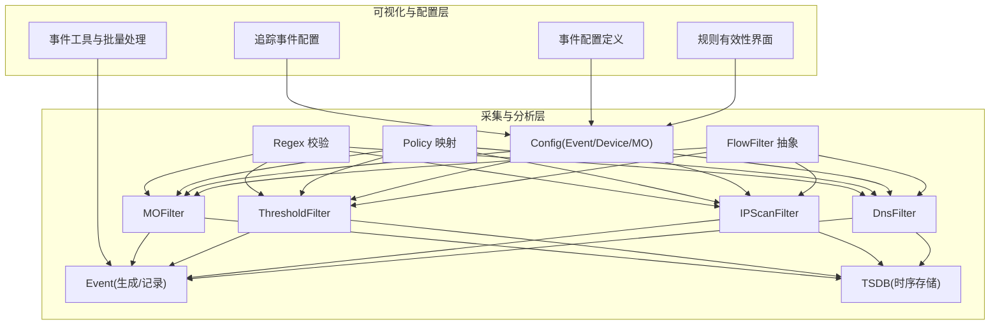
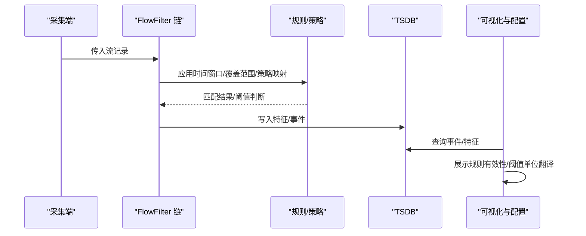
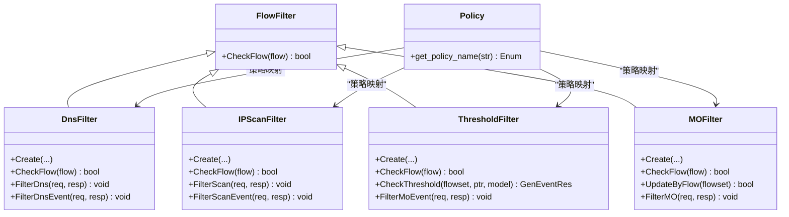
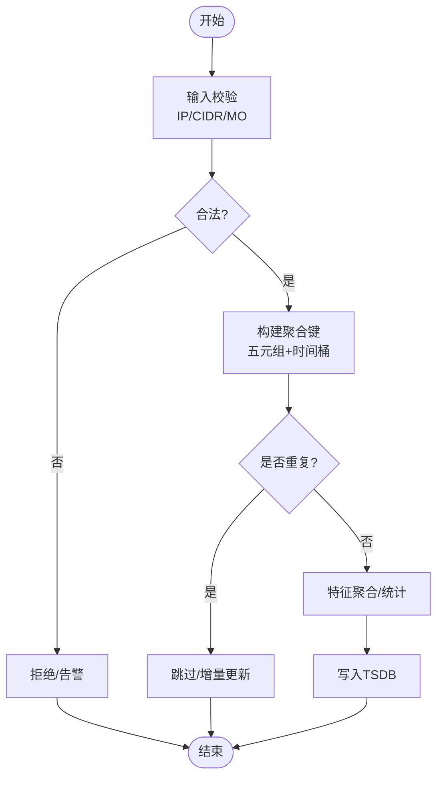
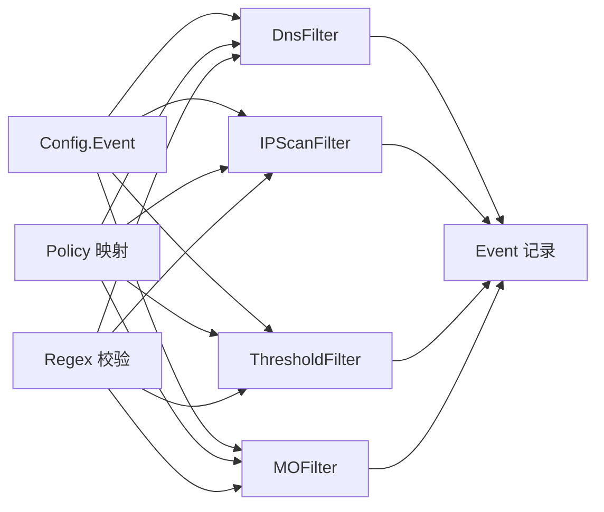

# 数据质量保证

<cite>
**本文引用的文件**
- [flow_filter.h](file://ly_analyser/src/agent/flow/flow_filter.h)
- [common_model_filter.hpp](file://ly_analyser/src/agent/flow/common_model_filter.hpp)
- [multi_filter.h](file://ly_analyser/src/agent/flow/multi_filter.h)
- [policy.hpp](file://ly_analyser/src/common/policy.hpp)
- [dns_filter.h](file://ly_analyser/src/agent/flow/dns_filter.h)
- [ip_scan_filter.h](file://ly_analyser/src/agent/flow/ip_scan_filter.h)
- [threshold_filter.h](file://ly_analyser/src/agent/flow/threshold_filter.h)
- [mo_filter.h](file://ly_analyser/src/agent/flow/mo_filter.h)
- [config.proto](file://ly_analyser/src/common/config.proto)
- [event.proto](file://ly_analyser/src/common/event.proto)
- [regex_validation.hpp](file://ly_analyser/src/common/regex_validation.hpp)
- [index.jsx（规则有效性）](file://ly_vis/packages/std/src/page/overview/page-child/overview-ma/components/config-rule/index.jsx)
- [methods-event.js](file://ly_vis/packages/std/src/utils/methods-event.js)
- [event-config.js](file://ly_vis/packages/components/system/event-system/config/public/event-config.js)
- [track/index.js](file://ly_vis/packages/components/system/event-system/config/event/track/index.js)
</cite>

## 目录
1. [简介](#简介)
2. [项目结构](#项目结构)
3. [核心组件](#核心组件)
4. [架构总览](#架构总览)
5. [详细组件分析](#详细组件分析)
6. [依赖关系分析](#依赖关系分析)
7. [性能考量](#性能考量)
8. [故障排查指南](#故障排查指南)
9. [结论](#结论)
10. [附录](#附录)

## 简介
本技术文档聚焦于数据质量保证模块，围绕数据验证规则、完整性检查与质量评估指标展开，系统阐述过滤器设计模式、规则引擎实现与异常数据处理机制；并说明数据清洗算法、去重策略与格式标准化实现细节。同时给出数据血缘追踪、版本控制与审计日志记录方案，以及数据质量监控、告警配置与修复流程的管理方法。

## 项目结构
数据质量保证能力由“采集与分析层（C++）”和“可视化与配置层（前端JSX/JS）”共同构成：
- 采集与分析层：基于统一的 FlowFilter 抽象，提供多种专用过滤器（DNS、IP扫描、阈值、MO等），通过 TSDB 存储特征与事件，结合策略与配置进行规则匹配与事件生成。
- 可视化与配置层：提供事件规则配置、阈值单位翻译、追踪事件配置、规则有效性展示与批量处理等能力。

图表来源
- [flow_filter.h:8-29](file://ly_analyser/src/agent/flow/flow_filter.h#L8-L29)
- [dns_filter.h:35-122](file://ly_analyser/src/agent/flow/dns_filter.h#L35-L122)
- [ip_scan_filter.h:32-141](file://ly_analyser/src/agent/flow/ip_scan_filter.h#L32-L141)
- [threshold_filter.h:20-108](file://ly_analyser/src/agent/flow/threshold_filter.h#L20-L108)
- [mo_filter.h:27-77](file://ly_analyser/src/agent/flow/mo_filter.h#L27-L77)
- [config.proto:47-129](file://ly_analyser/src/common/config.proto#L47-L129)
- [event.proto:10-24](file://ly_analyser/src/common/event.proto#L10-L24)
- [regex_validation.hpp:21-64](file://ly_analyser/src/common/regex_validation.hpp#L21-L64)
- [index.jsx（规则有效性）:120-182](file://ly_vis/packages/std/src/page/overview/page-child/overview-ma/components/config-rule/index.jsx#L120-L182)
- [event-config.js:69-107](file://ly_vis/packages/components/system/event-system/config/public/event-config.js#L69-L107)
- [track/index.js:1-30](file://ly_vis/packages/components/system/event-system/config/event/track/index.js#L1-L30)

章节来源
- [flow_filter.h:8-29](file://ly_analyser/src/agent/flow/flow_filter.h#L8-L29)
- [config.proto:47-129](file://ly_analyser/src/common/config.proto#L47-L129)
- [event.proto:10-24](file://ly_analyser/src/common/event.proto#L10-L24)
- [regex_validation.hpp:21-64](file://ly_analyser/src/common/regex_validation.hpp#L21-L64)
- [index.jsx（规则有效性）:120-182](file://ly_vis/packages/std/src/page/overview/page-child/overview-ma/components/config-rule/index.jsx#L120-L182)
- [event-config.js:69-107](file://ly_vis/packages/components/system/event-system/config/public/event-config.js#L69-L107)
- [track/index.js:1-30](file://ly_vis/packages/components/system/event-system/config/event/track/index.js#L1-L30)

## 核心组件
- 过滤器抽象与组合
  - FlowFilter：统一接口 CheckFlow，用于流式过滤判定。
  - FlowFilters：工厂/聚合入口，支持解析参数与统一检查。
  - MultpliFilters：多过滤器组合（条件编译开关）。
- 专用过滤器
  - DnsFilter：DNS 流量统计、特征聚合、事件生成与 TSDB 写入。
  - IPScanFilter：端口/IP 扫描检测、模式匹配、事件生成与 TSDB 写入。
  - ThresholdFilter：基于阈值的触发器，支持方向、MO 过滤与事件生成。
  - MOFilter：按监控对象（MO）维度聚合与过滤，支持额外过滤表达式。
- 规则与策略
  - Policy 名称映射：将策略名规范化为枚举，便于路由到具体规则集。
  - Config.Event：事件类型、时间窗口、覆盖范围、阈值、协议/IP/端口等规则字段。
  - Regex 校验：IP/CIDR/MO 标识等输入合法性校验。
- 事件模型
  - Event.GenEventRecord：包含时间、类型、配置ID、设备ID、阈值/告警值、模型ID等，作为质量评估与审计的基础单元。

章节来源
- [flow_filter.h:8-29](file://ly_analyser/src/agent/flow/flow_filter.h#L8-L29)
- [multi_filter.h:4-13](file://ly_analyser/src/agent/flow/multi_filter.h#L4-L13)
- [dns_filter.h:35-122](file://ly_analyser/src/agent/flow/dns_filter.h#L35-L122)
- [ip_scan_filter.h:32-141](file://ly_analyser/src/agent/flow/ip_scan_filter.h#L32-L141)
- [threshold_filter.h:20-108](file://ly_analyser/src/agent/flow/threshold_filter.h#L20-L108)
- [mo_filter.h:27-77](file://ly_analyser/src/agent/flow/mo_filter.h#L27-L77)
- [policy.hpp:9-42](file://ly_analyser/src/common/policy.hpp#L9-L42)
- [config.proto:47-129](file://ly_analyser/src/common/config.proto#L47-L129)
- [regex_validation.hpp:21-64](file://ly_analyser/src/common/regex_validation.hpp#L21-L64)
- [event.proto:10-24](file://ly_analyser/src/common/event.proto#L10-L24)

## 架构总览
数据从网络流进入后，经由通用过滤器基类分发至各专用过滤器，完成特征聚合、规则匹配与事件生成；事件与特征写入 TSDB，供后续查询与可视化使用。前端提供规则配置、阈值单位翻译、追踪事件配置与规则有效性展示，形成闭环的质量治理体系。

图表来源
- [flow_filter.h:8-29](file://ly_analyser/src/agent/flow/flow_filter.h#L8-L29)
- [config.proto:47-129](file://ly_analyser/src/common/config.proto#L47-L129)
- [event.proto:10-24](file://ly_analyser/src/common/event.proto#L10-L24)
- [index.jsx（规则有效性）:120-182](file://ly_vis/packages/std/src/page/overview/page-child/overview-ma/components/config-rule/index.jsx#L120-L182)
- [event-config.js:69-107](file://ly_vis/packages/components/system/event-system/config/public/event-config.js#L69-L107)

## 详细组件分析

### 过滤器设计模式与规则引擎
- 设计模式
  - 策略模式：Policy 名称映射将字符串策略转为枚举，驱动不同规则分支。
  - 模板方法：FlowFilter 定义统一接口，子类实现具体 CheckFlow/UpdateByFlow。
  - 组合模式：MultpliFilters 组合多个过滤器执行。
- 规则引擎
  - 时间窗口与覆盖范围：common_model_filter::filter_time_range 根据星期与起止时间计算是否命中。
  - 阈值判断：ThresholdFilter 维护累计量（包/字节/会话），超过阈值生成事件。
  - 模式匹配：IPScanFilter 支持模式集合与分组匹配，生成扫描事件。
  - 正则校验：regex_validation.hpp 对 IP/CIDR/MO 标识进行严格校验，保障输入质量。

图表来源
- [flow_filter.h:8-29](file://ly_analyser/src/agent/flow/flow_filter.h#L8-L29)
- [dns_filter.h:35-122](file://ly_analyser/src/agent/flow/dns_filter.h#L35-L122)
- [ip_scan_filter.h:32-141](file://ly_analyser/src/agent/flow/ip_scan_filter.h#L32-L141)
- [threshold_filter.h:20-108](file://ly_analyser/src/agent/flow/threshold_filter.h#L20-L108)
- [mo_filter.h:27-77](file://ly_analyser/src/agent/flow/mo_filter.h#L27-L77)
- [policy.hpp:9-42](file://ly_analyser/src/common/policy.hpp#L9-L42)

章节来源
- [common_model_filter.hpp:11-42](file://ly_analyser/src/agent/flow/common_model_filter.hpp#L11-L42)
- [regex_validation.hpp:21-64](file://ly_analyser/src/common/regex_validation.hpp#L21-L64)
- [policy.hpp:9-42](file://ly_analyser/src/common/policy.hpp#L9-L42)

### 数据清洗、去重与格式标准化
- 清洗与标准化
  - 输入校验：IP/CIDR/MO 标识通过正则校验，拒绝非法输入，确保后续聚合键一致。
  - 键构造：各过滤器以固定字段（源/目的IP、端口、协议、时间桶等）构建聚合键，保证跨周期一致性。
- 去重策略
  - 基于 Key 的 Map/Set 聚合：如 DnsFilter 的 dns_ 映射、IPScanFilter 的 scans_ 集合，天然具备去重与增量更新能力。
  - 缓存机制：caches_ 按时间片缓存已处理键，避免重复计算。
- 格式标准化
  - 事件记录统一为 GenEventRecord，包含时间、类型、配置ID、设备ID、阈值/告警值、模型ID等，便于下游消费与审计。

图表来源
- [regex_validation.hpp:21-64](file://ly_analyser/src/common/regex_validation.hpp#L21-L64)
- [dns_filter.h:60-122](file://ly_analyser/src/agent/flow/dns_filter.h#L60-L122)
- [ip_scan_filter.h:55-131](file://ly_analyser/src/agent/flow/ip_scan_filter.h#L55-L131)
- [event.proto:10-24](file://ly_analyser/src/common/event.proto#L10-L24)

章节来源
- [regex_validation.hpp:21-64](file://ly_analyser/src/common/regex_validation.hpp#L21-L64)
- [dns_filter.h:60-122](file://ly_analyser/src/agent/flow/dns_filter.h#L60-L122)
- [ip_scan_filter.h:55-131](file://ly_analyser/src/agent/flow/ip_scan_filter.h#L55-L131)
- [event.proto:10-24](file://ly_analyser/src/common/event.proto#L10-L24)

### 异常数据处理机制
- 非法输入拦截：正则校验失败直接拒绝，防止污染聚合键。
- 阈值越界保护：ThresholdFilter 在 UpdateThreshold/ExceedThreshold 中做边界检查，避免溢出或误报。
- 错误回退：当某过滤器无法处理时，可交由其他过滤器或上层逻辑处理（例如 CheckFlow 返回默认值）。

章节来源
- [regex_validation.hpp:21-64](file://ly_analyser/src/common/regex_validation.hpp#L21-L64)
- [threshold_filter.h:81-108](file://ly_analyser/src/agent/flow/threshold_filter.h#L81-L108)
- [flow_filter.h:8-29](file://ly_analyser/src/agent/flow/flow_filter.h#L8-L29)

### 数据血缘追踪、版本控制与审计日志
- 血缘追踪
  - 通过事件记录中的 devid、type_id、config_id、model_id 等字段，建立“设备→事件类型→配置→模型”的血缘链路。
  - 前端在事件详情与拓扑图中利用这些字段渲染关联关系。
- 版本控制
  - Config.Event 与 PolicyIndex/PolicyData 支持版本化配置下发，配合 CachedConfig 实现热更新。
- 审计日志
  - 事件生成与处理状态变更（如 proc_status）写入事件系统，便于追溯与审计。

章节来源
- [event.proto:10-24](file://ly_analyser/src/common/event.proto#L10-L24)
- [config.proto:6-13](file://ly_analyser/src/common/config.proto#L6-L13)
- [methods-event.js:250-272](file://ly_vis/packages/std/src/utils/methods-event.js#L250-L272)

### 数据质量监控、告警配置与修复流程
- 监控与可视化
  - 规则有效性页面展示事件级别、检出事件数量与趋势，辅助质量评估。
  - 阈值单位翻译（bps/pps/fps）提升可读性。
- 告警配置
  - 事件配置项包括数据源、事件级别、状态、行动、描述、监控时间段等，支持启用/关闭与时间窗口控制。
  - 追踪事件配置支持监控条目与阈值单位选择。
- 修复流程
  - 批量处理事件处理状态（如 SET_PROC_STATUS），结合整体情况 store 更新列表，形成“发现→处置→复核”的闭环。

章节来源
- [index.jsx（规则有效性）:120-182](file://ly_vis/packages/std/src/page/overview/page-child/overview-ma/components/config-rule/index.jsx#L120-L182)
- [event-config.js:69-107](file://ly_vis/packages/components/system/event-system/config/public/event-config.js#L69-L107)
- [track/index.js:1-30](file://ly_vis/packages/components/system/event-system/config/event/track/index.js#L1-L30)
- [methods-event.js:250-272](file://ly_vis/packages/std/src/utils/methods-event.js#L250-L272)

## 依赖关系分析
- 组件耦合
  - 过滤器强依赖 Config.Event 与 Policy 映射，弱依赖 TSDB（通过唯一指针管理）。
  - 前端依赖事件配置定义与工具函数，解耦于后端实现。
- 外部依赖
  - Boost.Regex 用于正则校验。
  - Protobuf 用于配置与事件序列化。
- 循环依赖
  - 当前结构未发现明显循环依赖；过滤器之间通过统一接口协作。

图表来源
- [config.proto:47-129](file://ly_analyser/src/common/config.proto#L47-L129)
- [policy.hpp:9-42](file://ly_analyser/src/common/policy.hpp#L9-L42)
- [regex_validation.hpp:21-64](file://ly_analyser/src/common/regex_validation.hpp#L21-L64)
- [dns_filter.h:35-122](file://ly_analyser/src/agent/flow/dns_filter.h#L35-L122)
- [ip_scan_filter.h:32-141](file://ly_analyser/src/agent/flow/ip_scan_filter.h#L32-L141)
- [threshold_filter.h:20-108](file://ly_analyser/src/agent/flow/threshold_filter.h#L20-L108)
- [mo_filter.h:27-77](file://ly_analyser/src/agent/flow/mo_filter.h#L27-L77)
- [event.proto:10-24](file://ly_analyser/src/common/event.proto#L10-L24)

章节来源
- [config.proto:47-129](file://ly_analyser/src/common/config.proto#L47-L129)
- [policy.hpp:9-42](file://ly_analyser/src/common/policy.hpp#L9-L42)
- [regex_validation.hpp:21-64](file://ly_analyser/src/common/regex_validation.hpp#L21-L64)
- [event.proto:10-24](file://ly_analyser/src/common/event.proto#L10-L24)

## 性能考量
- 聚合键设计：采用紧凑结构体与有序容器（map/set），降低内存占用并提高查找效率。
- 时间分片：按小时或分钟级分片聚合，减少单次处理规模。
- 缓存与增量：caches_ 与增量更新避免重复计算。
- 正则开销：仅在输入阶段使用正则，避免在热点路径频繁调用。

[本节为通用指导，不直接分析具体文件]

## 故障排查指南
- 输入校验失败
  - 现象：IP/CIDR/MO 标识被拒绝。
  - 排查：检查 regex_validation.hpp 中的模式定义与输入格式。
- 阈值未触发
  - 现象：未达到阈值无事件生成。
  - 排查：确认 ThresholdFilter 的累计量与 ExceedThreshold 逻辑，核对时间窗口与覆盖范围。
- 事件状态未更新
  - 现象：批量处理后状态未刷新。
  - 排查：检查 methods-event.js 中的 useEventUpdate 与 changeUpdateList 调用时机。

章节来源
- [regex_validation.hpp:21-64](file://ly_analyser/src/common/regex_validation.hpp#L21-L64)
- [threshold_filter.h:81-108](file://ly_analyser/src/agent/flow/threshold_filter.h#L81-L108)
- [methods-event.js:250-272](file://ly_vis/packages/std/src/utils/methods-event.js#L250-L272)

## 结论
该数据质量保证模块通过统一的过滤器抽象与丰富的专用实现，结合严格的输入校验、稳健的聚合去重与标准化的事件模型，构建了完整的数据治理闭环。前端提供可视化的规则配置与监控能力，支撑质量评估、告警与修复流程。建议在生产环境中持续优化聚合键设计与缓存策略，完善审计日志与版本控制，以提升系统的可观测性与可维护性。

[本节为总结，不直接分析具体文件]

## 附录
- 关键数据结构参考
  - 事件记录：GenEventRecord（时间、类型、配置ID、设备ID、阈值/告警值、模型ID）。
  - 事件配置：Config.Event（类型、时间窗口、覆盖范围、阈值、协议/IP/端口等）。
  - 策略映射：Policy 名称到枚举的转换。
- 常用操作路径
  - 规则有效性展示：index.jsx（规则有效性）。
  - 阈值单位翻译：methods-traffic.jsx（translateDataType）。
  - 追踪事件配置：track/index.js。

章节来源
- [event.proto:10-24](file://ly_analyser/src/common/event.proto#L10-L24)
- [config.proto:47-129](file://ly_analyser/src/common/config.proto#L47-L129)
- [policy.hpp:9-42](file://ly_analyser/src/common/policy.hpp#L9-L42)
- [index.jsx（规则有效性）:120-182](file://ly_vis/packages/std/src/page/overview/page-child/overview-ma/components/config-rule/index.jsx#L120-L182)
- [track/index.js:1-30](file://ly_vis/packages/components/system/event-system/config/event/track/index.js#L1-L30)