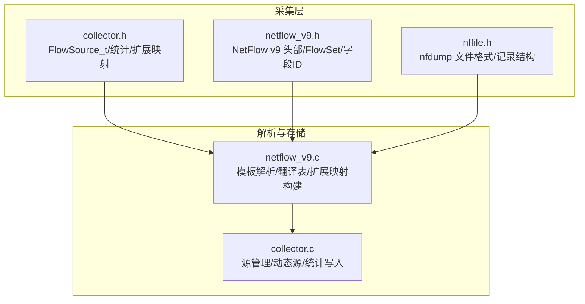
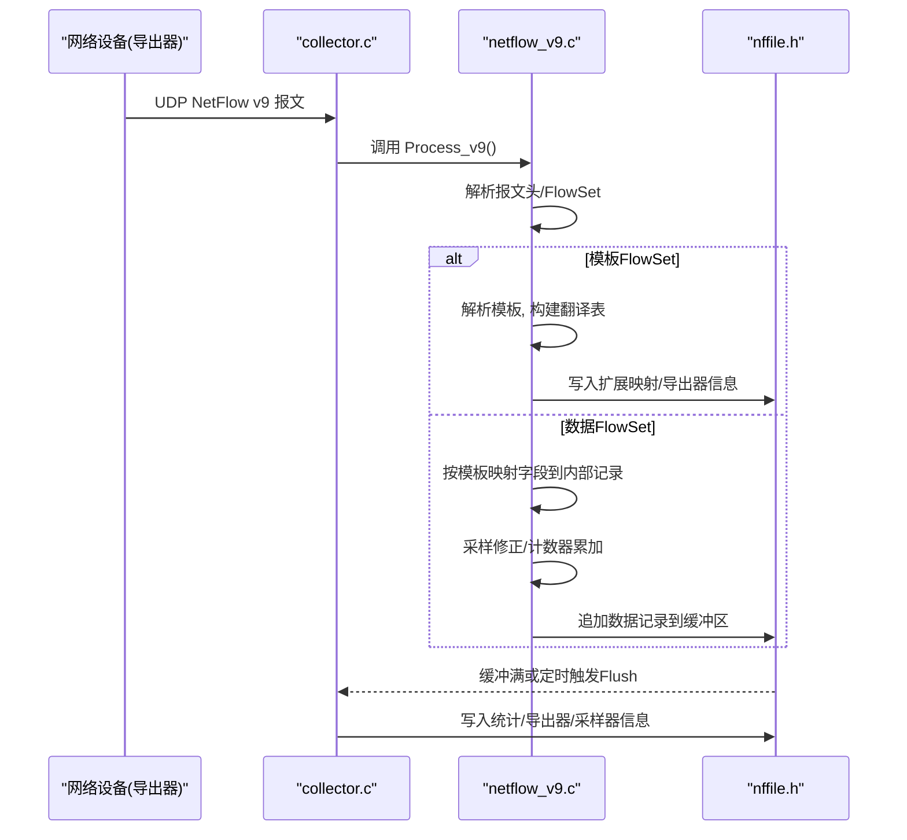
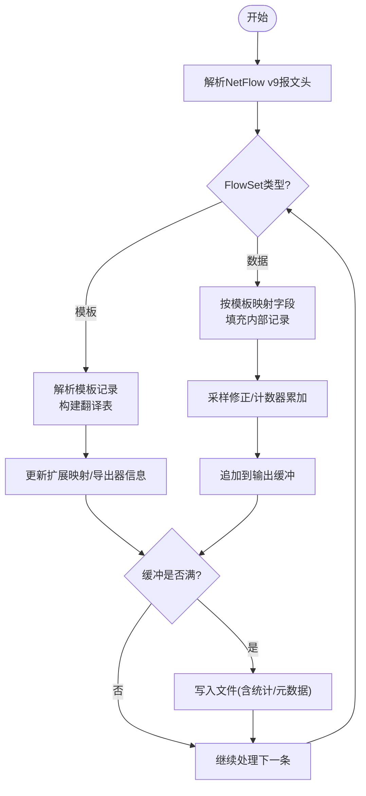
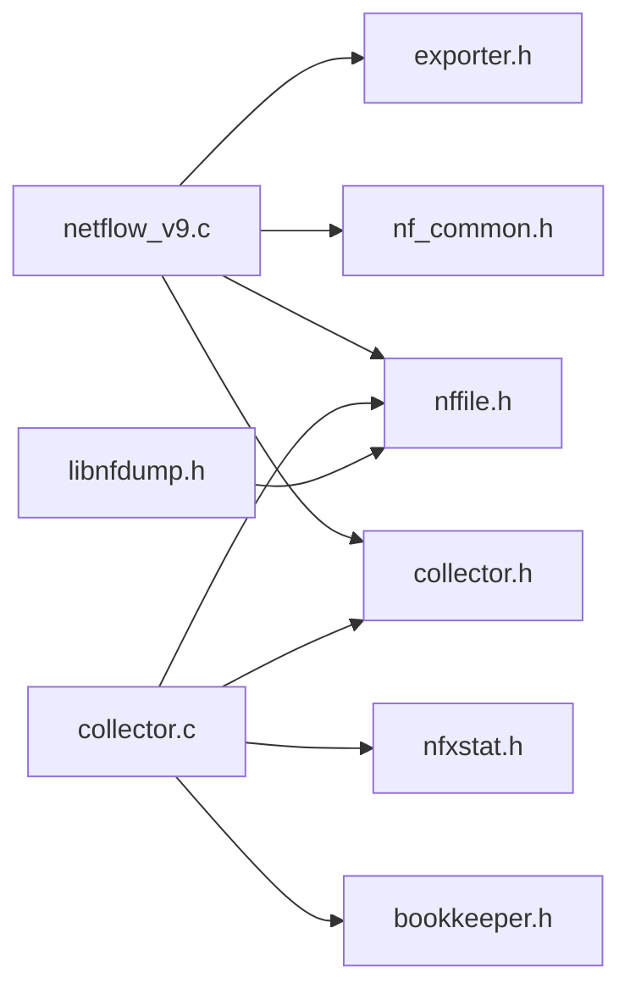

# 数据采集与解析

<cite>
**本文引用的文件**
- [netflow_v9.h](file://ly_analyser/src/agent/dump/netflow_v9.h)
- [collector.h](file://ly_analyser/src/agent/dump/collector.h)
- [nffile.h](file://ly_analyser/src/agent/dump/nffile.h)
- [nfdump.h](file://ly_analyser/src/agent/dump/nfdump.h)
- [nf_common.h](file://ly_analyser/src/agent/dump/nf_common.h)
- [libnfdump.h](file://ly_analyser/src/agent/dump/libnfdump.h)
- [netflow_v9.c](file://ly_analyser/src/nfdump/bin/netflow_v9.c)
- [collector.c](file://ly_analyser/src/nfdump/bin/collector.c)
</cite>

## 目录
1. [简介](#简介)
2. [项目结构](#项目结构)
3. [核心组件](#核心组件)
4. [架构总览](#架构总览)
5. [详细组件分析](#详细组件分析)
6. [依赖关系分析](#依赖关系分析)
7. [性能考虑](#性能考虑)
8. [故障排查指南](#故障排查指南)
9. [结论](#结论)
10. [附录](#附录)

## 简介
本技术文档聚焦于数据采集与解析模块，围绕 NetFlow v9 数据的接收、解析与格式转换进行系统性说明。内容涵盖：
- NetFlow v9 数据包的接收机制与处理流程
- nfdump 库的使用方式、数据流管道与错误处理机制
- 数据验证、完整性检查与异常处理实现细节
- 实时数据流与批量数据处理策略差异
- 数据格式规范、协议解析示例与性能优化技巧

该模块基于 nfdump 的采集与存储能力，将来自不同导出器的 NetFlow v9 报文解析为统一的内部记录格式，并持久化为 nfdump 二进制文件，便于后续查询与分析。

## 项目结构
本项目在 ly_analyser 下包含 agent 与 nfdump 两套代码组织：
- agent/dump：面向采集侧的轻量封装与头文件定义（如 netflow_v9.h、collector.h、nffile.h）
- nfdump/bin：nfdump 的核心实现（如 netflow_v9.c、collector.c），负责实际的报文解析、模板管理、扩展映射与落盘

**图示来源**
- [collector.h:94-134](file://ly_analyser/src/agent/dump/collector.h#L94-L134)
- [netflow_v9.h:74-137](file://ly_analyser/src/agent/dump/netflow_v9.h#L74-L137)
- [nffile.h:117-135](file://ly_analyser/src/agent/dump/nffile.h#L117-L135)
- [netflow_v9.c:442-470](file://ly_analyser/src/nfdump/bin/netflow_v9.c#L442-L470)
- [collector.c:112-232](file://ly_analyser/src/nfdump/bin/collector.c#L112-L232)

**章节来源**
- [collector.h:94-134](file://ly_analyser/src/agent/dump/collector.h#L94-L134)
- [netflow_v9.h:74-137](file://ly_analyser/src/agent/dump/netflow_v9.h#L74-L137)
- [nffile.h:117-135](file://ly_analyser/src/agent/dump/nffile.h#L117-L135)
- [netflow_v9.c:442-470](file://ly_analyser/src/nfdump/bin/netflow_v9.c#L442-L470)
- [collector.c:112-232](file://ly_analyser/src/nfdump/bin/collector.c#L112-L232)

## 核心组件
- NetFlow v9 协议结构与字段定义：提供报文头、FlowSet、模板记录、选项模板等数据结构及标准/扩展字段 ID 常量
- FlowSource 与收集器状态：维护每个数据源的 IP、路径、当前文件句柄、统计信息、扩展映射列表等
- nfdump 文件格式：定义文件头、统计记录、数据块、通用记录与各类扩展记录的布局与标志位
- 解析引擎（netflow_v9.c）：实现模板解析、翻译表构建、字段到内部扩展的映射、采样与计数器修正、输出模板生成
- 收集器（collector.c）：管理静态/动态数据源、分配系统 ID、写入导出器/采样器信息与统计、刷新扩展映射

**章节来源**
- [netflow_v9.h:74-137](file://ly_analyser/src/agent/dump/netflow_v9.h#L74-L137)
- [collector.h:94-134](file://ly_analyser/src/agent/dump/collector.h#L94-L134)
- [nffile.h:117-135](file://ly_analyser/src/agent/dump/nffile.h#L117-L135)
- [netflow_v9.c:442-470](file://ly_analyser/src/nfdump/bin/netflow_v9.c#L442-L470)
- [collector.c:478-510](file://ly_analyser/src/nfdump/bin/collector.c#L478-L510)

## 架构总览
下图展示了从网络接收到落盘的端到端流程，包括模板协商、字段映射、采样修正与文件写入。

**图示来源**
- [netflow_v9.c:442-470](file://ly_analyser/src/nfdump/bin/netflow_v9.c#L442-L470)
- [collector.c:533-552](file://ly_analyser/src/nfdump/bin/collector.c#L533-L552)
- [nffile.h:117-135](file://ly_analyser/src/agent/dump/nffile.h#L117-L135)

## 详细组件分析

### NetFlow v9 协议与数据结构
- 报文头：包含版本、记录数、系统时间、UNIX 秒、序列号、源标识等
- FlowSet：模板 FlowSet（ID=0）、选项模板 FlowSet（ID=1）、数据 FlowSet（ID≥256）
- 模板记录：包含模板 ID、字段计数、字段类型与长度
- 常用字段 ID：如入/出字节、包数、协议、端口、IPv4/IPv6 地址、掩码、下一跳、AS、方向、VLAN、MPLS、延迟扩展、HTTP/DNS/ICMP/服务/设备/OS/中间件/威胁等

这些结构为后续模板解析与字段映射提供了基础。

**章节来源**
- [netflow_v9.h:74-137](file://ly_analyser/src/agent/dump/netflow_v9.h#L74-L137)
- [netflow_v9.h:173-303](file://ly_analyser/src/agent/dump/netflow_v9.h#L173-L303)

### FlowSource 与收集器状态
- FlowSource_t：维护数据源标识、IP、保存目录、当前文件句柄、统计、扩展映射列表、选项偏移表等
- 动态源支持：根据对端地址动态创建子目录与当前文件，便于多源隔离
- 统计与元数据：导出器信息、采样器信息、扩展映射、导出器统计均通过 AppendToBuffer 写入文件

**章节来源**
- [collector.h:94-134](file://ly_analyser/src/agent/dump/collector.h#L94-L134)
- [collector.c:302-431](file://ly_analyser/src/nfdump/bin/collector.c#L302-L431)
- [collector.c:478-510](file://ly_analyser/src/nfdump/bin/collector.c#L478-L510)

### nfdump 文件格式与记录布局
- 文件头：魔数、版本、标志（压缩/匿名/目录）、数据块数量、标识符
- 统计记录：总体/协议/时间窗口/序列失败等统计
- 数据块：Block Type 2 支持多种记录类型（通用记录、扩展映射、直方图、导出器/采样器信息等）
- 通用记录：包含标志位（IPv4/IPv6、64位计数、采样标记等）和固定字段（时间、协议、端口、TOS、转发状态等）
- 扩展记录：按扩展 ID 组织，如 IPv4/IPv6 地址、包/字节计数、接口 SNMP、AS、下一跳、VLAN、MAC、MPLS、延迟、HTTP/DNS/ICMP/服务/设备/OS/中间件/威胁等

**章节来源**
- [nffile.h:117-135](file://ly_analyser/src/agent/dump/nffile.h#L117-L135)
- [nffile.h:143-177](file://ly_analyser/src/agent/dump/nffile.h#L143-L177)
- [nffile.h:191-221](file://ly_analyser/src/agent/dump/nffile.h#L191-L221)
- [nffile.h:346-389](file://ly_analyser/src/agent/dump/nffile.h#L346-L389)
- [nffile.h:425-435](file://ly_analyser/src/agent/dump/nffile.h#L425-L435)
- [nffile.h:479-490](file://ly_analyser/src/agent/dump/nffile.h#L479-L490)
- [nffile.h:527-531](file://ly_analyser/src/agent/dump/nffile.h#L527-L531)
- [nffile.h:558-576](file://ly_analyser/src/agent/dump/nffile.h#L558-L576)
- [nffile.h:589-600](file://ly_analyser/src/agent/dump/nffile.h#L589-L600)
- [nffile.h:615-618](file://ly_analyser/src/agent/dump/nffile.h#L615-L618)
- [nffile.h:634-637](file://ly_analyser/src/agent/dump/nffile.h#L634-L637)
- [nffile.h:653-656](file://ly_analyser/src/agent/dump/nffile.h#L653-L656)
- [nffile.h:671-674](file://ly_analyser/src/agent/dump/nffile.h#L671-L674)
- [nffile.h:686-690](file://ly_analyser/src/agent/dump/nffile.h#L686-L690)
- [nffile.h:703-706](file://ly_analyser/src/agent/dump/nffile.h#L703-L706)
- [nffile.h:717-723](file://ly_analyser/src/agent/dump/nffile.h#L717-L723)
- [nffile.h:736-739](file://ly_analyser/src/agent/dump/nffile.h#L736-L739)
- [nffile.h:750-756](file://ly_analyser/src/agent/dump/nffile.h#L750-L756)
- [nffile.h:768-771](file://ly_analyser/src/agent/dump/nffile.h#L768-L771)
- [nffile.h:782-788](file://ly_analyser/src/agent/dump/nffile.h#L782-L788)
- [nffile.h:798-800](file://ly_analyser/src/agent/dump/nffile.h#L798-L800)

### 模板解析与字段映射（netflow_v9.c）
- 初始化阶段：建立元素查找表，缓存支持的 v9 标签集合
- 模板解析：遍历模板 FlowSet，构建输入到输出的“翻译表”，确定各字段在输出记录中的位置与长度
- 字段映射：依据 v9_element_map 将 v9 字段映射到 nfdump 扩展 ID，并设置移动/清零序列
- 采样修正：对包/字节计数进行采样校正，确保 64 位精度
- 输出模板：为发送端生成输出模板 FlowSet，保证下游一致性

**图示来源**
- [netflow_v9.c:442-470](file://ly_analyser/src/nfdump/bin/netflow_v9.c#L442-L470)
- [netflow_v9.c:530-554](file://ly_analyser/src/nfdump/bin/netflow_v9.c#L530-L554)
- [netflow_v9.c:645-800](file://ly_analyser/src/nfdump/bin/netflow_v9.c#L645-L800)

**章节来源**
- [netflow_v9.c:442-470](file://ly_analyser/src/nfdump/bin/netflow_v9.c#L442-L470)
- [netflow_v9.c:530-554](file://ly_analyser/src/nfdump/bin/netflow_v9.c#L530-L554)
- [netflow_v9.c:645-800](file://ly_analyser/src/nfdump/bin/netflow_v9.c#L645-L800)

### 数据源管理与动态源（collector.c）
- 静态源：通过 AddFlowSource/AddDefaultFlowSource 配置，校验路径与 IP，生成当前文件路径
- 动态源：AddDynamicSource 根据对端地址创建子目录与当前文件，便于多源隔离
- 统计写入：FlushStdRecords/FlushExporterStats 将导出器/采样器信息与统计写入文件
- 扩展映射：InitExtensionMapList/AddExtensionMap 管理扩展映射列表并追加到文件

**章节来源**
- [collector.c:112-232](file://ly_analyser/src/nfdump/bin/collector.c#L112-L232)
- [collector.c:302-431](file://ly_analyser/src/nfdump/bin/collector.c#L302-L431)
- [collector.c:433-476](file://ly_analyser/src/nfdump/bin/collector.c#L433-L476)
- [collector.c:533-552](file://ly_analyser/src/nfdump/bin/collector.c#L533-L552)
- [collector.c:554-611](file://ly_analyser/src/nfdump/bin/collector.c#L554-L611)

### 数据验证、完整性检查与异常处理
- 序列号检查：导出器域内维护 last_sequence/sequence，检测丢包或乱序
- 模板有效性：未知字段类型将被跳过并记录日志；翻译表容量不足时记录软件错误
- 内存分配：多处 malloc/calloc/realloc 失败时记录错误并返回
- 路径与权限：目录不存在或不可写时报错；动态源创建目录失败则清理资源
- 统计一致性：导出器统计写入时校验记录数，防止数据不一致

**章节来源**
- [netflow_v9.c:530-554](file://ly_analyser/src/nfdump/bin/netflow_v9.c#L530-L554)
- [netflow_v9.c:613-642](file://ly_analyser/src/nfdump/bin/netflow_v9.c#L613-L642)
- [collector.c:478-510](file://ly_analyser/src/nfdump/bin/collector.c#L478-L510)
- [collector.c:554-611](file://ly_analyser/src/nfdump/bin/collector.c#L554-L611)

### 实时数据流与批量数据处理策略
- 实时模式：以 UDP 接收报文，边收边解析，使用缓冲累积后定期 Flush，降低 I/O 开销
- 批量模式：通过 libnfdump 提供的 process_flow 回调接口，可对已有 nfdump 文件进行批处理，适合离线分析与报表生成
- 缓冲策略：WRITE_BUFFSIZE/BUFFSIZE 控制输出缓冲大小，平衡内存与 I/O 频率

**章节来源**
- [collector.h:136-137](file://ly_analyser/src/agent/dump/collector.h#L136-L137)
- [nffile.h:83-99](file://ly_analyser/src/agent/dump/nffile.h#L83-L99)
- [libnfdump.h:10-11](file://ly_analyser/src/agent/dump/libnfdump.h#L10-L11)

## 依赖关系分析
- 解析器依赖：nffile.h（文件格式）、nf_common.h（通用工具）、collector.h（源与统计）、exporter.h（导出器信息）、util.h（工具函数）
- 收集器依赖：nffile.h、collector.h、bookkeeper.h（进程守护）、nfxstat.h（统计）、util.h
- 外部集成：libnfdump.h 暴露 process_flow 回调，供上层应用批量处理

**图示来源**
- [netflow_v9.c:38-65](file://ly_analyser/src/nfdump/bin/netflow_v9.c#L38-L65)
- [collector.c:67-75](file://ly_analyser/src/nfdump/bin/collector.c#L67-L75)
- [libnfdump.h:8-11](file://ly_analyser/src/agent/dump/libnfdump.h#L8-L11)

**章节来源**
- [netflow_v9.c:38-65](file://ly_analyser/src/nfdump/bin/netflow_v9.c#L38-L65)
- [collector.c:67-75](file://ly_analyser/src/nfdump/bin/collector.c#L67-L75)
- [libnfdump.h:8-11](file://ly_analyser/src/agent/dump/libnfdump.h#L8-L11)

## 性能考虑
- 缓冲与刷盘：合理设置 WRITE_BUFFSIZE/BUFFSIZE，避免频繁 I/O 导致延迟；监控缓冲占用，及时 Flush
- 模板缓存：翻译表与扩展映射复用，减少重复计算；注意模板刷新时的增量更新
- 采样修正：对高采样率场景，确保 64 位计数器与采样算法正确性，避免溢出与偏差
- 多源隔离：动态源按 IP 分目录，降低锁竞争与 I/O 冲突
- 日志与调试：生产环境关闭 dbg_printf，仅保留必要 syslog，减少开销

[本节为通用指导，不直接分析具体文件]

## 故障排查指南
- 模板未知字段：检查 v9_element_map 是否覆盖新字段；查看日志中“Skip unknown element type”提示
- 序列号异常：核对导出器序列号连续性，定位丢包或重传问题
- 内存分配失败：关注 malloc/calloc/realloc 错误日志，调整系统内存或限制并发源
- 路径错误：确认数据目录存在且可写；动态源创建目录失败时检查权限
- 统计不一致：核对导出器统计写入的记录数与预期是否一致

**章节来源**
- [netflow_v9.c:530-554](file://ly_analyser/src/nfdump/bin/netflow_v9.c#L530-L554)
- [collector.c:554-611](file://ly_analyser/src/nfdump/bin/collector.c#L554-L611)

## 结论
本模块基于 nfdump 实现了稳定高效的 NetFlow v9 数据采集与解析能力。通过模板解析、字段映射、采样修正与统一的文件格式存储，既满足实时流式处理需求，也支持批量离线分析。建议在部署时关注缓冲策略、模板覆盖与日志级别，以获得最佳性能与可观测性。

[本节为总结，不直接分析具体文件]

## 附录
- 数据格式规范：参考 nffile.h 中文件头、统计记录、数据块与各类扩展记录的定义
- 协议解析示例：参考 netflow_v9.c 中模板解析与字段映射逻辑
- 性能优化技巧：调整缓冲大小、启用动态源隔离、合理设置采样参数、控制日志输出

[本节为补充说明，不直接分析具体文件]