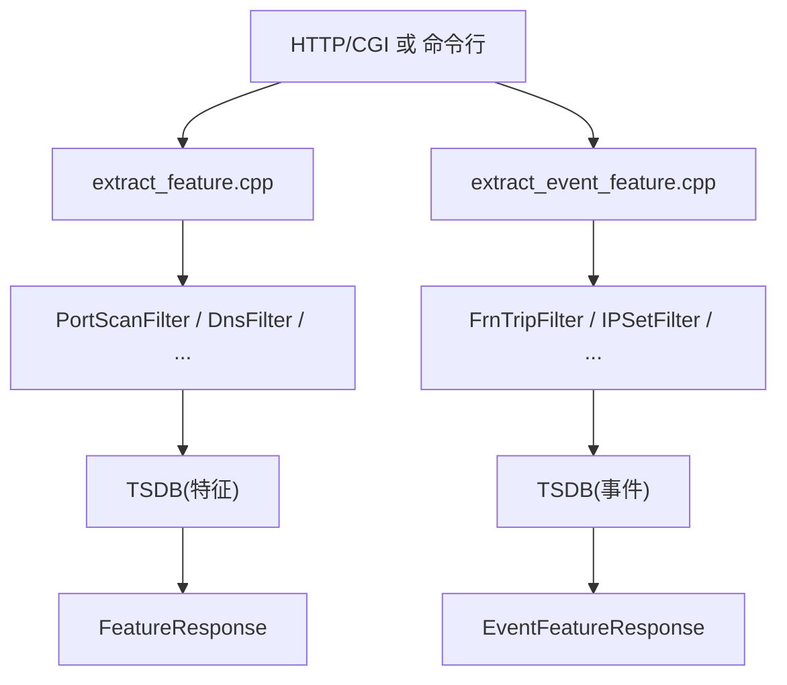
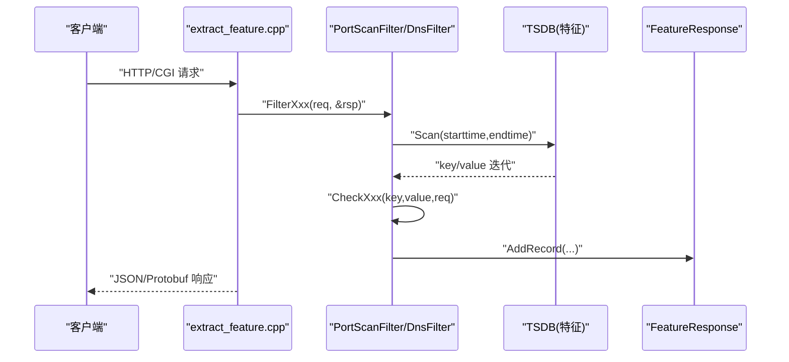
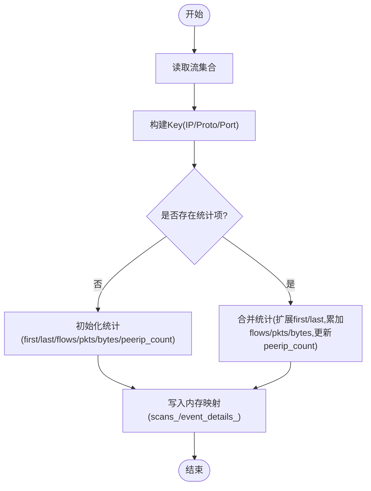
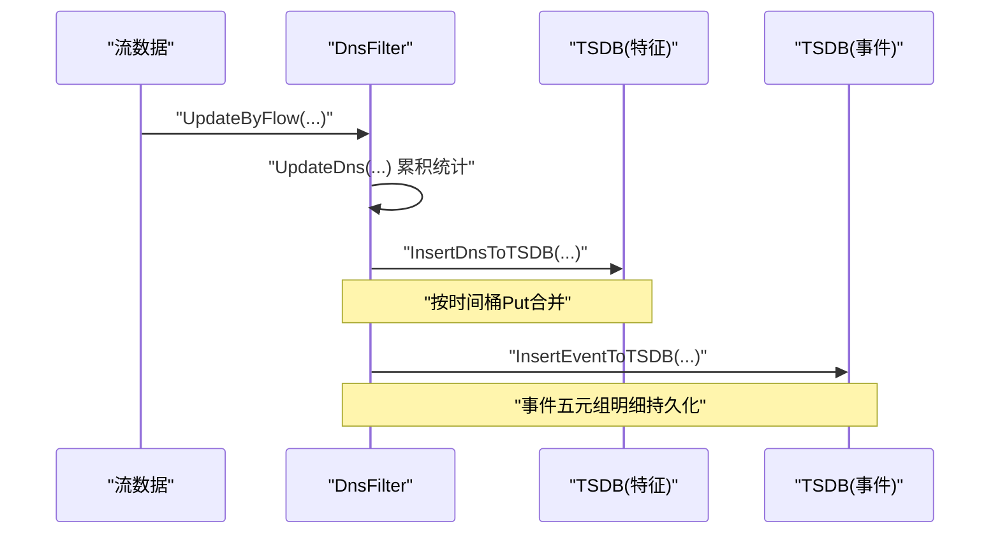
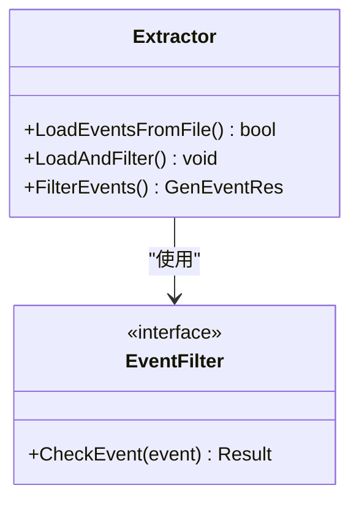
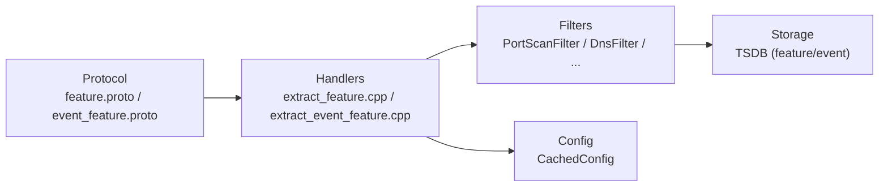

# 特征提取与处理

<cite>
**本文引用的文件**
- [extract_feature.cpp](file://ly_analyser/src/agent/handlers/extract_feature.cpp)
- [extract_event_feature.cpp](file://ly_analyser/src/agent/handlers/extract_event_feature.cpp)
- [event_extractor.cpp](file://ly_analyser/src/agent/handlers/event_extractor.cpp)
- [feature.proto](file://ly_analyser/src/common/feature.proto)
- [event_feature.proto](file://ly_analyser/src/common/event_feature.proto)
- [port_scan_filter.cpp](file://ly_analyser/src/agent/flow/port_scan_filter.cpp)
- [dns_filter.cpp](file://ly_analyser/src/agent/flow/dns_filter.cpp)
</cite>

## 目录
1. [简介](#简介)
2. [项目结构](#项目结构)
3. [核心组件](#核心组件)
4. [架构总览](#架构总览)
5. [详细组件分析](#详细组件分析)
6. [依赖关系分析](#依赖关系分析)
7. [性能考量](#性能考量)
8. [故障排查指南](#故障排查指南)
9. [结论](#结论)
10. [附录](#附录)

## 简介
本技术文档聚焦于网络流量“特征提取与处理”模块，系统阐述以下方面：
- 事件特征的语义定义、提取规则与计算逻辑
- 时间窗口分析、统计特征计算与行为模式识别的实现细节
- 特征向量构建过程、特征选择策略与降维方法（在本仓库中的落地方式）
- 特征质量评估指标、特征重要性分析与特征演化监控方案（结合现有TSDB与配置机制的可行路径）

该模块通过统一的请求协议（FeatureReq/EventFeatureReq）驱动多种过滤器（如端口扫描、DNS等），从流数据中抽取并聚合特征，输出结构化记录（FeatureRecord/EventFeatureRecord），供上层告警、可视化与模型使用。

## 项目结构
- 入口处理器
  - extract_feature.cpp：基于HTTP/Cgi或标准输入解析请求，路由到具体过滤器，生成FeatureResponse
  - extract_event_feature.cpp：事件级特征提取入口，路由到事件过滤器，生成EventFeatureResponse
  - event_extractor.cpp：从事件文件加载并过滤事件，用于离线批处理场景
- 协议与数据结构
  - feature.proto：定义FeatureReq/FeatureRecord/FeatureResponse
  - event_feature.proto：定义EventFeatureReq/EventFeatureRecord/EventFeatureResponse
- 过滤器实现
  - port_scan_filter.cpp：端口扫描特征提取与事件生成
  - dns_filter.cpp：DNS查询特征提取与事件生成
- 存储与索引
  - TSDB：按时间分桶的特征/事件时序存储，支持范围扫描与合并更新
  - 配置缓存：CachedConfig提供设备模型等信息

图表来源
- [extract_feature.cpp:294-481](file://ly_analyser/src/agent/handlers/extract_feature.cpp#L294-L481)
- [extract_event_feature.cpp:35-207](file://ly_analyser/src/agent/handlers/extract_event_feature.cpp#L35-L207)

章节来源
- [extract_feature.cpp:294-481](file://ly_analyser/src/agent/handlers/extract_feature.cpp#L294-L481)
- [extract_event_feature.cpp:35-207](file://ly_analyser/src/agent/handlers/extract_event_feature.cpp#L35-L207)

## 核心组件
- 请求与响应协议
  - FeatureReq：包含设备ID、时间窗、五元组、域名/URL、排序与限制等字段，用于筛选特征
  - FeatureRecord：包含时间、持续时长、协议、字节/包/流计数、对端数、应用层信息、威胁/资产/OS/中间件信息等
  - EventFeatureReq：事件级查询条件（时间窗、五元组、域名、URL、对象等）
  - EventFeatureRecord：事件级特征（五元组、域名、URL、对象、捕获信息等）
- 过滤器基类与工厂
  - 各过滤器继承统一接口，提供Create/UpdateByFlow/UpdateFinished/FilterXxx等方法
  - 通过DBBuilder构造TSDB实例，按设备ID与类型命名空间隔离
- 时序存储（TSDB）
  - 以时间桶为键，Key为业务维度（如IP+端口+协议），Value为统计值（flows/pkts/bytes等）
  - 支持Put合并与Range Scan，便于窗口聚合与历史回溯

章节来源
- [feature.proto:1-132](file://ly_analyser/src/common/feature.proto#L1-L132)
- [event_feature.proto:1-75](file://ly_analyser/src/common/event_feature.proto#L1-L75)
- [port_scan_filter.cpp:18-30](file://ly_analyser/src/agent/flow/port_scan_filter.cpp#L18-L30)
- [dns_filter.cpp:40-52](file://ly_analyser/src/agent/flow/dns_filter.cpp#L40-L52)

## 架构总览
整体流程分为“在线/实时”和“离线/批处理”两条路径：
- 在线路径：HTTP/CGI接收请求，解析为FeatureReq/EventFeatureReq，路由至对应过滤器，读取TSDB进行范围扫描与过滤，组装响应
- 离线路径：从事件文件加载事件，按规则过滤后输出

图表来源
- [extract_feature.cpp:294-481](file://ly_analyser/src/agent/handlers/extract_feature.cpp#L294-L481)
- [port_scan_filter.cpp:302-319](file://ly_analyser/src/agent/flow/port_scan_filter.cpp#L302-L319)
- [dns_filter.cpp:270-286](file://ly_analyser/src/agent/flow/dns_filter.cpp#L270-L286)

## 详细组件分析

### 端口扫描特征提取（PortScanFilter）
- 关键流程
  - UpdateByFlow/UpdateByFlowV6：遍历流集合，提取源/目的IP、端口、协议，调用UpdateScans累积统计
  - UpdateScans：维护scans_（按IP+协议+端口聚合）与event_details_（五元组级别明细），累计首次/末次时间、流数、包数、字节数、对端数与应用名
  - LoadPatternFromFile/DividePatterns：从配置文件加载扫描模式，划分不同匹配维度（IP/端口/协议/流数等）
  - UpdateFinished：根据模型（V4/V6）选择更新路径，生成事件与特征，写入TSDB
  - FilterScan/FilterScanEvent：按时间窗与条件扫描TSDB，构造FeatureRecord/EventFeatureRecord
- 时间窗口与统计
  - first/last记录窗口起止，flows/pkts/bytes累加，peerip_count统计对端数量
  - 通过TSDB Put合并旧值，保证跨批次增量更新
- 事件生成
  - GenerateEvents/GenerateFeature：依据配置阈值与模式匹配，产出事件与特征记录

图表来源
- [port_scan_filter.cpp:106-180](file://ly_analyser/src/agent/flow/port_scan_filter.cpp#L106-L180)

章节来源
- [port_scan_filter.cpp:18-30](file://ly_analyser/src/agent/flow/port_scan_filter.cpp#L18-L30)
- [port_scan_filter.cpp:106-180](file://ly_analyser/src/agent/flow/port_scan_filter.cpp#L106-L180)
- [port_scan_filter.cpp:182-244](file://ly_analyser/src/agent/flow/port_scan_filter.cpp#L182-L244)
- [port_scan_filter.cpp:246-319](file://ly_analyser/src/agent/flow/port_scan_filter.cpp#L246-L319)
- [port_scan_filter.cpp:321-398](file://ly_analyser/src/agent/flow/port_scan_filter.cpp#L321-L398)

### DNS特征提取（DnsFilter）
- 关键流程
  - UpdateByFlow/UpdateByFlowV6：过滤有效qname与标志位，调用UpdateDns累积统计
  - UpdateDns：维护dns_（按源/目的IP+域名+QType聚合）与event_details_（五元组明细），累计flows/pkts/bytes与首尾时间
  - InsertDnsToTSDB：将统计写入TSDB，合并旧值
  - FilterDns/FilterDnsEvent：按时间窗与条件扫描TSDB，构造FeatureRecord/EventFeatureRecord
  - GenerateEvents/GenEventFeature：按配置阈值与域名白名单/黑名单生成事件，并将五元组明细写入事件TSDB
- 域名校验与分类
  - JudgeSpecChar：正则校验域名合法性
  - LoadDomainFromFile：加载域名分类文件，按MD5(qname)匹配类别
- 事件特征
  - 事件记录包含五元组、域名、QType、对象描述、模型ID、阈值与告警值等

图表来源
- [dns_filter.cpp:54-92](file://ly_analyser/src/agent/flow/dns_filter.cpp#L54-L92)
- [dns_filter.cpp:101-172](file://ly_analyser/src/agent/flow/dns_filter.cpp#L101-L172)
- [dns_filter.cpp:252-268](file://ly_analyser/src/agent/flow/dns_filter.cpp#L252-L268)
- [dns_filter.cpp:413-453](file://ly_analyser/src/agent/flow/dns_filter.cpp#L413-L453)

章节来源
- [dns_filter.cpp:40-52](file://ly_analyser/src/agent/flow/dns_filter.cpp#L40-L52)
- [dns_filter.cpp:95-172](file://ly_analyser/src/agent/flow/dns_filter.cpp#L95-L172)
- [dns_filter.cpp:200-268](file://ly_analyser/src/agent/flow/dns_filter.cpp#L200-L268)
- [dns_filter.cpp:270-360](file://ly_analyser/src/agent/flow/dns_filter.cpp#L270-L360)
- [dns_filter.cpp:407-453](file://ly_analyser/src/agent/flow/dns_filter.cpp#L407-L453)

### 入口处理器与事件提取器
- extract_feature.cpp
  - 解析HTTP/CGI参数或POST Protobuf文本格式，构造FeatureReq
  - 根据type分发到对应过滤器（端口扫描、IP扫描、服务、黑白名单、MO、DNS、DGA、隧道等）
  - 输出JSON数组或Protobuf序列化的FeatureResponse
- extract_event_feature.cpp
  - 类似地解析EventFeatureReq，分发到事件过滤器（FRN_TRIP、TI、端口/IP扫描、服务、黑白名单、DNS、ICMP隧道、DGA、威胁捕获、挖矿等）
  - 输出EventFeatureResponse
- event_extractor.cpp
  - 从AGENT_EVENT_FILE加载事件，按EventFilter规则过滤，输出过滤后的事件集

图表来源
- [event_extractor.cpp:20-54](file://ly_analyser/src/agent/handlers/event_extractor.cpp#L20-L54)

章节来源
- [extract_feature.cpp:294-481](file://ly_analyser/src/agent/handlers/extract_feature.cpp#L294-L481)
- [extract_event_feature.cpp:35-207](file://ly_analyser/src/agent/handlers/extract_event_feature.cpp#L35-L207)
- [event_extractor.cpp:20-54](file://ly_analyser/src/agent/handlers/event_extractor.cpp#L20-L54)

## 依赖关系分析
- 入口处理器依赖
  - 协议定义：feature.proto、event_feature.proto
  - 过滤器族：PortScanFilter、DnsFilter、IPScanFilter、AssetsrvFilter、BWFilter、ThreatFilter、MiningFilter等
  - 存储：DBBuilder/TSDB（按设备ID与类型命名空间）
  - 配置：CachedConfig（设备模型、策略等）
- 过滤器内部依赖
  - 工具库：IP转换、字符串处理、时间格式化、日志
  - 规则与配置：模式文件（端口扫描）、域名分类文件（DNS）
  - 事件生成：EventGenerator（阈值、时间窗、对象描述）

图表来源
- [feature.proto:1-132](file://ly_analyser/src/common/feature.proto#L1-L132)
- [event_feature.proto:1-75](file://ly_analyser/src/common/event_feature.proto#L1-L75)
- [extract_feature.cpp:294-481](file://ly_analyser/src/agent/handlers/extract_feature.cpp#L294-L481)
- [extract_event_feature.cpp:35-207](file://ly_analyser/src/agent/handlers/extract_event_feature.cpp#L35-L207)

章节来源
- [feature.proto:1-132](file://ly_analyser/src/common/feature.proto#L1-L132)
- [event_feature.proto:1-75](file://ly_analyser/src/common/event_feature.proto#L1-L75)
- [extract_feature.cpp:294-481](file://ly_analyser/src/agent/handlers/extract_feature.cpp#L294-L481)
- [extract_event_feature.cpp:35-207](file://ly_analyser/src/agent/handlers/extract_event_feature.cpp#L35-L207)

## 性能考量
- 时间分桶与增量合并
  - TSDB按时间单位对齐first/last，减少重复写入；Put时合并旧值，降低IO压力
- 内存聚合与去重
  - scans_/dns_等内存映射在批处理阶段聚合，避免频繁磁盘访问
- 过滤前置
  - 在UpdateByFlow阶段即做基础过滤（如端口为0、非TCP/特定TOS位、域名非法等），减少无效统计
- 批量输出
  - 响应采用Protobuf序列化或JSON数组一次性输出，减少网络开销
- 可扩展性
  - 过滤器独立、可插拔，新增特征类型无需改动入口逻辑

[本节为通用性能建议，不直接分析具体文件]

## 故障排查指南
- HTTP参数解析失败
  - 现象：返回“HTTP/1.1 400 Invalid Params”
  - 可能原因：GET/POST参数未正确解析为FeatureReq/EventFeatureReq
  - 定位：检查extract_feature.cpp/extract_event_feature.cpp中的解析分支
- 过滤器初始化失败
  - 现象：日志打印“initialization FAILED”
  - 可能原因：DBBuilder/TSDB创建失败、配置缺失
  - 定位：检查对应Create方法与DB上下文
- 时间窗无结果
  - 现象：返回空记录
  - 可能原因：starttime/endtime超出数据范围、过滤条件过严
  - 定位：检查FilterXxx中的时间判断与条件匹配
- 域名/URL异常字符
  - 现象：输出被替换为错误标记
  - 可能原因：正则校验失败
  - 定位：检查extract_feature.cpp中的特殊字符过滤逻辑

章节来源
- [extract_feature.cpp:484-513](file://ly_analyser/src/agent/handlers/extract_feature.cpp#L484-L513)
- [extract_event_feature.cpp:211-239](file://ly_analyser/src/agent/handlers/extract_event_feature.cpp#L211-L239)
- [port_scan_filter.cpp:302-319](file://ly_analyser/src/agent/flow/port_scan_filter.cpp#L302-L319)
- [dns_filter.cpp:270-286](file://ly_analyser/src/agent/flow/dns_filter.cpp#L270-L286)

## 结论
本模块以统一的请求协议驱动多类过滤器，通过内存聚合与时序存储（TSDB）实现高效的时间窗口统计与特征提取。端口扫描与DNS两类典型场景展示了：
- 事件特征的定义与提取规则（五元组、域名、QType、对象描述等）
- 时间窗口分析（first/last、flows/pkts/bytes累加）
- 行为模式识别（扫描阈值、域名分类、规则匹配）
- 特征向量构建（FeatureRecord/EventFeatureRecord的结构化字段）
- 特征选择与降维（通过请求条件过滤、模式配置与阈值控制）
- 特征质量评估与演化监控（可通过TSDB历史趋势、配置变更与日志审计实现）

[本节为总结性内容，不直接分析具体文件]

## 附录
- 特征字段说明（节选）
  - 时间相关：time、duration、srv_time、dev_time、os_time、midware_time
  - 网络相关：protocol、sip、sport、dip、dport、peers、flows、pkts、bytes
  - 应用相关：app_proto、qname、fqname、url、host、retcode、bwclass
  - 资产/威胁：ti_mark、srv_mark、srv_name/srv_version/srv_type、dev_type/name/vendor/model、os_type/name/version、midware_type/name/version、threat_type/name/version
- 事件字段说明（节选）
  - 五元组：sip/sport/dip/dport/proto
  - 应用：domain、qtype、url、obj
  - 捕获：captype/capname/capvers/capusec
  - 其他：icmp_type、model、payload

章节来源
- [feature.proto:71-124](file://ly_analyser/src/common/feature.proto#L71-L124)
- [event_feature.proto:43-67](file://ly_analyser/src/common/event_feature.proto#L43-L67)