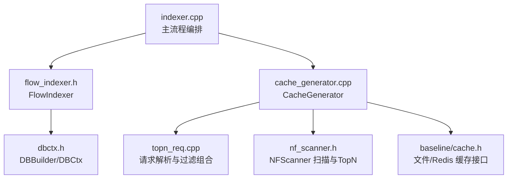
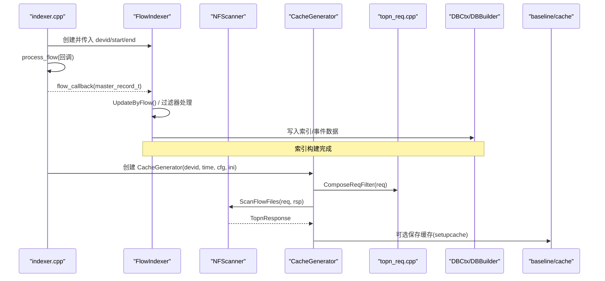
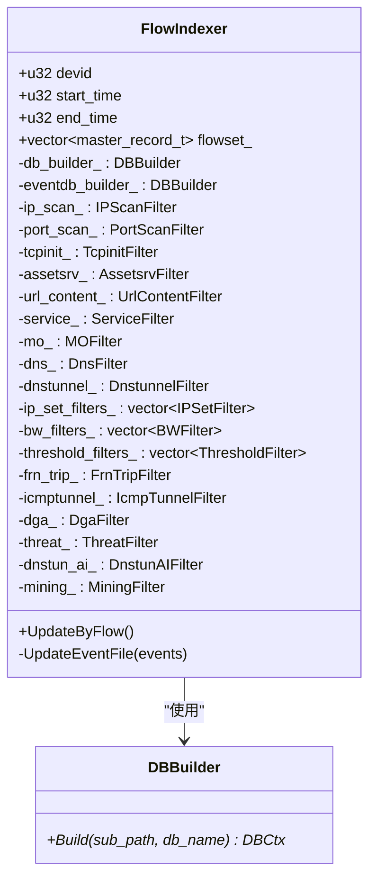
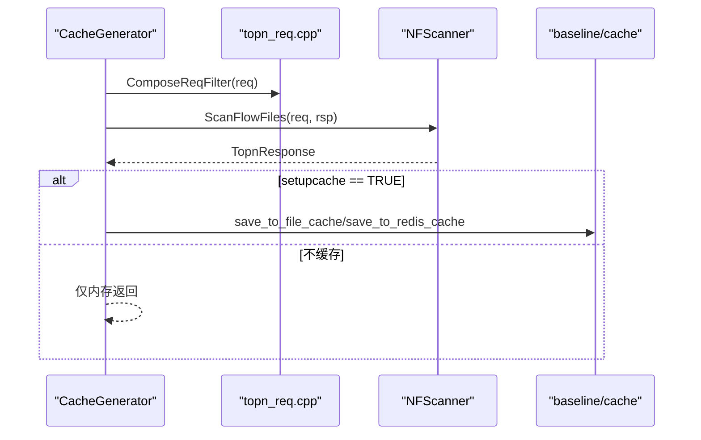
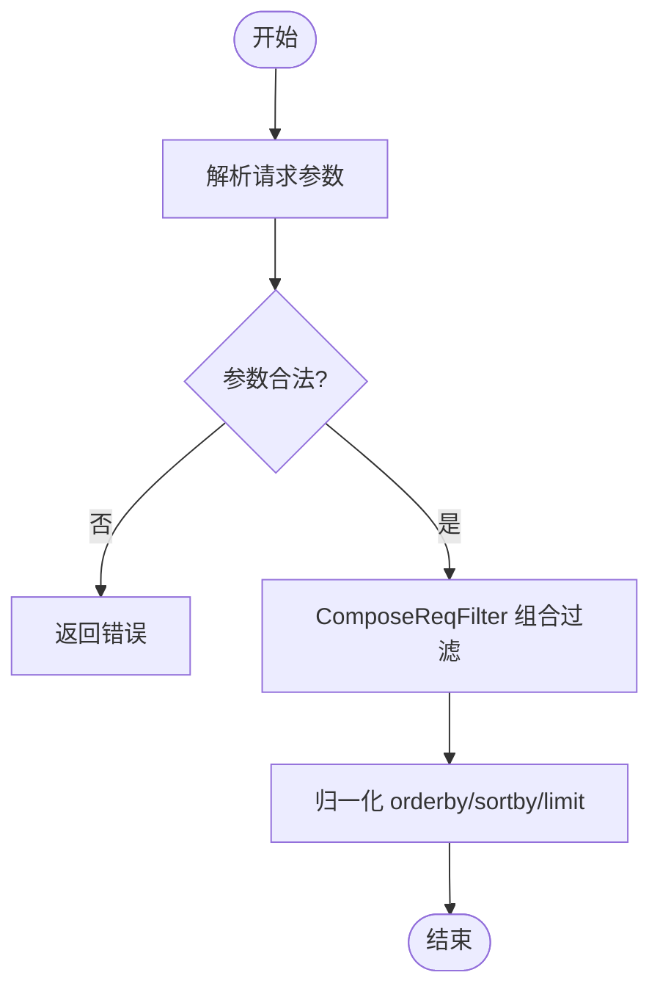
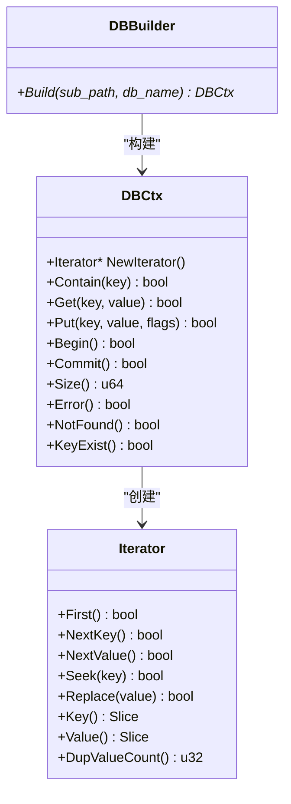
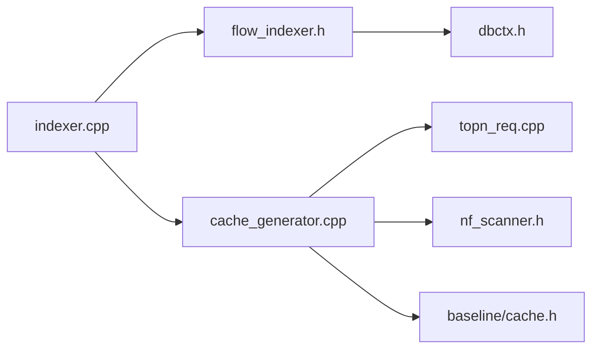

# 索引系统与查询优化

<cite>
**本文引用的文件**
- [indexer.cpp](file://ly_analyser/src/agent/indexing/indexer.cpp)
- [flow_indexer.h](file://ly_analyser/src/agent/indexing/flow_indexer.h)
- [cache_generator.h](file://ly_analyser/src/agent/indexing/cache_generator.h)
- [cache_generator.cpp](file://ly_analyser/src/agent/indexing/cache_generator.cpp)
- [topn_req.h](file://ly_analyser/src/common/topn_req.h)
- [topn_req.cpp](file://ly_analyser/src/common/topn_req.cpp)
- [nf_scanner.h](file://ly_analyser/src/agent/flow/nf_scanner.h)
- [dbctx.h](file://ly_analyser/src/agent/data/dbctx.h)
- [cache.h](file://ly_analyser/src/common/baseline/cache.h)
</cite>

## 目录
1. [简介](#简介)
2. [项目结构](#项目结构)
3. [核心组件](#核心组件)
4. [架构总览](#架构总览)
5. [详细组件分析](#详细组件分析)
6. [依赖关系分析](#依赖关系分析)
7. [性能考量](#性能考量)
8. [故障排查指南](#故障排查指南)
9. [结论](#结论)
10. [附录](#附录)

## 简介
本技术文档聚焦于流量记录的索引构建与查询优化模块，围绕以下目标展开：
- 流量记录索引构建算法、倒排索引设计与多字段索引策略
- 缓存生成器的实现原理、缓存策略与失效机制
- 查询优化技术、执行计划生成与结果集排序优化
- 索引维护、增量更新与一致性保证
- 查询性能分析方法、索引调优建议与大规模数据查询最佳实践

该模块由“流式扫描与索引构建”和“TopN 查询与缓存生成”两条主线组成，前者负责从 nfdump 格式文件中解析并聚合流量，后者基于请求参数进行过滤、分组、排序与 TopN 计算，并将结果持久化为缓存供后续快速读取。

## 项目结构
与索引与查询相关的代码主要分布在 agent 层与 common 层：
- 索引与缓存生成入口位于 indexing 目录，包含主流程编排、FlowIndexer 与 CacheGenerator
- 查询请求解析与过滤组合位于 common/topn_req.*
- 流量文件扫描与 TopN 计算位于 agent/flow/nf_scanner.*
- 数据库上下文抽象位于 agent/data/dbctx.h，用于索引/事件存储的构建
- 通用缓存接口位于 common/baseline/cache.h，提供文件与 Redis 缓存能力

图表来源
- [indexer.cpp:35-80](file://ly_analyser/src/agent/indexing/indexer.cpp#L35-L80)
- [flow_indexer.h:32-63](file://ly_analyser/src/agent/indexing/flow_indexer.h#L32-L63)
- [cache_generator.cpp:28-139](file://ly_analyser/src/agent/indexing/cache_generator.cpp#L28-L139)
- [topn_req.cpp:101-125](file://ly_analyser/src/common/topn_req.cpp#L101-L125)
- [nf_scanner.h:16-28](file://ly_analyser/src/agent/flow/nf_scanner.h#L16-L28)
- [dbctx.h:9-85](file://ly_analyser/src/agent/data/dbctx.h#L9-L85)
- [cache.h:6-12](file://ly_analyser/src/common/baseline/cache.h#L6-L12)

章节来源
- [indexer.cpp:35-80](file://ly_analyser/src/agent/indexing/indexer.cpp#L35-L80)
- [flow_indexer.h:32-63](file://ly_analyser/src/agent/indexing/flow_indexer.h#L32-L63)
- [cache_generator.cpp:28-139](file://ly_analyser/src/agent/indexing/cache_generator.cpp#L28-L139)
- [topn_req.cpp:101-125](file://ly_analyser/src/common/topn_req.cpp#L101-L125)
- [nf_scanner.h:16-28](file://ly_analyser/src/agent/flow/nf_scanner.h#L16-L28)
- [dbctx.h:9-85](file://ly_analyser/src/agent/data/dbctx.h#L9-L85)
- [cache.h:6-12](file://ly_analyser/src/common/baseline/cache.h#L6-L12)

## 核心组件
- FlowIndexer：负责遍历流量记录，应用多种检测过滤器（如 IP/端口扫描、DNS 隧道、威胁等），并通过 DBBuilder 将结果写入索引/事件存储。
- CacheGenerator：根据 INI 配置或请求参数构造 TopnReq，调用 NFScanner 对流量文件进行扫描、过滤、分组、排序与 TopN 计算，并支持设置缓存。
- NFScanner：封装流量文件扫描与 TopN 计算逻辑，对外暴露 ScanFlowFiles 与缓存版本接口。
- topn_req：统一解析命令行/URL/INI 中的查询参数，组装过滤表达式，校验并规范化请求。
- dbctx：提供键值存储的统一抽象（迭代器、事务、Put/Get），支撑索引与事件数据的持久化。
- baseline/cache：提供文件与 Redis 两种缓存后端，支持 TTL 与读写接口。

章节来源
- [flow_indexer.h:32-63](file://ly_analyser/src/agent/indexing/flow_indexer.h#L32-L63)
- [cache_generator.cpp:28-139](file://ly_analyser/src/agent/indexing/cache_generator.cpp#L28-L139)
- [nf_scanner.h:16-28](file://ly_analyser/src/agent/flow/nf_scanner.h#L16-L28)
- [topn_req.cpp:101-125](file://ly_analyser/src/common/topn_req.cpp#L101-L125)
- [dbctx.h:9-85](file://ly_analyser/src/agent/data/dbctx.h#L9-L85)
- [cache.h:6-12](file://ly_analyser/src/common/baseline/cache.h#L6-L12)

## 架构总览
整体流程分为“索引构建”和“查询缓存生成”两阶段：
- 索引构建阶段：通过 process_flow 回调逐条获取 master_record_t，FlowIndexer 将其加入 flowset_，并在完成后触发事件文件更新与索引写入。
- 查询缓存阶段：CacheGenerator 读取 INI 配置，为每个条目构造 TopnReq，调用 NFScanner.ScanFlowFiles 完成过滤、分组、排序与 TopN 计算，最终可落盘或入 Redis。

图表来源
- [indexer.cpp:35-80](file://ly_analyser/src/agent/indexing/indexer.cpp#L35-L80)
- [flow_indexer.h:32-63](file://ly_analyser/src/agent/indexing/flow_indexer.h#L32-L63)
- [cache_generator.cpp:28-139](file://ly_analyser/src/agent/indexing/cache_generator.cpp#L28-L139)
- [topn_req.cpp:101-125](file://ly_analyser/src/common/topn_req.cpp#L101-L125)
- [nf_scanner.h:16-28](file://ly_analyser/src/agent/flow/nf_scanner.h#L16-L28)
- [dbctx.h:9-85](file://ly_analyser/src/agent/data/dbctx.h#L9-L85)
- [cache.h:6-12](file://ly_analyser/src/common/baseline/cache.h#L6-L12)

## 详细组件分析

### 流量索引构建（FlowIndexer）
- 职责：接收流量记录，应用多维检测过滤器（IP/端口扫描、TCP 初始化异常、服务识别、MO/DNS 隧道、威胁情报、挖矿等），并将结果持久化到索引/事件存储。
- 数据结构：flowset_ 暂存当前批次的 master_record_t；各过滤器以 unique_ptr 管理生命周期。
- 存储抽象：通过 DBBuilder/DBCtx 提供的 Put/Iterator/事务能力，将聚合后的指标写入底层 KV 存储。
- 设计要点：
  - 过滤器链式处理，便于扩展新规则
  - 批量写入与事务提交，降低 IO 次数
  - 时间窗口与设备维度隔离，避免跨设备污染

图表来源
- [flow_indexer.h:32-63](file://ly_analyser/src/agent/indexing/flow_indexer.h#L32-L63)
- [dbctx.h:76-85](file://ly_analyser/src/agent/data/dbctx.h#L76-L85)

章节来源
- [flow_indexer.h:32-63](file://ly_analyser/src/agent/indexing/flow_indexer.h#L32-L63)
- [dbctx.h:9-85](file://ly_analyser/src/agent/data/dbctx.h#L9-L85)

### 查询与缓存生成（CacheGenerator 与 NFScanner）
- 请求组装：从 INI 配置中读取 sortby/orderby/step/limit/include/exclude/filter/ip/port/proto 等参数，调用 ComposeReqFilter 拼装过滤表达式。
- 扫描与计算：NFScanner.ScanFlowFiles 读取流量文件，按请求条件进行过滤、分组（PORT/IP/CONV/AS/PROTO/ALL）、排序（Bytes/Packets/Flows）与 TopN 计算。
- 缓存策略：当 setupcache 为真时，可将 TopnResponse 序列化后写入文件或 Redis，支持 TTL 控制。
- 关键流程：

图表来源
- [cache_generator.cpp:61-139](file://ly_analyser/src/agent/indexing/cache_generator.cpp#L61-L139)
- [topn_req.cpp:101-125](file://ly_analyser/src/common/topn_req.cpp#L101-L125)
- [nf_scanner.h:16-28](file://ly_analyser/src/agent/flow/nf_scanner.h#L16-L28)
- [cache.h:6-12](file://ly_analyser/src/common/baseline/cache.h#L6-L12)

章节来源
- [cache_generator.cpp:61-139](file://ly_analyser/src/agent/indexing/cache_generator.cpp#L61-L139)
- [topn_req.cpp:101-125](file://ly_analyser/src/common/topn_req.cpp#L101-L125)
- [nf_scanner.h:16-28](file://ly_analyser/src/agent/flow/nf_scanner.h#L16-L28)
- [cache.h:6-12](file://ly_analyser/src/common/baseline/cache.h#L6-L12)

### 请求解析与过滤组合（topn_req）
- 参数来源：命令行、URL 参数、INI 配置均可转换为 TopnReq。
- 过滤组合：将 host/proto/port 等条件与用户自定义 filter 拼接为统一表达式，便于下游扫描器高效匹配。
- 校验与归一化：限制 limit 非负、校验 srcdst 取值范围、规范化 orderby/sortby。

图表来源
- [topn_req.cpp:41-99](file://ly_analyser/src/common/topn_req.cpp#L41-L99)
- [topn_req.cpp:101-125](file://ly_analyser/src/common/topn_req.cpp#L101-L125)
- [topn_req.cpp:128-178](file://ly_analyser/src/common/topn_req.cpp#L128-L178)
- [topn_req.cpp:181-273](file://ly_analyser/src/common/topn_req.cpp#L181-L273)

章节来源
- [topn_req.cpp:41-99](file://ly_analyser/src/common/topn_req.cpp#L41-L99)
- [topn_req.cpp:101-125](file://ly_analyser/src/common/topn_req.cpp#L101-L125)
- [topn_req.cpp:128-178](file://ly_analyser/src/common/topn_req.cpp#L128-L178)
- [topn_req.cpp:181-273](file://ly_analyser/src/common/topn_req.cpp#L181-L273)

### 数据存储与索引抽象（DBCtx/DBBuilder）
- 迭代器：支持 First/NextKey/NextValue/Seek/Replace，便于范围扫描与更新。
- 事务：Begin/Commit 保障批量写入的一致性。
- 标志位：NODUPDATA/NOOVERWRITE/APPEND/APPENDDUP 控制写入行为，适配不同索引场景。
- 构建器：DBBuilder 根据 base_path 与子路径创建具体 DBCtx 实例，屏蔽底层实现差异。

图表来源
- [dbctx.h:9-85](file://ly_analyser/src/agent/data/dbctx.h#L9-L85)

章节来源
- [dbctx.h:9-85](file://ly_analyser/src/agent/data/dbctx.h#L9-L85)

## 依赖关系分析
- indexer.cpp 依赖 FlowIndexer 与 CacheGenerator，分别承担索引构建与缓存生成职责。
- CacheGenerator 依赖 topn_req 进行请求组装，依赖 NFScanner 进行扫描与 TopN 计算，依赖 baseline/cache 进行缓存持久化。
- FlowIndexer 依赖 DBBuilder/DBCtx 进行索引/事件数据写入。
- 各过滤器在 FlowIndexer 中以组合方式存在，形成可扩展的规则体系。

图表来源
- [indexer.cpp:35-80](file://ly_analyser/src/agent/indexing/indexer.cpp#L35-L80)
- [flow_indexer.h:32-63](file://ly_analyser/src/agent/indexing/flow_indexer.h#L32-L63)
- [cache_generator.cpp:28-139](file://ly_analyser/src/agent/indexing/cache_generator.cpp#L28-L139)
- [topn_req.cpp:101-125](file://ly_analyser/src/common/topn_req.cpp#L101-L125)
- [nf_scanner.h:16-28](file://ly_analyser/src/agent/flow/nf_scanner.h#L16-L28)
- [dbctx.h:9-85](file://ly_analyser/src/agent/data/dbctx.h#L9-L85)
- [cache.h:6-12](file://ly_analyser/src/common/baseline/cache.h#L6-L12)

章节来源
- [indexer.cpp:35-80](file://ly_analyser/src/agent/indexing/indexer.cpp#L35-L80)
- [flow_indexer.h:32-63](file://ly_analyser/src/agent/indexing/flow_indexer.h#L32-L63)
- [cache_generator.cpp:28-139](file://ly_analyser/src/agent/indexing/cache_generator.cpp#L28-L139)
- [topn_req.cpp:101-125](file://ly_analyser/src/common/topn_req.cpp#L101-L125)
- [nf_scanner.h:16-28](file://ly_analyser/src/agent/flow/nf_scanner.h#L16-L28)
- [dbctx.h:9-85](file://ly_analyser/src/agent/data/dbctx.h#L9-L85)
- [cache.h:6-12](file://ly_analyser/src/common/baseline/cache.h#L6-L12)

## 性能考量
- 扫描与过滤：
  - 尽量前置过滤条件（host/proto/port）以减少后续计算量
  - 合理设置 step/limit，避免不必要的海量聚合
- 分组与排序：
  - 选择高选择性字段作为分组键（如 IP/PORT/CONV），可降低中间结果规模
  - orderby 选择 Bytes/Packets/Flows 时，注意比较开销
- 缓存策略：
  - 对热点查询启用缓存，设置合适 TTL，平衡新鲜度与命中率
  - 大结果集优先落盘，小结果集可保留内存
- 写入与事务：
  - 使用 Begin/Commit 批量提交，减少磁盘同步次数
  - 利用 NOOVERWRITE/APPEND 等标志位优化写入路径

[本节为通用性能指导，不直接分析具体文件]

## 故障排查指南
- 请求参数非法：
  - 检查 filter 是否包含非法字符、srcdst 是否为 src/dst/srcdst、limit 是否非负
- 时间范围无效：
  - 确保 starttime < endtime，且 endtime 已做边界修正
- 缓存未命中：
  - 确认 setupcache 是否开启、TTL 是否过期、Redis/文件路径是否可达
- 索引写入失败：
  - 检查 DBBuilder/DBCtx 初始化、事务提交是否成功、是否存在权限问题

章节来源
- [topn_req.cpp:41-99](file://ly_analyser/src/common/topn_req.cpp#L41-L99)
- [indexer.cpp:35-80](file://ly_analyser/src/agent/indexing/indexer.cpp#L35-L80)
- [cache.h:6-12](file://ly_analyser/src/common/baseline/cache.h#L6-L12)
- [dbctx.h:9-85](file://ly_analyser/src/agent/data/dbctx.h#L9-L85)

## 结论
本模块通过 FlowIndexer 与 CacheGenerator 的配合，实现了从流量文件到索引与缓存的完整链路。借助统一的请求解析与过滤组合、灵活的分组排序与 TopN 计算、以及文件/Redis 双后端缓存，系统在高吞吐与低延迟之间取得良好平衡。结合合理的索引策略、事务写入与缓存策略，可在大规模数据场景下保持稳定的查询性能。

[本节为总结性内容，不直接分析具体文件]

## 附录

### 索引构建算法与多字段索引策略
- 倒排索引思路：
  - 以常见查询维度（如源/目的 IP、端口、协议、会话）建立倒排表，映射到记录 ID 或偏移
  - 多字段联合查询时，先选取选择性最高的字段定位候选集，再逐步缩小范围
- 多字段索引策略：
  - 单字段索引：IP、Port、Proto
  - 复合索引：Src-Dst 对、App-Proto、Service-Type
  - 时间分片：按时间窗口划分索引段，提升范围查询效率
- 增量更新：
  - 新流入流量追加至最新分片，定期合并以提升查询性能
  - 使用事务保证写入原子性，失败回滚

[本节为概念性说明，不直接分析具体文件]

### 查询优化与执行计划
- 执行计划生成：
  - 解析 TopnReq，生成过滤树，评估各谓词选择性
  - 选择最优索引访问路径（点查/范围扫描/多键合并）
- 结果集排序优化：
  - 使用堆/部分排序减少全量排序开销
  - 对 TopN 场景采用最小堆/最大堆维护前 N 项
- 缓存与预取：
  - 对高频查询结果进行缓存，支持 TTL 与失效策略
  - 预取相邻时间窗口的数据，减少冷启动开销

[本节为概念性说明，不直接分析具体文件]

### 索引维护与一致性保证
- 一致性：
  - 写入使用事务，提交前校验完整性
  - 索引与事件数据分离但关联，保证查询与审计一致性
- 维护：
  - 定期压缩与合并索引段，减少碎片
  - 清理过期分片，释放空间

[本节为概念性说明，不直接分析具体文件]

### 性能分析与调优建议
- 分析方法：
  - 统计扫描行数、过滤命中率、分组基数、排序成本
  - 监控缓存命中率、P95/P99 延迟
- 调优建议：
  - 调整 step/limit，控制结果规模
  - 选择合适的分组键与排序键
  - 针对热点查询建立专用缓存

[本节为通用指导，不直接分析具体文件]

### 大规模数据查询最佳实践
- 分区与分片：按时间与设备维度切分数据
- 并行扫描：多线程或多进程并发扫描不同文件
- 流式处理：边扫描边聚合，避免全量加载
- 缓存分层：热数据内存缓存、温数据文件缓存、冷数据离线分析

[本节为通用指导，不直接分析具体文件]