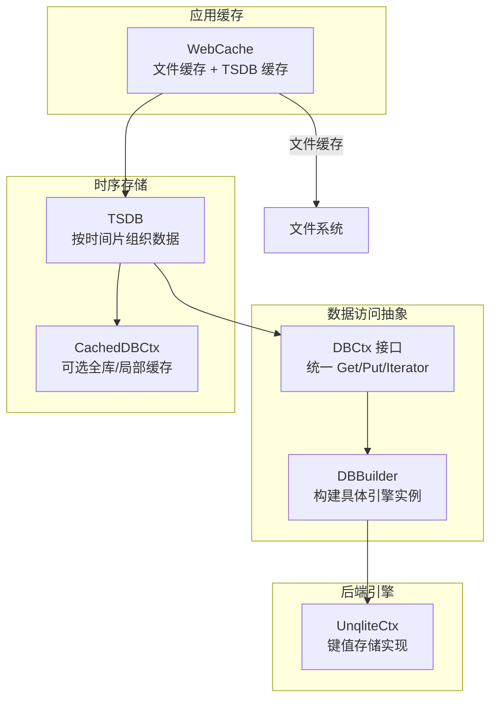
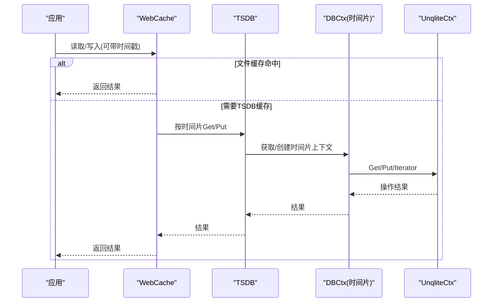
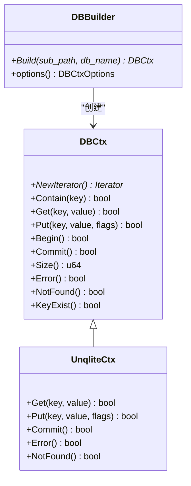
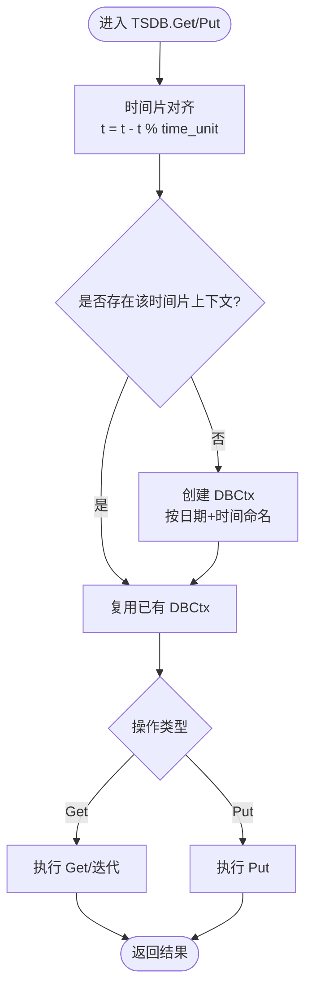
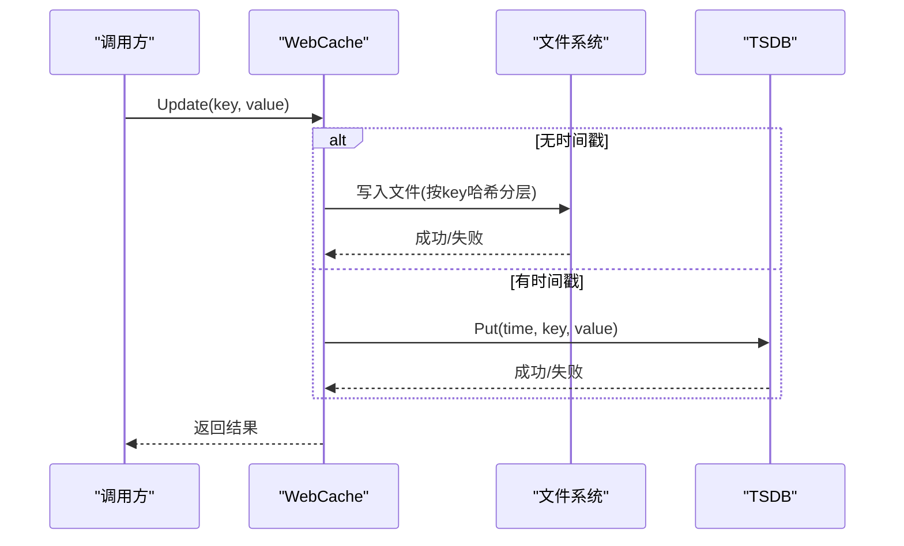
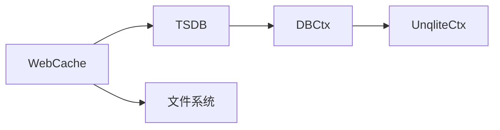

# 性能优化策略

<cite>
**本文引用的文件**
- [dbctx.h](file://ly_analyser/src/agent/data/dbctx.h)
- [dbctx.cpp](file://ly_analyser/src/agent/data/dbctx.cpp)
- [tsdb.h](file://ly_analyser/src/agent/data/tsdb.h)
- [tsdb.cpp](file://ly_analyser/src/agent/data/tsdb.cpp)
- [web_cache.h](file://ly_analyser/src/agent/data/web_cache.h)
- [web_cache.cpp](file://ly_analyser/src/agent/data/web_cache.cpp)
- [unqlite_db.h](file://ly_analyser/src/agent/data/unqlite_db.h)
- [unqlite_db.cpp](file://ly_analyser/src/agent/data/unqlite_db.cpp)
- [assetSrvType.json](file://ly_vis/packages/std/public/asset-config/assetSrvType.json)
</cite>

## 目录
1. [简介](#简介)
2. [项目结构](#项目结构)
3. [核心组件](#核心组件)
4. [架构总览](#架构总览)
5. [详细组件分析](#详细组件分析)
6. [依赖关系分析](#依赖关系分析)
7. [性能考量](#性能考量)
8. [故障排查指南](#故障排查指南)
9. [结论](#结论)
10. [附录](#附录)

## 简介
本技术文档面向数据库与存储层性能优化，结合仓库中时间序列缓存、键值存储抽象与实现，系统性地阐述：
- MariaDB 等关系型数据库的性能调优参数与配置建议（通用实践）
- 查询优化技巧与慢查询分析方法
- 连接池配置与资源管理策略
- 缓存机制设计与实现方案（基于仓库中的 WebCache/TSDB/UnqliteCtx）
- 分库分表架构设计与实施步骤
- 大数据量下的查询优化与分页策略
- 性能监控指标与告警配置
- 内存管理与磁盘 IO 优化方案
- 压力测试与容量规划方法

## 项目结构
本项目在 analyser 模块中实现了统一的数据库上下文抽象 DBCtx，并提供了基于 Unqlite 的键值存储实现；在此基础上构建了按时间片切分的 TSDB 以及面向 Web 场景的 WebCache。可视化层包含对数据库服务类型的识别配置。

图表来源
- [dbctx.h:9-85](file://ly_analyser/src/agent/data/dbctx.h#L9-L85)
- [dbctx.cpp:9-39](file://ly_analyser/src/agent/data/dbctx.cpp#L9-L39)
- [tsdb.h:11-76](file://ly_analyser/src/agent/data/tsdb.h#L11-L76)
- [tsdb.cpp:61-73](file://ly_analyser/src/agent/data/tsdb.cpp#L61-L73)
- [web_cache.h:15-53](file://ly_analyser/src/agent/data/web_cache.h#L15-L53)
- [web_cache.cpp:82-102](file://ly_analyser/src/agent/data/web_cache.cpp#L82-L102)
- [unqlite_db.h:11-36](file://ly_analyser/src/agent/data/unqlite_db.h#L11-L36)

章节来源
- [dbctx.h:9-85](file://ly_analyser/src/agent/data/dbctx.h#L9-L85)
- [dbctx.cpp:9-39](file://ly_analyser/src/agent/data/dbctx.cpp#L9-L39)
- [tsdb.h:11-76](file://ly_analyser/src/agent/data/tsdb.h#L11-L76)
- [tsdb.cpp:61-73](file://ly_analyser/src/agent/data/tsdb.cpp#L61-L73)
- [web_cache.h:15-53](file://ly_analyser/src/agent/data/web_cache.h#L15-L53)
- [web_cache.cpp:82-102](file://ly_analyser/src/agent/data/web_cache.cpp#L82-L102)
- [unqlite_db.h:11-36](file://ly_analyser/src/agent/data/unqlite_db.h#L11-L36)

## 核心组件
- DBCtx：定义统一的键值存取、迭代器、事务边界与错误状态语义，屏蔽底层引擎差异。
- DBBuilder：根据配置选择并创建具体引擎实例（当前启用 Unqlite），负责路径与命名策略。
- TSDB：以时间片为单位组织数据，提供按时间范围扫描、统计与过滤能力，内部维护每时间片的 DBCtx 及可选缓存。
- WebCache：面向 Web 场景的缓存层，支持无时间戳的文件级缓存与带时间戳的 TSDB 缓存，并对大条目进行限制。
- UnqliteCtx：基于 Unqlite 的键值存储实现，提供 Get/Put/Iterator/Commit 等操作。

章节来源
- [dbctx.h:9-85](file://ly_analyser/src/agent/data/dbctx.h#L9-L85)
- [dbctx.cpp:9-39](file://ly_analyser/src/agent/data/dbctx.cpp#L9-L39)
- [tsdb.h:11-76](file://ly_analyser/src/agent/data/tsdb.h#L11-L76)
- [tsdb.cpp:11-73](file://ly_analyser/src/agent/data/tsdb.cpp#L11-L73)
- [web_cache.h:15-53](file://ly_analyser/src/agent/data/web_cache.h#L15-L53)
- [web_cache.cpp:82-102](file://ly_analyser/src/agent/data/web_cache.cpp#L82-L102)
- [unqlite_db.h:11-36](file://ly_analyser/src/agent/data/unqlite_db.h#L11-L36)

## 架构总览
下图展示了从应用到存储的完整调用链：Web 请求经 WebCache 命中或回源，TSDB 按时间片路由至对应 DBCtx，最终由 UnqliteCtx 完成持久化。

图表来源
- [web_cache.cpp:82-102](file://ly_analyser/src/agent/data/web_cache.cpp#L82-L102)
- [tsdb.cpp:61-73](file://ly_analyser/src/agent/data/tsdb.cpp#L61-L73)
- [unqlite_db.cpp:158-172](file://ly_analyser/src/agent/data/unqlite_db.cpp#L158-L172)

## 详细组件分析

### 组件A：DBCtx 与 DBBuilder
- 职责：统一键值存储接口与引擎构建；支持枚举状态与标志位；提供迭代器用于范围扫描。
- 关键点：
  - 通过 DBBuilder 依据 engine 类型创建具体实现（当前使用 Unqlite）。
  - 构建时自动创建子目录并设置 db_path/db_name，便于多租户/多业务隔离。
  - Begin/Commit 用于事务边界控制（不同引擎行为可能不同）。

图表来源
- [dbctx.h:9-85](file://ly_analyser/src/agent/data/dbctx.h#L9-L85)
- [dbctx.cpp:9-39](file://ly_analyser/src/agent/data/dbctx.cpp#L9-L39)
- [unqlite_db.h:11-36](file://ly_analyser/src/agent/data/unqlite_db.h#L11-L36)

章节来源
- [dbctx.h:9-85](file://ly_analyser/src/agent/data/dbctx.h#L9-L85)
- [dbctx.cpp:9-39](file://ly_analyser/src/agent/data/dbctx.cpp#L9-L39)
- [unqlite_db.h:11-36](file://ly_analyser/src/agent/data/unqlite_db.h#L11-L36)

### 组件B：TSDB 与 CachedDBCtx
- 职责：按时间片组织 KV 数据，提供范围扫描、计数、过滤；为每个时间片维护一个 DBCtx，并支持可选的全库/局部缓存。
- 关键点：
  - 时间片对齐：starttime/endtime 按 time_unit 取整，避免漏读。
  - 懒加载：首次访问某时间片才创建 DBCtx，降低冷数据开销。
  - 缓存策略：可选择将整库内容预加载到内存 map，或在 Get 时按需缓存。

图表来源
- [tsdb.cpp:61-73](file://ly_analyser/src/agent/data/tsdb.cpp#L61-L73)
- [tsdb.cpp:122-139](file://ly_analyser/src/agent/data/tsdb.cpp#L122-L139)
- [tsdb.cpp:150-168](file://ly_analyser/src/agent/data/tsdb.cpp#L150-L168)

章节来源
- [tsdb.h:11-76](file://ly_analyser/src/agent/data/tsdb.h#L11-L76)
- [tsdb.cpp:11-73](file://ly_analyser/src/agent/data/tsdb.cpp#L11-L73)
- [tsdb.cpp:122-168](file://ly_analyser/src/agent/data/tsdb.cpp#L122-L168)

### 组件C：WebCache（文件缓存 + TSDB 缓存）
- 职责：对外提供统一缓存 API，支持无时间戳的文件缓存与带时间戳的 TSDB 缓存；对超大条目进行限制。
- 关键点：
  - 文件缓存：按 SHA256(key) 生成两级目录，落盘存储，适合静态或低频更新数据。
  - TSDB 缓存：通过 TSDB 按时间维度存取，适合时序热点数据。
  - 大小限制：超过阈值的条目直接拒绝写入，避免单条过大影响性能。

图表来源
- [web_cache.cpp:25-53](file://ly_analyser/src/agent/data/web_cache.cpp#L25-L53)
- [web_cache.cpp:82-102](file://ly_analyser/src/agent/data/web_cache.cpp#L82-L102)
- [web_cache.cpp:129-160](file://ly_analyser/src/agent/data/web_cache.cpp#L129-L160)

章节来源
- [web_cache.h:15-53](file://ly_analyser/src/agent/data/web_cache.h#L15-L53)
- [web_cache.cpp:25-53](file://ly_analyser/src/agent/data/web_cache.cpp#L25-L53)
- [web_cache.cpp:82-102](file://ly_analyser/src/agent/data/web_cache.cpp#L82-L102)
- [web_cache.cpp:129-160](file://ly_analyser/src/agent/data/web_cache.cpp#L129-L160)

### 组件D：UnqliteCtx（键值存储实现）
- 职责：封装 Unqlite 的打开、读写、游标遍历、提交与错误处理。
- 关键点：
  - 只读/创建模式：根据 read_only 标志决定打开方式。
  - 游标迭代：First/NextKey/Seek/Replace 等，配合 TSDB 的范围扫描。
  - 错误语义：统一 Error/NotFound/Commit 返回，便于上层判断。

章节来源
- [unqlite_db.h:11-36](file://ly_analyser/src/agent/data/unqlite_db.h#L11-L36)
- [unqlite_db.cpp:123-187](file://ly_analyser/src/agent/data/unqlite_db.cpp#L123-L187)

## 依赖关系分析
- 耦合度：
  - WebCache 依赖 TSDB 与文件系统，TSDB 依赖 DBCtx 抽象，DBCtx 由 DBBuilder 创建具体实现（UnqliteCtx）。
  - 低耦合高内聚：TSDB 不感知底层引擎细节；WebCache 不关心时间片划分。
- 外部依赖：
  - Unqlite：轻量嵌入式 KV 存储，适合本地时序缓存与热点数据。
  - 文件系统：作为 WebCache 的二级持久化介质。
- 潜在循环依赖：无。

图表来源
- [web_cache.h:15-53](file://ly_analyser/src/agent/data/web_cache.h#L15-L53)
- [tsdb.h:11-76](file://ly_analyser/src/agent/data/tsdb.h#L11-L76)
- [dbctx.h:9-85](file://ly_analyser/src/agent/data/dbctx.h#L9-L85)
- [unqlite_db.h:11-36](file://ly_analyser/src/agent/data/unqlite_db.h#L11-L36)

章节来源
- [web_cache.h:15-53](file://ly_analyser/src/agent/data/web_cache.h#L15-L53)
- [tsdb.h:11-76](file://ly_analyser/src/agent/data/tsdb.h#L11-L76)
- [dbctx.h:9-85](file://ly_analyser/src/agent/data/dbctx.h#L9-L85)
- [unqlite_db.h:11-36](file://ly_analyser/src/agent/data/unqlite_db.h#L11-L36)

## 性能考量
- 查询优化技巧
  - 利用 TSDB 的时间片对齐与范围扫描，减少跨时间片的全表扫描。
  - 使用迭代器与过滤器组合，仅在需要的键空间内计算 Size/聚合。
  - 对高频读取采用 WebCache 文件缓存或 TSDB 缓存，降低重复 IO。
- 慢查询分析方法
  - 在 TSDB::Scan 中注入自定义 FilterFunctor，定位热点键与异常数据分布。
  - 记录关键路径耗时（如 Get/Put/Iterator 调用），结合日志定位瓶颈。
- 连接池与资源管理
  - 当前实现以进程内 DBCtx 为主，未显式连接池；可按时间片粒度复用 DBCtx，避免频繁打开/关闭。
  - 对大对象写入进行大小限制，防止单条过大导致内存抖动。
- 缓存机制设计
  - 文件缓存适合静态/低频更新数据；TSDB 缓存适合时序热点数据。
  - 可通过 CachedDBCtx 的 cache_enabled/cache_whole_db_ 开关灵活调整缓存策略。
- 分库分表策略
  - 以“日期+时间”作为物理分片键，天然实现按时间维度的水平拆分，利于冷热分离与归档。
- 大数据量分页
  - 使用迭代器的 NextKey 进行流式分页，避免一次性加载全部数据。
  - 结合时间窗口缩小扫描范围，提升分页效率。
- 监控指标与告警
  - 建议采集：缓存命中率、TSDB 各时间片大小、迭代次数、错误率、IO 吞吐与延迟。
  - 告警阈值：命中率低于基线、错误率突增、单时间片大小异常增长。
- 内存与磁盘 IO
  - 合理设置 time_unit，平衡时间片数量与单片大小。
  - 文件缓存采用两级目录，避免单目录文件过多导致的文件系统性能退化。
- 压力测试与容量规划
  - 以典型时间窗口与键空间构造压测用例，评估 Get/Put/Scan 的吞吐与延迟。
  - 根据历史增长趋势规划磁盘容量与时间片保留策略。

[本节为通用指导，无需特定文件引用]

## 故障排查指南
- 常见错误
  - 打开/创建数据库失败：检查路径权限与 read_only 标志。
  - 游标初始化失败：确认底层引擎可用性与句柄释放。
  - 写入失败：检查是否只读模式或磁盘空间不足。
- 诊断手段
  - 开启 DEBUG 日志，观察缓存命中与落盘路径。
  - 使用迭代器遍历验证数据一致性与完整性。
  - 针对异常时间片单独采样，缩小问题范围。

章节来源
- [unqlite_db.cpp:130-146](file://ly_analyser/src/agent/data/unqlite_db.cpp#L130-L146)
- [unqlite_db.cpp:148-156](file://ly_analyser/src/agent/data/unqlite_db.cpp#L148-L156)
- [unqlite_db.cpp:174-185](file://ly_analyser/src/agent/data/unqlite_db.cpp#L174-L185)

## 结论
本仓库通过 DBCtx 抽象、TSDB 时间片组织与 WebCache 多级缓存，形成了高效、可扩展的本地时序数据存储方案。结合合理的查询与缓存策略、严格的资源与大小限制，可在大数据量场景下获得稳定性能。对于 MariaDB 等外部数据库，可借鉴本项目的分片与缓存思想，配合连接池与索引优化，进一步提升整体性能。

[本节为总结性内容，无需特定文件引用]

## 附录
- MariaDB 性能调优要点（通用实践）
  - 缓冲与内存：合理设置 innodb_buffer_pool_size、innodb_log_file_size、query_cache_*（视版本而定）。
  - 连接与并发：max_connections、thread_cache_size、innodb_thread_concurrency。
  - 磁盘与IO：innodb_io_capacity、innodb_flush_method、redo log 与 checkpoint 频率。
  - 索引与查询：覆盖索引、前缀索引、避免函数/隐式转换、使用 EXPLAIN 分析执行计划。
  - 慢查询：开启 slow_query_log，定期分析 top N 慢查询，针对性优化。
  - 连接池：应用侧使用连接池（如 HikariCP），控制最大连接数与空闲回收。
  - 缓存：引入 Redis/Memcached 缓存热点查询结果，注意一致性策略。
  - 分库分表：按时间/租户/地域拆分，结合中间件（如 ShardingSphere）或自研路由。
  - 监控告警：QPS、延迟、锁等待、缓冲池命中率、磁盘 IO、复制延迟等。
  - 容量规划：基于增长曲线预留冗余，制定归档与清理策略。
  - 压测：使用 sysbench/tpcc 等工具模拟真实负载，评估扩容需求。

[本节为通用指导，无需特定文件引用]