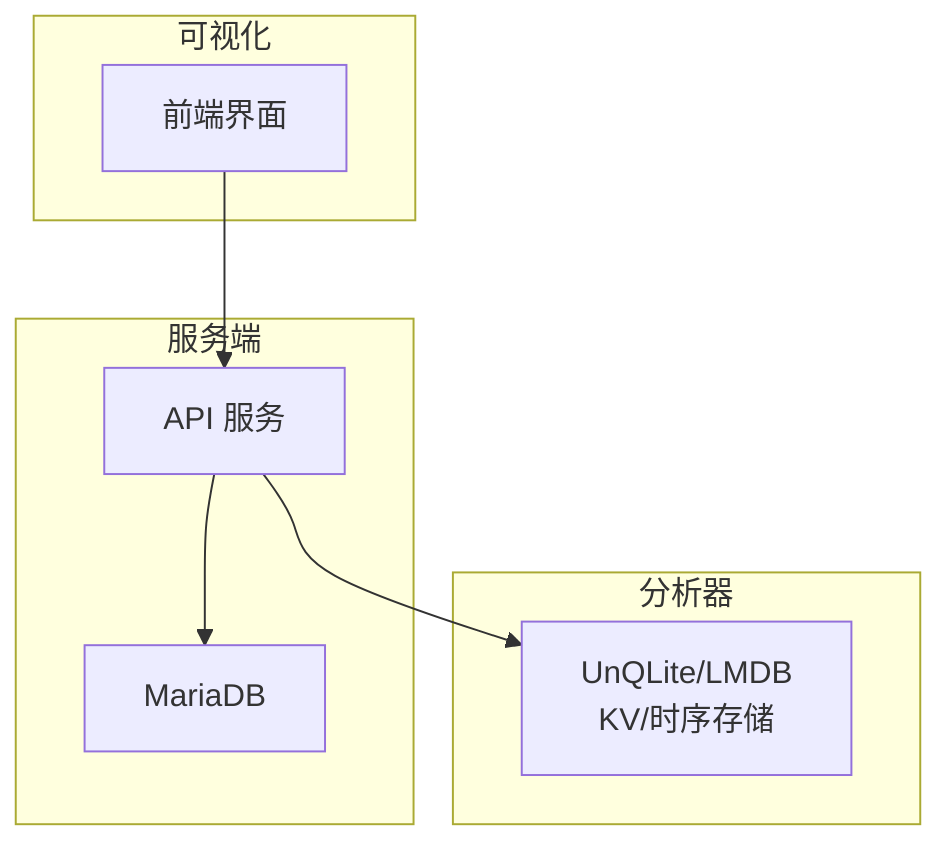
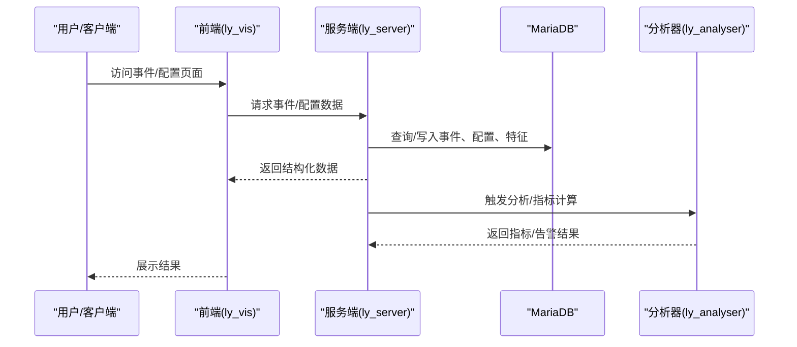
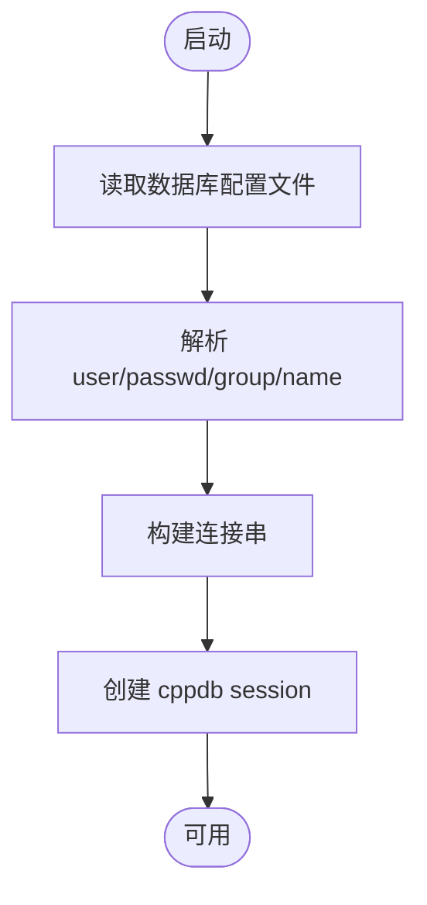
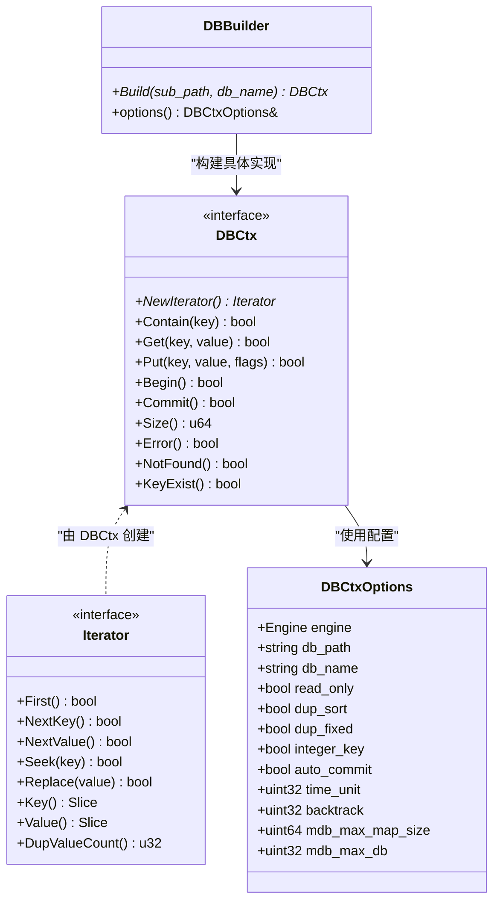
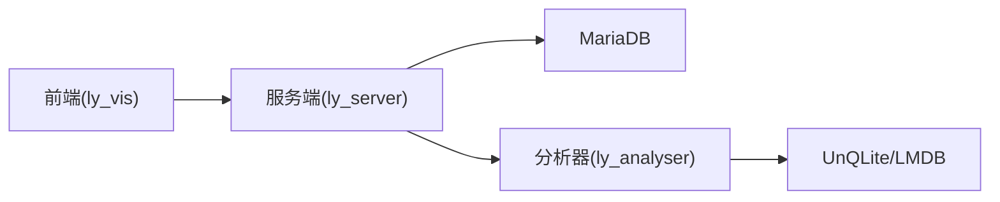
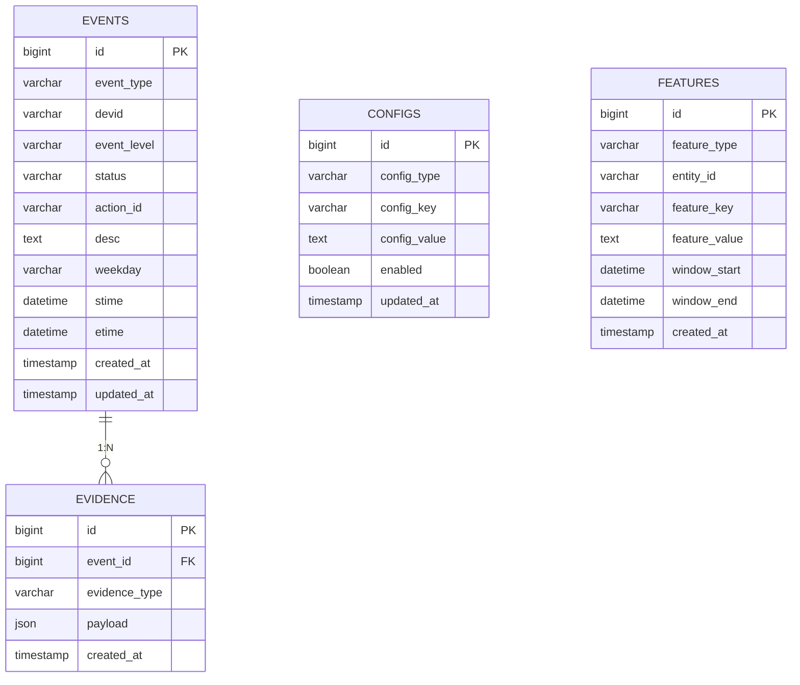

# 数据库表结构

<cite>
**本文引用的文件**
- [dbc.cpp](file://ly_server/src/server/dbc.cpp)
- [dbc.h](file://ly_server/src/server/dbc.h)
- [dbctx.proto](file://ly_analyser/src/agent/data/dbctx.proto)
- [dbctx.h](file://ly_analyser/src/agent/data/dbctx.h)
- [dbctx.cpp](file://ly_analyser/src/agent/data/dbctx.cpp)
- [event-config.js](file://ly_vis/packages/components/system/event-system/config/public/event-config.js)
</cite>

## 目录
1. [简介](#简介)
2. [项目结构](#项目结构)
3. [核心组件](#核心组件)
4. [架构总览](#架构总览)
5. [详细组件分析](#详细组件分析)
6. [依赖关系分析](#依赖关系分析)
7. [性能考虑](#性能考虑)
8. [故障排查指南](#故障排查指南)
9. [结论](#结论)
10. [附录：DDL 与表结构图（参考）](#附录ddl-与表结构图参考)

## 简介
本技术文档聚焦于 MariaDB 数据库的表结构设计，覆盖事件表、配置表、特征表等核心表的字段定义、数据类型、约束与默认值、主外键设计、命名规范、数据验证规则与业务约束实现方式。同时提供 DDL 示例与表结构图，帮助读者快速理解并落地实施。

说明：
- 服务端通过 cppdb 连接 MySQL/MariaDB，用于持久化配置、事件、证据、特征等数据。
- 分析器侧使用 UnQLite/LMDB 等嵌入式存储进行高速缓存与索引，不替代 MariaDB 的主数据表。
- 前端 UI 中可见的事件配置字段可作为事件相关表字段设计的参考依据。

## 项目结构
- 服务端（ly_server）：负责与 MariaDB 交互，提供事件、配置、特征等数据的增删改查能力。
- 分析器（ly_analyser）：负责流量分析与指标计算，使用本地 KV/时序存储加速查询与聚合。
- 可视化（ly_vis）：前端展示与配置管理，包含事件配置表单字段定义，可映射到后端表字段。

图表来源
- [dbc.cpp:1-27](file://ly_server/src/server/dbc.cpp#L1-L27)
- [dbctx.proto:1-29](file://ly_analyser/src/agent/data/dbctx.proto#L1-L29)

章节来源
- [dbc.cpp:1-27](file://ly_server/src/server/dbc.cpp#L1-L27)
- [dbc.h:1-15](file://ly_server/src/server/dbc.h#L1-L15)
- [dbctx.proto:1-29](file://ly_analyser/src/agent/data/dbctx.proto#L1-L29)

## 核心组件
- 数据库会话管理：封装 MariaDB 连接参数与初始化流程，统一获取数据库会话。
- 分析器存储抽象：提供统一的 KV/时序存储接口，支持多种引擎（如 UnQLite、LMDB）。
- 事件配置模型：前端事件配置字段定义，反映事件相关表的核心字段集合。

章节来源
- [dbc.cpp:1-27](file://ly_server/src/server/dbc.cpp#L1-L27)
- [dbctx.h:1-88](file://ly_analyser/src/agent/data/dbctx.h#L1-L88)
- [event-config.js:69-107](file://ly_vis/packages/components/system/event-system/config/public/event-config.js#L69-L107)

## 架构总览
下图展示了从前端到服务端再到 MariaDB 的数据流，以及分析器侧的本地存储协同。

图表来源
- [dbc.cpp:1-27](file://ly_server/src/server/dbc.cpp#L1-L27)
- [dbctx.cpp:1-40](file://ly_analyser/src/agent/data/dbctx.cpp#L1-L40)

## 详细组件分析

### 数据库会话与连接（MariaDB）
- 功能：读取配置文件中的用户名、密码、数据库名与组信息，构造 MySQL/MariaDB 连接字符串并创建会话。
- 关键点：
  - 通过常量或配置文件注入数据库凭据。
  - 使用 cppdb 作为数据库驱动封装。
  - 建议在生产环境使用环境变量或密钥管理服务注入敏感信息。

图表来源
- [dbc.cpp:1-27](file://ly_server/src/server/dbc.cpp#L1-L27)

章节来源
- [dbc.cpp:1-27](file://ly_server/src/server/dbc.cpp#L1-L27)
- [dbc.h:1-15](file://ly_server/src/server/dbc.h#L1-L15)

### 分析器存储抽象（UnQLite/LMDB）
- 功能：为分析器提供统一的 KV/时序存储接口，支持多引擎切换、迭代器、事务、时间对齐与回溯等。
- 关键设计：
  - 引擎枚举：LMDB、HAMSTERDB、LEVELDB、BDB、KYOTOTREEDB、UNQLITEDB、SSDB。
  - 选项：路径、名称、只读、重复值排序/固定、整数键、自动提交、时间单位、回溯步数、最大映射大小、最大 DB 数量。
  - 构建器：按子路径与库名创建具体存储实例，并在调试模式下记录打开结果。

图表来源
- [dbctx.proto:1-29](file://ly_analyser/src/agent/data/dbctx.proto#L1-L29)
- [dbctx.h:1-88](file://ly_analyser/src/agent/data/dbctx.h#L1-L88)
- [dbctx.cpp:1-40](file://ly_analyser/src/agent/data/dbctx.cpp#L1-L40)

章节来源
- [dbctx.proto:1-29](file://ly_analyser/src/agent/data/dbctx.proto#L1-L29)
- [dbctx.h:1-88](file://ly_analyser/src/agent/data/dbctx.h#L1-L88)
- [dbctx.cpp:1-40](file://ly_analyser/src/agent/data/dbctx.cpp#L1-L40)

### 事件配置字段映射（前端 -> 事件表）
- 前端事件配置项包含：数据源、事件级别、状态、行动、描述、监控星期、开始时间、结束时间等。
- 这些字段可直接映射到事件表的核心列，便于前端表单与后端表结构保持一致。

章节来源
- [event-config.js:69-107](file://ly_vis/packages/components/system/event-system/config/public/event-config.js#L69-L107)

## 依赖关系分析
- 服务端依赖 cppdb 与 MariaDB，负责配置、事件、证据、特征等数据的持久化。
- 分析器依赖 UnQLite/LMDB 等嵌入式存储，用于高频读写与聚合计算。
- 前端依赖事件配置定义，确保 UI 与后端字段一致。

图表来源
- [dbc.cpp:1-27](file://ly_server/src/server/dbc.cpp#L1-L27)
- [dbctx.proto:1-29](file://ly_analyser/src/agent/data/dbctx.proto#L1-L29)

章节来源
- [dbc.cpp:1-27](file://ly_server/src/server/dbc.cpp#L1-L27)
- [dbctx.proto:1-29](file://ly_analyser/src/agent/data/dbctx.proto#L1-L29)

## 性能考虑
- 连接池与会话复用：建议在服务端启用连接池，减少频繁建连开销。
- 索引策略：对事件表的时间戳、事件类型、设备 ID、IP 等常用查询列建立复合索引。
- 分区与归档：按时间对事件表进行分区，历史数据归档至冷存储。
- 分析器侧优化：利用 UnQLite/LMDB 的整数键、重复值排序与时间对齐特性，提升扫描与聚合性能。
- 事务与批量写入：在导入或批量更新时开启事务，减少磁盘 IO 次数。

## 故障排查指南
- 连接失败：检查数据库配置文件中的用户名、密码、数据库名与组是否正确；确认网络可达与权限。
- 查询超时：检查慢查询日志，优化 SQL 与索引；必要时拆分大查询。
- 写入失败：检查事务边界与唯一约束冲突；核对字段长度与类型是否匹配。
- 分析器错误：查看构建存储时的日志输出，确认引擎选择与路径权限正确。

章节来源
- [dbc.cpp:1-27](file://ly_server/src/server/dbc.cpp#L1-L27)
- [dbctx.cpp:1-40](file://ly_analyser/src/agent/data/dbctx.cpp#L1-L40)

## 结论
本项目采用“服务端 + MariaDB”作为主数据存储，“分析器 + 嵌入式存储”作为高性能计算与缓存层，形成清晰的分层架构。通过统一的数据模型与字段映射，前后端一致性得到保障。建议在后续迭代中完善索引、分区与监控告警，进一步提升系统稳定性与可维护性。

## 附录：DDL 与表结构图（参考）
以下为基于代码与前端字段推导出的 MariaDB 表结构参考。实际部署请以最终评审通过的 DDL 为准。

- 事件表（events）
  - 字段：id(主键), event_type, devid, event_level, status, action_id, desc, weekday, stime, etime, created_at, updated_at
  - 说明：event_type/devid/event_level/status/action_id/desc/weekday/stime/etime 来自前端事件配置字段；created_at/updated_at 用于审计与追踪。
  - 索引：idx_event_time(event_type, stime)、idx_devid(devid)、idx_status(status)。

- 配置表（configs）
  - 字段：id(主键), config_type, config_key, config_value, enabled, updated_at
  - 说明：用于存储系统级配置与开关；config_type 区分不同配置域。

- 特征表（features）
  - 字段：id(主键), feature_type, entity_id, feature_key, feature_value, window_start, window_end, created_at
  - 说明：entity_id 关联资产或设备；feature_key/value 表示特征维度与值；window_* 表示统计窗口。

- 证据表（evidence）
  - 字段：id(主键), event_id, evidence_type, payload, created_at
  - 说明：payload 以 JSON 存储原始证据；event_id 外键关联事件表。

图表来源
- [event-config.js:69-107](file://ly_vis/packages/components/system/event-system/config/public/event-config.js#L69-L107)

章节来源
- [event-config.js:69-107](file://ly_vis/packages/components/system/event-system/config/public/event-config.js#L69-L107)