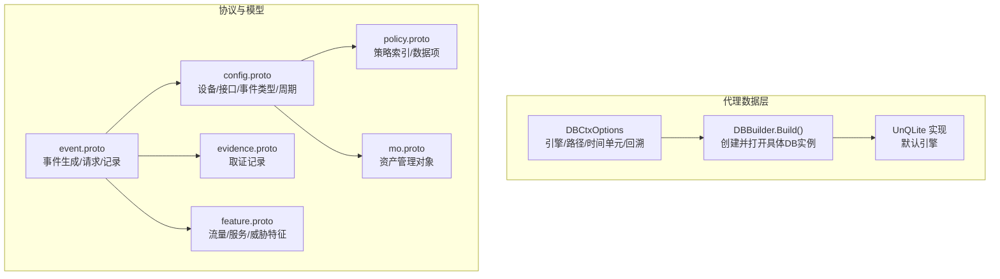
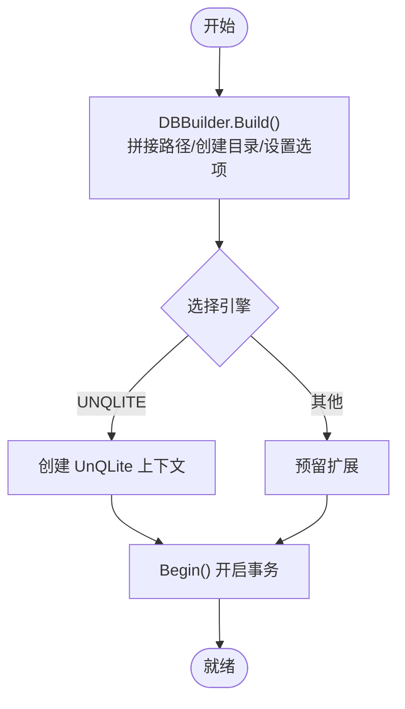
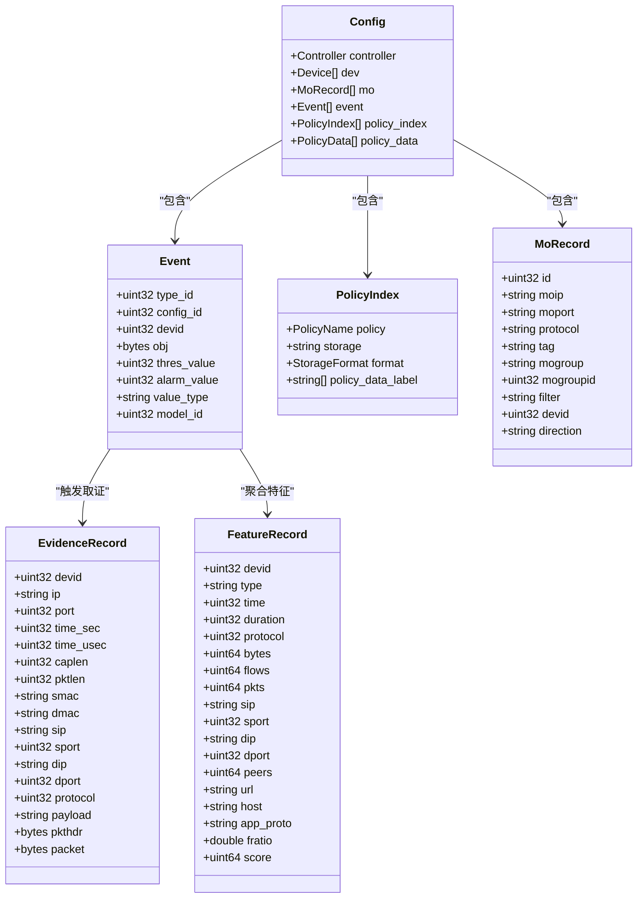
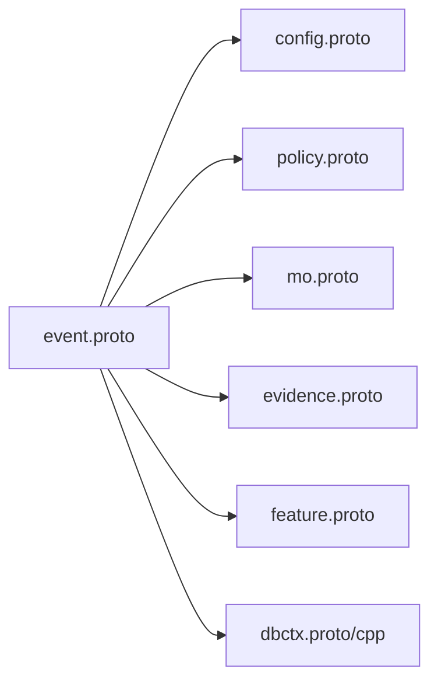
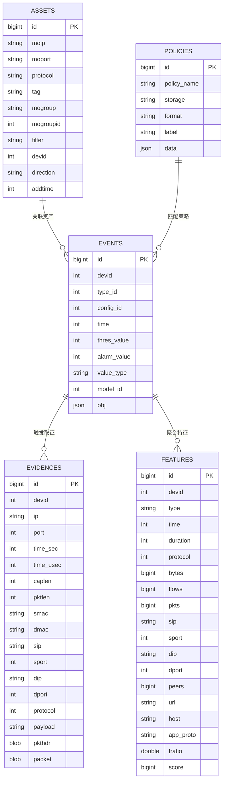

# 数据库设计

<cite>
**本文引用的文件**
- [ly_analyser/src/agent/data/dbctx.proto](file://ly_analyser/src/agent/data/dbctx.proto)
- [ly_analyser/src/agent/data/dbctx.h](file://ly_analyser/src/agent/data/dbctx.h)
- [ly_analyser/src/agent/data/dbctx.cpp](file://ly_analyser/src/agent/data/dbctx.cpp)
- [ly_analyser/src/common/event.proto](file://ly_analyser/src/common/event.proto)
- [ly_analyser/src/common/config.proto](file://ly_analyser/src/common/config.proto)
- [ly_analyser/src/common/policy.proto](file://ly_analyser/src/common/policy.proto)
- [ly_analyser/src/common/mo.proto](file://ly_analyser/src/common/mo.proto)
- [ly_analyser/src/common/evidence.proto](file://ly_analyser/src/common/evidence.proto)
- [ly_analyser/src/common/feature.proto](file://ly_analyser/src/common/feature.proto)
</cite>

## 目录
1. [简介](#简介)
2. [项目结构](#项目结构)
3. [核心组件](#核心组件)
4. [架构总览](#架构总览)
5. [详细组件分析](#详细组件分析)
6. [依赖关系分析](#依赖关系分析)
7. [性能考虑](#性能考虑)
8. [故障排查指南](#故障排查指南)
9. [结论](#结论)
10. [附录](#附录)

## 简介
本技术文档围绕本项目中“数据库与数据模型”的设计与实践，重点说明：
- 键值存储上下文（DBCtx）的抽象、配置与实现选择（默认使用 UnQLite），以及时间序列对齐与回溯策略。
- Protocol Buffers 数据结构定义与使用方式，覆盖事件、资产对象（MO）、策略、取证、特征等关键领域。
- 实体关系模型、主外键约束与索引策略的建议方案（基于现有字段推导）。
- 数据迁移、备份恢复策略与性能调优建议。
- SQL 查询示例与最佳实践（面向 MariaDB 的通用规范）。
- 数据安全、访问控制与审计日志记录建议。
- 大数据量下的分库分表方案与查询优化技巧。

## 项目结构
本项目在 ly_analyser 模块中包含与数据存储和协议相关的关键代码：
- 数据上下文与引擎选择：dbctx.proto、dbctx.h、dbctx.cpp
- 领域协议定义：event.proto、config.proto、policy.proto、mo.proto、evidence.proto、feature.proto



图表来源
- [ly_analyser/src/agent/data/dbctx.proto:1-29](file://ly_analyser/src/agent/data/dbctx.proto#L1-L29)
- [ly_analyser/src/agent/data/dbctx.cpp:9-39](file://ly_analyser/src/agent/data/dbctx.cpp#L9-L39)
- [ly_analyser/src/common/event.proto:1-47](file://ly_analyser/src/common/event.proto#L1-L47)
- [ly_analyser/src/common/config.proto:1-130](file://ly_analyser/src/common/config.proto#L1-L130)
- [ly_analyser/src/common/policy.proto:1-60](file://ly_analyser/src/common/policy.proto#L1-L60)
- [ly_analyser/src/common/mo.proto:1-47](file://ly_analyser/src/common/mo.proto#L1-L47)
- [ly_analyser/src/common/evidence.proto:1-42](file://ly_analyser/src/common/evidence.proto#L1-L42)
- [ly_analyser/src/common/feature.proto:1-132](file://ly_analyser/src/common/feature.proto#L1-L132)

章节来源
- [ly_analyser/src/agent/data/dbctx.proto:1-29](file://ly_analyser/src/agent/data/dbctx.proto#L1-L29)
- [ly_analyser/src/agent/data/dbctx.h:9-85](file://ly_analyser/src/agent/data/dbctx.h#L9-L85)
- [ly_analyser/src/agent/data/dbctx.cpp:9-39](file://ly_analyser/src/agent/data/dbctx.cpp#L9-L39)
- [ly_analyser/src/common/event.proto:1-47](file://ly_analyser/src/common/event.proto#L1-L47)
- [ly_analyser/src/common/config.proto:1-130](file://ly_analyser/src/common/config.proto#L1-L130)
- [ly_analyser/src/common/policy.proto:1-60](file://ly_analyser/src/common/policy.proto#L1-L60)
- [ly_analyser/src/common/mo.proto:1-47](file://ly_analyser/src/common/mo.proto#L1-L47)
- [ly_analyser/src/common/evidence.proto:1-42](file://ly_analyser/src/common/evidence.proto#L1-L42)
- [ly_analyser/src/common/feature.proto:1-132](file://ly_analyser/src/common/feature.proto#L1-L132)

## 核心组件
- 数据上下文与引擎
  - DBCtxOptions：定义存储引擎、路径、只读模式、重复键排序、固定长度键、整数键、自动提交、时间单元与回溯限制、LMDB映射大小、最大DB数量等。
  - DBBuilder.Build：根据选项构建子路径与数据库名，创建目录，按引擎初始化并开启事务。
  - DBCtx 抽象：统一迭代器、包含判断、Get/Put、事务 Begin/Commit、错误状态等接口。
- 协议与模型
  - event.proto：事件生成请求/响应、记录字段（时间、类型、配置ID、设备ID、阈值/告警值、模型ID等）。
  - config.proto：控制器、设备、接口、事件类型枚举、周期与时间段、覆盖范围、威胁评分、DNS/URL相关字段等。
  - policy.proto：策略名称、存储格式、数据格式、策略索引与数据项（含资产对象或条目列表）。
  - mo.proto：资产管理对象（IP/端口/协议/分组/标签/过滤条件/方向等）。
  - evidence.proto：取证请求与记录（包头/载荷/五元组/时间戳等）。
  - feature.proto：特征查询请求与记录（字节/流/包计数、峰值、域名/URL/应用协议、威胁信息等）。

章节来源
- [ly_analyser/src/agent/data/dbctx.proto:1-29](file://ly_analyser/src/agent/data/dbctx.proto#L1-L29)
- [ly_analyser/src/agent/data/dbctx.h:9-85](file://ly_analyser/src/agent/data/dbctx.h#L9-L85)
- [ly_analyser/src/agent/data/dbctx.cpp:9-39](file://ly_analyser/src/agent/data/dbctx.cpp#L9-L39)
- [ly_analyser/src/common/event.proto:1-47](file://ly_analyser/src/common/event.proto#L1-L47)
- [ly_analyser/src/common/config.proto:1-130](file://ly_analyser/src/common/config.proto#L1-L130)
- [ly_analyser/src/common/policy.proto:1-60](file://ly_analyser/src/common/policy.proto#L1-L60)
- [ly_analyser/src/common/mo.proto:1-47](file://ly_analyser/src/common/mo.proto#L1-L47)
- [ly_analyser/src/common/evidence.proto:1-42](file://ly_analyser/src/common/evidence.proto#L1-L42)
- [ly_analyser/src/common/feature.proto:1-132](file://ly_analyser/src/common/feature.proto#L1-L132)

## 架构总览
下图展示了从配置到事件处理、再到取证与特征聚合的数据流，以及与底层键值存储的交互。

```mermaid
sequenceDiagram
participant C as "调用方"
participant E as "事件处理(event.proto)"
participant CFG as "配置(config.proto)"
POL as "策略(policy.proto)"
MO as "资产(mo.proto)"
EV as "取证(evidence.proto)"
FEAT as "特征(feature.proto)"
DB as "DBCtx/UnQLite(dbctx.proto/cpp)"
C->>CFG : 加载设备/事件/策略
CFG-->>E : 事件规则/周期/阈值
E->>POL : 匹配黑白名单/扫描策略
E->>MO : 关联资产对象
E->>EV : 触发取证(可选)
E->>FEAT : 聚合特征(字节/流/包/峰值)
E->>DB : 写入/读取键值(时间对齐/回溯)
DB-->>E : 返回结果/状态
```

图表来源
- [ly_analyser/src/common/event.proto:1-47](file://ly_analyser/src/common/event.proto#L1-L47)
- [ly_analyser/src/common/config.proto:1-130](file://ly_analyser/src/common/config.proto#L1-L130)
- [ly_analyser/src/common/policy.proto:1-60](file://ly_analyser/src/common/policy.proto#L1-L60)
- [ly_analyser/src/common/mo.proto:1-47](file://ly_analyser/src/common/mo.proto#L1-L47)
- [ly_analyser/src/common/evidence.proto:1-42](file://ly_analyser/src/common/evidence.proto#L1-L42)
- [ly_analyser/src/common/feature.proto:1-132](file://ly_analyser/src/common/feature.proto#L1-L132)
- [ly_analyser/src/agent/data/dbctx.proto:1-29](file://ly_analyser/src/agent/data/dbctx.proto#L1-L29)
- [ly_analyser/src/agent/data/dbctx.cpp:9-39](file://ly_analyser/src/agent/data/dbctx.cpp#L9-L39)

## 详细组件分析

### 数据上下文与键值存储（DBCtx）
- 设计要点
  - 引擎可插拔：当前默认 UNQLITEDB，预留 LMDB 等扩展点。
  - 时间对齐与回溯：time_unit 与 backtrack 用于时间维度切片与历史回溯。
  - 键空间管理：db_path + sub_path + db_name 组合隔离不同业务域。
  - 事务与一致性：Begin/Commit 封装，auto_commit 控制关闭时提交。
  - 迭代器：支持 First/NextKey/NextValue/Seek/Replace，便于范围扫描与更新。
- 复杂度与性能
  - 键值存取 O(1)~O(logN) 取决于后端；合理设置 dup_sort/dup_fixed 可提升批量写入与去重效率。
  - time_unit/backtrack 影响分区粒度与保留时长，需结合磁盘与查询模式权衡。
- 错误与边界
  - 提供 Error/NotFound/KeyExist 状态，便于上层重试或降级。



图表来源
- [ly_analyser/src/agent/data/dbctx.cpp:9-39](file://ly_analyser/src/agent/data/dbctx.cpp#L9-L39)
- [ly_analyser/src/agent/data/dbctx.h:9-85](file://ly_analyser/src/agent/data/dbctx.h#L9-L85)
- [ly_analyser/src/agent/data/dbctx.proto:1-29](file://ly_analyser/src/agent/data/dbctx.proto#L1-L29)

章节来源
- [ly_analyser/src/agent/data/dbctx.proto:1-29](file://ly_analyser/src/agent/data/dbctx.proto#L1-L29)
- [ly_analyser/src/agent/data/dbctx.h:9-85](file://ly_analyser/src/agent/data/dbctx.h#L9-L85)
- [ly_analyser/src/agent/data/dbctx.cpp:9-39](file://ly_analyser/src/agent/data/dbctx.cpp#L9-L39)

### Protocol Buffers 数据结构与使用
- 事件（event.proto）
  - GenEventReq/Res/Record：以 starttime/endtime/type_id/config_id 为核心筛选与聚合维度，obj 承载动态负载，thres_value/alarm_value 支撑阈值告警。
- 配置（config.proto）
  - Device/Interface：设备与接口信息，支持过滤与采集参数。
  - Event：事件类型枚举、周期（weekday/stime/etime）、覆盖范围、威胁评分、DNS/URL/攻击类型等。
- 策略（policy.proto）
  - PolicyIndex/PolicyData：策略索引与数据项分离，支持多种存储格式与数据格式（嵌入/Proto/CSV/DAT）。
- 资产（mo.proto）
  - MoRecord：资产对象（IP/端口/协议/分组/标签/过滤/方向），作为事件与策略的关联维度。
- 取证（evidence.proto）
  - EvidenceRecord：完整五元组、时间戳、包长/载荷、原始包数据，用于溯源与审计。
- 特征（feature.proto）
  - FeatureRecord：多维统计（字节/流/包/峰值）、域名/URL/应用协议、威胁信息、设备/系统/中间件指纹等。



图表来源
- [ly_analyser/src/common/config.proto:1-130](file://ly_analyser/src/common/config.proto#L1-L130)
- [ly_analyser/src/common/event.proto:1-47](file://ly_analyser/src/common/event.proto#L1-L47)
- [ly_analyser/src/common/policy.proto:1-60](file://ly_analyser/src/common/policy.proto#L1-L60)
- [ly_analyser/src/common/mo.proto:1-47](file://ly_analyser/src/common/mo.proto#L1-L47)
- [ly_analyser/src/common/evidence.proto:1-42](file://ly_analyser/src/common/evidence.proto#L1-L42)
- [ly_analyser/src/common/feature.proto:1-132](file://ly_analyser/src/common/feature.proto#L1-L132)

章节来源
- [ly_analyser/src/common/event.proto:1-47](file://ly_analyser/src/common/event.proto#L1-L47)
- [ly_analyser/src/common/config.proto:1-130](file://ly_analyser/src/common/config.proto#L1-L130)
- [ly_analyser/src/common/policy.proto:1-60](file://ly_analyser/src/common/policy.proto#L1-L60)
- [ly_analyser/src/common/mo.proto:1-47](file://ly_analyser/src/common/mo.proto#L1-L47)
- [ly_analyser/src/common/evidence.proto:1-42](file://ly_analyser/src/common/evidence.proto#L1-L42)
- [ly_analyser/src/common/feature.proto:1-132](file://ly_analyser/src/common/feature.proto#L1-L132)

## 依赖关系分析
- 模块内聚与耦合
  - 事件处理强依赖配置（设备/事件规则）与策略（黑白名单/扫描/服务识别），并通过资产对象进行关联。
  - 取证与特征为事件处理的下游产物，分别服务于溯源与统计分析。
  - 数据持久化通过 DBCtx 抽象，屏蔽底层引擎差异，提高可维护性。
- 外部依赖
  - 协议层采用 Protobuf，保证跨语言与版本兼容。
  - 键值存储默认 UnQLite，预留 LMDB 等扩展。



图表来源
- [ly_analyser/src/common/event.proto:1-47](file://ly_analyser/src/common/event.proto#L1-L47)
- [ly_analyser/src/common/config.proto:1-130](file://ly_analyser/src/common/config.proto#L1-L130)
- [ly_analyser/src/common/policy.proto:1-60](file://ly_analyser/src/common/policy.proto#L1-L60)
- [ly_analyser/src/common/mo.proto:1-47](file://ly_analyser/src/common/mo.proto#L1-L47)
- [ly_analyser/src/common/evidence.proto:1-42](file://ly_analyser/src/common/evidence.proto#L1-L42)
- [ly_analyser/src/common/feature.proto:1-132](file://ly_analyser/src/common/feature.proto#L1-L132)
- [ly_analyser/src/agent/data/dbctx.proto:1-29](file://ly_analyser/src/agent/data/dbctx.proto#L1-L29)
- [ly_analyser/src/agent/data/dbctx.cpp:9-39](file://ly_analyser/src/agent/data/dbctx.cpp#L9-L39)

章节来源
- [同上各文件引用:1-47](file://ly_analyser/src/common/event.proto#L1-L47)

## 性能考虑
- 键值存储
  - 合理设置 time_unit/backtrack，平衡查询粒度与存储空间。
  - 对高频查询键启用 dup_sort/dup_fixed，减少重复与排序开销。
  - 使用 Begin/Commit 批量写入，降低事务开销。
- 协议与模型
  - 事件记录尽量复用公共字段（devid/time/type_id），减少冗余。
  - 取证记录仅在必要时开启，避免大对象频繁落盘。
  - 特征聚合按需限定 limit/orderby，减少网络与计算压力。
- 查询与索引（MariaDB 建议）
  - 针对高基数字段（如 sip/dip/port/protocol）建立复合索引。
  - 对时间范围查询使用分区表（按月/周），配合覆盖索引减少回表。
  - 对热点聚合（TopN）使用物化视图或预聚合表。

[本节为通用指导，不直接分析具体文件]

## 故障排查指南
- 常见错误定位
  - DBCtx 状态：Error/NotFound/KeyExist 指示键不存在、冲突或底层错误，应结合日志与选项检查。
  - 事务失败：Begin/Commit 异常时，检查磁盘空间、权限与引擎配置。
  - 协议解析：Protobuf 字段缺失或类型不匹配会导致解析失败，需核对版本与必填字段。
- 排查步骤
  - 确认 DB 路径与子路径正确，确保目录存在且可写。
  - 校验 time_unit/backtrack 是否导致数据不可见或过期过快。
  - 检查事件规则与策略是否生效，必要时打印匹配过程。

章节来源
- [ly_analyser/src/agent/data/dbctx.h:14-71](file://ly_analyser/src/agent/data/dbctx.h#L14-L71)
- [ly_analyser/src/agent/data/dbctx.cpp:9-39](file://ly_analyser/src/agent/data/dbctx.cpp#L9-L39)

## 结论
本项目通过 DBCtx 抽象与 Protobuf 模型，构建了可扩展、可移植的数据存储与分析框架。事件驱动的处理链路将配置、策略、资产、取证与特征有机串联，既满足实时检测与告警需求，又为后续分析与溯源提供基础。结合 MariaDB 的索引与分区策略，可在大数据量场景下保持良好性能与可维护性。

[本节为总结，不直接分析具体文件]

## 附录

### 表结构设计建议（MariaDB）
以下为基于现有 Protobuf 字段推导的推荐表结构（仅示意，非仓库中实际建表语句）：
- 事件表 events
  - 主键：id（自增或雪花ID）
  - 字段：devid, type_id, config_id, time, thres_value, alarm_value, value_type, model_id, obj(JSON)
  - 索引：idx_devid_time(devid,time), idx_type_time(type_id,time), idx_config_time(config_id,time)
- 资产表 assets
  - 主键：id
  - 字段：moip, moport, protocol, tag, mogroup, mogroupid, filter, devid, direction, addtime
  - 索引：idx_devid_mogroup(devid,mogroupid), idx_protocol(port,protocol)
- 策略表 policies
  - 主键：id
  - 字段：policy_name, storage, format, label, data(JSON)
  - 索引：idx_policy_name(policy_name), idx_label(label)
- 取证表 evidences
  - 主键：id
  - 字段：devid, ip, port, time_sec, time_usec, caplen, pktlen, smac, dmac, sip, sport, dip, dport, protocol, payload, pkthdr(BLOB), packet(BLOB)
  - 索引：idx_devid_time(devid,time_sec), idx_sip_dip(sip,dip)
- 特征表 features
  - 主键：id
  - 字段：devid, type, time, duration, protocol, bytes, flows, pkts, sip, sport, dip, dport, peers, url, host, app_proto, fratio, score
  - 索引：idx_devid_time(devid,time), idx_type_time(type,time), idx_url_host(url,host)

[本节为概念性设计，不直接分析具体文件]

### 实体关系模型（ER）


[本节为概念性 ER，不直接分析具体文件]

### 数据迁移方案
- 增量迁移
  - 使用版本号标记迁移脚本，按顺序执行，保证幂等。
  - 对大表变更采用在线 DDL（如 pt-online-schema-change）避免停机。
- 数据校验
  - 迁移前后对比行数、哈希校验、抽样比对关键字段。
- 回滚策略
  - 保留旧表快照，支持快速回滚；迁移前备份关键表。

[本节为通用指导，不直接分析具体文件]

### 备份恢复策略
- 全量+增量
  - 每日全量备份，每小时增量备份；异地多副本。
- 一致性
  - 使用事务一致快照（如 XtraBackup）保证 InnoDB 一致性。
- 恢复演练
  - 定期演练恢复流程，验证 RTO/RPO 达标。

[本节为通用指导，不直接分析具体文件]

### 安全与访问控制
- 最小权限
  - 应用账号仅授予必要表的 SELECT/INSERT/UPDATE 权限。
- 传输加密
  - 启用 TLS 连接数据库，禁用明文密码。
- 审计日志
  - 开启数据库审计，记录登录、DDL、高危 DML 操作。
- 敏感数据
  - 对取证载荷等敏感字段加密存储，限制访问。

[本节为通用指导，不直接分析具体文件]

### 大数据量分库分表与查询优化
- 分库分表
  - 按时间（月/周）或设备维度水平分表；热点表拆分至独立库。
- 索引优化
  - 复合索引覆盖常用查询；避免过度索引影响写入。
- 查询优化
  - 使用分区裁剪、覆盖索引、延迟关联；避免 SELECT *。
- 缓存与预聚合
  - 对 TopN/趋势类查询使用缓存或预聚合表。

[本节为通用指导，不直接分析具体文件]

### SQL 查询示例与最佳实践（MariaDB）
- 事件查询
  - 按时间与设备检索最近告警，使用覆盖索引减少回表。
- 资产关联
  - 通过 mogroupid 与 devid 联合查询资产集合。
- 取证检索
  - 按时间范围与五元组检索取证记录，分页限制返回条数。
- 特征聚合
  - 按类型与时间聚合字节/流/包，使用 GROUP BY 与 LIMIT 控制输出。

[本节为通用指导，不直接分析具体文件]