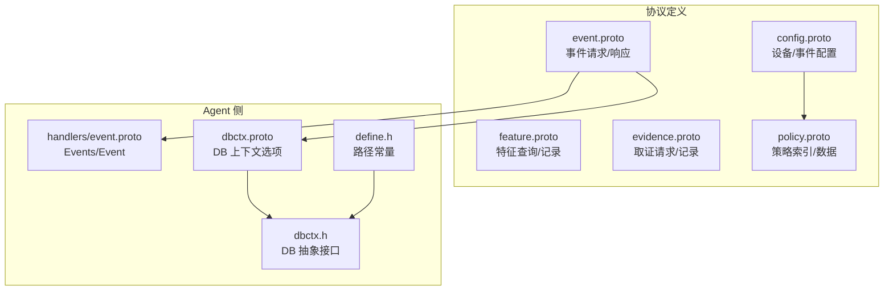
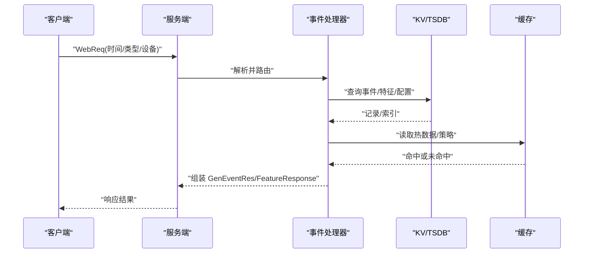
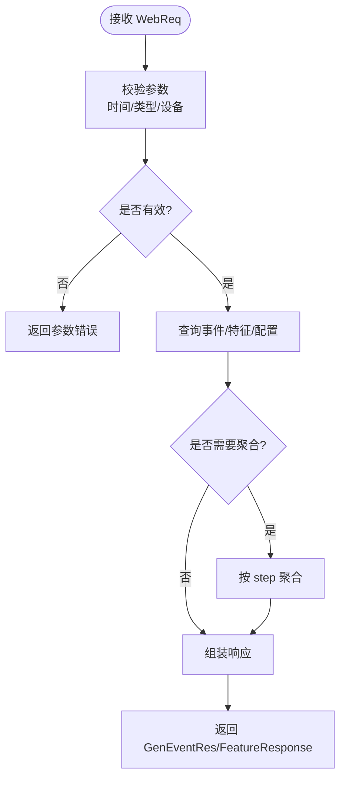
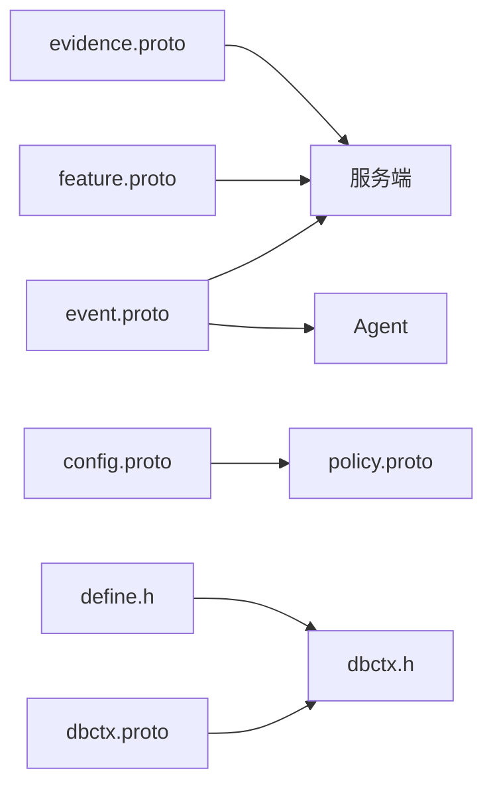

# 数据模型设计

<cite>
**本文引用的文件**
- [ly_analyser/src/common/event.proto](file://ly_analyser/src/common/event.proto)
- [ly_server/src/common/event.proto](file://ly_server/src/common/event.proto)
- [ly_analyser/src/agent/handlers/event.proto](file://ly_analyser/src/agent/handlers/event.proto)
- [ly_analyser/src/common/feature.proto](file://ly_analyser/src/common/feature.proto)
- [ly_analyser/src/common/evidence.proto](file://ly_analyser/src/common/evidence.proto)
- [ly_analyser/src/common/config.proto](file://ly_analyser/src/common/config.proto)
- [ly_analyser/src/common/policy.proto](file://ly_analyser/src/common/policy.proto)
- [ly_analyser/src/agent/data/dbctx.proto](file://ly_analyser/src/agent/data/dbctx.proto)
- [ly_analyser/src/agent/data/dbctx.h](file://ly_analyser/src/agent/data/dbctx.h)
- [ly_analyser/src/agent/define.h](file://ly_analyser/src/agent/define.h)
</cite>

## 目录
1. [简介](#简介)
2. [项目结构](#项目结构)
3. [核心组件](#核心组件)
4. [架构总览](#架构总览)
5. [详细组件分析](#详细组件分析)
6. [依赖关系分析](#依赖关系分析)
7. [性能考虑](#性能考虑)
8. [故障排查指南](#故障排查指南)
9. [结论](#结论)
10. [附录](#附录)

## 简介
本技术文档聚焦于本项目中基于 Protocol Buffers 的数据模型设计，重点覆盖 GenEventReq、GenEventRecord、WebReq 等核心消息，并扩展至特征、证据、配置与策略等相关模型。文档从字段语义、取值范围、使用场景出发，说明版本兼容性与演进策略，给出序列化/反序列化的实现指引，梳理与数据库的映射关系，归纳校验规则与错误处理机制，并提供大数据量下的压缩与优化建议。

## 项目结构
- 协议定义集中在 ly_analyser/src/common 与 ly_server/src/common 下，保证分析器与服务器端共享一致的接口契约。
- 事件采集侧在 ly_analyser/src/agent/handlers 提供 Agent 内部的事件聚合消息 Events/Event。
- 存储上下文与引擎选项通过 dbctx.proto 与 C++ 抽象层 dbctx.h 暴露，便于在不同 KV 引擎间切换。
- 路径常量与默认目录由 define.h 集中管理，便于统一数据落盘位置。

图表来源
- [ly_analyser/src/common/event.proto:1-47](file://ly_analyser/src/common/event.proto#L1-L47)
- [ly_analyser/src/agent/handlers/event.proto:1-17](file://ly_analyser/src/agent/handlers/event.proto#L1-L17)
- [ly_analyser/src/agent/data/dbctx.proto:1-29](file://ly_analyser/src/agent/data/dbctx.proto#L1-L29)
- [ly_analyser/src/agent/data/dbctx.h:1-88](file://ly_analyser/src/agent/data/dbctx.h#L1-L88)
- [ly_analyser/src/agent/define.h:1-29](file://ly_analyser/src/agent/define.h#L1-L29)

章节来源
- [ly_analyser/src/common/event.proto:1-47](file://ly_analyser/src/common/event.proto#L1-L47)
- [ly_server/src/common/event.proto:1-47](file://ly_server/src/common/event.proto#L1-L47)
- [ly_analyser/src/agent/handlers/event.proto:1-17](file://ly_analyser/src/agent/handlers/event.proto#L1-L17)
- [ly_analyser/src/agent/data/dbctx.proto:1-29](file://ly_analyser/src/agent/data/dbctx.proto#L1-L29)
- [ly_analyser/src/agent/data/dbctx.h:1-88](file://ly_analyser/src/agent/data/dbctx.h#L1-L88)
- [ly_analyser/src/agent/define.h:1-29](file://ly_analyser/src/agent/define.h#L1-L29)

## 核心组件
本节对关键消息进行逐条解析，涵盖字段含义、取值范围、使用场景与约束。

- GenEventReq（事件生成请求）
  - starttime/endtime：时间窗口起止（秒级 Unix 时间戳），用于筛选事件范围。
  - type_id：事件类型标识，需与配置中的事件类型一致。
  - config_id[]：关联的配置项 ID 列表，支持多配置过滤。
  - 使用场景：按时间与配置维度批量生成或查询事件。

- GenEventRes（事件生成响应）
  - records：事件记录集合，承载具体事件条目。

- GenEventRecord（事件记录）
  - time：事件发生时间（秒）。
  - type_id：事件类型（必填）。
  - config_id：触发该事件的配置 ID（必填）。
  - devid：设备 ID（必填）。
  - obj：事件对象描述（二进制/文本），可携带结构化信息。
  - thres_value/alarm_value：阈值与告警值，用于阈值型事件。
  - value_type：数值类型或单位说明。
  - model_id：模型 ID，用于关联检测模型或规则集。
  - 使用场景：作为事件流水的核心载体，供检索、聚合与可视化展示。

- WebReq（Web 查询请求）
  - starttime/endtime/step：时间范围与步长，用于时序聚合。
  - type/devid/event_id/id/obj/level：多维过滤条件。
  - req_type：枚举，包含原始查询 ORI、聚合查询 AGGRE、设置处理状态 SET_PROC_STATUS。
  - is_alive/proc_status/proc_comment/model：进程/任务状态与元信息。
  - 使用场景：面向 Web 端的统一查询入口，支持多种模式。

- Event/Events（Agent 内部事件）
  - Event：与 GenEventRecord 类似但字段更精简，用于 Agent 内部传输。
  - Events：事件数组包装，便于批量发送。

- FeatureReq/FeatureRecord/FeatureResponse（特征查询）
  - 支持按设备、时间、协议、IP/端口、域名、URL、威胁标记等多维过滤。
  - 返回带宽、流量、峰值、威胁评分、资产/服务信息等。

- EvidenceReq/EvidenceRecord/EvidenceResponse（取证）
  - 支持按设备、IP/端口、时间定位抓包片段。
  - 返回报文头与载荷，便于取证分析。

- Config/Device/Event（配置）
  - Device：设备元信息与采集参数。
  - Event：事件规则配置，含类型、阈值、时间窗、覆盖范围、子类型等。

- PolicyIndex/PolicyData（策略）
  - 策略索引与数据分离，支持嵌入、Proto、CSV、DAT 等多种存储格式。

章节来源
- [ly_analyser/src/common/event.proto:1-47](file://ly_analyser/src/common/event.proto#L1-L47)
- [ly_server/src/common/event.proto:1-47](file://ly_server/src/common/event.proto#L1-L47)
- [ly_analyser/src/agent/handlers/event.proto:1-17](file://ly_analyser/src/agent/handlers/event.proto#L1-L17)
- [ly_analyser/src/common/feature.proto:1-132](file://ly_analyser/src/common/feature.proto#L1-L132)
- [ly_analyser/src/common/evidence.proto:1-42](file://ly_analyser/src/common/evidence.proto#L1-L42)
- [ly_analyser/src/common/config.proto:1-130](file://ly_analyser/src/common/config.proto#L1-L130)
- [ly_analyser/src/common/policy.proto:1-60](file://ly_analyser/src/common/policy.proto#L1-L60)

## 架构总览
下图展示了从 Web 请求到事件生成与存储的关键流程，以及各模块间的依赖关系。

图表来源
- [ly_analyser/src/common/event.proto:1-47](file://ly_analyser/src/common/event.proto#L1-L47)
- [ly_analyser/src/common/feature.proto:1-132](file://ly_analyser/src/common/feature.proto#L1-L132)
- [ly_analyser/src/agent/data/dbctx.proto:1-29](file://ly_analyser/src/agent/data/dbctx.proto#L1-L29)
- [ly_analyser/src/agent/data/dbctx.h:1-88](file://ly_analyser/src/agent/data/dbctx.h#L1-L88)

## 详细组件分析

### 事件模型（GenEventReq/GenEventRes/GenEventRecord/WebReq）
- 字段语义与约束
  - 必填字段：type_id、config_id、devid（记录层面）。
  - 可选字段：time、obj、thres_value、alarm_value、value_type、model_id。
  - WebReq 的 req_type 控制行为模式，默认 ORI。
- 使用场景
  - 生成：根据时间与配置批量生成事件。
  - 查询：按时间、设备、类型、对象、级别等维度检索。
  - 聚合：结合 step 进行时间分桶统计。
- 版本兼容性
  - 采用 proto2 optional，新增字段不影响旧版本解析。
  - 推荐为新增字段设置合理默认值，避免歧义。
- 与数据库映射
  - 事件表建议包含：id、time、type_id、config_id、devid、obj、thres_value、alarm_value、value_type、model_id。
  - 索引建议：devid、type_id、time 组合索引；obj 可使用全文索引或 JSON 列。
- 校验与错误处理
  - 时间范围校验：starttime <= endtime。
  - 必填字段校验：type_id、config_id、devid 非空。
  - 业务校验：阈值与告警值逻辑一致性。
  - 错误码：建议区分参数错误、权限不足、资源不可用等。

图表来源
- [ly_analyser/src/common/event.proto:1-47](file://ly_analyser/src/common/event.proto#L1-L47)
- [ly_analyser/src/common/feature.proto:1-132](file://ly_analyser/src/common/feature.proto#L1-L132)

章节来源
- [ly_analyser/src/common/event.proto:1-47](file://ly_analyser/src/common/event.proto#L1-L47)
- [ly_server/src/common/event.proto:1-47](file://ly_server/src/common/event.proto#L1-L47)

### 特征模型（FeatureReq/FeatureRecord）
- 字段语义与约束
  - 过滤维度：设备、时间、协议、源/目的 IP/端口、域名、URL、威胁标记等。
  - 排序与限制：orderby、limit。
  - 返回指标：bytes、flows、pkts、峰值、威胁评分、资产/服务信息。
- 使用场景
  - 流量分析、威胁狩猎、资产画像、服务识别。
- 与数据库映射
  - 特征表建议包含：devid、type、time、duration、protocol、bytes、flows、pkts、sip/sport/dip/dport、peers、ip/port、peak_*、moid、bwclass、ti_mark、srv_mark、qname/qtype/url/host/app_proto/fqname、score、srv_*、dev_*、os_*、midware_*、threat_*、srv_time/dev_time/os_time/midware_time。
  - 索引建议：devid、time、protocol、sip/dip、qname/url。
- 校验与错误处理
  - 时间范围与协议合法性校验。
  - 分页与限流保护。

章节来源
- [ly_analyser/src/common/feature.proto:1-132](file://ly_analyser/src/common/feature.proto#L1-L132)

### 取证模型（EvidenceReq/EvidenceRecord）
- 字段语义与约束
  - 定位条件：设备、IP/端口、时间秒/微秒。
  - 返回内容：报文头与载荷、网络五元组、协议、长度等。
- 使用场景
  - 安全事件溯源、攻击载荷提取、协议调试。
- 与数据库映射
  - 取证表建议包含：devid、ip、port、time_sec/time_usec、caplen/pktlen、smac/dmac、sip/sport/dip/dport、protocol、payload、pkthdr、packet。
  - 索引建议：devid、time_sec、ip、port。
- 校验与错误处理
  - 时间精度与范围校验。
  - 大载荷下载时的限流与超时控制。

章节来源
- [ly_analyser/src/common/evidence.proto:1-42](file://ly_analyser/src/common/evidence.proto#L1-L42)

### 配置与策略（Config/Device/Event/PolicyIndex/PolicyData）
- 字段语义与约束
  - Device：设备标识、采集参数、接口列表、过滤规则。
  - Event：事件规则类型、阈值、时间窗、覆盖范围、子类型等。
  - PolicyIndex/PolicyData：策略索引与数据分离，支持多种存储格式。
- 使用场景
  - 设备接入、事件规则编排、黑白名单/扫描/服务等策略管理。
- 与数据库映射
  - 设备表、事件规则表、策略索引表、策略数据表。
  - 策略数据可按 label/format 分区存储。
- 校验与错误处理
  - 规则冲突检测、时间窗合法性、策略格式校验。

章节来源
- [ly_analyser/src/common/config.proto:1-130](file://ly_analyser/src/common/config.proto#L1-L130)
- [ly_analyser/src/common/policy.proto:1-60](file://ly_analyser/src/common/policy.proto#L1-L60)

### Agent 内部事件（Events/Event）
- 字段语义与约束
  - Event：与 GenEventRecord 对应但更精简，适合内部传输。
  - Events：事件数组包装。
- 使用场景
  - Agent 内部模块间事件传递、批量上报。
- 与数据库映射
  - 可映射为事件表的轻量视图或中间表。

章节来源
- [ly_analyser/src/agent/handlers/event.proto:1-17](file://ly_analyser/src/agent/handlers/event.proto#L1-L17)

## 依赖关系分析
- 协议耦合
  - event.proto 与 feature.proto、evidence.proto 在服务端与 Agent 侧共同消费。
  - config.proto 与 policy.proto 强耦合，策略数据依赖 MO 记录。
- 存储抽象
  - dbctx.proto 定义引擎选项，dbctx.h 提供统一迭代与键值操作接口。
  - 路径常量由 define.h 统一管理，确保数据落盘一致性。

图表来源
- [ly_analyser/src/common/event.proto:1-47](file://ly_analyser/src/common/event.proto#L1-L47)
- [ly_analyser/src/common/feature.proto:1-132](file://ly_analyser/src/common/feature.proto#L1-L132)
- [ly_analyser/src/common/evidence.proto:1-42](file://ly_analyser/src/common/evidence.proto#L1-L42)
- [ly_analyser/src/common/config.proto:1-130](file://ly_analyser/src/common/config.proto#L1-L130)
- [ly_analyser/src/common/policy.proto:1-60](file://ly_analyser/src/common/policy.proto#L1-L60)
- [ly_analyser/src/agent/data/dbctx.proto:1-29](file://ly_analyser/src/agent/data/dbctx.proto#L1-L29)
- [ly_analyser/src/agent/data/dbctx.h:1-88](file://ly_analyser/src/agent/data/dbctx.h#L1-L88)
- [ly_analyser/src/agent/define.h:1-29](file://ly_analyser/src/agent/define.h#L1-L29)

章节来源
- [ly_analyser/src/agent/data/dbctx.h:1-88](file://ly_analyser/src/agent/data/dbctx.h#L1-L88)
- [ly_analyser/src/agent/define.h:1-29](file://ly_analyser/src/agent/define.h#L1-L29)

## 性能考虑
- 序列化/反序列化
  - 使用 Protobuf 的二进制编码，减少体积与解析开销。
  - 批量传输：Events/FeatureResponse 等数组结构降低 RPC 次数。
- 查询优化
  - 时间范围与设备维度先行过滤，减少扫描面。
  - 合理使用 step 进行聚合，避免全量拉取。
- 存储优化
  - 选择合适 KV/TSDB 引擎（LMDB、LevelDB、UnQLite 等），依据读写比例与容量规划。
  - 利用 dup_sort/dup_fixed 与 integer_key 优化键值结构与排序。
  - 时间对齐 time_unit 与回溯限制 backtrack 控制数据保留与访问效率。
- 压缩策略
  - 对大字段（如 payload、packet）启用压缩后再落盘。
  - 冷热分层：热数据内存/SSD，冷数据归档至低成本介质。
- 并发与限流
  - 查询接口增加限流与超时控制，防止雪崩。
  - 写路径采用批提交与异步落盘，提升吞吐。

[本节为通用性能建议，不直接引用具体代码文件]

## 故障排查指南
- 常见错误
  - 参数非法：时间范围无效、必填字段缺失。
  - 资源不可用：数据库连接失败、引擎初始化错误。
  - 权限不足：设备或配置访问受限。
- 定位方法
  - 检查 WebReq 参数与日志上下文。
  - 查看 DB 状态与错误标志位（Error/NotFound/KeyExist）。
  - 核对配置与策略的一致性。
- 恢复建议
  - 重试与降级：临时关闭聚合或限制查询范围。
  - 回滚与修复：修正配置后重新加载。
  - 监控告警：对错误率与延迟设置阈值告警。

章节来源
- [ly_analyser/src/agent/data/dbctx.h:14-71](file://ly_analyser/src/agent/data/dbctx.h#L14-L71)

## 结论
本项目以 Protobuf 为核心契约，构建了清晰的事件、特征、取证、配置与策略数据模型。通过统一的存储抽象与路径管理，实现了跨引擎的可插拔存储能力。建议在后续演进中持续完善字段校验、错误码体系与性能监控，确保在高并发与大数据量场景下的稳定性与可扩展性。

## 附录

### 数据模型与数据库表映射建议
- 事件表
  - 字段：id、time、type_id、config_id、devid、obj、thres_value、alarm_value、value_type、model_id
  - 索引：devid、type_id、time
- 特征表
  - 字段：devid、type、time、duration、protocol、bytes、flows、pkts、sip/sport/dip/dport、peers、ip/port、peak_*、moid、bwclass、ti_mark、srv_mark、qname/qtype/url/host/app_proto/fqname、score、srv_*、dev_*、os_*、midware_*、threat_*、srv_time/dev_time/os_time/midware_time
  - 索引：devid、time、protocol、sip/dip、qname/url
- 取证表
  - 字段：devid、ip、port、time_sec/time_usec、caplen/pktlen、smac/dmac、sip/sport/dip/dport、protocol、payload、pkthdr、packet
  - 索引：devid、time_sec、ip、port
- 设备表
  - 字段：id、name、type、model、agentid、creator、desc、ip、port、disabled、interfaces、flowtype、pcap_level、temp、filter、interface
- 事件规则表
  - 字段：type_id、config_id、moid、thres_type、data_type、min/max、grep_rule、devid、status_moid、port/ip/protocol、weekday/stime/etime、coverrange、namelist、threatscore、qcount/qname/qtype/namelen/fqcount/detvalue、desc、sip/dip/pat、sub_type、IF1/IF2/IF3
- 策略索引表
  - 字段：policy、storage、format、policy_data_label[]
- 策略数据表
  - 字段：label、format、mo/item[]

[本节为概念性映射建议，不直接引用具体代码文件]

### 版本兼容性与演进策略
- 向后兼容
  - 使用 proto2 optional，新增字段不影响旧版本解析。
  - 为新增字段设置合理默认值，避免歧义。
- 向前兼容
  - 删除字段前预留废弃期，提供迁移脚本。
  - 枚举新增值时保持旧值不变，客户端忽略未知枚举。
- 演进实践
  - 小步快跑：每次变更最小化影响面。
  - 灰度发布：新旧版本并行运行，逐步切换。
  - 监控与回滚：建立完善的观测与快速回滚机制。

[本节为通用演进建议，不直接引用具体代码文件]

### 序列化与反序列化实现示例（指引）
- 生成代码
  - 使用 protoc 编译 .proto 文件，生成目标语言绑定。
- 序列化
  - 将消息对象序列化为字节流，写入网络或存储。
- 反序列化
  - 从字节流还原为消息对象，读取字段并进行业务处理。
- 注意事项
  - 处理 optional 字段的存在性判断。
  - 对大字段进行压缩与分片传输。
  - 异常捕获与错误码映射。

[本节为通用实现指引，不直接引用具体代码文件]