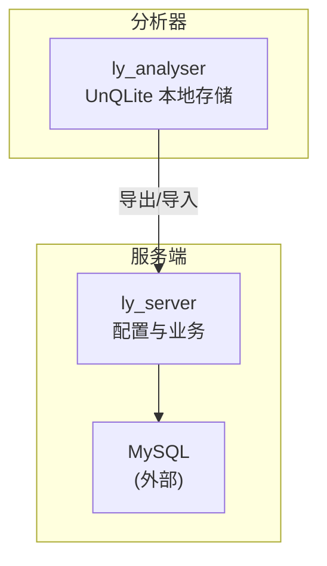
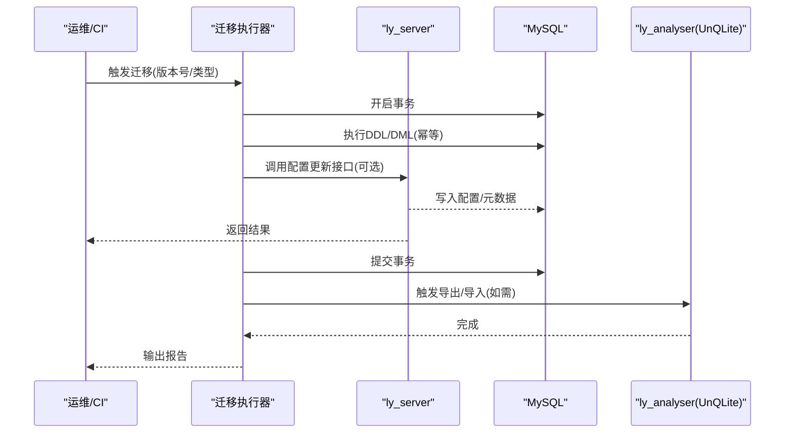
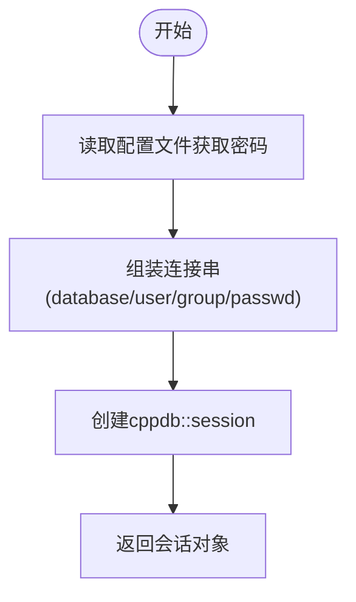
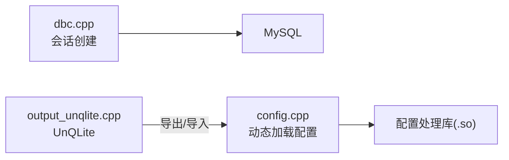

# 数据迁移方案

<cite>
**本文引用的文件**
- [ly_server/src/server/dbc.cpp](file://ly_server/src/server/dbc.cpp)
- [ly_server/src/server/dbc.h](file://ly_server/src/server/dbc.h)
- [ly_server/src/server/config.cpp](file://ly_server/src/server/config.cpp)
- [ly_server/src/common/config.cpp](file://ly_server/src/common/config.cpp)
- [ly_server/src/common/config.h](file://ly_server/src/common/config.h)
- [ly_analyser/src/agent/handlers/output_unqlite.cpp](file://ly_analyser/src/agent/handlers/output_unqlite.cpp)
</cite>

## 目录
1. [引言](#引言)
2. [项目结构](#项目结构)
3. [核心组件](#核心组件)
4. [架构总览](#架构总览)
5. [详细组件分析](#详细组件分析)
6. [依赖关系分析](#依赖关系分析)
7. [性能与锁表策略](#性能与锁表策略)
8. [监控与错误处理](#监控与错误处理)
9. [多环境部署与数据同步](#多环境部署与数据同步)
10. [备份与恢复流程](#备份与恢复流程)
11. [历史数据归档与清理](#历史数据归档与清理)
12. [结论](#结论)

## 引言
本方案面向 SOC 系统的数据迁移，覆盖数据库版本管理、增量/全量迁移选择标准、一致性保证与回滚机制、锁表与性能优化、迁移监控与错误处理、多环境数据同步、备份与恢复以及历史数据归档清理等关键主题。文档基于仓库中服务器端与代理端的数据库访问实现进行设计，确保可落地执行。

## 项目结构
SOC 由多个子系统构成：
- ly_server：服务端，负责配置管理与业务逻辑，使用 MySQL（通过 cppdb）作为持久化存储。
- ly_analyser：分析器，包含采集与导出能力，内部使用 UnQLite 作为本地缓存/临时存储。
- ly_vis：前端展示层，不直接参与数据库迁移。
- ly_docs：文档站点。

图表来源
- [ly_server/src/server/dbc.cpp:1-27](file://ly_server/src/server/dbc.cpp#L1-L27)
- [ly_analyser/src/agent/handlers/output_unqlite.cpp:253-303](file://ly_analyser/src/agent/handlers/output_unqlite.cpp#L253-L303)

章节来源
- [ly_server/src/server/dbc.cpp:1-27](file://ly_server/src/server/dbc.cpp#L1-L27)
- [ly_server/src/server/config.cpp:1-81](file://ly_server/src/server/config.cpp#L1-L81)
- [ly_analyser/src/agent/handlers/output_unqlite.cpp:253-303](file://ly_analyser/src/agent/handlers/output_unqlite.cpp#L253-L303)

## 核心组件
- 数据库会话创建：统一封装 MySQL 连接参数读取与 session 创建，便于在迁移脚本或工具中复用。
- 配置加载：通过 protobuf 文本/二进制格式读写配置，支持从文件或字符串加载，便于在迁移前后校验配置一致性。
- 动态配置模块：服务端通过动态库加载具体配置处理器，并在操作后触发推送，便于将变更同步到各节点。

章节来源
- [ly_server/src/server/dbc.cpp:1-27](file://ly_server/src/server/dbc.cpp#L1-L27)
- [ly_server/src/server/dbc.h:1-15](file://ly_server/src/server/dbc.h#L1-L15)
- [ly_server/src/common/config.cpp:16-77](file://ly_server/src/common/config.cpp#L16-L77)
- [ly_server/src/common/config.h:6-46](file://ly_server/src/common/config.h#L6-L46)
- [ly_server/src/server/config.cpp:20-81](file://ly_server/src/server/config.cpp#L20-L81)

## 架构总览
迁移架构围绕“版本化迁移脚本 + 事务性执行 + 幂等约束 + 回滚”展开，结合服务端的动态配置推送，确保多节点一致。

图表来源
- [ly_server/src/server/config.cpp:63-73](file://ly_server/src/server/config.cpp#L63-L73)
- [ly_server/src/server/dbc.cpp:1-27](file://ly_server/src/server/dbc.cpp#L1-L27)
- [ly_analyser/src/agent/handlers/output_unqlite.cpp:253-303](file://ly_analyser/src/agent/handlers/output_unqlite.cpp#L253-L303)

## 详细组件分析

### 数据库会话与连接管理
- 功能要点：从配置文件读取密码，组合数据库名、用户、组信息，构造 MySQL 连接串并返回 session。
- 迁移意义：迁移脚本应复用该函数或等价逻辑，避免硬编码凭据；同时可在迁移前进行连通性与权限检查。

图表来源
- [ly_server/src/server/dbc.cpp:5-25](file://ly_server/src/server/dbc.cpp#L5-L25)

章节来源
- [ly_server/src/server/dbc.cpp:1-27](file://ly_server/src/server/dbc.cpp#L1-L27)
- [ly_server/src/server/dbc.h:1-15](file://ly_server/src/server/dbc.h#L1-L15)

### 配置加载与写入
- 功能要点：ConfigReader/ConfigWriter 支持从流/文件/字符串加载与写出，支持文本与二进制两种格式。
- 迁移意义：用于迁移前后校验配置一致性，或在迁移过程中生成/更新配置快照，便于回滚。

章节来源
- [ly_server/src/common/config.cpp:16-77](file://ly_server/src/common/config.cpp#L16-L77)
- [ly_server/src/common/config.h:6-46](file://ly_server/src/common/config.h#L6-L46)

### 动态配置模块与推送
- 功能要点：服务端根据请求类型动态加载对应配置处理库，创建实例并处理请求；对增删改操作触发配置推送进程。
- 迁移意义：在迁移涉及配置变更时，可通过该机制将新配置分发至各节点，保证运行时一致性。

章节来源
- [ly_server/src/server/config.cpp:20-81](file://ly_server/src/server/config.cpp#L20-L81)

### 分析器本地存储与导出
- 功能要点：UnQLite 用于本地缓存/临时存储，提供打开、事务提交与关闭等操作。
- 迁移意义：可用于离线数据准备、增量数据预聚合或导出为中间格式，再导入到主库，降低在线迁移压力。

章节来源
- [ly_analyser/src/agent/handlers/output_unqlite.cpp:253-303](file://ly_analyser/src/agent/handlers/output_unqlite.cpp#L253-L303)

## 依赖关系分析
- 服务端依赖 MySQL（通过 cppdb），并通过动态库加载配置处理器。
- 分析器依赖 UnQLite 作为本地存储，可与服务端交互进行数据导出/导入。
- 配置系统采用 protobuf 序列化，便于跨进程/跨语言传递。

图表来源
- [ly_server/src/server/dbc.cpp:1-27](file://ly_server/src/server/dbc.cpp#L1-L27)
- [ly_server/src/server/config.cpp:20-81](file://ly_server/src/server/config.cpp#L20-L81)
- [ly_analyser/src/agent/handlers/output_unqlite.cpp:253-303](file://ly_analyser/src/agent/handlers/output_unqlite.cpp#L253-L303)

章节来源
- [ly_server/src/server/dbc.cpp:1-27](file://ly_server/src/server/dbc.cpp#L1-L27)
- [ly_server/src/server/config.cpp:20-81](file://ly_server/src/server/config.cpp#L20-L81)
- [ly_analyser/src/agent/handlers/output_unqlite.cpp:253-303](file://ly_analyser/src/agent/handlers/output_unqlite.cpp#L253-L303)

## 性能与锁表策略
- 批量写入与事务：将多条 DML 放入同一事务提交，减少网络往返与锁竞争。
- 分片/分区：按时间或业务维度拆分大表，迁移时分批次处理，降低单事务规模。
- 索引策略：迁移前评估新增索引的代价，必要时先建空索引再填充，或使用并行构建。
- 锁表控制：对强一致要求的写路径使用行级锁或短事务；必要时短暂加表级读锁以保障一致性，但需评估停机窗口。
- 资源限制：合理设置并发度、超时与重试次数，避免拖垮数据库。

[本节为通用指导，无需代码来源]

## 监控与错误处理
- 迁移日志：记录每个脚本的执行起止时间、影响行数、异常堆栈与回滚动作。
- 指标上报：暴露迁移进度、失败率、耗时分布等指标，接入监控系统告警。
- 幂等设计：所有 DDL/DML 具备幂等性（如 IF NOT EXISTS、UPSERT），允许重复执行。
- 回滚策略：每个迁移脚本配套反向脚本；失败时自动触发回滚，并保留现场以便排查。
- 健康检查：迁移前后对关键表结构与数据进行校验（行数、约束、外键）。

[本节为通用指导，无需代码来源]

## 多环境部署与数据同步
- 环境隔离：开发/测试/预发/生产分别独立数据库实例，迁移脚本按环境注入不同参数。
- 基线对齐：通过版本标记（如 schema_version 表）确保各环境迁移顺序一致。
- 数据同步：
  - 增量：基于时间戳或流水号增量抽取，配合消息队列或 binlog 同步。
  - 全量：离线导出（UnQLite 或文件）+ 分批导入，适合首次或大规模重建。
- 配置同步：利用服务端动态配置推送机制，在迁移完成后刷新各节点配置。

章节来源
- [ly_server/src/server/config.cpp:63-73](file://ly_server/src/server/config.cpp#L63-L73)
- [ly_analyser/src/agent/handlers/output_unqlite.cpp:253-303](file://ly_analyser/src/agent/handlers/output_unqlite.cpp#L253-L303)

## 备份与恢复流程
- 备份策略：
  - 逻辑备份：定期导出关键表结构与数据，保留多版本快照。
  - 物理备份：结合数据库原生工具备份数据文件，缩短恢复时间。
- 恢复步骤：
  - 停止写入或切换到只读模式。
  - 恢复到目标时间点或指定备份点。
  - 验证数据一致性与完整性。
  - 重新开放写入并观察运行状态。
- 回滚衔接：若迁移失败且无法快速修复，优先回滚到最近稳定版本。

[本节为通用指导，无需代码来源]

## 历史数据归档与清理
- 归档策略：将过期数据迁移至归档库或冷存储，保持热库体积可控。
- 清理策略：按时间或大小阈值清理无用数据，注意外键与索引维护。
- 审计要求：归档与清理操作需留痕，支持追溯。

[本节为通用指导，无需代码来源]

## 结论
本方案以服务端数据库会话与配置系统为核心，结合分析器的本地存储能力，构建了可落地的数据迁移体系。通过版本化迁移、幂等与回滚、锁表与性能优化、监控与错误处理、多环境同步及备份恢复等机制，确保迁移过程安全、可控、可观测。建议在实际落地中结合业务体量与 SLA 要求，细化脚本粒度与执行策略，并持续完善监控与演练。