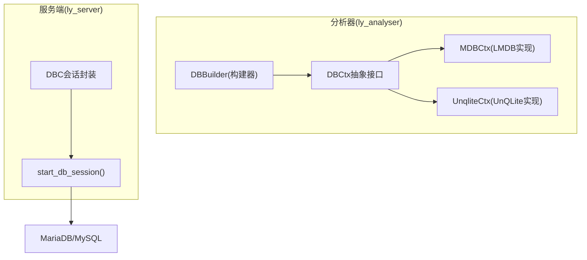
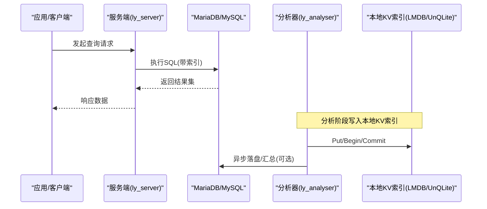
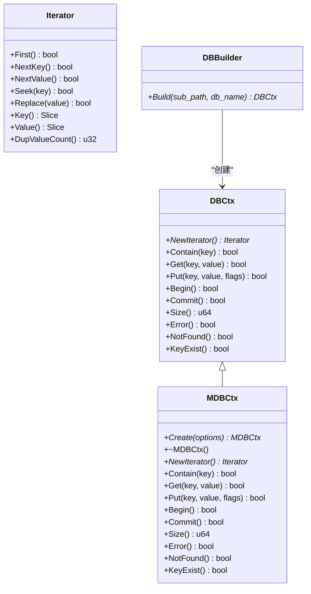
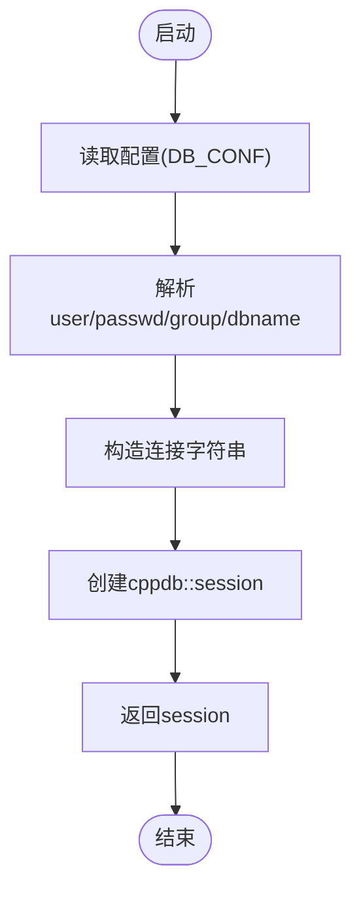
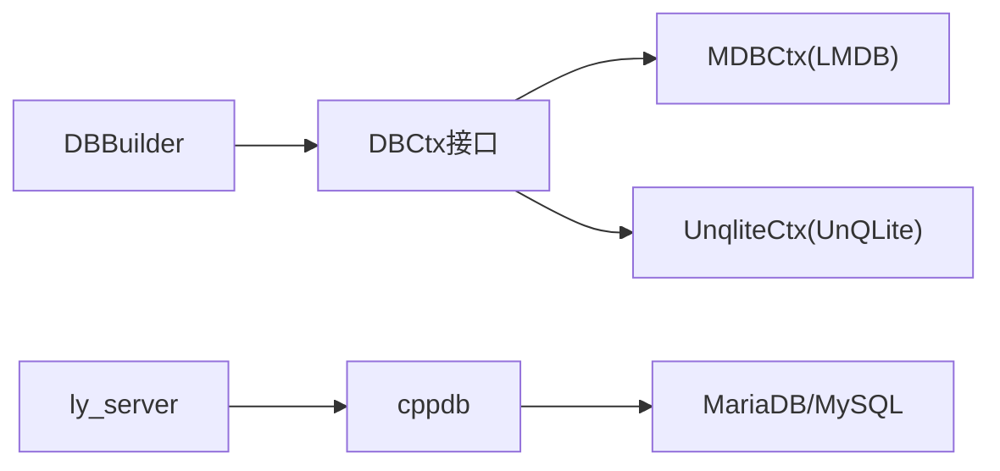

# 索引策略设计

<cite>
**本文引用的文件**
- [ly_analyser/src/agent/data/dbctx.h](file://ly_analyser/src/agent/data/dbctx.h)
- [ly_analyser/src/agent/data/mdb.h](file://ly_analyser/src/agent/data/mdb.h)
- [ly_analyser/src/agent/data/dbctx.cpp](file://ly_analyser/src/agent/data/dbctx.cpp)
- [ly_server/src/server/dbc.h](file://ly_server/src/server/dbc.h)
- [ly_server/src/server/dbc.cpp](file://ly_server/src/server/dbc.cpp)
- [ly_analyser/README.md](file://ly_analyser/README.md)
</cite>

## 目录
1. [引言](#引言)
2. [项目结构](#项目结构)
3. [核心组件](#核心组件)
4. [架构总览](#架构总览)
5. [详细组件分析](#详细组件分析)
6. [依赖关系分析](#依赖关系分析)
7. [性能考量](#性能考量)
8. [故障排查指南](#故障排查指南)
9. [结论](#结论)
10. [附录](#附录)

## 引言
本技术文档面向MariaDB数据库的索引策略设计与优化，结合本项目中服务端对MySQL/MariaDB的连接方式与数据访问模式，给出复合索引、唯一索引、全文索引的设计原则、适用场景与性能影响；提供查询模式到索引设计的映射方法、监控与调优流程、大表分区与归档策略、写入性能平衡建议，以及索引重建与优化的脚本示例。文档同时覆盖本地嵌入式存储（LMDB/UnQLite）在分析侧的角色，以形成端到端的数据流与索引治理视角。

## 项目结构
本项目包含分析器（ly_analyser）、服务端（ly_server）与可视化层（ly_vis）。其中：
- 分析器负责数据采集、处理与本地键值存储（LMDB/UnQLite），用于高性能时序与特征缓存。
- 服务端通过cppdb连接MySQL/MariaDB，承载配置、事件、证据等持久化能力。
- 可视化层提供前端展示与交互。

图表来源
- [ly_analyser/src/agent/data/dbctx.h:9-85](file://ly_analyser/src/agent/data/dbctx.h#L9-L85)
- [ly_analyser/src/agent/data/mdb.h:8-34](file://ly_analyser/src/agent/data/mdb.h#L8-L34)
- [ly_analyser/src/agent/data/dbctx.cpp:9-39](file://ly_analyser/src/agent/data/dbctx.cpp#L9-L39)
- [ly_server/src/server/dbc.h:1-15](file://ly_server/src/server/dbc.h#L1-L15)
- [ly_server/src/server/dbc.cpp:3-26](file://ly_server/src/server/dbc.cpp#L3-L26)

章节来源
- [ly_analyser/src/agent/data/dbctx.h:9-85](file://ly_analyser/src/agent/data/dbctx.h#L9-L85)
- [ly_analyser/src/agent/data/mdb.h:8-34](file://ly_analyser/src/agent/data/mdb.h#L8-L34)
- [ly_analyser/src/agent/data/dbctx.cpp:9-39](file://ly_analyser/src/agent/data/dbctx.cpp#L9-L39)
- [ly_server/src/server/dbc.h:1-15](file://ly_server/src/server/dbc.h#L1-L15)
- [ly_server/src/server/dbc.cpp:3-26](file://ly_server/src/server/dbc.cpp#L3-L26)

## 核心组件
- DBCtx抽象接口：定义统一的键值存取、迭代器、事务边界、错误状态等能力，屏蔽底层存储差异。
- MDBCtx：基于LMDB的高性能嵌入式KV存储实现，适合高并发读、批量写场景。
- UnqliteCtx：基于UnQLite的嵌入式KV存储实现，作为备选引擎。
- DBBuilder：根据配置选择并构建具体DBCtx实例，统一初始化路径。
- DBC会话封装：在服务端提供与MySQL/MariaDB的连接与会话管理。

这些组件共同构成“分析侧本地索引/缓存 + 服务端关系型数据库”的分层架构，为上层查询提供低延迟读取与可靠持久化。

章节来源
- [ly_analyser/src/agent/data/dbctx.h:9-85](file://ly_analyser/src/agent/data/dbctx.h#L9-L85)
- [ly_analyser/src/agent/data/mdb.h:8-34](file://ly_analyser/src/agent/data/mdb.h#L8-L34)
- [ly_analyser/src/agent/data/dbctx.cpp:9-39](file://ly_analyser/src/agent/data/dbctx.cpp#L9-L39)
- [ly_server/src/server/dbc.h:1-15](file://ly_server/src/server/dbc.h#L1-L15)
- [ly_server/src/server/dbc.cpp:3-26](file://ly_server/src/server/dbc.cpp#L3-L26)

## 架构总览
下图展示了从分析器到服务端的整体数据流与索引位置：分析器将高频热点数据以本地索引（LMDB/UnQLite）形式缓存，降低重复查询开销；服务端通过cppdb连接MariaDB，承担结构化数据的持久化与复杂查询。

图表来源
- [ly_server/src/server/dbc.cpp:3-26](file://ly_server/src/server/dbc.cpp#L3-L26)
- [ly_analyser/src/agent/data/dbctx.cpp:9-39](file://ly_analyser/src/agent/data/dbctx.cpp#L9-L39)
- [ly_analyser/src/agent/data/mdb.h:8-34](file://ly_analyser/src/agent/data/mdb.h#L8-L34)

## 详细组件分析

### 组件A：DBCtx抽象与DBBuilder
- 职责：统一KV操作语义（Get/Put/Iterator/事务/错误），并提供构建器按配置创建具体实现。
- 关键点：
  - Iterator支持First/NextKey/NextValue/Seek/Replace，便于范围扫描与更新。
  - Flags支持NODUPDATA、NOOVERWRITE、APPEND等，控制写入行为。
  - DBBuilder根据engine选择LMDB或UnQLite，并自动创建目录、设置路径与名称，开启事务。

图表来源
- [ly_analyser/src/agent/data/dbctx.h:9-85](file://ly_analyser/src/agent/data/dbctx.h#L9-L85)
- [ly_analyser/src/agent/data/mdb.h:8-34](file://ly_analyser/src/agent/data/mdb.h#L8-L34)
- [ly_analyser/src/agent/data/dbctx.cpp:9-39](file://ly_analyser/src/agent/data/dbctx.cpp#L9-L39)

章节来源
- [ly_analyser/src/agent/data/dbctx.h:9-85](file://ly_analyser/src/agent/data/dbctx.h#L9-L85)
- [ly_analyser/src/agent/data/mdb.h:8-34](file://ly_analyser/src/agent/data/mdb.h#L8-L34)
- [ly_analyser/src/agent/data/dbctx.cpp:9-39](file://ly_analyser/src/agent/data/dbctx.cpp#L9-L39)

### 组件B：服务端数据库会话
- 职责：封装与MariaDB/MySQL的连接建立，读取配置文件中的用户、密码、数据库名与默认组，构造cppdb session。
- 关键点：
  - 使用环境变量或配置文件获取连接参数。
  - 通过read_default_group指定MySQL客户端选项组，便于多环境切换。
  - 返回可复用的session供上层业务调用。

图表来源
- [ly_server/src/server/dbc.cpp:3-26](file://ly_server/src/server/dbc.cpp#L3-L26)

章节来源
- [ly_server/src/server/dbc.h:1-15](file://ly_server/src/server/dbc.h#L1-L15)
- [ly_server/src/server/dbc.cpp:3-26](file://ly_server/src/server/dbc.cpp#L3-L26)

## 依赖关系分析
- 分析器依赖LMDB/UnQLite作为本地KV索引，提供低延迟读写与迭代能力。
- 服务端依赖cppdb与MariaDB/MySQL驱动，进行结构化数据持久化与查询。
- 构建器DBBuilder解耦具体存储实现，便于扩展与替换。

图表来源
- [ly_analyser/src/agent/data/dbctx.cpp:9-39](file://ly_analyser/src/agent/data/dbctx.cpp#L9-L39)
- [ly_server/src/server/dbc.cpp:3-26](file://ly_server/src/server/dbc.cpp#L3-L26)

章节来源
- [ly_analyser/src/agent/data/dbctx.cpp:9-39](file://ly_analyser/src/agent/data/dbctx.cpp#L9-L39)
- [ly_server/src/server/dbc.cpp:3-26](file://ly_server/src/server/dbc.cpp#L3-L26)

## 性能考量
- 本地KV索引（LMDB/UnQLite）：
  - 优势：极低延迟、高吞吐、支持事务与迭代，适合热点数据与聚合结果缓存。
  - 注意：需合理设计键空间与分片，避免单库过大导致同步成本上升。
- 服务端MariaDB索引：
  - 复合索引：针对频繁过滤+排序的组合条件，遵循最左前缀原则，减少回表与临时表。
  - 唯一索引：保障业务唯一性，提升等值查询性能，但会增加写入冲突检测成本。
  - 全文索引：适用于文本检索场景，权衡索引体积与查询延迟。
  - 写入放大：索引越多，INSERT/UPDATE/DELETE越慢，需评估读写比与资源上限。
  - 统计信息：定期ANALYZE TABLE，确保优化器选择正确执行计划。
  - 缓冲与锁：调整innodb_buffer_pool_size、innodb_log_file_size，关注锁等待与死锁。

[本节为通用指导，不直接分析具体文件]

## 故障排查指南
- 连接失败：
  - 检查DB_CONF中passwd是否正确读取，read_default_group是否匹配当前环境。
  - 确认MariaDB服务可达、端口与权限配置正确。
- 查询缓慢：
  - 使用EXPLAIN分析执行计划，识别全表扫描、临时表、文件排序。
  - 核对WHERE/JOIN/ORDER BY字段是否命中索引，必要时添加或调整复合索引。
- 写入瓶颈：
  - 观察InnoDB日志与缓冲池命中率，调整相关参数。
  - 批量提交事务，减少单条提交开销。
- 本地KV异常：
  - 检查DBBuilder路径创建与权限，确认Begin/Commit成对调用。
  - 关注迭代器使用边界，避免非法Seek或越界访问。

章节来源
- [ly_server/src/server/dbc.cpp:3-26](file://ly_server/src/server/dbc.cpp#L3-L26)
- [ly_analyser/src/agent/data/dbctx.cpp:9-39](file://ly_analyser/src/agent/data/dbctx.cpp#L9-L39)

## 结论
本项目采用“分析侧本地KV索引 + 服务端MariaDB”的分层架构，既满足高吞吐低延迟的热点数据访问，又保证结构化数据的强一致与复杂查询能力。围绕MariaDB的索引策略应聚焦于查询模式驱动、复合索引的最左前缀设计、唯一性与全文索引的审慎使用，并结合监控与调优手段持续优化。对于大表，建议结合分区与归档策略，平衡历史数据保留与在线查询性能。

[本节为总结性内容，不直接分析具体文件]

## 附录

### A. MariaDB索引设计原则与实践
- 复合索引
  - 依据高频过滤列与排序列组合设计，遵循最左前缀原则。
  - 避免过度宽索引，控制索引列数量与长度，减少写入放大。
- 唯一索引
  - 用于业务唯一约束（如设备ID、流水号），提升等值查询性能。
  - 注意写入冲突与重试策略，避免热点插入抖动。
- 全文索引
  - 适用于日志、告警消息等文本检索，配合MATCH...AGAINST语法。
  - 权衡索引体积与查询延迟，必要时结合外部搜索引擎。
- 覆盖索引
  - 尽量让SELECT字段被索引覆盖，减少回表。
- 函数与表达式
  - 谨慎使用函数包裹列，可能导致索引失效；必要时引入生成列或冗余字段。

[本节为通用指导，不直接分析具体文件]

### B. 查询模式到索引映射示例
- 时间范围+设备+类型过滤：创建(time, device_id, type)复合索引。
- 按源IP/目的IP聚合：创建(src_ip, dst_ip)复合索引，配合GROUP BY优化。
- 告警级别+时间排序：创建(alarm_level, time)复合索引，避免文件排序。
- 文本搜索：对message字段创建全文索引，使用MATCH...AGAINST。

[本节为通用指导，不直接分析具体文件]

### C. 索引监控与调优方法
- 慢查询日志：开启并分析慢查询，定位缺失索引或低效SQL。
- 性能_schema：
  - 查看table_io_waits_summary_by_table_index，识别热点索引。
  - 使用sys.schema_unused_indexes发现未用索引。
- EXPLAIN/EXPLAIN ANALYZE：验证执行计划是否符合预期。
- 统计信息维护：定期ANALYZE TABLE，保持优化器决策准确。
- InnoDB指标：监控buffer pool命中率、redo log使用率、锁等待。

[本节为通用指导，不直接分析具体文件]

### D. 大表分区与归档方案
- 分区策略：
  - 时间分区：按月/周/日分区，便于快速裁剪与清理。
  - 哈希/范围分区：按设备或业务维度拆分，均衡IO。
- 归档方案：
  - 冷数据迁移至历史库或对象存储，保留必要索引用于审计。
  - 冷热分离查询路由，热路径走在线库，冷路径走归档库。
- 维护窗口：
  - 在低峰期执行分区交换、重建索引、OPTIMIZE TABLE。

[本节为通用指导，不直接分析具体文件]

### E. 写入性能影响与平衡
- 索引越多，写入越慢；优先保障读多写少场景的索引密度。
- 批量写入：合并小事务，减少日志刷盘次数。
- 顺序写入：利用自增主键或有序键，减少页分裂。
- 监控写入放大：关注磁盘I/O与CPU占用，必要时降维索引。

[本节为通用指导，不直接分析具体文件]

### F. 索引重建与优化SQL脚本示例
以下为常用脚本模板，请结合实际表名与索引名替换占位符：
- 重建索引
  - ALTER TABLE table_name DROP INDEX idx_name;
  - ALTER TABLE table_name ADD INDEX idx_name (col1, col2);
- 优化表
  - OPTIMIZE TABLE table_name;
- 分析统计信息
  - ANALYZE TABLE table_name;
- 查看索引使用情况
  - SELECT * FROM sys.schema_unused_indexes WHERE object_schema = 'your_db';
- 查看慢查询
  - 启用slow_query_log，定期导出与分析。

[本节为通用指导，不直接分析具体文件]

### G. 安装与依赖提示
- 分析器编译依赖mariadb-devel与cppdb，参考项目README中的安装步骤。
- 服务端通过cppdb连接MariaDB，确保驱动与客户端库可用。

章节来源
- [ly_analyser/README.md:41-74](file://ly_analyser/README.md#L41-L74)