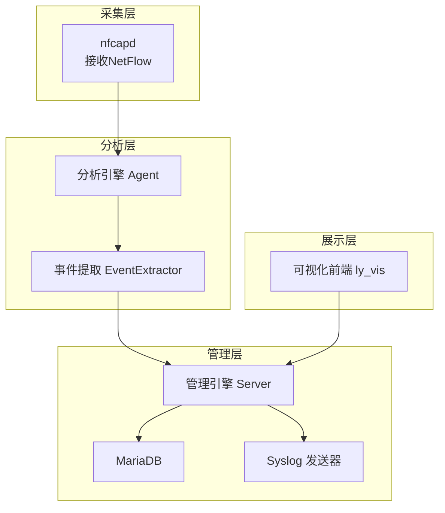
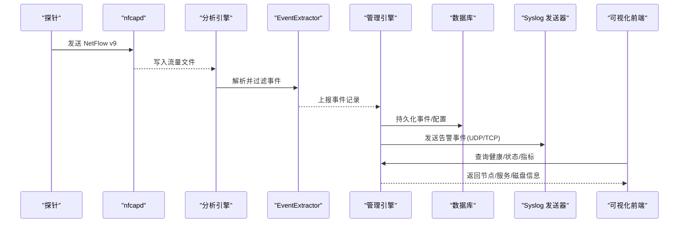
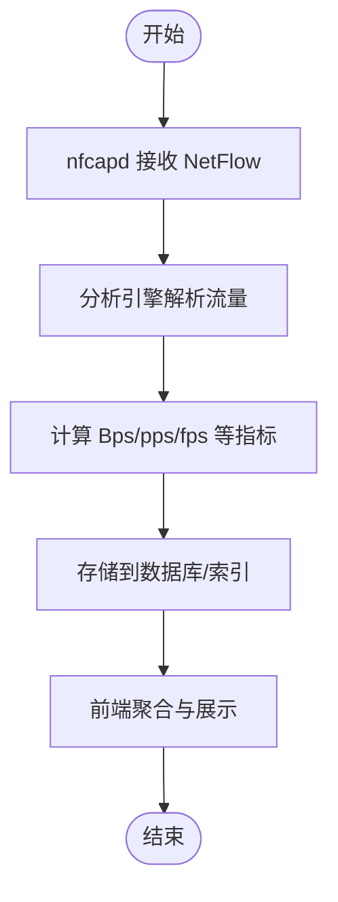
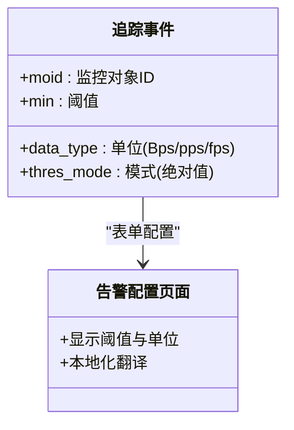
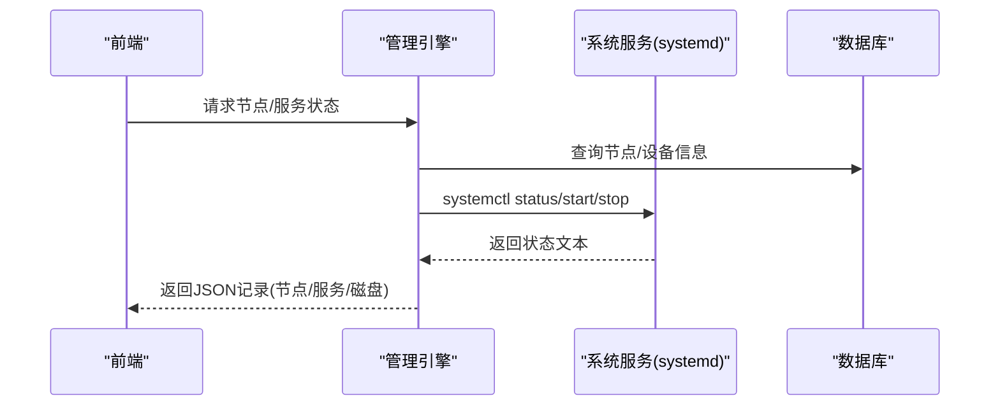
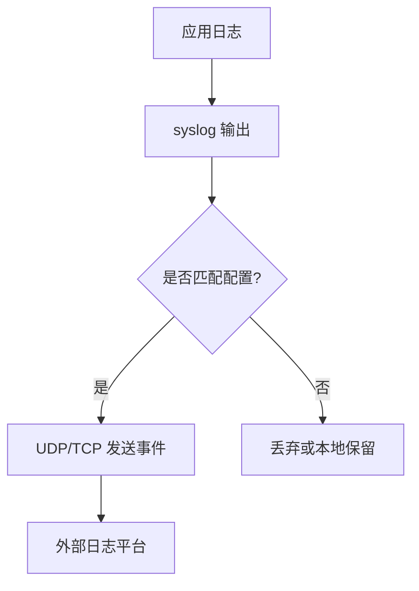
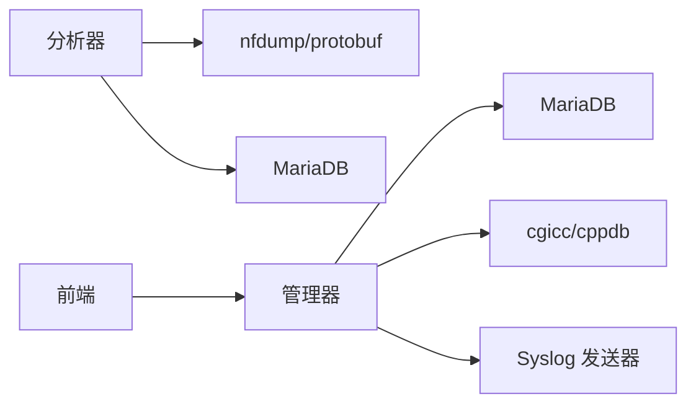

# 监控运维

<cite>
**本文引用的文件**
- [ly_analyser/README.md](file://ly_analyser/README.md)
- [ly_server/README.md](file://ly_server/README.md)
- [ly_vis/package.json](file://ly_vis/package.json)
- [event_extractor.cpp](file://ly_analyser/src/agent/handlers/event_extractor.cpp)
- [sctl.cpp](file://ly_server/src/server/sctl.cpp)
- [syslog_sender.cpp](file://ly_server/src/server/syslog_sender.cpp)
- [log.h（分析器）](file://ly_analyser/src/common/log.h)
- [log.h（服务器）](file://ly_server/src/common/log.h)
- [data-processor.js](file://ly_vis/packages/std/src/page/result/data-processor.js)
- [methods-traffic.jsx](file://ly_vis/packages/components/utils/universal/methods-traffic.jsx)
- [track/index.jsx](file://ly_vis/packages/std/src/page/track/store.js)
- [config-event/index.jsx](file://ly_vis/packages/std/src\page\config\page-child\config-event\index.jsx)
- [overview-ma/store.js](file://ly_vis/packages/std/src/page/overview/page-child/overview-ma/store.js)
- [config-device/index.jsx](file://ly_vis/packages/std/src/page/overview/page-child/overview-ma/components/config-device/index.jsx)
</cite>

## 目录
1. [简介](#简介)
2. [项目结构](#项目结构)
3. [核心组件](#核心组件)
4. [架构总览](#架构总览)
5. [详细组件分析](#详细组件分析)
6. [依赖关系分析](#依赖关系分析)
7. [性能与容量规划](#性能与容量规划)
8. [故障排查指南](#故障排查指南)
9. [结论](#结论)
10. [附录：运维操作清单](#附录：运维操作清单)

## 简介
本指南面向监控运维人员，围绕流影SOC系统的指标定义、采集方法、告警规则配置、日志收集与分析、健康检查与服务状态监控、资源使用监控、备份恢复与灾难恢复、自动化脚本与部署流水线、性能基准测试与扩容策略，以及常见问题诊断与解决方案库进行系统化说明。内容基于仓库中的分析引擎、管理引擎与可视化前端实现，提供可操作的步骤与排障要点。

## 项目结构
系统由三大子系统构成：
- 分析引擎 ly_analyser：接收并解析NetFlow数据，运行威胁检测模型，产出事件与特征，供后续取证与分析。
- 管理引擎 ly_server：聚合事件、设备与用户管理、配置下发、查询接口、服务控制与健康上报。
- 可视化 ly_vis：基于React的前端工程，提供监控追踪、告警配置、概览面板、设备管理等能力。

图表来源
- [ly_analyser/README.md:1-212](file://ly_analyser/README.md#L1-L212)
- [ly_server/README.md:1-233](file://ly_server/README.md#L1-L233)
- [sctl.cpp:336-506](file://ly_server/src/server/sctl.cpp#L336-L506)
- [syslog_sender.cpp:122-141](file://ly_server/src/server/syslog_sender.cpp#L122-L141)

章节来源
- [ly_analyser/README.md:1-212](file://ly_analyser/README.md#L1-L212)
- [ly_server/README.md:1-233](file://ly_server/README.md#L1-L233)

## 核心组件
- 指标与采集
  - NetFlow v9 流量元数据通过 nfcapd 采集并落盘，随后由分析引擎处理。
  - 指标维度包括字节量(Bps)、包速率(pps)、会话速率(fps)、协议、端口、方向等。
- 告警与追踪
  - 支持按监控对象（moid）、阈值（min）、单位（Bps/pps/fps）配置追踪事件。
  - 前端对阈值单位进行本地化翻译，便于运维理解。
- 健康检查与服务状态
  - 管理引擎通过 sctl 统一获取节点信息、服务状态、磁盘使用率，并可远程启停服务。
  - 前端概览页聚合设备与服务状态，支持开关HTTP服务等操作。
- 日志收集与外发
  - 系统内部日志通过 syslog 输出；管理引擎支持将事件以 Syslog UDP/TCP 发送到外部日志平台。
- 备份与恢复
  - 数据库初始化与导入流程在管理引擎安装文档中给出；建议定期导出数据库与关键配置。
- 自动化与流水线
  - 定时任务用于事件生成与配置推送；前端工程包含代码规范与提交钩子，便于持续集成。

章节来源
- [ly_analyser/README.md:130-184](file://ly_analyser/README.md#L130-L184)
- [ly_server/README.md:107-204](file://ly_server/README.md#L107-L204)
- [ly_vis/package.json:1-127](file://ly_vis/package.json#L1-L127)
- [data-processor.js:37-76](file://ly_vis/packages/std/src/page/result/data-processor.js#L37-L76)
- [methods-traffic.jsx:41-54](file://ly_vis/packages/components/utils/universal/methods-traffic.jsx#L41-L54)
- [config-event/index.jsx:311-375](file://ly_vis/packages/std/src/page/config/page-child/config-event/index.jsx#L311-L375)
- [overview-ma/store.js:120-195](file://ly_vis/packages/std/src/page/overview/page-child/overview-ma/store.js#L120-L195)
- [config-device/index.jsx:311-420](file://ly_vis/packages/std/src/page/overview/page-child/overview-ma/components/config-device/index.jsx#L311-L420)

## 架构总览
系统采用“采集-分析-管理-展示”的分层架构：
- 采集层：nfcapd 接收探针的 NetFlow v9 数据并持久化。
- 分析层：Agent 解析流量、运行检测模型，EventExtractor 过滤并生成事件。
- 管理层：Server 提供API、存储事件与配置、控制远端服务、上报健康与资源指标，并通过 Syslog 发送器向外投递事件。
- 展示层：前端提供监控追踪、告警配置、设备概览与运维操作界面。

图表来源
- [ly_analyser/README.md:175-184](file://ly_analyser/README.md#L175-L184)
- [event_extractor.cpp:24-54](file://ly_analyser/src/agent/handlers/event_extractor.cpp#L24-L54)
- [sctl.cpp:336-506](file://ly_server/src/server/sctl.cpp#L336-L506)
- [syslog_sender.cpp:122-141](file://ly_server/src/server/syslog_sender.cpp#L122-L141)

## 详细组件分析

### 指标定义与采集方法
- 指标维度
  - Bps：每秒字节数，用于衡量带宽占用。
  - pps：每秒数据包数，反映网络负载强度。
  - fps：每秒会话数，体现连接活跃度。
  - 其他：协议、端口、方向、时间戳、持续时间等。
- 采集路径
  - nfcapd 监听指定端口接收 NetFlow v9，写入 /data/flow 目录。
  - 分析引擎读取流量文件，提取特征并计算指标。
  - 前端结果页对指标进行聚合与格式化展示。

图表来源
- [ly_analyser/README.md:175-184](file://ly_analyser/README.md#L175-L184)
- [data-processor.js:37-76](file://ly_vis/packages/std/src/page/result/data-processor.js#L37-L76)

章节来源
- [ly_analyser/README.md:175-184](file://ly_analyser/README.md#L175-L184)
- [data-processor.js:37-76](file://ly_vis/packages/std/src/page/result/data-processor.js#L37-L76)
- [methods-traffic.jsx:41-54](file://ly_vis/packages/components/utils/universal/methods-traffic.jsx#L41-L54)

### 告警规则配置与追踪事件
- 配置项
  - 监控追踪条目（moid）：目标监控对象标识。
  - 阈值（min）：触发告警的绝对阈值。
  - 阈值单位（data_type）：Bps/pps/fps。
- 前端展示
  - 告警配置页面展示阈值与单位，并提供本地化翻译。
  - 追踪事件列表根据事件数量与指标排序高亮。

图表来源
- [track/index.jsx:1-30](file://ly_vis/packages/components/system/event-system/config/event/track/index.js#L1-L30)
- [config-event/index.jsx:311-375](file://ly_vis/packages/std/src/page/config/page-child/config-event/index.jsx#L311-L375)
- [methods-traffic.jsx:41-54](file://ly_vis/packages/components/utils/universal/methods-traffic.jsx#L41-L54)

章节来源
- [track/index.jsx:1-30](file://ly_vis/packages/components/system/event-system/config/event/track/index.js#L1-L30)
- [config-event/index.jsx:311-375](file://ly_vis/packages/std/src/page/config/page-child/config-event/index.jsx#L311-L375)
- [methods-traffic.jsx:41-54](file://ly_vis/packages/components/utils/universal/methods-traffic.jsx#L41-L54)

### 健康检查机制与服务状态监控
- 健康检查
  - 管理引擎通过 sctl 获取节点基础信息（server/agent/probe），并汇总服务状态。
  - 支持查询 SSH/HTTP 服务状态与磁盘使用率。
- 服务控制
  - 支持启动、重启、停止服务，并返回执行结果与状态。
- 前端操作
  - 概览页聚合设备与服务详情，支持切换 HTTP 服务开关。

图表来源
- [sctl.cpp:119-308](file://ly_server/src/server/sctl.cpp#L119-L308)
- [sctl.cpp:336-506](file://ly_server/src/server/sctl.cpp#L336-L506)
- [overview-ma/store.js:120-195](file://ly_vis/packages/std/src/page/overview/page-child/overview-ma/store.js#L120-L195)
- [config-device/index.jsx:311-420](file://ly_vis/packages/std/src/page/overview/page-child/overview-ma/components/config-device/index.jsx#L311-L420)

章节来源
- [sctl.cpp:119-308](file://ly_server/src/server/sctl.cpp#L119-L308)
- [sctl.cpp:336-506](file://ly_server/src/server/sctl.cpp#L336-L506)
- [overview-ma/store.js:120-195](file://ly_vis/packages/std/src/page/overview/page-child/overview-ma/store.js#L120-L195)
- [config-device/index.jsx:311-420](file://ly_vis/packages/std/src/page/overview/page-child/overview-ma/components/config-device/index.jsx#L311-L420)

### 资源使用监控
- 磁盘使用率
  - 通过 df -h 解析各挂载点使用百分比，仅关注 /home、/data、/ 等关键分区。
- 服务资源
  - 结合服务状态与进程存活情况，评估SSH/HTTP等服务可用性。
- 前端展示
  - 概览页以卡片形式呈现磁盘与服务状态，支持快速开关HTTP服务。

章节来源
- [sctl.cpp:266-308](file://ly_server/src/server/sctl.cpp#L266-L308)
- [overview-ma/store.js:120-195](file://ly_vis/packages/std/src/page/overview/page-child/overview-ma/store.js#L120-L195)
- [config-device/index.jsx:311-420](file://ly_vis/packages/std/src/page/overview/page-child/overview-ma/components/config-device/index.jsx#L311-L420)

### 日志收集策略、分析与故障排查
- 日志输出
  - 分析器与管理器均通过 syslog 输出错误、警告、信息级别日志。
  - 支持 DEBUG 环境变量控制调试输出范围。
- 事件外发
  - 管理引擎的 Syslog 发送器依据配置文件，将事件以 UDP/TCP 发送至外部日志平台。
- 分析建议
  - 结合前端告警时序与事件详情，定位异常峰值与持续时间段。
  - 通过系统日志与事件外发内容交叉验证问题根因。

图表来源
- [log.h（分析器）:6-40](file://ly_analyser/src/common/log.h#L6-L40)
- [log.h（服务器）:6-40](file://ly_server/src/common/log.h#L6-L40)
- [syslog_sender.cpp:16-141](file://ly_server/src/server/syslog_sender.cpp#L16-L141)

章节来源
- [log.h（分析器）:6-40](file://ly_analyser/src/common/log.h#L6-L40)
- [log.h（服务器）:6-40](file://ly_server/src/common/log.h#L6-L40)
- [syslog_sender.cpp:16-141](file://ly_server/src/server/syslog_sender.cpp#L16-L141)

### 备份恢复策略、数据归档与灾难恢复计划
- 数据库备份
  - 管理引擎安装文档提供数据库初始化与导入流程；建议定期导出 server 数据库。
- 配置备份
  - 分析器与管理器的配置文件、Syslog 发送器配置需纳入版本化管理。
- 灾难恢复
  - 准备离线安装包与依赖环境脚本；恢复时先重建数据库与配置，再启动服务。
  - 关键路径：nfcapd 数据目录、分析引擎工作目录、管理引擎 www 与配置目录。

章节来源
- [ly_server/README.md:159-193](file://ly_server/README.md#L159-L193)
- [ly_analyser/README.md:130-184](file://ly_analyser/README.md#L130-L184)

### 运维自动化脚本、部署流水线与维护工具
- 定时任务
  - 分析器：extractor 每5分钟执行一次，处理新流入的流量文件。
  - 管理器：config_pusher 与 gen_event 每5分钟执行，负责配置推送与事件生成。
- 前端工程
  - package.json 定义了 lint-staged、commitlint 等钩子，保障代码质量与提交规范。
- 维护工具
  - sctl 提供统一的服务控制与健康查询接口；可通过HTTP CGI调用。

章节来源
- [ly_analyser/README.md:175-184](file://ly_analyser/README.md#L175-L184)
- [ly_server/README.md:197-204](file://ly_server/README.md#L197-L204)
- [ly_vis/package.json:1-127](file://ly_vis/package.json#L1-L127)
- [sctl.cpp:336-506](file://ly_server/src/server/sctl.cpp#L336-L506)

### 性能基准测试、容量规划与扩容策略
- 基准测试
  - 以 Bps/pps/fps 为关键指标，结合历史峰值与增长趋势设定基线。
  - 通过前端结果页聚合统计，观察不同场景下的吞吐与延迟。
- 容量规划
  - 磁盘容量：关注 /data 与 /home 的使用率，预留至少20%余量。
  - 网络带宽：评估探针到分析器的链路容量，避免丢包。
- 扩容策略
  - 横向扩展：增加分析节点与存储节点，分散流量压力。
  - 纵向扩展：提升CPU/内存/磁盘IO，优化 nfcapd 与数据库参数。

[本节为通用指导，不直接分析具体文件]

## 依赖关系分析
- 组件耦合
  - 分析器依赖 nfdump 与 protobuf；管理器依赖 MariaDB、cgicc、cppdb、protobuf。
  - 前端依赖 React、Ant Design、D3 等库，通过 API 与管理器交互。
- 外部依赖
  - 操作系统：CentOS 7；防火墙开放端口 10081（分析器）、18080（管理器）。
  - 网络：Syslog UDP/TCP 端口默认 514，可按需调整。

图表来源
- [ly_analyser/README.md:29-95](file://ly_analyser/README.md#L29-L95)
- [ly_server/README.md:21-77](file://ly_server/README.md#L21-L77)
- [ly_vis/package.json:36-106](file://ly_vis/package.json#L36-L106)
- [syslog_sender.cpp:16-141](file://ly_server/src/server/syslog_sender.cpp#L16-L141)

章节来源
- [ly_analyser/README.md:29-95](file://ly_analyser/README.md#L29-L95)
- [ly_server/README.md:21-77](file://ly_server/README.md#L21-L77)
- [ly_vis/package.json:36-106](file://ly_vis/package.json#L36-L106)

## 性能与容量规划
- 指标基线
  - 建立 Bps/pps/fps 的基线曲线，识别异常波动。
- 资源监控
  - 定期巡检磁盘使用率与服务状态，及时扩容或清理。
- 调优建议
  - 调整 nfcapd 缓冲区与轮转策略，避免数据丢失。
  - 优化数据库索引与查询语句，提升查询性能。
- 容量评估
  - 根据峰值流量与增长预测，规划存储与带宽。

[本节为通用指导，不直接分析具体文件]

## 故障排查指南
- 常见问题
  - nfcapd 未接收数据：检查端口与防火墙，确认探针配置正确。
  - 事件未生成：检查 extractor 定时任务与输入文件路径。
  - 服务不可用：通过 sctl 查询状态并尝试重启。
  - 日志缺失：检查 syslog 配置与外部日志平台连通性。
- 定位方法
  - 查看系统日志与应用日志，结合前端告警时序定位问题。
  - 使用 sctl 获取节点与服务状态，判断是否为单点故障。
- 解决方案
  - 修复配置后重启相关服务；必要时回滚到已知稳定版本。
  - 清理临时文件与过期数据，释放磁盘空间。

章节来源
- [ly_analyser/README.md:175-184](file://ly_analyser/README.md#L175-L184)
- [ly_server/README.md:197-204](file://ly_server/README.md#L197-L204)
- [sctl.cpp:336-506](file://ly_server/src/server/sctl.cpp#L336-L506)
- [syslog_sender.cpp:122-141](file://ly_server/src/server/syslog_sender.cpp#L122-L141)

## 结论
本指南基于仓库中的实际实现，提供了从指标采集、告警配置、健康检查、日志外发到备份恢复与自动化运维的完整操作框架。建议结合生产环境的基线与容量规划，持续优化系统性能与稳定性，并建立完善的故障排查与回滚机制。

## 附录：运维操作清单
- 安装与部署
  - 安装依赖与环境配置（参考分析器与管理器 README）。
  - 编译部署并配置 httpd 与数据库。
- 运行与监控
  - 启动 nfcapd 并设置定时任务。
  - 通过前端概览页监控服务状态与磁盘使用率。
- 告警与日志
  - 配置追踪事件与阈值单位。
  - 配置 Syslog 发送器并验证外部日志平台接收。
- 备份与恢复
  - 定期导出数据库与配置文件。
  - 制定灾难恢复演练计划。
- 自动化与流水线
  - 启用前端代码规范与提交钩子。
  - 维护定时任务与脚本版本。

章节来源
- [ly_analyser/README.md:50-184](file://ly_analyser/README.md#L50-L184)
- [ly_server/README.md:45-204](file://ly_server/README.md#L45-L204)
- [ly_vis/package.json:1-127](file://ly_vis/package.json#L1-L127)