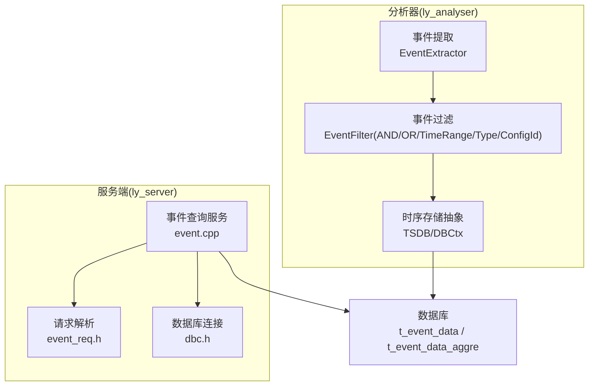
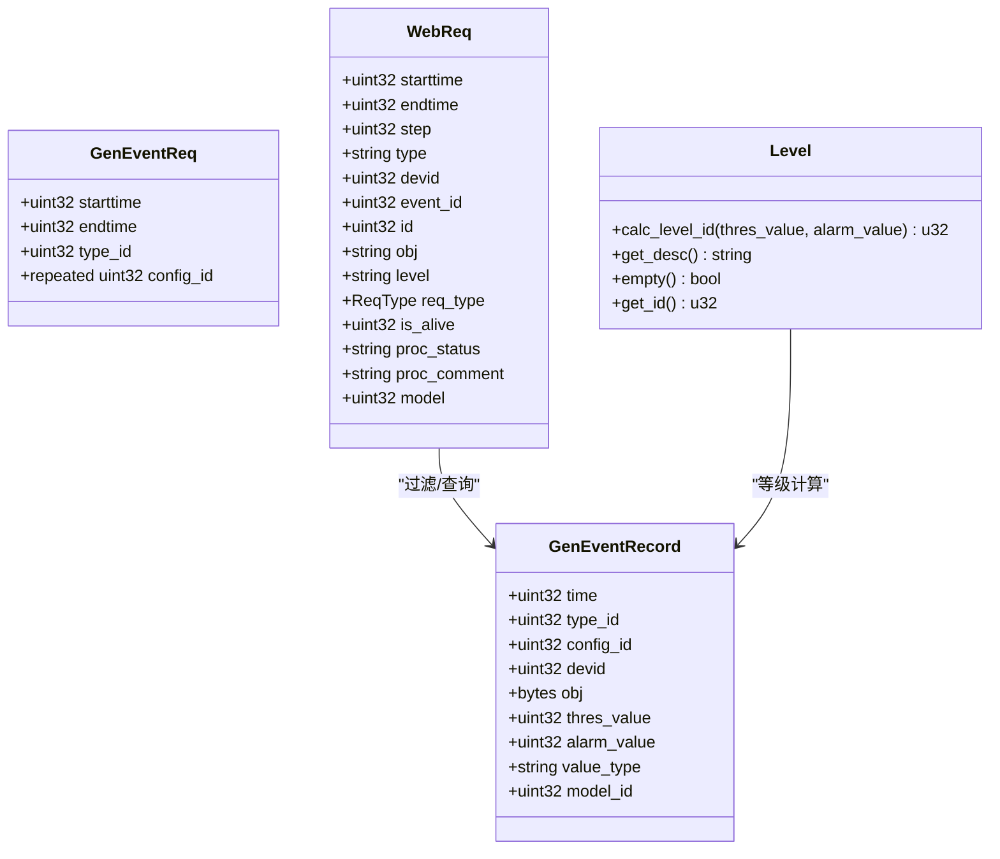
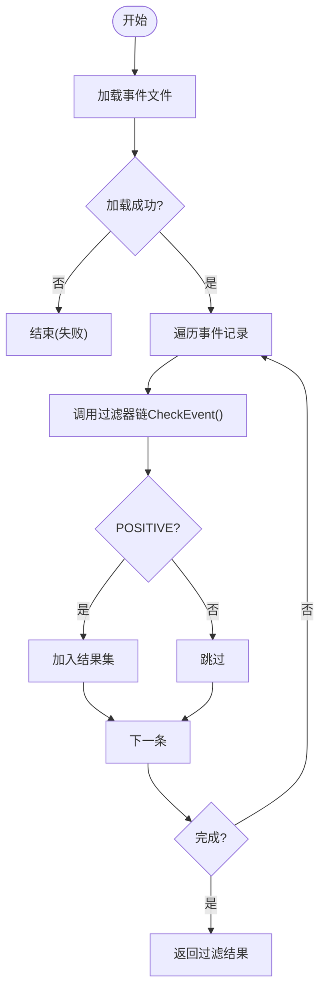
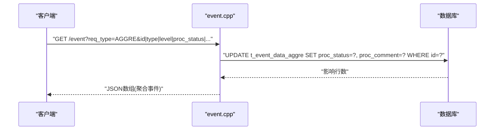
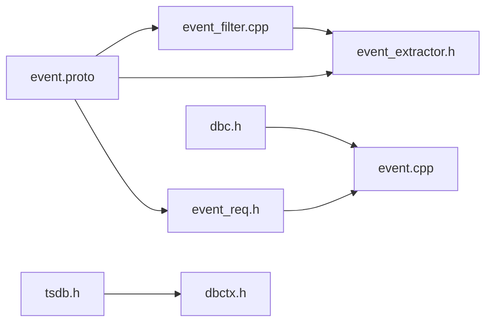

# 事件管理系统

<cite>
**本文引用的文件**
- [event.proto](file://ly_analyser/src/common/event.proto)
- [event.proto](file://ly_server/src/common/event.proto)
- [event.cpp](file://ly_server/src/server/event.cpp)
- [event_req.h](file://ly_server/src/common/event_req.h)
- [define.h](file://ly_server/src/server/define.h)
- [dbc.h](file://ly_server/src/server/dbc.h)
- [event_extractor.h](file://ly_analyser/src/agent/handlers/event_extractor.h)
- [event_extractor.cpp](file://ly_analyser/src/agent/handlers/event_extractor.cpp)
- [event_filter.h](file://ly_analyser/src/agent/handlers/event_filter.h)
- [event_filter.cpp](file://ly_analyser/src/agent/handlers/event_filter.cpp)
- [tsdb.h](file://ly_analyser/src/agent/data/tsdb.h)
- [dbctx.h](file://ly_analyser/src/agent/data/dbctx.h)
</cite>

## 目录
1. [简介](#简介)
2. [项目结构](#项目结构)
3. [核心组件](#核心组件)
4. [架构总览](#架构总览)
5. [详细组件分析](#详细组件分析)
6. [依赖关系分析](#依赖关系分析)
7. [性能考虑](#性能考虑)
8. [故障排查指南](#故障排查指南)
9. [结论](#结论)
10. [附录：API与数据模型](#附录api与数据模型)

## 简介
本技术文档面向事件管理系统的后端实现，覆盖安全事件的生成、存储、查询与处理全流程。重点说明事件数据结构定义、状态管理与生命周期控制；阐述事件聚合算法、时间窗口处理与统计计算方法；提供事件查询API的接口规范（过滤条件、分页与性能优化）；并给出最佳实践与故障排查指引。

## 项目结构
系统由分析器（Agent）、服务端（Server）与可视化前端组成。事件在分析器侧采集与过滤，在服务端侧进行持久化、聚合与对外查询。关键目录与职责如下：
- ly_analyser/src/agent：事件提取与过滤逻辑，基于规则组合对原始事件进行筛选。
- ly_analyser/src/common：公共协议与工具（如 event.proto）。
- ly_server/src/server：事件查询与聚合服务，提供HTTP/CGI接口，对接数据库。
- ly_server/src/common：公共协议与请求解析（如 event_req.h）。
- ly_vis：前端展示与交互（不在本文深入展开）。



图表来源
- [event_extractor.cpp:24-53](file://ly_analyser/src/agent/handlers/event_extractor.cpp#L24-L53)
- [event_filter.cpp:127-148](file://ly_analyser/src/agent/handlers/event_filter.cpp#L127-L148)
- [event.cpp:40-189](file://ly_server/src/server/event.cpp#L40-L189)
- [event.cpp:192-310](file://ly_server/src/server/event.cpp#L192-L310)
- [dbc.h:12-12](file://ly_server/src/server/dbc.h#L12-L12)

章节来源
- [event.proto:3-24](file://ly_analyser/src/common/event.proto#L3-L24)
- [event.proto:26-46](file://ly_analyser/src/common/event.proto#L26-L46)
- [event.cpp:324-356](file://ly_server/src/server/event.cpp#L324-L356)

## 核心组件
- 事件协议与请求
  - GenEventReq/GenEventRecord/WebReq：定义事件生成请求、记录结构与Web查询参数。
  - Level：用于根据阈值计算事件等级。
- 事件提取与过滤
  - EventExtractor：从文件加载Protobuf文本格式的事件，并通过过滤器链筛选。
  - EventFilter家族：时间范围、类型ID、配置ID以及AND/OR组合过滤器。
- 事件查询与聚合
  - process()：按时间、类型、设备、对象、级别等条件查询原始事件表。
  - process_aggre()：查询聚合事件表，支持处理状态更新。
  - set_proc_status()：更新聚合事件的处理状态与备注。
- 数据存储
  - TSDB/DBCtx：分析器侧的时序KV存储抽象，支持缓存与迭代扫描。
  - 服务端通过cppdb访问MySQL类数据库，使用参数化查询避免注入。

章节来源
- [event.proto:3-24](file://ly_analyser/src/common/event.proto#L3-L24)
- [event.proto:26-46](file://ly_analyser/src/common/event.proto#L26-L46)
- [event_req.h:17-36](file://ly_server/src/common/event_req.h#L17-L36)
- [event_extractor.cpp:24-53](file://ly_analyser/src/agent/handlers/event_extractor.cpp#L24-L53)
- [event_filter.cpp:13-148](file://ly_analyser/src/agent/handlers/event_filter.cpp#L13-L148)
- [event.cpp:40-189](file://ly_server/src/server/event.cpp#L40-L189)
- [event.cpp:192-310](file://ly_server/src/server/event.cpp#L192-L310)
- [event.cpp:312-321](file://ly_server/src/server/event.cpp#L312-L321)
- [tsdb.h:11-76](file://ly_analyser/src/agent/data/tsdb.h#L11-L76)
- [dbctx.h:9-85](file://ly_analyser/src/agent/data/dbctx.h#L9-L85)

## 架构总览
事件从分析器产生，经过滤后写入本地或外部存储；服务端提供查询与聚合能力，并将结果以JSON数组形式返回给前端。

```mermaid
sequenceDiagram
participant FE as "前端"
participant CGI as "CGI入口(event.cpp)"
participant Q as "查询处理器(process/process_aggre)"
participant DB as "数据库(t_event_data/t_event_data_aggre)"
FE->>CGI : "GET /event?req_type=ORI|AGGRE&starttime|endtime|type|devid|..."
CGI->>CGI : "解析WebReq(时间/类型/设备等)"
alt req_type == ORI
CGI->>Q : "process()"
Q->>DB : "SELECT ... WHERE time>=? AND time<=? ..."
DB-->>Q : "原始事件行集"
Q-->>CGI : "JSON数组"
else req_type == AGGRE
CGI->>Q : "process_aggre()"
Q->>DB : "SELECT ... WHERE starttime<=? AND endtime>=? ..."
DB-->>Q : "聚合事件行集"
Q-->>CGI : "JSON数组"
end
CGI-->>FE : "Content-Type : application/javascript; charset=UTF-8<br/>[...]"
```

图表来源
- [event.cpp:324-356](file://ly_server/src/server/event.cpp#L324-L356)
- [event.cpp:40-189](file://ly_server/src/server/event.cpp#L40-L189)
- [event.cpp:192-310](file://ly_server/src/server/event.cpp#L192-L310)

## 详细组件分析

### 事件数据结构与生命周期
- 事件记录字段
  - 时间戳、类型ID、配置ID、设备ID、对象、阈值、告警值、值类型、模型ID等。
- Web查询参数
  - 起止时间、步长、类型、设备、事件ID、对象、级别、是否存活、处理状态与备注、模型等。
- 事件等级计算
  - 根据阈值与告警值映射到具体等级描述。



图表来源
- [event.proto:3-24](file://ly_analyser/src/common/event.proto#L3-L24)
- [event.proto:26-46](file://ly_analyser/src/common/event.proto#L26-L46)
- [event_req.h:17-36](file://ly_server/src/common/event_req.h#L17-L36)

章节来源
- [event.proto:3-24](file://ly_analyser/src/common/event.proto#L3-L24)
- [event.proto:26-46](file://ly_analyser/src/common/event.proto#L26-L46)
- [event_req.h:17-36](file://ly_server/src/common/event_req.h#L17-L36)

### 事件提取与过滤流程
- 事件提取
  - 从文件读取Protobuf文本格式的事件集合，交换到内部容器。
- 过滤策略
  - 时间范围、类型ID、配置ID三类基础过滤器。
  - AND/OR组合：AND默认不强校验空子过滤器；OR任一满足即通过。
  - 工厂方法根据请求动态构建过滤器树。



图表来源
- [event_extractor.cpp:24-53](file://ly_analyser/src/agent/handlers/event_extractor.cpp#L24-L53)
- [event_filter.cpp:13-148](file://ly_analyser/src/agent/handlers/event_filter.cpp#L13-L148)

章节来源
- [event_extractor.h:11-23](file://ly_analyser/src/agent/handlers/event_extractor.h#L11-L23)
- [event_extractor.cpp:24-53](file://ly_analyser/src/agent/handlers/event_extractor.cpp#L24-L53)
- [event_filter.h:10-43](file://ly_analyser/src/agent/handlers/event_filter.h#L10-L43)
- [event_filter.cpp:13-148](file://ly_analyser/src/agent/handlers/event_filter.cpp#L13-L148)

### 事件查询与聚合
- 原始事件查询
  - 支持按时间区间、类型、模型、设备、事件ID、对象、级别等条件过滤，按时间排序输出。
  - 支持step对齐时间字段，便于前端绘图。
- 聚合事件查询
  - 支持按起止时间、ID、类型、模型、设备、事件ID、对象、级别、存活状态、处理状态与备注过滤。
  - 输出包含峰值、平均值、子事件数、持续时长等统计字段。
- 处理状态更新
  - 通过SET_PROC_STATUS更新聚合事件的处理状态与备注。



图表来源
- [event.cpp:40-189](file://ly_server/src/server/event.cpp#L40-L189)
- [event.cpp:312-321](file://ly_server/src/server/event.cpp#L312-L321)

章节来源
- [event.cpp:40-189](file://ly_server/src/server/event.cpp#L40-L189)
- [event.cpp:192-310](file://ly_server/src/server/event.cpp#L192-L310)
- [event.cpp:312-321](file://ly_server/src/server/event.cpp#L312-L321)

### 时间窗口与统计计算
- 时间窗口
  - 原始事件查询支持step对齐，将时间归整到指定步长起点，便于等间隔采样。
- 统计指标
  - 聚合事件包含alarm_peak（峰值）、alarm_avg（均值）、sub_events（子事件数）、duration（持续时长）等。
- 等级计算
  - 根据thres_value与alarm_value映射为等级ID与描述。

章节来源
- [event.cpp:260-262](file://ly_server/src/server/event.cpp#L260-L262)
- [event_req.h:17-36](file://ly_server/src/common/event_req.h#L17-L36)

### 状态管理与生命周期
- 处理状态
  - 未处理/已确认/已处理三种状态，可通过API更新。
- 活跃状态
  - is_alive标识事件是否仍活跃，可用于过滤与展示。
- 生命周期
  - 事件从生成、过滤、入库、聚合到可被查询与处置，形成完整闭环。

章节来源
- [event.cpp:40-189](file://ly_server/src/server/event.cpp#L40-L189)
- [event.cpp:312-321](file://ly_server/src/server/event.cpp#L312-L321)

## 依赖关系分析
- 模块耦合
  - event.cpp依赖event.proto定义的WebReq与事件结构，依赖event_req.h进行参数解析，依赖dbc.h建立数据库会话。
  - 分析器侧EventExtractor依赖EventFilter家族，后者依赖event.proto中的GenEventReq/GenEventRecord。
- 外部依赖
  - cppdb用于数据库访问；Protobuf用于序列化；CGI用于HTTP入口。



图表来源
- [event.proto:3-46](file://ly_analyser/src/common/event.proto#L3-L46)
- [event_req.h:1-36](file://ly_server/src/common/event_req.h#L1-L36)
- [event.cpp:1-14](file://ly_server/src/server/event.cpp#L1-L14)
- [event_extractor.h:1-23](file://ly_analyser/src/agent/handlers/event_extractor.h#L1-L23)
- [event_filter.cpp:1-148](file://ly_analyser/src/agent/handlers/event_filter.cpp#L1-L148)
- [tsdb.h:11-76](file://ly_analyser/src/agent/data/tsdb.h#L11-L76)
- [dbctx.h:9-85](file://ly_analyser/src/agent/data/dbctx.h#L9-L85)

章节来源
- [event.cpp:1-14](file://ly_server/src/server/event.cpp#L1-L14)
- [event_req.h:1-36](file://ly_server/src/common/event_req.h#L1-L36)
- [event.proto:3-46](file://ly_analyser/src/common/event.proto#L3-L46)

## 性能考虑
- 查询优化
  - 使用参数化SQL避免注入与重复编译；按需添加WHERE条件减少无效扫描。
  - 对常用过滤字段（如starttime/endtime、type、devid、obj、level）建立索引以提升查询效率。
- 时间对齐
  - 使用step对齐时间字段，降低前端渲染压力，提高图表绘制性能。
- 聚合查询
  - 聚合表应预计算峰值、均值、子事件数与持续时长，避免实时重算。
- 存储层
  - 分析器侧TSDB支持缓存与迭代扫描，适合时序数据的批量读取与过滤。
- 并发与资源
  - 数据库会话按需创建与释放，避免连接泄漏；日志输出缓冲减少IO开销。

章节来源
- [event.cpp:40-189](file://ly_server/src/server/event.cpp#L40-L189)
- [event.cpp:192-310](file://ly_server/src/server/event.cpp#L192-L310)
- [tsdb.h:11-76](file://ly_analyser/src/agent/data/tsdb.h#L11-L76)

## 故障排查指南
- 常见错误
  - 参数非法：检查WebReq解析是否成功，确认必填字段与类型。
  - 数据库异常：捕获cppdb异常并记录日志，核对SQL与参数绑定顺序。
  - 状态更新失败：确认id存在且权限正确，检查事务与锁竞争。
- 定位步骤
  - 开启调试模式（dbg参数），查看请求URL与日志输出。
  - 验证数据库表结构与索引是否存在。
  - 逐步缩小过滤条件，定位慢查询或无结果原因。
- 恢复建议
  - 回滚错误状态更新；重建必要索引；调整step或时间窗口以减少负载。

章节来源
- [event.cpp:324-356](file://ly_server/src/server/event.cpp#L324-L356)
- [event.cpp:184-186](file://ly_server/src/server/event.cpp#L184-L186)
- [event.cpp:316-320](file://ly_server/src/server/event.cpp#L316-L320)

## 结论
本系统实现了从事件生成、过滤、存储到查询与处理的完整链路。通过灵活的过滤器组合、标准化的协议与清晰的API设计，支撑了高效的事件检索与可视化。建议在大规模部署时完善索引策略、监控慢查询与资源占用，并结合前端分页与增量刷新提升整体体验。

## 附录：API与数据模型

### 事件查询API
- 入口
  - CGI脚本路径由部署决定，通过环境变量识别HTTP模式。
- 请求参数（WebReq）
  - starttime/endtime：时间区间（秒级时间戳）。
  - step：时间对齐步长（仅原始事件查询有效）。
  - type/model/devid/event_id/obj/level：多维过滤条件。
  - req_type：ORI（原始事件）、AGGRE（聚合事件）、SET_PROC_STATUS（设置处理状态）。
  - is_alive/proc_status/proc_comment/model：聚合事件相关字段。
- 响应格式
  - Content-Type: application/javascript; charset=UTF-8
  - 主体为JSON数组，元素为事件对象键值对。
- 示例调用
  - 获取聚合事件：GET /event?req_type=AGGRE&starttime=...&endtime=...&type=...
  - 设置处理状态：GET /event?req_type=SET_PROC_STATUS&id=...&proc_status=processed&proc_comment=已处理

章节来源
- [event.cpp:324-356](file://ly_server/src/server/event.cpp#L324-L356)
- [event.proto:26-46](file://ly_analyser/src/common/event.proto#L26-L46)

### 数据库操作要点
- 原始事件表
  - 字段包括id、time、event_id、type、model、devid、level、obj、thres_value、alarm_value、value_type、desc等。
- 聚合事件表
  - 字段包括id、event_id、devid、obj、type、model、level、alarm_peak、sub_events、alarm_avg、value_type、desc、duration、starttime、endtime、is_alive、proc_status、proc_comment等。
- 连接与执行
  - 通过start_db_session建立会话，使用参数化语句绑定查询参数。
  - 更新处理状态时使用UPDATE语句并捕获异常。

章节来源
- [event.cpp:40-189](file://ly_server/src/server/event.cpp#L40-L189)
- [event.cpp:192-310](file://ly_server/src/server/event.cpp#L192-L310)
- [event.cpp:312-321](file://ly_server/src/server/event.cpp#L312-L321)
- [dbc.h:12-12](file://ly_server/src/server/dbc.h#L12-L12)

### 事件等级与状态
- 等级计算
  - 依据阈值与告警值映射至等级ID与描述。
- 处理状态
  - 未处理/已确认/已处理，支持批量更新与注释。

章节来源
- [event_req.h:17-36](file://ly_server/src/common/event_req.h#L17-L36)

### 存储与缓存
- 分析器侧
  - TSDB封装底层DBCtx，提供按时间窗口的Put/Get/Scan与Size统计，支持缓存加速。
- 服务端侧
  - 直接通过cppdb访问关系型数据库，适合复杂查询与聚合。

章节来源
- [tsdb.h:11-76](file://ly_analyser/src/agent/data/tsdb.h#L11-L76)
- [dbctx.h:9-85](file://ly_analyser/src/agent/data/dbctx.h#L9-L85)