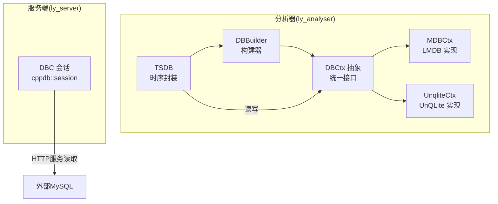
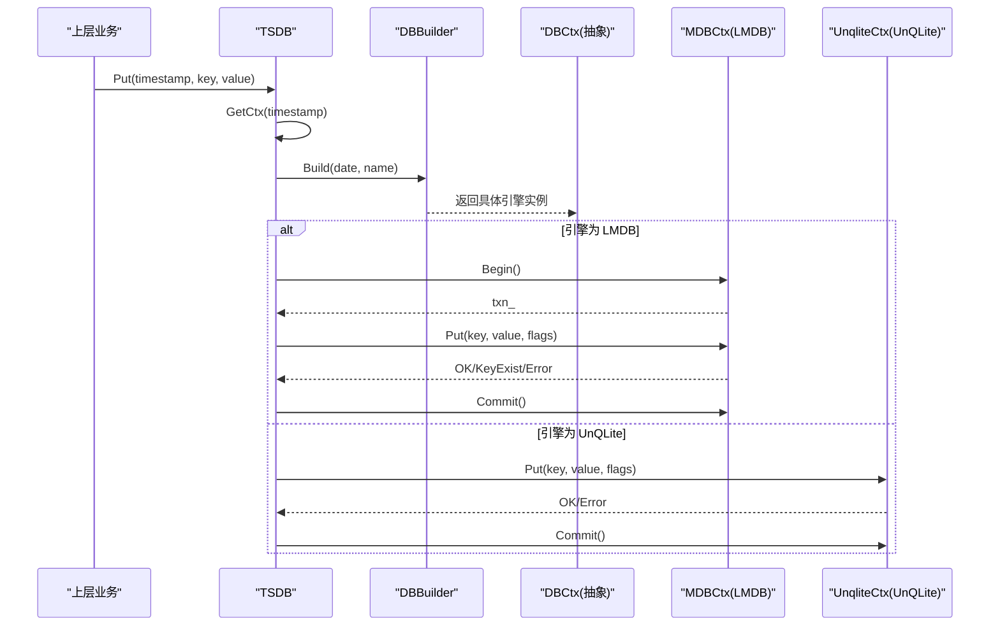
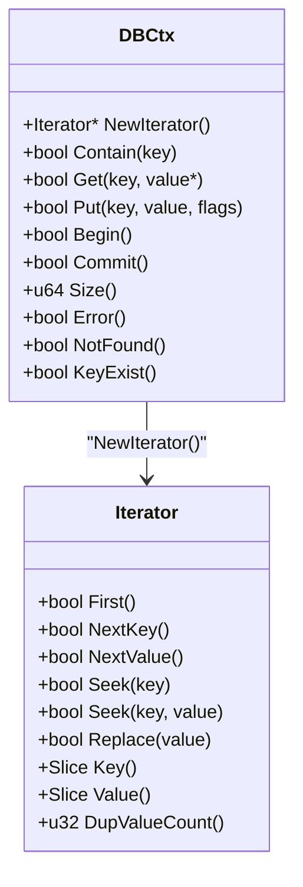
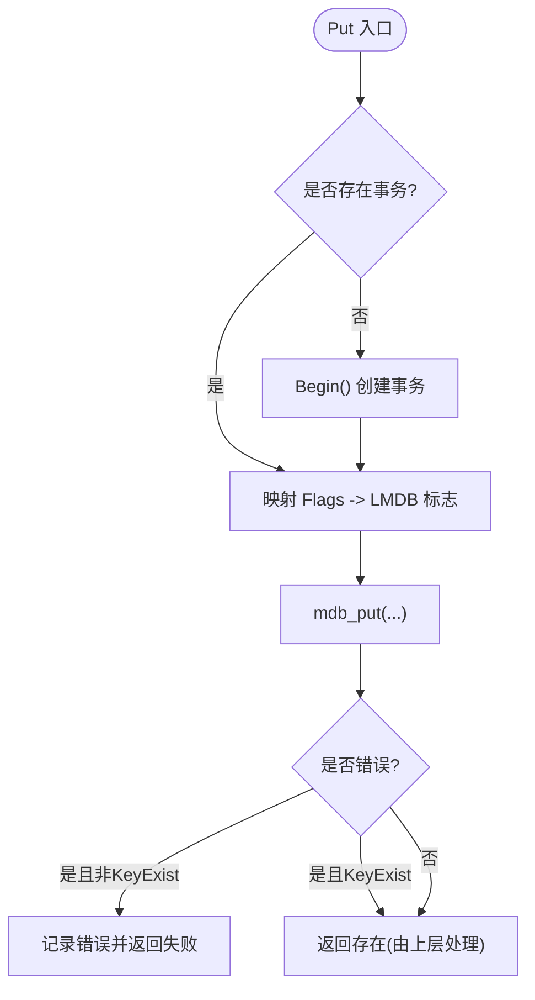
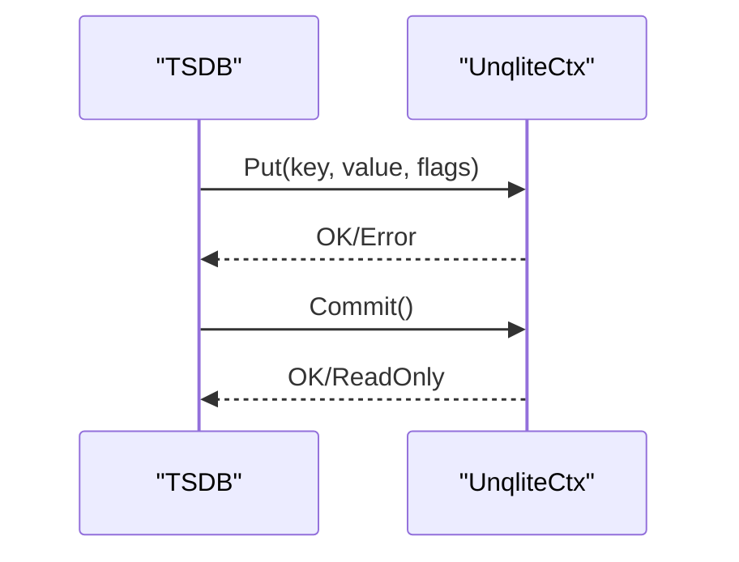
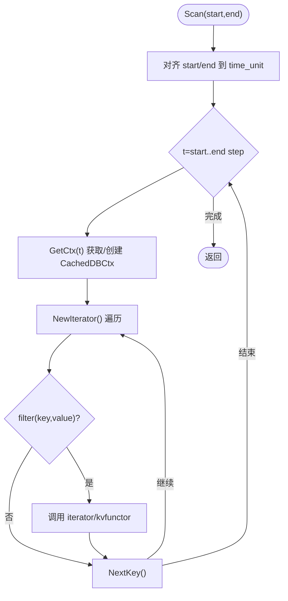
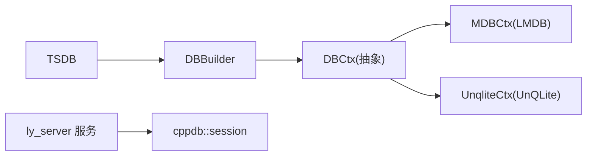

# 数据库访问层

<cite>
**本文引用的文件**
- [dbctx.h](file://ly_analyser/src/agent/data/dbctx.h)
- [dbctx.cpp](file://ly_analyser/src/agent/data/dbctx.cpp)
- [mdb.h](file://ly_analyser/src/agent/data/mdb.h)
- [mdb.cpp](file://ly_analyser/src/agent/data/mdb.cpp)
- [unqlite_db.h](file://ly_analyser/src/agent/data/unqlite_db.h)
- [unqlite_db.cpp](file://ly_analyser/src/agent/data/unqlite_db.cpp)
- [tsdb.h](file://ly_analyser/src/agent/data/tsdb.h)
- [tsdb.cpp](file://ly_analyser/src/agent/data/tsdb.cpp)
- [dbc.h](file://ly_server/src/server/dbc.h)
- [dbc.cpp](file://ly_server/src/server/dbc.cpp)
</cite>

## 目录
1. [简介](#简介)
2. [项目结构](#项目结构)
3. [核心组件](#核心组件)
4. [架构总览](#架构总览)
5. [详细组件分析](#详细组件分析)
6. [依赖关系分析](#依赖关系分析)
7. [性能考虑](#性能考虑)
8. [故障排查指南](#故障排查指南)
9. [结论](#结论)
10. [附录：API与使用示例](#附录api与使用示例)

## 简介
本技术文档聚焦于本项目中的数据库访问层，覆盖以下主题：
- 连接与事务管理：统一抽象接口、多引擎实现（LMDB、UnQLite）、事务开启与提交。
- 时序数据组织：按时间分片存储、缓存策略、扫描与聚合。
- ORM与查询构建：键值抽象、迭代器遍历、过滤器回调、范围扫描。
- 表结构与索引：基于底层引擎的键值模型、重复值排序与固定长度优化。
- API与用法：CRUD、批量写入、并发控制、错误处理。
- 监控与调优：慢查询定位、日志与统计、内存映射与页大小配置。
- 最佳实践：写路径、读路径、事务边界、资源释放与异常安全。

## 项目结构
数据库访问层主要位于 ly_analyser 子模块中，提供统一的 DBCtx 抽象与 TSDB 时序封装；服务器端 ly_server 通过 cppdb 提供 MySQL 会话创建能力。

图表来源
- [tsdb.h:11-76](file://ly_analyser/src/agent/data/tsdb.h#L11-L76)
- [dbctx.h:9-85](file://ly_analyser/src/agent/data/dbctx.h#L9-L85)
- [mdb.h:8-34](file://ly_analyser/src/agent/data/mdb.h#L8-L34)
- [unqlite_db.h:11-36](file://ly_analyser/src/agent/data/unqlite_db.h#L11-L36)
- [dbc.h:12-14](file://ly_server/src/server/dbc.h#L12-L14)

章节来源
- [tsdb.h:11-76](file://ly_analyser/src/agent/data/tsdb.h#L11-L76)
- [dbctx.h:9-85](file://ly_analyser/src/agent/data/dbctx.h#L9-L85)
- [mdb.h:8-34](file://ly_analyser/src/agent/data/mdb.h#L8-L34)
- [unqlite_db.h:11-36](file://ly_analyser/src/agent/data/unqlite_db.h#L11-L36)
- [dbc.h:12-14](file://ly_server/src/server/dbc.h#L12-L14)

## 核心组件
- DBCtx 抽象：定义统一的键值存取、迭代器、事务、错误状态等接口，屏蔽底层引擎差异。
- DBBuilder：根据配置选择具体引擎并构造 DBCtx，自动创建目录、设置路径与名称，并在构建后开启事务。
- MDBCtx：基于 LMDB 的实现，支持事务、游标迭代、重复值排序、内存映射大小配置、只读模式等。
- UnqliteCtx：基于 UnQLite 的 KV 实现，提供基本 CRUD、迭代器、提交与错误检测。
- TSDB：时序数据库封装，按时间单位分片到不同子库，内部维护 CachedDBCtx 缓存层，提供范围扫描、过滤与统计。

章节来源
- [dbctx.h:9-85](file://ly_analyser/src/agent/data/dbctx.h#L9-L85)
- [dbctx.cpp:9-39](file://ly_analyser/src/agent/data/dbctx.cpp#L9-L39)
- [mdb.h:8-34](file://ly_analyser/src/agent/data/mdb.h#L8-L34)
- [mdb.cpp:94-311](file://ly_analyser/src/agent/data/mdb.cpp#L94-L311)
- [unqlite_db.h:11-36](file://ly_analyser/src/agent/data/unqlite_db.h#L11-L36)
- [unqlite_db.cpp:123-187](file://ly_analyser/src/agent/data/unqlite_db.cpp#L123-L187)
- [tsdb.h:11-76](file://ly_analyser/src/agent/data/tsdb.h#L11-L76)
- [tsdb.cpp:11-176](file://ly_analyser/src/agent/data/tsdb.cpp#L11-L176)

## 架构总览
下图展示了从应用调用到具体引擎的完整链路，包括事务边界、迭代器与缓存机制。

图表来源
- [tsdb.cpp:111-120](file://ly_analyser/src/agent/data/tsdb.cpp#L111-L120)
- [tsdb.cpp:61-73](file://ly_analyser/src/agent/data/tsdb.cpp#L61-L73)
- [dbctx.cpp:14-39](file://ly_analyser/src/agent/data/dbctx.cpp#L14-L39)
- [mdb.cpp:250-297](file://ly_analyser/src/agent/data/mdb.cpp#L250-L297)
- [unqlite_db.cpp:168-185](file://ly_analyser/src/agent/data/unqlite_db.cpp#L168-L185)

## 详细组件分析

### DBCtx 抽象与迭代器
- 统一接口：包含 Contain/Get/Put/Begin/Commit/Size/Error/NotFound/KeyExist 等方法。
- 迭代器：First/NextKey/NextValue/Seek/Replace/Key/Value/DupValueCount，支持精确查找与顺序遍历。
- 标志位：DEFAULT/NODUPDATA/NOOVERWRITE/APPEND/APPENDDUP，用于控制写入行为与重复值策略。

图表来源
- [dbctx.h:9-74](file://ly_analyser/src/agent/data/dbctx.h#L9-L74)

章节来源
- [dbctx.h:9-74](file://ly_analyser/src/agent/data/dbctx.h#L9-L74)

### LMDB 实现（MDBCtx）
- 事务与数据库句柄：在 Begin 时创建事务并打开 DBI，支持只读模式与 DUPSORT/DUPFIXED。
- 写入策略：将 DBCtx::Flags 映射到 LMDB 标志（NODUPDATA/NOOVERWRITE/APPEND/APPENDDUP）。
- 迭代器：基于 MDB_cursor，支持 NEXT_NODUP/NEXT_DUP、GET_BOTH、CURRENT 替换。
- 性能与容量：可配置 mapsize，针对特定路径（如 xday）动态计算页面大小对齐。
- 错误处理：统一 error_code_ 与 NotFound/KeyExist 判断，限制错误日志频率。

图表来源
- [mdb.cpp:196-240](file://ly_analyser/src/agent/data/mdb.cpp#L196-L240)
- [mdb.cpp:250-297](file://ly_analyser/src/agent/data/mdb.cpp#L250-L297)

章节来源
- [mdb.cpp:94-311](file://ly_analyser/src/agent/data/mdb.cpp#L94-L311)
- [mdb.h:8-34](file://ly_analyser/src/agent/data/mdb.h#L8-L34)

### UnQLite 实现（UnqliteCtx）
- 打开与关闭：Create 中根据只读标志选择 UNQLITE_OPEN_READONLY/UNQLITE_OPEN_CREATE。
- 迭代器：基于 unqlite_kv_cursor，支持 first/next_entry、seek、key/value 回调读取。
- 写入与提交：Put 直接存储键值对，Commit 调用底层提交并处理只读场景。
- 错误与不存在：Error/NotFound 基于 UNQLITE_OK/UNQLITE_NOTFOUND 判断。

图表来源
- [unqlite_db.cpp:168-185](file://ly_analyser/src/agent/data/unqlite_db.cpp#L168-L185)
- [unqlite_db.cpp:130-146](file://ly_analyser/src/agent/data/unqlite_db.cpp#L130-L146)

章节来源
- [unqlite_db.cpp:123-187](file://ly_analyser/src/agent/data/unqlite_db.cpp#L123-L187)
- [unqlite_db.h:11-36](file://ly_analyser/src/agent/data/unqlite_db.h#L11-L36)

### TSDB 时序封装与缓存
- 时间分片：按 time_unit 对齐时间戳，每个时间片对应一个子库（日期+名称），通过 DBBuilder 构建。
- 缓存层：CachedDBCtx 可选启用内存缓存，支持整库缓存或按需缓存，Put 时同步缓存。
- 扫描与过滤：Scan 支持 KVFunctor、IteratorFunctor 与 FilterFunctor/StringFilterFunctor，跨时间片聚合。
- 统计：Size(starttime, endtime) 可带过滤条件计数或直接累加各子库条目数。

图表来源
- [tsdb.cpp:150-175](file://ly_analyser/src/agent/data/tsdb.cpp#L150-L175)
- [tsdb.cpp:61-73](file://ly_analyser/src/agent/data/tsdb.cpp#L61-L73)
- [tsdb.cpp:21-57](file://ly_analyser/src/agent/data/tsdb.cpp#L21-L57)

章节来源
- [tsdb.cpp:11-176](file://ly_analyser/src/agent/data/tsdb.cpp#L11-L176)
- [tsdb.h:11-76](file://ly_analyser/src/agent/data/tsdb.h#L11-L76)

### 服务器端数据库会话（MySQL）
- 会话创建：start_db_session 读取配置文件中的密码，拼接连接串创建 cppdb::session。
- 用途：供 ly_server 服务层访问 MySQL 进行配置与元数据管理。

章节来源
- [dbc.cpp:3-26](file://ly_server/src/server/dbc.cpp#L3-L26)
- [dbc.h:12-14](file://ly_server/src/server/dbc.h#L12-L14)

## 依赖关系分析
- TSDB 依赖 DBBuilder 与 DBCtx 抽象，不直接耦合具体引擎。
- DBBuilder 根据配置选择 LMDB 或 UnQLite 实现。
- LMDB 实现依赖 LMDB 库，UnQLite 实现依赖 UnQLite 库。
- 服务器端通过 cppdb 访问 MySQL，与 ly_analyser 的本地 KV 存储解耦。

图表来源
- [tsdb.h:11-76](file://ly_analyser/src/agent/data/tsdb.h#L11-L76)
- [dbctx.cpp:14-39](file://ly_analyser/src/agent/data/dbctx.cpp#L14-L39)
- [mdb.h:8-34](file://ly_analyser/src/agent/data/mdb.h#L8-L34)
- [unqlite_db.h:11-36](file://ly_analyser/src/agent/data/unqlite_db.h#L11-L36)
- [dbc.h:12-14](file://ly_server/src/server/dbc.h#L12-L14)

章节来源
- [tsdb.h:11-76](file://ly_analyser/src/agent/data/tsdb.h#L11-L76)
- [dbctx.cpp:14-39](file://ly_analyser/src/agent/data/dbctx.cpp#L14-L39)
- [mdb.h:8-34](file://ly_analyser/src/agent/data/mdb.h#L8-L34)
- [unqlite_db.h:11-36](file://ly_analyser/src/agent/data/unqlite_db.h#L11-L36)
- [dbc.h:12-14](file://ly_server/src/server/dbc.h#L12-L14)

## 性能考虑
- 写入路径优化
  - 使用 APPEND/APPENDDUP 提升追加写入效率（LMDB）。
  - 合理设置 time_unit，减少跨分片扫描次数。
  - 启用 CachedDBCtx 的整库缓存以加速热点读（注意内存占用）。
- 读路径优化
  - 优先使用 Seek 精确查找，避免全量扫描。
  - 使用 FilterFunctor 在服务端过滤，减少回调开销。
- 事务与提交
  - 批量写入合并为一次事务提交，降低提交成本。
  - 对于只读场景，使用只读事务避免不必要的锁竞争。
- 内存与容量
  - LMDB 针对大库调整 mapsize，确保足够映射空间。
  - 关注迭代器生命周期，及时释放以避免资源泄漏。
- 日志与监控
  - DEBUG 模式下记录关键操作与错误，生产环境建议降低日志级别。
  - 通过 Size 与 Scan 结果评估数据增长与扫描耗时。

[本节为通用指导，不直接分析具体文件]

## 故障排查指南
- 常见错误
  - LMDB 错误码：通过 Error()/ErrorMsg() 获取详细信息，结合 NotFound/KeyExist 区分“未找到”和“键已存在”。
  - UnQLite 错误：Error() 基于 UNQLITE_OK 判断，NotFound() 基于 UNQLITE_NOTFOUND。
- 事务问题
  - 确认 Begin/Commit 成对出现，析构时若 auto_commit 开启会自动提交。
  - 只读模式下 Commit 可能返回只读错误，需在上层忽略或分支处理。
- 迭代器问题
  - 检查 NextKey/NextValue 返回值，确保循环终止条件正确。
  - 避免在迭代过程中修改同一 DB 导致未定义行为。
- 性能退化
  - 扫描范围过大或过滤条件不当会导致全表扫描，建议缩小时间窗口与增加过滤。
  - 频繁小写操作应合并为批量写入。

章节来源
- [mdb.cpp:107-149](file://ly_analyser/src/agent/data/mdb.cpp#L107-L149)
- [mdb.cpp:167-240](file://ly_analyser/src/agent/data/mdb.cpp#L167-L240)
- [mdb.cpp:250-297](file://ly_analyser/src/agent/data/mdb.cpp#L250-L297)
- [unqlite_db.cpp:158-185](file://ly_analyser/src/agent/data/unqlite_db.cpp#L158-L185)
- [tsdb.cpp:11-57](file://ly_analyser/src/agent/data/tsdb.cpp#L11-L57)

## 结论
该数据库访问层通过 DBCtx 抽象实现了多引擎的统一接入，TSDB 提供了面向时序数据的分片与缓存能力。LMDB 适合高性能、强一致的场景，UnQLite 提供轻量级 KV 存储。配合合理的分片粒度、事务边界与过滤策略，可在保证一致性的同时获得良好的吞吐与延迟表现。

[本节为总结性内容，不直接分析具体文件]

## 附录：API与使用示例

### 统一接口（DBCtx）
- 存在性检查：Contain(key)
- 读取：Get(key, value*) / Get(key)
- 写入：Put(key, value, flags)
- 事务：Begin() / Commit()
- 统计：Size()
- 错误：Error() / NotFound() / KeyExist()

章节来源
- [dbctx.h:44-71](file://ly_analyser/src/agent/data/dbctx.h#L44-L71)

### 迭代器（Iterator）
- 首条：First()
- 下一条键：NextKey()
- 下一个值（重复值）：NextValue()
- 精确查找：Seek(key) / Seek(key, value)
- 替换当前值：Replace(value)
- 键值访问：Key() / Value()
- 重复值计数：DupValueCount()

章节来源
- [dbctx.h:21-42](file://ly_analyser/src/agent/data/dbctx.h#L21-L42)

### 时序封装（TSDB）
- 存在性：Contain(timestamp, key)
- 读取：Get(timestamp, key, value*) / Get(timestamp, key)
- 写入：Put(timestamp, key, value, flags)
- 统计：Size(starttime, endtime) / Size(starttime, endtime, filter)
- 扫描：Scan(starttime, endtime, kvfunctor) / Scan(..., iteratorfunctor, filter)

章节来源
- [tsdb.h:18-39](file://ly_analyser/src/agent/data/tsdb.h#L18-L39)
- [tsdb.cpp:75-120](file://ly_analyser/src/agent/data/tsdb.cpp#L75-L120)
- [tsdb.cpp:122-175](file://ly_analyser/src/agent/data/tsdb.cpp#L122-L175)

### 典型用法示例（路径引用）
- 写入一条记录并自动提交（析构时）：
  - [tsdb.cpp:11-15](file://ly_analyser/src/agent/data/tsdb.cpp#L11-L15)
- 按时间范围扫描并过滤：
  - [tsdb.cpp:150-175](file://ly_analyser/src/agent/data/tsdb.cpp#L150-L175)
- LMDB 事务开启与提交：
  - [mdb.cpp:250-297](file://ly_analyser/src/agent/data/mdb.cpp#L250-L297)
- UnQLite 写入与提交：
  - [unqlite_db.cpp:168-185](file://ly_analyser/src/agent/data/unqlite_db.cpp#L168-L185)
- 服务器端创建 MySQL 会话：
  - [dbc.cpp:3-26](file://ly_server/src/server/dbc.cpp#L3-L26)

### 并发与批量处理建议
- 并发控制
  - 每个线程/协程持有独立的 DBCtx 实例，避免共享事务上下文。
  - 对 LMDB 只读事务可并发读取；写事务串行化提交。
- 批量写入
  - 将多条 Put 放入同一事务，最后 Commit，减少提交开销。
  - 使用 APPEND/APPENDDUP 提高追加性能。
- 资源管理
  - 使用智能指针或 RAII 包装 DBCtx，确保析构时释放游标与事务。
  - 谨慎使用整库缓存，避免内存压力。

[本节为通用指导，不直接分析具体文件]