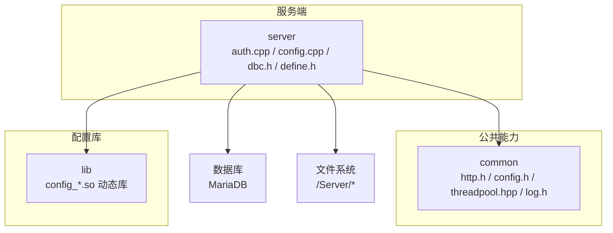
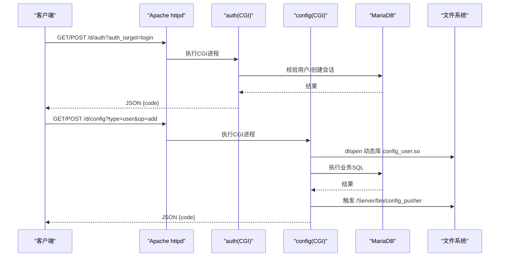
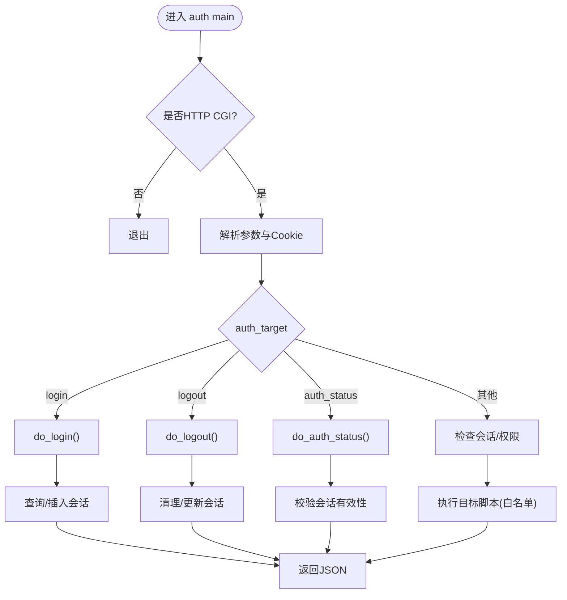
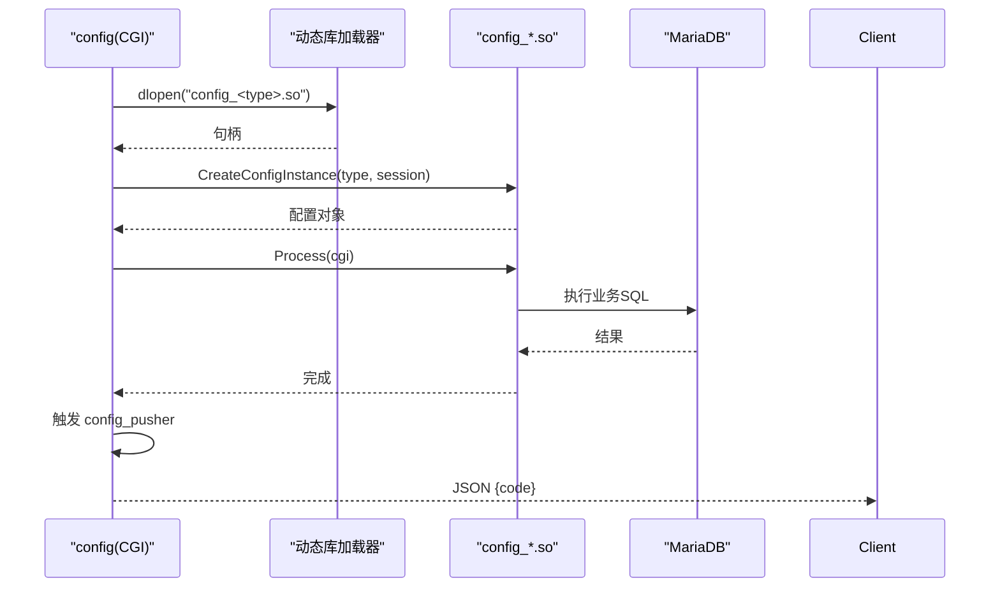
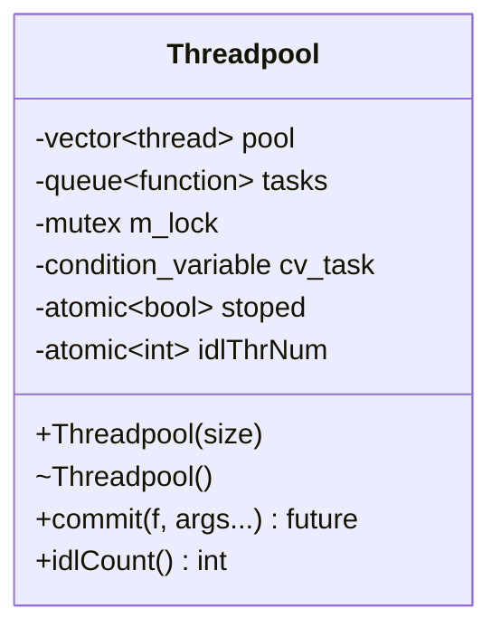
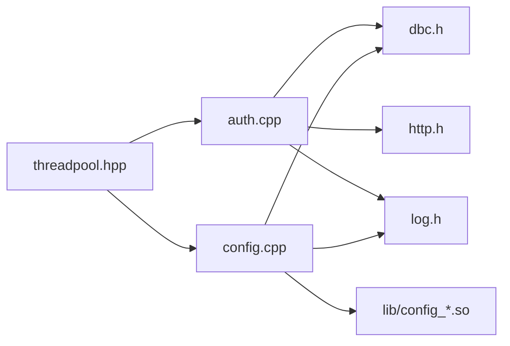

# 服务器架构设计

<cite>
**本文引用的文件**
- [ly_server/README.md](file://ly_server/README.md)
- [ly_server/INSTALL.md](file://ly_server/INSTALL.md)
- [src/server/define.h](file://ly_server/src/server/define.h)
- [src/common/common.h](file://ly_server/src/common/common.h)
- [src/common/http.h](file://ly_server/src/common/http.h)
- [src/common/config.h](file://ly_server/src/common/config.h)
- [src/common/threadpool.hpp](file://ly_server/src/common/threadpool.hpp)
- [src/common/log.h](file://ly_server/src/common/log.h)
- [src/server/auth.cpp](file://ly_server/src/server/auth.cpp)
- [src/server/dbc.h](file://ly_server/src/server/dbc.h)
- [src/server/config.cpp](file://ly_server/src/server/config.cpp)
</cite>

## 目录
1. [简介](#简介)
2. [项目结构](#项目结构)
3. [核心组件](#核心组件)
4. [架构总览](#架构总览)
5. [详细组件分析](#详细组件分析)
6. [依赖关系分析](#依赖关系分析)
7. [性能考量](#性能考量)
8. [故障排查指南](#故障排查指南)
9. [结论](#结论)
10. [附录](#附录)

## 简介
本技术文档面向 ly_server 管理引擎，系统性阐述其整体架构模式、分层职责（HTTP服务层、业务逻辑层、数据访问层）、进程与线程模型、内存与配置加载策略、启动流程与错误处理机制。通过架构图与交互流程图，帮助开发者快速理解系统设计与关键实现路径。

## 项目结构
ly_server 采用“公共库 + 业务模块”的分层组织方式：
- common：通用数据结构、工具函数、日志、HTTP客户端封装、配置读写、线程池等
- lib：配置类库（按配置类型动态加载）
- server：各API入口与业务处理（认证、事件、配置、查询等）

图表来源
- [src/server/auth.cpp:1-20](file://ly_server/src/server/auth.cpp#L1-L20)
- [src/server/config.cpp:1-20](file://ly_server/src/server/config.cpp#L1-L20)
- [src/common/http.h:1-14](file://ly_server/src/common/http.h#L1-L14)
- [src/common/config.h:1-49](file://ly_server/src/common/config.h#L1-L49)
- [src/common/threadpool.hpp:1-111](file://ly_server/src/common/threadpool.hpp#L1-L111)
- [src/common/log.h:1-43](file://ly_server/src/common/log.h#L1-L43)

章节来源
- [ly_server/README.md:1-20](file://ly_server/README.md#L1-L20)
- [ly_server/INSTALL.md:1-35](file://ly_server/INSTALL.md#L1-L35)

## 核心组件
- HTTP服务层
  - 基于CGI接口对外暴露REST风格操作，统一由认证网关鉴权后转发至具体处理器
  - 使用cgicc解析请求，返回JSON或调用目标脚本
- 业务逻辑层
  - 认证与会话管理：登录、登出、会话校验、权限控制
  - 配置管理：动态加载配置插件，执行增删改并触发推送
  - 事件与查询：聚合分析结果、提供查询接口
- 数据访问层
  - 通过cppdb连接MariaDB，封装会话创建与SQL执行
- 基础设施
  - 日志：syslog输出，分级记录
  - 线程池：通用任务队列与异步执行能力
  - 配置读取：protobuf序列化配置对象持久化与传输

章节来源
- [src/server/auth.cpp:44-47](file://ly_server/src/server/auth.cpp#L44-L47)
- [src/server/config.cpp:17-73](file://ly_server/src/server/config.cpp#L17-L73)
- [src/server/dbc.h:1-15](file://ly_server/src/server/dbc.h#L1-L15)
- [src/common/log.h:1-43](file://ly_server/src/common/log.h#L1-L43)
- [src/common/threadpool.hpp:1-111](file://ly_server/src/common/threadpool.hpp#L1-L111)
- [src/common/config.h:1-49](file://ly_server/src/common/config.h#L1-L49)

## 架构总览
系统采用“CGI网关 + 多进程处理器 + 动态库扩展”的架构模式：
- HTTP服务层：Apache httpd将/d/*下的CGI请求路由到auth与config等程序
- 业务逻辑层：auth负责鉴权与会话；config根据type动态加载对应配置处理器
- 数据访问层：统一通过dbc建立数据库会话，执行SQL
- 进程模型：每个CGI请求一个进程，无状态；长生命周期任务可借助外部定时任务或后台进程
- 线程模型：通用线程池用于并发任务调度（如批量写入、异步计算）

图表来源
- [src/server/auth.cpp:557-577](file://ly_server/src/server/auth.cpp#L557-L577)
- [src/server/config.cpp:21-80](file://ly_server/src/server/config.cpp#L21-L80)
- [ly_server/INSTALL.md:63-92](file://ly_server/INSTALL.md#L63-L92)

## 详细组件分析

### 认证与会话（auth）
- 功能要点
  - 登录：校验用户名密码，生成/更新会话，设置Cookie
  - 登出：清理会话或置空
  - 鉴权：基于角色（SYSADMIN/ANALYSER/VIEWER）与资源位进行细粒度控制
  - 安全：白名单API列表、防止命令注入、失败重试锁定
- 数据流
  - 从CGI环境获取参数与Cookie
  - 通过cppdb查询/更新用户与会话表
  - 返回JSON响应或转调目标脚本

图表来源
- [src/server/auth.cpp:557-577](file://ly_server/src/server/auth.cpp#L557-L577)
- [src/server/auth.cpp:244-320](file://ly_server/src/server/auth.cpp#L244-L320)
- [src/server/auth.cpp:322-348](file://ly_server/src/server/auth.cpp#L322-L348)
- [src/server/auth.cpp:479-555](file://ly_server/src/server/auth.cpp#L479-L555)

章节来源
- [src/server/auth.cpp:1-578](file://ly_server/src/server/auth.cpp#L1-L578)

### 配置管理（config）
- 功能要点
  - 根据type动态加载对应配置处理器（config_*.so）
  - 通过工厂函数创建实例并调用Process处理请求
  - 对增删改操作触发配置推送（config_pusher）
- 数据流
  - 解析CGI参数 -> dlopen动态库 -> 创建实例 -> 执行业务 -> 释放资源

图表来源
- [src/server/config.cpp:21-80](file://ly_server/src/server/config.cpp#L21-L80)

章节来源
- [src/server/config.cpp:1-81](file://ly_server/src/server/config.cpp#L1-L81)

### 数据访问（DBC）
- 职责
  - 封装数据库会话创建与生命周期管理
  - 为上层提供统一的数据库连接入口
- 关键点
  - 使用cppdb前端接口
  - 集中管理连接参数与错误处理

章节来源
- [src/server/dbc.h:1-15](file://ly_server/src/server/dbc.h#L1-L15)

### 线程池（Threadpool）
- 职责
  - 提供固定大小线程池，支持提交任意可调用对象并获取future返回值
  - 内部维护任务队列、条件变量与互斥锁，保证线程安全
- 适用场景
  - 异步IO、批量数据处理、耗时计算等

图表来源
- [src/common/threadpool.hpp:17-106](file://ly_server/src/common/threadpool.hpp#L17-L106)

章节来源
- [src/common/threadpool.hpp:1-111](file://ly_server/src/common/threadpool.hpp#L1-L111)

### 配置读写（ConfigReader/ConfigWriter）
- 职责
  - 以protobuf格式读写配置对象
  - 支持从文件或字符串加载/保存
- 关键点
  - 统一配置结构体，便于跨模块共享
  - 文本/二进制格式可选

章节来源
- [src/common/config.h:1-49](file://ly_server/src/common/config.h#L1-L49)

### HTTP客户端封装
- 职责
  - 提供GET/POST/PUT/自定义方法请求封装
  - 简化网络调用，统一异常与流式输出
- 关键点
  - 基于底层HTTP库封装，屏蔽细节

章节来源
- [src/common/http.h:1-14](file://ly_server/src/common/http.h#L1-L14)

### 日志子系统
- 职责
  - 统一错误、警告、信息级别日志输出
  - 支持调试开关与源文件过滤
- 关键点
  - 使用syslog，便于集中收集与分析

章节来源
- [src/common/log.h:1-43](file://ly_server/src/common/log.h#L1-L43)

## 依赖关系分析
- 组件耦合
  - auth 依赖 dbc（数据库）、common（日志、HTTP、IP工具）
  - config 依赖 lib（动态配置插件）、dbc、common
  - 所有模块共用 common 提供的线程池、日志、配置读写等能力
- 外部依赖
  - MariaDB：持久化存储
  - Apache httpd：CGI网关
  - 动态库：配置处理器按需加载

图表来源
- [src/server/auth.cpp:1-20](file://ly_server/src/server/auth.cpp#L1-L20)
- [src/server/config.cpp:1-20](file://ly_server/src/server/config.cpp#L1-L20)
- [src/server/dbc.h:1-15](file://ly_server/src/server/dbc.h#L1-L15)
- [src/common/http.h:1-14](file://ly_server/src/common/http.h#L1-L14)
- [src/common/log.h:1-43](file://ly_server/src/common/log.h#L1-L43)
- [src/common/threadpool.hpp:1-111](file://ly_server/src/common/threadpool.hpp#L1-L111)

章节来源
- [src/server/auth.cpp:1-578](file://ly_server/src/server/auth.cpp#L1-L578)
- [src/server/config.cpp:1-81](file://ly_server/src/server/config.cpp#L1-L81)

## 性能考量
- 进程模型
  - CGI每请求一进程，隔离性好但上下文切换开销大；适合低并发或中等负载场景
  - 建议在高并发时考虑常驻进程或反向代理+后端服务化改造
- 线程池
  - 使用固定大小线程池避免线程爆炸；合理设置池大小以匹配CPU核数与IO特性
  - 注意任务粒度与超时控制，避免阻塞队列增长
- 数据库
  - 连接复用：尽量复用会话或连接池（当前为单会话）
  - SQL优化：减少全表扫描，合理使用索引与分页
- I/O与缓存
  - 频繁读的配置项可引入本地缓存或内存缓存
  - 日志落盘注意缓冲与轮转策略

[本节为通用指导，不直接分析具体文件]

## 故障排查指南
- 常见问题定位
  - 认证失败：检查用户是否存在、密码是否正确、是否被锁定；查看会话表与历史表
  - 配置变更无效：确认动态库加载成功、Process执行无误、config_pusher是否触发
  - 数据库异常：检查连接参数、表结构与权限
- 日志与调试
  - 使用log_info/log_warning/log_err输出关键路径
  - 通过DEBUG环境变量开启细粒度调试
- 参考实现
  - 认证流程中的异常捕获与错误码返回
  - 配置动态加载的错误处理与日志记录

章节来源
- [src/server/auth.cpp:63-75](file://ly_server/src/server/auth.cpp#L63-L75)
- [src/server/auth.cpp:171-204](file://ly_server/src/server/auth.cpp#L171-L204)
- [src/server/config.cpp:41-68](file://ly_server/src/server/config.cpp#L41-L68)
- [src/common/log.h:1-43](file://ly_server/src/common/log.h#L1-L43)

## 结论
ly_server 采用清晰的三层架构与CGI网关模式，结合动态库扩展实现了高内聚、低耦合的配置管理与认证体系。通过统一的日志、线程池与配置读写能力，提升了系统的可维护性与可扩展性。针对高并发场景，建议逐步向常驻进程或服务化演进，并结合连接池与缓存优化性能。

[本节为总结性内容，不直接分析具体文件]

## 附录
- 启动与部署要点
  - 安装依赖与环境配置（语言、时区、防火墙、SELinux）
  - 编译顺序：common -> lib -> server
  - 初始化数据库与导入数据
  - 配置httpd虚拟主机与CGI映射
  - 定时任务：config_pusher、gen_event
- 运行目录与配置文件
  - 工作目录、日志目录、数据目录、库目录等常量定义
  - 数据库配置文件位置

章节来源
- [ly_server/README.md:21-103](file://ly_server/README.md#L21-L103)
- [ly_server/INSTALL.md:41-127](file://ly_server/INSTALL.md#L41-L127)
- [ly_server/README.md:197-204](file://ly_server/README.md#L197-L204)
- [ly_server/INSTALL.md:131-138](file://ly_server/INSTALL.md#L131-L138)
- [src/server/define.h:1-23](file://ly_server/src/server/define.h#L1-L23)