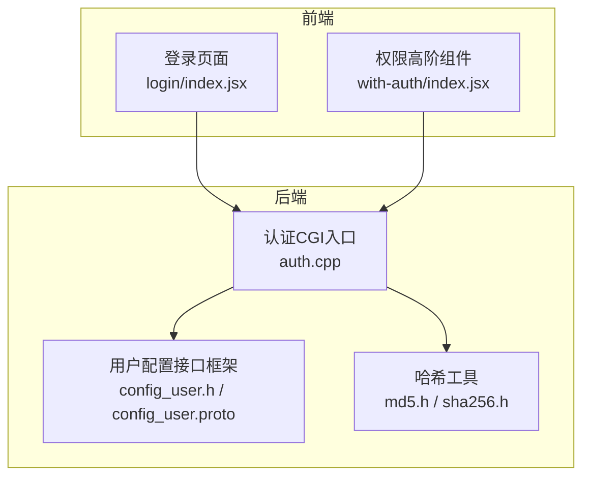
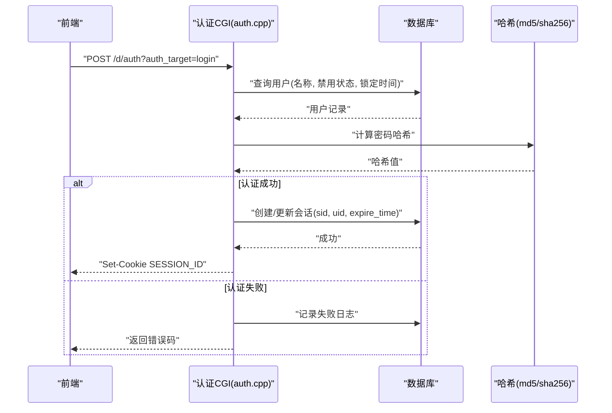
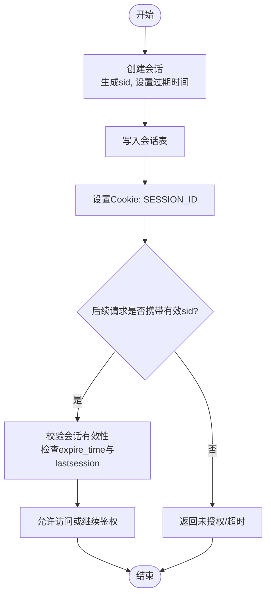
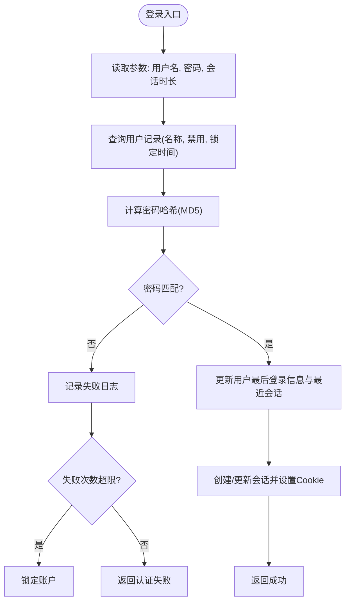
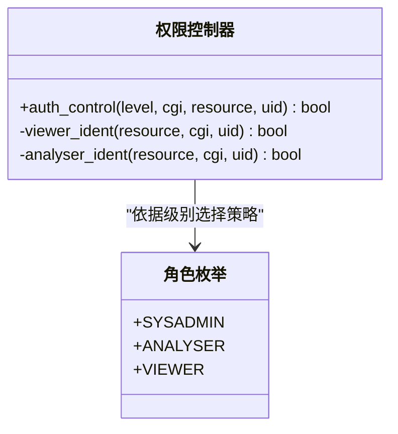
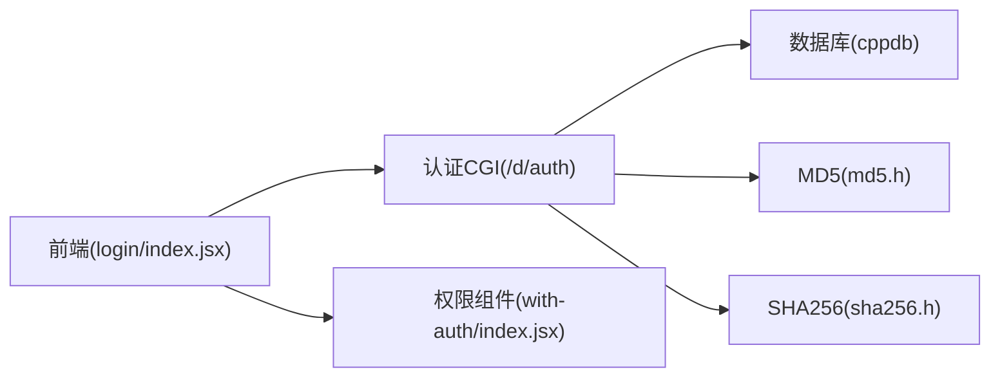

# 用户认证系统

<cite>
**本文引用的文件**
- [auth.cpp](file://ly_server/src/server/auth.cpp)
- [config_user.h](file://ly_server/src/lib/config_user.h)
- [config_user.proto](file://ly_server/src/lib/config_user.proto)
- [md5.h](file://ly_server/src/common/md5.h)
- [sha256.h](file://ly_server/src/common/sha256.h)
- [login/index.jsx](file://ly_vis/packages/std/src/page/login/index.jsx)
- [with-auth/index.jsx](file://ly_vis/packages/components/ui/container/with-auth/index.jsx)
</cite>

## 目录
1. [简介](#简介)
2. [项目结构](#项目结构)
3. [核心组件](#核心组件)
4. [架构总览](#架构总览)
5. [详细组件分析](#详细组件分析)
6. [依赖关系分析](#依赖关系分析)
7. [性能考虑](#性能考虑)
8. [故障排查指南](#故障排查指南)
9. [结论](#结论)
10. [附录](#附录)

## 简介
本技术文档面向用户认证子系统，覆盖身份验证机制、权限控制模型与会话管理策略。重点说明：
- 用户角色定义（管理员、分析员、只读）及访问控制规则
- 密码加密存储与校验流程
- 登录状态管理与安全令牌（会话ID）机制
- 认证API接口规范（注册、登录、登出、鉴权检查等）
- 安全最佳实践与常见问题解决方案
- 前端集成示例与调用流程

## 项目结构
认证相关代码主要分布在后端服务与前端界面两部分：
- 后端服务（C++ CGI程序）负责会话创建、校验、过期清理、用户认证与权限判定，并通过数据库持久化会话与用户信息
- 前端（React）提供登录页面、权限高阶组件与路由保护，调用后端认证接口并维护本地登录态

图表来源
- [auth.cpp:483-555](file://ly_server/src/server/auth.cpp#L483-L555)
- [config_user.h:12-38](file://ly_server/src/lib/config_user.h#L12-L38)
- [config_user.proto:4-14](file://ly_server/src/lib/config_user.proto#L4-L14)
- [md5.h:17-28](file://ly_server/src/common/md5.h#L17-L28)
- [sha256.h:5-28](file://ly_server/src/common/sha256.h#L5-L28)
- [login/index.jsx:24-38](file://ly_vis/packages/std/src/page/login/index.jsx#L24-L38)
- [with-auth/index.jsx:9-23](file://ly_vis/packages/components/ui/container/with-auth/index.jsx#L9-L23)

章节来源
- [auth.cpp:483-555](file://ly_server/src/server/auth.cpp#L483-L555)
- [login/index.jsx:24-38](file://ly_vis/packages/std/src/page/login/index.jsx#L24-L38)
- [with-auth/index.jsx:9-23](file://ly_vis/packages/components/ui/container/with-auth/index.jsx#L9-L23)

## 核心组件
- 会话管理器：负责生成、更新、校验和清理会话；通过Cookie传递会话ID
- 用户认证器：校验用户名与密码，支持锁定策略与重试限制
- 权限控制器：基于角色（管理员/分析员/只读）进行资源级访问控制
- 用户配置接口：提供用户的增删改查能力（通过配置框架）
- 前端登录与权限控制：登录表单、MD5预处理、路由跳转与权限渲染

章节来源
- [auth.cpp:51-168](file://ly_server/src/server/auth.cpp#L51-L168)
- [auth.cpp:206-293](file://ly_server/src/server/auth.cpp#L206-L293)
- [auth.cpp:350-477](file://ly_server/src/server/auth.cpp#L350-L477)
- [config_user.h:12-38](file://ly_server/src/lib/config_user.h#L12-L38)
- [config_user.proto:4-14](file://ly_server/src/lib/config_user.proto#L4-L14)
- [login/index.jsx:24-38](file://ly_vis/packages/std/src/page/login/index.jsx#L24-L38)
- [with-auth/index.jsx:9-23](file://ly_vis/packages/components/ui/container/with-auth/index.jsx#L9-L23)

## 架构总览
整体认证流程如下：
- 前端提交用户名与密码（前端对密码做MD5处理）
- 后端CGI接收请求，校验会话、用户凭证，必要时记录失败次数并触发锁定
- 成功后创建或更新会话，设置Cookie中的会话ID
- 后续请求携带会话ID，服务端校验会话有效性并执行权限控制
- 登出时清空会话并清理过期数据

图表来源
- [auth.cpp:244-293](file://ly_server/src/server/auth.cpp#L244-L293)
- [auth.cpp:170-204](file://ly_server/src/server/auth.cpp#L170-L204)
- [md5.h:17-28](file://ly_server/src/common/md5.h#L17-L28)

## 详细组件分析

### 会话管理
- 会话ID生成：使用系统命令生成UUID并去除分隔符，长度固定为32位
- 会话存储：写入会话表，包含sid、uid、expire_time；历史表用于审计
- 会话校验：根据sid与当前时间戳查询有效会话，若lastsession不匹配则视为已失效
- 过期清理：定时删除过期会话及其历史记录
- Cookie策略：将SESSION_ID写入Cookie，有效期可配置但受最大时长限制

图表来源
- [auth.cpp:111-168](file://ly_server/src/server/auth.cpp#L111-L168)
- [auth.cpp:51-93](file://ly_server/src/server/auth.cpp#L51-L93)
- [auth.cpp:288-293](file://ly_server/src/server/auth.cpp#L288-L293)

章节来源
- [auth.cpp:51-168](file://ly_server/src/server/auth.cpp#L51-L168)
- [auth.cpp:288-293](file://ly_server/src/server/auth.cpp#L288-L293)

### 用户认证与密码存储
- 密码哈希：后端使用MD5对用户输入的密码进行哈希比对；前端在提交前也对密码进行MD5处理
- 用户校验：查询用户是否存在且未被禁用，检查锁定时间窗口
- 失败重试与锁定：记录登录失败次数，超过阈值则在指定时间内锁定账户
- 登录成功：更新用户最后登录时间与最近会话，并下发新会话

图表来源
- [auth.cpp:206-229](file://ly_server/src/server/auth.cpp#L206-L229)
- [auth.cpp:170-204](file://ly_server/src/server/auth.cpp#L170-L204)
- [auth.cpp:244-293](file://ly_server/src/server/auth.cpp#L244-L293)
- [md5.h:17-28](file://ly_server/src/common/md5.h#L17-L28)
- [login/index.jsx:24-38](file://ly_vis/packages/std/src/page/login/index.jsx#L24-L38)

章节来源
- [auth.cpp:206-229](file://ly_server/src/server/auth.cpp#L206-L229)
- [auth.cpp:170-204](file://ly_server/src/server/auth.cpp#L170-L204)
- [auth.cpp:244-293](file://ly_server/src/server/auth.cpp#L244-L293)
- [md5.h:17-28](file://ly_server/src/common/md5.h#L17-L28)
- [login/index.jsx:24-38](file://ly_vis/packages/std/src/page/login/index.jsx#L24-L38)

### 权限控制模型
- 角色定义：SYSADMIN（管理员）、ANALYSER（分析员）、VIEWER（只读）
- 资源级控制：根据请求参数（type、op、devid、auth_target）判断是否允许操作
- 前端权限：通过高阶组件注入userLevel，计算handle_auth与admin_auth，控制UI展示与操作按钮
- 后端鉴权：根据用户级别与资源上下文决定是否放行到目标处理器

图表来源
- [auth.cpp:350-477](file://ly_server/src/server/auth.cpp#L350-L477)
- [with-auth/index.jsx:9-23](file://ly_vis/packages/components/ui/container/with-auth/index.jsx#L9-L23)

章节来源
- [auth.cpp:350-477](file://ly_server/src/server/auth.cpp#L350-L477)
- [with-auth/index.jsx:9-23](file://ly_vis/packages/components/ui/container/with-auth/index.jsx#L9-L23)

### 用户配置接口（注册/修改/删除/查询）
- 接口框架：通过ConfigUser类封装请求解析、校验与处理逻辑
- 协议定义：User消息包含id、uid、username、pass、level、comment、disabled、lockedtime、resource等字段
- 操作类型：ADD、DEL、MOD、GET
- 权限约束：不同角色对不同类型资源的增删改查具有差异化权限

章节来源
- [config_user.h:12-38](file://ly_server/src/lib/config_user.h#L12-L38)
- [config_user.proto:4-14](file://ly_server/src/lib/config_user.proto#L4-L14)

### 认证API接口规范
- 统一入口：/d/auth（CGI程序），通过参数auth_target区分功能
- 可用目标：login、logout、auth_status以及业务模块（如mo、feature、topn、event、config等）
- 登录接口
  - 方法：POST
  - 参数：auth_user、auth_pass（前端需先MD5）、auth_agetime（可选，默认4小时，最大1个月）
  - 响应：JSON数组包含code字段；成功时设置Cookie SESSION_ID
- 登出接口
  - 方法：POST
  - 行为：清理会话并设置短期过期Cookie
- 鉴权状态接口
  - 方法：POST
  - 行为：校验会话有效性，返回成功或超时/失败码
- 业务接口鉴权
  - 行为：携带有效会话后，按用户级别与资源上下文进行权限控制，通过后交由对应处理器执行

章节来源
- [auth.cpp:483-555](file://ly_server/src/server/auth.cpp#L483-L555)
- [auth.cpp:244-348](file://ly_server/src/server/auth.cpp#L244-L348)

### 前端集成示例
- 登录页面
  - 使用表单收集用户名与密码
  - 提交前对密码进行MD5处理
  - 调用登录接口，成功后保存用户名并跳转到上一页
- 权限控制
  - 通过高阶组件注入userLevel，计算handle_auth与admin_auth
  - 根据权限控制按钮显示与页面访问

章节来源
- [login/index.jsx:24-38](file://ly_vis/packages/std/src/page/login/index.jsx#L24-L38)
- [with-auth/index.jsx:9-23](file://ly_vis/packages/components/ui/container/with-auth/index.jsx#L9-L23)

## 依赖关系分析
- 后端依赖
  - 数据库：cppdb会话用于读写用户与会话表
  - 哈希库：MD5用于密码哈希；SHA256工具存在但未在当前认证路径中使用
  - 系统命令：uuidgen用于生成会话ID
- 前端依赖
  - React与Ant Design：表单与交互
  - MD5库：前端对密码进行哈希后再发送

图表来源
- [auth.cpp:483-555](file://ly_server/src/server/auth.cpp#L483-L555)
- [md5.h:17-28](file://ly_server/src/common/md5.h#L17-L28)
- [sha256.h:5-28](file://ly_server/src/common/sha256.h#L5-L28)
- [login/index.jsx:24-38](file://ly_vis/packages/std/src/page/login/index.jsx#L24-L38)
- [with-auth/index.jsx:9-23](file://ly_vis/packages/components/ui/container/with-auth/index.jsx#L9-L23)

章节来源
- [auth.cpp:483-555](file://ly_server/src/server/auth.cpp#L483-L555)
- [md5.h:17-28](file://ly_server/src/common/md5.h#L17-L28)
- [sha256.h:5-28](file://ly_server/src/common/sha256.h#L5-L28)
- [login/index.jsx:24-38](file://ly_vis/packages/std/src/page/login/index.jsx#L24-L38)
- [with-auth/index.jsx:9-23](file://ly_vis/packages/components/ui/container/with-auth/index.jsx#L9-L23)

## 性能考虑
- 会话清理：定期删除过期会话与历史，避免表膨胀
- 数据库查询：登录与鉴权路径涉及多次查询，建议索引优化（如t_user_session.sid、t_user.name）
- 哈希计算：MD5计算开销较低，但在高并发场景下仍需关注CPU占用
- Cookie大小：会话ID长度固定，注意网络传输与浏览器限制
- 前端缓存：登录后状态可通过路由守卫与权限组件减少重复鉴权请求

[本节为通用指导，无需具体文件引用]

## 故障排查指南
- 登录失败
  - 检查用户名与密码是否正确（注意前端MD5与后端MD5一致性）
  - 查看失败日志与锁定状态，确认是否在锁定窗口内
- 会话超时
  - 检查Cookie中SESSION_ID是否存在且未过期
  - 确认服务器时间同步与过期时间配置
- 权限不足
  - 核对用户级别与资源上下文（type、op、devid）
  - 前端权限组件是否正确注入userLevel
- 数据库异常
  - 检查连接与权限，确认表结构与字段完整
  - 查看错误日志定位SQL执行问题

章节来源
- [auth.cpp:170-204](file://ly_server/src/server/auth.cpp#L170-L204)
- [auth.cpp:206-229](file://ly_server/src/server/auth.cpp#L206-L229)
- [auth.cpp:322-348](file://ly_server/src/server/auth.cpp#L322-L348)

## 结论
该认证系统以CGI为核心，结合数据库与会话机制实现用户身份验证与权限控制。前端通过MD5预处理与权限组件完成登录与界面控制。建议在后续迭代中：
- 升级密码哈希算法至更安全的方案（如bcrypt/argon2）
- 引入HTTPS与HttpOnly、Secure Cookie增强安全性
- 完善审计日志与监控告警
- 优化数据库索引与查询性能

[本节为总结性内容，无需具体文件引用]

## 附录
- 安全最佳实践
  - 使用强哈希算法存储密码，避免明文或弱哈希
  - 启用HTTPS，防止中间人攻击
  - 设置Cookie的HttpOnly与Secure标志，限制跨站脚本与跨域风险
  - 实施登录失败锁定与速率限制，抵御暴力破解
  - 最小权限原则，按需分配角色与资源访问
- 常见问题解决方案
  - 会话丢失：检查Cookie策略与浏览器隐私设置
  - 权限误判：核对角色与资源映射，确保后端鉴权逻辑与前端一致
  - 性能瓶颈：优化数据库查询与缓存策略

[本节为通用指导，无需具体文件引用]