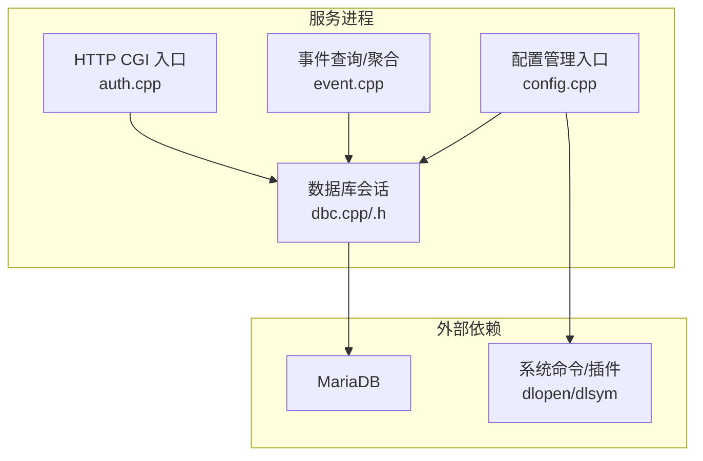
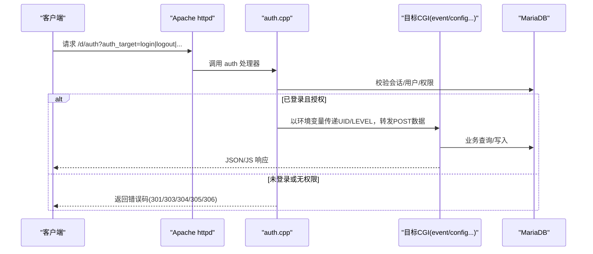
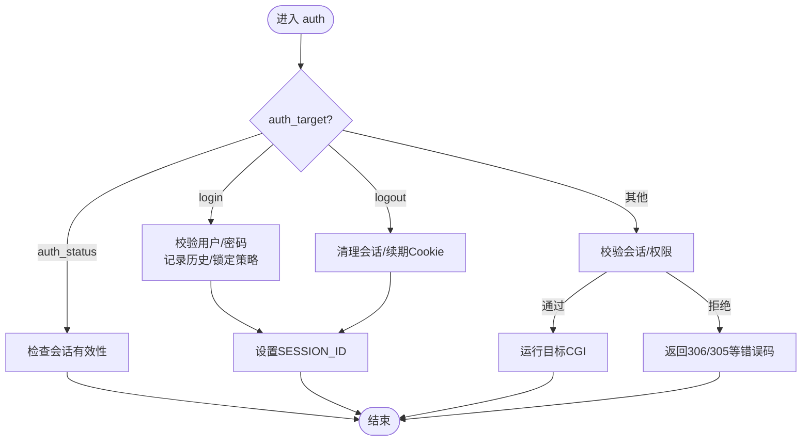
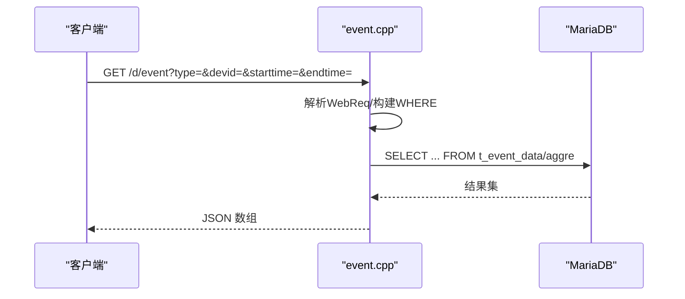
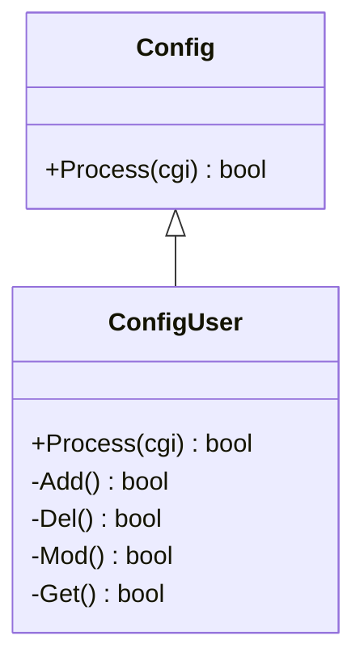
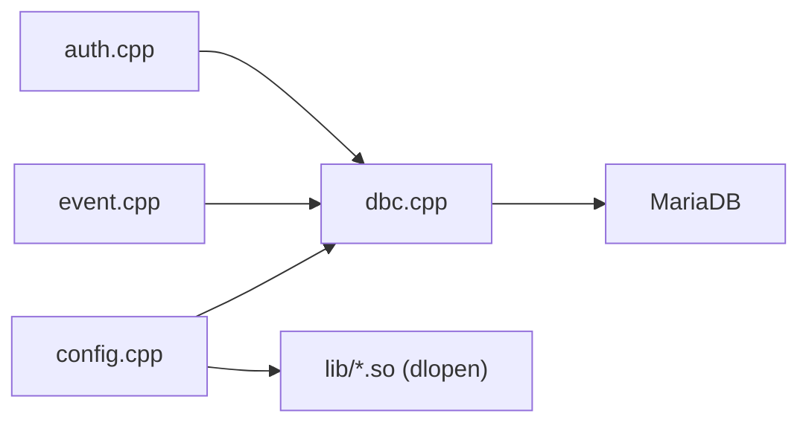

# 管理服务器

<cite>
**本文引用的文件**
- [ly_server/README.md](file://ly_server/README.md)
- [ly_server/INSTALL.md](file://ly_server/INSTALL.md)
- [src/server/auth.cpp](file://ly_server/src/server/auth.cpp)
- [src/server/event.cpp](file://ly_server/src/server/event.cpp)
- [src/server/config.cpp](file://ly_server/src/server/config.cpp)
- [src/server/dbc.h](file://ly_server/src/server/dbc.h)
- [src/server/dbc.cpp](file://ly_server/src/server/dbc.cpp)
- [src/common/http.h](file://ly_server/src/common/http.h)
- [src/common/config.h](file://ly_server/src/common/config.h)
- [src/lib/config_user.h](file://ly_server/src/lib/config_user.h)
- [src/common/event_req.h](file://ly_server/src/common/event_req.h)
</cite>

## 目录
1. [简介](#简介)
2. [项目结构](#项目结构)
3. [核心组件](#核心组件)
4. [架构总览](#架构总览)
5. [详细组件分析](#详细组件分析)
6. [依赖关系分析](#依赖关系分析)
7. [性能与优化](#性能与优化)
8. [故障排查指南](#故障排查指南)
9. [结论](#结论)
10. [附录：API 参考与集成示例](#附录api-参考与集成示例)

## 简介
本技术文档面向“管理服务器”（ly_server），围绕其架构设计、API 接口规范、数据库交互机制、事件管理、用户认证授权、配置管理与统计分析等能力进行系统化说明。文档同时提供 RESTful API 的请求/响应约定、错误处理策略，以及数据库表结构、索引优化与查询调优建议，并给出配置最佳实践与安全加固要点和集成示例。

## 项目结构
- 顶层模块
  - ly_server：管理引擎主体，包含通用库、服务端实现与工具库
    - src/common：通用数据结构、HTTP/日志/时间/字符串等工具
    - src/lib：配置子系统（按类型动态加载的插件式实现）
    - src/server：各功能入口（认证、事件、配置、统计等）
  - ly_analyser：分析引擎（不在本文重点范围）
  - ly_vis：可视化前端（不在本文重点范围）

- 关键目录与职责
  - src/server：HTTP CGI 入口与业务逻辑（auth、event、config 等）
  - src/lib：配置类抽象与具体实现（如 config_user）
  - src/common：协议定义（protobuf）、HTTP 封装、配置读写器等

图表来源
- [src/server/auth.cpp:479-555](file://ly_server/src/server/auth.cpp#L479-L555)
- [src/server/event.cpp:192-310](file://ly_server/src/server/event.cpp#L192-L310)
- [src/server/config.cpp:21-79](file://ly_server/src/server/config.cpp#L21-L79)
- [src/server/dbc.cpp:1-27](file://ly_server/src/server/dbc.cpp#L1-L27)

章节来源
- [ly_server/README.md:1-233](file://ly_server/README.md#L1-L233)
- [ly_server/INSTALL.md:1-141](file://ly_server/INSTALL.md#L1-L141)

## 核心组件
- 认证与会话管理
  - 基于 Cookie 的会话 ID 校验、登录/登出、权限控制（管理员/分析员/只读）
  - 失败重试与账户锁定策略
- 事件查询与聚合
  - 原始事件与聚合事件的查询、过滤、分页/步进
  - 处理状态更新
- 配置管理
  - 通过动态加载 .so 插件实现多类型配置的增删改查
  - 变更后触发配置推送
- 数据库访问
  - 统一会话创建与参数化查询，避免注入
- HTTP 工具
  - 提供 GET/POST/PUT 等请求封装

章节来源
- [src/server/auth.cpp:51-348](file://ly_server/src/server/auth.cpp#L51-L348)
- [src/server/event.cpp:40-321](file://ly_server/src/server/event.cpp#L40-L321)
- [src/server/config.cpp:21-79](file://ly_server/src/server/config.cpp#L21-L79)
- [src/server/dbc.cpp:1-27](file://ly_server/src/server/dbc.cpp#L1-L27)
- [src/common/http.h:1-14](file://ly_server/src/common/http.h#L1-L14)

## 架构总览
整体采用“CGI + 插件化配置 + 数据库”的分层架构：
- 接入层：Apache httpd 将 /d/* 下的 CGI 脚本转发到对应处理器
- 网关层：auth.cpp 作为统一鉴权入口，校验会话与权限后路由至目标 CGI
- 业务层：event.cpp、config.cpp 等实现具体业务
- 数据层：通过 dbc.cpp 建立 MariaDB 会话，执行参数化 SQL
- 扩展点：config.cpp 使用 dlopen/dlsym 动态加载配置插件

图表来源
- [src/server/auth.cpp:479-555](file://ly_server/src/server/auth.cpp#L479-L555)
- [src/server/event.cpp:324-356](file://ly_server/src/server/event.cpp#L324-L356)
- [src/server/config.cpp:21-79](file://ly_server/src/server/config.cpp#L21-L79)
- [src/server/dbc.cpp:1-27](file://ly_server/src/server/dbc.cpp#L1-L27)

## 详细组件分析

### 认证与授权（auth.cpp）
- 会话模型
  - 使用固定长度 SID（UUID 去横线）存储在 t_user_session，关联 uid 与过期时间
  - 支持默认与最大有效期，Cookie 中回写 SESSION_ID
- 登录流程
  - 从 Cookie 读取或新建会话
  - 校验用户密码（MD5），检查锁定时间与重试次数
  - 成功后更新用户最近登录信息，设置 Cookie
- 登出流程
  - 清理会话或置空 uid，延长 Cookie 过期
- 鉴权控制
  - 根据用户级别（SYSADMIN/ANALYSER/VIEWER）与资源/操作进行细粒度判断
  - VIEWER 仅允许 GET/GGET，限制修改；ANALYSER 受限更多；SYSADMIN 全量
- 安全要点
  - 白名单校验 auth_target，防止命令注入
  - 所有 SQL 使用参数化绑定，避免注入
  - 失败计数达到阈值时锁定账户一段时间

图表来源
- [src/server/auth.cpp:51-348](file://ly_server/src/server/auth.cpp#L51-L348)
- [src/server/auth.cpp:479-555](file://ly_server/src/server/auth.cpp#L479-L555)

章节来源
- [src/server/auth.cpp:51-348](file://ly_server/src/server/auth.cpp#L51-L348)
- [src/server/auth.cpp:479-555](file://ly_server/src/server/auth.cpp#L479-L555)

### 事件查询与聚合（event.cpp）
- 请求解析
  - 支持从 URL 参数或命令行解析 WebReq（时间范围、类型、设备、对象、级别等）
- 查询逻辑
  - 原始事件：t_event_data，支持时间区间、步进对齐
  - 聚合事件：t_event_data_aggre，支持多种过滤条件
- 输出格式
  - 流式拼接 JSON 数组，字段包括 id、time、type、level、obj、alarm_value 等
- 处理状态
  - 支持更新聚合事件的处理状态与备注

图表来源
- [src/server/event.cpp:40-189](file://ly_server/src/server/event.cpp#L40-L189)
- [src/server/event.cpp:192-310](file://ly_server/src/server/event.cpp#L192-L310)
- [src/server/event.cpp:312-321](file://ly_server/src/server/event.cpp#L312-L321)

章节来源
- [src/server/event.cpp:40-321](file://ly_server/src/server/event.cpp#L40-L321)
- [src/common/event_req.h:1-42](file://ly_server/src/common/event_req.h#L1-L42)

### 配置管理（config.cpp 与 lib/config_*.h）
- 动态加载
  - 根据 type 构造 .so 路径，使用 dlopen/dlsym 加载 CreateConfigInstance/FreeConfigInstance
  - 通过基类 Config::Process(cgi) 统一处理增删改查
- 典型实现
  - config_user.h 定义了用户配置类的接口（ADD/DEL/MOD/GET）
- 变更传播
  - 对 add/mod/del 操作，调用系统命令触发配置推送（config_pusher）

图表来源
- [src/lib/config_user.h:1-43](file://ly_server/src/lib/config_user.h#L1-L43)
- [src/server/config.cpp:21-79](file://ly_server/src/server/config.cpp#L21-L79)

章节来源
- [src/server/config.cpp:21-79](file://ly_server/src/server/config.cpp#L21-L79)
- [src/lib/config_user.h:1-43](file://ly_server/src/lib/config_user.h#L1-L43)

### 数据库访问（dbc.cpp/.h）
- 会话初始化
  - 从配置文件读取数据库凭据，构造 cppdb session
  - 使用 read_default_group 指定 MariaDB 客户端组
- 安全与健壮性
  - 所有查询均使用参数化语句，避免 SQL 注入
  - 异常捕获并记录日志

章节来源
- [src/server/dbc.h:1-15](file://ly_server/src/server/dbc.h#L1-L15)
- [src/server/dbc.cpp:1-27](file://ly_server/src/server/dbc.cpp#L1-L27)

### 配置读写器（common/config.h）
- 提供统一的配置读取/写入接口（文本/二进制格式）
- 用于配置持久化与分发（配合 config_pusher）

章节来源
- [src/common/config.h:1-49](file://ly_server/src/common/config.h#L1-L49)

## 依赖关系分析
- 组件耦合
  - auth.cpp 强依赖 dbc.cpp（数据库会话）与系统命令（uuidgen）
  - event.cpp 依赖 common 中的请求解析与 protobuf 消息
  - config.cpp 依赖 lib 的动态插件机制
- 外部依赖
  - MariaDB：存储用户会话、事件、配置等
  - Apache httpd：CGI 路由与静态资源托管
  - 系统工具：uuidgen、cron（定时任务）

图表来源
- [src/server/auth.cpp:479-555](file://ly_server/src/server/auth.cpp#L479-L555)
- [src/server/event.cpp:324-356](file://ly_server/src/server/event.cpp#L324-L356)
- [src/server/config.cpp:21-79](file://ly_server/src/server/config.cpp#L21-L79)
- [src/server/dbc.cpp:1-27](file://ly_server/src/server/dbc.cpp#L1-L27)

## 性能与优化
- 数据库层面
  - 为高频查询字段建立复合索引（如 t_event_data 的 time、type、devid、level；t_event_data_aggre 的 starttime/endtime、type、devid）
  - 使用参数化查询减少重复解析开销
  - 合理设置连接池/会话复用（当前为每请求新建会话，可考虑在 CGI 外维护长连接）
- 应用层面
  - 事件查询支持 step 步进，降低前端渲染压力
  - 聚合查询优先使用预聚合表，减少实时计算
  - 配置变更通过异步推送（config_pusher）解耦
- 系统层面
  - 关闭 SELinux 或使用最小权限策略
  - 防火墙仅开放必要端口（如 18080）
  - NTP 同步时间，保证会话过期与审计一致性

[本节为通用指导，不直接引用具体代码]

## 故障排查指南
- 常见问题
  - 无法登录：检查 t_user 是否禁用、密码 MD5 匹配、账户是否处于锁定窗口
  - 会话失效：确认 t_user_session 过期时间、Cookie 是否携带 SESSION_ID
  - 配置变更无效：确认 config_pusher 是否被 cron 正确调度
- 定位方法
  - 查看服务日志（SERVER_LOG_DIR）
  - 检查 MariaDB 错误日志与慢查询
  - 验证 Apache 错误日志与 CGI 输出

章节来源
- [src/server/auth.cpp:170-204](file://ly_server/src/server/auth.cpp#L170-L204)
- [src/server/auth.cpp:206-229](file://ly_server/src/server/auth.cpp#L206-L229)
- [src/server/config.cpp:70-73](file://ly_server/src/server/config.cpp#L70-L73)

## 结论
管理服务器采用清晰的 CGI 分层与插件化配置架构，具备完善的认证授权、事件查询与配置管理能力。通过参数化数据库访问与严格的输入校验，保障了安全性与稳定性。结合合理的索引与查询优化，可在大规模事件数据下保持良好性能。建议在生产环境启用最小权限、严格网络边界与定期安全巡检。

[本节为总结性内容，不直接引用具体代码]

## 附录：API 参考与集成示例

### 认证相关
- 登录
  - 路径：/d/auth
  - 方法：POST
  - 参数：auth_target=login, auth_user, auth_pass, auth_agetime（可选）
  - 响应：JSON 数组，包含 code 字段（200 成功；301 认证失败；303 已登录；304 重试锁定；305 超时；306 无权限）
  - 注意：成功登录后会设置 SESSION_ID Cookie
- 登出
  - 路径：/d/auth
  - 方法：POST
  - 参数：auth_target=logout
  - 响应：code
- 会话状态
  - 路径：/d/auth
  - 方法：GET/POST
  - 参数：auth_target=auth_status
  - 响应：code（200 有效；305 超时；306 无权限）

章节来源
- [src/server/auth.cpp:244-348](file://ly_server/src/server/auth.cpp#L244-L348)
- [src/server/auth.cpp:479-555](file://ly_server/src/server/auth.cpp#L479-L555)

### 事件查询
- 原始事件
  - 路径：/d/event
  - 方法：GET
  - 参数：req_type=ori, starttime, endtime, type, model, devid, event_id, obj, level, step（可选）
  - 响应：JSON 数组，字段包括 id、time、event_id、type、model、devid、level、obj、thres_value、alarm_value、value_type、desc
- 聚合事件
  - 路径：/d/event
  - 方法：GET
  - 参数：req_type=aggre, starttime, endtime, id, type, model, devid, event_id, obj, level, is_alive, proc_status, proc_comment（可选）
  - 响应：JSON 数组，字段包括 id、event_id、devid、obj、type、model、level、alarm_peak、sub_events、alarm_avg、value_type、desc、duration、starttime、endtime、is_alive、proc_status、proc_comment
- 更新处理状态
  - 路径：/d/event
  - 方法：GET/POST
  - 参数：req_type=set_proc_status, id, proc_status, proc_comment
  - 响应：JSON 数组（空或错误码）

章节来源
- [src/server/event.cpp:40-189](file://ly_server/src/server/event.cpp#L40-L189)
- [src/server/event.cpp:192-310](file://ly_server/src/server/event.cpp#L192-L310)
- [src/server/event.cpp:312-321](file://ly_server/src/server/event.cpp#L312-L321)

### 配置管理
- 通用入口
  - 路径：/d/config
  - 方法：GET/POST
  - 参数：type=<配置类型>, op=add|mod|del|get, 其他随类型而定
  - 行为：动态加载对应 .so 插件，调用 Process(cgi) 完成操作；对写操作触发配置推送
- 用户配置
  - type=user，支持 ADD/DEL/MOD/GET
  - 权限：依据用户级别与资源控制

章节来源
- [src/server/config.cpp:21-79](file://ly_server/src/server/config.cpp#L21-L79)
- [src/lib/config_user.h:1-43](file://ly_server/src/lib/config_user.h#L1-L43)

### 数据库表结构与索引建议
- 用户与会话
  - t_user：id, name, pass, level, resource, lockedtime, lasttime, lastip, lastsession, disabled
  - t_user_session：sid, uid, expire_time
  - t_user_session_history：sid, uid, action, code, time
  - 建议索引：t_user(name), t_user_session(sid, expire_time), t_user_session_history(uid, action, time)
- 事件数据
  - t_event_data：id, time, event_id, type, model, devid, level, obj, thres_value, alarm_value, value_type, desc
  - t_event_data_aggre：id, event_id, devid, obj, type, model, level, alarm_peak, sub_events, alarm_avg, value_type, desc, duration, starttime, endtime, is_alive, proc_status, proc_comment
  - 建议索引：t_event_data(time, type, devid, level)，t_event_data_aggre(starttime, endtime, type, devid)

[本节为概念性设计建议，不直接引用具体代码]

### 安全加固建议
- 最小权限原则：数据库账号仅授予必要权限
- 传输安全：生产环境建议使用 HTTPS 反向代理
- 输入校验：所有 CGI 入口必须校验参数与白名单
- 审计与告警：记录登录失败、锁定事件与配置变更
- 系统加固：关闭不必要服务，定期更新补丁

[本节为通用安全建议，不直接引用具体代码]

### 集成示例（步骤）
- 登录获取会话
  - POST /d/auth，body: auth_target=login&auth_user=admin&auth_pass=xxx
  - 保存返回的 SESSION_ID Cookie
- 查询事件
  - GET /d/event?req_type=ori&type=malware&devid=1001&starttime=...&endtime=...
  - 带上 SESSION_ID Cookie
- 更新配置
  - POST /d/config?type=user&op=get
  - 带上 SESSION_ID Cookie

[本节为使用示例，不直接引用具体代码]