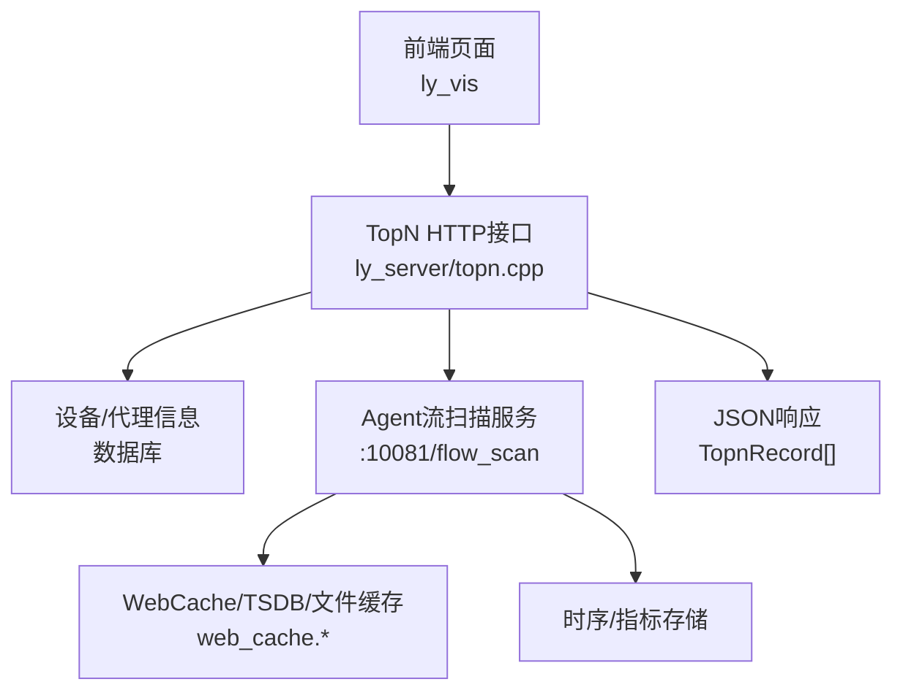
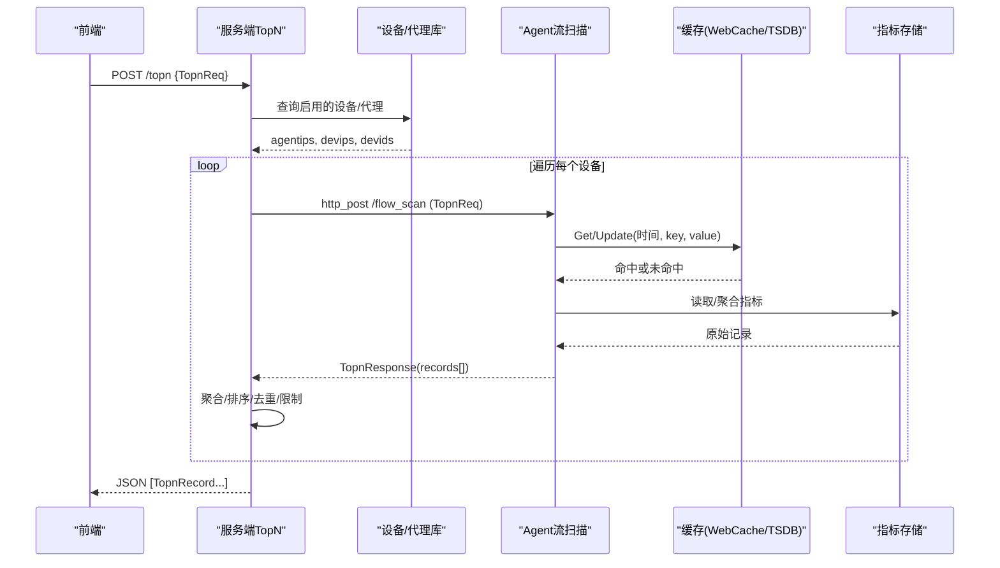
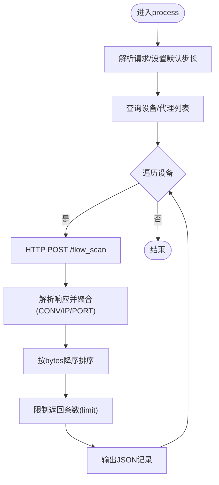
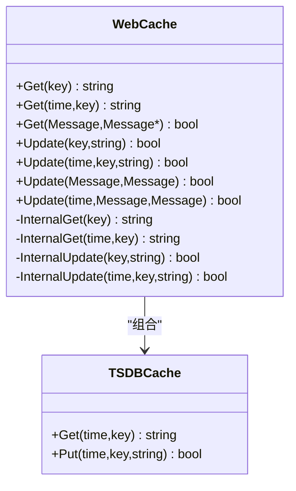
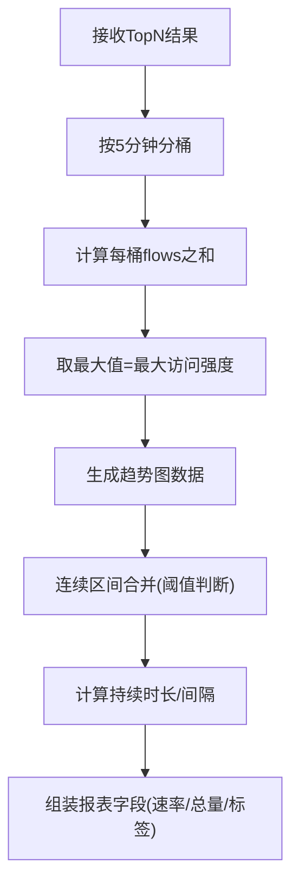
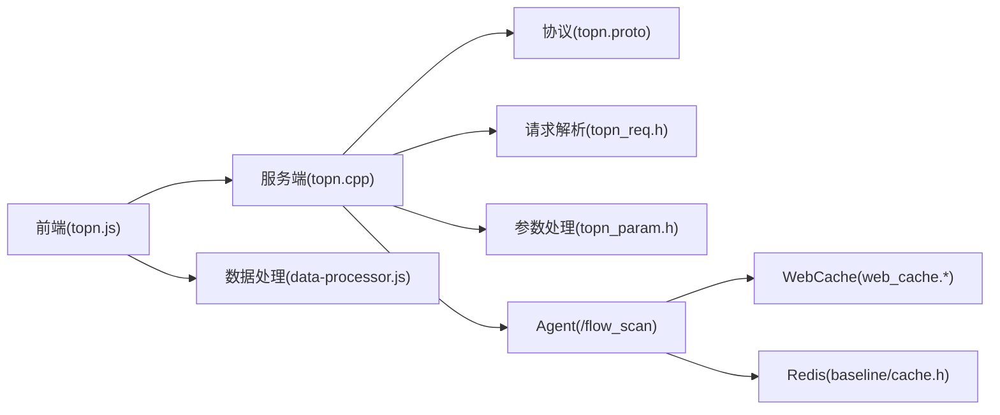

# 统计分析引擎

<cite>
**本文引用的文件**
- [ly_server/src/server/topn.cpp](file://ly_server/src/server/topn.cpp)
- [ly_analyser/src/common/topn.proto](file://ly_analyser/src/common/topn.proto)
- [ly_analyser/src/common/topn_req.h](file://ly_analyser/src/common/topn_req.h)
- [ly_analyser/src/common/topn_param.h](file://ly_analyser/src/common/topn_param.h)
- [ly_analyser/src/agent/data/web_cache.h](file://ly_analyser/src/agent/data/web_cache.h)
- [ly_analyser/src/agent/data/web_cache.cpp](file://ly_analyser/src/agent/data/web_cache.cpp)
- [ly_analyser/src/common/baseline/cache.h](file://ly_analyser/src/common/baseline/cache.h)
- [ly_vis/packages/std/src/service/api/topn.js](file://ly_vis/packages/std/src/service/api/topn.js)
- [ly_vis/packages/std/src/page/result/data-processor.js](file://ly_vis/packages/std/src/page/result/data-processor.js)
- [ly_vis/packages/std/src/page/event/page-child/event-detail/components/feature-timing/components/feature-desc/index.jsx](file://ly_vis/packages/std/src/page/event/page-child/event-detail/components/feature-timing/components/feature-desc/index.jsx)
- [ly_vis/packages/std/src/page/event/page-child/event-detail/components/alarm-timing/index.jsx](file://ly_vis/packages/std/src/page/event/page-child/event-detail/components/alarm-timing/index.jsx)
</cite>

## 目录
1. [简介](#简介)
2. [项目结构](#项目结构)
3. [核心组件](#核心组件)
4. [架构总览](#架构总览)
5. [详细组件分析](#详细组件分析)
6. [依赖关系分析](#依赖关系分析)
7. [性能考虑](#性能考虑)
8. [故障排查指南](#故障排查指南)
9. [结论](#结论)
10. [附录：API接口与示例](#附录api接口与示例)

## 简介
本技术文档面向统计分析引擎，系统性说明数据统计的算法实现、实时计算机制与历史数据分析方法。重点覆盖TopN统计、趋势分析与关联分析的核心算法；阐述数据聚合策略、缓存机制与查询优化技术；提供统计分析API的完整接口说明（含请求参数、返回结构与示例），并给出性能调优建议与大数据量处理方案。

## 项目结构
统计分析引擎由“服务端聚合与调度”、“Agent侧采集与缓存”、“前端可视化与后处理”三部分构成：
- 服务端（ly_server）：解析TopN请求，按设备/代理分发到Agent执行流扫描，汇总结果并输出JSON。
- Agent端（ly_analyser）：执行具体流扫描与聚合，支持本地文件缓存与TSDB缓存，提供Redis缓存能力。
- 前端（ly_vis）：调用topn接口，进行时间分桶、强度计算、趋势展示与报表生成。

图表来源
- [ly_server/src/server/topn.cpp:466-549](file://ly_server/src/server/topn.cpp#L466-L549)
- [ly_analyser/src/agent/data/web_cache.h:15-53](file://ly_analyser/src/agent/data/web_cache.h#L15-L53)
- [ly_analyser/src/agent/data/web_cache.cpp:82-102](file://ly_analyser/src/agent/data/web_cache.cpp#L82-L102)

章节来源
- [ly_server/src/server/topn.cpp:466-549](file://ly_server/src/server/topn.cpp#L466-L549)
- [ly_analyser/src/agent/data/web_cache.h:15-53](file://ly_analyser/src/agent/data/web_cache.h#L15-L53)
- [ly_analyser/src/agent/data/web_cache.cpp:82-102](file://ly_analyser/src/agent/data/web_cache.cpp#L82-L102)

## 核心组件
- TopN请求协议与记录模型：定义于protobuf消息，包含时间窗口、排序维度、过滤条件、限制条数等。
- 服务端TopN处理器：解析请求、获取设备/代理列表、构造请求并转发至各Agent，合并结果并按规则聚合与排序。
- 缓存子系统：WebCache统一封装文件缓存与TSDB缓存，支持按时间戳存取；baseline模块提供Redis缓存能力。
- 前端数据处理：对原始TopN结果进行时间分桶、访问强度计算、趋势聚合与报表字段组装。

章节来源
- [ly_analyser/src/common/topn.proto:3-76](file://ly_analyser/src/common/topn.proto#L3-L76)
- [ly_server/src/server/topn.cpp:237-427](file://ly_server/src/server/topn.cpp#L237-L427)
- [ly_analyser/src/agent/data/web_cache.h:15-53](file://ly_analyser/src/agent/data/web_cache.h#L15-L53)
- [ly_analyser/src/agent/data/web_cache.cpp:82-102](file://ly_analyser/src/agent/data/web_cache.cpp#L82-L102)
- [ly_vis/packages/std/src/page/result/data-processor.js:37-72](file://ly_vis/packages/std/src/page/result/data-processor.js#L37-L72)

## 架构总览
TopN统计从前端发起，经服务端路由到多个Agent并行执行流扫描，Agent在本地或TSDB中读取指标并聚合，结果回传服务端进行二次聚合与排序，最终返回JSON给前端渲染。

图表来源
- [ly_server/src/server/topn.cpp:466-549](file://ly_server/src/server/topn.cpp#L466-L549)
- [ly_analyser/src/agent/data/web_cache.cpp:82-102](file://ly_analyser/src/agent/data/web_cache.cpp#L82-L102)

## 详细组件分析

### TopN协议与数据结构
- 请求字段：设备ID、起止时间、排序维度、步长、过滤器、IP/端口范围、分组ID、排序键、包含/排除列表、是否启用缓存、源/目的方向、应用协议、DNS查询名与类型、服务类型与名称等。
- 记录字段：设备信息、时间、类型、字节/包/流计数、协议、地址与端口、标志位、TOS、服务/扫描器/白名单/黑名单标记、MO ID、应用协议、上下文、服务信息等。

章节来源
- [ly_analyser/src/common/topn.proto:3-76](file://ly_analyser/src/common/topn.proto#L3-L76)

### 服务端TopN处理流程
- 解析请求与默认步长：未设置步长时默认为300秒。
- 获取设备/代理：查询启用的设备与对应代理IP，用于后续HTTP分发。
- 并发/顺序调用Agent：将TopnReq序列化为文本格式，通过HTTP POST到各Agent的/flow_scan接口。
- 结果解析与聚合：
  - 当sortby为CONV/IP/PORT且无step时，进行二次聚合：按连接五元组或源/目的IP+端口聚合flows/pkts/bytes，并追加ALL汇总行。
  - 按bytes降序排序，取limit条作为TopN。
- 输出JSON：逐条输出TopnRecord字段，过滤非法字符，保证输出安全。

图表来源
- [ly_server/src/server/topn.cpp:466-549](file://ly_server/src/server/topn.cpp#L466-L549)
- [ly_server/src/server/topn.cpp:280-427](file://ly_server/src/server/topn.cpp#L280-L427)

章节来源
- [ly_server/src/server/topn.cpp:466-549](file://ly_server/src/server/topn.cpp#L466-L549)
- [ly_server/src/server/topn.cpp:280-427](file://ly_server/src/server/topn.cpp#L280-L427)

### 缓存机制（WebCache与Baseline）
- WebCache：
  - 文件缓存：以SHA256(key)作为文件名，分层目录存储，单条目大小限制。
  - TSDB缓存：按时间戳存取key-value，支持Protobuf Message序列化/反序列化。
  - 统一接口：Get/Update支持字符串与Message两种形式，内部根据是否带时间选择文件/TSDB路径。
- Baseline缓存：
  - 提供Redis缓存读写接口，支持TTL控制，便于跨进程共享热点结果。

图表来源
- [ly_analyser/src/agent/data/web_cache.h:15-53](file://ly_analyser/src/agent/data/web_cache.h#L15-L53)
- [ly_analyser/src/agent/data/web_cache.cpp:82-102](file://ly_analyser/src/agent/data/web_cache.cpp#L82-L102)

章节来源
- [ly_analyser/src/agent/data/web_cache.h:15-53](file://ly_analyser/src/agent/data/web_cache.h#L15-L53)
- [ly_analyser/src/agent/data/web_cache.cpp:82-102](file://ly_analyser/src/agent/data/web_cache.cpp#L82-L102)
- [ly_analyser/src/common/baseline/cache.h:6-13](file://ly_analyser/src/common/baseline/cache.h#L6-L13)

### 前端统计与趋势分析
- 时间分桶与访问强度：
  - 基于真实数据的最小/最大时间，按5分钟整点切分时间段，统计每段内flows之和的最大值作为“最大访问强度”。
- 连续行为聚合：
  - 将事件按时间排序，若相邻事件间隔小于阈值（如4小时），则合并为一次连续区间，计算持续时长与间隔。
- 多维聚合与报表字段：
  - 对各类特征（如DNS、TCP初始化、黑名单等）进行聚合，计算累计字节/包/流、速率（Bps/pps/fps）、最后时间与持续时间等，并生成展示标签。

图表来源
- [ly_vis/packages/std/src/page/event/page-child/event-detail/components/feature-timing/components/feature-desc/index.jsx:13-73](file://ly_vis/packages/std/src/page/event/page-child/event-detail/components/feature-timing/components/feature-desc/index.jsx#L13-L73)
- [ly_vis/packages/std/src/page/event/page-child/event-detail/components/alarm-timing/index.jsx:254-285](file://ly_vis/packages/std/src/page/event/page-child/event-detail/components/alarm-timing/index.jsx#L254-L285)
- [ly_vis/packages/std/src/page/result/data-processor.js:37-72](file://ly_vis/packages/std/src/page/result/data-processor.js#L37-L72)

章节来源
- [ly_vis/packages/std/src/page/event/page-child/event-detail/components/feature-timing/components/feature-desc/index.jsx:13-73](file://ly_vis/packages/std/src/page/event/page-child/event-detail/components/feature-timing/components/feature-desc/index.jsx#L13-L73)
- [ly_vis/packages/std/src/page/event/page-child/event-detail/components/alarm-timing/index.jsx:254-285](file://ly_vis/packages/std/src/page/event/page-child/event-detail/components/alarm-timing/index.jsx#L254-L285)
- [ly_vis/packages/std/src/page/result/data-processor.js:37-72](file://ly_vis/packages/std/src/page/result/data-processor.js#L37-L72)

## 依赖关系分析
- 服务端依赖：
  - topn.proto：定义请求/响应结构。
  - topn_req.h/topn_param.h：解析URL/命令行参数与包含/排除列表。
  - http/dbc：HTTP通信与数据库访问。
- Agent依赖：
  - web_cache.*：文件/TSDB缓存。
  - baseline/cache.h：Redis缓存能力。
- 前端依赖：
  - topn.js：封装POST /topn接口。
  - data-processor.js：特征聚合与报表字段计算。

图表来源
- [ly_vis/packages/std/src/service/api/topn.js:1-5](file://ly_vis/packages/std/src/service/api/topn.js#L1-L5)
- [ly_server/src/server/topn.cpp:1-18](file://ly_server/src/server/topn.cpp#L1-L18)
- [ly_analyser/src/common/topn.proto:3-76](file://ly_analyser/src/common/topn.proto#L3-L76)
- [ly_analyser/src/common/topn_req.h:1-19](file://ly_analyser/src/common/topn_req.h#L1-L19)
- [ly_analyser/src/common/topn_param.h:1-21](file://ly_analyser/src/common/topn_param.h#L1-L21)
- [ly_analyser/src/agent/data/web_cache.h:15-53](file://ly_analyser/src/agent/data/web_cache.h#L15-L53)
- [ly_analyser/src/common/baseline/cache.h:6-13](file://ly_analyser/src/common/baseline/cache.h#L6-L13)
- [ly_vis/packages/std/src/page/result/data-processor.js:37-72](file://ly_vis/packages/std/src/page/result/data-processor.js#L37-L72)

章节来源
- [ly_vis/packages/std/src/service/api/topn.js:1-5](file://ly_vis/packages/std/src/service/api/topn.js#L1-L5)
- [ly_server/src/server/topn.cpp:1-18](file://ly_server/src/server/topn.cpp#L1-L18)
- [ly_analyser/src/common/topn.proto:3-76](file://ly_analyser/src/common/topn.proto#L3-L76)
- [ly_analyser/src/common/topn_req.h:1-19](file://ly_analyser/src/common/topn_req.h#L1-L19)
- [ly_analyser/src/common/topn_param.h:1-21](file://ly_analyser/src/common/topn_param.h#L1-L21)
- [ly_analyser/src/agent/data/web_cache.h:15-53](file://ly_analyser/src/agent/data/web_cache.h#L15-L53)
- [ly_analyser/src/common/baseline/cache.h:6-13](file://ly_analyser/src/common/baseline/cache.h#L6-L13)
- [ly_vis/packages/std/src/page/result/data-processor.js:37-72](file://ly_vis/packages/std/src/page/result/data-processor.js#L37-L72)

## 性能考虑
- 聚合维度选择：
  - sortby为CONV/IP/PORT时启用二次聚合，减少前端渲染数据量；合理设置limit避免过大结果集。
- 时间步长与窗口：
  - 默认步长300秒，可根据业务调整；大时间范围建议增大步长以降低数据密度。
- 缓存策略：
  - 使用WebCache按时间戳缓存热点查询结果；开启setupcache可结合baseline Redis缓存提升命中率。
- I/O与序列化：
  - Protobuf文本格式传输，注意日志调试开关；避免超大context字段导致输出膨胀。
- 并发与资源：
  - 多Agent并行调用，需评估网络与CPU开销；必要时限制并发度或分批处理。

[本节为通用性能指导，不直接分析具体文件]

## 故障排查指南
- 参数校验失败：
  - 检查URL参数或命令行参数是否符合TopnReq定义；错误时将返回400。
- 输出异常字符：
  - context/service_name等字段包含非法字符会被替换为固定提示，确保JSON合法。
- 缓存未命中：
  - 确认WebCache路径权限与TSDB配置；检查entry大小限制（单条目上限）。
- 结果不完整：
  - 检查limit与step设置；确认Agent是否成功返回records；查看服务端日志。

章节来源
- [ly_server/src/server/topn.cpp:572-582](file://ly_server/src/server/topn.cpp#L572-L582)
- [ly_server/src/server/topn.cpp:145-150](file://ly_server/src/server/topn.cpp#L145-L150)
- [ly_analyser/src/agent/data/web_cache.cpp:87-88](file://ly_analyser/src/agent/data/web_cache.cpp#L87-L88)

## 结论
本统计分析引擎通过清晰的分层架构与高效的聚合/缓存机制，实现了高吞吐的TopN统计、趋势分析与报表生成。服务端负责调度与聚合，Agent侧提供灵活的数据源与缓存能力，前端完成可视化与后处理。通过合理配置步长、限制与缓存策略，可在大数据量场景下保持良好性能与稳定性。

[本节为总结性内容，不直接分析具体文件]

## 附录：API接口与示例

### 接口概览
- 端点：POST /topn
- 调用方：前端（ly_vis）
- 协议：HTTP + Protobuf文本格式（服务端内部转换）
- 功能：按时间窗口与过滤条件统计TopN流量/事件，支持多维度排序与聚合。

章节来源
- [ly_vis/packages/std/src/service/api/topn.js:1-5](file://ly_vis/packages/std/src/service/api/topn.js#L1-L5)
- [ly_server/src/server/topn.cpp:534-543](file://ly_server/src/server/topn.cpp#L534-L543)

### 请求参数（TopnReq关键字段）
- devid：设备ID
- starttime/endtime：起止时间戳
- sortby：排序维度（ALL/CONV/IP/PORT等）
- limit：返回条数
- step：时间步长（秒）
- filter：过滤表达式
- ip/ip1/ip2：IP范围
- proto/port/port1/port2：协议与端口范围
- groupid：分组ID
- orderby：排序键（Bytes/Packets/Flows）
- include/exclude：包含/排除列表
- setupcache：是否启用缓存
- srcdst：源/目的方向
- app_proto/qname/qtype/service_type/service_name：应用协议与DNS/服务相关过滤

章节来源
- [ly_analyser/src/common/topn.proto:3-35](file://ly_analyser/src/common/topn.proto#L3-L35)

### 返回结构（TopnRecord关键字段）
- devid/devip：设备标识
- time：时间戳
- type：类型（ALL/CONV/SIP/DIP等）
- bytes/pkts/flows：字节/包/流计数
- protocol/ip/port/sip/sport/dip/dport：网络五元组
- flags/tos：标志与优先级
- popular_service/service/scanner/whitelist/blacklist：服务/扫描器/黑白名单标记
- moid：监控对象ID
- app_proto/context：应用协议与上下文
- service_type/service_name/service_info1/service_info2：服务信息

章节来源
- [ly_analyser/src/common/topn.proto:37-76](file://ly_analyser/src/common/topn.proto#L37-L76)

### 典型查询示例
- 示例1：最近1小时的Top10 IP（按字节）
  - 参数：devid=1, starttime=now-3600, endtime=now, sortby=IP, orderby=Bytes, limit=10
  - 预期：返回按bytes降序的前10个IP记录
- 示例2：DNS查询TopN（按流数）
  - 参数：qname=example.com, qtype=A, sortby=ALL, orderby=Flows, limit=20
  - 预期：返回与域名相关的Top20记录
- 示例3：应用协议统计（按包数）
  - 参数：app_proto=https, sortby=CONV, orderby=Packets, limit=15
  - 预期：按连接聚合后返回Top15

[以上示例基于协议字段定义与服务器处理逻辑推导，实际参数请以部署环境为准]

### 结果展示格式
- 返回为JSON数组，元素为TopnRecord对象，包含上述字段。
- 前端可对time进行5分钟分桶，计算访问强度与趋势；对连续事件进行区间合并，展示持续时长与间隔。

章节来源
- [ly_server/src/server/topn.cpp:237-277](file://ly_server/src/server/topn.cpp#L237-L277)
- [ly_vis/packages/std/src/page/event/page-child/event-detail/components/feature-timing/components/feature-desc/index.jsx:13-73](file://ly_vis/packages/std/src/page/event/page-child/event-detail/components/feature-timing/components/feature-desc/index.jsx#L13-L73)
- [ly_vis/packages/std/src/page/event/page-child/event-detail/components/alarm-timing/index.jsx:254-285](file://ly_vis/packages/std/src/page/event/page-child/event-detail/components/alarm-timing/index.jsx#L254-L285)