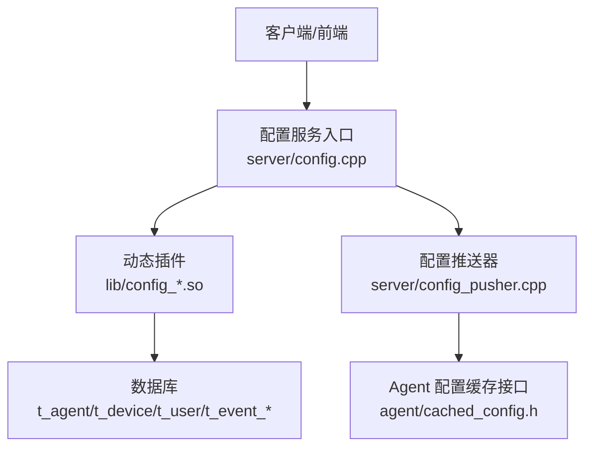
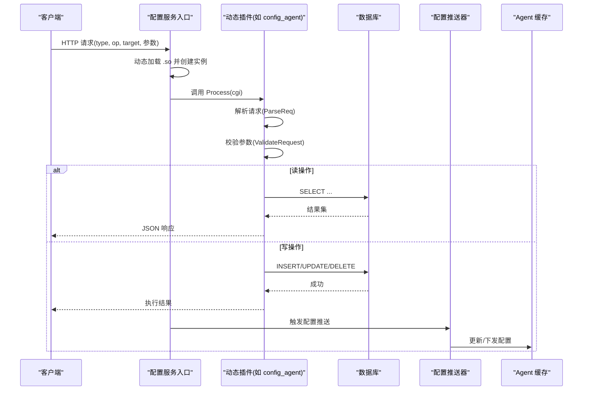
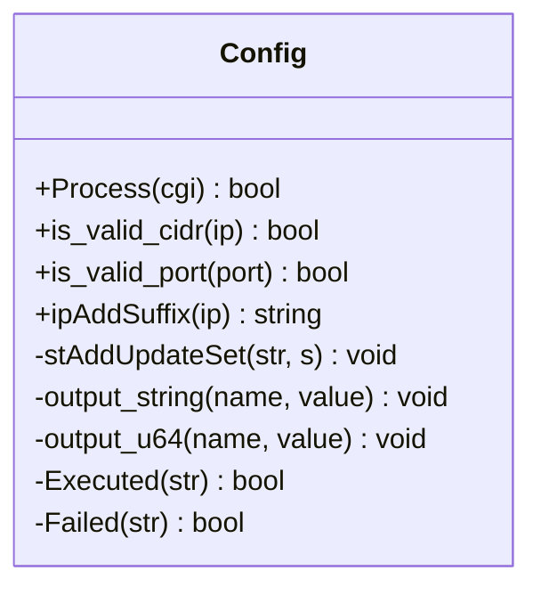
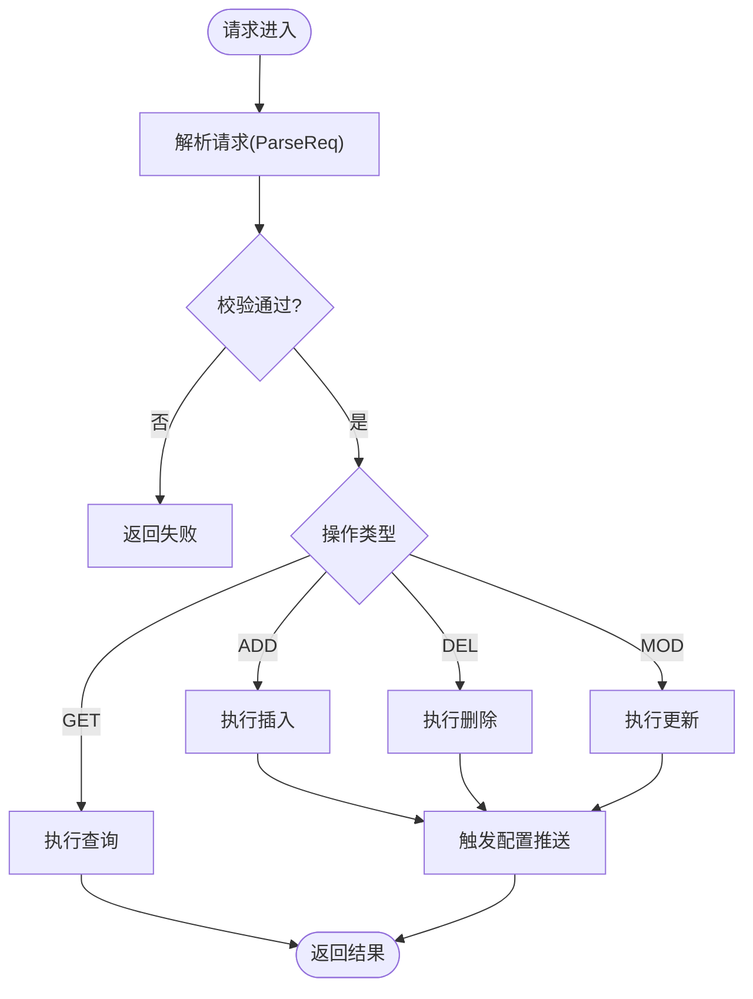
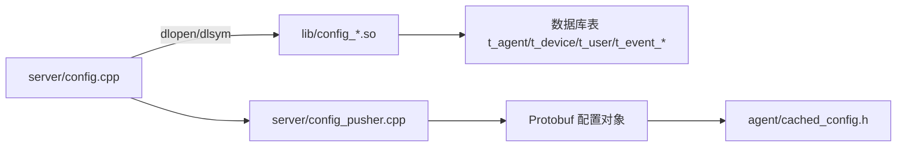

# 配置管理中心

<cite>
**本文引用的文件**
- [config.cpp](file://ly_server/src/server/config.cpp)
- [config_pusher.cpp](file://ly_server/src/server/config_pusher.cpp)
- [config_class.h](file://ly_server/src/lib/config_class.h)
- [config_agent.h](file://ly_server/src/lib/config_agent.h)
- [config_agent.cpp](file://ly_server/src/lib/config_agent.cpp)
- [config_user.cpp](file://ly_server/src/lib/config_user.cpp)
- [config_event.cpp](file://ly_server/src/lib/config_event.cpp)
- [config_device.proto](file://ly_server/src/lib/config_device.proto)
- [config_event.proto](file://ly_server/src/lib/config_event.proto)
- [config_user.proto](file://ly_server/src/lib/config_user.proto)
- [cached_config.h](file://ly_analyser/src/agent/config/cached_config.h)
</cite>

## 目录
1. [简介](#简介)
2. [项目结构](#项目结构)
3. [核心组件](#核心组件)
4. [架构总览](#架构总览)
5. [详细组件分析](#详细组件分析)
6. [依赖关系分析](#依赖关系分析)
7. [性能与扩展性](#性能与扩展性)
8. [故障排查指南](#故障排查指南)
9. [结论](#结论)
10. [附录：API 参考与最佳实践](#附录api-参考与最佳实践)

## 简介
本技术文档围绕“配置管理中心”展开，聚焦系统配置的层次结构、动态更新机制与版本管理策略；覆盖设备配置、事件规则配置与用户权限配置的管理方式；说明配置文件格式规范、校验规则与生效机制；提供配置管理的 API 接口文档（增删改查与批量更新）；并给出配置备份恢复、冲突解决与回滚机制的实现方案与管理最佳实践。

## 项目结构
配置管理由服务端入口、插件化处理器、数据持久化与推送器组成，Agent 侧通过缓存接口消费配置。关键路径如下：
- 服务端入口：接收 HTTP 请求，按 type 动态加载对应 .so 插件，调用统一 Process 流程完成解析、校验与执行。
- 插件处理器：针对 Agent、Device、Controller、User、Event 等配置域实现具体逻辑。
- 配置推送器：将数据库中的配置组装为 Protobuf 配置对象，供 Agent 拉取或下发。
- Agent 缓存：提供统一的配置读取与增量更新接口。

**图表来源**
- [config.cpp:21-79](file://ly_server/src/server/config.cpp#L21-L79)
- [config_pusher.cpp:22-113](file://ly_server/src/server/config_pusher.cpp#L22-L113)
- [cached_config.h:11-23](file://ly_analyser/src/agent/config/cached_config.h#L11-L23)

**章节来源**
- [config.cpp:21-79](file://ly_server/src/server/config.cpp#L21-L79)
- [config_pusher.cpp:22-113](file://ly_server/src/server/config_pusher.cpp#L22-L113)
- [cached_config.h:11-23](file://ly_analyser/src/agent/config/cached_config.h#L11-L23)

## 核心组件
- 配置基类与工具：提供 IP/CIDR/端口校验、SQL 拼接与输出封装等通用能力。
- 配置代理（ConfigAgent）：统一处理 Agent/Device/Controller 三类配置的增删改查。
- 用户配置（ConfigUser）：用户账号、角色、资源访问控制等。
- 事件规则配置（ConfigEvent）：阈值、扫描、DNS、URL 内容等多类型事件规则的配置与查询。
- 配置推送器（config_pusher）：从数据库聚合各类配置，生成 Protobuf 配置对象，供 Agent 使用。
- Agent 缓存接口（CachedConfig）：定义配置更新与读取的抽象接口，便于不同存储后端实现。

**章节来源**
- [config_class.h:13-66](file://ly_server/src/lib/config_class.h#L13-L66)
- [config_agent.h:10-53](file://ly_server/src/lib/config_agent.h#L10-L53)
- [config_user.cpp:84-127](file://ly_server/src/lib/config_user.cpp#L84-L127)
- [config_event.cpp:401-484](file://ly_server/src/lib/config_event.cpp#L401-L484)
- [config_pusher.cpp:22-113](file://ly_server/src/server/config_pusher.cpp#L22-L113)
- [cached_config.h:11-23](file://ly_analyser/src/agent/config/cached_config.h#L11-L23)

## 架构总览
配置管理采用“HTTP 入口 + 动态插件 + 数据库 + 推送器 + Agent 缓存”的分层架构。请求进入后，根据 type 参数动态加载对应 .so 插件，插件负责解析请求、校验参数、执行 SQL 操作，并在写操作后触发配置推送器，最终由 Agent 侧通过缓存接口获取最新配置。

**图表来源**
- [config.cpp:21-79](file://ly_server/src/server/config.cpp#L21-L79)
- [config_agent.cpp:33-66](file://ly_server/src/lib/config_agent.cpp#L33-L66)
- [config_pusher.cpp:22-113](file://ly_server/src/server/config_pusher.cpp#L22-L113)

## 详细组件分析

### 配置基类与校验
- 提供 CIDR/IP/端口合法性校验、IP 后缀补全、SQL 字段拼接与 JSON 输出封装。
- 所有插件继承该基类，保证一致的输入校验与输出格式。

**图表来源**
- [config_class.h:13-66](file://ly_server/src/lib/config_class.h#L13-L66)

**章节来源**
- [config_class.h:13-66](file://ly_server/src/lib/config_class.h#L13-L66)

### 设备与代理配置（ConfigAgent）
- 支持三类目标：Agent、Device、Controller。
- 统一解析与校验：区分目标类型，分别走 Device/Controller 校验分支。
- 写操作后触发配置推送器，确保 Agent 侧及时生效。

**图表来源**
- [config_agent.cpp:33-66](file://ly_server/src/lib/config_agent.cpp#L33-L66)
- [config_agent.cpp:177-358](file://ly_server/src/lib/config_agent.cpp#L177-L358)
- [config.cpp:70-73](file://ly_server/src/server/config.cpp#L70-L73)

**章节来源**
- [config_agent.h:10-53](file://ly_server/src/lib/config_agent.h#L10-L53)
- [config_agent.cpp:33-66](file://ly_server/src/lib/config_agent.cpp#L33-L66)
- [config_agent.cpp:177-358](file://ly_server/src/lib/config_agent.cpp#L177-L358)
- [config.cpp:70-73](file://ly_server/src/server/config.cpp#L70-L73)

### 用户权限配置（ConfigUser）
- 支持用户增删改查，包含密码哈希、角色级别、资源访问控制、锁定时间等。
- 读取时根据会话上下文限制可见范围（普通用户仅能查看自身）。

**章节来源**
- [config_user.cpp:84-127](file://ly_server/src/lib/config_user.cpp#L84-L127)
- [config_user.cpp:172-215](file://ly_server/src/lib/config_user.cpp#L172-L215)
- [config_user.cpp:217-308](file://ly_server/src/lib/config_user.cpp#L217-L308)
- [config_user.cpp:310-439](file://ly_server/src/lib/config_user.cpp#L310-L439)

### 事件规则配置（ConfigEvent）
- 支持多种事件类型：阈值、端口扫描、IP 扫描、服务连接、可疑行为、黑名单、DGA、DNS、DNS 隧道、URL 内容、FRN 行程、ICMP 隧道等。
- 统一解析目标与操作，分发到对应处理函数，进行参数校验与数据库读写。

**章节来源**
- [config_event.cpp:401-484](file://ly_server/src/lib/config_event.cpp#L401-L484)
- [config_event.cpp:486-633](file://ly_server/src/lib/config_event.cpp#L486-L633)
- [config_event.cpp:635-702](file://ly_server/src/lib/config_event.cpp#L635-L702)

### 配置推送与生效机制（config_pusher）
- 从数据库读取 MO、事件规则等配置，按设备维度聚合为 Protobuf 配置对象。
- 对时间窗口、白名单、协议匹配等进行预处理，形成 Agent 可直接使用的配置结构。
- 在写操作后由入口程序触发，确保配置变更即时生效。

**章节来源**
- [config_pusher.cpp:22-113](file://ly_server/src/server/config_pusher.cpp#L22-L113)
- [config.cpp:70-73](file://ly_server/src/server/config.cpp#L70-L73)

### Agent 侧配置缓存（CachedConfig）
- 定义配置更新与读取的统一接口，支持按 MO ID 列表过滤配置。
- 便于在不同存储后端（内存、磁盘、Redis 等）之间切换。

**章节来源**
- [cached_config.h:11-23](file://ly_analyser/src/agent/config/cached_config.h#L11-L23)

## 依赖关系分析
- 入口程序依赖动态库加载机制，按 type 选择插件。
- 插件依赖数据库访问与日志记录。
- 推送器依赖数据库与 Protobuf 序列化。
- Agent 缓存接口解耦具体实现，降低耦合度。

**图表来源**
- [config.cpp:21-79](file://ly_server/src/server/config.cpp#L21-L79)
- [config_pusher.cpp:22-113](file://ly_server/src/server/config_pusher.cpp#L22-L113)
- [cached_config.h:11-23](file://ly_analyser/src/agent/config/cached_config.h#L11-L23)

**章节来源**
- [config.cpp:21-79](file://ly_server/src/server/config.cpp#L21-L79)
- [config_pusher.cpp:22-113](file://ly_server/src/server/config_pusher.cpp#L22-L113)
- [cached_config.h:11-23](file://ly_analyser/src/agent/config/cached_config.h#L11-L23)

## 性能与扩展性
- 动态插件机制：新增配置类型只需实现新 .so 并暴露 CreateConfigInstance/FreeConfigInstance，无需修改主程序。
- 数据库直连：读写直接通过 cppdb 执行，减少中间层开销；建议对高频查询建立索引。
- 配置推送：写操作后异步触发推送器，避免阻塞请求链路。
- 可扩展点：
  - 新增配置类型：仿照现有插件实现解析、校验、CRUD。
  - 新增存储后端：实现 CachedConfig 接口，替换 Agent 侧配置读取。

[本节为通用指导，不直接分析具体文件]

## 故障排查指南
- 动态库加载失败：检查 type 参数与 .so 文件名匹配，确认 dlopen/dlsym 返回值与错误信息。
- 参数校验失败：核对必填字段、枚举值与范围（如端口、CIDR、状态位）。
- 数据库异常：捕获 cppdb 异常并记录日志，检查连接串与表结构。
- 配置未生效：确认写操作后是否触发了配置推送器，Agent 侧是否成功更新缓存。

**章节来源**
- [config.cpp:42-61](file://ly_server/src/server/config.cpp#L42-L61)
- [config_agent.cpp:177-358](file://ly_server/src/lib/config_agent.cpp#L177-L358)
- [config_user.cpp:246-305](file://ly_server/src/lib/config_user.cpp#L246-L305)
- [config_event.cpp:704-800](file://ly_server/src/lib/config_event.cpp#L704-L800)

## 结论
配置管理中心通过“入口 + 插件 + 推送器 + 缓存”的架构实现了高内聚、低耦合的配置管理能力。统一的校验与输出规范保障了数据一致性；动态插件机制提升了扩展性；推送器与 Agent 缓存确保了配置的实时生效。建议在运维中结合备份、回滚与灰度发布策略，进一步提升稳定性与可维护性。

[本节为总结，不直接分析具体文件]

## 附录：API 参考与最佳实践

### 统一请求模型
- 入口参数：
  - type：配置类型（如 agent、device、controller、user、event）
  - target：子目标（device/controller，用于 agent 插件）
  - op：操作（ADD/DEL/MOD/GET）
  - id/name/ip/creator/status/comment/disabled/serial 等：随类型变化
- 响应格式：JSON 片段（数组包裹），成功返回 executed 或带 id 的 JSON，失败返回 failed。

**章节来源**
- [config_agent.cpp:68-108](file://ly_server/src/lib/config_agent.cpp#L68-L108)
- [config_agent.cpp:110-175](file://ly_server/src/lib/config_agent.cpp#L110-L175)
- [config_agent.cpp:446-540](file://ly_server/src/lib/config_agent.cpp#L446-L540)

### 设备配置（target=device）
- 字段：id、name、type、model、agentid、creator、comment、ip、port、disabled、flowtype、pcap_level、template、filter、interface
- 校验要点：
  - name/port 必填（ADD）
  - ip 需为合法 CIDR
  - disabled 为 Y/N
  - pcap_level 范围 0-3
  - agentid 可为空
- 操作：ADD/DEL/MOD/GET

**章节来源**
- [config_agent.cpp:110-175](file://ly_server/src/lib/config_agent.cpp#L110-L175)
- [config_agent.cpp:234-330](file://ly_server/src/lib/config_agent.cpp#L234-L330)
- [config_agent.cpp:542-655](file://ly_server/src/lib/config_agent.cpp#L542-L655)
- [config_agent.cpp:657-800](file://ly_server/src/lib/config_agent.cpp#L657-L800)
- [config_device.proto:4-15](file://ly_server/src/lib/config_device.proto#L4-L15)

### 控制器配置（target=controller）
- 字段：id、name、value
- 操作：MOD/GET（不允许 ADD/DEL）
- 校验：MOD 需要 id 与 value

**章节来源**
- [config_agent.cpp:152-175](file://ly_server/src/lib/config_agent.cpp#L152-L175)
- [config_agent.cpp:332-358](file://ly_server/src/lib/config_agent.cpp#L332-L358)

### 用户权限配置（type=user）
- 字段：id、uid、username、pass、level、comment、disabled、lockedtime、resource
- 校验要点：
  - ADD 必填 username，pass 可选（为空则置空），level 默认 viewer，disabled 默认 N
  - DEL/MOD 需要 uid
  - GET 受会话限制（非 sysadmin 仅能查自身）
- 操作：ADD/DEL/MOD/GET

**章节来源**
- [config_user.cpp:129-170](file://ly_server/src/lib/config_user.cpp#L129-L170)
- [config_user.cpp:172-215](file://ly_server/src/lib/config_user.cpp#L172-L215)
- [config_user.cpp:217-308](file://ly_server/src/lib/config_user.cpp#L217-L308)
- [config_user.cpp:310-439](file://ly_server/src/lib/config_user.cpp#L310-L439)
- [config_user.proto:4-14](file://ly_server/src/lib/config_user.proto#L4-L14)

### 事件规则配置（type=event）
- 支持多子类：threshold、port_scan、ip_scan、srv、sus、black、dga、dns、dns_tunnel、dnstun_ai、url_content、frn_trip、icmp_tunnel 等
- 字段：event_id、desc、event_type、event_level、status、action_id、config_id、type_id、level_id、status_id、devid、moid、weekday、stime、etime、coverrange 及各类规则特定字段
- 校验：按目标类型分发至对应 Validate* 函数，严格校验必填字段与范围
- 操作：ADD/DEL/MOD/GET/DEL_EVENT

**章节来源**
- [config_event.cpp:486-633](file://ly_server/src/lib/config_event.cpp#L486-L633)
- [config_event.cpp:635-702](file://ly_server/src/lib/config_event.cpp#L635-L702)
- [config_event.cpp:704-800](file://ly_server/src/lib/config_event.cpp#L704-L800)
- [config_event.proto:4-116](file://ly_server/src/lib/config_event.proto#L4-L116)

### 批量更新与生效机制
- 写操作（ADD/DEL/MOD）后，入口程序会触发配置推送器，将最新配置下发至 Agent。
- Agent 通过 CachedConfig 接口获取并应用配置，支持按 MO ID 过滤。

**章节来源**
- [config.cpp:70-73](file://ly_server/src/server/config.cpp#L70-L73)
- [config_pusher.cpp:22-113](file://ly_server/src/server/config_pusher.cpp#L22-L113)
- [cached_config.h:11-23](file://ly_analyser/src/agent/config/cached_config.h#L11-L23)

### 配置备份、恢复与回滚方案
- 备份：定期导出 t_agent/t_device/t_user/t_event_* 等表数据为 SQL/CSV，并保留版本标签。
- 恢复：导入历史备份，注意外键与依赖顺序（先基础表，再关联表）。
- 回滚：基于版本标签快速切换至上一稳定版本；配合灰度发布与功能开关降低风险。
- 冲突解决：以“最后写入优先”为原则，结合审计日志定位冲突来源；必要时引入审批流与合并策略。

[本节为通用指导，不直接分析具体文件]

### 配置示例与管理最佳实践
- 示例：
  - 添加设备：target=device, op=ADD, name, port, ip(CIDR), disabled=N, flowtype=netflow, pcap_level=2
  - 修改用户：op=MOD, uid, level=viewer/admin, resource=受限资源
  - 设置事件规则：type=event, event_type=threshold, op=ADD, min/max, weekday/stime/etime/coverrange
- 最佳实践：
  - 变更前备份，变更后验证；小步快跑，灰度发布。
  - 严格校验输入，最小权限原则分配用户资源。
  - 对频繁查询建立索引，监控慢查询与错误日志。
  - 使用审计日志追踪配置变更，便于回溯与合规。

[本节为通用指导，不直接分析具体文件]