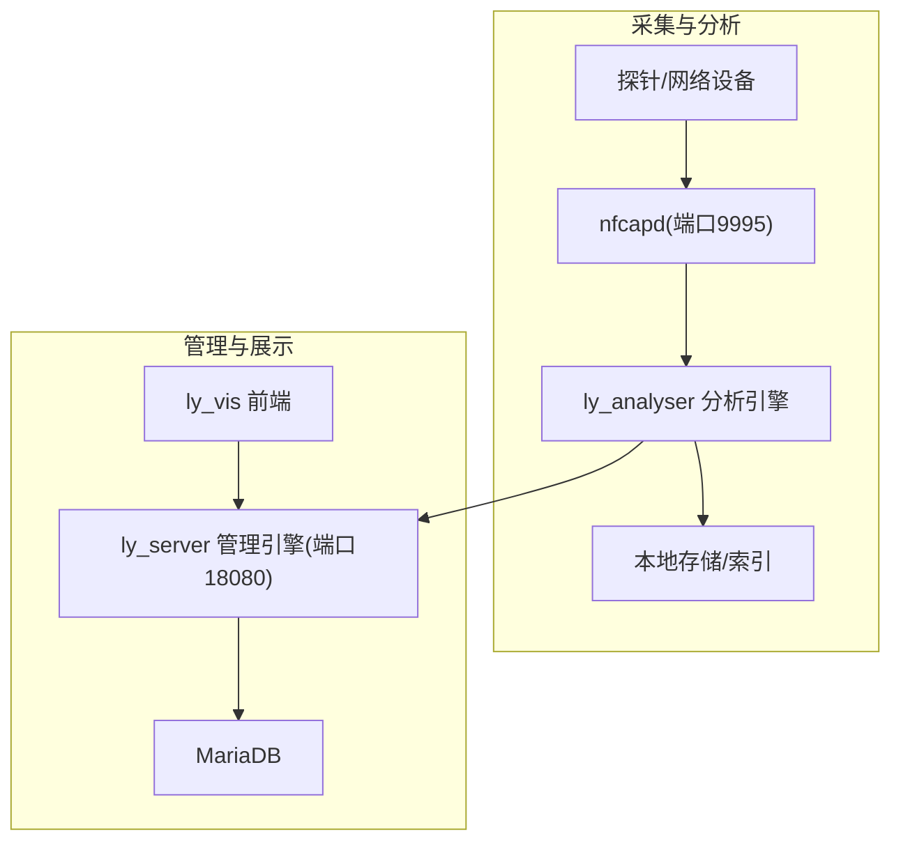
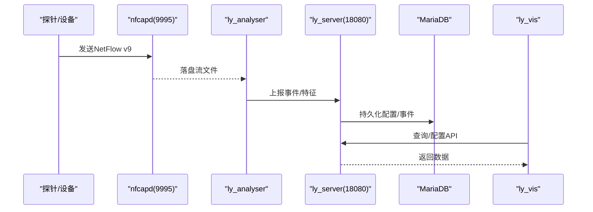
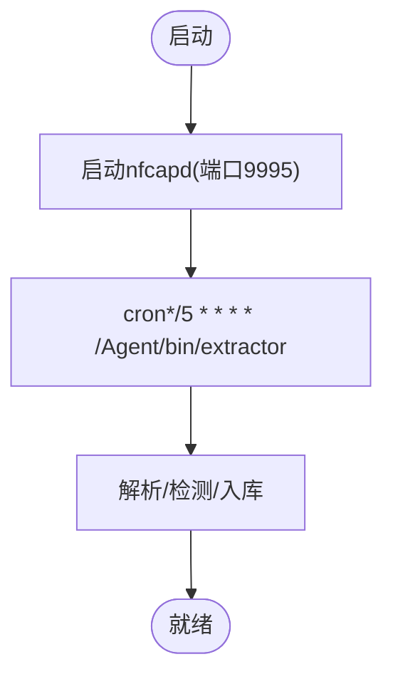
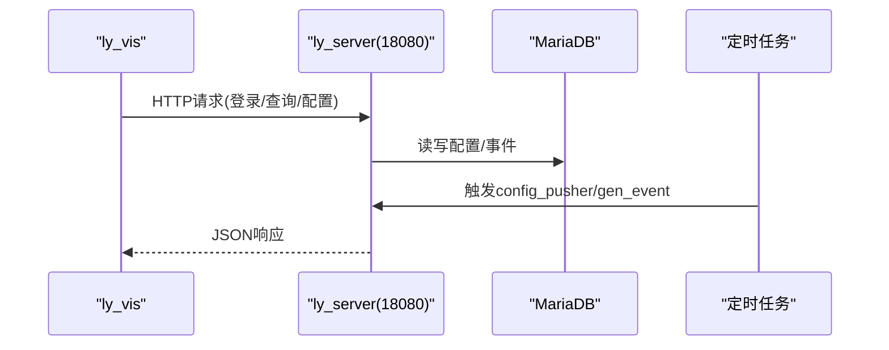
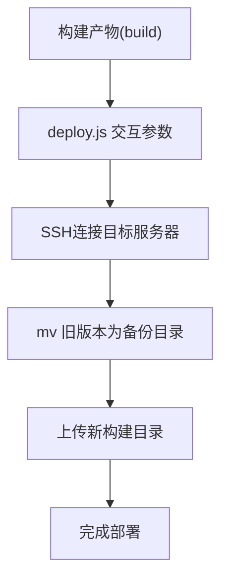
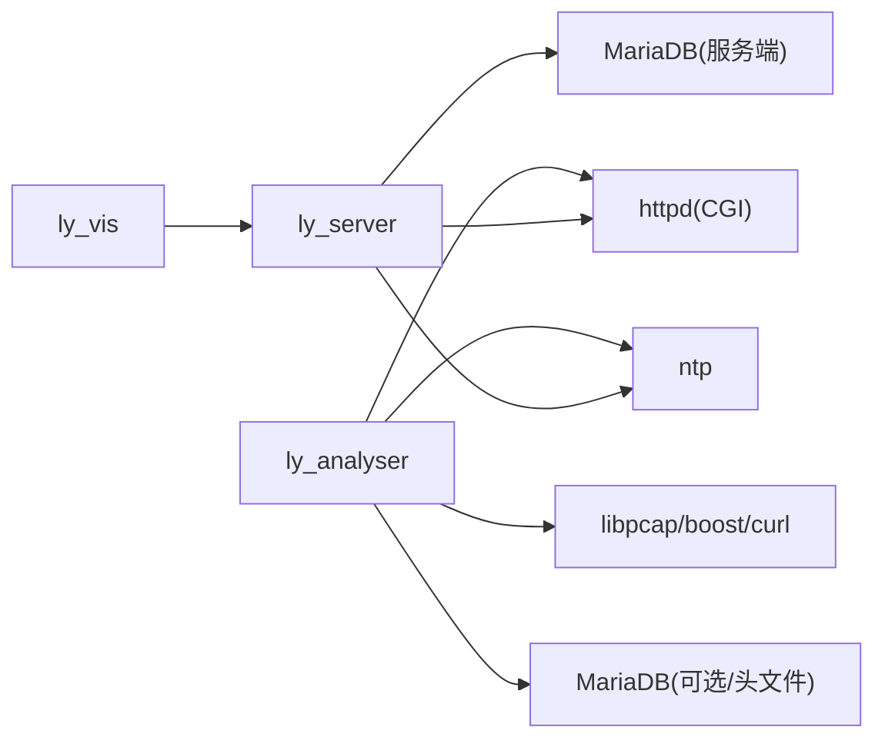

# 部署架构

<cite>
**本文引用的文件**
- [ly_analyser/README.md](file://ly_analyser/README.md)
- [ly_server/README.md](file://ly_server/README.md)
- [ly_docs/content/zh/installation/ly_analyser.md](file://ly_docs/content/zh/installation/ly_analyser.md)
- [ly_docs/content/zh/installation/ly_server.md](file://ly_docs/content/zh/installation/ly_server.md)
- [ly_vis/packages/std/deploy.js](file://ly_vis/packages/std/deploy.js)
- [ly_server/src/common/config.h](file://ly_server/src/common/config.h)
</cite>

## 目录
1. [简介](#简介)
2. [项目结构](#项目结构)
3. [核心组件](#核心组件)
4. [架构总览](#架构总览)
5. [详细组件分析](#详细组件分析)
6. [依赖关系分析](#依赖关系分析)
7. [性能与高可用](#性能与高可用)
8. [故障转移与自动扩缩容](#故障转移与自动扩缩容)
9. [数据库集群、备份与灾备](#数据库集群备份与灾备)
10. [安全加固与访问控制](#安全加固与访问控制)
11. [监控告警、日志聚合与性能监控](#监控告警日志聚合与性能监控)
12. [部署自动化与CI/CD流水线](#部署自动化与cicd流水线)
13. [维护操作指南](#维护操作指南)
14. [结论](#结论)

## 简介
本部署文档面向生产环境，基于仓库中 ly_analyser（威胁行为分析引擎）、ly_server（管理引擎）与 ly_vis（前端可视化）三个模块的现有安装与运行说明，梳理生产拓扑、网络与服务依赖、容器化与微服务化建议、负载均衡与高可用、数据库与备份、安全加固、监控与日志、以及自动化部署与维护流程。内容严格依据仓库内提供的安装与配置信息，并结合通用生产实践给出可操作的方案建议。

## 项目结构
- ly_analyser：C/C++ 实现的流量分析引擎，接收 netflow v9，执行多种检测模型，输出威胁事件与特征数据；通过 nfcapd 采集流量，使用 httpd 暴露 CGI 接口，定时任务驱动提取与分析。
- ly_server：C/C++ 实现的管理引擎，提供用户、配置、事件查询等能力，依赖 MariaDB，通过 httpd 暴露 Web 与 CGI 接口，定时任务推送配置与生成事件。
- ly_vis：前端工程，包含构建与部署脚本，支持将构建产物上传至目标服务器并回滚备份。

图示来源
- [ly_analyser/README.md:130-184](file://ly_analyser/README.md#L130-L184)
- [ly_server/README.md:107-193](file://ly_server/README.md#L107-L193)

章节来源
- [ly_analyser/README.md:1-212](file://ly_analyser/README.md#L1-L212)
- [ly_server/README.md:1-233](file://ly_server/README.md#L1-L233)
- [ly_docs/content/zh/installation/ly_analyser.md:1-210](file://ly_docs/content/zh/installation/ly_analyser.md#L1-L210)
- [ly_docs/content/zh/installation/ly_server.md:1-229](file://ly_docs/content/zh/installation/ly_server.md#L1-L229)

## 核心组件
- 流量采集与解析：nfcapd 监听 UDP 端口接收 netflow v9，写入本地目录供后续处理。
- 分析引擎：按周期触发 extractor 对采集数据进行解析与检测，产出事件与特征。
- 管理引擎：对外提供 Web/CGI 接口，负责配置下发、事件聚合、查询；依赖 MariaDB 持久化。
- 前端可视化：构建后部署到 Web 服务器，调用管理引擎 API 进行交互。

章节来源
- [ly_analyser/README.md:130-184](file://ly_analyser/README.md#L130-L184)
- [ly_server/README.md:107-193](file://ly_server/README.md#L107-L193)

## 架构总览
生产环境典型拓扑建议如下：
- 采集层：在边界或核心交换机旁路镜像流量至 ly_analyser 所在主机，nfcapd 监听 9995 端口接收 netflow。
- 分析层：ly_analyser 主机运行分析进程与索引，通过 cron 每5分钟触发 extractor。
- 管理层：ly_server 主机运行 Web/CGI（18080），连接 MariaDB，定时任务每5分钟推送配置与生成事件。
- 展示层：ly_vis 静态资源部署于 Web 服务器，访问 ly_server 提供的 API。

图示来源
- [ly_analyser/README.md:175-184](file://ly_analyser/README.md#L175-L184)
- [ly_server/README.md:120-193](file://ly_server/README.md#L120-L193)

## 详细组件分析

### 分析引擎（ly_analyser）
- 职责：接收 netflow v9，执行扫描、DGA、DNS隧道、ICMP隧道、外联、挖矿、注入等检测，输出事件与特征。
- 关键进程与端口：
  - nfcapd：监听 UDP 9995，写入 /data/flow/...
  - extractor：cron 每5分钟执行，解析与处理流文件
  - httpd：CGI 服务监听 10081（可选用于管理/导出）
- 依赖：gcc/g++、cmake、bison/flex、boost、libcurl、libpcap、mariadb-devel、httpd、ntp、cgicc、cppdb、protobuf、tensorflow（如需AI模型）。

图示来源
- [ly_analyser/README.md:175-184](file://ly_analyser/README.md#L175-L184)
- [ly_docs/content/zh/installation/ly_analyser.md:187-196](file://ly_docs/content/zh/installation/ly_analyser.md#L187-L196)

章节来源
- [ly_analyser/README.md:1-212](file://ly_analyser/README.md#L1-L212)
- [ly_docs/content/zh/installation/ly_analyser.md:1-210](file://ly_docs/content/zh/installation/ly_analyser.md#L1-L210)

### 管理引擎（ly_server）
- 职责：聚合事件、节点/用户/配置管理、数据查询；通过 httpd 暴露 Web/CGI（18080），依赖 MariaDB。
- 关键进程与端口：
  - httpd：监听 18080，DocumentRoot 指向 /Server/www，/d/ 启用 CGI
  - config_pusher 与 gen_event：cron 每5分钟执行，分别负责配置推送与事件生成
- 依赖：gcc/g++、cmake、bison/flex、json-c、boost、libcurl、mariadb-server、httpd、ntp、cgicc、cppdb、protobuf。

图示来源
- [ly_server/README.md:120-193](file://ly_server/README.md#L120-L193)
- [ly_docs/content/zh/installation/ly_server.md:120-217](file://ly_docs/content/zh/installation/ly_server.md#L120-L217)

章节来源
- [ly_server/README.md:1-233](file://ly_server/README.md#L1-L233)
- [ly_docs/content/zh/installation/ly_server.md:1-229](file://ly_docs/content/zh/installation/ly_server.md#L1-L229)

### 前端（ly_vis）
- 职责：构建静态资源并通过部署脚本上传至目标服务器，支持备份与回滚。
- 部署脚本：交互式输入 host/port/username/password/basepath/basename，先备份旧版本，再上传构建产物。

图示来源
- [ly_vis/packages/std/deploy.js:184-226](file://ly_vis/packages/std/deploy.js#L184-L226)

章节来源
- [ly_vis/packages/std/deploy.js:184-226](file://ly_vis/packages/std/deploy.js#L184-L226)

## 依赖关系分析
- 分析引擎依赖：操作系统 CentOS 7、编译工具链、网络抓包库、HTTP 服务、时间同步、数据库开发头文件、TensorFlow（可选）。
- 管理引擎依赖：同上，外加 MariaDB 服务端与初始化脚本。
- 前端依赖：Node/Yarn 构建，部署阶段通过 SSH 上传。

图示来源
- [ly_analyser/README.md:29-95](file://ly_analyser/README.md#L29-L95)
- [ly_server/README.md:21-77](file://ly_server/README.md#L21-L77)

章节来源
- [ly_analyser/README.md:29-95](file://ly_analyser/README.md#L29-L95)
- [ly_server/README.md:21-77](file://ly_server/README.md#L21-L77)

## 性能与高可用
- 采集与解析：
  - 在高吞吐场景下，建议将 nfcapd 与 ly_analyser 部署在同一主机以减少磁盘IO与网络开销；必要时可将 nfcapd 独立部署并采用多实例并行写盘。
  - 合理划分 /data/flow 子目录并按时间轮转，避免单目录过大影响索引与检索性能。
- 管理引擎：
  - MariaDB 建议开启连接池与慢查询日志，针对高频查询建立合适索引；Web 层可通过反向代理（如 Nginx）做静态缓存与限流。
- 前端：
  - 静态资源建议通过 CDN 或边缘缓存加速；构建产物最小化并启用压缩。

[本节为通用性能建议，不直接引用具体代码]

## 故障转移与自动扩缩容
- 当前仓库未内置容器编排与自动扩缩容机制。生产建议：
  - 将 ly_analyser 与 ly_server 封装为系统服务（systemd），配合健康检查与自动重启策略。
  - 使用外部负载均衡器（Nginx/HAProxy）对 ly_server 的 18080 端口做多实例负载与健康检查。
  - 对 nfcapd 与 ly_analyser 可采用双机热备或主从模式，结合 VIP 漂移实现故障转移。
  - 自动扩缩容需引入容器平台（Kubernetes）与 HPA 策略，根据 CPU/内存/队列长度指标动态伸缩。

[本节为通用高可用建议，不直接引用具体代码]

## 数据库集群、备份与灾备
- 数据库：仓库要求安装 MariaDB 服务端并初始化 server 库。生产建议：
  - 采用主从复制或多主架构，确保读写分离与高可用。
  - 定期全量+增量备份，保留策略满足合规要求；异地容灾副本。
- 备份策略：
  - 使用 mysqldump 或物理备份工具（如 Percona XtraBackup）制定计划任务。
  - 对 /data/flow 目录进行快照或对象存储归档，保证取证数据可恢复。
- 灾备：
  - 跨机房或云区域部署备用环境，定期演练切换流程。

[本节为通用数据库与灾备建议，不直接引用具体代码]

## 安全加固与访问控制
- 系统安全：
  - 关闭 SELinux 或设置为 permissive（仓库示例为 disabled），生产建议启用并配置白名单规则。
  - 仅开放必要端口：分析引擎 10081（CGI）、管理引擎 18080（Web/CGI）、nfcapd 9995（UDP）。
- 网络安全：
  - 使用防火墙策略限制源地址；对 9995 仅允许可信探针网段访问。
  - 通过反向代理统一入口，启用 HTTPS、WAF、IP 黑白名单与访问频率限制。
- 应用安全：
  - 管理端启用认证与权限控制（仓库中 /d/ 路径有 auth 重写逻辑），最小权限原则。
  - 定期更新系统与依赖库，关闭不必要的 CGI 功能，限制执行权限。

章节来源
- [ly_analyser/README.md:138-171](file://ly_analyser/README.md#L138-L171)
- [ly_server/README.md:115-158](file://ly_server/README.md#L115-L158)

## 监控告警、日志聚合与性能监控
- 系统监控：
  - 使用系统级监控（如 Prometheus Node Exporter + Grafana）采集 CPU、内存、磁盘、网络、进程状态。
- 应用监控：
  - 对 ly_server 与 ly_analyser 的关键指标（事件速率、错误率、队列深度、查询延迟）埋点并接入监控系统。
- 日志聚合：
  - 集中收集 httpd、系统与应用日志至 ELK/EFK 或 Loki，设置告警规则（如错误率突增、磁盘空间不足）。
- 性能监控：
  - 数据库慢查询与锁等待监控；nfcapd 与 extractor 的吞吐与延迟监控。

[本节为通用监控建议，不直接引用具体代码]

## 部署自动化与CI/CD流水线
- 前端部署：
  - 使用 ly_vis 提供的 deploy.js 脚本，交互式输入目标服务器信息与部署路径，自动备份并上传构建产物。
- 后端部署：
  - 将源码编译与安装步骤封装为 Ansible/SaltStack 或 Shell 脚本，结合 Git 标签发布；对 ly_analyser 与 ly_server 分别定义构建与部署任务。
- CI/CD：
  - 代码提交触发构建与单元测试，通过后生成制品并推送到制品库；预发环境验证后灰度发布至生产。
- 回滚策略：
  - 每次部署前自动备份旧版本目录，失败时快速回滚。

章节来源
- [ly_vis/packages/std/deploy.js:184-226](file://ly_vis/packages/std/deploy.js#L184-L226)

## 维护操作指南
- 日常巡检：
  - 检查 nfcapd 进程与端口 9995 是否正常运行；查看 /data/flow 目录增长情况。
  - 检查 ly_server 的 18080 端口与 MariaDB 服务状态；确认 cron 任务执行成功。
- 配置变更：
  - 通过 ly_server 管理界面或 API 修改配置，由 config_pusher 定时下发至分析引擎。
- 故障排查：
  - 查看 httpd 与系统日志定位问题；核对防火墙与 SELinux 策略。
  - 若事件缺失，检查 nfcapd 采集与 extractor 执行记录。

章节来源
- [ly_analyser/README.md:175-184](file://ly_analyser/README.md#L175-L184)
- [ly_server/README.md:197-204](file://ly_server/README.md#L197-L204)

## 结论
本仓库提供了 ly_analyser、ly_server 与 ly_vis 的安装与运行基础，生产部署应在此基础上完善高可用、安全加固、监控与自动化。建议将各模块容器化并纳入统一的编排平台，结合负载均衡、自动扩缩容、数据库集群与备份灾备，形成稳定可靠的生产体系。