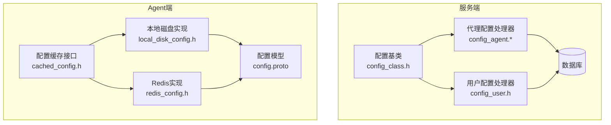
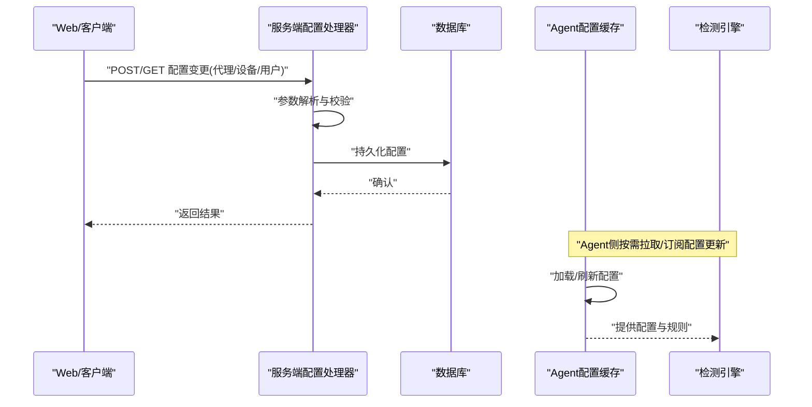
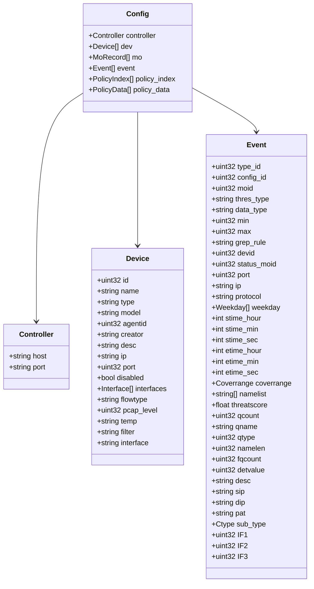
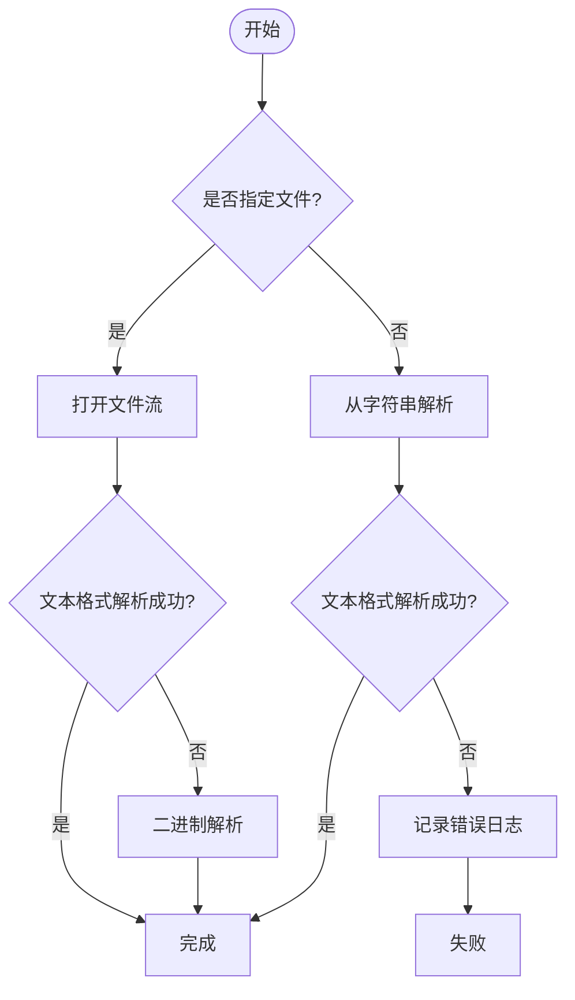
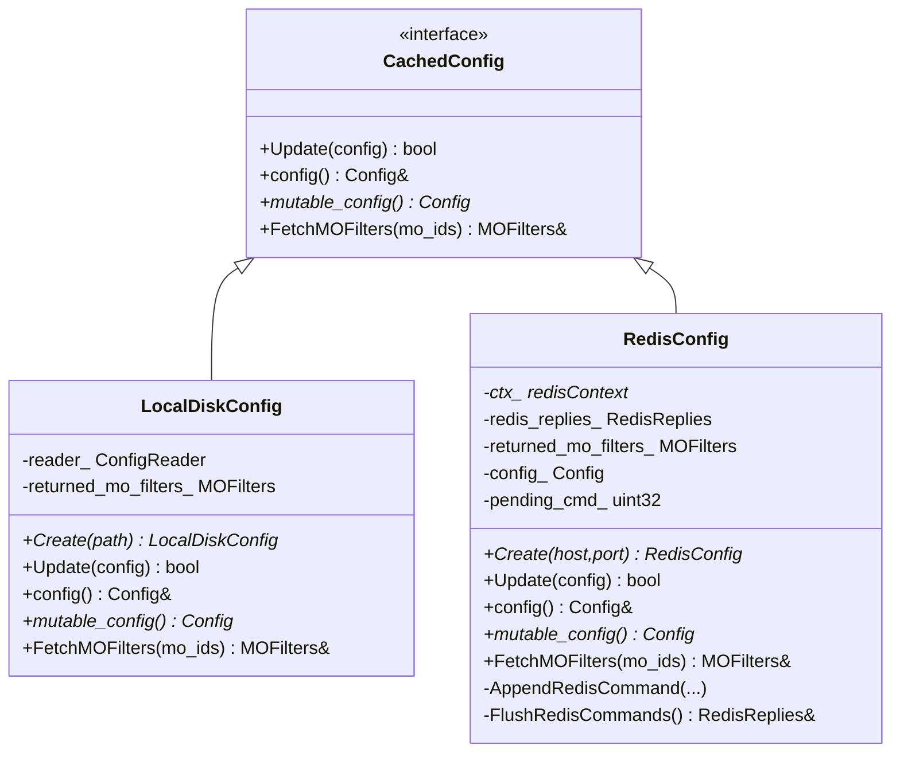
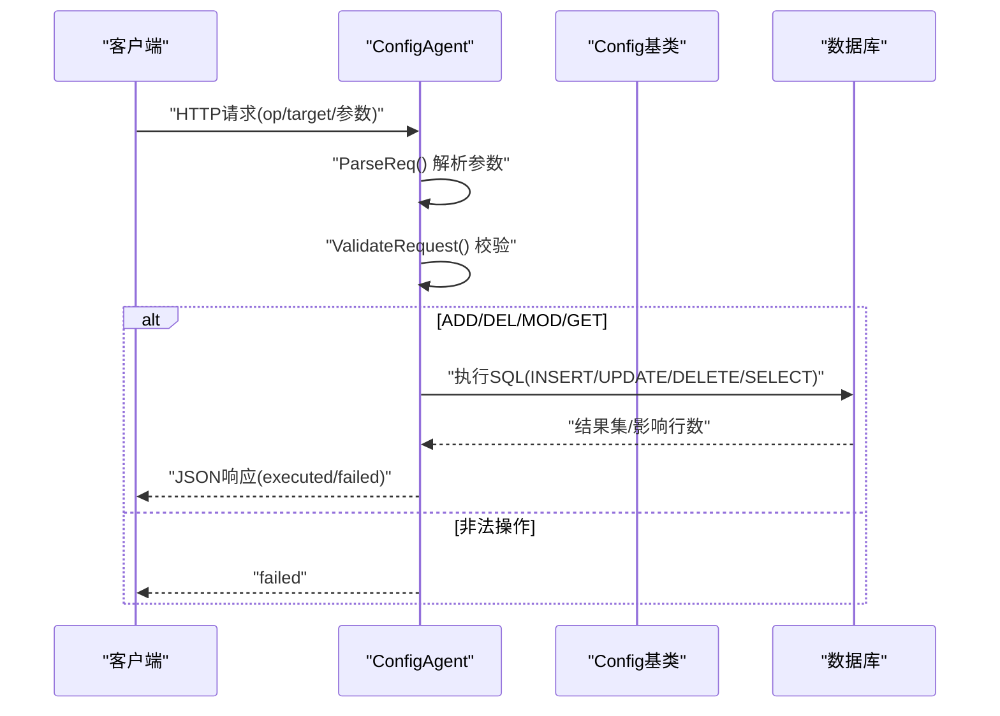
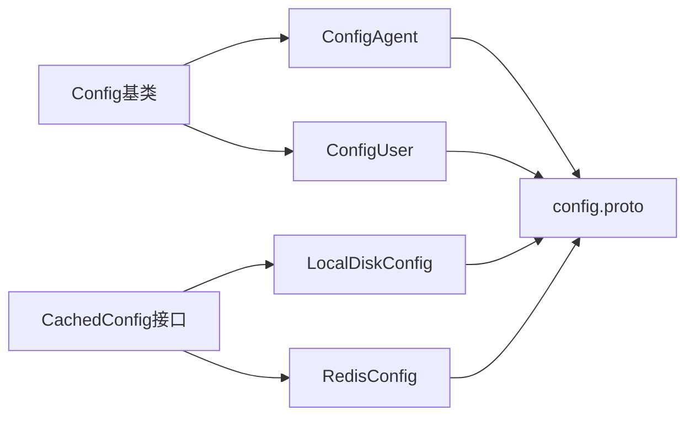

# 配置管理

<cite>
**本文引用的文件**
- [ly_analyser/src/common/config.h](file://ly_analyser/src/common/config.h)
- [ly_analyser/src/common/config.cpp](file://ly_analyser/src/common/config.cpp)
- [ly_analyser/src/common/config.proto](file://ly_analyser/src/common/config.proto)
- [ly_analyser/src/agent/config/cached_config.h](file://ly_analyser/src/agent/config/cached_config.h)
- [ly_analyser/src/agent/config/local_disk_config.h](file://ly_analyser/src/agent/config/local_disk_config.h)
- [ly_analyser/src/agent/config/redis_config.h](file://ly_analyser/src/agent/config/redis_config.h)
- [ly_server/src/lib/config_class.h](file://ly_server/src/lib/config_class.h)
- [ly_server/src/lib/config_agent.h](file://ly_server/src/lib/config_agent.h)
- [ly_server/src/lib/config_agent.cpp](file://ly_server/src/lib/config_agent.cpp)
- [ly_server/src/lib/config_user.h](file://ly_server/src/lib/config_user.h)
- [ly_server/src/lib/config_device.proto](file://ly_server/src/lib/config_device.proto)
</cite>

## 目录
1. [简介](#简介)
2. [项目结构](#项目结构)
3. [核心组件](#核心组件)
4. [架构总览](#架构总览)
5. [详细组件分析](#详细组件分析)
6. [依赖关系分析](#依赖关系分析)
7. [性能考虑](#性能考虑)
8. [故障排查指南](#故障排查指南)
9. [结论](#结论)
10. [附录](#附录)

## 简介
本技术文档聚焦于系统“配置管理”能力，覆盖以下方面：
- 配置文件结构与参数含义、默认值
- 动态配置更新机制、热重载与版本管理策略
- 检测规则配置、用户权限配置、设备管理配置
- 配置模板与最佳实践
- 安全性保障（加密存储、访问控制）
- 配置验证、错误处理与回滚策略
- 命令行工具与Web界面使用方法

本项目采用协议缓冲区定义配置模型，提供本地磁盘与Redis两种Agent端配置缓存实现；服务端通过统一的配置抽象基类与具体处理器（代理、设备、用户等）暴露HTTP接口进行CRUD操作。

## 项目结构
配置相关代码主要分布在两个子系统中：
- ly_analyser（分析器/Agent侧）：负责加载、缓存并下发配置到检测引擎
- ly_server（服务端）：提供配置管理的HTTP接口与持久化（数据库）

**图表来源**
- [ly_server/src/lib/config_class.h:12-66](file://ly_server/src/lib/config_class.h#L12-L66)
- [ly_server/src/lib/config_agent.h:10-53](file://ly_server/src/lib/config_agent.h#L10-L53)
- [ly_server/src/lib/config_user.h:12-38](file://ly_server/src/lib/config_user.h#L12-L38)
- [ly_analyser/src/agent/config/cached_config.h:11-26](file://ly_analyser/src/agent/config/cached_config.h#L11-L26)
- [ly_analyser/src/agent/config/local_disk_config.h:13-29](file://ly_analyser/src/agent/config/local_disk_config.h#L13-L29)
- [ly_analyser/src/agent/config/redis_config.h:14-41](file://ly_analyser/src/agent/config/redis_config.h#L14-L41)
- [ly_analyser/src/common/config.proto:6-13](file://ly_analyser/src/common/config.proto#L6-L13)

**章节来源**
- [ly_server/src/lib/config_class.h:12-66](file://ly_server/src/lib/config_class.h#L12-L66)
- [ly_analyser/src/common/config.proto:6-13](file://ly_analyser/src/common/config.proto#L6-L13)

## 核心组件
- 配置数据模型（Protobuf）：统一描述控制器、设备、事件、策略等配置项，便于跨进程/语言传输与序列化。
- 配置读写器：支持从文件或字符串解析为Protobuf对象，支持文本或二进制格式输出。
- Agent配置缓存：提供统一接口以获取配置与按MO过滤的匹配规则，支持本地磁盘与Redis两种后端。
- 服务端配置处理器：基于统一基类实现代理、设备、用户等配置的HTTP接口与校验逻辑，并持久化至数据库。

**章节来源**
- [ly_analyser/src/common/config.proto:6-13](file://ly_analyser/src/common/config.proto#L6-L13)
- [ly_analyser/src/common/config.h:6-46](file://ly_analyser/src/common/config.h#L6-L46)
- [ly_analyser/src/agent/config/cached_config.h:11-26](file://ly_analyser/src/agent/config/cached_config.h#L11-L26)
- [ly_server/src/lib/config_class.h:12-66](file://ly_server/src/lib/config_class.h#L12-L66)

## 架构总览
服务端通过HTTP接收配置变更请求，经参数解析与校验后写入数据库；Agent端通过缓存层读取配置，并按需拉取或订阅更新。配置模型由Protobuf定义，保证一致性与可扩展性。

**图表来源**
- [ly_server/src/lib/config_agent.cpp:33-66](file://ly_server/src/lib/config_agent.cpp#L33-L66)
- [ly_server/src/lib/config_agent.cpp:177-358](file://ly_server/src/lib/config_agent.cpp#L177-L358)
- [ly_analyser/src/agent/config/cached_config.h:11-26](file://ly_analyser/src/agent/config/cached_config.h#L11-L26)

## 详细组件分析

### 配置数据模型（Protobuf）
- 顶层Config包含控制器、设备列表、MO记录、事件、策略索引与策略数据。
- Device字段包含类型、型号、关联Agent、IP/端口、禁用标志、抓包级别、模板、过滤器、接口等。
- Event定义多种检测类型及时间窗口、覆盖范围、威胁评分等参数。

**图表来源**
- [ly_analyser/src/common/config.proto:6-13](file://ly_analyser/src/common/config.proto#L6-L13)
- [ly_analyser/src/common/config.proto:15-45](file://ly_analyser/src/common/config.proto#L15-L45)
- [ly_analyser/src/common/config.proto:47-129](file://ly_analyser/src/common/config.proto#L47-L129)

**章节来源**
- [ly_analyser/src/common/config.proto:6-13](file://ly_analyser/src/common/config.proto#L6-L13)
- [ly_analyser/src/common/config.proto:15-45](file://ly_analyser/src/common/config.proto#L15-L45)
- [ly_analyser/src/common/config.proto:47-129](file://ly_analyser/src/common/config.proto#L47-L129)

### 配置读写器（本地文件/字符串）
- 支持从文件/字符串解析为Protobuf对象，优先尝试文本格式，失败则回退二进制。
- 支持将配置序列化为文本或二进制，并写入文件或字符串。
- 提供错误日志记录，便于定位解析/写入问题。

**图表来源**
- [ly_analyser/src/common/config.cpp:16-42](file://ly_analyser/src/common/config.cpp#L16-L42)
- [ly_analyser/src/common/config.cpp:44-76](file://ly_analyser/src/common/config.cpp#L44-L76)

**章节来源**
- [ly_analyser/src/common/config.h:6-46](file://ly_analyser/src/common/config.h#L6-L46)
- [ly_analyser/src/common/config.cpp:16-76](file://ly_analyser/src/common/config.cpp#L16-L76)

### Agent配置缓存（本地磁盘/Redis）
- 抽象接口CachedConfig提供Update、config/mutable_config、FetchMOFilters等方法。
- LocalDiskConfig从本地文件加载配置，当前Update暂不可用（待完善）。
- RedisConfig通过Redis上下文执行命令，支持批量追加与刷新，维护本地缓存与返回过滤结果。

**图表来源**
- [ly_analyser/src/agent/config/cached_config.h:11-26](file://ly_analyser/src/agent/config/cached_config.h#L11-L26)
- [ly_analyser/src/agent/config/local_disk_config.h:13-29](file://ly_analyser/src/agent/config/local_disk_config.h#L13-L29)
- [ly_analyser/src/agent/config/redis_config.h:14-41](file://ly_analyser/src/agent/config/redis_config.h#L14-L41)

**章节来源**
- [ly_analyser/src/agent/config/cached_config.h:11-26](file://ly_analyser/src/agent/config/cached_config.h#L11-L26)
- [ly_analyser/src/agent/config/local_disk_config.h:13-29](file://ly_analyser/src/agent/config/local_disk_config.h#L13-L29)
- [ly_analyser/src/agent/config/redis_config.h:14-41](file://ly_analyser/src/agent/config/redis_config.h#L14-L41)

### 服务端配置处理器（代理/设备/用户）
- 基类Config提供通用方法：CIDR/端口校验、SQL拼接辅助、输出格式化、统一成功/失败响应封装。
- ConfigAgent处理代理、设备、控制器三类配置的CRUD，解析HTTP参数并路由到对应方法，执行数据库操作。
- ConfigUser处理用户配置CRUD，遵循相同流程。

**图表来源**
- [ly_server/src/lib/config_agent.cpp:33-66](file://ly_server/src/lib/config_agent.cpp#L33-L66)
- [ly_server/src/lib/config_agent.cpp:68-175](file://ly_server/src/lib/config_agent.cpp#L68-L175)
- [ly_server/src/lib/config_agent.cpp:177-358](file://ly_server/src/lib/config_agent.cpp#L177-L358)
- [ly_server/src/lib/config_agent.cpp:360-540](file://ly_server/src/lib/config_agent.cpp#L360-L540)
- [ly_server/src/lib/config_agent.cpp:542-800](file://ly_server/src/lib/config_agent.cpp#L542-L800)
- [ly_server/src/lib/config_class.h:21-61](file://ly_server/src/lib/config_class.h#L21-L61)

**章节来源**
- [ly_server/src/lib/config_class.h:12-66](file://ly_server/src/lib/config_class.h#L12-L66)
- [ly_server/src/lib/config_agent.h:10-53](file://ly_server/src/lib/config_agent.h#L10-L53)
- [ly_server/src/lib/config_agent.cpp:33-800](file://ly_server/src/lib/config_agent.cpp#L33-L800)
- [ly_server/src/lib/config_user.h:12-38](file://ly_server/src/lib/config_user.h#L12-L38)

### 检测规则配置（Event）
- 通过Event消息定义检测类型、阈值、时间窗口、覆盖范围、威胁评分等。
- 可在Agent侧根据MO ID过滤出适用的规则集合，供检测引擎使用。

**章节来源**
- [ly_analyser/src/common/config.proto:47-129](file://ly_analyser/src/common/config.proto#L47-L129)
- [ly_analyser/src/agent/config/cached_config.h:16-22](file://ly_analyser/src/agent/config/cached_config.h#L16-L22)

### 用户权限配置（ConfigUser）
- 提供用户配置的增删改查接口，遵循统一校验与输出流程。
- 可结合会话长度常量用于会话管理（如令牌长度）。

**章节来源**
- [ly_server/src/lib/config_user.h:12-38](file://ly_server/src/lib/config_user.h#L12-L38)

### 设备管理配置（Device）
- 设备消息包含名称、类型、型号、关联Agent、IP/端口、禁用标志、抓包级别、模板、过滤器、接口等。
- 服务端对设备配置进行严格校验（必填、范围、端口合法性），并持久化。

**章节来源**
- [ly_analyser/src/common/config.proto:27-45](file://ly_analyser/src/common/config.proto#L27-L45)
- [ly_server/src/lib/config_device.proto:4-15](file://ly_server/src/lib/config_device.proto#L4-L15)
- [ly_server/src/lib/config_agent.cpp:234-330](file://ly_server/src/lib/config_agent.cpp#L234-L330)

## 依赖关系分析
- 服务端基类依赖cppdb进行数据库操作，提供通用校验与输出方法。
- 配置处理器依赖Protobuf消息进行参数绑定与结果序列化。
- Agent缓存层依赖本地文件系统或Redis进行配置存取。

**图表来源**
- [ly_server/src/lib/config_class.h:12-66](file://ly_server/src/lib/config_class.h#L12-L66)
- [ly_server/src/lib/config_agent.h:10-53](file://ly_server/src/lib/config_agent.h#L10-L53)
- [ly_server/src/lib/config_user.h:12-38](file://ly_server/src/lib/config_user.h#L12-L38)
- [ly_analyser/src/agent/config/cached_config.h:11-26](file://ly_analyser/src/agent/config/cached_config.h#L11-L26)
- [ly_analyser/src/agent/config/local_disk_config.h:13-29](file://ly_analyser/src/agent/config/local_disk_config.h#L13-L29)
- [ly_analyser/src/agent/config/redis_config.h:14-41](file://ly_analyser/src/agent/config/redis_config.h#L14-L41)
- [ly_analyser/src/common/config.proto:6-13](file://ly_analyser/src/common/config.proto#L6-L13)

**章节来源**
- [ly_server/src/lib/config_class.h:12-66](file://ly_server/src/lib/config_class.h#L12-L66)
- [ly_analyser/src/common/config.proto:6-13](file://ly_analyser/src/common/config.proto#L6-L13)

## 性能考虑
- 配置读取：本地磁盘适合静态配置；Redis适合高并发与分布式场景，减少IO延迟。
- 批量命令：RedisConfig支持批量追加命令后再一次性刷新，降低网络往返开销。
- 校验前置：在服务端尽早进行参数校验，避免无效请求进入数据库层。
- 输出优化：使用流式输出与结构化响应，减少内存占用。

[本节为通用指导，不直接分析具体文件]

## 故障排查指南
- 配置解析失败：检查文件格式与内容，确认文本/二进制格式选择正确；查看错误日志定位具体问题。
- 参数校验失败：核对必填字段、取值范围（如端口、CIDR）、枚举值（如disabled）。
- 数据库异常：捕获并记录数据库异常信息，检查连接与表结构。
- 缓存未更新：确认Redis命令是否正确追加与刷新；本地磁盘路径是否可写。

**章节来源**
- [ly_analyser/src/common/config.cpp:22-42](file://ly_analyser/src/common/config.cpp#L22-L42)
- [ly_server/src/lib/config_agent.cpp:177-358](file://ly_server/src/lib/config_agent.cpp#L177-L358)
- [ly_server/src/lib/config_agent.cpp:360-540](file://ly_server/src/lib/config_agent.cpp#L360-L540)
- [ly_server/src/lib/config_agent.cpp:542-800](file://ly_server/src/lib/config_agent.cpp#L542-L800)

## 结论
本配置管理体系通过Protobuf统一模型、服务端统一校验与持久化、Agent端灵活缓存，实现了稳定可靠的配置管理能力。建议在生产环境中：
- 使用Redis作为Agent配置后端以提升性能与一致性
- 强化参数校验与输入清洗，防止注入与越权
- 建立配置版本管理与回滚机制，确保变更可追溯与可恢复
- 结合审计日志与安全策略，保障配置安全

[本节为总结性内容，不直接分析具体文件]

## 附录

### 配置模板与最佳实践
- 模板建议：在设备配置中预置常用模板（如路由器、交换机），减少重复配置。
- 默认值：合理设置默认值（如设备类型、禁用标志、抓包级别），简化初始配置。
- 命名规范：统一命名约定，便于检索与管理。
- 最小权限：仅授予必要的配置修改权限，遵循最小权限原则。

[本节为通用指导，不直接分析具体文件]

### 安全性保障措施
- 加密存储：敏感字段（如密钥、密码）应在存储前进行加密，并在读取时解密。
- 访问控制：对配置接口实施鉴权与授权，限制仅管理员可修改关键配置。
- 审计日志：记录所有配置变更操作，包括操作人、时间、前后差异。
- 输入校验：严格校验输入，防止注入与越权访问。

[本节为通用指导，不直接分析具体文件]

### 配置验证机制、错误处理与回滚策略
- 验证机制：在服务端进行强校验（类型、范围、必填），在Agent端进行二次校验。
- 错误处理：统一错误码与消息，记录详细日志，便于快速定位问题。
- 回滚策略：变更前备份当前配置，失败时自动回滚至上一版本；支持手动回滚。

[本节为通用指导，不直接分析具体文件]

### 命令行工具与Web界面使用方法
- 命令行工具：可通过基类Process(int argc, char**argv)扩展命令行参数，实现批量导入/导出配置。
- Web界面：通过HTTP接口（op/target/参数）进行配置管理，建议使用表单或API客户端进行交互。

**章节来源**
- [ly_server/src/lib/config_class.h:18-19](file://ly_server/src/lib/config_class.h#L18-L19)
- [ly_server/src/lib/config_agent.cpp:68-175](file://ly_server/src/lib/config_agent.cpp#L68-L175)