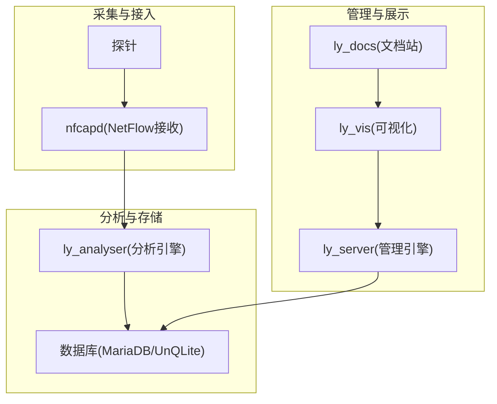
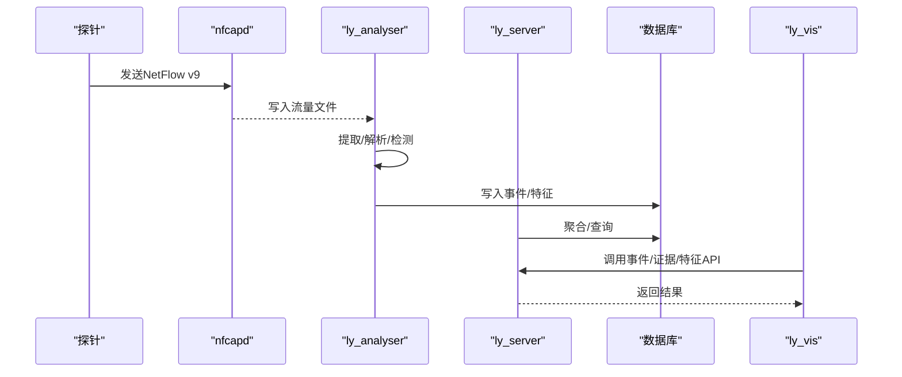
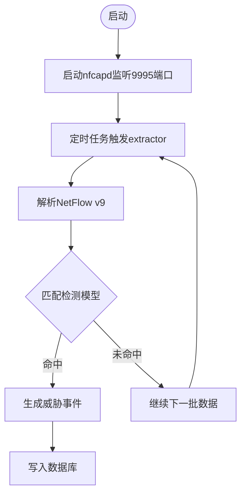
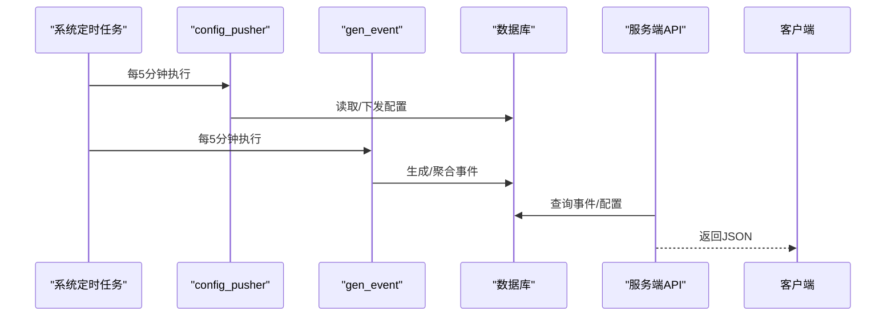
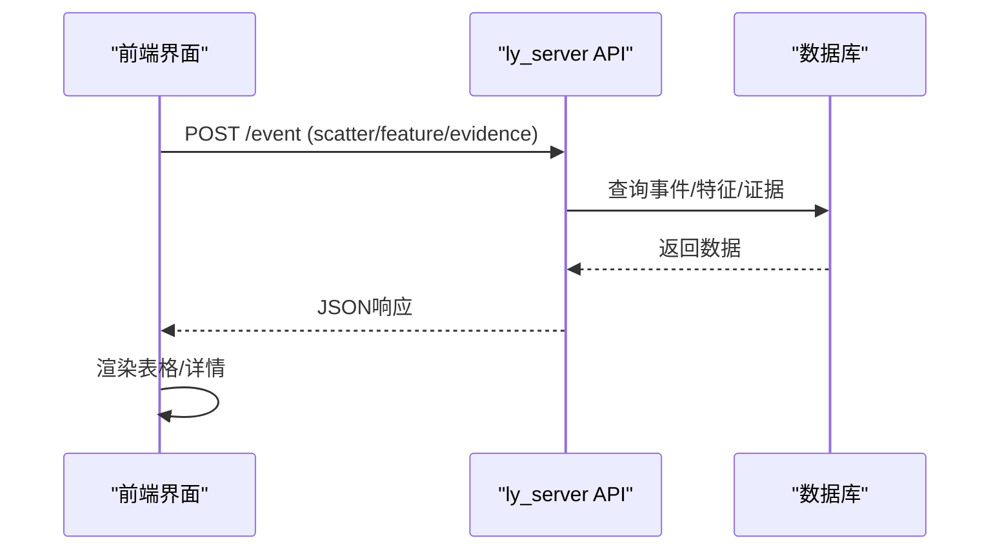
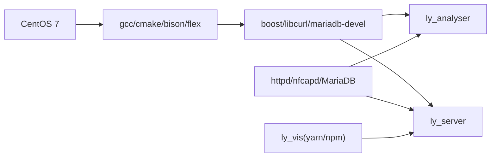

# 附录

<cite>
**本文引用的文件**
- [ly_analyser/README.md](file://ly_analyser/README.md)
- [ly_analyser/INSTALL.md](file://ly_analyser/INSTALL.md)
- [ly_server/README.md](file://ly_server/README.md)
- [ly_docs/README.md](file://ly_docs/README.md)
- [ly_docs/content/zh/user-manual/_index.md](file://ly_docs/content/zh/user-manual/_index.md)
- [ly_docs/content/zh/installation/_index.md](file://ly_docs/content/zh/installation/_index.md)
- [ly_vis/packages/std/src/service/api/event.js](file://ly_vis/packages/std/src/service/api/event.js)
- [ly_vis/yarn.lock](file://ly_vis/yarn.lock)
</cite>

## 目录
1. [简介](#简介)
2. [项目结构](#项目结构)
3. [核心组件](#核心组件)
4. [架构总览](#架构总览)
5. [详细组件分析](#详细组件分析)
6. [依赖分析](#依赖分析)
7. [性能考虑](#性能考虑)
8. [故障排查指南](#故障排查指南)
9. [结论](#结论)
10. [附录](#附录)

## 简介
本附录为流影（Flow Shadow）SOC 项目的综合参考资料，涵盖术语表、第三方依赖与许可证、标准协议与参考链接、配置与API示例、版本与变更记录、联系方式与技术支持渠道、法律声明与隐私政策等。内容基于仓库内现有文档与源码信息整理，便于快速查阅与对照。

## 项目结构
本项目由多个模块组成：
- ly_analyser：威胁行为分析引擎，接收并解析 NetFlow v9 数据，运行检测模型产出事件与特征。
- ly_server：管理引擎，聚合事件、管理节点/用户/配置、提供查询能力。
- ly_vis：可视化前端（Hugo 文档站点与前端组件）。
- ly_docs：文档站点与使用说明。

图表来源
- [ly_analyser/README.md:1-212](file://ly_analyser/README.md#L1-L212)
- [ly_server/README.md:1-233](file://ly_server/README.md#L1-L233)
- [ly_docs/README.md:1-40](file://ly_docs/README.md#L1-L40)

章节来源
- [ly_analyser/README.md:1-212](file://ly_analyser/README.md#L1-L212)
- [ly_server/README.md:1-233](file://ly_server/README.md#L1-L233)
- [ly_docs/README.md:1-40](file://ly_docs/README.md#L1-L40)

## 核心组件
- 分析引擎（ly_analyser）
  - 功能：读取 NetFlow v9 数据，执行扫描、DGA、DNS隧道、ICMP隧道、外联、挖矿、注入等检测；支持机器学习、威胁情报、包检测、经验模型。
  - 关键流程：nfcapd 接收 -> 提取器处理 -> 模型检测 -> 事件/特征落库。
- 管理引擎（ly_server）
  - 功能：事件聚合、节点/用户/配置管理、数据查询、配置下发。
  - 关键流程：定时任务生成事件/推送配置 -> 数据库持久化 -> API 暴露。
- 可视化（ly_vis）
  - 功能：事件/证据/特征查询与展示，HTTP 请求头/参数格式化显示。
- 文档站（ly_docs）
  - 功能：安装、使用、贡献说明等文档发布。

章节来源
- [ly_analyser/README.md:1-212](file://ly_analyser/README.md#L1-L212)
- [ly_server/README.md:1-233](file://ly_server/README.md#L1-L233)
- [ly_vis/packages/std/src/service/api/event.js:42-74](file://ly_vis/packages/std/src/service/api/event.js#L42-L74)
- [ly_docs/content/zh/user-manual/_index.md:1-20](file://ly_docs/content/zh/user-manual/_index.md#L1-L20)

## 架构总览
下图展示了从探针到可视化的端到端数据流与控制流。

图表来源
- [ly_analyser/README.md:150-184](file://ly_analyser/README.md#L150-L184)
- [ly_server/README.md:197-204](file://ly_server/README.md#L197-L204)
- [ly_vis/packages/std/src/service/api/event.js:42-74](file://ly_vis/packages/std/src/service/api/event.js#L42-L74)

## 详细组件分析

### 分析引擎（ly_analyser）
- 输入：NetFlow v9（通过 nfcapd 接收并落盘）。
- 处理：提取器（extractor）周期性拉取并解析，flow 模块加载多种检测模型（扫描、DGA、DNS/ICMP隧道、外联、挖矿、注入等），结合机器学习、威胁情报、包检测、经验模型进行判定。
- 输出：威胁事件与取证特征，持久化至数据库。
- 部署要点：CentOS 7，需安装 gcc/cmake/boost/libcurl/mariadb-devel/httpd/ntp/cgicc/cppdb/protobuf/tensorflow 等依赖；开放端口 10081（HTTP）、9995（NetFlow）。

图表来源
- [ly_analyser/README.md:150-184](file://ly_analyser/README.md#L150-L184)
- [ly_analyser/INSTALL.md:85-94](file://ly_analyser/INSTALL.md#L85-L94)

章节来源
- [ly_analyser/README.md:1-212](file://ly_analyser/README.md#L1-L212)
- [ly_analyser/INSTALL.md:1-98](file://ly_analyser/INSTALL.md#L1-L98)

### 管理引擎（ly_server）
- 功能：事件聚合、节点/用户/配置管理、数据查询、配置下发。
- 部署要点：CentOS 7，MariaDB 作为后端；开放端口 18080（HTTP）；配置 httpd 虚拟主机与CGI；初始化数据库并导入脚本。
- 定时任务：config_pusher 与 gen_event 每5分钟执行。

图表来源
- [ly_server/README.md:197-204](file://ly_server/README.md#L197-L204)
- [ly_server/README.md:107-193](file://ly_server/README.md#L107-L193)

章节来源
- [ly_server/README.md:1-233](file://ly_server/README.md#L1-L233)

### 可视化（ly_vis）
- 事件/证据/特征接口封装：event、event_feature、evidence 等 POST 调用。
- HTTP 头部/参数解析展示：对请求方法、协议、状态码等进行格式化。

图表来源
- [ly_vis/packages/std/src/service/api/event.js:42-74](file://ly_vis/packages/std/src/service/api/event.js#L42-L74)

章节来源
- [ly_vis/packages/std/src/service/api/event.js:42-74](file://ly_vis/packages/std/src/service/api/event.js#L42-L74)

## 依赖分析
- 操作系统与编译环境
  - CentOS 7 x86_64 Minimal
  - gcc/g++/cmake、bison/flex、boost、libcurl、mariadb-devel、httpd、ntp、cgicc、cppdb、protobuf、tensorflow（分析引擎）
- 运行时服务
  - MariaDB（服务器与管理引擎）
  - HTTPD（CGI/静态资源）
  - nfcapd（NetFlow 接收）
- 前端依赖（部分）
  - yarn.lock 中可见 semver、spdx-* 等工具链依赖，用于构建与许可证识别。

图表来源
- [ly_analyser/README.md:29-95](file://ly_analyser/README.md#L29-L95)
- [ly_server/README.md:21-77](file://ly_server/README.md#L21-L77)
- [ly_vis/yarn.lock:16291-16778](file://ly_vis/yarn.lock#L16291-L16778)

章节来源
- [ly_analyser/README.md:29-95](file://ly_analyser/README.md#L29-L95)
- [ly_server/README.md:21-77](file://ly_server/README.md#L21-L77)
- [ly_vis/yarn.lock:16291-16778](file://ly_vis/yarn.lock#L16291-L16778)

## 性能考虑
- 网络采集
  - 合理设置 nfcapd 缓冲区与轮询频率，避免丢包。
  - 使用独立网卡或VLAN隔离流量采集。
- 存储与索引
  - 根据事件量级调整 MariaDB 参数与索引策略。
  - 对高频查询字段建立合适索引，减少全表扫描。
- 计算与模型
  - 将CPU密集型模型部署在独立节点，避免与IO争用。
  - 对大流量场景启用批量处理与异步队列。
- Web 层
  - 对HTTPD启用缓存与压缩，减少重复请求开销。
  - 前端分页与增量加载，降低首屏压力。

[本节为通用建议，不直接引用具体文件]

## 故障排查指南
- 无法接收 NetFlow
  - 检查防火墙是否放行 9995 端口；确认 nfcapd 进程与日志。
  - 参考：[ly_analyser/README.md:150-184](file://ly_analyser/README.md#L150-L184)、[ly_analyser/INSTALL.md:85-94](file://ly_analyser/INSTALL.md#L85-L94)
- 事件未生成
  - 检查 extractor 定时任务是否执行；查看日志与数据库写入情况。
  - 参考：[ly_analyser/README.md:175-184](file://ly_analyser/README.md#L175-L184)
- 管理引擎不可访问
  - 检查 18080 端口与 httpd 配置；确认 MariaDB 已启动且数据库已初始化。
  - 参考：[ly_server/README.md:107-193](file://ly_server/README.md#L107-L193)
- 前端无法获取数据
  - 检查 ly_vis 调用的 event/evidence/event_feature 接口是否可达；核对鉴权与跨域。
  - 参考：[ly_vis/packages/std/src/service/api/event.js:42-74](file://ly_vis/packages/std/src/service/api/event.js#L42-L74)

章节来源
- [ly_analyser/README.md:150-184](file://ly_analyser/README.md#L150-L184)
- [ly_analyser/INSTALL.md:85-94](file://ly_analyser/INSTALL.md#L85-L94)
- [ly_server/README.md:107-193](file://ly_server/README.md#L107-L193)
- [ly_vis/packages/std/src/service/api/event.js:42-74](file://ly_vis/packages/std/src/service/api/event.js#L42-L74)

## 结论
本附录汇总了流影 SOC 的术语、依赖、协议、配置与API示例、版本与变更、联系与支持等信息，帮助使用者快速定位问题与完成部署运维。建议在生产环境中结合监控与审计，持续优化性能与安全性。

[本节为总结性内容，不直接引用具体文件]

## 附录

### 术语表与缩写
- NetFlow v9：Cisco 定义的流量导出格式，用于记录网络会话元数据。
- nfcapd：NetFlow 数据采集与落盘工具。
- DGA：域名生成算法，常用于恶意C2通信。
- DNS/ICMP 隧道：利用DNS或ICMP协议封装数据进行隐蔽通信。
- 威胁情报（TI）：来自外部源的可操作安全信息，辅助检测与响应。
- 事件/特征/证据：威胁检测结果、关联指标与原始数据包片段。
- SOC：安全运营中心（Security Operations Center）。
- API：应用程序编程接口。
- CGI：通用网关接口，用于Web与后端程序交互。
- MariaDB：开源关系型数据库。
- Hugo：静态站点生成器，用于构建文档网站。

[本节为概念解释，不直接引用具体文件]

### 第三方依赖与许可证
- 分析引擎依赖
  - protobuf 3.8.0、tensorflow 2.0.4、boost、libcurl、mariadb-devel、httpd、ntp、cgicc 3.2.16、cppdb 0.3.1 等。
  - 许可证：各组件遵循其上游许可证；项目整体采用 GPL v3。
- 管理引擎依赖
  - MariaDB、httpd、protobuf、cgicc、cppdb 等。
  - 许可证：项目整体采用 GPL v3。
- 前端依赖
  - 通过 yarn.lock 管理的 npm 包（如 semver、spdx-* 等），遵循各自许可证。
- 许可证声明
  - 多处安装文档注明“GNU GENERAL PUBLIC LICENSE Version 3”。

章节来源
- [ly_analyser/README.md:29-95](file://ly_analyser/README.md#L29-L95)
- [ly_server/README.md:21-77](file://ly_server/README.md#L21-L77)
- [ly_docs/content/zh/installation/ly_analyser.md:200](file://ly_docs/content/zh/installation/ly_analyser.md#L200)
- [ly_docs/content/zh/installation/ly_probe.md:217](file://ly_docs/content/zh/installation/ly_probe.md#L217)
- [ly_docs/content/zh/installation/ly_server.md:221](file://ly_docs/content/zh/installation/ly_server.md#L221)
- [ly_docs/content/zh/installation/ly_vis.md:179](file://ly_docs/content/zh/installation/ly_vis.md#L179)
- [ly_vis/yarn.lock:16291-16778](file://ly_vis/yarn.lock#L16291-L16778)

### 相关标准协议与参考
- NetFlow v9：RFC 3954（定义NetFlow v9模板与记录格式）。
- IPFIX：RFC 5102（NetFlow v10的标准化版本）。
- TLS/HTTPS：RFC 5246（TLS 1.2）。
- HTTP/1.1：RFC 7230–7235。
- JSON：RFC 8259。
- Protobuf：Google Protocol Buffers 官方规范（非RFC，但广泛采用）。

[本节为参考链接列表，不直接引用具体文件]

### 配置文件示例（路径与要点）
- 分析引擎
  - HTTPD 虚拟主机配置：/etc/httpd/conf.d/agent.conf（监听 10081，DocumentRoot /Agent/cmd，启用CGI）。
  - 定时任务：/var/spool/cron/apache 添加 */5 * * * * /Agent/bin/extractor。
  - nfcapd 启动：/Agent/bin/nfcapd -w -D -l /data/flow/3 -p 9995。
- 管理引擎
  - HTTPD 虚拟主机配置：/etc/httpd/conf.d/server.conf（监听 18080，DocumentRoot /Server/www，启用CGI与重写规则）。
  - MariaDB 配置：/etc/my.cnf.d/gl.server.cnf（字符集、用户、数据库、密码）。
  - 定时任务：/var/spool/cron/root 添加 config_pusher 与 gen_event 每5分钟执行。

章节来源
- [ly_analyser/README.md:150-184](file://ly_analyser/README.md#L150-L184)
- [ly_analyser/INSTALL.md:40-94](file://ly_analyser/INSTALL.md#L40-L94)
- [ly_server/README.md:107-204](file://ly_server/README.md#L107-L204)

### API 调用示例（路径与要点）
- 事件查询与特征/证据获取（POST）
  - 事件散点图：POST /event，req_type=scatter，附带时间范围与对象过滤。
  - 事件特征：POST /event_feature，附带时间与对象过滤。
  - 数据包证据：POST /evidence，附带时间戳与对象过滤。
- 前端实现位置
  - 接口封装位于 ly_vis 的 event.js，统一通过 fetch.post 调用。

章节来源
- [ly_vis/packages/std/src/service/api/event.js:42-74](file://ly_vis/packages/std/src/service/api/event.js#L42-L74)

### 代码片段集合（路径指引）
- 事件/特征/证据接口封装：[ly_vis/packages/std/src/service/api/event.js:42-74](file://ly_vis/packages/std/src/service/api/event.js#L42-L74)
- 分析引擎部署脚本与命令：[ly_analyser/INSTALL.md:20-34](file://ly_analyser/INSTALL.md#L20-L34)、[ly_analyser/README.md:150-184](file://ly_analyser/README.md#L150-L184)
- 管理引擎数据库初始化与导入：[ly_server/README.md:160-193](file://ly_server/README.md#L160-L193)

[本节仅给出路径，不直接粘贴代码内容]

### 版本与变更记录
- 版本标识
  - 分析引擎安装包：ly_analyser_release.v1.0.0.221226.tar.gz（含依赖包）。
  - 管理引擎数据库脚本：db.server.v1.0.0.clean.sql。
- 更新记录
  - 详见各模块 README/INSTALL 中的部署步骤与版本号标注。
  - 文档站版本与构建信息可参考 hugo 构建产物与配置。

章节来源
- [ly_analyser/INSTALL.md:20-34](file://ly_analyser/INSTALL.md#L20-L34)
- [ly_server/README.md:160-193](file://ly_server/README.md#L160-L193)
- [ly_docs/README.md:1-40](file://ly_docs/README.md#L1-L40)

### 联系方式与技术支持
- 开源沟通邮箱：opensource@abyssalfish.com.cn
- 商务合作邮箱：sales@abyssalfish.com.cn
- 微信公众号：深海鱼科技有限公司
- 微信交流群：见各模块 README 中的二维码图片（本地图片路径）。

章节来源
- [ly_analyser/README.md:190-212](file://ly_analyser/README.md#L190-L212)
- [ly_server/README.md:210-233](file://ly_server/README.md#L210-L233)

### 法律声明、免责声明与隐私政策
- 法律声明
  - 本项目采用 GNU GENERAL PUBLIC LICENSE Version 3（GPLv3）。
- 免责声明
  - 使用本软件产生的任何后果由使用者自行承担；作者不对因使用或误用导致的损失负责。
- 隐私政策
  - 请遵守当地法律法规，妥善处理采集与分析过程中的敏感数据；建议在生产环境启用最小权限与访问控制。

章节来源
- [ly_docs/content/zh/installation/ly_analyser.md:200](file://ly_docs/content/zh/installation/ly_analyser.md#L200)
- [ly_docs/content/zh/installation/ly_probe.md:217](file://ly_docs/content/zh/installation/ly_probe.md#L217)
- [ly_docs/content/zh/installation/ly_server.md:221](file://ly_docs/content/zh/installation/ly_server.md#L221)
- [ly_docs/content/zh/installation/ly_vis.md:179](file://ly_docs/content/zh/installation/ly_vis.md#L179)