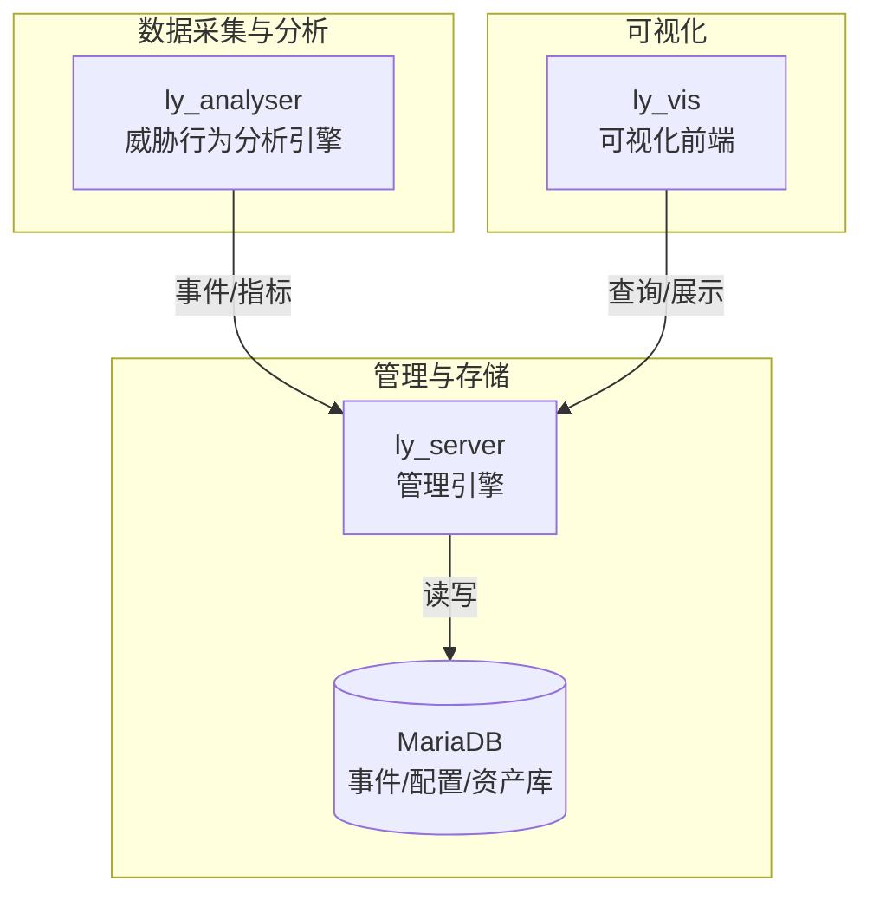
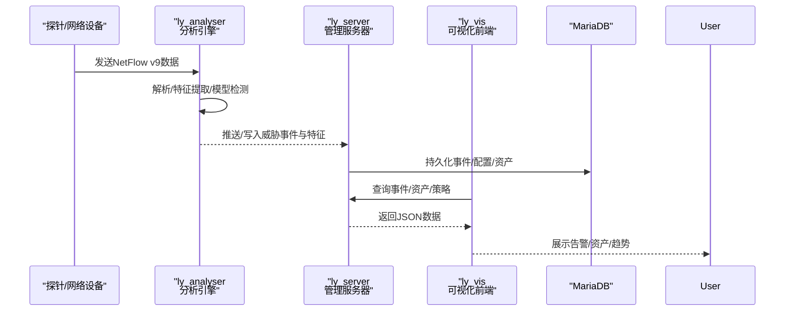
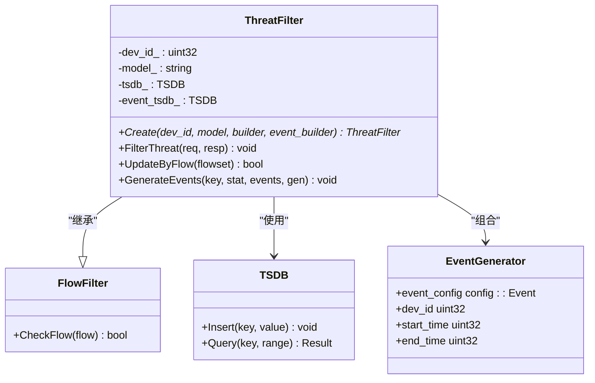
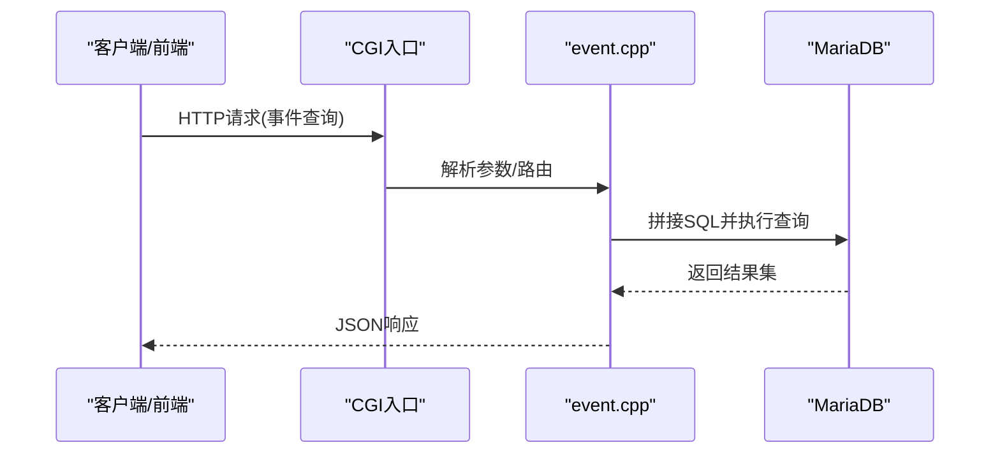
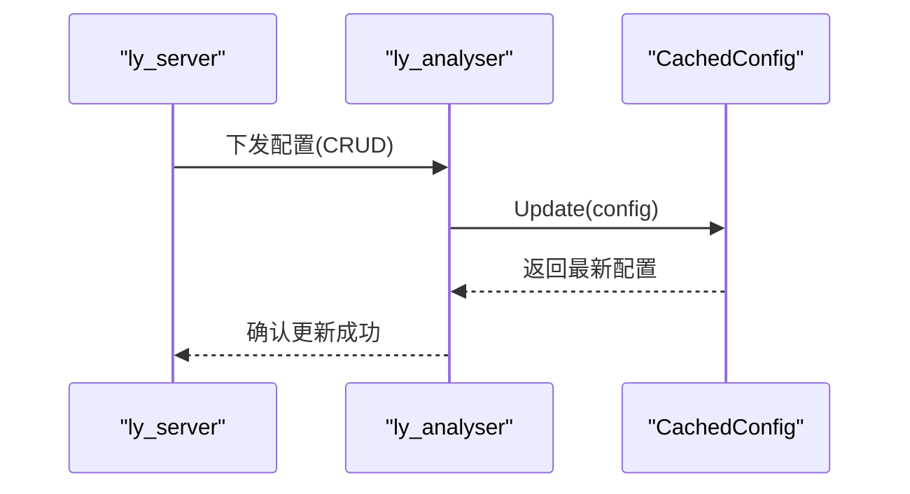
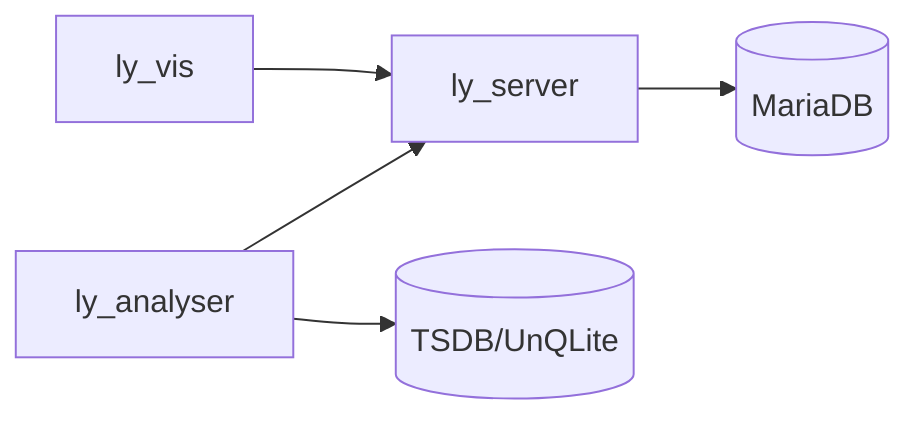

# 项目概述

<cite>
**本文引用的文件**
- [ly_analyser/README.md](file://ly_analyser/README.md)
- [ly_server/README.md](file://ly_server/README.md)
- [ly_docs/README.md](file://ly_docs/README.md)
- [threat_filter.h](file://ly_analyser/src/agent/flow/threat_filter.h)
- [event.cpp](file://ly_server/src/server/event.cpp)
- [cached_config.h](file://ly_analyser/src/agent/config/cached_config.h)
- [config_agent.cpp](file://ly_server/src/lib/config_agent.cpp)
</cite>

## 目录
1. [简介](#简介)
2. [项目结构](#项目结构)
3. [核心组件](#核心组件)
4. [架构总览](#架构总览)
5. [详细组件分析](#详细组件分析)
6. [依赖关系分析](#依赖关系分析)
7. [性能考量](#性能考量)
8. [故障排查指南](#故障排查指南)
9. [结论](#结论)
10. [附录：快速开始](#附录快速开始)

## 简介
本项目为SOC安全运营中心，围绕“网络流量采集—威胁行为分析—事件聚合管理—可视化展示”的闭环构建。系统包含三大核心模块：
- 威胁行为分析引擎（ly_analyser）：接收并解析NetFlow v9数据，运行多种检测模型（经验模型、AI、威胁情报、包检测），产出威胁事件与特征数据。
- 管理服务器（ly_server）：聚合分析引擎产出的威胁事件，提供设备/代理管理、用户与配置管理、数据查询等能力。
- 可视化前端（ly_vis）：基于Web的可视化界面，用于事件浏览、告警处置、资产与策略管理等。

设计目标：
- 以高吞吐、低延迟的方式处理海量网络流数据，实现实时威胁检测与事件生成。
- 通过统一的管理服务对多探针/代理进行集中管控与配置下发。
- 提供直观的前端界面，支持事件追踪、溯源取证与运营决策。

适用场景：
- 企业级网络安全运营中心（SOC）
- 大规模网络环境下的异常流量监测与威胁狩猎
- 合规审计与安全事件响应

主要特性：
- 多源检测模型融合：经验规则、机器学习、威胁情报、包检测
- 可扩展的检测流水线：模块化过滤器与索引机制
- 集中式配置与设备管理：支持探针接入、策略下发与状态监控
- 丰富的可视化能力：事件时间线、资产画像、风险评分与处置跟踪

## 项目结构
仓库由四个子工程组成：
- ly_analyser：威胁行为分析引擎，负责NetFlow数据解析、特征提取、威胁检测与事件生成
- ly_server：管理引擎，提供API与数据库交互，完成事件聚合、设备/代理管理、配置管理
- ly_vis：可视化前端，React/MobX技术栈，提供事件与资产的交互式展示
- ly_docs：文档站点（Hugo），用于产品与部署说明

图表来源
- [ly_analyser/README.md:1-212](file://ly_analyser/README.md#L1-L212)
- [ly_server/README.md:1-233](file://ly_server/README.md#L1-L233)
- [ly_docs/README.md:1-40](file://ly_docs/README.md#L1-L40)

章节来源
- [ly_analyser/README.md:1-212](file://ly_analyser/README.md#L1-L212)
- [ly_server/README.md:1-233](file://ly_server/README.md#L1-L233)
- [ly_docs/README.md:1-40](file://ly_docs/README.md#L1-L40)

## 核心组件
- 威胁行为分析引擎（ly_analyser）
  - 输入：NetFlow v9格式的网络流数据
  - 处理：解析、特征提取、多模型检测（扫描、DGA、DNS隧道、ICMP隧道、外联、挖矿、注入等）
  - 输出：威胁事件与特征数据，供后续取证与分析
- 管理服务器（ly_server）
  - 功能：事件聚合查询、设备/代理管理、用户与配置管理、数据查询接口
  - 存储：MariaDB持久化事件、配置、资产信息
- 可视化前端（ly_vis）
  - 功能：事件列表、详情、资产画像、风险评分、白名单/黑名单管理、策略配置
  - 技术：React、MobX、HTTP API调用后端

章节来源
- [ly_analyser/README.md:1-212](file://ly_analyser/README.md#L1-L212)
- [ly_server/README.md:1-233](file://ly_server/README.md#L1-L233)

## 架构总览
整体数据流向：
- 探针/网络设备发送NetFlow v9到分析引擎
- 分析引擎解析并运行检测模型，生成威胁事件与特征
- 管理服务器聚合事件，提供查询与管理API
- 前端通过API获取数据并进行可视化展示

图表来源
- [ly_analyser/README.md:1-212](file://ly_analyser/README.md#L1-L212)
- [ly_server/README.md:1-233](file://ly_server/README.md#L1-L233)

## 详细组件分析

### 威胁行为分析引擎（ly_analyser）
- 数据接收与解析：集成nfdump工具，接收并解析NetFlow v9数据
- 检测模型：
  - 经验模型：基于阈值与规则
  - AI模型：机器学习识别异常模式
  - 威胁情报：匹配已知恶意IP/域名/URL
  - 包检测：深度包检测识别攻击载荷
- 事件生成与存储：将检测结果转化为标准事件结构，写入时序/关系数据库，便于后续聚合与查询

关键类与职责（基于源码结构）：
- ThreatFilter：继承FlowFilter，负责按模型过滤流量、统计威胁、生成事件
- EventGenerator：封装事件生成所需配置与时间窗口
- TSDB：时序数据库抽象，用于存储威胁统计与事件明细

图表来源
- [threat_filter.h:26-111](file://ly_analyser/src/agent/flow/threat_filter.h#L26-L111)

章节来源
- [threat_filter.h:26-111](file://ly_analyser/src/agent/flow/threat_filter.h#L26-L111)
- [ly_analyser/README.md:1-212](file://ly_analyser/README.md#L1-L212)

### 管理服务器（ly_server）
- 事件聚合与查询：提供原始事件与聚合事件的查询接口，支持时间范围、类型、级别等多条件筛选
- 配置与设备管理：支持代理/设备增删改查、控制器参数管理，校验请求参数并落库
- 数据存储：通过cppdb访问MariaDB，执行SQL语句并返回JSON结果

关键流程（事件查询）：
- 解析HTTP请求参数
- 动态拼接SQL查询条件
- 执行查询并将结果序列化为JSON
- 错误捕获与日志记录

图表来源
- [event.cpp:192-357](file://ly_server/src/server/event.cpp#L192-L357)

章节来源
- [event.cpp:192-357](file://ly_server/src/server/event.cpp#L192-L357)
- [ly_server/README.md:1-233](file://ly_server/README.md#L1-L233)

### 配置缓存与下发（ly_analyser + ly_server）
- 分析引擎侧提供配置缓存接口，支持从远程或本地加载配置，并按MO（管理对象）ID拉取过滤规则
- 管理服务器侧提供配置CRUD接口，支持设备与控制器参数的增删改查与校验

图表来源
- [cached_config.h:11-26](file://ly_analyser/src/agent/config/cached_config.h#L11-L26)
- [config_agent.cpp:33-66](file://ly_server/src/lib/config_agent.cpp#L33-L66)

章节来源
- [cached_config.h:11-26](file://ly_analyser/src/agent/config/cached_config.h#L11-L26)
- [config_agent.cpp:33-66](file://ly_server/src/lib/config_agent.cpp#L33-L66)

### 可视化前端（ly_vis）
- 事件阶段分类：探测、渗透、沦陷、未知，便于运营人员理解攻击链路
- 数据处理：对威胁情报、端口、资产信息进行聚合与排序，提升展示效率
- 配置页面：支持追踪事件告警规则的配置，包括通讯目标、阈值等

章节来源
- [ly_vis packages/std/src/utils/methods-event.js:43-140](file://ly_vis/packages/std/src/utils/methods-event.js#L43-L140)
- [ly_vis packages/std/src/utils/methods-data.js:258-377](file://ly_vis/packages/std/src/utils/methods-data.js#L258-L377)

## 依赖关系分析
- 外部依赖
  - 操作系统：CentOS 7 x86_64 Minimal
  - 编译工具链：gcc/g++、cmake、bison/flex
  - 数据库：MariaDB（服务端）、UnQLite/Timeseries（分析引擎内部）
  - 网络与抓包：libpcap、nfdump（NetFlow v9）
  - 其他：protobuf、boost、json-c、httpd（CGI）
- 组件耦合
  - ly_analyser与ly_server通过HTTP/CGI与数据库进行解耦通信
  - ly_vis仅依赖ly_server提供的REST/CGI接口，不直接访问数据库
  - 配置缓存降低频繁读取配置的开销，提高分析引擎性能

图表来源
- [ly_analyser/README.md:29-95](file://ly_analyser/README.md#L29-L95)
- [ly_server/README.md:21-77](file://ly_server/README.md#L21-L77)

章节来源
- [ly_analyser/README.md:29-95](file://ly_analyser/README.md#L29-L95)
- [ly_server/README.md:21-77](file://ly_server/README.md#L21-L77)

## 性能考量
- 高吞吐数据流处理：采用nfdump与内存映射文件，减少IO瓶颈
- 多线程与线程池：通用工具库提供线程池，提升并发处理能力
- 缓存机制：配置缓存与特征缓存降低重复计算与查询开销
- 数据库优化：合理索引与分页查询，避免全表扫描
- 模型选择：根据业务需求平衡经验模型与AI模型的精度与性能

## 故障排查指南
- 常见问题
  - 端口未开放：确保防火墙放行对应端口（如分析引擎10081、管理服务器18080）
  - SELinux阻止：临时关闭SELinux或调整策略
  - 数据库连接失败：检查MariaDB服务状态与配置文件
  - CGI脚本权限：确保Apache可执行CGI脚本且路径正确
- 日志与调试
  - 分析引擎与服务端均提供错误日志输出，定位具体异常
  - 可通过CGI参数开启调试模式，查看请求与响应细节

章节来源
- [ly_analyser/README.md:130-184](file://ly_analyser/README.md#L130-L184)
- [ly_server/README.md:107-193](file://ly_server/README.md#L107-L193)
- [event.cpp:184-186](file://ly_server/src/server/event.cpp#L184-L186)
- [event.cpp:312-321](file://ly_server/src/server/event.cpp#L312-L321)

## 结论
本SOC平台以“分析—管理—展示”三层架构为核心，具备高吞吐、可扩展、易运维的特点。通过多模型融合的威胁检测能力与集中式配置管理，能够支撑复杂网络环境下的安全运营需求。建议在生产环境中结合业务规模进行容量规划与性能调优，并建立完善的监控与告警机制。

## 附录：快速开始
- 环境要求
  - 操作系统：CentOS 7 x86_64 Minimal
  - 编译工具：gcc/g++、cmake、bison/flex
  - 数据库：MariaDB（服务端）、UnQLite/Timeseries（分析引擎）
  - 网络：开放必要端口（分析引擎10081、管理服务器18080）
- 安装步骤（概览）
  - 安装依赖组件与第三方库
  - 编译common、lib、server/agent模块
  - 配置HTTPD与CGI脚本
  - 初始化数据库并导入初始数据
  - 启动nfcapd接收NetFlow数据
  - 启动定时任务（配置下发与事件生成）
- 基本配置
  - 设置语言与时区
  - 关闭SELinux并开放防火墙端口
  - 配置数据库连接与认证
  - 配置探针/代理设备与控制器参数

章节来源
- [ly_analyser/README.md:29-184](file://ly_analyser/README.md#L29-L184)
- [ly_server/README.md:21-204](file://ly_server/README.md#L21-L204)